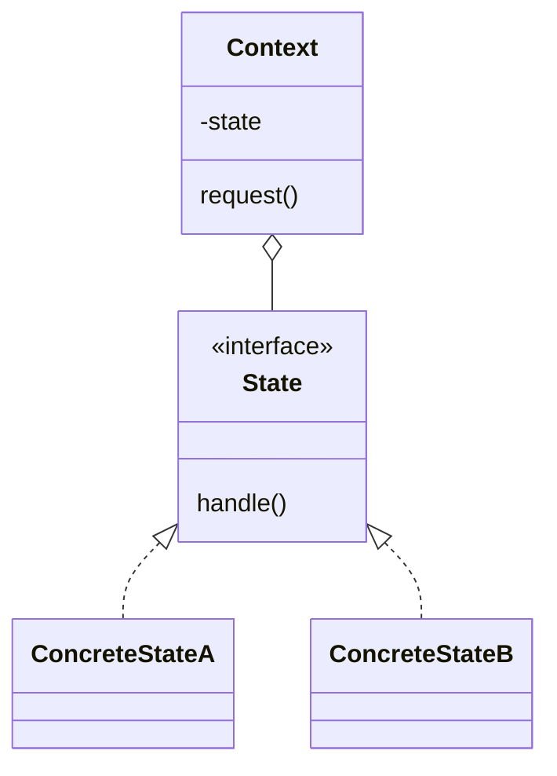

# Состояние (State)

**State** позволяет объекту изменять свое поведение в зависимости от внутреннего состояния. Извне создается впечатление, что изменился класс объекта.

## Полезные ссылки

### Официальная документация
- [Java Enum](https://docs.oracle.com/en/java/javase/17/docs/api/java.base/java/lang/Enum.html)
- [Java State Pattern in JDK](https://docs.oracle.com/javase/tutorial/)

### См. также
- [Java Concurrency](../../languages/java/java-concurrency-basics.md) — **Java Concurrency**
- [Spring State Machine](https://spring.io/projects/spring-statemachine) — **Spring State Machine**
- [Strategy](strategy.md) — **Strategy Pattern**

- [Итератор (Iterator)](iterator.md)
- [Посетитель (Visitor)](visitor.md)
- [Интерпретатор (Interpreter)](interpreter.md)
## Содержание

- [Суть и запомнить](#суть-и-запомнить)
- [Что такое State?](#что-такое-state)
  - [Основные характеристики](#основные-характеристики)
  - [Проблемы, которые решает](#проблемы-которые-решает)
- [Когда использовать State?](#когда-использовать-state)
  - [Подходящие сценарии](#подходящие-сценарии)
  - [Признаки необходимости](#признаки-необходимости)
- [Структура паттерна](#структура-паттерна)
  - [Компоненты](#компоненты)
- [Реализация на Java](#реализация-на-java)
  - [Классический State](#классический-state)
  - [State с Java Enum](#state-с-java-enum)
  - [State с историей и переходами](#state-с-историей-и-переходами)
- [Продвинутые реализации](#продвинутые-реализации)
  - [1. State с Spring](#1-state-с-spring)
  - [2. Hierarchical State Machine](#2-hierarchical-state-machine)
- [Примеры использования](#примеры-использования)
  - [1. TCP Connection State](#1-tcp-connection-state)
  - [2. ATM Machine State](#2-atm-machine-state)
  - [3. Document Workflow](#3-document-workflow)
- [Лучшие практики](#лучшие-практики)
  - [1. SOLID Principles](#1-solid-principles)
  - [2. Testing State Pattern](#2-testing-state-pattern)
- [Решение проблем](#решение-проблем)
- [Частые вопросы](#частые-вопросы)
- [Заключение](#заключение)

## Суть и запомнить

**Суть в одном предложении:** Поведение объекта зависит от внутреннего состояния; каждое состояние — отдельный класс, контекст делегирует вызовы текущему состоянию.

**Запомнить:**
- Context хранит ссылку на State и делегирует ему запросы; состояния переключают контекст в другое состояние.
- Вместо больших if/switch по состоянию — полиморфизм состояний.
- Часто реализуют через enum или иерархию классов.

**Когда применять:** конечный автомат (TCP, ATM, документооборот), разное поведение в зависимости от режима.

## Что такое State?

**State** — это поведенческий паттерн проектирования, который позволяет объекту изменять свое поведение при изменении его внутреннего состояния. При этом создается впечатление, что изменился класс объекта.

### Основные характеристики

1. **Инкапсуляция состояний**: Каждое состояние в отдельном классе
2. **Динамическое поведение**: Поведение меняется в зависимости от состояния
3. **Изоляция состояний**: Состояния не знают друг о друге
4. **Контекст**: Объект, поведение которого меняется
5. **Переходы**: Управление переходами между состояниями

### Проблемы, которые решает

Сравнение: множество if/**else** по состоянию vs классы состояний(ConnectionState).

```java
// Плохо: Множество условных операторов
public class TCPConnection {

    private static final int CLOSED = 0;
    private static final int LISTEN = 1;
    private static final int ESTABLISHED = 2;

    private int state = CLOSED;

    public void open() {
        if (state == CLOSED) {
            state = LISTEN;
            System.out.println("Connection opened, listening...");
        } else if (state == LISTEN) {
            System.out.println("Already listening");
        } else if (state == ESTABLISHED) {
            System.out.println("Already connected");
        }
    }

    public void connect() {
        if (state == CLOSED) {
            System.out.println("Cannot connect: connection is closed");
        } else if (state == LISTEN) {
            state = ESTABLISHED;
            System.out.println("Connection established");
        } else if (state == ESTABLISHED) {
            System.out.println("Already connected");
        }
    }

    public void close() {
        if (state == CLOSED) {
            System.out.println("Already closed");
        } else {
            state = CLOSED;
            System.out.println("Connection closed");
        }
    }
}

// Хорошо: State паттерн
public class TCPConnection {
    private ConnectionState state;

    public TCPConnection() {
        this.state = new ClosedState();
    }

    public void setState(ConnectionState state) {
        this.state = state;
    }

    public void open() {
        state.open(this);
    }

    public void connect() {
        state.connect(this);
    }

    public void close() {
        state.close(this);
    }
}

interface ConnectionState {
    void open(TCPConnection connection);
    void connect(TCPConnection connection);
    void close(TCPConnection connection);
}

class ClosedState implements ConnectionState {
    @Override
    public void open(TCPConnection connection) {
        connection.setState(new ListenState());
        System.out.println("Connection opened, listening...");
    }

    @Override
    public void connect(TCPConnection connection) {
        System.out.println("Cannot connect: connection is closed");
    }

    @Override
    public void close(TCPConnection connection) {
        System.out.println("Already closed");
    }
}

class ListenState implements ConnectionState {
    @Override
    public void open(TCPConnection connection) {
        System.out.println("Already listening");
    }

    @Override
    public void connect(TCPConnection connection) {
        connection.setState(new EstablishedState());
        System.out.println("Connection established");
    }

    @Override
    public void close(TCPConnection connection) {
        connection.setState(new ClosedState());
        System.out.println("Connection closed");
    }
}
```

## Когда использовать State?

### Подходящие сценарии

- **Конечные автоматы**: Системы с четко определенными состояниями
- **UI компоненты**: Кнопки, формы в разных состояниях
- **Сетевые протоколы**: **TCP**, **HTTP** состояния
- **Игровые объекты**: Персонажи, уровни
- **Бизнес процессы**: Заказы, документы в **workflow**
- **Динамическое поведение**: Объекты, меняющие поведение со временем

### Признаки необходимости

```java
// Признаки: Много состояний с разным поведением
public class OrderProcessor {

    enum OrderStatus {
        NEW, CONFIRMED, PAID, SHIPPED, DELIVERED, CANCELLED
    }

    private OrderStatus status = OrderStatus.NEW;

    // Плохо: Все состояния в одном классе
    public void confirm() {
        if (status == OrderStatus.NEW) {
            status = OrderStatus.CONFIRMED;
            sendConfirmationEmail();
        } else if (status == OrderStatus.CONFIRMED) {
            throw new IllegalStateException("Already confirmed");
        } else if (status == OrderStatus.PAID) {
            throw new IllegalStateException("Cannot confirm paid order");
        }
        // ... еще много условий
    }

    public void pay() {
        if (status == OrderStatus.CONFIRMED) {
            status = OrderStatus.PAID;
            processPayment();
        } else if (status == OrderStatus.NEW) {
            throw new IllegalStateException("Order must be confirmed first");
        } else if (status == OrderStatus.PAID) {
            throw new IllegalStateException("Already paid");
        }
        // ... еще условия
    }
}

// Хорошо: Каждое состояние - отдельный класс
public class OrderProcessor {
    private OrderState state;

    public OrderProcessor() {
        this.state = new NewOrderState();
    }

    public void confirm() {
        state.confirm(this);
    }

    public void pay() {
        state.pay(this);
    }

    public void ship() {
        state.ship(this);
    }

    public void deliver() {
        state.deliver(this);
    }

    public void cancel() {
        state.cancel(this);
    }

    public void setState(OrderState state) {
        this.state = state;
    }
}
```

## Структура паттерна



### Компоненты

1. **Context**: Контекст, поведение которого должно изменяться в зависимости от состояния
2. **State**: Интерфейс, определяющий поведение состояний
3. **ConcreteState**: Конкретные реализации состояний
4. **Client**: Код, использующий контекст

## Реализация на Java

### Классический State

```java
// State интерфейс
interface OrderState {
    void confirm(OrderProcessor processor);
    void pay(OrderProcessor processor);
    void ship(OrderProcessor processor);
    void deliver(OrderProcessor processor);
    void cancel(OrderProcessor processor);
    String getStateName();
}

// Context
class OrderProcessor {
    private OrderState state;
    private final Order order;

    public OrderProcessor(Order order) {
        this.order = order;
        this.state = new NewOrderState();
    }

    public void setState(OrderState state) {
        this.state = state;
        System.out.println("Order " + order.getId() + " state changed to: " + state.getStateName());
    }

    public void confirm() { state.confirm(this); }
    public void pay() { state.pay(this); }
    public void ship() { state.ship(this); }
    public void deliver() { state.deliver(this); }
    public void cancel() { state.cancel(this); }

    public Order getOrder() { return order; }
    public String getCurrentStateName() { return state.getStateName(); }
}

// Concrete States
class NewOrderState implements OrderState {
    @Override
    public void confirm(OrderProcessor processor) {
        System.out.println("Confirming order...");
        processor.setState(new ConfirmedOrderState());
    }

    @Override
    public void pay(OrderProcessor processor) {
        throw new IllegalStateException("Cannot pay unconfirmed order");
    }

    @Override
    public void ship(OrderProcessor processor) {
        throw new IllegalStateException("Cannot ship unconfirmed order");
    }

    @Override
    public void deliver(OrderProcessor processor) {
        throw new IllegalStateException("Cannot deliver unconfirmed order");
    }

    @Override
    public void cancel(OrderProcessor processor) {
        System.out.println("Cancelling new order...");
        processor.setState(new CancelledOrderState());
    }

    @Override
    public String getStateName() { return "NEW"; }
}

class ConfirmedOrderState implements OrderState {
    @Override
    public void confirm(OrderProcessor processor) {
        throw new IllegalStateException("Order already confirmed");
    }

    @Override
    public void pay(OrderProcessor processor) {
        System.out.println("Processing payment...");
        processor.setState(new PaidOrderState());
    }

    @Override
    public void ship(OrderProcessor processor) {
        throw new IllegalStateException("Cannot ship unpaid order");
    }

    @Override
    public void deliver(OrderProcessor processor) {
        throw new IllegalStateException("Cannot deliver unpaid order");
    }

    @Override
    public void cancel(OrderProcessor processor) {
        System.out.println("Cancelling confirmed order...");
        processor.setState(new CancelledOrderState());
    }

    @Override
    public String getStateName() { return "CONFIRMED"; }
}

class PaidOrderState implements OrderState {
    @Override
    public void confirm(OrderProcessor processor) {
        throw new IllegalStateException("Order already confirmed");
    }

    @Override
    public void pay(OrderProcessor processor) {
        throw new IllegalStateException("Order already paid");
    }

    @Override
    public void ship(OrderProcessor processor) {
        System.out.println("Shipping order...");
        processor.setState(new ShippedOrderState());
    }

    @Override
    public void deliver(OrderProcessor processor) {
        throw new IllegalStateException("Cannot deliver unshipped order");
    }

    @Override
    public void cancel(OrderProcessor processor) {
        System.out.println("Cancelling paid order (refund will be processed)...");
        processor.setState(new CancelledOrderState());
    }

    @Override
    public String getStateName() { return "PAID"; }
}

class ShippedOrderState implements OrderState {
    @Override
    public void confirm(OrderProcessor processor) {
        throw new IllegalStateException("Order already confirmed");
    }

    @Override
    public void pay(OrderProcessor processor) {
        throw new IllegalStateException("Order already paid");
    }

    @Override
    public void ship(OrderProcessor processor) {
        throw new IllegalStateException("Order already shipped");
    }

    @Override
    public void deliver(OrderProcessor processor) {
        System.out.println("Order delivered...");
        processor.setState(new DeliveredOrderState());
    }

    @Override
    public void cancel(OrderProcessor processor) {
        throw new IllegalStateException("Cannot cancel shipped order");
    }

    @Override
    public String getStateName() { return "SHIPPED"; }
}

class DeliveredOrderState implements OrderState {
    @Override
    public void confirm(OrderProcessor processor) {
        throw new IllegalStateException("Order already confirmed");
    }

    @Override
    public void pay(OrderProcessor processor) {
        throw new IllegalStateException("Order already paid");
    }

    @Override
    public void ship(OrderProcessor processor) {
        throw new IllegalStateException("Order already shipped");
    }

    @Override
    public void deliver(OrderProcessor processor) {
        throw new IllegalStateException("Order already delivered");
    }

    @Override
    public void cancel(OrderProcessor processor) {
        throw new IllegalStateException("Cannot cancel delivered order");
    }

    @Override
    public String getStateName() { return "DELIVERED"; }
}

class CancelledOrderState implements OrderState {
    @Override
    public void confirm(OrderProcessor processor) {
        throw new IllegalStateException("Cannot confirm cancelled order");
    }

    @Override
    public void pay(OrderProcessor processor) {
        throw new IllegalStateException("Cannot pay cancelled order");
    }

    @Override
    public void ship(OrderProcessor processor) {
        throw new IllegalStateException("Cannot ship cancelled order");
    }

    @Override
    public void deliver(OrderProcessor processor) {
        throw new IllegalStateException("Cannot deliver cancelled order");
    }

    @Override
    public void cancel(OrderProcessor processor) {
        throw new IllegalStateException("Order already cancelled");
    }

    @Override
    public String getStateName() { return "CANCELLED"; }
}

// Domain object
class Order {
    private final String id;
    private final String customerId;
    private final BigDecimal amount;

    public Order(String id, String customerId, BigDecimal amount) {
        this.id = id;
        this.customerId = customerId;
        this.amount = amount;
    }

    public String getId() { return id; }
    public String getCustomerId() { return customerId; }
    public BigDecimal getAmount() { return amount; }
}

public class OrderStateDemo {
    public static void main(String[] args) {
        Order order = new Order("ORD-001", "CUST-123", BigDecimal.valueOf(99.99));
        OrderProcessor processor = new OrderProcessor(order);

        System.out.println("Initial state: " + processor.getCurrentStateName());

        try {
            processor.confirm();
            processor.pay();
            processor.ship();
            processor.deliver();

            System.out.println("Final state: " + processor.getCurrentStateName());
        } catch (IllegalStateException e) {
            System.err.println("Error: " + e.getMessage());
        }

        // Попытка некорректного перехода
        System.out.println("\nTrying invalid transition:");
        try {
            processor.pay(); // Уже оплачен
        } catch (IllegalStateException e) {
            System.err.println("Error: " + e.getMessage());
        }
    }
}
```

### State с Java Enum

```java
// State с использованием Enum
enum VendingMachineState {
    NO_COIN {
        @Override
        public void insertCoin(VendingMachine machine) {
            System.out.println("Coin inserted");
            machine.addCoin();
            machine.setState(HAS_COIN);
        }

        @Override
        public void ejectCoin(VendingMachine machine) {
            System.out.println("No coin to eject");
        }

        @Override
        public void selectItem(VendingMachine machine) {
            System.out.println("Insert coin first");
        }

        @Override
        public void dispense(VendingMachine machine) {
            System.out.println("Insert coin first");
        }
    },

    HAS_COIN {
        @Override
        public void insertCoin(VendingMachine machine) {
            System.out.println("Coin already inserted");
            machine.addCoin();
        }

        @Override
        public void ejectCoin(VendingMachine machine) {
            System.out.println("Coin ejected");
            machine.resetCoins();
            machine.setState(NO_COIN);
        }

        @Override
        public void selectItem(VendingMachine machine) {
            if (machine.getCoins() >= machine.getItemPrice()) {
                System.out.println("Item selected");
                machine.setState(ITEM_SELECTED);
            } else {
                System.out.println("Insufficient coins");
            }
        }

        @Override
        public void dispense(VendingMachine machine) {
            System.out.println("Select item first");
        }
    },

    ITEM_SELECTED {
        @Override
        public void insertCoin(VendingMachine machine) {
            System.out.println("Coin inserted");
            machine.addCoin();
        }

        @Override
        public void ejectCoin(VendingMachine machine) {
            System.out.println("Cannot eject coin after selection");
        }

        @Override
        public void selectItem(VendingMachine machine) {
            System.out.println("Item already selected");
        }

        @Override
        public void dispense(VendingMachine machine) {
            System.out.println("Dispensing item");
            machine.deductCoins();
            machine.setState(NO_COIN);
        }
    };

    public abstract void insertCoin(VendingMachine machine);
    public abstract void ejectCoin(VendingMachine machine);
    public abstract void selectItem(VendingMachine machine);
    public abstract void dispense(VendingMachine machine);
}

// Context
class VendingMachine {
    private VendingMachineState state = VendingMachineState.NO_COIN;
    private int coins = 0;
    private final int itemPrice = 5;

    public void setState(VendingMachineState state) {
        this.state = state;
    }

    public void insertCoin() {
        state.insertCoin(this);
    }

    public void ejectCoin() {
        state.ejectCoin(this);
    }

    public void selectItem() {
        state.selectItem(this);
    }

    public void dispense() {
        state.dispense(this);
    }

    public void addCoin() {
        coins++;
    }

    public void resetCoins() {
        coins = 0;
    }

    public void deductCoins() {
        coins -= itemPrice;
    }

    public int getCoins() { return coins; }
    public int getItemPrice() { return itemPrice; }
    public VendingMachineState getState() { return state; }
}

public class VendingMachineDemo {
    public static void main(String[] args) {
        VendingMachine machine = new VendingMachine();

        System.out.println("Initial state: " + machine.getState());

        machine.insertCoin();
        machine.selectItem();
        machine.dispense();

        System.out.println("\nTrying another purchase:");
        machine.insertCoin();
        machine.insertCoin(); // Добавляем еще монету
        machine.selectItem();
        machine.dispense();

        System.out.println("\nTrying to eject coin after selection:");
        machine.insertCoin();
        machine.selectItem();
        machine.ejectCoin(); // Не должно сработать
    }
}
```

### State с историей и переходами

```java
// State с историей переходов
class StateMachine {
    private final Deque<StateTransition> history = new LinkedList<>();
    private State currentState;
    private final Map<State, Map<String, State>> transitions = new HashMap<>();

    public StateMachine(State initialState) {
        this.currentState = initialState;
    }

    public void addTransition(State fromState, String event, State toState) {
        transitions.computeIfAbsent(fromState, k -> new HashMap<>()).put(event, toState);
    }

    public void trigger(String event) {
        Map<String, State> stateTransitions = transitions.get(currentState);
        if (stateTransitions != null) {
            State nextState = stateTransitions.get(event);
            if (nextState != null) {
                State previousState = currentState;
                currentState = nextState;

                StateTransition transition = new StateTransition(previousState, event, nextState);
                history.push(transition);

                System.out.println("Transition: " + previousState.getName() +
                    " --[" + event + "]--> " + nextState.getName());

                // Вызываем обработчики состояний
                previousState.onExit();
                nextState.onEnter();
            } else {
                throw new IllegalStateException("Invalid transition: " + currentState.getName() + " --[" + event + "]--> ?");
            }
        }
    }

    public boolean canTrigger(String event) {
        Map<String, State> stateTransitions = transitions.get(currentState);
        return stateTransitions != null && stateTransitions.containsKey(event);
    }

    public State getCurrentState() { return currentState; }

    public List<StateTransition> getHistory() {
        return new ArrayList<>(history);
    }

    public void undo() {
        if (!history.isEmpty()) {
            StateTransition lastTransition = history.pop();
            currentState = lastTransition.getFromState();

            System.out.println("Undo: " + lastTransition.getToState().getName() +
                " --[" + lastTransition.getEvent() + "]--> " + currentState.getName());

            lastTransition.getToState().onExit();
            currentState.onEnter();
        }
    }

    static class StateTransition {
        private final State fromState;
        private final String event;
        private final State toState;

        public StateTransition(State fromState, String event, State toState) {
            this.fromState = fromState;
            this.event = event;
            this.toState = toState;
        }

        public State getFromState() { return fromState; }
        public String getEvent() { return event; }
        public State getToState() { return toState; }
    }
}

interface State {
    String getName();
    void onEnter();
    void onExit();
    default void onEvent(String event) {
        // Default implementation
    }
}

// Concrete States для документа
class DraftState implements State {
    @Override
    public String getName() { return "DRAFT"; }

    @Override
    public void onEnter() {
        System.out.println("Document entered draft state");
    }

    @Override
    public void onExit() {
        System.out.println("Document leaving draft state");
    }
}

class ReviewState implements State {
    @Override
    public String getName() { return "REVIEW"; }

    @Override
    public void onEnter() {
        System.out.println("Document sent for review");
    }

    @Override
    public void onExit() {
        System.out.println("Document leaving review state");
    }
}

class ApprovedState implements State {
    @Override
    public String getName() { return "APPROVED"; }

    @Override
    public void onEnter() {
        System.out.println("Document approved");
    }

    @Override
    public void onExit() {
        System.out.println("Document leaving approved state");
    }
}

class PublishedState implements State {
    @Override
    public String getName() { return "PUBLISHED"; }

    @Override
    public void onEnter() {
        System.out.println("Document published");
    }

    @Override
    public void onExit() {
        System.out.println("Document leaving published state");
    }
}

public class StateMachineDemo {
    public static void main(String[] args) {
        // Создаем состояния
        State draft = new DraftState();
        State review = new ReviewState();
        State approved = new ApprovedState();
        State published = new PublishedState();

        // Создаем машину состояний
        StateMachine sm = new StateMachine(draft);

        // Определяем переходы
        sm.addTransition(draft, "submit", review);
        sm.addTransition(review, "approve", approved);
        sm.addTransition(review, "reject", draft);
        sm.addTransition(approved, "publish", published);
        sm.addTransition(published, "archive", draft);

        // Выполняем переходы
        sm.trigger("submit");
        sm.trigger("approve");
        sm.trigger("publish");

        System.out.println("\nHistory:");
        sm.getHistory().forEach(t ->
            System.out.println(t.getFromState().getName() + " -> " + t.getToState().getName()));

        // Undo
        System.out.println("\nUndo:");
        sm.undo();
        sm.undo();

        System.out.println("Current state: " + sm.getCurrentState().getName());
    }
}
```

## Продвинутые реализации

### 1. State с Spring

```java
// Spring State Machine
@Configuration
@EnableStateMachine
public class OrderStateMachineConfig extends StateMachineConfigurerAdapter<OrderStates, OrderEvents> {

    @Override
    public void configure(StateMachineStateConfigurer<OrderStates, OrderEvents> states) throws Exception {
        states
            .withStates()
                .initial(OrderStates.NEW)
                .state(OrderStates.CONFIRMED)
                .state(OrderStates.PAID)
                .state(OrderStates.SHIPPED)
                .state(OrderStates.DELIVERED)
                .end(OrderStates.CANCELLED);
    }

    @Override
    public void configure(StateMachineTransitionConfigurer<OrderStates, OrderEvents> transitions) throws Exception {
        transitions
            .withExternal()
                .source(OrderStates.NEW).target(OrderStates.CONFIRMED).event(OrderEvents.CONFIRM)
                .and()
            .withExternal()
                .source(OrderStates.CONFIRMED).target(OrderStates.PAID).event(OrderEvents.PAY)
                .and()
            .withExternal()
                .source(OrderStates.PAID).target(OrderStates.SHIPPED).event(OrderEvents.SHIP)
                .and()
            .withExternal()
                .source(OrderStates.SHIPPED).target(OrderStates.DELIVERED).event(OrderEvents.DELIVER)
                .and()
            .withExternal()
                .source(OrderStates.NEW).target(OrderStates.CANCELLED).event(OrderEvents.CANCEL)
                .and()
            .withExternal()
                .source(OrderStates.CONFIRMED).target(OrderStates.CANCELLED).event(OrderEvents.CANCEL);
    }

    @Override
    public void configure(StateMachineConfigurationConfigurer<OrderStates, OrderEvents> config) throws Exception {
        config
            .withConfiguration()
                .autoStartup(true)
                .listener(new OrderStateMachineListener());
    }
}

enum OrderStates {
    NEW, CONFIRMED, PAID, SHIPPED, DELIVERED, CANCELLED
}

enum OrderEvents {
    CONFIRM, PAY, SHIP, DELIVER, CANCEL
}

@Service
public class OrderService {

    @Autowired
    private StateMachine<OrderStates, OrderEvents> stateMachine;

    public void confirmOrder(String orderId) {
        stateMachine.sendEvent(OrderEvents.CONFIRM);
    }

    public void payOrder(String orderId) {
        stateMachine.sendEvent(OrderEvents.PAY);
    }

    public void shipOrder(String orderId) {
        stateMachine.sendEvent(OrderEvents.SHIP);
    }

    public void deliverOrder(String orderId) {
        stateMachine.sendEvent(OrderEvents.DELIVER);
    }

    public void cancelOrder(String orderId) {
        stateMachine.sendEvent(OrderEvents.CANCEL);
    }
}

public class OrderStateMachineListener extends StateMachineListenerAdapter<OrderStates, OrderEvents> {

    @Override
    public void stateChanged(State<OrderStates, OrderEvents> from, State<OrderStates, OrderEvents> to) {
        System.out.println("Order state changed from " + from.getId() + " to " + to.getId());
    }

    @Override
    public void eventNotAccepted(Message<OrderEvents> event) {
        System.err.println("Event " + event.getPayload() + " not accepted in current state");
    }
}
```

### 2. Hierarchical State Machine

```java
// Иерархическая машина состояний
interface HierarchicalState extends State {
    HierarchicalState getParent();
    List<HierarchicalState> getChildren();
    void addChild(HierarchicalState child);
    default boolean isComposite() {
        return !getChildren().isEmpty();
    }
}

abstract class BaseHierarchicalState implements HierarchicalState {
    private final String name;
    private HierarchicalState parent;
    private final List<HierarchicalState> children = new ArrayList<>();

    protected BaseHierarchicalState(String name) {
        this.name = name;
    }

    @Override
    public String getName() { return name; }

    @Override
    public HierarchicalState getParent() { return parent; }

    public void setParent(HierarchicalState parent) {
        this.parent = parent;
    }

    @Override
    public List<HierarchicalState> getChildren() {
        return new ArrayList<>(children);
    }

    @Override
    public void addChild(HierarchicalState child) {
        children.add(child);
        child.setParent(this);
    }

    @Override
    public void onEnter() {
        System.out.println("Entering state: " + getName());
        // Входим в начальное дочернее состояние
        if (isComposite() && !children.isEmpty()) {
            children.get(0).onEnter();
        }
    }

    @Override
    public void onExit() {
        System.out.println("Exiting state: " + getName());
    }
}

// Конкретные состояния для игрового персонажа
class AliveState extends BaseHierarchicalState {
    public AliveState() {
        super("ALIVE");

        // Дочерние состояния
        addChild(new IdleState());
        addChild(new MovingState());
        addChild(new AttackingState());
    }
}

class IdleState extends BaseHierarchicalState {
    public IdleState() {
        super("IDLE");
    }

    @Override
    public void onEnter() {
        super.onEnter();
        System.out.println("Character is now idle");
    }
}

class MovingState extends BaseHierarchicalState {
    public MovingState() {
        super("MOVING");
    }

    @Override
    public void onEnter() {
        super.onEnter();
        System.out.println("Character started moving");
    }
}

class AttackingState extends BaseHierarchicalState {
    public AttackingState() {
        super("ATTACKING");

        // Дочерние состояния атаки
        addChild(new PreparingAttackState());
        addChild(new ExecutingAttackState());
    }
}

class PreparingAttackState extends BaseHierarchicalState {
    public PreparingAttackState() {
        super("PREPARING_ATTACK");
    }

    @Override
    public void onEnter() {
        super.onEnter();
        System.out.println("Preparing to attack...");
    }
}

class ExecutingAttackState extends BaseHierarchicalState {
    public ExecutingAttackState() {
        super("EXECUTING_ATTACK");
    }

    @Override
    public void onEnter() {
        super.onEnter();
        System.out.println("Executing attack!");
    }
}

class DeadState extends BaseHierarchicalState {
    public DeadState() {
        super("DEAD");
    }

    @Override
    public void onEnter() {
        super.onEnter();
        System.out.println("Character is dead");
    }
}

// Hierarchical State Machine
class HierarchicalStateMachine {
    private HierarchicalState currentState;
    private final Map<HierarchicalState, Map<String, HierarchicalState>> transitions = new HashMap<>();

    public HierarchicalStateMachine(HierarchicalState initialState) {
        this.currentState = initialState;
        initialState.onEnter();
    }

    public void addTransition(HierarchicalState fromState, String event, HierarchicalState toState) {
        transitions.computeIfAbsent(fromState, k -> new HashMap<>()).put(event, toState);
    }

    public void trigger(String event) {
        HierarchicalState nextState = findTransitionTarget(currentState, event);
        if (nextState != null) {
            exitStateHierarchy(currentState);
            HierarchicalState previousState = currentState;
            currentState = nextState;
            enterStateHierarchy(currentState);

            System.out.println("Transition: " + previousState.getName() +
                " --[" + event + "]--> " + currentState.getName());
        } else {
            System.out.println("No transition found for event '" + event + "' in state " + currentState.getName());
        }
    }

    private HierarchicalState findTransitionTarget(HierarchicalState state, String event) {
        // Проверяем переходы для текущего состояния
        Map<String, HierarchicalState> stateTransitions = transitions.get(state);
        if (stateTransitions != null && stateTransitions.containsKey(event)) {
            return stateTransitions.get(event);
        }

        // Если не найдено, проверяем у родительского состояния
        if (state.getParent() != null) {
            return findTransitionTarget(state.getParent(), event);
        }

        return null;
    }

    private void exitStateHierarchy(HierarchicalState state) {
        if (state.isComposite()) {
            // Выходим из всех дочерних состояний
            for (HierarchicalState child : state.getChildren()) {
                if (isInStateHierarchy(child)) {
                    exitStateHierarchy(child);
                }
            }
        }
        state.onExit();
    }

    private void enterStateHierarchy(HierarchicalState state) {
        state.onEnter();
        if (state.isComposite() && !state.getChildren().isEmpty()) {
            // Входим в первое дочернее состояние
            enterStateHierarchy(state.getChildren().get(0));
        }
    }

    private boolean isInStateHierarchy(HierarchicalState state) {
        HierarchicalState current = currentState;
        while (current != null) {
            if (current == state) {
                return true;
            }
            current = current.getParent();
        }
        return false;
    }

    public HierarchicalState getCurrentState() { return currentState; }

    public String getCurrentStatePath() {
        List<String> path = new ArrayList<>();
        HierarchicalState current = currentState;
        while (current != null) {
            path.add(0, current.getName());
            current = current.getParent();
        }
        return String.join(".", path);
    }
}

public class HierarchicalStateDemo {
    public static void main(String[] args) {
        // Создаем иерархию состояний
        HierarchicalState alive = new AliveState();
        HierarchicalState dead = new DeadState();

        // Создаем машину состояний
        HierarchicalStateMachine hsm = new HierarchicalStateMachine(alive);

        System.out.println("Initial state: " + hsm.getCurrentStatePath());

        // Добавляем переходы
        hsm.addTransition(alive, "die", dead);
        hsm.addTransition(dead, "revive", alive);

        // Добавляем переходы между дочерними состояниями
        IdleState idle = (IdleState) alive.getChildren().get(0);
        MovingState moving = (MovingState) alive.getChildren().get(1);
        AttackingState attacking = (AttackingState) alive.getChildren().get(2);

        hsm.addTransition(idle, "move", moving);
        hsm.addTransition(moving, "stop", idle);
        hsm.addTransition(idle, "attack", attacking);
        hsm.addTransition(attacking, "finish_attack", idle);

        // Тестируем переходы
        hsm.trigger("move");
        System.out.println("Current state: " + hsm.getCurrentStatePath());

        hsm.trigger("attack");
        System.out.println("Current state: " + hsm.getCurrentStatePath());

        hsm.trigger("finish_attack");
        System.out.println("Current state: " + hsm.getCurrentStatePath());

        hsm.trigger("die");
        System.out.println("Current state: " + hsm.getCurrentStatePath());

        hsm.trigger("revive");
        System.out.println("Current state: " + hsm.getCurrentStatePath());
    }
}
```

## Примеры использования

### 1. TCP Connection State

```java
// Полная реализация TCP-подобного соединения
enum TCPState {
    CLOSED {
        @Override
        public void open(TCPConnection connection) {
            connection.setState(LISTEN);
            System.out.println("Connection opened, listening for connections...");
        }

        @Override
        public void connect(TCPConnection connection) {
            throw new IllegalStateException("Cannot connect from CLOSED state");
        }

        @Override
        public void close(TCPConnection connection) {
            System.out.println("Already closed");
        }

        @Override
        public void send(TCPConnection connection, String data) {
            throw new IllegalStateException("Cannot send data on closed connection");
        }

        @Override
        public void receive(TCPConnection connection, String data) {
            throw new IllegalStateException("Cannot receive data on closed connection");
        }
    },

    LISTEN {
        @Override
        public void open(TCPConnection connection) {
            System.out.println("Already listening");
        }

        @Override
        public void connect(TCPConnection connection) {
            connection.setState(ESTABLISHED);
            System.out.println("Connection established");
        }

        @Override
        public void close(TCPConnection connection) {
            connection.setState(CLOSED);
            System.out.println("Connection closed from LISTEN state");
        }

        @Override
        public void send(TCPConnection connection, String data) {
            throw new IllegalStateException("Cannot send data while listening");
        }

        @Override
        public void receive(TCPConnection connection, String data) {
            System.out.println("Received connection request, establishing connection...");
            connect(connection);
        }
    },

    ESTABLISHED {
        @Override
        public void open(TCPConnection connection) {
            throw new IllegalStateException("Connection already established");
        }

        @Override
        public void connect(TCPConnection connection) {
            throw new IllegalStateException("Connection already established");
        }

        @Override
        public void close(TCPConnection connection) {
            connection.setState(CLOSED);
            System.out.println("Connection closed from ESTABLISHED state");
        }

        @Override
        public void send(TCPConnection connection, String data) {
            System.out.println("Sending data: " + data);
            connection.addToSendBuffer(data);
        }

        @Override
        public void receive(TCPConnection connection, String data) {
            System.out.println("Received data: " + data);
            connection.addToReceiveBuffer(data);
        }
    };

    public abstract void open(TCPConnection connection);
    public abstract void connect(TCPConnection connection);
    public abstract void close(TCPConnection connection);
    public abstract void send(TCPConnection connection, String data);
    public abstract void receive(TCPConnection connection, String data);
}

class TCPConnection {
    private TCPState state = TCPState.CLOSED;
    private final List<String> sendBuffer = new ArrayList<>();
    private final List<String> receiveBuffer = new ArrayList<>();

    public void setState(TCPState state) {
        this.state = state;
        System.out.println("State changed to: " + state.name());
    }

    public void open() { state.open(this); }
    public void connect() { state.connect(this); }
    public void close() { state.close(this); }
    public void send(String data) { state.send(this, data); }
    public void receive(String data) { state.receive(this, data); }

    public void addToSendBuffer(String data) {
        sendBuffer.add(data);
    }

    public void addToReceiveBuffer(String data) {
        receiveBuffer.add(data);
    }

    public List<String> getSendBuffer() { return new ArrayList<>(sendBuffer); }
    public List<String> getReceiveBuffer() { return new ArrayList<>(receiveBuffer); }
    public TCPState getState() { return state; }
}

public class TCPConnectionDemo {
    public static void main(String[] args) {
        TCPConnection connection = new TCPConnection();

        System.out.println("Initial state: " + connection.getState());

        // Устанавливаем соединение
        connection.open();
        connection.connect();

        // Обмениваемся данными
        connection.send("Hello Server!");
        connection.receive("Hello Client!");

        // Закрываем соединение
        connection.close();

        System.out.println("Send buffer: " + connection.getSendBuffer());
        System.out.println("Receive buffer: " + connection.getReceiveBuffer());
    }
}
```

### 2. ATM Machine State

```java
// ATM машина с состояниями
enum ATMState {
    IDLE {
        @Override
        public void insertCard(ATMMachine machine) {
            System.out.println("Card inserted");
            machine.setState(HAS_CARD);
        }

        @Override
        public void ejectCard(ATMMachine machine) {
            System.out.println("No card to eject");
        }

        @Override
        public void enterPin(ATMMachine machine, String pin) {
            System.out.println("Insert card first");
        }

        @Override
        public void requestCash(ATMMachine machine, int amount) {
            System.out.println("Insert card first");
        }
    },

    HAS_CARD {
        @Override
        public void insertCard(ATMMachine machine) {
            System.out.println("Card already inserted");
        }

        @Override
        public void ejectCard(ATMMachine machine) {
            System.out.println("Card ejected");
            machine.setState(IDLE);
        }

        @Override
        public void enterPin(ATMMachine machine, String pin) {
            if ("1234".equals(pin)) {
                System.out.println("PIN accepted");
                machine.setState(HAS_PIN);
            } else {
                System.out.println("Invalid PIN");
                machine.setState(IDLE);
            }
        }

        @Override
        public void requestCash(ATMMachine machine, int amount) {
            System.out.println("Enter PIN first");
        }
    },

    HAS_PIN {
        @Override
        public void insertCard(ATMMachine machine) {
            System.out.println("Card already inserted");
        }

        @Override
        public void ejectCard(ATMMachine machine) {
            System.out.println("Card ejected");
            machine.setState(IDLE);
        }

        @Override
        public void enterPin(ATMMachine machine, String pin) {
            System.out.println("PIN already entered");
        }

        @Override
        public void requestCash(ATMMachine machine, int amount) {
            if (amount <= machine.getBalance()) {
                System.out.println("Dispensing $" + amount);
                machine.deductBalance(amount);
                machine.setState(IDLE);
            } else {
                System.out.println("Insufficient funds");
                machine.setState(IDLE);
            }
        }
    };

    public abstract void insertCard(ATMMachine machine);
    public abstract void ejectCard(ATMMachine machine);
    public abstract void enterPin(ATMMachine machine, String pin);
    public abstract void requestCash(ATMMachine machine, int amount);
}

class ATMMachine {
    private ATMState state = ATMState.IDLE;
    private int balance = 1000;

    public void setState(ATMState state) {
        this.state = state;
    }

    public void insertCard() { state.insertCard(this); }
    public void ejectCard() { state.ejectCard(this); }
    public void enterPin(String pin) { state.enterPin(this, pin); }
    public void requestCash(int amount) { state.requestCash(this, amount); }

    public void deductBalance(int amount) {
        balance -= amount;
    }

    public int getBalance() { return balance; }
    public ATMState getState() { return state; }
}

public class ATMDemo {
    public static void main(String[] args) {
        ATMMachine atm = new ATMMachine();

        System.out.println("ATM balance: $" + atm.getBalance());

        // Успешная транзакция
        atm.insertCard();
        atm.enterPin("1234");
        atm.requestCash(200);

        System.out.println("Remaining balance: $" + atm.getBalance());

        // Неудачная попытка
        System.out.println("\nInvalid PIN attempt:");
        atm.insertCard();
        atm.enterPin("9999");

        // Повторная попытка
        System.out.println("\nAnother attempt:");
        atm.insertCard();
        atm.enterPin("1234");
        atm.requestCash(900); // Недостаточно средств
    }
}
```

### 3. Document Workflow

```java
// Workflow для документов
interface DocumentState {
    void submit(Document document);
    void approve(Document document);
    void reject(Document document);
    void publish(Document document);
    void archive(Document document);
    String getStateName();
}

class Document {
    private DocumentState state;
    private final String id;
    private final String title;
    private String reviewer;
    private LocalDateTime createdDate;
    private LocalDateTime lastModifiedDate;

    public Document(String id, String title) {
        this.id = id;
        this.title = title;
        this.state = new DraftState();
        this.createdDate = LocalDateTime.now();
        this.lastModifiedDate = LocalDateTime.now();
    }

    public void setState(DocumentState state) {
        this.state = state;
        this.lastModifiedDate = LocalDateTime.now();
        System.out.println("Document " + id + " state changed to: " + state.getStateName());
    }

    public void submit() { state.submit(this); }
    public void approve() { state.approve(this); }
    public void reject() { state.reject(this); }
    public void publish() { state.publish(this); }
    public void archive() { state.archive(this); }

    // Getters and setters
    public String getId() { return id; }
    public String getTitle() { return title; }
    public String getReviewer() { return reviewer; }
    public void setReviewer(String reviewer) { this.reviewer = reviewer; }
    public DocumentState getState() { return state; }
    public LocalDateTime getCreatedDate() { return createdDate; }
    public LocalDateTime getLastModifiedDate() { return lastModifiedDate; }
}

// Concrete States
class DraftState implements DocumentState {
    @Override
    public void submit(Document document) {
        System.out.println("Submitting document for review...");
        document.setState(new ReviewState());
    }

    @Override
    public void approve(Document document) {
        throw new IllegalStateException("Cannot approve draft document");
    }

    @Override
    public void reject(Document document) {
        throw new IllegalStateException("Cannot reject draft document");
    }

    @Override
    public void publish(Document document) {
        throw new IllegalStateException("Cannot publish draft document");
    }

    @Override
    public void archive(Document document) {
        System.out.println("Archiving draft document...");
        document.setState(new ArchivedState());
    }

    @Override
    public String getStateName() { return "DRAFT"; }
}

class ReviewState implements DocumentState {
    @Override
    public void submit(Document document) {
        throw new IllegalStateException("Document already submitted");
    }

    @Override
    public void approve(Document document) {
        System.out.println("Document approved by reviewer: " + document.getReviewer());
        document.setState(new ApprovedState());
    }

    @Override
    public void reject(Document document) {
        System.out.println("Document rejected by reviewer: " + document.getReviewer());
        document.setState(new DraftState());
    }

    @Override
    public void publish(Document document) {
        throw new IllegalStateException("Cannot publish unapproved document");
    }

    @Override
    public void archive(Document document) {
        System.out.println("Archiving document under review...");
        document.setState(new ArchivedState());
    }

    @Override
    public String getStateName() { return "REVIEW"; }
}

class ApprovedState implements DocumentState {
    @Override
    public void submit(Document document) {
        throw new IllegalStateException("Document already approved");
    }

    @Override
    public void approve(Document document) {
        throw new IllegalStateException("Document already approved");
    }

    @Override
    public void reject(Document document) {
        throw new IllegalStateException("Cannot reject approved document");
    }

    @Override
    public void publish(Document document) {
        System.out.println("Publishing approved document...");
        document.setState(new PublishedState());
    }

    @Override
    public void archive(Document document) {
        System.out.println("Archiving approved document...");
        document.setState(new ArchivedState());
    }

    @Override
    public String getStateName() { return "APPROVED"; }
}

class PublishedState implements DocumentState {
    @Override
    public void submit(Document document) {
        throw new IllegalStateException("Cannot submit published document");
    }

    @Override
    public void approve(Document document) {
        throw new IllegalStateException("Cannot approve published document");
    }

    @Override
    public void reject(Document document) {
        throw new IllegalStateException("Cannot reject published document");
    }

    @Override
    public void publish(Document document) {
        throw new IllegalStateException("Document already published");
    }

    @Override
    public void archive(Document document) {
        System.out.println("Archiving published document...");
        document.setState(new ArchivedState());
    }

    @Override
    public String getStateName() { return "PUBLISHED"; }
}

class ArchivedState implements DocumentState {
    @Override
    public void submit(Document document) {
        throw new IllegalStateException("Cannot submit archived document");
    }

    @Override
    public void approve(Document document) {
        throw new IllegalStateException("Cannot approve archived document");
    }

    @Override
    public void reject(Document document) {
        throw new IllegalStateException("Cannot reject archived document");
    }

    @Override
    public void publish(Document document) {
        throw new IllegalStateException("Cannot publish archived document");
    }

    @Override
    public void archive(Document document) {
        throw new IllegalStateException("Document already archived");
    }

    @Override
    public String getStateName() { return "ARCHIVED"; }
}

// Document Service
class DocumentService {
    private final Map<String, Document> documents = new HashMap<>();

    public Document createDocument(String id, String title) {
        Document doc = new Document(id, title);
        documents.put(id, doc);
        return doc;
    }

    public Document getDocument(String id) {
        return documents.get(id);
    }

    public List<Document> getDocumentsByState(DocumentState state) {
        return documents.values().stream()
            .filter(doc -> doc.getState().getClass().equals(state.getClass()))
            .collect(Collectors.toList());
    }

    public void assignReviewer(String documentId, String reviewerId) {
        Document doc = documents.get(documentId);
        if (doc != null) {
            doc.setReviewer(reviewerId);
        }
    }
}

public class DocumentWorkflowDemo {
    public static void main(String[] args) {
        DocumentService service = new DocumentService();

        // Создаем документ
        Document doc = service.createDocument("DOC-001", "Quarterly Report");
        System.out.println("Created document: " + doc.getTitle() + " in state: " + doc.getState().getStateName());

        // Workflow
        doc.submit();
        service.assignReviewer("DOC-001", "manager@example.com");
        doc.approve();
        doc.publish();

        System.out.println("Final state: " + doc.getState().getStateName());

        // Создаем еще один документ для демонстрации отклонения
        Document doc2 = service.createDocument("DOC-002", "Proposal");
        doc2.submit();
        doc2.reject();

        System.out.println("Document 2 final state: " + doc2.getState().getStateName());
    }
}
```

## Лучшие практики

### 1. SOLID Principles

```java
// Правильное применение SOLID принципов
interface State {
    void handle(Context context);
    String getName();
}

// Single Responsibility: Каждый state отвечает только за свое поведение
class ConcreteStateA implements State {
    @Override
    public void handle(Context context) {
        // Логика только для состояния A
        context.setState(new ConcreteStateB());
    }

    @Override
    public String getName() { return "STATE_A"; }
}

// Open/Closed: Новые состояния добавляются без изменения существующих
class ConcreteStateB implements State {
    @Override
    public void handle(Context context) {
        // Логика только для состояния B
        context.setState(new ConcreteStateA());
    }

    @Override
    public String getName() { return "STATE_B"; }
}

// Liskov Substitution: Все состояния взаимозаменяемы
class Context {
    private State state;

    public Context(State initialState) {
        this.state = initialState;
    }

    public void setState(State state) {
        this.state = state;
    }

    public void request() {
        state.handle(this);
    }
}

// Interface Segregation: Интерфейс State минимален и специфичен
interface StateWithHistory extends State {
    List<StateTransition> getHistory();
}

interface StateWithValidation extends State {
    boolean validateTransition(State nextState);
}

// Dependency Inversion: Context зависит от абстракции State
class StateFactory {
    public static State createState(String stateName) {
        switch (stateName) {
            case "A": return new ConcreteStateA();
            case "B": return new ConcreteStateB();
            default: throw new IllegalArgumentException("Unknown state: " + stateName);
        }
    }
}
```

### 2. Testing State Pattern

```java
@ExtendWith(MockitoExtension.class)
public class StatePatternTest {

    @Mock
    private Context context;

    @Test
    void shouldTransitionToNextStateWhenHandled() {
        State stateA = new ConcreteStateA();
        State stateB = new ConcreteStateB();

        stateA.handle(context);

        verify(context).setState(any(ConcreteStateB.class));
    }

    @Test
    void shouldExecuteStateSpecificBehavior() {
        State stateA = new ConcreteStateA();
        Context ctx = new Context(stateA);

        ctx.request();

        // Проверяем что состояние изменилось
        assertNotEquals(stateA, ctx.getState());
    }

    @Test
    void shouldHandleInvalidTransitions() {
        State invalidState = new InvalidState();
        Context ctx = new Context(invalidState);

        assertThrows(IllegalStateException.class, () -> ctx.request());
    }

    @ParameterizedTest
    @MethodSource("provideStateTransitionData")
    void shouldTransitionCorrectlyBetweenStates(State initialState, State expectedNextState) {
        Context ctx = new Context(initialState);

        ctx.request();

        assertEquals(expectedNextState.getName(), ctx.getState().getName());
    }

    static Stream<Arguments> provideStateTransitionData() {
        return Stream.of(
            Arguments.of(new ConcreteStateA(), new ConcreteStateB()),
            Arguments.of(new ConcreteStateB(), new ConcreteStateA())
        );
    }

    @Test
    void shouldMaintainStateHistory() {
        StateWithHistory state = new StateWithHistoryImpl();
        Context ctx = new Context(state);

        ctx.request();
        ctx.request();

        assertEquals(2, state.getHistory().size());
    }

    @Test
    void shouldValidateStateTransitions() {
        StateWithValidation state = new ValidatingState();
        Context ctx = new Context(state);

        assertTrue(state.validateTransition(new ConcreteStateA()));
        assertFalse(state.validateTransition(new InvalidState()));
    }

    @Test
    void shouldHandleConcurrentStateChanges() throws InterruptedException {
        Context ctx = new Context(new ConcreteStateA());
        ExecutorService executor = Executors.newFixedThreadPool(10);
        CountDownLatch latch = new CountDownLatch(10);

        // Запускаем несколько потоков
        for (int i = 0; i < 10; i++) {
            executor.submit(() -> {
                ctx.request();
                latch.countDown();
            });
        }

        assertTrue(latch.await(5, TimeUnit.SECONDS));
        executor.shutdown();
    }

    @Test
    void shouldSerializeAndDeserializeState() throws IOException, ClassNotFoundException {
        State state = new ConcreteStateA();

        // Сериализация
        ByteArrayOutputStream baos = new ByteArrayOutputStream();
        ObjectOutputStream oos = new ObjectOutputStream(baos);
        oos.writeObject(state);

        // Десериализация
        ByteArrayInputStream bais = new ByteArrayInputStream(baos.toByteArray());
        ObjectInputStream ois = new ObjectInputStream(bais);
        State deserializedState = (State) ois.readObject();

        assertEquals(state.getName(), deserializedState.getName());
    }

    // Test doubles
    static class ConcreteStateA implements State {
        @Override
        public void handle(Context context) {
            context.setState(new ConcreteStateB());
        }

        @Override
        public String getName() { return "STATE_A"; }
    }

    static class ConcreteStateB implements State {
        @Override
        public void handle(Context context) {
            context.setState(new ConcreteStateA());
        }

        @Override
        public String getName() { return "STATE_B"; }
    }

    static class InvalidState implements State {
        @Override
        public void handle(Context context) {
            throw new IllegalStateException("Invalid state");
        }

        @Override
        public String getName() { return "INVALID"; }
    }

    interface Context {
        void setState(State state);
        State getState();
        void request();
    }

    static class ContextImpl implements Context {
        private State state;

        public ContextImpl(State initialState) {
            this.state = initialState;
        }

        @Override
        public void setState(State state) {
            this.state = state;
        }

        @Override
        public State getState() { return state; }

        @Override
        public void request() {
            state.handle(this);
        }
    }

    interface StateWithHistory extends State {
        List<StateTransition> getHistory();
    }

    static class StateWithHistoryImpl implements StateWithHistory {
        private final List<StateTransition> history = new ArrayList<>();

        @Override
        public void handle(Context context) {
            State currentState = context.getState();
            history.add(new StateTransition(currentState, new ConcreteStateB()));
            context.setState(new ConcreteStateB());
        }

        @Override
        public String getName() { return "HISTORY_STATE"; }

        @Override
        public List<StateTransition> getHistory() { return new ArrayList<>(history); }
    }

    interface StateWithValidation extends State {
        boolean validateTransition(State nextState);
    }

    static class ValidatingState implements StateWithValidation {
        @Override
        public void handle(Context context) {
            // Valid implementation
        }

        @Override
        public String getName() { return "VALIDATING_STATE"; }

        @Override
        public boolean validateTransition(State nextState) {
            return !(nextState instanceof InvalidState);
        }
    }

    static class StateTransition {
        private final State fromState;
        private final State toState;

        public StateTransition(State fromState, State toState) {
            this.fromState = fromState;
            this.toState = toState;
        }

        public State getFromState() { return fromState; }
        public State getToState() { return toState; }
    }
}
```


## Решение проблем

| Симптом | Возможная причина | Что делать |
|--------|-------------------|------------|
| Поведение не меняется при смене состояния | Контекст не обновляет поле state | Убедиться, что setState() вызывается; state передаётся в transition |
| Состояния знают друг о друге | Жёсткая связь между состояниями | Переходы через контекст; состояния возвращают следующее состояние |
| Сложные условия переходов | Логика размазана | Вынести в таблицу переходов или отдельный TransitionManager |

## Частые вопросы

**State vs Strategy?** State — поведение зависит от внутреннего состояния объекта; состояния переключают контекст. Strategy — алгоритм выбирается снаружи; контекст не меняет стратегию сам.

**State vs enum?** Enum подходит для простых автоматов с малым числом состояний. State нужен при сложной логике в каждом состоянии или когда состояния — отдельные классы.


## Заключение

**State** паттерн — один из фундаментальных паттернов для реализации конечных автоматов и управления сложным поведением объектов. Он позволяет четко разделить логику различных состояний и упрощает поддержку и расширение системы.

**Ключевые преимущества:**
- **Четкая структура**: Каждое состояние в отдельном классе
- **Легкость расширения**: Новые состояния добавляются без изменения существующих
- **Тестируемость**: Каждое состояние можно тестировать независимо
- **Читаемость**: Логика переходов становится понятной

**Используйте State, когда:**
- Объект ведет себя по-разному в зависимости от состояния
- Есть много условных операторов, проверяющих состояние
- Состояния имеют сложную логику переходов
- Нужно реализовать конечный автомат

**State** часто используется вместе с:
- **Strategy**: **State** может использовать стратегии для выполнения операций
- **Template Method**: Определение структуры обработки состояний
- **Observer**: Оповещение об изменении состояний
- **Command**: Команды могут изменять состояния
- **Memento**: Сохранение состояния для отмены

Главное правило: всегда проектируйте состояния как **immutable** объекты с четко определенными переходами и контрактами!