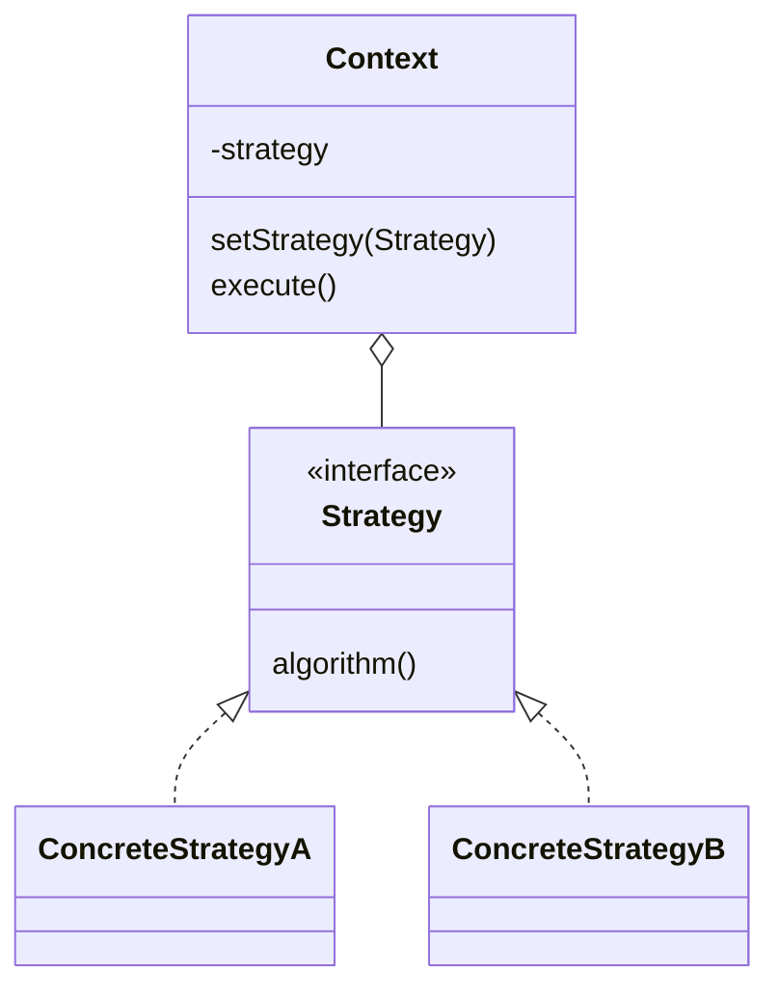

# Стратегия (Strategy)

**Strategy** определяет семейство алгоритмов, инкапсулирует каждый из них и делает их взаимозаменяемыми. **Strategy** позволяет изменять алгоритм независимо от клиентов, которые им пользуются.

## Полезные ссылки

### Официальная документация
- [Java Comparator](https://docs.oracle.com/en/java/javase/17/docs/api/java.base/java/util/Comparator.html)
- [Java Collections.sort()](https://docs.oracle.com/en/java/javase/17/docs/api/java.base/java/util/Collections.html#sort(java.util.List))

### См. также
- [[java-collections-list|Java Collections]] — коллекции Java
- [[java-streams-fp|Stream API]] — Stream API
- [[spring-framework-interview|Spring Core]] — IoC и бины

- [[iterator|Итератор (Iterator)]]
- [[visitor|Посетитель (Visitor)]]
## Содержание

- [Суть и запомнить](#суть-и-запомнить)
- [Что такое Strategy?](#что-такое-strategy)
  - [Основные характеристики](#основные-характеристики)
  - [Проблемы, которые решает](#проблемы-которые-решает)
- [Когда использовать Strategy?](#когда-использовать-strategy)
  - [Подходящие сценарии](#подходящие-сценарии)
  - [Признаки необходимости](#признаки-необходимости)
- [Структура паттерна](#структура-паттерна)
  - [Компоненты](#компоненты)
- [Реализация на Java](#реализация-на-java)
  - [Классический Strategy](#классический-strategy)
  - [Strategy с состоянием](#strategy-с-состоянием)
  - [Java Collections и Comparator](#java-collections-и-comparator)
- [Продвинутые реализации](#продвинутые-реализации)
  - [1. Strategy с Dependency Injection](#1-strategy-с-dependency-injection)
  - [2. Strategy с AOP](#2-strategy-с-aop)
  - [3. Functional Strategy](#3-functional-strategy)
- [Примеры использования](#примеры-использования)
  - [1. Валидация форм](#1-валидация-форм)
  - [2. Кэширование с разными стратегиями](#2-кэширование-с-разными-стратегиями)
  - [3. Обработка платежей](#3-обработка-платежей)
- [Лучшие практики](#лучшие-практики)
  - [1. SOLID Principles](#1-solid-principles)
  - [2. Testing Strategy Pattern](#2-testing-strategy-pattern)
- [Решение проблем](#решение-проблем)
- [Частые вопросы](#частые-вопросы)
- [Заключение](#заключение)

## Суть и запомнить

**Суть в одном предложении:** Семейство алгоритмов в отдельных классах с общим интерфейсом; контекст держит ссылку на стратегию и делегирует ей работу — алгоритм можно менять на лету.

**Запомнить:**
- Context вызывает метод стратегии; стратегию подставляют снаружи (конструктор, setter, DI).
- Замена наследования подклассами с разным поведением на композицию.
- В Java: Comparator в sort() — классический пример.

**Когда применять:** разные способы оплаты, валидации, сортировки, сжатия — одно действие, несколько взаимозаменяемых реализаций.

## Что такое Strategy?

**Strategy** — это поведенческий паттерн проектирования, который позволяет определять семейство алгоритмов, помещать каждый из них в отдельный класс и делать их объекты взаимозаменяемыми.

### Основные характеристики

1. **Инкапсуляция алгоритмов**: Каждый алгоритм в отдельном классе
2. **Взаимозаменяемость**: Алгоритмы можно менять во время выполнения
3. **Интерфейсная абстракция**: Общий интерфейс для всех алгоритмов
4. **Композиция вместо наследования**: Предпочитает композицию наследованию

### Проблемы, которые решает

Сравнение: жёстко закодированные способы оплаты vs взаимозаменяемые стратегии(PaymentStrategy).

```java
// Плохо: Жестко закодированные алгоритмы
public class PaymentProcessor {

    public void processPayment(String type, double amount) {
        if (type.equals("credit_card")) {
            // Логика обработки кредитной карты
            System.out.println("Processing credit card payment: $" + amount);
            // validate card, charge, etc.
        } else if (type.equals("paypal")) {
            // Логика обработки PayPal
            System.out.println("Processing PayPal payment: $" + amount);
            // redirect to paypal, etc.
        } else if (type.equals("bank_transfer")) {
            // Логика банковского перевода
            System.out.println("Processing bank transfer: $" + amount);
            // bank details, transfer, etc.
        } else {
            throw new IllegalArgumentException("Unknown payment type");
        }
    }
}

// Хорошо: Strategy паттерн
public class PaymentProcessor {
    private PaymentStrategy strategy;

    public void setPaymentStrategy(PaymentStrategy strategy) {
        this.strategy = strategy;
    }

    public void processPayment(double amount) {
        if (strategy == null) {
            throw new IllegalStateException("Payment strategy not set");
        }
        strategy.pay(amount);
    }
}

interface PaymentStrategy {
    void pay(double amount);
}

class CreditCardStrategy implements PaymentStrategy {
    @Override
    public void pay(double amount) {
        System.out.println("Processing credit card payment: $" + amount);
    }
}

class PayPalStrategy implements PaymentStrategy {
    @Override
    public void pay(double amount) {
        System.out.println("Processing PayPal payment: $" + amount);
    }
}
```

## Когда использовать Strategy?

### Подходящие сценарии

- **Валидация данных**: Разные стратегии валидации
- **Сортировка**: Разные алгоритмы сортировки
- **Сжатие данных**: Разные алгоритмы сжатия
- **Кэширование**: Разные стратегии кэширования
- **Аутентификация**: Разные способы аутентификации
- **Оплата**: Разные платежные системы

### Признаки необходимости

```java
// Признаки: Множество условных операторов для выбора поведения
public class FileProcessor {

    // Плохо: Один класс пытается делать все
    public void processFile(String fileType, File file) {
        if (fileType.equals("xml")) {
            // XML processing logic
            parseXml(file);
        } else if (fileType.equals("json")) {
            // JSON processing logic
            parseJson(file);
        } else if (fileType.equals("csv")) {
            // CSV processing logic
            parseCsv(file);
        } else if (fileType.equals("yaml")) {
            // YAML processing logic
            parseYaml(file);
        }
        // Новые форматы требуют изменения этого класса
    }

    // Хорошо: Strategy паттерн
    public void processFile(FileProcessorStrategy strategy, File file) {
        strategy.process(file);
    }
}

interface FileProcessorStrategy {
    void process(File file);
    boolean canHandle(String fileType);
}

class XmlProcessorStrategy implements FileProcessorStrategy {
    @Override
    public void process(File file) { /* XML logic */ }
    @Override
    public boolean canHandle(String fileType) { return "xml".equals(fileType); }
}

// Клиент может легко добавлять новые стратегии
class NewFormatStrategy implements FileProcessorStrategy {
    @Override
    public void process(File file) { /* New format logic */ }
    @Override
    public boolean canHandle(String fileType) { return "new_format".equals(fileType); }
}
```
## Структура паттерна



### Компоненты

1. **Context**: Контекст, использующий стратегию
2. **Strategy**: Интерфейс стратегии
3. **ConcreteStrategy**: Конкретные реализации стратегий
4. **Client**: Код, выбирающий и устанавливающий стратегию

## Реализация на Java

### Классический Strategy

```java
// Strategy интерфейс
interface SortingStrategy {
    void sort(int[] array);
}

// Concrete Strategies
class BubbleSortStrategy implements SortingStrategy {
    @Override
    public void sort(int[] array) {
        System.out.println("Sorting using Bubble Sort");
        for (int i = 0; i < array.length - 1; i++) {
            for (int j = 0; j < array.length - i - 1; j++) {
                if (array[j] > array[j + 1]) {
                    int temp = array[j];
                    array[j] = array[j + 1];
                    array[j + 1] = temp;
                }
            }
        }
    }
}

class QuickSortStrategy implements SortingStrategy {
    @Override
    public void sort(int[] array) {
        System.out.println("Sorting using Quick Sort");
        quickSort(array, 0, array.length - 1);
    }

    private void quickSort(int[] array, int low, int high) {
        if (low < high) {
            int pi = partition(array, low, high);
            quickSort(array, low, pi - 1);
            quickSort(array, pi + 1, high);
        }
    }

    private int partition(int[] array, int low, int high) {
        int pivot = array[high];
        int i = (low - 1);
        for (int j = low; j < high; j++) {
            if (array[j] < pivot) {
                i++;
                int temp = array[i];
                array[i] = array[j];
                array[j] = temp;
            }
        }
        int temp = array[i + 1];
        array[i + 1] = array[high];
        array[high] = temp;
        return i + 1;
    }
}

class MergeSortStrategy implements SortingStrategy {
    @Override
    public void sort(int[] array) {
        System.out.println("Sorting using Merge Sort");
        mergeSort(array, 0, array.length - 1);
    }

    private void mergeSort(int[] array, int left, int right) {
        if (left < right) {
            int middle = (left + right) / 2;
            mergeSort(array, left, middle);
            mergeSort(array, middle + 1, right);
            merge(array, left, middle, right);
        }
    }

    private void merge(int[] array, int left, int middle, int right) {
        int n1 = middle - left + 1;
        int n2 = right - middle;

        int[] leftArray = new int[n1];
        int[] rightArray = new int[n2];

        for (int i = 0; i < n1; ++i)
            leftArray[i] = array[left + i];
        for (int j = 0; j < n2; ++j)
            rightArray[j] = array[middle + 1 + j];

        int i = 0, j = 0;
        int k = left;
        while (i < n1 && j < n2) {
            if (leftArray[i] <= rightArray[j]) {
                array[k] = leftArray[i];
                i++;
            } else {
                array[k] = rightArray[j];
                j++;
            }
            k++;
        }

        while (i < n1) {
            array[k] = leftArray[i];
            i++;
            k++;
        }

        while (j < n2) {
            array[k] = rightArray[j];
            j++;
            k++;
        }
    }
}

// Context
class Sorter {
    private SortingStrategy strategy;

    public void setSortingStrategy(SortingStrategy strategy) {
        this.strategy = strategy;
    }

    public void sortArray(int[] array) {
        if (strategy == null) {
            throw new IllegalStateException("Sorting strategy not set");
        }
        strategy.sort(array);
    }
}

// Клиент
public class SortingDemo {
    public static void main(String[] args) {
        Sorter sorter = new Sorter();
        int[] array = {64, 34, 25, 12, 22, 11, 90};

        // Использование разных стратегий
        sorter.setSortingStrategy(new BubbleSortStrategy());
        sorter.sortArray(array.clone());

        sorter.setSortingStrategy(new QuickSortStrategy());
        sorter.sortArray(array.clone());

        sorter.setSortingStrategy(new MergeSortStrategy());
        sorter.sortArray(array.clone());
    }
}
```

### Strategy с состоянием

```java
// Strategy с внутренним состоянием
interface CompressionStrategy {
    byte[] compress(byte[] data);
    byte[] decompress(byte[] compressedData);
    String getName();
}

// ZIP Compression
class ZipCompressionStrategy implements CompressionStrategy {
    @Override
    public byte[] compress(byte[] data) {
        System.out.println("Compressing using ZIP algorithm");
        // Демонстрационный результат: в реальной реализации здесь будет сжатие.
        return java.util.Arrays.copyOf(data, data.length);
    }

    @Override
    public byte[] decompress(byte[] compressedData) {
        System.out.println("Decompressing using ZIP algorithm");
        // Демонстрационный результат: в реальной реализации здесь будет распаковка.
        return java.util.Arrays.copyOf(compressedData, compressedData.length);
    }

    @Override
    public String getName() { return "ZIP"; }
}

// GZIP Compression
class GzipCompressionStrategy implements CompressionStrategy {
    @Override
    public byte[] compress(byte[] data) {
        System.out.println("Compressing using GZIP algorithm");
        // Демонстрационный результат: в реальной реализации здесь будет сжатие.
        return java.util.Arrays.copyOf(data, data.length);
    }

    @Override
    public byte[] decompress(byte[] compressedData) {
        System.out.println("Decompressing using GZIP algorithm");
        // Демонстрационный результат: в реальной реализации здесь будет распаковка.
        return java.util.Arrays.copyOf(compressedData, compressedData.length);
    }

    @Override
    public String getName() { return "GZIP"; }
}

// LZ4 Compression
class Lz4CompressionStrategy implements CompressionStrategy {
    private final int compressionLevel;

    public Lz4CompressionStrategy(int compressionLevel) {
        this.compressionLevel = compressionLevel;
    }

    @Override
    public byte[] compress(byte[] data) {
        System.out.println("Compressing using LZ4 (level " + compressionLevel + ")");
        // Демонстрационный результат: в реальной реализации здесь будет сжатие с уровнем.
        return java.util.Arrays.copyOf(data, data.length);
    }

    @Override
    public byte[] decompress(byte[] compressedData) {
        System.out.println("Decompressing using LZ4");
        // Демонстрационный результат: в реальной реализации здесь будет распаковка.
        return java.util.Arrays.copyOf(compressedData, compressedData.length);
    }

    @Override
    public String getName() { return "LZ4"; }
}

// Context
class DataCompressor {
    private CompressionStrategy strategy;

    public void setCompressionStrategy(CompressionStrategy strategy) {
        this.strategy = strategy;
    }

    public byte[] compress(byte[] data) {
        if (strategy == null) {
            throw new IllegalStateException("Compression strategy not set");
        }
        return strategy.compress(data);
    }

    public byte[] decompress(byte[] compressedData) {
        if (strategy == null) {
            throw new IllegalStateException("Compression strategy not set");
        }
        return strategy.decompress(compressedData);
    }

    public String getCurrentStrategyName() {
        return strategy != null ? strategy.getName() : "None";
    }
}

// Strategy Factory
class CompressionStrategyFactory {
    public static CompressionStrategy createStrategy(String type, Map<String, Object> config) {
        switch (type.toLowerCase()) {
            case "zip":
                return new ZipCompressionStrategy();
            case "gzip":
                return new GzipCompressionStrategy();
            case "lz4":
                int level = (Integer) config.getOrDefault("level", 1);
                return new Lz4CompressionStrategy(level);
            default:
                throw new IllegalArgumentException("Unknown compression type: " + type);
        }
    }
}

public class CompressionDemo {
    public static void main(String[] args) {
        DataCompressor compressor = new DataCompressor();
        byte[] data = "Hello World!".getBytes();

        // Использование разных стратегий сжатия
        compressor.setCompressionStrategy(new ZipCompressionStrategy());
        byte[] compressed = compressor.compress(data);
        byte[] decompressed = compressor.decompress(compressed);

        compressor.setCompressionStrategy(new GzipCompressionStrategy());
        compressed = compressor.compress(data);

        // Использование фабрики
        Map<String, Object> config = new HashMap<>();
        config.put("level", 5);
        CompressionStrategy lz4Strategy = CompressionStrategyFactory.createStrategy("lz4", config);
        compressor.setCompressionStrategy(lz4Strategy);
        compressed = compressor.compress(data);

        System.out.println("Current strategy: " + compressor.getCurrentStrategyName());
    }
}
```

### Java Collections и Comparator

```java
// Strategy с Java Collections
public class CollectionsStrategyDemo {

    // Strategy для сравнения
    interface PersonComparator extends Comparator<Person> {
        String getStrategyName();
    }

    // Concrete Strategies
    static class AgeComparator implements PersonComparator {
        @Override
        public int compare(Person p1, Person p2) {
            return Integer.compare(p1.getAge(), p2.getAge());
        }

        @Override
        public String getStrategyName() { return "Age"; }
    }

    static class NameComparator implements PersonComparator {
        @Override
        public int compare(Person p1, Person p2) {
            return p1.getName().compareTo(p2.getName());
        }

        @Override
        public String getStrategyName() { return "Name"; }
    }

    static class SalaryComparator implements PersonComparator {
        @Override
        public int compare(Person p1, Person p2) {
            return Double.compare(p1.getSalary(), p2.getSalary());
        }

        @Override
        public String getStrategyName() { return "Salary"; }
    }

    // Chain of Responsibility для составных сравнений
    static class CompositeComparator implements PersonComparator {
        private final List<PersonComparator> comparators = new ArrayList<>();

        public CompositeComparator(PersonComparator... comparators) {
            this.comparators.addAll(Arrays.asList(comparators));
        }

        @Override
        public int compare(Person p1, Person p2) {
            for (PersonComparator comparator : comparators) {
                int result = comparator.compare(p1, p2);
                if (result != 0) {
                    return result;
                }
            }
            return 0;
        }

        @Override
        public String getStrategyName() {
            return comparators.stream()
                .map(PersonComparator::getStrategyName)
                .collect(Collectors.joining(" -> "));
        }
    }

    // Context
    static class PersonSorter {
        public List<Person> sort(List<Person> people, PersonComparator comparator) {
            List<Person> sorted = new ArrayList<>(people);
            sorted.sort(comparator);
            return sorted;
        }
    }

    static class Person {
        private final String name;
        private final int age;
        private final double salary;

        public Person(String name, int age, double salary) {
            this.name = name;
            this.age = age;
            this.salary = salary;
        }

        public String getName() { return name; }
        public int getAge() { return age; }
        public double getSalary() { return salary; }

        @Override
        public String toString() {
            return String.format("%s (%d years, $%.2f)", name, age, salary);
        }
    }

    public static void main(String[] args) {
        List<Person> people = Arrays.asList(
            new Person("Alice", 30, 75000),
            new Person("Bob", 25, 65000),
            new Person("Charlie", 35, 85000),
            new Person("Diana", 28, 70000),
            new Person("Alice", 32, 80000) // Для демонстрации составного сравнения
        );

        PersonSorter sorter = new PersonSorter();

        // Сортировка по возрасту
        PersonComparator ageStrategy = new AgeComparator();
        List<Person> sortedByAge = sorter.sort(people, ageStrategy);
        System.out.println("Sorted by age (" + ageStrategy.getStrategyName() + "):");
        sortedByAge.forEach(System.out::println);

        System.out.println();

        // Сортировка по имени
        PersonComparator nameStrategy = new NameComparator();
        List<Person> sortedByName = sorter.sort(people, nameStrategy);
        System.out.println("Sorted by name (" + nameStrategy.getStrategyName() + "):");
        sortedByName.forEach(System.out::println);

        System.out.println();

        // Сортировка по зарплате
        PersonComparator salaryStrategy = new SalaryComparator();
        List<Person> sortedBySalary = sorter.sort(people, salaryStrategy);
        System.out.println("Sorted by salary (" + salaryStrategy.getStrategyName() + "):");
        sortedBySalary.forEach(System.out::println);

        System.out.println();

        // Составная сортировка: сначала по имени, затем по возрасту
        PersonComparator compositeStrategy = new CompositeComparator(
            new NameComparator(),
            new AgeComparator()
        );
        List<Person> sortedComposite = sorter.sort(people, compositeStrategy);
        System.out.println("Sorted by name then age (" + compositeStrategy.getStrategyName() + "):");
        sortedComposite.forEach(System.out::println);
    }
}
```

## Продвинутые реализации

### 1. Strategy с Dependency Injection

```java
// Spring-style Strategy с DI
@Service
public class PaymentService {

    private final Map<String, PaymentStrategy> strategies;

    @Autowired
    public PaymentService(List<PaymentStrategy> strategyList) {
        this.strategies = strategyList.stream()
            .collect(Collectors.toMap(
                PaymentStrategy::getType,
                strategy -> strategy
            ));
    }

    public PaymentResult processPayment(String type, PaymentRequest request) {
        PaymentStrategy strategy = strategies.get(type.toLowerCase());
        if (strategy == null) {
            throw new UnsupportedPaymentTypeException("Unsupported payment type: " + type);
        }
        return strategy.process(request);
    }

    public Set<String> getSupportedPaymentTypes() {
        return strategies.keySet();
    }
}

interface PaymentStrategy {
    String getType();
    PaymentResult process(PaymentRequest request);
}

@Component
@Qualifier("creditCard")
class CreditCardPaymentStrategy implements PaymentStrategy {

    @Autowired
    private CreditCardService creditCardService;

    @Autowired
    private FraudDetectionService fraudService;

    @Override
    public String getType() { return "credit_card"; }

    @Override
    public PaymentResult process(PaymentRequest request) {
        // Fraud check
        if (fraudService.isFraudulent(request)) {
            return PaymentResult.declined("Fraud detected");
        }

        // Process payment
        return creditCardService.charge(request);
    }
}

@Component
@Qualifier("paypal")
class PayPalPaymentStrategy implements PaymentStrategy {

    @Autowired
    private PayPalService payPalService;

    @Override
    public String getType() { return "paypal"; }

    @Override
    public PaymentResult process(PaymentRequest request) {
        return payPalService.process(request);
    }
}

// Конфигурация
@Configuration
public class PaymentConfig {

    @Bean
    public PaymentService paymentService(List<PaymentStrategy> strategies) {
        return new PaymentService(strategies);
    }
}
```

### 2. Strategy с AOP

```java
// Strategy с аспектами для логирования и метрик
@Aspect
@Component
public class StrategyAspect {

    @Around("execution(* com.example.PaymentStrategy+.process(..))")
    public Object logStrategyExecution(ProceedingJoinPoint joinPoint) throws Throwable {
        String strategyName = joinPoint.getTarget().getClass().getSimpleName();
        Object[] args = joinPoint.getArgs();

        long startTime = System.nanoTime();
        try {
            System.out.println("Executing strategy: " + strategyName);
            Object result = joinPoint.proceed();
            long duration = (System.nanoTime() - startTime) / 1_000_000;

            System.out.println("Strategy " + strategyName + " completed in " + duration + "ms");
            return result;
        } catch (Exception e) {
            System.err.println("Strategy " + strategyName + " failed: " + e.getMessage());
            throw e;
        }
    }
}

// Strategy с кэшированием
interface CachingStrategy {
    String get(String key);
    void put(String key, String value);
    void evict(String key);
}

@Component
class RedisCachingStrategy implements CachingStrategy {

    @Autowired
    private RedisTemplate<String, String> redisTemplate;

    @Override
    @Cacheable(value = "redisCache", key = "#key")
    public String get(String key) {
        return redisTemplate.opsForValue().get(key);
    }

    @Override
    @CachePut(value = "redisCache", key = "#key")
    public void put(String key, String value) {
        redisTemplate.opsForValue().set(key, value);
    }

    @Override
    @CacheEvict(value = "redisCache", key = "#key")
    public void evict(String key) {
        redisTemplate.delete(key);
    }
}

@Component
class CaffeineCachingStrategy implements CachingStrategy {

    private final Cache<String, String> cache = Caffeine.newBuilder()
        .maximumSize(10_000)
        .expireAfterWrite(5, TimeUnit.MINUTES)
        .build();

    @Override
    public String get(String key) {
        return cache.getIfPresent(key);
    }

    @Override
    public void put(String key, String value) {
        cache.put(key, value);
    }

    @Override
    public void evict(String key) {
        cache.invalidate(key);
    }
}

// Context с переключением стратегий
@Service
class SmartCacheService {

    private final Map<String, CachingStrategy> strategies;
    private volatile CachingStrategy currentStrategy;

    @Autowired
    public SmartCacheService(
            @Qualifier("redisCachingStrategy") CachingStrategy redisStrategy,
            @Qualifier("caffeineCachingStrategy") CachingStrategy caffeineStrategy) {

        this.strategies = Map.of(
            "redis", redisStrategy,
            "caffeine", caffeineStrategy
        );

        // Начинаем с Caffeine для быстрого доступа
        this.currentStrategy = caffeineStrategy;
    }

    public String get(String key) {
        String value = currentStrategy.get(key);

        // Если не найдено в быстрой кэше, проверяем Redis
        if (value == null && currentStrategy != strategies.get("redis")) {
            value = strategies.get("redis").get(key);
            if (value != null) {
                // Кэшируем в быстрой кэше
                currentStrategy.put(key, value);
            }
        }

        return value;
    }

    public void put(String key, String value) {
        // Кэшируем в обе стратегии
        strategies.values().forEach(strategy -> strategy.put(key, value));
    }

    public void switchStrategy(String strategyName) {
        CachingStrategy newStrategy = strategies.get(strategyName.toLowerCase());
        if (newStrategy != null) {
            this.currentStrategy = newStrategy;
        }
    }
}
```

### 3. Functional Strategy

```java
// Strategy с функциональными интерфейсами
public class FunctionalStrategyDemo {

    // Strategy как функция
    @FunctionalInterface
    interface ProcessingStrategy<T, R> {
        R process(T input);

        default String getName() {
            return this.getClass().getSimpleName();
        }
    }

    // Context с функциональными стратегиями
    static class DataProcessor<T, R> {
        private ProcessingStrategy<T, R> strategy;

        public void setStrategy(ProcessingStrategy<T, R> strategy) {
            this.strategy = strategy;
        }

        public R process(T input) {
            if (strategy == null) {
                throw new IllegalStateException("Strategy not set");
            }
            return strategy.process(input);
        }

        public String getCurrentStrategyName() {
            return strategy != null ? strategy.getName() : "None";
        }
    }

    // Предопределенные стратегии как функции
    static class StringStrategies {

        public static final ProcessingStrategy<String, Integer> LENGTH =
            input -> input.length();

        public static final ProcessingStrategy<String, String> UPPERCASE =
            String::toUpperCase;

        public static final ProcessingStrategy<String, String> REVERSE =
            input -> new StringBuilder(input).reverse().toString();

        public static final ProcessingStrategy<String, Integer> WORD_COUNT =
            input -> input.split("\\s+").length;

        public static final ProcessingStrategy<String, String> REMOVE_SPACES =
            input -> input.replaceAll("\\s+", "");
    }

    // Компонуемые стратегии
    static class ComposableStrategies {

        public static <T, R, U> ProcessingStrategy<T, U> compose(
                ProcessingStrategy<T, R> first,
                ProcessingStrategy<R, U> second) {

            return new ProcessingStrategy<T, U>() {
                @Override
                public U process(T input) {
                    return second.process(first.process(input));
                }

                @Override
                public String getName() {
                    return first.getName() + " -> " + second.getName();
                }
            };
        }

        public static <T, R> ProcessingStrategy<T, R> conditional(
                Predicate<T> condition,
                ProcessingStrategy<T, R> ifTrue,
                ProcessingStrategy<T, R> ifFalse) {

            return input -> condition.test(input) ?
                ifTrue.process(input) : ifFalse.process(input);
        }
    }

    // Strategy фабрика
    static class StrategyFactory {

        private static final Map<String, ProcessingStrategy<String, ?>> stringStrategies =
            new HashMap<>();

        static {
            stringStrategies.put("length", StringStrategies.LENGTH);
            stringStrategies.put("uppercase", StringStrategies.UPPERCASE);
            stringStrategies.put("reverse", StringStrategies.REVERSE);
            stringStrategies.put("wordcount", StringStrategies.WORD_COUNT);
            stringStrategies.put("removespaces", StringStrategies.REMOVE_SPACES);
        }

        @SuppressWarnings("unchecked")
        public static <T, R> ProcessingStrategy<T, R> createStrategy(String name) {
            return (ProcessingStrategy<T, R>) stringStrategies.get(name.toLowerCase());
        }

        public static <T, R> ProcessingStrategy<T, R> createLambdaStrategy(
                Function<T, R> function, String name) {

            return new ProcessingStrategy<T, R>() {
                @Override
                public R process(T input) {
                    return function.apply(input);
                }

                @Override
                public String getName() {
                    return name;
                }
            };
        }
    }

    public static void main(String[] args) {
        DataProcessor<String, ?> processor = new DataProcessor<>();

        String input = "Hello World Example";

        // Использование предопределенных стратегий
        processor.setStrategy(StringStrategies.LENGTH);
        System.out.println("Length: " + processor.process(input));

        processor.setStrategy(StringStrategies.UPPERCASE);
        System.out.println("Uppercase: " + processor.process(input));

        processor.setStrategy(StringStrategies.REVERSE);
        System.out.println("Reverse: " + processor.process(input));

        processor.setStrategy(StringStrategies.WORD_COUNT);
        System.out.println("Word count: " + processor.process(input));

        // Композиция стратегий
        ProcessingStrategy<String, String> composed = ComposableStrategies.compose(
            StringStrategies.REVERSE,
            StringStrategies.UPPERCASE
        );
        processor.setStrategy(composed);
        System.out.println("Reverse then uppercase: " + processor.process(input));

        // Условная стратегия
        ProcessingStrategy<String, Integer> conditional = ComposableStrategies.conditional(
            str -> str.length() > 10,
            StringStrategies.WORD_COUNT,
            StringStrategies.LENGTH
        );
        processor.setStrategy(conditional);
        System.out.println("Conditional result: " + processor.process(input));

        // Создание стратегии из фабрики
        ProcessingStrategy<String, String> lambdaStrategy = StrategyFactory.createLambdaStrategy(
            str -> str.substring(0, Math.min(str.length(), 5)) + "...",
            "Truncate"
        );
        processor.setStrategy(lambdaStrategy);
        System.out.println("Truncated: " + processor.process(input));
    }
}
```

## Примеры использования

### 1. Валидация форм

```java
// Strategy для валидации форм
public class FormValidationExample {

    // Strategy интерфейс
    interface ValidationStrategy {
        ValidationResult validate(String input);
        String getFieldName();
    }

    static class ValidationResult {
        private final boolean valid;
        private final String errorMessage;

        public ValidationResult(boolean valid, String errorMessage) {
            this.valid = valid;
            this.errorMessage = errorMessage;
        }

        public boolean isValid() { return valid; }
        public String getErrorMessage() { return errorMessage; }

        public static ValidationResult valid() {
            return new ValidationResult(true, null);
        }

        public static ValidationResult invalid(String message) {
            return new ValidationResult(false, message);
        }
    }

    // Concrete Strategies
    static class EmailValidationStrategy implements ValidationStrategy {
        @Override
        public ValidationResult validate(String input) {
            if (input == null || input.trim().isEmpty()) {
                return ValidationResult.invalid("Email is required");
            }
            String emailRegex = "^[a-zA-Z0-9_+&*-]+(?:\\.[a-zA-Z0-9_+&*-]+)*@(?:[a-zA-Z0-9-]+\\.)+[a-zA-Z]{2,7}$";
            if (!input.matches(emailRegex)) {
                return ValidationResult.invalid("Invalid email format");
            }
            return ValidationResult.valid();
        }

        @Override
        public String getFieldName() { return "Email"; }
    }

    static class PasswordValidationStrategy implements ValidationStrategy {
        @Override
        public ValidationResult validate(String input) {
            if (input == null || input.length() < 8) {
                return ValidationResult.invalid("Password must be at least 8 characters");
            }
            if (!input.matches(".*[A-Z].*")) {
                return ValidationResult.invalid("Password must contain uppercase letter");
            }
            if (!input.matches(".*[a-z].*")) {
                return ValidationResult.invalid("Password must contain lowercase letter");
            }
            if (!input.matches(".*\\d.*")) {
                return ValidationResult.invalid("Password must contain digit");
            }
            return ValidationResult.valid();
        }

        @Override
        public String getFieldName() { return "Password"; }
    }

    static class PhoneValidationStrategy implements ValidationStrategy {
        @Override
        public ValidationResult validate(String input) {
            if (input == null || input.trim().isEmpty()) {
                return ValidationResult.invalid("Phone number is required");
            }
            String phoneRegex = "^\\+?[1-9]\\d{1,14}$";
            if (!input.matches(phoneRegex)) {
                return ValidationResult.invalid("Invalid phone number format");
            }
            return ValidationResult.valid();
        }

        @Override
        public String getFieldName() { return "Phone"; }
    }

    // Context
    static class FormValidator {
        private final Map<String, ValidationStrategy> fieldValidators = new HashMap<>();

        public void addValidator(String fieldName, ValidationStrategy validator) {
            fieldValidators.put(fieldName, validator);
        }

        public Map<String, ValidationResult> validate(Map<String, String> formData) {
            Map<String, ValidationResult> results = new HashMap<>();

            for (Map.Entry<String, ValidationStrategy> entry : fieldValidators.entrySet()) {
                String fieldName = entry.getKey();
                ValidationStrategy validator = entry.getValue();
                String value = formData.get(fieldName);

                ValidationResult result = validator.validate(value);
                results.put(fieldName, result);
            }

            return results;
        }

        public boolean isValid(Map<String, ValidationResult> results) {
            return results.values().stream().allMatch(ValidationResult::isValid);
        }

        public List<String> getErrorMessages(Map<String, ValidationResult> results) {
            return results.entrySet().stream()
                .filter(entry -> !entry.getValue().isValid())
                .map(entry -> entry.getKey() + ": " + entry.getValue().getErrorMessage())
                .collect(Collectors.toList());
        }
    }

    public static void main(String[] args) {
        FormValidator validator = new FormValidator();

        // Добавление валидаторов
        validator.addValidator("email", new EmailValidationStrategy());
        validator.addValidator("password", new PasswordValidationStrategy());
        validator.addValidator("phone", new PhoneValidationStrategy());

        // Тестовые данные
        Map<String, String> formData = new HashMap<>();
        formData.put("email", "user@example.com");
        formData.put("password", "ValidPass123");
        formData.put("phone", "+1234567890");

        // Валидация
        Map<String, ValidationResult> results = validator.validate(formData);

        if (validator.isValid(results)) {
            System.out.println("Form is valid!");
        } else {
            System.out.println("Form validation failed:");
            validator.getErrorMessages(results).forEach(System.out::println);
        }

        // Тестирование с ошибками
        Map<String, String> invalidData = new HashMap<>();
        invalidData.put("email", "invalid-email");
        invalidData.put("password", "weak");
        invalidData.put("phone", "123");

        Map<String, ValidationResult> invalidResults = validator.validate(invalidData);
        System.out.println("\nInvalid form results:");
        validator.getErrorMessages(invalidResults).forEach(System.out::println);
    }
}
```

### 2. Кэширование с разными стратегиями

```java
// Strategy для кэширования
public class CachingStrategyExample {

    // Strategy интерфейс
    interface CacheStrategy {
        String get(String key);
        void put(String key, String value, long ttlMillis);
        void evict(String key);
        void clear();
        String getStrategyName();
    }

    // LRU Cache Strategy
    static class LruCacheStrategy implements CacheStrategy {
        private final LinkedHashMap<String, CacheEntry> cache;
        private final int maxSize;

        public LruCacheStrategy(int maxSize) {
            this.maxSize = maxSize;
            this.cache = new LinkedHashMap<String, CacheEntry>(maxSize, 0.75f, true) {
                @Override
                protected boolean removeEldestEntry(Map.Entry<String, CacheEntry> eldest) {
                    return size() > maxSize;
                }
            };
        }

        @Override
        public String get(String key) {
            CacheEntry entry = cache.get(key);
            if (entry != null && !entry.isExpired()) {
                return entry.getValue();
            }
            cache.remove(key); // Удаляем истекшую запись
            return null;
        }

        @Override
        public void put(String key, String value, long ttlMillis) {
            cache.put(key, new CacheEntry(value, ttlMillis));
        }

        @Override
        public void evict(String key) {
            cache.remove(key);
        }

        @Override
        public void clear() {
            cache.clear();
        }

        @Override
        public String getStrategyName() {
            return "LRU";
        }

        private static class CacheEntry {
            private final String value;
            private final long expiryTime;

            public CacheEntry(String value, long ttlMillis) {
                this.value = value;
                this.expiryTime = System.currentTimeMillis() + ttlMillis;
            }

            public String getValue() { return value; }

            public boolean isExpired() {
                return System.currentTimeMillis() > expiryTime;
            }
        }
    }

    // LFU Cache Strategy
    static class LfuCacheStrategy implements CacheStrategy {
        private final Map<String, CacheEntry> cache = new HashMap<>();
        private final PriorityQueue<CacheEntry> accessOrder = new PriorityQueue<>();
        private final int maxSize;

        public LfuCacheStrategy(int maxSize) {
            this.maxSize = maxSize;
        }

        @Override
        public synchronized String get(String key) {
            CacheEntry entry = cache.get(key);
            if (entry != null && !entry.isExpired()) {
                entry.incrementAccessCount();
                accessOrder.remove(entry);
                accessOrder.add(entry);
                return entry.getValue();
            }
            if (entry != null) {
                cache.remove(key);
                accessOrder.remove(entry);
            }
            return null;
        }

        @Override
        public synchronized void put(String key, String value, long ttlMillis) {
            CacheEntry existing = cache.get(key);
            if (existing != null) {
                accessOrder.remove(existing);
            }

            CacheEntry newEntry = new CacheEntry(key, value, ttlMillis);
            cache.put(key, newEntry);
            accessOrder.add(newEntry);

            if (cache.size() > maxSize) {
                evictLeastFrequentlyUsed();
            }
        }

        @Override
        public synchronized void evict(String key) {
            CacheEntry entry = cache.remove(key);
            if (entry != null) {
                accessOrder.remove(entry);
            }
        }

        @Override
        public synchronized void clear() {
            cache.clear();
            accessOrder.clear();
        }

        @Override
        public String getStrategyName() {
            return "LFU";
        }

        private void evictLeastFrequentlyUsed() {
            if (!accessOrder.isEmpty()) {
                CacheEntry leastUsed = accessOrder.poll();
                cache.remove(leastUsed.getKey());
            }
        }

        private static class CacheEntry implements Comparable<CacheEntry> {
            private final String key;
            private final String value;
            private final long expiryTime;
            private int accessCount;

            public CacheEntry(String key, String value, long ttlMillis) {
                this.key = key;
                this.value = value;
                this.expiryTime = System.currentTimeMillis() + ttlMillis;
                this.accessCount = 1;
            }

            public String getKey() { return key; }
            public String getValue() { return value; }
            public void incrementAccessCount() { accessCount++; }

            public boolean isExpired() {
                return System.currentTimeMillis() > expiryTime;
            }

            @Override
            public int compareTo(CacheEntry other) {
                return Integer.compare(this.accessCount, other.accessCount);
            }
        }
    }

    // Context
    static class SmartCache {
        private CacheStrategy strategy;
        private final Map<String, CacheStrategy> availableStrategies = new HashMap<>();

        public SmartCache() {
            availableStrategies.put("lru", new LruCacheStrategy(100));
            availableStrategies.put("lfu", new LfuCacheStrategy(100));
            // Начинаем с LRU
            strategy = availableStrategies.get("lru");
        }

        public void setStrategy(String strategyName) {
            CacheStrategy newStrategy = availableStrategies.get(strategyName.toLowerCase());
            if (newStrategy != null) {
                // Можно мигрировать данные между стратегиями
                // migrateData(this.strategy, newStrategy);
                this.strategy = newStrategy;
            }
        }

        public String get(String key) {
            return strategy.get(key);
        }

        public void put(String key, String value) {
            put(key, value, 3600000); // 1 час по умолчанию
        }

        public void put(String key, String value, long ttlMillis) {
            strategy.put(key, value, ttlMillis);
        }

        public void evict(String key) {
            strategy.evict(key);
        }

        public void clear() {
            strategy.clear();
        }

        public String getCurrentStrategyName() {
            return strategy.getStrategyName();
        }

        public Set<String> getAvailableStrategies() {
            return availableStrategies.keySet();
        }
    }

    public static void main(String[] args) throws InterruptedException {
        SmartCache cache = new SmartCache();

        System.out.println("Current strategy: " + cache.getCurrentStrategyName());

        // Добавление данных
        cache.put("user:1", "John Doe", 5000); // 5 секунд
        cache.put("user:2", "Jane Smith", 10000); // 10 секунд
        cache.put("product:1", "Laptop", 15000);

        // Чтение данных
        System.out.println("user:1 = " + cache.get("user:1"));
        System.out.println("user:2 = " + cache.get("user:2"));
        System.out.println("product:1 = " + cache.get("product:1"));

        // Ожидание истечения TTL
        Thread.sleep(6000);

        System.out.println("After 6 seconds:");
        System.out.println("user:1 = " + cache.get("user:1")); // null (истекло)
        System.out.println("user:2 = " + cache.get("user:2")); // still valid
        System.out.println("product:1 = " + cache.get("product:1")); // still valid

        // Переключение стратегии
        cache.setStrategy("lfu");
        System.out.println("Switched to strategy: " + cache.getCurrentStrategyName());

        // Добавление новых данных
        cache.put("new:key", "New Value");
        System.out.println("new:key = " + cache.get("new:key"));
    }
}
```

### 3. Обработка платежей

```java
// Strategy для обработки платежей
public class PaymentProcessingExample {

    // Strategy интерфейс
    interface PaymentProcessor {
        PaymentResult process(Payment payment);
        boolean supports(String paymentMethod);
        String getProcessorName();
    }

    static class Payment {
        private final String method;
        private final BigDecimal amount;
        private final String currency;
        private final Map<String, String> metadata;

        public Payment(String method, BigDecimal amount, String currency) {
            this.method = method;
            this.amount = amount;
            this.currency = currency;
            this.metadata = new HashMap<>();
        }

        public String getMethod() { return method; }
        public BigDecimal getAmount() { return amount; }
        public String getCurrency() { return currency; }
        public Map<String, String> getMetadata() { return metadata; }

        public void addMetadata(String key, String value) {
            metadata.put(key, value);
        }
    }

    static class PaymentResult {
        private final boolean success;
        private final String transactionId;
        private final String errorMessage;

        private PaymentResult(boolean success, String transactionId, String errorMessage) {
            this.success = success;
            this.transactionId = transactionId;
            this.errorMessage = errorMessage;
        }

        public static PaymentResult success(String transactionId) {
            return new PaymentResult(true, transactionId, null);
        }

        public static PaymentResult failure(String errorMessage) {
            return new PaymentResult(false, null, errorMessage);
        }

        public boolean isSuccess() { return success; }
        public String getTransactionId() { return transactionId; }
        public String getErrorMessage() { return errorMessage; }
    }

    // Concrete Strategies
    static class CreditCardProcessor implements PaymentProcessor {
        @Override
        public PaymentResult process(Payment payment) {
            System.out.println("Processing credit card payment: " + payment.getAmount() +
                " " + payment.getCurrency());

            // Имитация обработки
            String cardNumber = payment.getMetadata().get("cardNumber");
            if (cardNumber == null || cardNumber.length() < 13) {
                return PaymentResult.failure("Invalid card number");
            }

            // Имитация успешной обработки
            String transactionId = "CC-" + System.currentTimeMillis();
            return PaymentResult.success(transactionId);
        }

        @Override
        public boolean supports(String paymentMethod) {
            return "credit_card".equals(paymentMethod) || "visa".equals(paymentMethod) ||
                   "mastercard".equals(paymentMethod);
        }

        @Override
        public String getProcessorName() { return "Credit Card Processor"; }
    }

    static class PayPalProcessor implements PaymentProcessor {
        @Override
        public PaymentResult process(Payment payment) {
            System.out.println("Processing PayPal payment: " + payment.getAmount() +
                " " + payment.getCurrency());

            String paypalEmail = payment.getMetadata().get("paypalEmail");
            if (paypalEmail == null || !paypalEmail.contains("@")) {
                return PaymentResult.failure("Invalid PayPal email");
            }

            // Имитация обработки через PayPal API
            String transactionId = "PP-" + System.currentTimeMillis();
            return PaymentResult.success(transactionId);
        }

        @Override
        public boolean supports(String paymentMethod) {
            return "paypal".equals(paymentMethod);
        }

        @Override
        public String getProcessorName() { return "PayPal Processor"; }
    }

    static class BankTransferProcessor implements PaymentProcessor {
        @Override
        public PaymentResult process(Payment payment) {
            System.out.println("Processing bank transfer: " + payment.getAmount() +
                " " + payment.getCurrency());

            String accountNumber = payment.getMetadata().get("accountNumber");
            String routingNumber = payment.getMetadata().get("routingNumber");

            if (accountNumber == null || routingNumber == null) {
                return PaymentResult.failure("Bank account details required");
            }

            // Имитация банковского перевода (может занять время)
            try {
                Thread.sleep(2000); // Имитация сетевого вызова
            } catch (InterruptedException e) {
                Thread.currentThread().interrupt();
                return PaymentResult.failure("Payment interrupted");
            }

            String transactionId = "BT-" + System.currentTimeMillis();
            return PaymentResult.success(transactionId);
        }

        @Override
        public boolean supports(String paymentMethod) {
            return "bank_transfer".equals(paymentMethod) || "wire".equals(paymentMethod);
        }

        @Override
        public String getProcessorName() { return "Bank Transfer Processor"; }
    }

    static class CryptoProcessor implements PaymentProcessor {
        @Override
        public PaymentResult process(Payment payment) {
            System.out.println("Processing crypto payment: " + payment.getAmount() +
                " " + payment.getCurrency());

            String walletAddress = payment.getMetadata().get("walletAddress");
            String cryptoType = payment.getMetadata().get("cryptoType");

            if (walletAddress == null || cryptoType == null) {
                return PaymentResult.failure("Wallet address and crypto type required");
            }

            // Имитация крипто транзакции
            String transactionId = "CR-" + System.currentTimeMillis();
            return PaymentResult.success(transactionId);
        }

        @Override
        public boolean supports(String paymentMethod) {
            return "bitcoin".equals(paymentMethod) || "ethereum".equals(paymentMethod) ||
                   "crypto".equals(paymentMethod);
        }

        @Override
        public String getProcessorName() { return "Crypto Processor"; }
    }

    // Context
    static class PaymentService {
        private final Map<String, PaymentProcessor> processors = new HashMap<>();

        public PaymentService() {
            // Регистрация процессоров
            registerProcessor(new CreditCardProcessor());
            registerProcessor(new PayPalProcessor());
            registerProcessor(new BankTransferProcessor());
            registerProcessor(new CryptoProcessor());
        }

        private void registerProcessor(PaymentProcessor processor) {
            // Можно регистрировать по нескольким методам оплаты
            // Для простоты используем имя процессора как ключ
            processors.put(processor.getProcessorName().toLowerCase().replace(" ", "_"), processor);
        }

        public PaymentResult processPayment(Payment payment) {
            // Находим подходящий процессор
            for (PaymentProcessor processor : processors.values()) {
                if (processor.supports(payment.getMethod())) {
                    return processor.process(payment);
                }
            }

            return PaymentResult.failure("Unsupported payment method: " + payment.getMethod());
        }

        public PaymentProcessor getProcessorForMethod(String method) {
            for (PaymentProcessor processor : processors.values()) {
                if (processor.supports(method)) {
                    return processor;
                }
            }
            return null;
        }

        public Set<String> getSupportedMethods() {
            Set<String> methods = new HashSet<>();
            processors.values().forEach(processor -> {
                // Для демонстрации добавим некоторые методы
                if (processor instanceof CreditCardProcessor) {
                    methods.addAll(Arrays.asList("credit_card", "visa", "mastercard"));
                } else if (processor instanceof PayPalProcessor) {
                    methods.add("paypal");
                } else if (processor instanceof BankTransferProcessor) {
                    methods.addAll(Arrays.asList("bank_transfer", "wire"));
                } else if (processor instanceof CryptoProcessor) {
                    methods.addAll(Arrays.asList("bitcoin", "ethereum", "crypto"));
                }
            });
            return methods;
        }
    }

    public static void main(String[] args) {
        PaymentService paymentService = new PaymentService();

        System.out.println("Supported payment methods: " + paymentService.getSupportedMethods());

        // Создание платежей разных типов
        Payment creditCardPayment = new Payment("credit_card", BigDecimal.valueOf(99.99), "USD");
        creditCardPayment.addMetadata("cardNumber", "4111111111111111");

        Payment paypalPayment = new Payment("paypal", BigDecimal.valueOf(49.99), "USD");
        paypalPayment.addMetadata("paypalEmail", "user@example.com");

        Payment bankTransferPayment = new Payment("bank_transfer", BigDecimal.valueOf(199.99), "EUR");
        bankTransferPayment.addMetadata("accountNumber", "123456789");
        bankTransferPayment.addMetadata("routingNumber", "021000021");

        Payment cryptoPayment = new Payment("bitcoin", BigDecimal.valueOf(0.001), "BTC");
        cryptoPayment.addMetadata("walletAddress", "1A1zP1eP5QGefi2DMPTfTL5SLmv7DivfNa");
        cryptoPayment.addMetadata("cryptoType", "BTC");

        // Обработка платежей
        PaymentResult[] results = {
            paymentService.processPayment(creditCardPayment),
            paymentService.processPayment(paypalPayment),
            paymentService.processPayment(bankTransferPayment),
            paymentService.processPayment(cryptoPayment)
        };

        // Вывод результатов
        for (PaymentResult result : results) {
            if (result.isSuccess()) {
                System.out.println("Payment successful! Transaction ID: " + result.getTransactionId());
            } else {
                System.out.println("Payment failed: " + result.getErrorMessage());
            }
        }

        // Тестирование неподдерживаемого метода
        Payment unsupportedPayment = new Payment("cash", BigDecimal.valueOf(10.00), "USD");
        PaymentResult unsupportedResult = paymentService.processPayment(unsupportedPayment);
        System.out.println("Unsupported payment result: " +
            (unsupportedResult.isSuccess() ? "Success" : unsupportedResult.getErrorMessage()));
    }
}
```

## Лучшие практики

### 1. SOLID Principles

```java
// Правильное применение SOLID принципов
public class SolidStrategyExample {

    // Single Responsibility: Каждый класс имеет одну ответственность
    interface ValidationStrategy {
        ValidationResult validate(Object input);
        boolean canHandle(Class<?> inputType);
    }

    interface StrategyFactory {
        <T> ValidationStrategy createStrategy(Class<T> type);
    }

    interface StrategyRegistry {
        void registerStrategy(Class<?> type, ValidationStrategy strategy);
        ValidationStrategy getStrategy(Class<?> type);
    }

    // Open/Closed: Открыт для расширения, закрыт для модификации
    static class BaseValidationStrategy<T> implements ValidationStrategy {
        private final Class<T> supportedType;

        protected BaseValidationStrategy(Class<T> supportedType) {
            this.supportedType = supportedType;
        }

        @Override
        public boolean canHandle(Class<?> inputType) {
            return supportedType.isAssignableFrom(inputType);
        }

        @Override
        public ValidationResult validate(Object input) {
            if (!canHandle(input.getClass())) {
                return ValidationResult.invalid("Unsupported input type");
            }
            return doValidate(supportedType.cast(input));
        }

        protected ValidationResult doValidate(T input) {
            return ValidationResult.valid();
        }
    }

    // Liskov Substitution: Подклассы могут заменять базовый класс
    static class EmailValidationStrategy extends BaseValidationStrategy<String> {
        public EmailValidationStrategy() {
            super(String.class);
        }

        @Override
        protected ValidationResult doValidate(String input) {
            return input.contains("@") ?
                ValidationResult.valid() :
                ValidationResult.invalid("Invalid email format");
        }
    }

    static class NumberValidationStrategy extends BaseValidationStrategy<Number> {
        private final double min;
        private final double max;

        public NumberValidationStrategy(double min, double max) {
            super(Number.class);
            this.min = min;
            this.max = max;
        }

        @Override
        protected ValidationResult doValidate(Number input) {
            double value = input.doubleValue();
            if (value < min || value > max) {
                return ValidationResult.invalid("Value must be between " + min + " and " + max);
            }
            return ValidationResult.valid();
        }
    }

    // Interface Segregation: Клиенты зависят только от нужных интерфейсов
    interface SimpleValidator {
        boolean isValid(Object input);
    }

    interface DetailedValidator extends SimpleValidator {
        ValidationResult validateDetailed(Object input);
        String getValidationRules();
    }

    // Dependency Inversion: Зависимости от абстракций, а не от реализаций
    static class ValidationService {
        private final StrategyRegistry registry;

        public ValidationService(StrategyRegistry registry) {
            this.registry = registry;
        }

        public ValidationResult validate(Object input) {
            ValidationStrategy strategy = registry.getStrategy(input.getClass());
            return strategy != null ?
                strategy.validate(input) :
                ValidationResult.invalid("No validator found for " + input.getClass());
        }
    }

    static class InMemoryStrategyRegistry implements StrategyRegistry {
        private final Map<Class<?>, ValidationStrategy> strategies = new HashMap<>();

        @Override
        public void registerStrategy(Class<?> type, ValidationStrategy strategy) {
            strategies.put(type, strategy);
        }

        @Override
        public ValidationStrategy getStrategy(Class<?> type) {
            return strategies.get(type);
        }
    }

    static class ValidationResult {
        private final boolean valid;
        private final String errorMessage;

        public ValidationResult(boolean valid, String errorMessage) {
            this.valid = valid;
            this.errorMessage = errorMessage;
        }

        public boolean isValid() { return valid; }
        public String getErrorMessage() { return errorMessage; }

        public static ValidationResult valid() {
            return new ValidationResult(true, null);
        }

        public static ValidationResult invalid(String message) {
            return new ValidationResult(false, message);
        }
    }
}
```

### 2. Testing Strategy Pattern

```java
@ExtendWith(MockitoExtension.class)
public class StrategyPatternTest {

    @Mock
    private PaymentStrategy paymentStrategy;

    @Mock
    private ValidationStrategy validationStrategy;

    @Test
    void shouldExecuteStrategyWhenSet() {
        PaymentContext context = new PaymentContext();
        PaymentRequest request = new PaymentRequest(BigDecimal.TEN, "USD");

        context.setStrategy(paymentStrategy);
        when(paymentStrategy.process(request)).thenReturn(PaymentResult.success("TXN123"));

        PaymentResult result = context.process(request);

        assertTrue(result.isSuccess());
        assertEquals("TXN123", result.getTransactionId());
        verify(paymentStrategy).process(request);
    }

    @Test
    void shouldThrowExceptionWhenStrategyNotSet() {
        PaymentContext context = new PaymentContext();
        PaymentRequest request = new PaymentRequest(BigDecimal.TEN, "USD");

        assertThrows(IllegalStateException.class, () -> context.process(request));
    }

    @Test
    void shouldAllowStrategySwitching() {
        PaymentContext context = new PaymentContext();
        PaymentRequest request = new PaymentRequest(BigDecimal.TEN, "USD");

        PaymentStrategy strategy1 = mock(PaymentStrategy.class);
        PaymentStrategy strategy2 = mock(PaymentStrategy.class);

        when(strategy1.process(request)).thenReturn(PaymentResult.success("TXN1"));
        when(strategy2.process(request)).thenReturn(PaymentResult.success("TXN2"));

        context.setStrategy(strategy1);
        context.process(request);

        context.setStrategy(strategy2);
        context.process(request);

        verify(strategy1).process(request);
        verify(strategy2).process(request);
    }

    @Test
    void shouldValidateInputBeforeProcessing() {
        ValidationContext context = new ValidationContext();
        String input = "test@example.com";

        context.setStrategy(validationStrategy);
        when(validationStrategy.validate(input)).thenReturn(ValidationResult.valid());

        ValidationResult result = context.validate(input);

        assertTrue(result.isValid());
        verify(validationStrategy).validate(input);
    }

    @ParameterizedTest
    @MethodSource("provideStrategyTestData")
    void shouldExecuteCorrectStrategyBasedOnInput(SortingStrategy strategy, int[] input, int[] expected) {
        Sorter sorter = new Sorter();
        sorter.setSortingStrategy(strategy);

        sorter.sortArray(input);

        assertArrayEquals(expected, input);
    }

    static Stream<Arguments> provideStrategyTestData() {
        return Stream.of(
            Arguments.of(
                new BubbleSortStrategy(),
                new int[]{3, 1, 4, 1, 5},
                new int[]{1, 1, 3, 4, 5}
            ),
            Arguments.of(
                new QuickSortStrategy(),
                new int[]{3, 1, 4, 1, 5},
                new int[]{1, 1, 3, 4, 5}
            ),
            Arguments.of(
                new MergeSortStrategy(),
                new int[]{3, 1, 4, 1, 5},
                new int[]{1, 1, 3, 4, 5}
            )
        );
    }

    @Test
    void shouldHandleStrategyExceptionsGracefully() {
        PaymentContext context = new PaymentContext();
        PaymentRequest request = new PaymentRequest(BigDecimal.TEN, "USD");

        context.setStrategy(paymentStrategy);
        when(paymentStrategy.process(request))
            .thenThrow(new RuntimeException("Payment service unavailable"));

        assertThrows(RuntimeException.class, () -> context.process(request));
    }

    @Test
    void shouldSupportFunctionalStrategies() {
        DataProcessor<String, Integer> processor = new DataProcessor<>();

        // Функциональная стратегия
        ProcessingStrategy<String, Integer> lengthStrategy = input -> input.length();
        processor.setStrategy(lengthStrategy);

        int result = processor.process("Hello");

        assertEquals(5, result);
    }

    // Test doubles
    interface PaymentStrategy {
        PaymentResult process(PaymentRequest request);
    }

    interface ValidationStrategy {
        ValidationResult validate(String input);
    }

    static class PaymentContext {
        private PaymentStrategy strategy;

        public void setStrategy(PaymentStrategy strategy) {
            this.strategy = strategy;
        }

        public PaymentResult process(PaymentRequest request) {
            if (strategy == null) {
                throw new IllegalStateException("Strategy not set");
            }
            return strategy.process(request);
        }
    }

    static class ValidationContext {
        private ValidationStrategy strategy;

        public void setStrategy(ValidationStrategy strategy) {
            this.strategy = strategy;
        }

        public ValidationResult validate(String input) {
            if (strategy == null) {
                throw new IllegalStateException("Strategy not set");
            }
            return strategy.validate(input);
        }
    }

    static class PaymentRequest {
        private final BigDecimal amount;
        private final String currency;

        public PaymentRequest(BigDecimal amount, String currency) {
            this.amount = amount;
            this.currency = currency;
        }

        public BigDecimal getAmount() { return amount; }
        public String getCurrency() { return currency; }
    }

    static class PaymentResult {
        private final boolean success;
        private final String transactionId;

        private PaymentResult(boolean success, String transactionId) {
            this.success = success;
            this.transactionId = transactionId;
        }

        public static PaymentResult success(String transactionId) {
            return new PaymentResult(true, transactionId);
        }

        public boolean isSuccess() { return success; }
        public String getTransactionId() { return transactionId; }
    }

    static class ValidationResult {
        private final boolean valid;

        public ValidationResult(boolean valid) {
            this.valid = valid;
        }

        public boolean isValid() { return valid; }
    }

    // Sorting strategies for parameterized test
    static class BubbleSortStrategy implements SortingStrategy {
        @Override
        public void sort(int[] array) {
            for (int i = 0; i < array.length - 1; i++) {
                for (int j = 0; j < array.length - i - 1; j++) {
                    if (array[j] > array[j + 1]) {
                        int temp = array[j];
                        array[j] = array[j + 1];
                        array[j + 1] = temp;
                    }
                }
            }
        }
    }

    static class QuickSortStrategy implements SortingStrategy {
        @Override
        public void sort(int[] array) {
            quickSort(array, 0, array.length - 1);
        }

        private void quickSort(int[] array, int low, int high) {
            if (low < high) {
                int pi = partition(array, low, high);
                quickSort(array, low, pi - 1);
                quickSort(array, pi + 1, high);
            }
        }

        private int partition(int[] array, int low, int high) {
            int pivot = array[high];
            int i = (low - 1);
            for (int j = low; j < high; j++) {
                if (array[j] < pivot) {
                    i++;
                    int temp = array[i];
                    array[i] = array[j];
                    array[j] = temp;
                }
            }
            int temp = array[i + 1];
            array[i + 1] = array[high];
            array[high] = temp;
            return i + 1;
        }
    }

    static class MergeSortStrategy implements SortingStrategy {
        @Override
        public void sort(int[] array) {
            mergeSort(array, 0, array.length - 1);
        }

        private void mergeSort(int[] array, int left, int right) {
            if (left < right) {
                int middle = (left + right) / 2;
                mergeSort(array, left, middle);
                mergeSort(array, middle + 1, right);
                merge(array, left, middle, right);
            }
        }

        private void merge(int[] array, int left, int middle, int right) {
            int n1 = middle - left + 1;
            int n2 = right - middle;
            int[] leftArray = new int[n1];
            int[] rightArray = new int[n2];

            for (int i = 0; i < n1; ++i)
                leftArray[i] = array[left + i];
            for (int j = 0; j < n2; ++j)
                rightArray[j] = array[middle + 1 + j];

            int i = 0, j = 0;
            int k = left;
            while (i < n1 && j < n2) {
                if (leftArray[i] <= rightArray[j]) {
                    array[k] = leftArray[i];
                    i++;
                } else {
                    array[k] = rightArray[j];
                    j++;
                }
                k++;
            }

            while (i < n1) {
                array[k] = leftArray[i];
                i++;
                k++;
            }

            while (j < n2) {
                array[k] = rightArray[j];
                j++;
                k++;
            }
        }
    }

    interface SortingStrategy {
        void sort(int[] array);
    }

    interface ProcessingStrategy<T, R> {
        R process(T input);
    }

    static class DataProcessor<T, R> {
        private ProcessingStrategy<T, R> strategy;

        public void setStrategy(ProcessingStrategy<T, R> strategy) {
            this.strategy = strategy;
        }

        public R process(T input) {
            if (strategy == null) {
                throw new IllegalStateException("Strategy not set");
            }
            return strategy.process(input);
        }
    }

    static class Sorter {
        private SortingStrategy strategy;

        public void setSortingStrategy(SortingStrategy strategy) {
            this.strategy = strategy;
        }

        public void sortArray(int[] array) {
            if (strategy == null) {
                throw new IllegalStateException("Strategy not set");
            }
            strategy.sort(array);
        }
    }
}
```


## Решение проблем

| Симптом | Возможная причина | Что делать |
|--------|-------------------|------------|
| Стратегия не применяется | null или не установлена | Проверять перед вызовом; устанавливать дефолтную в конструкторе |
| Много стратегий, сложно выбирать | Нет фабрики/реестра | Factory или Map<String, Strategy> для выбора по ключу |
| Стратегии требуют разный контекст | Несовместимые интерфейсы | Общий интерфейс Strategy; параметры через контекст |

## Частые вопросы

**Strategy vs State?** Strategy выбирается снаружи и не меняется контекстом; State переключается изнутри в зависимости от поведения. Strategy — один вызов; State — последовательность переходов.

**Strategy vs Template Method?** Template Method — скелет в базовом классе, подклассы заполняют шаги. Strategy — подставляемый алгоритм целиком. Strategy гибче при runtime-выборе.


## Заключение

**Strategy** паттерн — один из фундаментальных паттернов, обеспечивающий гибкость и расширяемость приложений. Он позволяет инкапсулировать алгоритмы в отдельные классы и делать их взаимозаменяемыми во время выполнения.

**Ключевые преимущества:**
- **Гибкость**: Легкая замена алгоритмов
- **Расширяемость**: Новые стратегии без изменения существующего кода
- **Тестируемость**: Каждая стратегия тестируется независимо
- **Читаемость**: Код становится более понятным и модульным

**Используйте Strategy, когда:**
- Есть несколько способов выполнения одной задачи
- Нужно выбирать алгоритм во время выполнения
- Есть много условных операторов для выбора поведения
- Хотите избежать дублирования кода

**Strategy** часто используется вместе с:
- **Factory**: Для создания стратегий
- **Template Method**: Стратегии могут реализовывать шаги шаблона
- **State**: Стратегии могут изменяться как состояния
- **Command**: Стратегии могут быть командами

Главное правило: всегда проектируйте стратегии так, чтобы они были полностью независимыми и взаимозаменяемыми!