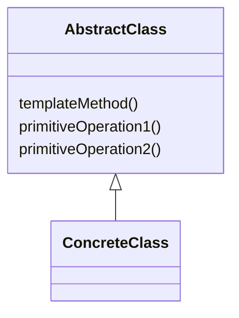

# Шаблонный метод (`Template Method`)

**Template Method** определяет скелет алгоритма в суперклассе, позволяя подклассам переопределять определенные шаги алгоритма без изменения его структуры.

## Полезные ссылки

### Официальная документация
- [Java Abstract Classes](https://docs.oracle.com/javase/tutorial/java/IandI/abstract.html)
- [Java Inheritance](https://docs.oracle.com/javase/tutorial/java/IandI/subclasses.html)

### См. также
- [[java-basics|Java Basics]] — **Java OOP**
- [[spring-framework-interview|Spring Core]] — **Spring Framework**
- [[strategy|Strategy]] — **Strategy Pattern**

## Содержание

- [Суть и запомнить](#суть-и-запомнить)
- [Что такое Template Method?](#что-такое-template-method)
  - [Основные характеристики](#основные-характеристики)
  - [Проблемы, которые решает](#проблемы-которые-решает)
- [Когда использовать Template Method?](#когда-использовать-template-method)
  - [Подходящие сценарии](#подходящие-сценарии)
  - [Признаки необходимости](#признаки-необходимости)
- [Структура паттерна](#структура-паттерна)
  - [Компоненты](#компоненты)
- [Реализация на Java](#реализация-на-java)
  - [Классический Template Method](#классический-template-method)
  - [Template Method с хуками](#template-method-с-хуками)
  - [Template Method с Spring](#template-method-с-spring)
- [Продвинутые реализации](#продвинутые-реализации)
  - [1. Template Method с AOP](#1-template-method-с-aop)
  - [2. Hierarchical Template Methods](#2-hierarchical-template-methods)
  - [3. Template Method с функциональными интерфейсами](#3-template-method-с-функциональными-интерфейсами)
- [Примеры использования](#примеры-использования)
  - [1. HTTP Request Processing](#1-http-request-processing)
  - [2. Database Transaction Template](#2-database-transaction-template)
  - [3. Test Execution Template](#3-test-execution-template)
- [Лучшие практики](#лучшие-практики)
  - [1. SOLID Principles](#1-solid-principles)
  - [2. Testing Template Method](#2-testing-template-method)
- [Решение проблем](#решение-проблем)
- [Частые вопросы](#частые-вопросы)
- [Заключение](#заключение)

## Суть и запомнить

**Суть в одном предложении:** В базовом классе — метод с фиксированной последовательностью шагов; часть шагов абстрактные или с дефолтной реализацией, подклассы их переопределяют.

**Запомнить:**
- Шаблонный метод задаёт скелет алгоритма; подклассы заполняют шаги.
- «Голливудский» принцип: базовый класс вызывает подкласс, не наоборот.
- Hook-методы — опциональные переопределяемые точки.

**Когда применять:** общая последовательность действий, детали различаются (обработка запросов, тесты, пайплайны).

## Что такое Template Method?

**Template Method** — это поведенческий паттерн проектирования, который определяет основу алгоритма и позволяет наследникам переопределять некоторые шаги алгоритма, не изменяя его структуру в целом.

### Основные характеристики

1. **Инвариантная структура**: Алгоритм фиксирован в суперклассе
2. **Гибкие шаги**: Подклассы могут переопределять конкретные шаги
3. **Hook методы**: Опциональные точки расширения
4. **Принцип Голливуда**: «Не звоните нам, мы сами вам позвоним»

### Проблемы, которые решает

Сравнение: дублирование структуры **process**() vs единый **template method** в суперклассе.

```java
// Плохо: Дублирование кода в подклассах
public abstract class DataProcessor {

    // Каждый подкласс дублирует эту структуру
    public void process() {
        readData();
        validateData();
        processData();
        saveData();
    }

    protected abstract void readData();
    protected abstract void validateData();
    protected abstract void processData();
    protected abstract void saveData();
}

class CSVProcessor extends DataProcessor {
    @Override
    protected void readData() { /* CSV logic */ }
    @Override
    protected void validateData() { /* CSV validation */ }
    @Override
    protected void processData() { /* CSV processing */ }
    @Override
    protected void saveData() { /* CSV save */ }
}

class XMLProcessor extends DataProcessor {
    @Override
    protected void readData() { /* XML logic */ }
    @Override
    protected void validateData() { /* XML validation */ }
    @Override
    protected void processData() { /* XML processing */ }
    @Override
    protected void saveData() { /* XML save */ }
}

// Хорошо: Template Method паттерн
public abstract class DataProcessor {

    // Template method - определяет структуру алгоритма
    public final void process() {
        readData();
        if (validateData()) { // Hook для валидации
            processData();
            saveData();
        } else {
            handleValidationError();
        }
        cleanup(); // Hook для очистки
    }

    // Primitive operations - должны быть переопределены
    protected abstract void readData();
    protected abstract boolean validateData();
    protected abstract void processData();
    protected abstract void saveData();

    // Hook methods - могут быть переопределены
    protected void handleValidationError() {
        System.out.println("Data validation failed");
    }

    protected void cleanup() {
        // Default implementation
    }
}
```

## Когда использовать Template Method?

### Подходящие сценарии

- **Алгоритмы с инвариантной структурой**: Структура алгоритма фиксирована, меняются детали
- **Избегание дублирования**: Общий код выносится в базовый класс
- **Контроль над расширением**: Подклассы могут расширять поведение в определенных точках
- **Фреймворки**: Определение каркаса для расширений

### Признаки необходимости

```java
// Признаки: Много похожих классов с одинаковой структурой
public class ReportGenerators {

    // Плохо: Каждый генератор имеет одинаковую структуру
    public class PDFReportGenerator {
        public void generateReport() {
            connectToDatabase();
            executeQuery();
            formatData();
            generatePDF();
            sendEmail();
        }
    }

    public class ExcelReportGenerator {
        public void generateReport() {
            connectToDatabase();
            executeQuery();
            formatData();
            generateExcel();
            sendEmail();
        }
    }

    public class HTMLReportGenerator {
        public void generateReport() {
            connectToDatabase();
            executeQuery();
            formatData();
            generateHTML();
            sendEmail();
        }
    }

    // Хорошо: Общая структура в базовом классе
    public abstract class ReportGenerator {

        public final void generateReport() {
            connectToDatabase();
            executeQuery();
            formatData();
            generateOutput(); // Примитивная операция
            sendEmail();
        }

        protected abstract void generateOutput();

        // Общие шаги
        private void connectToDatabase() { /* ... */ }
        private void executeQuery() { /* ... */ }
        private void formatData() { /* ... */ }
        private void sendEmail() { /* ... */ }
    }
}
```

## Структура паттерна



```text
┌─────────────────────────────────────────────────────────────┐
│                    AbstractClass                           │
│                                                             │
│  ┌─────────────────────────────────────────────────────┐    │
│  │              templateMethod()                       │    │
│  │                                                     │    │
│  │  ┌─────────────────────────────────────────────────┐ │    │
│  │  │           primitiveOperation1()                 │ │    │
│  │  │           primitiveOperation2()                 │ │    │
│  │  │           hook()                                │ │    │
│  │  └─────────────────────────────────────────────────┘ │    │
│  └─────────────────────────────────────────────────────┘    │
│                                                             │
│  // Определяет структуру алгоритма и абстрактные методы    │
└─────────────────────────────────────────────────────────────┼─┘
                                                              │
┌─────────────────────────────────────────────────────────────┼─┐
│                    ConcreteClass                            │ │
│                                                             │ │
│  ┌─────────────────────────────────────────────────────┐    │ │
│  │           primitiveOperation1()                     │    │ │
│  │           primitiveOperation2()                     │    │ │
│  │           hook()                                    │    │ │
│  │                                                     │    │ │
│  │  // Реализует примитивные операции и переопределяет     │    │ │
│  │  // hook методы                                        │    │ │
│  └─────────────────────────────────────────────────────┘    │ │
└─────────────────────────────────────────────────────────────┘
                                                              │
┌─────────────────────────────────────────────────────────────┼─┐
│                       Client                                │ │
│                                                             │ │
│  AbstractClass template = new ConcreteClass()               │ │
│  template.templateMethod()  // Выполняет алгоритм          │ │
│                                                             │ │
└─────────────────────────────────────────────────────────────┘
```

### Компоненты

1. **AbstractClass**: Определяет **template method** и абстрактные **primitive operations**
2. **ConcreteClass**: Реализует **primitive operations**
3. **Client**: Использует **template method**

## Реализация на Java

### Классический Template Method

```java
// Abstract Class
abstract class DataProcessor {

    // Template method - определяет структуру алгоритма
    public final void processData() {
        readData();
        if (validateData()) {
            transformData();
            saveData();
        } else {
            handleValidationFailure();
        }
        cleanup();
    }

    // Primitive operations - должны быть реализованы подклассами
    protected abstract void readData();
    protected abstract boolean validateData();
    protected abstract void transformData();
    protected abstract void saveData();

    // Hook methods - могут быть переопределены
    protected void handleValidationFailure() {
        System.out.println("Data validation failed");
    }

    protected void cleanup() {
        // Default implementation - ничего не делать
    }
}

// Concrete Classes
class CSVDataProcessor extends DataProcessor {

    @Override
    protected void readData() {
        System.out.println("Reading data from CSV file");
    }

    @Override
    protected boolean validateData() {
        System.out.println("Validating CSV data format");
        return true; // Simplified validation
    }

    @Override
    protected void transformData() {
        System.out.println("Transforming CSV data to internal format");
    }

    @Override
    protected void saveData() {
        System.out.println("Saving processed data to database");
    }

    @Override
    protected void cleanup() {
        System.out.println("Cleaning up CSV resources");
    }
}

class JSONDataProcessor extends DataProcessor {

    @Override
    protected void readData() {
        System.out.println("Reading data from JSON file");
    }

    @Override
    protected boolean validateData() {
        System.out.println("Validating JSON data format");
        return true; // Simplified validation
    }

    @Override
    protected void transformData() {
        System.out.println("Transforming JSON data to internal format");
    }

    @Override
    protected void saveData() {
        System.out.println("Saving processed data to database");
    }
}

class XMLDataProcessor extends DataProcessor {

    @Override
    protected void readData() {
        System.out.println("Reading data from XML file");
    }

    @Override
    protected boolean validateData() {
        System.out.println("Validating XML data format");
        return false; // Simulate validation failure
    }

    @Override
    protected void transformData() {
        System.out.println("Transforming XML data to internal format");
    }

    @Override
    protected void saveData() {
        System.out.println("Saving processed data to database");
    }

    @Override
    protected void handleValidationFailure() {
        System.out.println("XML validation failed - skipping processing");
    }
}

public class TemplateMethodDemo {
    public static void main(String[] args) {
        DataProcessor csvProcessor = new CSVDataProcessor();
        DataProcessor jsonProcessor = new JSONDataProcessor();
        DataProcessor xmlProcessor = new XMLDataProcessor();

        System.out.println("=== Processing CSV data ===");
        csvProcessor.processData();

        System.out.println("\n=== Processing JSON data ===");
        jsonProcessor.processData();

        System.out.println("\n=== Processing XML data (will fail validation) ===");
        xmlProcessor.processData();
    }
}
```

### Template Method с хуками

```java
// Abstract Class с множеством хуков
abstract class Game {

    // Template method
    public final void play() {
        initializeGame();
        setupPlayers();
        startGame();

        while (!isGameOver()) {
            playRound();
            updateScore();
            if (shouldPause()) {
                pauseGame();
            }
        }

        endGame();
        showResults();
        cleanup();
    }

    // Primitive operations
    protected abstract void initializeGame();
    protected abstract void setupPlayers();
    protected abstract void startGame();
    protected abstract boolean isGameOver();
    protected abstract void playRound();
    protected abstract void endGame();
    protected abstract void showResults();

    // Hook operations
    protected void updateScore() {
        // Default implementation
    }

    protected boolean shouldPause() {
        return false; // Default - no pause
    }

    protected void pauseGame() {
        // Default implementation
    }

    protected void cleanup() {
        // Default implementation
    }
}

// Concrete Games
class ChessGame extends Game {

    private int currentPlayer = 0;
    private boolean gameOver = false;

    @Override
    protected void initializeGame() {
        System.out.println("Initializing chess board and pieces");
    }

    @Override
    protected void setupPlayers() {
        System.out.println("Setting up chess players");
    }

    @Override
    protected void startGame() {
        System.out.println("Chess game started!");
    }

    @Override
    protected boolean isGameOver() {
        return gameOver;
    }

    @Override
    protected void playRound() {
        currentPlayer = (currentPlayer + 1) % 2;
        System.out.println("Player " + (currentPlayer + 1) + " makes a move");

        // Simulate game ending after 10 moves
        if (Math.random() < 0.1) {
            gameOver = true;
        }
    }

    @Override
    protected void updateScore() {
        System.out.println("Updating chess game score");
    }

    @Override
    protected boolean shouldPause() {
        return Math.random() < 0.2; // 20% chance to pause
    }

    @Override
    protected void pauseGame() {
        System.out.println("Chess game paused");
        try {
            Thread.sleep(1000); // Simulate pause
        } catch (InterruptedException e) {
            Thread.currentThread().interrupt();
        }
        System.out.println("Chess game resumed");
    }

    @Override
    protected void endGame() {
        System.out.println("Chess game ended");
    }

    @Override
    protected void showResults() {
        System.out.println("Chess game results: Player " + (currentPlayer + 1) + " wins!");
    }

    @Override
    protected void cleanup() {
        System.out.println("Cleaning up chess game resources");
    }
}

class CardGame extends Game {

    private List<String> players = new ArrayList<>();
    private int roundsPlayed = 0;
    private final int maxRounds = 5;

    @Override
    protected void initializeGame() {
        System.out.println("Shuffling deck and preparing cards");
    }

    @Override
    protected void setupPlayers() {
        players.add("Alice");
        players.add("Bob");
        players.add("Charlie");
        System.out.println("Setting up players: " + players);
    }

    @Override
    protected void startGame() {
        System.out.println("Card game started with " + players.size() + " players!");
    }

    @Override
    protected boolean isGameOver() {
        return roundsPlayed >= maxRounds;
    }

    @Override
    protected void playRound() {
        roundsPlayed++;
        System.out.println("Playing round " + roundsPlayed + " of card game");
        System.out.println("Dealing cards to players...");
    }

    @Override
    protected void updateScore() {
        System.out.println("Updating card game scores after round " + roundsPlayed);
    }

    @Override
    protected void endGame() {
        System.out.println("Card game ended after " + roundsPlayed + " rounds");
    }

    @Override
    protected void showResults() {
        System.out.println("Card game final results:");
        for (int i = 0; i < players.size(); i++) {
            System.out.println(players.get(i) + ": " + (Math.random() * 100) + " points");
        }
    }
}

public class GameTemplateDemo {
    public static void main(String[] args) {
        Game chessGame = new ChessGame();
        Game cardGame = new CardGame();

        System.out.println("=== Playing Chess ===");
        chessGame.play();

        System.out.println("\n=== Playing Card Game ===");
        cardGame.play();
    }
}
```

### Template Method с Spring

```java
// Spring-based Template Method
@Component
public abstract class AbstractDataExporter {

    // Template method
    @Transactional
    public final void exportData(String criteria, OutputStream output) {
        try {
            prepareExport();
            List<?> data = fetchData(criteria);
            validateData(data);
            writeHeader(output);
            writeData(data, output);
            writeFooter(output);
            finalizeExport();
        } catch (Exception e) {
            handleExportError(e);
            throw new DataExportException("Export failed", e);
        }
    }

    // Primitive operations
    protected abstract List<?> fetchData(String criteria);
    protected abstract void writeHeader(OutputStream output) throws IOException;
    protected abstract void writeData(List<?> data, OutputStream output) throws IOException;
    protected abstract void writeFooter(OutputStream output) throws IOException;

    // Hook operations
    protected void prepareExport() {
        // Default: do nothing
    }

    protected void validateData(List<?> data) {
        if (data == null || data.isEmpty()) {
            throw new IllegalArgumentException("No data to export");
        }
    }

    protected void finalizeExport() {
        // Default: do nothing
    }

    protected void handleExportError(Exception e) {
        // Default: log error
        System.err.println("Export error: " + e.getMessage());
    }
}

// Concrete exporters
@Component
@Qualifier("csvExporter")
class CSVDataExporter extends AbstractDataExporter {

    @Autowired
    private UserRepository userRepository;

    @Override
    protected List<?> fetchData(String criteria) {
        return userRepository.findByNameContaining(criteria);
    }

    @Override
    protected void writeHeader(OutputStream output) throws IOException {
        output.write("ID,Name,Email\n".getBytes());
    }

    @Override
    protected void writeData(List<?> data, OutputStream output) throws IOException {
        for (Object item : data) {
            User user = (User) item;
            String line = user.getId() + "," + user.getName() + "," + user.getEmail() + "\n";
            output.write(line.getBytes());
        }
    }

    @Override
    protected void writeFooter(OutputStream output) throws IOException {
        output.write("--- End of CSV Export ---\n".getBytes());
    }

    @Override
    protected void finalizeExport() {
        System.out.println("CSV export completed successfully");
    }
}

@Component
@Qualifier("jsonExporter")
class JSONDataExporter extends AbstractDataExporter {

    @Autowired
    private ProductRepository productRepository;

    @Override
    protected List<?> fetchData(String criteria) {
        return productRepository.findByCategory(criteria);
    }

    @Override
    protected void writeHeader(OutputStream output) throws IOException {
        output.write("[\n".getBytes());
    }

    @Override
    protected void writeData(List<?> data, OutputStream output) throws IOException {
        ObjectMapper mapper = new ObjectMapper();
        for (int i = 0; i < data.size(); i++) {
            String json = mapper.writeValueAsString(data.get(i));
            if (i > 0) {
                output.write(",\n".getBytes());
            }
            output.write(json.getBytes());
        }
        output.write("\n".getBytes());
    }

    @Override
    protected void writeFooter(OutputStream output) throws IOException {
        output.write("]\n".getBytes());
    }
}

// Service using exporters
@Service
public class DataExportService {

    @Autowired
    @Qualifier("csvExporter")
    private AbstractDataExporter csvExporter;

    @Autowired
    @Qualifier("jsonExporter")
    private AbstractDataExporter jsonExporter;

    public void exportUsersToCSV(String nameCriteria, OutputStream output) {
        csvExporter.exportData(nameCriteria, output);
    }

    public void exportProductsToJSON(String category, OutputStream output) {
        jsonExporter.exportData(category, output);
    }
}
```

## Продвинутые реализации

### 1. Template Method с AOP

```java
// Template Method с аспектами для логирования и метрик
@Aspect
@Component
public class TemplateMethodAspect {

    @Around("execution(* com.example.AbstractTemplate+.execute())")
    public Object logTemplateExecution(ProceedingJoinPoint joinPoint) throws Throwable {
        String templateName = joinPoint.getTarget().getClass().getSimpleName();
        long startTime = System.nanoTime();

        System.out.println("Starting template execution: " + templateName);

        try {
            Object result = joinPoint.proceed();
            long duration = (System.nanoTime() - startTime) / 1_000_000;

            System.out.println("Template " + templateName + " completed in " + duration + "ms");
            return result;
        } catch (Exception e) {
            System.err.println("Template " + templateName + " failed: " + e.getMessage());
            throw e;
        }
    }
}

abstract class AbstractTemplate<T> {

    // Template method
    public final T execute() {
        initialize();
        T result = doExecute();
        cleanup();
        return result;
    }

    protected void initialize() {
        // Default implementation
    }

    protected abstract T doExecute();

    protected void cleanup() {
        // Default implementation
    }
}

class DatabaseQueryTemplate extends AbstractTemplate<List<Map<String, Object>>> {

    private final String query;
    private final Object[] params;

    public DatabaseQueryTemplate(String query, Object... params) {
        this.query = query;
        this.params = params;
    }

    @Override
    protected void initialize() {
        System.out.println("Initializing database connection");
    }

    @Override
    protected List<Map<String, Object>> doExecute() {
        System.out.println("Executing query: " + query);
        // Simulate database query
        List<Map<String, Object>> results = new ArrayList<>();
        Map<String, Object> row = new HashMap<>();
        row.put("id", 1);
        row.put("name", "Test");
        results.add(row);
        return results;
    }

    @Override
    protected void cleanup() {
        System.out.println("Closing database connection");
    }
}

class FileProcessingTemplate extends AbstractTemplate<Integer> {

    private final String filePath;

    public FileProcessingTemplate(String filePath) {
        this.filePath = filePath;
    }

    @Override
    protected void initialize() {
        System.out.println("Opening file: " + filePath);
    }

    @Override
    protected Integer doExecute() {
        System.out.println("Processing file: " + filePath);
        // Simulate file processing
        return 100; // lines processed
    }

    @Override
    protected void cleanup() {
        System.out.println("Closing file: " + filePath);
    }
}

public class AopTemplateDemo {
    public static void main(String[] args) {
        AbstractTemplate<List<Map<String, Object>>> dbTemplate =
            new DatabaseQueryTemplate("SELECT * FROM users");

        AbstractTemplate<Integer> fileTemplate =
            new FileProcessingTemplate("/tmp/data.txt");

        dbTemplate.execute();
        fileTemplate.execute();
    }
}
```

### 2. Hierarchical Template Methods

```java
// Иерархические шаблонные методы
abstract class AbstractWorkflow {

    // Main template method
    public final void executeWorkflow() {
        setupWorkflow();
        execute();
        teardownWorkflow();
    }

    protected void setupWorkflow() {
        System.out.println("Setting up workflow");
    }

    protected abstract void execute();

    protected void teardownWorkflow() {
        System.out.println("Tearing down workflow");
    }
}

abstract class AbstractDataWorkflow extends AbstractWorkflow {

    // Intermediate template method
    @Override
    protected final void execute() {
        loadData();
        processData();
        saveResults();
    }

    protected abstract void loadData();
    protected abstract void processData();
    protected abstract void saveResults();

    // Hook for data validation
    protected boolean validateData(Object data) {
        return true; // Default: always valid
    }

    // Hook for error handling
    protected void handleError(Exception e) {
        System.err.println("Workflow error: " + e.getMessage());
    }
}

abstract class AbstractBatchWorkflow extends AbstractDataWorkflow {

    // More specific template method
    @Override
    protected final void processData() {
        initializeBatch();
        processBatchItems();
        finalizeBatch();
    }

    protected abstract void initializeBatch();
    protected abstract void processBatchItems();
    protected abstract void finalizeBatch();

    // Hook for batch size
    protected int getBatchSize() {
        return 100; // Default batch size
    }
}

class UserImportWorkflow extends AbstractBatchWorkflow {

    @Override
    protected void loadData() {
        System.out.println("Loading user data from CSV file");
    }

    @Override
    protected void initializeBatch() {
        System.out.println("Initializing user import batch");
    }

    @Override
    protected void processBatchItems() {
        int batchSize = getBatchSize();
        System.out.println("Processing " + batchSize + " users in batch");

        for (int i = 0; i < batchSize; i++) {
            System.out.println("Processing user " + (i + 1));
            // Simulate user processing
        }
    }

    @Override
    protected void finalizeBatch() {
        System.out.println("Finalizing user import batch");
    }

    @Override
    protected void saveResults() {
        System.out.println("Saving imported users to database");
    }

    @Override
    protected boolean validateData(Object data) {
        // Custom validation for user data
        System.out.println("Validating user data");
        return true;
    }

    @Override
    protected void handleError(Exception e) {
        System.err.println("User import error: " + e.getMessage());
        // Custom error handling
    }
}

class ProductExportWorkflow extends AbstractDataWorkflow {

    @Override
    protected void loadData() {
        System.out.println("Loading product data from database");
    }

    @Override
    protected void processData() {
        System.out.println("Processing and formatting product data for export");
        // Custom processing logic
    }

    @Override
    protected void saveResults() {
        System.out.println("Saving product data to XML file");
    }

    @Override
    protected void setupWorkflow() {
        super.setupWorkflow();
        System.out.println("Setting up product export specific resources");
    }

    @Override
    protected void teardownWorkflow() {
        System.out.println("Cleaning up product export resources");
        super.teardownWorkflow();
    }
}

public class HierarchicalTemplateDemo {
    public static void main(String[] args) {
        AbstractWorkflow userImport = new UserImportWorkflow();
        AbstractWorkflow productExport = new ProductExportWorkflow();

        System.out.println("=== User Import Workflow ===");
        userImport.executeWorkflow();

        System.out.println("\n=== Product Export Workflow ===");
        productExport.executeWorkflow();
    }
}
```

### 3. Template Method с функциональными интерфейсами

```java
// Template Method с функциональными интерфейсами
@FunctionalInterface
interface Step<T, R> {
    R execute(T input) throws Exception;
}

@FunctionalInterface
interface Validator<T> {
    boolean validate(T input);
}

@FunctionalInterface
interface Hook {
    void execute() throws Exception;
}

class FunctionalTemplate<T, R> {

    private final List<Step<?, ?>> steps;
    private final Validator<T> validator;
    private final Hook beforeHook;
    private final Hook afterHook;
    private final Hook errorHook;

    private FunctionalTemplate(Builder<T, R> builder) {
        this.steps = builder.steps;
        this.validator = builder.validator;
        this.beforeHook = builder.beforeHook;
        this.afterHook = builder.afterHook;
        this.errorHook = builder.errorHook;
    }

    // Template method
    public R execute(T input) throws Exception {
        try {
            // Before hook
            if (beforeHook != null) {
                beforeHook.execute();
            }

            // Validation
            if (validator != null && !validator.validate(input)) {
                throw new IllegalArgumentException("Input validation failed");
            }

            // Execute steps
            Object current = input;
            for (Step step : steps) {
                current = step.execute(current);
            }

            // After hook
            if (afterHook != null) {
                afterHook.execute();
            }

            @SuppressWarnings("unchecked")
            R result = (R) current;
            return result;

        } catch (Exception e) {
            // Error hook
            if (errorHook != null) {
                errorHook.execute();
            }
            throw e;
        }
    }

    public static <T, R> Builder<T, R> builder() {
        return new Builder<>();
    }

    public static class Builder<T, R> {
        private final List<Step<?, ?>> steps = new ArrayList<>();
        private Validator<T> validator;
        private Hook beforeHook;
        private Hook afterHook;
        private Hook errorHook;

        public <U> Builder<T, R> addStep(Step<T, U> step) {
            steps.add(step);
            return this;
        }

        public Builder<T, R> withValidator(Validator<T> validator) {
            this.validator = validator;
            return this;
        }

        public Builder<T, R> before(Hook hook) {
            this.beforeHook = hook;
            return this;
        }

        public Builder<T, R> after(Hook hook) {
            this.afterHook = hook;
            return this;
        }

        public Builder<T, R> onError(Hook hook) {
            this.errorHook = hook;
            return this;
        }

        public FunctionalTemplate<T, R> build() {
            return new FunctionalTemplate<>(this);
        }
    }
}

// Примеры использования
public class FunctionalTemplateDemo {

    static class User {
        private final String name;
        private final String email;

        public User(String name, String email) {
            this.name = name;
            this.email = email;
        }

        public String getName() { return name; }
        public String getEmail() { return email; }

        @Override
        public String toString() {
            return "User{name='" + name + "', email='" + email + "'}";
        }
    }

    public static void main(String[] args) {
        // User registration template
        FunctionalTemplate<String, User> userRegistrationTemplate = FunctionalTemplate.<String, User>builder()
            .before(() -> System.out.println("Starting user registration"))
            .withValidator(email -> email != null && email.contains("@"))
            .addStep(email -> {
                System.out.println("Validating email: " + email);
                return email.toLowerCase();
            })
            .addStep(normalizedEmail -> {
                System.out.println("Creating user with email: " + normalizedEmail);
                return new User("DefaultName", normalizedEmail);
            })
            .addStep(user -> {
                System.out.println("Saving user: " + user);
                // Simulate saving
                return user;
            })
            .after(() -> System.out.println("User registration completed"))
            .onError(() -> System.out.println("User registration failed"))
            .build();

        // Data processing template
        FunctionalTemplate<List<Integer>, List<String>> dataProcessingTemplate =
            FunctionalTemplate.<List<Integer>, List<String>>builder()
                .before(() -> System.out.println("Starting data processing"))
                .withValidator(list -> list != null && !list.isEmpty())
                .addStep(numbers -> {
                    System.out.println("Filtering even numbers");
                    return numbers.stream()
                        .filter(n -> n % 2 == 0)
                        .collect(Collectors.toList());
                })
                .addStep(evenNumbers -> {
                    System.out.println("Converting to strings");
                    return evenNumbers.stream()
                        .map(String::valueOf)
                        .collect(Collectors.toList());
                })
                .addStep(strings -> {
                    System.out.println("Adding prefix");
                    return strings.stream()
                        .map(s -> "Number: " + s)
                        .collect(Collectors.toList());
                })
                .after(() -> System.out.println("Data processing completed"))
                .build();

        try {
            // Test user registration
            System.out.println("=== User Registration ===");
            User user = userRegistrationTemplate.execute("John.Doe@Example.Com");
            System.out.println("Registered user: " + user);

            // Test data processing
            System.out.println("\n=== Data Processing ===");
            List<String> result = dataProcessingTemplate.execute(Arrays.asList(1, 2, 3, 4, 5, 6));
            System.out.println("Processed data: " + result);

            // Test error handling
            System.out.println("\n=== Error Handling ===");
            userRegistrationTemplate.execute("invalid-email");

        } catch (Exception e) {
            System.err.println("Error: " + e.getMessage());
        }
    }
}
```

## Примеры использования

### 1. HTTP Request Processing

```java
// Template Method для обработки HTTP запросов
public abstract class HttpRequestProcessor {

    // Template method
    public final HttpResponse processRequest(HttpRequest request) {
        try {
            validateRequest(request);
            authenticate(request);
            authorize(request);
            HttpResponse response = handleRequest(request);
            logRequest(request, response);
            return response;
        } catch (Exception e) {
            return handleError(e);
        }
    }

    // Primitive operations
    protected abstract HttpResponse handleRequest(HttpRequest request) throws Exception;

    // Hook operations
    protected void validateRequest(HttpRequest request) throws ValidationException {
        if (request.getUri() == null || request.getUri().isEmpty()) {
            throw new ValidationException("URI is required");
        }
    }

    protected void authenticate(HttpRequest request) throws AuthenticationException {
        // Default: no authentication required
    }

    protected void authorize(HttpRequest request) throws AuthorizationException {
        // Default: no authorization required
    }

    protected void logRequest(HttpRequest request, HttpResponse response) {
        System.out.println("Request: " + request.getMethod() + " " + request.getUri() +
            " -> Response: " + response.getStatusCode());
    }

    protected HttpResponse handleError(Exception e) {
        System.err.println("Request processing error: " + e.getMessage());
        return new HttpResponse(500, "Internal Server Error");
    }
}

// Concrete processors
class UserApiProcessor extends HttpRequestProcessor {

    @Override
    protected HttpResponse handleRequest(HttpRequest request) throws Exception {
        switch (request.getMethod()) {
            case "GET":
                return new HttpResponse(200, "User data retrieved");
            case "POST":
                return new HttpResponse(201, "User created");
            case "PUT":
                return new HttpResponse(200, "User updated");
            case "DELETE":
                return new HttpResponse(204, "User deleted");
            default:
                return new HttpResponse(405, "Method not allowed");
        }
    }

    @Override
    protected void authenticate(HttpRequest request) throws AuthenticationException {
        String authHeader = request.getHeaders().get("Authorization");
        if (authHeader == null || !authHeader.startsWith("Bearer ")) {
            throw new AuthenticationException("Authentication required");
        }
        // Validate token...
    }

    @Override
    protected void authorize(HttpRequest request) throws AuthorizationException {
        // Check user permissions...
        System.out.println("Authorizing user for " + request.getMethod() + " operation");
    }
}

class PublicApiProcessor extends HttpRequestProcessor {

    @Override
    protected HttpResponse handleRequest(HttpRequest request) throws Exception {
        return new HttpResponse(200, "Public API response for " + request.getUri());
    }

    @Override
    protected void logRequest(HttpRequest request, HttpResponse response) {
        // Extended logging for public APIs
        System.out.println("PUBLIC API - " + request.getMethod() + " " + request.getUri() +
            " [" + response.getStatusCode() + "] at " + LocalDateTime.now());
    }
}

// Domain objects
class HttpRequest {
    private final String method;
    private final String uri;
    private final Map<String, String> headers;

    public HttpRequest(String method, String uri) {
        this.method = method;
        this.uri = uri;
        this.headers = new HashMap<>();
    }

    public String getMethod() { return method; }
    public String getUri() { return uri; }
    public Map<String, String> getHeaders() { return headers; }

    public void addHeader(String name, String value) {
        headers.put(name, value);
    }
}

class HttpResponse {
    private final int statusCode;
    private final String body;

    public HttpResponse(int statusCode, String body) {
        this.statusCode = statusCode;
        this.body = body;
    }

    public int getStatusCode() { return statusCode; }
    public String getBody() { return body; }
}

class ValidationException extends Exception {
    public ValidationException(String message) {
        super(message);
    }
}

class AuthenticationException extends Exception {
    public AuthenticationException(String message) {
        super(message);
    }
}

class AuthorizationException extends Exception {
    public AuthorizationException(String message) {
        super(message);
    }
}

public class HttpProcessingDemo {
    public static void main(String[] args) {
        HttpRequestProcessor userApi = new UserApiProcessor();
        HttpRequestProcessor publicApi = new PublicApiProcessor();

        // User API requests
        HttpRequest userGetRequest = new HttpRequest("GET", "/api/users/123");
        userGetRequest.addHeader("Authorization", "Bearer token123");

        HttpRequest userPostRequest = new HttpRequest("POST", "/api/users");
        userPostRequest.addHeader("Authorization", "Bearer token123");

        // Public API request
        HttpRequest publicRequest = new HttpRequest("GET", "/api/public/info");

        System.out.println("=== User API Requests ===");
        HttpResponse response1 = userApi.processRequest(userGetRequest);
        System.out.println("Response: " + response1.getStatusCode() + " - " + response1.getBody());

        HttpResponse response2 = userApi.processRequest(userPostRequest);
        System.out.println("Response: " + response2.getStatusCode() + " - " + response2.getBody());

        System.out.println("\n=== Public API Request ===");
        HttpResponse response3 = publicApi.processRequest(publicRequest);
        System.out.println("Response: " + response3.getStatusCode() + " - " + response3.getBody());

        // Test unauthenticated request
        System.out.println("\n=== Unauthenticated Request ===");
        HttpRequest unauthRequest = new HttpRequest("GET", "/api/users/123");
        HttpResponse response4 = userApi.processRequest(unauthRequest);
        System.out.println("Response: " + response4.getStatusCode() + " - " + response4.getBody());
    }
}
```

### 2. Database Transaction Template

```java
// Template Method для транзакций БД
public abstract class TransactionTemplate<T> {

    @Autowired
    private DataSource dataSource;

    // Template method
    public final T execute() throws SQLException {
        Connection connection = null;
        try {
            connection = dataSource.getConnection();
            connection.setAutoCommit(false);

            T result = doInTransaction(connection);

            connection.commit();
            return result;

        } catch (Exception e) {
            if (connection != null) {
                try {
                    connection.rollback();
                } catch (SQLException rollbackEx) {
                    // Log rollback failure
                }
            }
            throw new SQLException("Transaction failed", e);
        } finally {
            if (connection != null) {
                try {
                    connection.setAutoCommit(true);
                    connection.close();
                } catch (SQLException closeEx) {
                    // Log close failure
                }
            }
        }
    }

    // Primitive operation
    protected abstract T doInTransaction(Connection connection) throws SQLException;

    // Hook for transaction isolation
    protected int getIsolationLevel() {
        return Connection.TRANSACTION_READ_COMMITTED;
    }

    // Hook for timeout
    protected int getTimeoutSeconds() {
        return 30; // Default 30 seconds
    }
}

// Concrete transaction implementations
@Component
class UserCreationTransaction extends TransactionTemplate<Long> {

    private final String name;
    private final String email;

    public UserCreationTransaction(String name, String email) {
        this.name = name;
        this.email = email;
    }

    @Override
    protected Long doInTransaction(Connection connection) throws SQLException {
        // Insert user
        String insertUserSql = "INSERT INTO users (name, email) VALUES (?, ?)";
        try (PreparedStatement stmt = connection.prepareStatement(insertUserSql, Statement.RETURN_GENERATED_KEYS)) {
            stmt.setString(1, name);
            stmt.setString(2, email);
            stmt.executeUpdate();

            try (ResultSet keys = stmt.getGeneratedKeys()) {
                if (keys.next()) {
                    long userId = keys.getLong(1);

                    // Create user profile
                    createUserProfile(connection, userId);

                    return userId;
                }
            }
        }
        throw new SQLException("Failed to create user");
    }

    private void createUserProfile(Connection connection, long userId) throws SQLException {
        String insertProfileSql = "INSERT INTO user_profiles (user_id, created_date) VALUES (?, ?)";
        try (PreparedStatement stmt = connection.prepareStatement(insertProfileSql)) {
            stmt.setLong(1, userId);
            stmt.setTimestamp(2, Timestamp.valueOf(LocalDateTime.now()));
            stmt.executeUpdate();
        }
    }

    @Override
    protected int getIsolationLevel() {
        return Connection.TRANSACTION_SERIALIZABLE; // Higher isolation for user creation
    }
}

@Component
class OrderProcessingTransaction extends TransactionTemplate<OrderResult> {

    private final Order order;

    public OrderProcessingTransaction(Order order) {
        this.order = order;
    }

    @Override
    protected OrderResult doInTransaction(Connection connection) throws SQLException {
        // Check inventory
        if (!checkInventory(connection, order)) {
            throw new SQLException("Insufficient inventory");
        }

        // Create order
        long orderId = createOrder(connection, order);

        // Update inventory
        updateInventory(connection, order);

        // Process payment
        processPayment(connection, orderId, order);

        return new OrderResult(orderId, "Order processed successfully");
    }

    private boolean checkInventory(Connection connection, Order order) throws SQLException {
        // Check if all items are available
        return true; // Simplified
    }

    private long createOrder(Connection connection, Order order) throws SQLException {
        // Insert order
        return 123L; // Simplified
    }

    private void updateInventory(Connection connection, Order order) throws SQLException {
        // Update inventory levels
    }

    private void processPayment(Connection connection, long orderId, Order order) throws SQLException {
        // Process payment
    }
}

class OrderResult {
    private final long orderId;
    private final String message;

    public OrderResult(long orderId, String message) {
        this.orderId = orderId;
        this.message = message;
    }

    public long getOrderId() { return orderId; }
    public String getMessage() { return message; }
}

class Order {
    private final List<OrderItem> items;
    private final BigDecimal total;

    public Order(List<OrderItem> items) {
        this.items = items;
        this.total = items.stream()
            .map(item -> item.getPrice().multiply(BigDecimal.valueOf(item.getQuantity())))
            .reduce(BigDecimal.ZERO, BigDecimal::add);
    }

    public List<OrderItem> getItems() { return items; }
    public BigDecimal getTotal() { return total; }
}

class OrderItem {
    private final String productId;
    private final BigDecimal price;
    private final int quantity;

    public OrderItem(String productId, BigDecimal price, int quantity) {
        this.productId = productId;
        this.price = price;
        this.quantity = quantity;
    }

    public String getProductId() { return productId; }
    public BigDecimal getPrice() { return price; }
    public int getQuantity() { return quantity; }
}

@Service
class TransactionService {

    public <T> T executeTransaction(TransactionTemplate<T> transaction) throws SQLException {
        return transaction.execute();
    }
}

public class TransactionTemplateDemo {
    public static void main(String[] args) {
        // Note: This is a simplified demo. In real Spring application,
        // transactions would be managed by Spring's @Transactional

        System.out.println("Transaction Template Pattern Demo");
        System.out.println("This example shows how to structure database operations");
        System.out.println("with proper transaction management and rollback capabilities.");
    }
}
```

### 3. Test Execution Template

```java
// Template Method для выполнения тестов
public abstract class TestTemplate {

    // Template method
    public final TestResult executeTest() {
        TestResult result = new TestResult();
        result.setTestName(getTestName());

        try {
            setup();
            result.setStartTime(System.currentTimeMillis());

            executeTestLogic();

            result.setEndTime(System.currentTimeMillis());
            result.setStatus(TestStatus.PASSED);

        } catch (AssertionError e) {
            result.setEndTime(System.currentTimeMillis());
            result.setStatus(TestStatus.FAILED);
            result.setErrorMessage(e.getMessage());

        } catch (Exception e) {
            result.setEndTime(System.currentTimeMillis());
            result.setStatus(TestStatus.ERROR);
            result.setErrorMessage(e.getMessage());

        } finally {
            cleanup();
        }

        return result;
    }

    // Primitive operations
    protected abstract String getTestName();
    protected abstract void executeTestLogic() throws Exception;

    // Hook operations
    protected void setup() throws Exception {
        // Default: no setup
    }

    protected void cleanup() throws Exception {
        // Default: no cleanup
    }

    protected void beforeAssertion() {
        // Default: no action
    }

    protected void afterAssertion() {
        // Default: no action
    }
}

// Concrete test implementations
class UserServiceTest extends TestTemplate {

    private UserService userService;
    private TestDatabase testDb;

    @Override
    protected String getTestName() {
        return "UserService Integration Test";
    }

    @Override
    protected void setup() throws Exception {
        testDb = new TestDatabase();
        testDb.start();
        userService = new UserService(testDb.getDataSource());
        System.out.println("Test database started");
    }

    @Override
    protected void executeTestLogic() throws Exception {
        // Test user creation
        beforeAssertion();
        User user = userService.createUser("John", "john@example.com");
        assert user != null : "User should be created";
        assert user.getName().equals("John") : "User name should be John";
        afterAssertion();

        // Test user retrieval
        beforeAssertion();
        User retrieved = userService.getUser(user.getId());
        assert retrieved != null : "User should be found";
        assert retrieved.getEmail().equals("john@example.com") : "Email should match";
        afterAssertion();

        System.out.println("All assertions passed");
    }

    @Override
    protected void cleanup() throws Exception {
        if (testDb != null) {
            testDb.stop();
            System.out.println("Test database stopped");
        }
    }

    @Override
    protected void beforeAssertion() {
        System.out.println("About to execute assertion...");
    }

    @Override
    protected void afterAssertion() {
        System.out.println("Assertion completed successfully");
    }
}

class PaymentServiceTest extends TestTemplate {

    private PaymentService paymentService;
    private MockPaymentGateway mockGateway;

    @Override
    protected String getTestName() {
        return "PaymentService Unit Test";
    }

    @Override
    protected void setup() throws Exception {
        mockGateway = new MockPaymentGateway();
        paymentService = new PaymentService(mockGateway);
        System.out.println("Mock payment gateway initialized");
    }

    @Override
    protected void executeTestLogic() throws Exception {
        Payment payment = new Payment("123", BigDecimal.valueOf(100.00));

        // Test successful payment
        beforeAssertion();
        PaymentResult result = paymentService.processPayment(payment);
        assert result.isSuccess() : "Payment should succeed";
        assert result.getTransactionId() != null : "Transaction ID should be generated";
        afterAssertion();

        // Test payment amount validation
        beforeAssertion();
        Payment invalidPayment = new Payment("123", BigDecimal.valueOf(-50.00));
        try {
            paymentService.processPayment(invalidPayment);
            assert false : "Should throw exception for negative amount";
        } catch (IllegalArgumentException e) {
            // Expected
            assert e.getMessage().contains("amount") : "Error message should mention amount";
        }
        afterAssertion();

        System.out.println("Payment tests passed");
    }

    @Override
    protected void cleanup() throws Exception {
        // Cleanup mock objects
        System.out.println("Mock objects cleaned up");
    }
}

// Test framework classes
enum TestStatus {
    PASSED, FAILED, ERROR
}

class TestResult {
    private String testName;
    private TestStatus status;
    private long startTime;
    private long endTime;
    private String errorMessage;

    public String getTestName() { return testName; }
    public void setTestName(String testName) { this.testName = testName; }

    public TestStatus getStatus() { return status; }
    public void setStatus(TestStatus status) { this.status = status; }

    public long getStartTime() { return startTime; }
    public void setStartTime(long startTime) { this.startTime = startTime; }

    public long getEndTime() { return endTime; }
    public void setEndTime(long endTime) { this.endTime = endTime; }

    public long getDuration() { return endTime - startTime; }

    public String getErrorMessage() { return errorMessage; }
    public void setErrorMessage(String errorMessage) { this.errorMessage = errorMessage; }

    @Override
    public String toString() {
        return String.format("Test '%s': %s (%d ms)",
            testName, status, getDuration()) +
            (errorMessage != null ? " - " + errorMessage : "");
    }
}

class TestRunner {
    public static void main(String[] args) {
        List<TestTemplate> tests = Arrays.asList(
            new UserServiceTest(),
            new PaymentServiceTest()
        );

        List<TestResult> results = new ArrayList<>();

        for (TestTemplate test : tests) {
            System.out.println("Running " + test.getClass().getSimpleName() + "...");
            TestResult result = test.executeTest();
            results.add(result);
            System.out.println(result);
            System.out.println();
        }

        // Summary
        long passed = results.stream().filter(r -> r.getStatus() == TestStatus.PASSED).count();
        long failed = results.stream().filter(r -> r.getStatus() == TestStatus.FAILED).count();
        long errors = results.stream().filter(r -> r.getStatus() == TestStatus.ERROR).count();

        System.out.println("Test Summary:");
        System.out.println("Passed: " + passed);
        System.out.println("Failed: " + failed);
        System.out.println("Errors: " + errors);
        System.out.println("Total: " + results.size());
    }
}

// Stub implementations for demo
class UserService {
    public UserService(Object dataSource) {}
    public User createUser(String name, String email) { return new User(1L, name, email); }
    public User getUser(Long id) { return new User(id, "Test", "test@example.com"); }
}

class User {
    private Long id;
    private String name;
    private String email;

    public User(Long id, String name, String email) {
        this.id = id;
        this.name = name;
        this.email = email;
    }

    public Long getId() { return id; }
    public String getName() { return name; }
    public String getEmail() { return email; }
}

class PaymentService {
    public PaymentService(Object gateway) {}
    public PaymentResult processPayment(Payment payment) {
        if (payment.getAmount().compareTo(BigDecimal.ZERO) <= 0) {
            throw new IllegalArgumentException("Invalid payment amount");
        }
        return new PaymentResult(true, "TXN-" + System.currentTimeMillis());
    }
}

class Payment {
    private String orderId;
    private BigDecimal amount;

    public Payment(String orderId, BigDecimal amount) {
        this.orderId = orderId;
        this.amount = amount;
    }

    public String getOrderId() { return orderId; }
    public BigDecimal getAmount() { return amount; }
}

class PaymentResult {
    private boolean success;
    private String transactionId;

    public PaymentResult(boolean success, String transactionId) {
        this.success = success;
        this.transactionId = transactionId;
    }

    public boolean isSuccess() { return success; }
    public String getTransactionId() { return transactionId; }
}

class TestDatabase {
    public void start() {}
    public void stop() {}
    public Object getDataSource() { return null; }
}

class MockPaymentGateway {}

public class TestTemplateDemo {
    public static void main(String[] args) {
        TestRunner.main(args);
    }
}
```

## Лучшие практики

### 1. SOLID Principles

```java
// Правильное применение SOLID принципов
abstract class AbstractProcessor<T, R> {

    // Template method - Single Responsibility
    public final R process(T input) {
        validate(input);
        R result = doProcess(input);
        notify(result);
        return result;
    }

    // Open/Closed - расширение через наследование
    protected abstract R doProcess(T input);

    // Liskov Substitution - все наследники могут заменять базовый класс
    protected void validate(T input) {
        // Default validation
    }

    // Interface Segregation - минимальный интерфейс
    protected void notify(R result) {
        // Default notification
    }
}

// Dependency Inversion - зависимости от абстракций
interface Validator<T> {
    boolean validate(T input);
}

interface Notifier<R> {
    void notify(R result);
}

class ConfigurableProcessor<T, R> extends AbstractProcessor<T, R> {

    private final Validator<T> validator;
    private final Notifier<R> notifier;

    public ConfigurableProcessor(Validator<T> validator, Notifier<R> notifier) {
        this.validator = validator;
        this.notifier = notifier;
    }

    @Override
    protected void validate(T input) {
        if (!validator.validate(input)) {
            throw new IllegalArgumentException("Validation failed");
        }
    }

    @Override
    protected void notify(R result) {
        notifier.notify(result);
    }

    @Override
    protected R doProcess(T input) {
        // Implementation
        return null;
    }
}
```

### 2. Testing Template Method

```java
@ExtendWith(MockitoExtension.class)
public class TemplateMethodTest {

    @Mock
    private Validator<String> validator;

    @Mock
    private Notifier<String> notifier;

    @Test
    void shouldExecuteTemplateMethodInCorrectOrder() {
        TestProcessor processor = new TestProcessor();

        when(validator.validate("input")).thenReturn(true);

        String result = processor.process("input");

        assertEquals("processed", result);
        verify(validator).validate("input");
        verify(notifier).notify("processed");
    }

    @Test
    void shouldCallPrimitiveOperations() {
        TestableTemplate template = new TestableTemplate();

        template.execute();

        assertTrue(template.setupCalled);
        assertTrue(template.doExecuteCalled);
        assertTrue(template.cleanupCalled);
    }

    @Test
    void shouldAllowHookOverride() {
        HookTemplate template = new HookTemplate();

        template.execute();

        assertTrue(template.beforeHookCalled);
        assertTrue(template.afterHookCalled);
    }

    @Test
    void shouldHandlePrimitiveOperationFailure() {
        FailingTemplate template = new FailingTemplate();

        assertThrows(RuntimeException.class, () -> template.execute());
        assertTrue(template.cleanupCalled); // cleanup should still be called
    }

    @ParameterizedTest
    @MethodSource("provideTemplateTestData")
    void shouldProcessDifferentInputsCorrectly(String input, String expectedOutput) {
        SimpleProcessor processor = new SimpleProcessor();
        String result = processor.process(input);
        assertEquals(expectedOutput, result);
    }

    static Stream<Arguments> provideTemplateTestData() {
        return Stream.of(
            Arguments.of("hello", "HELLO"),
            Arguments.of("world", "WORLD"),
            Arguments.of("test", "TEST")
        );
    }

    // Test doubles
    static class TestProcessor extends AbstractProcessor<String, String> {
        @Override
        protected String doProcess(String input) {
            return "processed";
        }
    }

    static class TestableTemplate extends AbstractTemplate {
        boolean setupCalled = false;
        boolean doExecuteCalled = false;
        boolean cleanupCalled = false;

        @Override
        protected void setup() {
            setupCalled = true;
        }

        @Override
        protected void doExecute() {
            doExecuteCalled = true;
        }

        @Override
        protected void cleanup() {
            cleanupCalled = true;
        }
    }

    static class HookTemplate extends AbstractTemplate {
        boolean beforeHookCalled = false;
        boolean afterHookCalled = false;

        @Override
        protected void setup() {
            beforeHookCalled = true;
        }

        @Override
        protected void doExecute() {
            // No-op
        }

        @Override
        protected void cleanup() {
            afterHookCalled = true;
        }
    }

    static class FailingTemplate extends AbstractTemplate {
        boolean cleanupCalled = false;

        @Override
        protected void doExecute() {
            throw new RuntimeException("Processing failed");
        }

        @Override
        protected void cleanup() {
            cleanupCalled = true;
        }
    }

    static class SimpleProcessor extends AbstractProcessor<String, String> {
        @Override
        protected String doProcess(String input) {
            return input.toUpperCase();
        }
    }

    // Abstract base classes for testing
    abstract static class AbstractTemplate {
        public final void execute() {
            setup();
            doExecute();
            cleanup();
        }

        protected void setup() {}
        protected abstract void doExecute();
        protected void cleanup() {}
    }

    abstract static class AbstractProcessor<I, O> {
        private Validator<I> validator;
        private Notifier<O> notifier;

        public O process(I input) {
            if (validator != null && !validator.validate(input)) {
                throw new IllegalArgumentException("Validation failed");
            }

            O result = doProcess(input);

            if (notifier != null) {
                notifier.notify(result);
            }

            return result;
        }

        protected abstract O doProcess(I input);

        public void setValidator(Validator<I> validator) {
            this.validator = validator;
        }

        public void setNotifier(Notifier<O> notifier) {
            this.notifier = notifier;
        }
    }

    interface Validator<T> {
        boolean validate(T input);
    }

    interface Notifier<R> {
        void notify(R result);
    }
}
```


## Решение проблем

| Симптом | Возможная причина | Что делать |
|--------|-------------------|------------|
| Подкласс меняет порядок шагов | template method не final | Сделать template method final; hook-методы — protected |
| Сложно тестировать шаги изолированно | Всё в одном классе | Выделить шаги в отдельные методы; тестировать подклассы |
| Дублирование кода в подклассах | Общая логика не в базе | Поднять общий код в базовый класс; оставить лишь вариативные части |

## Частые вопросы

**Template Method vs Strategy?** Template Method — структура фиксирована, подклассы заполняют шаги. Strategy — подставляемый алгоритм целиком. Template Method — при наследовании; Strategy — при композиции.

**Hook-методы обязательно?** Нет. Hook — опциональная точка расширения с дефолтной (пустой) реализацией. Добавлять по необходимости.


## Заключение

**Template Method** паттерн — один из фундаментальных паттернов, обеспечивающий повторное использование кода и соблюдение принципа **DRY**. Он позволяет определить инвариантную структуру алгоритма в суперклассе, предоставляя подклассам возможность переопределять только необходимые шаги.

**Ключевые преимущества:**
- **Инвариантная структура**: Алгоритм зафиксирован в базовом классе
- **Гибкость**: Подклассы могут переопределять конкретные шаги
- **Повторное использование**: Общий код выносится в базовый класс
- **Контроль расширения**: **Hook** методы позволяют контролировать расширение

**Используйте Template Method, когда:**
- Есть алгоритм с инвариантной структурой, но разными деталями
- Нужно избежать дублирования кода в подклассах
- Требуется контролировать точки расширения алгоритма
- Создаете фреймворк с возможностью расширения пользователями

**Template Method** часто используется вместе с:
- **Factory Method**: Для создания объектов в **template method**
- **Strategy**: **Template method** может использовать стратегии для вариативных частей
- **Command**: Команды могут реализовывать шаги **template method**
- **Observer**: Для оповещения о завершении шагов

Главное правило: всегда делайте **template method final**, чтобы подклассы не могли изменить структуру алгоритма, и тщательно проектируйте **hook** методы для обеспечения правильного расширения!