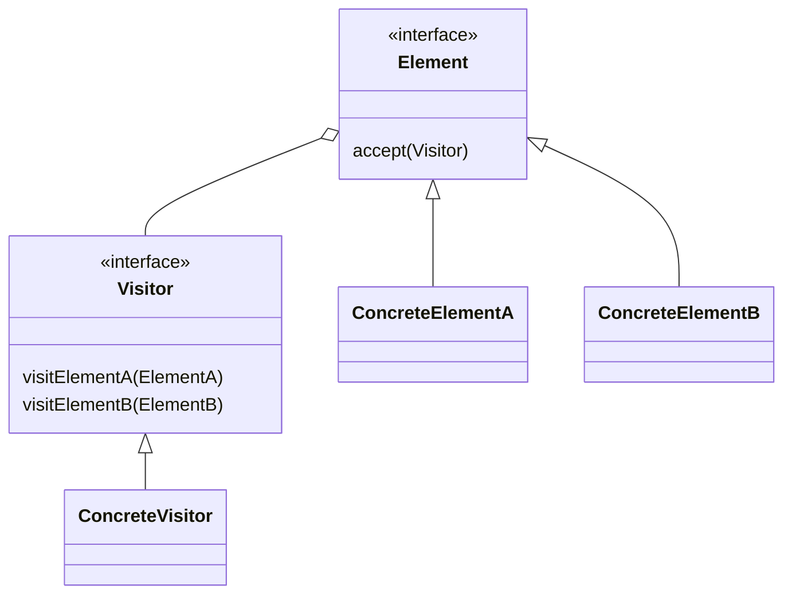

# Посетитель (`Visitor`)

**Visitor** позволяет добавлять новые операции к объектам без изменения их классов. Паттерн позволяет определить операцию для объектов различных классов, не изменяя сами классы.

## Полезные ссылки

### Официальная документация
- [Java Reflection API](https://docs.oracle.com/en/java/javase/17/docs/api/java.base/java/lang/reflect/package-summary.html)
- [Java Annotation Processing](https://docs.oracle.com/javase/8/docs/api/javax/annotation/processing/package-summary.html)

### См. также
- [[java-annotations-reflection|Java Annotations & Reflection]] — аннотации и рефлексия
- [[strategy|Strategy]] — **Strategy Pattern**
- [Алгоритмы и структуры данных](../../algorithms/) — алгоритмы

## Содержание

- [Суть и запомнить](#суть-и-запомнить)
- [Что такое Visitor?](#что-такое-visitor)
  - [Основные характеристики](#основные-характеристики)
  - [Проблемы, которые решает](#проблемы-которые-решает)
- [Когда использовать Visitor?](#когда-использовать-visitor)
  - [Подходящие сценарии](#подходящие-сценарии)
  - [Признаки необходимости](#признаки-необходимости)
- [Структура паттерна](#структура-паттерна)
  - [Компоненты](#компоненты)
- [Реализация на Java](#реализация-на-java)
  - [Классический Visitor](#классический-visitor)
  - [Visitor с Generic Types](#visitor-с-generic-types)
  - [Visitor с Reflection](#visitor-с-reflection)
- [Продвинутые реализации](#продвинутые-реализации)
  - [1. AST Visitor (Abstract Syntax Tree)](#1-ast-visitor-abstract-syntax-tree)
  - [2. Visitor с Spring AOP](#2-visitor-с-spring-aop)
- [Примеры использования](#примеры-использования)
  - [1. File System Visitor](#1-file-system-visitor)
  - [2. Database Schema Visitor](#2-database-schema-visitor)
  - [3. XML/HTML Document Visitor](#3-xmlhtml-document-visitor)
- [Лучшие практики](#лучшие-практики)
  - [1. SOLID Principles](#1-solid-principles)
  - [2. Testing Visitor Pattern](#2-testing-visitor-pattern)
- [Решение проблем](#решение-проблем)
- [Частые вопросы](#частые-вопросы)
- [Заключение](#заключение)

## Суть и запомнить

**Суть в одном предложении:** Новые операции над иерархией элементов добавляются через новые классы Visitor; элемент принимает visitor и вызывает visit(this) — double dispatch.

**Запомнить:**
- Element имеет accept(Visitor); Visitor — методы visit(ConcreteElementA/B).
- Добавление операции = новый Visitor; классы элементов не меняются.
- Минус: добавление нового типа элемента требует менять все visitor’ы.

**Когда применять:** стабильная иерархия элементов, много разных операций (экспорт, сериализация, рендер), AST, компиляторы.

## Что такое **Visitor**?

**Visitor** — это поведенческий паттерн проектирования, который позволяет добавлять новые операции к объектам без изменения их классов. Паттерн позволяет определить операцию для объектов различных классов, не изменяя сами классы.

### Основные характеристики

1. **Double dispatch**: Выбор метода происходит на основе двух типов(visitor + element)
2. **Открыт для расширений**: Новые операции добавляются через новых **visitors**
3. **Закрыт для модификации**: Элементы не изменяются при добавлении операций
4. **Рекурсивная структура**: Хорошо работает с композитными структурами
5. **Разделение ответственностей**: Операции отделены от структуры данных

### Проблемы, которые решает

Пример: добавление новых операций к иерархии фигур без изменения классов элементов(Visitor).

```java
// Плохо: Добавление операций требует изменения классов элементов
public abstract class Shape {
    protected String name;

    public Shape(String name) {
        this.name = name;
    }

    // Каждая новая операция требует изменения всех подклассов
    public abstract void draw();
    public abstract void resize(double factor);
    public abstract void saveToFile(String filename);
    public abstract void exportToXML();
    public abstract void calculateArea();
    // ... еще операции
}

class Circle extends Shape {
    private double radius;

    public Circle(double radius) {
        super("Circle");
        this.radius = radius;
    }

    @Override
    public void draw() {
        System.out.println("Drawing circle with radius " + radius);
    }

    @Override
    public void resize(double factor) {
        radius *= factor;
    }

    @Override
    public void saveToFile(String filename) {
        // Сохранение в файл
    }

    @Override
    public void exportToXML() {
        // Экспорт в XML
    }

    @Override
    public void calculateArea() {
        return Math.PI * radius * radius;
    }
}

// Хорошо: Visitor паттерн
public interface ShapeVisitor {
    void visit(Circle circle);
    void visit(Rectangle rectangle);
    void visit(Triangle triangle);
}

public abstract class Shape {
    protected String name;

    public Shape(String name) {
        this.name = name;
    }

    // Accept метод для приема visitor
    public abstract void accept(ShapeVisitor visitor);
}

class Circle extends Shape {
    private double radius;

    public Circle(double radius) {
        super("Circle");
        this.radius = radius;
    }

    @Override
    public void accept(ShapeVisitor visitor) {
        visitor.visit(this); // Double dispatch
    }

    public double getRadius() { return radius; }
}

// Новые операции добавляются через новых visitors
class DrawVisitor implements ShapeVisitor {
    @Override
    public void visit(Circle circle) {
        System.out.println("Drawing circle with radius " + circle.getRadius());
    }

    @Override
    public void visit(Rectangle rectangle) {
        System.out.println("Drawing rectangle " + rectangle.getWidth() + "x" + rectangle.getHeight());
    }

    @Override
    public void visit(Triangle triangle) {
        System.out.println("Drawing triangle with sides " + triangle.getSideA() + ", " + triangle.getSideB() + ", " + triangle.getSideC());
    }
}
```

## Когда использовать **Visitor**?

### Подходящие сценарии

- **Композитные структуры**: **AST** деревья, **DOM** структуры, файловые системы
- **Разные операции**: Множество операций над стабильной структурой данных
- **Открыт для расширений**: Частое добавление операций, редкое изменение структуры
- **Type checking**: Разные действия для разных типов объектов
- **Кодогенерация**: Компиляторы, трансляторы, сериализаторы

### Признаки необходимости

```java
// Признаки: instanceof проверки и switch statements
public class ShapeProcessor {

    // Плохо: instanceof проверки
    public void processShape(Object shape) {
        if (shape instanceof Circle) {
            Circle circle = (Circle) shape;
            processCircle(circle);
        } else if (shape instanceof Rectangle) {
            Rectangle rectangle = (Rectangle) shape;
            processRectangle(rectangle);
        } else if (shape instanceof Triangle) {
            Triangle triangle = (Triangle) shape;
            processTriangle(triangle);
        }
    }

    // Хорошо: Visitor паттерн
    public void processShape(Shape shape) {
        shape.accept(new ShapeProcessorVisitor());
    }
}

class ShapeProcessorVisitor implements ShapeVisitor {
    @Override
    public void visit(Circle circle) {
        // Обработка круга
    }

    @Override
    public void visit(Rectangle rectangle) {
        // Обработка прямоугольника
    }

    @Override
    public void visit(Triangle triangle) {
        // Обработка треугольника
    }
}
```

## Структура паттерна



```text
┌─────────────────────────────────────────────────────────────┐
│                    Client                                 │
│                                                             │
│  ObjectStructure structure = new ObjectStructure()          │
│  structure.addElement(element1)                             │
│  structure.addElement(element2)                             │
│                                                             │
│  ConcreteVisitor visitor = new ConcreteVisitor()            │
│  structure.accept(visitor)                                  │
│                                                             │
└─────────────────────────────────────────────────────────────┼─┘
                                                              │
┌─────────────────────────────────────────────────────────────┼─┐
│                    ObjectStructure                         │ │
│                                                             │ │
│  ┌─────────────────────────────────────────────────────┐    │ │
│  │              elements: List<Element>                │    │ │
│  │                                                     │    │ │
│  │  ┌─────────────────────────────────────────────────┐ │    │ │
│  │  │           accept(visitor)                      │ │    │ │
│  │  └─────────────────────────────────────────────────┘ │    │ │
│  └─────────────────────────────────────────────────────┘    │ │
│                                                             │ │
│  // Управляет набором элементов и предоставляет            │ │
│  // интерфейс для visitor'а                                │ │
└─────────────────────────────────────────────────────────────┘
                                                              │
┌─────────────────────────────────────────────────────────────┼─┐
│                    Visitor                                 │ │
│                                                             │ │
│  ┌─────────────────────────────────────────────────────┐    │ │
│  │           visitElementA(element)                    │    │ │
│  │           visitElementB(element)                    │    │ │
│  │                                                     │    │ │
│  │  // Определяет интерфейс для операций над            │    │
│  │  // элементами разных типов                          │    │ │
│  └─────────────────────────────────────────────────────┘    │ │
└─────────────────────────────────────────────────────────────┘
                                                              │
┌─────────────────────────────────────────────────────────────┼─┐
│                ConcreteElement                            │ │
│                                                             │ │
│  ┌─────────────────────────────────────────────────────┐    │ │
│  │           accept(visitor)                           │ │    │ │
│  │                                                     │    │ │
│  │  // Реализует accept метод, который вызывает          │    │ │
│  │  // соответствующий visit метод visitor'а           │    │ │
│  └─────────────────────────────────────────────────────┘    │ │
└─────────────────────────────────────────────────────────────┘
                                                              │
┌─────────────────────────────────────────────────────────────┼─┐
│                ConcreteVisitor                             │ │
│                                                             │ │
│  ┌─────────────────────────────────────────────────────┐    │ │
│  │           visitElementA(element)                    │ │    │ │
│  │           visitElementB(element)                    │ │    │ │
│  │                                                     │    │ │
│  │  // Реализует конкретные операции над элементами     │    │ │
│  │  // разных типов                                     │    │ │
│  └─────────────────────────────────────────────────────┘    │ │
└─────────────────────────────────────────────────────────────┘
```

### Компоненты

1. **Visitor**: Интерфейс с **visit** методами для каждого типа элементов
2. **ConcreteVisitor**: Конкретная реализация операций
3. **Element**: Интерфейс элементов с **accept** методом
4. **ConcreteElement**: Конкретные элементы, реализующие **accept**
5. **ObjectStructure**: Структура, содержащая элементы и предоставляющая доступ к ним

## Реализация на Java

### Классический **Visitor**

```java
// Visitor интерфейс
interface ShapeVisitor {
    void visit(Circle circle);
    void visit(Rectangle rectangle);
    void visit(Triangle triangle);
}

// Element интерфейс
interface Shape {
    void accept(ShapeVisitor visitor);
    String getName();
}

// Concrete Elements
class Circle implements Shape {
    private double radius;

    public Circle(double radius) {
        this.radius = radius;
    }

    @Override
    public void accept(ShapeVisitor visitor) {
        visitor.visit(this); // Double dispatch
    }

    @Override
    public String getName() {
        return "Circle";
    }

    public double getRadius() { return radius; }
}

class Rectangle implements Shape {
    private double width;
    private double height;

    public Rectangle(double width, double height) {
        this.width = width;
        this.height = height;
    }

    @Override
    public void accept(ShapeVisitor visitor) {
        visitor.visit(this);
    }

    @Override
    public String getName() {
        return "Rectangle";
    }

    public double getWidth() { return width; }
    public double getHeight() { return height; }
}

class Triangle implements Shape {
    private double sideA;
    private double sideB;
    private double sideC;

    public Triangle(double sideA, double sideB, double sideC) {
        this.sideA = sideA;
        this.sideB = sideB;
        this.sideC = sideC;
    }

    @Override
    public void accept(ShapeVisitor visitor) {
        visitor.visit(this);
    }

    @Override
    public String getName() {
        return "Triangle";
    }

    public double getSideA() { return sideA; }
    public double getSideB() { return sideB; }
    public double getSideC() { return sideC; }
}

// Concrete Visitors
class AreaCalculatorVisitor implements ShapeVisitor {
    private double totalArea = 0;

    @Override
    public void visit(Circle circle) {
        double area = Math.PI * circle.getRadius() * circle.getRadius();
        totalArea += area;
        System.out.println("Circle area: " + String.format("%.2f", area));
    }

    @Override
    public void visit(Rectangle rectangle) {
        double area = rectangle.getWidth() * rectangle.getHeight();
        totalArea += area;
        System.out.println("Rectangle area: " + String.format("%.2f", area));
    }

    @Override
    public void visit(Triangle triangle) {
        // Используем формулу Герона
        double s = (triangle.getSideA() + triangle.getSideB() + triangle.getSideC()) / 2;
        double area = Math.sqrt(s * (s - triangle.getSideA()) *
                               (s - triangle.getSideB()) *
                               (s - triangle.getSideC()));
        totalArea += area;
        System.out.println("Triangle area: " + String.format("%.2f", area));
    }

    public double getTotalArea() {
        return totalArea;
    }
}

class ShapeInfoVisitor implements ShapeVisitor {
    private int shapeCount = 0;
    private StringBuilder info = new StringBuilder();

    @Override
    public void visit(Circle circle) {
        shapeCount++;
        info.append("Circle (radius: ").append(circle.getRadius()).append(")\n");
    }

    @Override
    public void visit(Rectangle rectangle) {
        shapeCount++;
        info.append("Rectangle (").append(rectangle.getWidth())
             .append(" x ").append(rectangle.getHeight()).append(")\n");
    }

    @Override
    public void visit(Triangle triangle) {
        shapeCount++;
        info.append("Triangle (sides: ").append(triangle.getSideA())
             .append(", ").append(triangle.getSideB())
             .append(", ").append(triangle.getSideC()).append(")\n");
    }

    public int getShapeCount() { return shapeCount; }
    public String getInfo() { return info.toString(); }
}

class XMLExportVisitor implements ShapeVisitor {
    private StringBuilder xml = new StringBuilder();

    public XMLExportVisitor() {
        xml.append("<?xml version=\"1.0\" encoding=\"UTF-8\"?>\n");
        xml.append("<shapes>\n");
    }

    @Override
    public void visit(Circle circle) {
        xml.append("  <circle radius=\"").append(circle.getRadius()).append("\"/>\n");
    }

    @Override
    public void visit(Rectangle rectangle) {
        xml.append("  <rectangle width=\"").append(rectangle.getWidth())
           .append("\" height=\"").append(rectangle.getHeight()).append("\"/>\n");
    }

    @Override
    public void visit(Triangle triangle) {
        xml.append("  <triangle a=\"").append(triangle.getSideA())
           .append("\" b=\"").append(triangle.getSideB())
           .append("\" c=\"").append(triangle.getSideC()).append("\"/>\n");
    }

    public String getXML() {
        return xml.toString() + "</shapes>";
    }
}

// Object Structure
class ShapeCollection {
    private List<Shape> shapes = new ArrayList<>();

    public void addShape(Shape shape) {
        shapes.add(shape);
    }

    public void removeShape(Shape shape) {
        shapes.remove(shape);
    }

    public void accept(ShapeVisitor visitor) {
        for (Shape shape : shapes) {
            shape.accept(visitor);
        }
    }

    public List<Shape> getShapes() {
        return new ArrayList<>(shapes);
    }
}

public class VisitorDemo {
    public static void main(String[] args) {
        // Создаем коллекцию фигур
        ShapeCollection collection = new ShapeCollection();
        collection.addShape(new Circle(5.0));
        collection.addShape(new Rectangle(4.0, 6.0));
        collection.addShape(new Triangle(3.0, 4.0, 5.0));
        collection.addShape(new Circle(3.0));
        collection.addShape(new Rectangle(2.0, 8.0));

        // Вычисляем общую площадь
        AreaCalculatorVisitor areaCalculator = new AreaCalculatorVisitor();
        collection.accept(areaCalculator);
        System.out.println("Total area: " + String.format("%.2f", areaCalculator.getTotalArea()));

        System.out.println();

        // Получаем информацию о фигурах
        ShapeInfoVisitor infoVisitor = new ShapeInfoVisitor();
        collection.accept(infoVisitor);
        System.out.println("Shape count: " + infoVisitor.getShapeCount());
        System.out.println("Shape details:\n" + infoVisitor.getInfo());

        // Экспортируем в XML
        XMLExportVisitor xmlVisitor = new XMLExportVisitor();
        collection.accept(xmlVisitor);
        System.out.println("XML Export:\n" + xmlVisitor.getXML());
    }
}
```

### **Visitor** с **Generic Types**

```java
// Generic Visitor
interface GenericVisitor<R, T> {
    R visit(T element);
}

// Generic Element
interface GenericElement<R> {
    R accept(GenericVisitor<R, ? extends GenericElement<R>> visitor);
}

// Реализация с числами
class NumberElement implements GenericElement<Double> {
    private final Number value;

    public NumberElement(Number value) {
        this.value = value;
    }

    @Override
    public Double accept(GenericVisitor<Double, ? extends GenericElement<Double>> visitor) {
        return visitor.visit(this);
    }

    public Number getValue() { return value; }
}

// Visitors для чисел
class SumVisitor implements GenericVisitor<Double, NumberElement> {
    private double sum = 0;

    @Override
    public Double visit(NumberElement element) {
        sum += element.getValue().doubleValue();
        return sum;
    }

    public double getSum() { return sum; }
}

class ProductVisitor implements GenericVisitor<Double, NumberElement> {
    private double product = 1;

    @Override
    public Double visit(NumberElement element) {
        product *= element.getValue().doubleValue();
        return product;
    }

    public double getProduct() { return product; }
}

class StatisticsVisitor implements GenericVisitor<Double, NumberElement> {
    private List<Double> values = new ArrayList<>();

    @Override
    public Double visit(NumberElement element) {
        double val = element.getValue().doubleValue();
        values.add(val);
        return val;
    }

    public double getAverage() {
        return values.stream().mapToDouble(Double::doubleValue).average().orElse(0);
    }

    public double getMax() {
        return values.stream().mapToDouble(Double::doubleValue).max().orElse(0);
    }

    public double getMin() {
        return values.stream().mapToDouble(Double::doubleValue).min().orElse(Double.MAX_VALUE);
    }
}

// Generic Object Structure
class GenericCollection<T extends GenericElement<R>, R> {
    private List<T> elements = new ArrayList<>();

    public void addElement(T element) {
        elements.add(element);
    }

    public List<R> acceptAll(GenericVisitor<R, T> visitor) {
        List<R> results = new ArrayList<>();
        for (T element : elements) {
            results.add(element.accept(visitor));
        }
        return results;
    }
}

public class GenericVisitorDemo {
    public static void main(String[] args) {
        GenericCollection<NumberElement, Double> numbers = new GenericCollection<>();
        numbers.addElement(new NumberElement(1));
        numbers.addElement(new NumberElement(2));
        numbers.addElement(new NumberElement(3));
        numbers.addElement(new NumberElement(4));
        numbers.addElement(new NumberElement(5));

        // Вычисляем сумму
        SumVisitor sumVisitor = new SumVisitor();
        numbers.acceptAll(sumVisitor);
        System.out.println("Sum: " + sumVisitor.getSum());

        // Вычисляем произведение
        ProductVisitor productVisitor = new ProductVisitor();
        numbers.acceptAll(productVisitor);
        System.out.println("Product: " + productVisitor.getProduct());

        // Вычисляем статистику
        StatisticsVisitor statsVisitor = new StatisticsVisitor();
        numbers.acceptAll(statsVisitor);
        System.out.println("Average: " + statsVisitor.getAverage());
        System.out.println("Max: " + statsVisitor.getMax());
        System.out.println("Min: " + statsVisitor.getMin());
    }
}
```

### **Visitor** с **Reflection**

```java
// Visitor с использованием reflection для автоматического определения типов
interface ReflectiveVisitor {
    void visit(Object element);
}

abstract class ReflectiveElement {
    public void accept(ReflectiveVisitor visitor) {
        try {
            // Используем reflection для вызова правильного visit метода
            Method method = visitor.getClass().getMethod("visit",
                this.getClass());
            method.invoke(visitor, this);
        } catch (Exception e) {
            // Fallback - общий метод
            try {
                Method defaultMethod = visitor.getClass().getMethod("visit", Object.class);
                defaultMethod.invoke(visitor, this);
            } catch (Exception ex) {
                throw new RuntimeException("Visitor does not support element type: " + this.getClass(), ex);
            }
        }
    }
}

// Concrete elements
class Person extends ReflectiveElement {
    private String name;
    private int age;

    public Person(String name, int age) {
        this.name = name;
        this.age = age;
    }

    public String getName() { return name; }
    public int getAge() { return age; }
}

class Company extends ReflectiveElement {
    private String name;
    private List<Person> employees;

    public Company(String name, List<Person> employees) {
        this.name = name;
        this.employees = employees;
    }

    public String getName() { return name; }
    public List<Person> getEmployees() { return employees; }
}

// Concrete visitors
class PrintVisitor implements ReflectiveVisitor {
    @Override
    public void visit(Object element) {
        System.out.println("Unknown element: " + element);
    }

    public void visit(Person person) {
        System.out.println("Person: " + person.getName() + ", Age: " + person.getAge());
    }

    public void visit(Company company) {
        System.out.println("Company: " + company.getName());
        System.out.println("Employees:");
        for (Person employee : company.getEmployees()) {
            System.out.println("  - " + employee.getName());
        }
    }
}

class CountVisitor implements ReflectiveVisitor {
    private int personCount = 0;
    private int companyCount = 0;

    @Override
    public void visit(Object element) {
        // Неизвестный тип
    }

    public void visit(Person person) {
        personCount++;
    }

    public void visit(Company company) {
        companyCount++;
        // Рекурсивно посещаем сотрудников
        for (Person employee : company.getEmployees()) {
            employee.accept(this);
        }
    }

    public int getPersonCount() { return personCount; }
    public int getCompanyCount() { return companyCount; }
}

class JSONVisitor implements ReflectiveVisitor {
    private StringBuilder json = new StringBuilder();
    private int indentLevel = 0;

    public JSONVisitor() {
        json.append("{\n");
        indentLevel++;
    }

    @Override
    public void visit(Object element) {
        appendIndent();
        json.append("\"unknown\": \"").append(element.toString()).append("\"\n");
    }

    public void visit(Person person) {
        appendIndent();
        json.append("\"person\": {\n");
        indentLevel++;
        appendIndent();
        json.append("\"name\": \"").append(person.getName()).append("\",\n");
        appendIndent();
        json.append("\"age\": ").append(person.getAge()).append("\n");
        indentLevel--;
        appendIndent();
        json.append("}");
    }

    public void visit(Company company) {
        appendIndent();
        json.append("\"company\": {\n");
        indentLevel++;
        appendIndent();
        json.append("\"name\": \"").append(company.getName()).append("\",\n");
        appendIndent();
        json.append("\"employees\": [\n");
        indentLevel++;

        for (int i = 0; i < company.getEmployees().size(); i++) {
            if (i > 0) json.append(",");
            json.append("\n");
            company.getEmployees().get(i).accept(this);
        }

        json.append("\n");
        indentLevel--;
        appendIndent();
        json.append("]\n");
        indentLevel--;
        appendIndent();
        json.append("}");
    }

    public String getJSON() {
        json.append("\n}");
        return json.toString();
    }

    private void appendIndent() {
        for (int i = 0; i < indentLevel; i++) {
            json.append("  ");
        }
    }
}

public class ReflectiveVisitorDemo {
    public static void main(String[] args) {
        // Создаем структуру данных
        Person john = new Person("John Doe", 30);
        Person jane = new Person("Jane Smith", 25);
        Company company = new Company("Tech Corp", Arrays.asList(john, jane));

        List<ReflectiveElement> elements = Arrays.asList(john, jane, company);

        // Print visitor
        PrintVisitor printVisitor = new PrintVisitor();
        System.out.println("=== Print Visitor ===");
        for (ReflectiveElement element : elements) {
            element.accept(printVisitor);
        }

        // Count visitor
        CountVisitor countVisitor = new CountVisitor();
        System.out.println("\n=== Count Visitor ===");
        for (ReflectiveElement element : elements) {
            element.accept(countVisitor);
        }
        System.out.println("Total persons: " + countVisitor.getPersonCount());
        System.out.println("Total companies: " + countVisitor.getCompanyCount());

        // JSON visitor
        JSONVisitor jsonVisitor = new JSONVisitor();
        System.out.println("\n=== JSON Visitor ===");
        for (ReflectiveElement element : elements) {
            element.accept(jsonVisitor);
        }
        System.out.println(jsonVisitor.getJSON());
    }
}
```

## Продвинутые реализации

### 1. AST Visitor (Abstract Syntax Tree)

```java
// Visitor для AST (Abstract Syntax Tree) - используется в компиляторах
interface ASTVisitor<R> {
    R visit(BinaryExpression expr);
    R visit(LiteralExpression expr);
    R visit(VariableExpression expr);
    R visit(FunctionCallExpression expr);
}

// AST Nodes
abstract class Expression {
    public abstract <R> R accept(ASTVisitor<R> visitor);
}

class BinaryExpression extends Expression {
    private Expression left;
    private Expression right;
    private String operator;

    public BinaryExpression(Expression left, String operator, Expression right) {
        this.left = left;
        this.operator = operator;
        this.right = right;
    }

    @Override
    public <R> R accept(ASTVisitor<R> visitor) {
        return visitor.visit(this);
    }

    public Expression getLeft() { return left; }
    public Expression getRight() { return right; }
    public String getOperator() { return operator; }
}

class LiteralExpression extends Expression {
    private Object value;

    public LiteralExpression(Object value) {
        this.value = value;
    }

    @Override
    public <R> R accept(ASTVisitor<R> visitor) {
        return visitor.visit(this);
    }

    public Object getValue() { return value; }
}

class VariableExpression extends Expression {
    private String name;

    public VariableExpression(String name) {
        this.name = name;
    }

    @Override
    public <R> R accept(ASTVisitor<R> visitor) {
        return visitor.visit(this);
    }

    public String getName() { return name; }
}

class FunctionCallExpression extends Expression {
    private String functionName;
    private List<Expression> arguments;

    public FunctionCallExpression(String functionName, List<Expression> arguments) {
        this.functionName = functionName;
        this.arguments = arguments;
    }

    @Override
    public <R> R accept(ASTVisitor<R> visitor) {
        return visitor.visit(this);
    }

    public String getFunctionName() { return functionName; }
    public List<Expression> getArguments() { return arguments; }
}

// Interpreter Visitor
class InterpreterVisitor implements ASTVisitor<Object> {
    private Map<String, Object> variables = new HashMap<>();

    public void setVariable(String name, Object value) {
        variables.put(name, value);
    }

    @Override
    public Object visit(BinaryExpression expr) {
        Object left = expr.getLeft().accept(this);
        Object right = expr.getRight().accept(this);
        String op = expr.getOperator();

        switch (op) {
            case "+": return toDouble(left) + toDouble(right);
            case "-": return toDouble(left) - toDouble(right);
            case "*": return toDouble(left) * toDouble(right);
            case "/": return toDouble(left) / toDouble(right);
            case "==": return Objects.equals(left, right);
            case "!=": return !Objects.equals(left, right);
            default: throw new IllegalArgumentException("Unknown operator: " + op);
        }
    }

    @Override
    public Object visit(LiteralExpression expr) {
        return expr.getValue();
    }

    @Override
    public Object visit(VariableExpression expr) {
        if (!variables.containsKey(expr.getName())) {
            throw new IllegalArgumentException("Undefined variable: " + expr.getName());
        }
        return variables.get(expr.getName());
    }

    @Override
    public Object visit(FunctionCallExpression expr) {
        List<Object> args = expr.getArguments().stream()
            .map(arg -> arg.accept(this))
            .collect(Collectors.toList());

        switch (expr.getFunctionName()) {
            case "max":
                return args.stream().mapToDouble(this::toDouble).max().orElse(0);
            case "min":
                return args.stream().mapToDouble(this::toDouble).min().orElse(0);
            case "sum":
                return args.stream().mapToDouble(this::toDouble).sum();
            default:
                throw new IllegalArgumentException("Unknown function: " + expr.getFunctionName());
        }
    }

    private double toDouble(Object obj) {
        if (obj instanceof Number) {
            return ((Number) obj).doubleValue();
        }
        throw new IllegalArgumentException("Cannot convert to double: " + obj);
    }
}

// Code Generator Visitor
class CodeGeneratorVisitor implements ASTVisitor<String> {
    private StringBuilder code = new StringBuilder();

    @Override
    public String visit(BinaryExpression expr) {
        String left = expr.getLeft().accept(this);
        String right = expr.getRight().accept(this);
        return "(" + left + " " + expr.getOperator() + " " + right + ")";
    }

    @Override
    public String visit(LiteralExpression expr) {
        if (expr.getValue() instanceof String) {
            return "\"" + expr.getValue() + "\"";
        }
        return expr.getValue().toString();
    }

    @Override
    public String visit(VariableExpression expr) {
        return expr.getName();
    }

    @Override
    public String visit(FunctionCallExpression expr) {
        StringBuilder sb = new StringBuilder();
        sb.append(expr.getFunctionName()).append("(");

        List<String> argStrings = expr.getArguments().stream()
            .map(arg -> arg.accept(this))
            .collect(Collectors.toList());

        sb.append(String.join(", ", argStrings));
        sb.append(")");
        return sb.toString();
    }
}

// Type Checker Visitor
class TypeCheckerVisitor implements ASTVisitor<String> {
    private Map<String, String> variableTypes = new HashMap<>();

    public void declareVariable(String name, String type) {
        variableTypes.put(name, type);
    }

    @Override
    public String visit(BinaryExpression expr) {
        String leftType = expr.getLeft().accept(this);
        String rightType = expr.getRight().accept(this);

        switch (expr.getOperator()) {
            case "+":
            case "-":
            case "*":
            case "/":
                if ("number".equals(leftType) && "number".equals(rightType)) {
                    return "number";
                }
                throw new RuntimeException("Type error: arithmetic operation on non-numbers");
            case "==":
            case "!=":
                return "boolean";
            default:
                throw new RuntimeException("Unknown operator: " + expr.getOperator());
        }
    }

    @Override
    public String visit(LiteralExpression expr) {
        Object value = expr.getValue();
        if (value instanceof Number) {
            return "number";
        } else if (value instanceof String) {
            return "string";
        } else if (value instanceof Boolean) {
            return "boolean";
        }
        return "unknown";
    }

    @Override
    public String visit(VariableExpression expr) {
        String type = variableTypes.get(expr.getName());
        if (type == null) {
            throw new RuntimeException("Undefined variable: " + expr.getName());
        }
        return type;
    }

    @Override
    public String visit(FunctionCallExpression expr) {
        // Проверка типов аргументов
        for (Expression arg : expr.getArguments()) {
            arg.accept(this); // Проверяем типы аргументов
        }

        // Определяем тип возвращаемого значения
        switch (expr.getFunctionName()) {
            case "max":
            case "min":
            case "sum":
                return "number";
            default:
                throw new RuntimeException("Unknown function: " + expr.getFunctionName());
        }
    }
}

public class ASTVisitorDemo {
    public static void main(String[] args) {
        // Создаем AST: (x + 5) * max(10, y)
        Expression x = new VariableExpression("x");
        Expression five = new LiteralExpression(5);
        Expression addition = new BinaryExpression(x, "+", five);

        Expression ten = new LiteralExpression(10);
        Expression y = new VariableExpression("y");
        Expression maxCall = new FunctionCallExpression("max", Arrays.asList(ten, y));

        Expression multiplication = new BinaryExpression(addition, "*", maxCall);

        // Interpreter
        InterpreterVisitor interpreter = new InterpreterVisitor();
        interpreter.setVariable("x", 3);
        interpreter.setVariable("y", 7);

        System.out.println("=== Interpretation ===");
        try {
            Object result = multiplication.accept(interpreter);
            System.out.println("Result: " + result);
        } catch (Exception e) {
            System.err.println("Interpretation error: " + e.getMessage());
        }

        // Code Generation
        CodeGeneratorVisitor codeGen = new CodeGeneratorVisitor();
        System.out.println("\n=== Code Generation ===");
        String code = multiplication.accept(codeGen);
        System.out.println("Generated code: " + code);

        // Type Checking
        TypeCheckerVisitor typeChecker = new TypeCheckerVisitor();
        typeChecker.declareVariable("x", "number");
        typeChecker.declareVariable("y", "number");

        System.out.println("\n=== Type Checking ===");
        try {
            String resultType = multiplication.accept(typeChecker);
            System.out.println("Result type: " + resultType);
        } catch (Exception e) {
            System.err.println("Type checking error: " + e.getMessage());
        }
    }
}
```

### 2. Visitor с Spring AOP

Visitor можно комбинировать с Spring AOP: аспект по срезу вызовов `visit(..)` добавляет логирование, метрики или транзакции без изменения самих visitor’ов. Реализация — стандартный `@Aspect` с `@Around` на execution соответствующих методов.

## Примеры использования

### 1. **File System Visitor**

```java
// Visitor для работы с файловой системой
interface FileSystemVisitor {
    void visit(File file);
    void visit(Directory directory);
}

interface FileSystemElement {
    void accept(FileSystemVisitor visitor);
    String getName();
    String getPath();
}

class File implements FileSystemElement {
    private final java.io.File file;

    public File(java.io.File file) {
        this.file = file;
    }

    @Override
    public void accept(FileSystemVisitor visitor) {
        visitor.visit(this);
    }

    @Override
    public String getName() { return file.getName(); }

    @Override
    public String getPath() { return file.getPath(); }

    public long getSize() { return file.length(); }
    public String getExtension() {
        String name = file.getName();
        int lastDot = name.lastIndexOf('.');
        return lastDot > 0 ? name.substring(lastDot + 1) : "";
    }
}

class Directory implements FileSystemElement {
    private final java.io.File directory;
    private List<FileSystemElement> children = new ArrayList<>();

    public Directory(java.io.File directory) {
        this.directory = directory;
        loadChildren();
    }

    private void loadChildren() {
        java.io.File[] files = directory.listFiles();
        if (files != null) {
            for (java.io.File file : files) {
                if (file.isDirectory()) {
                    children.add(new Directory(file));
                } else {
                    children.add(new File(file));
                }
            }
        }
    }

    @Override
    public void accept(FileSystemVisitor visitor) {
        visitor.visit(this);
        // Рекурсивно посещаем детей
        for (FileSystemElement child : children) {
            child.accept(visitor);
        }
    }

    @Override
    public String getName() { return directory.getName(); }

    @Override
    public String getPath() { return directory.getPath(); }

    public List<FileSystemElement> getChildren() { return new ArrayList<>(children); }
}

// Concrete Visitors
class SizeCalculatorVisitor implements FileSystemVisitor {
    private long totalSize = 0;
    private int fileCount = 0;
    private int directoryCount = 0;

    @Override
    public void visit(File file) {
        totalSize += file.getSize();
        fileCount++;
    }

    @Override
    public void visit(Directory directory) {
        directoryCount++;
    }

    public long getTotalSize() { return totalSize; }
    public int getFileCount() { return fileCount; }
    public int getDirectoryCount() { return directoryCount; }
}

class FileTypeCounterVisitor implements FileSystemVisitor {
    private Map<String, Integer> typeCounts = new HashMap<>();

    @Override
    public void visit(File file) {
        String extension = file.getExtension().toLowerCase();
        typeCounts.merge(extension, 1, Integer::sum);
    }

    @Override
    public void visit(Directory directory) {
        // Не считаем директории
    }

    public Map<String, Integer> getTypeCounts() { return new HashMap<>(typeCounts); }
}

class SearchVisitor implements FileSystemVisitor {
    private final String searchPattern;
    private List<FileSystemElement> foundElements = new ArrayList<>();

    public SearchVisitor(String searchPattern) {
        this.searchPattern = searchPattern.toLowerCase();
    }

    @Override
    public void visit(File file) {
        if (file.getName().toLowerCase().contains(searchPattern)) {
            foundElements.add(file);
        }
    }

    @Override
    public void visit(Directory directory) {
        if (directory.getName().toLowerCase().contains(searchPattern)) {
            foundElements.add(directory);
        }
    }

    public List<FileSystemElement> getFoundElements() { return new ArrayList<>(foundElements); }
}

class TreePrinterVisitor implements FileSystemVisitor {
    private int depth = 0;
    private StringBuilder tree = new StringBuilder();

    @Override
    public void visit(File file) {
        appendIndent();
        tree.append("📄 ").append(file.getName())
            .append(" (").append(file.getSize()).append(" bytes)\n");
    }

    @Override
    public void visit(Directory directory) {
        appendIndent();
        tree.append("📁 ").append(directory.getName()).append("/\n");
        depth++;
    }

    private void appendIndent() {
        for (int i = 0; i < depth; i++) {
            tree.append("  ");
        }
    }

    public String getTree() { return tree.toString(); }

    public void reset() {
        tree.setLength(0);
        depth = 0;
    }
}

public class FileSystemVisitorDemo {
    public static void main(String[] args) {
        // Создаем структуру директорий (имитация)
        Directory root = new Directory(new java.io.File("/tmp/demo"));
        // В реальном приложении директория должна существовать

        // Анализ размера
        SizeCalculatorVisitor sizeVisitor = new SizeCalculatorVisitor();
        root.accept(sizeVisitor);
        System.out.println("Total size: " + sizeVisitor.getTotalSize() + " bytes");
        System.out.println("Files: " + sizeVisitor.getFileCount());
        System.out.println("Directories: " + sizeVisitor.getDirectoryCount());

        // Подсчет типов файлов
        FileTypeCounterVisitor typeVisitor = new FileTypeCounterVisitor();
        root.accept(typeVisitor);
        System.out.println("File types: " + typeVisitor.getTypeCounts());

        // Поиск файлов
        SearchVisitor searchVisitor = new SearchVisitor("doc");
        root.accept(searchVisitor);
        System.out.println("Found elements containing 'doc': " +
            searchVisitor.getFoundElements().size());

        // Печать дерева
        TreePrinterVisitor treeVisitor = new TreePrinterVisitor();
        root.accept(treeVisitor);
        System.out.println("Directory tree:\n" + treeVisitor.getTree());
    }
}
```

### 2. **Database Schema Visitor**

```java
// Visitor для работы со схемой базы данных
interface DatabaseSchemaVisitor<R> {
    R visit(Table table);
    R visit(Column column);
    R visit(ForeignKey foreignKey);
    R visit(Index index);
}

interface SchemaElement {
    <R> R accept(DatabaseSchemaVisitor<R> visitor);
}

class Table implements SchemaElement {
    private String name;
    private List<Column> columns = new ArrayList<>();
    private List<ForeignKey> foreignKeys = new ArrayList<>();
    private List<Index> indexes = new ArrayList<>();

    public Table(String name) {
        this.name = name;
    }

    @Override
    public <R> R accept(DatabaseSchemaVisitor<R> visitor) {
        return visitor.visit(this);
    }

    // Геттеры и сеттеры
    public String getName() { return name; }
    public List<Column> getColumns() { return columns; }
    public List<ForeignKey> getForeignKeys() { return foreignKeys; }
    public List<Index> getIndexes() { return indexes; }

    public void addColumn(Column column) { columns.add(column); }
    public void addForeignKey(ForeignKey fk) { foreignKeys.add(fk); }
    public void addIndex(Index index) { indexes.add(index); }
}

class Column implements SchemaElement {
    private String name;
    private String type;
    private boolean nullable;
    private boolean primaryKey;

    public Column(String name, String type, boolean nullable, boolean primaryKey) {
        this.name = name;
        this.type = type;
        this.nullable = nullable;
        this.primaryKey = primaryKey;
    }

    @Override
    public <R> R accept(DatabaseSchemaVisitor<R> visitor) {
        return visitor.visit(this);
    }

    // Геттеры
    public String getName() { return name; }
    public String getType() { return type; }
    public boolean isNullable() { return nullable; }
    public boolean isPrimaryKey() { return primaryKey; }
}

class ForeignKey implements SchemaElement {
    private String name;
    private List<String> sourceColumns;
    private String targetTable;
    private List<String> targetColumns;

    public ForeignKey(String name, List<String> sourceColumns,
                     String targetTable, List<String> targetColumns) {
        this.name = name;
        this.sourceColumns = sourceColumns;
        this.targetTable = targetTable;
        this.targetColumns = targetColumns;
    }

    @Override
    public <R> R accept(DatabaseSchemaVisitor<R> visitor) {
        return visitor.visit(this);
    }

    // Геттеры
    public String getName() { return name; }
    public List<String> getSourceColumns() { return sourceColumns; }
    public String getTargetTable() { return targetTable; }
    public List<String> getTargetColumns() { return targetColumns; }
}

class Index implements SchemaElement {
    private String name;
    private List<String> columns;
    private boolean unique;

    public Index(String name, List<String> columns, boolean unique) {
        this.name = name;
        this.columns = columns;
        this.unique = unique;
    }

    @Override
    public <R> R accept(DatabaseSchemaVisitor<R> visitor) {
        return visitor.visit(this);
    }

    // Геттеры
    public String getName() { return name; }
    public List<String> getColumns() { return columns; }
    public boolean isUnique() { return unique; }
}

// Schema Visitors
class SQLGeneratorVisitor implements DatabaseSchemaVisitor<String> {

    private StringBuilder sql = new StringBuilder();

    @Override
    public String visit(Table table) {
        sql.append("CREATE TABLE ").append(table.getName()).append(" (\n");

        // Столбцы
        for (int i = 0; i < table.getColumns().size(); i++) {
            if (i > 0) sql.append(",\n");
            sql.append("  ");
            table.getColumns().get(i).accept(this);
        }

        // Первичные ключи
        List<String> pkColumns = table.getColumns().stream()
            .filter(Column::isPrimaryKey)
            .map(Column::getName)
            .collect(Collectors.toList());

        if (!pkColumns.isEmpty()) {
            sql.append(",\n  PRIMARY KEY (")
               .append(String.join(", ", pkColumns))
               .append(")");
        }

        // Внешние ключи
        for (ForeignKey fk : table.getForeignKeys()) {
            sql.append(",\n  ");
            fk.accept(this);
        }

        sql.append("\n);\n\n");

        // Индексы
        for (Index index : table.getIndexes()) {
            index.accept(this);
        }

        return sql.toString();
    }

    @Override
    public String visit(Column column) {
        sql.append(column.getName()).append(" ").append(column.getType());
        if (!column.isNullable()) {
            sql.append(" NOT NULL");
        }
        return "";
    }

    @Override
    public String visit(ForeignKey foreignKey) {
        sql.append("FOREIGN KEY (")
           .append(String.join(", ", foreignKey.getSourceColumns()))
           .append(") REFERENCES ")
           .append(foreignKey.getTargetTable())
           .append(" (")
           .append(String.join(", ", foreignKey.getTargetColumns()))
           .append(")");
        return "";
    }

    @Override
    public String visit(Index index) {
        sql.append("CREATE ");
        if (index.isUnique()) {
            sql.append("UNIQUE ");
        }
        sql.append("INDEX ").append(index.getName())
           .append(" ON table_name (") // В реальности нужно имя таблицы
           .append(String.join(", ", index.getColumns()))
           .append(");\n");
        return "";
    }

    public String getSQL() {
        return sql.toString();
    }
}

class SchemaValidatorVisitor implements DatabaseSchemaVisitor<Boolean> {

    private List<String> errors = new ArrayList<>();
    private Set<String> tableNames = new HashSet<>();

    @Override
    public Boolean visit(Table table) {
        boolean valid = true;

        // Проверка имени таблицы
        if (table.getName() == null || table.getName().trim().isEmpty()) {
            errors.add("Table name cannot be empty");
            valid = false;
        }

        // Проверка уникальности имени таблицы
        if (!tableNames.add(table.getName())) {
            errors.add("Duplicate table name: " + table.getName());
            valid = false;
        }

        // Проверка столбцов
        for (Column column : table.getColumns()) {
            if (!column.accept(this)) {
                valid = false;
            }
        }

        // Проверка внешних ключей
        for (ForeignKey fk : table.getForeignKeys()) {
            if (!fk.accept(this)) {
                valid = false;
            }
        }

        return valid;
    }

    @Override
    public Boolean visit(Column column) {
        boolean valid = true;

        if (column.getName() == null || column.getName().trim().isEmpty()) {
            errors.add("Column name cannot be empty");
            valid = false;
        }

        if (column.getType() == null || column.getType().trim().isEmpty()) {
            errors.add("Column type cannot be empty for column: " + column.getName());
            valid = false;
        }

        return valid;
    }

    @Override
    public Boolean visit(ForeignKey foreignKey) {
        boolean valid = true;

        if (foreignKey.getSourceColumns().isEmpty()) {
            errors.add("Foreign key must have source columns: " + foreignKey.getName());
            valid = false;
        }

        if (foreignKey.getTargetTable() == null || foreignKey.getTargetTable().trim().isEmpty()) {
            errors.add("Foreign key must have target table: " + foreignKey.getName());
            valid = false;
        }

        return valid;
    }

    @Override
    public Boolean visit(Index index) {
        boolean valid = true;

        if (index.getColumns().isEmpty()) {
            errors.add("Index must have at least one column: " + index.getName());
            valid = false;
        }

        return valid;
    }

    public List<String> getErrors() { return new ArrayList<>(errors); }
    public boolean isValid() { return errors.isEmpty(); }
}

class SchemaAnalyzerVisitor implements DatabaseSchemaVisitor<Void> {

    private int tableCount = 0;
    private int columnCount = 0;
    private int foreignKeyCount = 0;
    private int indexCount = 0;

    @Override
    public Void visit(Table table) {
        tableCount++;
        for (Column column : table.getColumns()) {
            column.accept(this);
        }
        for (ForeignKey fk : table.getForeignKeys()) {
            fk.accept(this);
        }
        for (Index index : table.getIndexes()) {
            index.accept(this);
        }
        return null;
    }

    @Override
    public Void visit(Column column) {
        columnCount++;
        return null;
    }

    @Override
    public Void visit(ForeignKey foreignKey) {
        foreignKeyCount++;
        return null;
    }

    @Override
    public Void visit(Index index) {
        indexCount++;
        return null;
    }

    public int getTableCount() { return tableCount; }
    public int getColumnCount() { return columnCount; }
    public int getForeignKeyCount() { return foreignKeyCount; }
    public int getIndexCount() { return indexCount; }
}

public class DatabaseSchemaVisitorDemo {
    public static void main(String[] args) {
        // Создаем схему БД
        Table usersTable = new Table("users");
        usersTable.addColumn(new Column("id", "BIGINT", false, true));
        usersTable.addColumn(new Column("username", "VARCHAR(50)", false, false));
        usersTable.addColumn(new Column("email", "VARCHAR(100)", false, false));

        Table ordersTable = new Table("orders");
        ordersTable.addColumn(new Column("id", "BIGINT", false, true));
        ordersTable.addColumn(new Column("user_id", "BIGINT", false, false));
        ordersTable.addColumn(new Column("total", "DECIMAL(10,2)", false, false));

        // Внешний ключ
        ForeignKey fk = new ForeignKey("fk_orders_users",
            Arrays.asList("user_id"), "users", Arrays.asList("id"));
        ordersTable.addForeignKey(fk);

        // Индекс
        Index index = new Index("idx_orders_user_id", Arrays.asList("user_id"), false);
        ordersTable.addIndex(index);

        List<Table> schema = Arrays.asList(usersTable, ordersTable);

        // Генерация SQL
        SQLGeneratorVisitor sqlGenerator = new SQLGeneratorVisitor();
        for (Table table : schema) {
            table.accept(sqlGenerator);
        }
        System.out.println("=== Generated SQL ===");
        System.out.println(sqlGenerator.getSQL());

        // Валидация схемы
        SchemaValidatorVisitor validator = new SchemaValidatorVisitor();
        boolean valid = true;
        for (Table table : schema) {
            if (!table.accept(validator)) {
                valid = false;
            }
        }
        System.out.println("=== Validation Result ===");
        if (valid) {
            System.out.println("Schema is valid");
        } else {
            System.out.println("Schema validation errors:");
            validator.getErrors().forEach(System.out::println);
        }

        // Анализ схемы
        SchemaAnalyzerVisitor analyzer = new SchemaAnalyzerVisitor();
        for (Table table : schema) {
            table.accept(analyzer);
        }
        System.out.println("=== Schema Analysis ===");
        System.out.println("Tables: " + analyzer.getTableCount());
        System.out.println("Columns: " + analyzer.getColumnCount());
        System.out.println("Foreign Keys: " + analyzer.getForeignKeyCount());
        System.out.println("Indexes: " + analyzer.getIndexCount());
    }
}
```

### 3. **XML**/**HTML Document Visitor**

```java
// Visitor для XML/HTML документов
interface DocumentVisitor {
    void visit(Element element);
    void visit(Text text);
    void visit(Comment comment);
}

interface DocumentNode {
    void accept(DocumentVisitor visitor);
}

class Element implements DocumentNode {
    private String tagName;
    private Map<String, String> attributes = new HashMap<>();
    private List<DocumentNode> children = new ArrayList<>();

    public Element(String tagName) {
        this.tagName = tagName;
    }

    @Override
    public void accept(DocumentVisitor visitor) {
        visitor.visit(this);
        for (DocumentNode child : children) {
            child.accept(visitor);
        }
    }

    // Геттеры и методы для работы с атрибутами и детьми
    public String getTagName() { return tagName; }
    public Map<String, String> getAttributes() { return new HashMap<>(attributes); }
    public List<DocumentNode> getChildren() { return new ArrayList<>(children); }

    public void setAttribute(String name, String value) {
        attributes.put(name, value);
    }

    public void addChild(DocumentNode child) {
        children.add(child);
    }
}

class Text implements DocumentNode {
    private String content;

    public Text(String content) {
        this.content = content;
    }

    @Override
    public void accept(DocumentVisitor visitor) {
        visitor.visit(this);
    }

    public String getContent() { return content; }
}

class Comment implements DocumentNode {
    private String content;

    public Comment(String content) {
        this.content = content;
    }

    @Override
    public void accept(DocumentVisitor visitor) {
        visitor.visit(this);
    }

    public String getContent() { return content; }
}

// Concrete Visitors
class HTMLRendererVisitor implements DocumentVisitor {
    private StringBuilder html = new StringBuilder();
    private int indentLevel = 0;

    @Override
    public void visit(Element element) {
        appendIndent();
        html.append("<").append(element.getTagName());

        // Атрибуты
        for (Map.Entry<String, String> attr : element.getAttributes().entrySet()) {
            html.append(" ").append(attr.getKey()).append("=\"").append(attr.getValue()).append("\"");
        }

        if (element.getChildren().isEmpty()) {
            html.append("/>\n");
        } else {
            html.append(">\n");
            indentLevel++;
            // Дети уже посетятся через accept
            indentLevel--;
            appendIndent();
            html.append("</").append(element.getTagName()).append(">\n");
        }
    }

    @Override
    public void visit(Text text) {
        appendIndent();
        html.append(text.getContent()).append("\n");
    }

    @Override
    public void visit(Comment comment) {
        appendIndent();
        html.append("<!--").append(comment.getContent()).append("-->\n");
    }

    private void appendIndent() {
        for (int i = 0; i < indentLevel; i++) {
            html.append("  ");
        }
    }

    public String getHTML() {
        return html.toString();
    }
}

class ElementCounterVisitor implements DocumentVisitor {
    private Map<String, Integer> elementCounts = new HashMap<>();
    private int textNodes = 0;
    private int comments = 0;

    @Override
    public void visit(Element element) {
        elementCounts.merge(element.getTagName(), 1, Integer::sum);
    }

    @Override
    public void visit(Text text) {
        textNodes++;
    }

    @Override
    public void visit(Comment comment) {
        comments++;
    }

    public Map<String, Integer> getElementCounts() { return new HashMap<>(elementCounts); }
    public int getTextNodes() { return textNodes; }
    public int getComments() { return comments; }
}

class CSSSelectorVisitor implements DocumentVisitor {
    private final String selector;
    private List<Element> matchingElements = new ArrayList<>();
    private Deque<Element> elementStack = new LinkedList<>();

    public CSSSelectorVisitor(String selector) {
        this.selector = selector;
    }

    @Override
    public void visit(Element element) {
        elementStack.push(element);

        // Простая проверка селектора (только по имени тега)
        if (element.getTagName().equals(selector)) {
            matchingElements.add(element);
        }

        // Проверка вложенных селекторов будет сложнее
        // Здесь упрощенная реализация

        elementStack.pop();
    }

    @Override
    public void visit(Text text) {
        // Текстовые узлы не проверяем
    }

    @Override
    public void visit(Comment comment) {
        // Комментарии не проверяем
    }

    public List<Element> getMatchingElements() {
        return new ArrayList<>(matchingElements);
    }
}

class DocumentValidatorVisitor implements DocumentVisitor {
    private List<String> errors = new ArrayList<>();
    private Deque<Element> elementStack = new LinkedList<>();
    private Set<String> voidElements = Set.of("img", "br", "hr", "input", "meta", "link");

    @Override
    public void visit(Element element) {
        // Проверка незакрытых тегов (упрощенная)
        elementStack.push(element);

        // Проверка обязательных атрибутов
        if ("img".equals(element.getTagName()) && !element.getAttributes().containsKey("src")) {
            errors.add("IMG element missing required 'src' attribute");
        }

        if ("a".equals(element.getTagName()) && !element.getAttributes().containsKey("href")) {
            errors.add("A element missing required 'href' attribute");
        }
    }

    @Override
    public void visit(Text text) {
        // Проверка что текстовый контент не пустой в некоторых случаях
        if (!elementStack.isEmpty()) {
            Element parent = elementStack.peek();
            if ("title".equals(parent.getTagName()) && text.getContent().trim().isEmpty()) {
                errors.add("TITLE element should not be empty");
            }
        }
    }

    @Override
    public void visit(Comment comment) {
        // Комментарии обычно не валидируются
    }

    public List<String> getErrors() { return new ArrayList<>(errors); }
    public boolean isValid() { return errors.isEmpty(); }
}

public class DocumentVisitorDemo {
    public static void main(String[] args) {
        // Создаем HTML документ
        Element html = new Element("html");
        Element head = new Element("head");
        Element title = new Element("title");
        title.addChild(new Text("Sample Page"));
        head.addChild(title);
        html.addChild(head);

        Element body = new Element("body");
        Element h1 = new Element("h1");
        h1.addChild(new Text("Welcome"));
        body.addChild(h1);

        Element p = new Element("p");
        p.addChild(new Text("This is a sample page."));
        body.addChild(p);

        Element img = new Element("img");
        img.setAttribute("src", "image.jpg");
        img.setAttribute("alt", "Sample image");
        body.addChild(img);

        body.addChild(new Comment("This is a comment"));
        html.addChild(body);

        // HTML рендеринг
        HTMLRendererVisitor renderer = new HTMLRendererVisitor();
        html.accept(renderer);
        System.out.println("=== Generated HTML ===");
        System.out.println(renderer.getHTML());

        // Подсчет элементов
        ElementCounterVisitor counter = new ElementCounterVisitor();
        html.accept(counter);
        System.out.println("=== Element Counts ===");
        System.out.println("Elements: " + counter.getElementCounts());
        System.out.println("Text nodes: " + counter.getTextNodes());
        System.out.println("Comments: " + counter.getComments());

        // Поиск элементов
        CSSSelectorVisitor selector = new CSSSelectorVisitor("p");
        html.accept(selector);
        System.out.println("=== Found P elements ===");
        System.out.println("Found " + selector.getMatchingElements().size() + " P elements");

        // Валидация
        DocumentValidatorVisitor validator = new DocumentValidatorVisitor();
        html.accept(validator);
        System.out.println("=== Validation Result ===");
        if (validator.isValid()) {
            System.out.println("Document is valid");
        } else {
            System.out.println("Validation errors:");
            validator.getErrors().forEach(System.out::println);
        }
    }
}
```

## Лучшие практики

### 1. **SOLID Principles**

```java
// Правильное применение SOLID принципов
interface Visitor {
    void visit(ConcreteElementA element);
    void visit(ConcreteElementB element);
}

// Single Responsibility: Каждый visitor отвечает за свою операцию
class PrintVisitor implements Visitor {
    @Override
    public void visit(ConcreteElementA element) {
        System.out.println("Printing A: " + element.getData());
    }

    @Override
    public void visit(ConcreteElementB element) {
        System.out.println("Printing B: " + element.getData());
    }
}

// Open/Closed: Новые операции добавляются через новых visitors
class SerializeVisitor implements Visitor {
    private StringBuilder json = new StringBuilder();

    @Override
    public void visit(ConcreteElementA element) {
        json.append("{\"type\":\"A\",\"data\":\"").append(element.getData()).append("\"}");
    }

    @Override
    public void visit(ConcreteElementB element) {
        json.append("{\"type\":\"B\",\"data\":\"").append(element.getData()).append("\"}");
    }

    public String getJSON() { return json.toString(); }
}

// Liskov Substitution: Все visitors взаимозаменяемы
interface Element {
    void accept(Visitor visitor);
}

// Interface Segregation: Разделение интерфейсов для разных операций
interface ReadOnlyVisitor {
    void visit(ConcreteElementA element);
}

interface WriteVisitor {
    void visit(ConcreteElementA element);
    void visit(ConcreteElementB element);
}

// Dependency Inversion: Зависимости от абстракций
class ElementProcessor {
    private final Visitor visitor;

    public ElementProcessor(Visitor visitor) {
        this.visitor = visitor;
    }

    public void process(Element element) {
        element.accept(visitor);
    }
}
```

### 2. **Testing Visitor Pattern**

```java
@ExtendWith(MockitoExtension.class)
public class VisitorPatternTest {

    @Mock
    private ConcreteElementA elementA;

    @Mock
    private ConcreteElementB elementB;

    @Test
    void shouldCallCorrectVisitMethodForEachElementType() {
        Visitor visitor = new TestVisitor();

        elementA.accept(visitor);
        elementB.accept(visitor);

        // Проверяем что соответствующие методы были вызваны
        verify(elementA).accept(any(Visitor.class));
        verify(elementB).accept(any(Visitor.class));
    }

    @Test
    void shouldAccumulateResultsAcrossMultipleVisits() {
        ResultVisitor visitor = new ResultVisitor();

        when(elementA.getValue()).thenReturn(10);
        when(elementB.getValue()).thenReturn(20);

        visitor.visit(elementA);
        visitor.visit(elementB);

        assertEquals(30, visitor.getSum());
    }

    @Test
    void shouldHandleVisitorExceptionsGracefully() {
        Visitor visitor = new FailingVisitor();

        assertDoesNotThrow(() -> visitor.visit(elementA));
        // Проверяем что исключение было обработано
    }

    @Test
    void shouldSupportCompositeElementTraversal() {
        CompositeElement composite = new CompositeElement();
        composite.addChild(elementA);
        composite.addChild(elementB);

        CountingVisitor visitor = new CountingVisitor();
        composite.accept(visitor);

        assertEquals(2, visitor.getVisitCount());
    }

    @Test
    void shouldAllowVisitorStateReset() {
        StateVisitor visitor = new StateVisitor();
        visitor.visit(elementA);
        visitor.reset();
        visitor.visit(elementB);

        assertEquals(1, visitor.getVisitCount()); // После reset
    }

    @ParameterizedTest
    @MethodSource("provideVisitorTestData")
    void shouldProcessElementsWithDifferentVisitors(
            Element element, Visitor visitor, String expectedResult) {

        if (visitor instanceof ResultVisitor) {
            ResultVisitor resultVisitor = (ResultVisitor) visitor;
            element.accept(resultVisitor);
            assertEquals(expectedResult, resultVisitor.getResult());
        }
    }

    static Stream<Arguments> provideVisitorTestData() {
        ConcreteElementA elemA = new ConcreteElementA("testA");
        ConcreteElementB elemB = new ConcreteElementB("testB");

        return Stream.of(
            Arguments.of(elemA, new PrintVisitor(), "printed"),
            Arguments.of(elemB, new PrintVisitor(), "printed")
        );
    }

    @Test
    void shouldHandleCyclicElementReferences() {
        CompositeElement parent = new CompositeElement();
        CompositeElement child = new CompositeElement();
        parent.addChild(child);
        child.addChild(parent); // Циклическая ссылка

        CyclicSafeVisitor visitor = new CyclicSafeVisitor();
        parent.accept(visitor);

        assertTrue(visitor.isCycleDetected());
    }

    // Test doubles and utilities
    interface Visitor {
        void visit(ConcreteElementA element);
        void visit(ConcreteElementB element);
    }

    interface Element {
        void accept(Visitor visitor);
    }

    static class ConcreteElementA implements Element {
        private String data;

        public ConcreteElementA(String data) {
            this.data = data;
        }

        @Override
        public void accept(Visitor visitor) {
            visitor.visit(this);
        }

        public String getData() { return data; }
    }

    static class ConcreteElementB implements Element {
        private String data;

        public ConcreteElementB(String data) {
            this.data = data;
        }

        @Override
        public void accept(Visitor visitor) {
            visitor.visit(this);
        }

        public String getData() { return data; }
    }

    static class CompositeElement implements Element {
        private List<Element> children = new ArrayList<>();

        public void addChild(Element child) {
            children.add(child);
        }

        @Override
        public void accept(Visitor visitor) {
            for (Element child : children) {
                child.accept(visitor);
            }
        }
    }

    static class TestVisitor implements Visitor {
        @Override
        public void visit(ConcreteElementA element) {
            // Test implementation
        }

        @Override
        public void visit(ConcreteElementB element) {
            // Test implementation
        }
    }

    static class ResultVisitor implements Visitor {
        private int sum = 0;

        @Override
        public void visit(ConcreteElementA element) {
            sum += 10; // Mock value
        }

        @Override
        public void visit(ConcreteElementB element) {
            sum += 20; // Mock value
        }

        public int getSum() { return sum; }
        public String getResult() { return "result"; }
    }

    static class FailingVisitor implements Visitor {
        @Override
        public void visit(ConcreteElementA element) {
            throw new RuntimeException("Visitor failed");
        }

        @Override
        public void visit(ConcreteElementB element) {
            throw new RuntimeException("Visitor failed");
        }
    }

    static class CountingVisitor implements Visitor {
        private int count = 0;

        @Override
        public void visit(ConcreteElementA element) {
            count++;
        }

        @Override
        public void visit(ConcreteElementB element) {
            count++;
        }

        public int getVisitCount() { return count; }
    }

    static class StateVisitor implements Visitor {
        private int count = 0;

        @Override
        public void visit(ConcreteElementA element) {
            count++;
        }

        @Override
        public void visit(ConcreteElementB element) {
            count++;
        }

        public void reset() {
            count = 0;
        }

        public int getVisitCount() { return count; }
    }

    static class CyclicSafeVisitor implements Visitor {
        private Set<Element> visited = new HashSet<>();
        private boolean cycleDetected = false;

        @Override
        public void visit(ConcreteElementA element) {
            if (!visited.add(element)) {
                cycleDetected = true;
            }
        }

        @Override
        public void visit(ConcreteElementB element) {
            if (!visited.add(element)) {
                cycleDetected = true;
            }
        }

        public boolean isCycleDetected() { return cycleDetected; }
    }
}
```


## Решение проблем

| Симптом | Возможная причина | Что делать |
|--------|-------------------|------------|
| Добавление нового типа элемента | Нужно менять все Visitor | Visitor не подходит при частом добавлении типов; рассмотреть reflection или external dispatch |
| Проблемы с иерархией (Composite) | Дети не обрабатываются | Visitor для Composite рекурсивно вызывает accept у детей |
| Циклические зависимости | Element и Visitor знают друг о друге | Double dispatch — accept(visitor) вызывает visitor.visit(this) |

## Частые вопросы

**Visitor vs Iterator?** Iterator обходит структуру; Visitor выполняет операцию над каждым элементом. Visitor добавляет новые операции без изменения элементов; Iterator — только обход.

**Когда не использовать Visitor?** Когда часто добавляются новые типы элементов — каждый раз придётся менять все Visitor. Предпочесть Pattern Matching или внешние функции.


## Заключение

**Visitor** паттерн — инструмент для работы с древовидными структурами данных и добавления новых операций без изменения существующих классов. Он обеспечивает двойную диспетчеризацию и позволяет четко разделить структуру данных от операций над ней.

**Ключевые преимущества:**
- **Расширяемость**: Новые операции добавляются без изменения элементов
- **Разделение ответственностей**: Структура данных отделена от операций
- **Двойная диспетчеризация**: Правильный выбор метода на основе двух типов
- **Композитная поддержка**: Отлично работает с древовидными структурами

**Используйте Visitor, когда:**
- Есть стабильная структура данных, но часто добавляются новые операции
- Нужно выполнять разные действия над объектами разных типов
- Структура данных представляет собой дерево или композит
- Требуется двойная диспетчеризация

**Visitor** часто используется вместе с:
- **Composite**: Для обхода древовидных структур
- **Iterator**: Для последовательного доступа к элементам
- **Interpreter**: Для интерпретации выражений в **AST**
- **Command**: Команды могут использовать **visitors** для выполнения

Главное правило: всегда проектируйте **visitor** интерфейсы с учетом будущих расширений, и не забывайте про **double dispatch** механизм для правильного выбора методов!