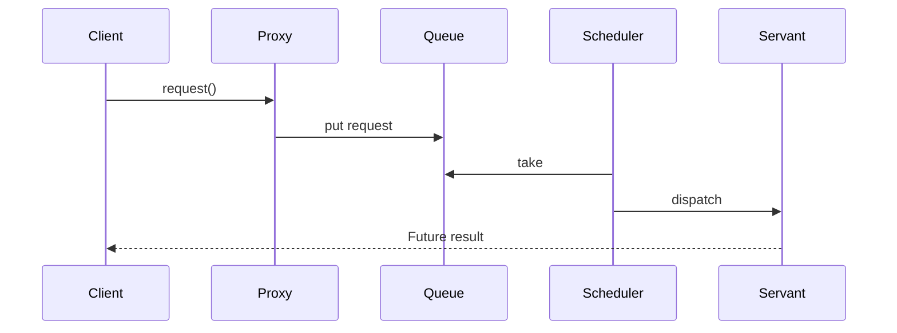

# Активный объект (`Active Object`)

Паттерн **Active Object** инкапсулирует вызовы методов и их исполнение в отдельном потоке управления, предоставляя асинхронный интерфейс для клиента.

## Полезные ссылки

### Официальная документация
- [Java Concurrency in Practice](https://jcip.net/) — книга по многопоточности
- [POSA Pattern Language](https://www.dre.vanderbilt.edu/~schmidt/posa/) — **Patterns for Concurrent and Networked Objects**

### См. также
- [[command|Command]] — **Command** паттерн
- [[producer-consumer|Producer-Consumer]] — **Producer-Consumer** паттерн
- [[java-concurrency-basics|Java Concurrency]] — **Java Concurrency**

## Содержание

- [Суть и запомнить](#суть-и-запомнить)
- [Что такое Active Object?](#что-такое-active-object)
  - [Основные характеристики](#основные-характеристики)
- [Когда использовать Active Object?](#когда-использовать-active-object)
  - [Подходящие сценарии](#подходящие-сценарии)
  - [Признаки необходимости](#признаки-необходимости)
- [Структура паттерна](#структура-паттерна)
  - [Компоненты](#компоненты)
- [Реализация на Java](#реализация-на-java)
  - [Базовая реализация](#базовая-реализация)
  - [Продвинутая реализация с очередью](#продвинутая-реализация-с-очередью)
  - [Интеграция с Spring](#интеграция-с-spring)
- [Преимущества и недостатки](#преимущества-и-недостатки)
  - [Преимущества](#преимущества)
    - [1. Упрощение многопоточности](#1-упрощение-многопоточности)
    - [2. Потокобезопасность](#2-потокобезопасность)
    - [3. Управление ресурсами](#3-управление-ресурсами)
  - [Недостатки](#недостатки)
    - [1. Задержки](#1-задержки)
    - [2. Сложность](#2-сложность)
    - [3. Отладка](#3-отладка)
- [Примеры использования](#примеры-использования)
  - [1. GUI-приложения](#1-gui-приложения)
  - [2. Веб-приложения](#2-веб-приложения)
  - [3. Обработка сообщений](#3-обработка-сообщений)
- [Лучшие практики](#лучшие-практики)
  - [1. Выбор планировщика](#1-выбор-планировщика)
  - [2. Обработка ошибок](#2-обработка-ошибок)
  - [3. Мониторинг и наблюдаемость](#3-мониторинг-и-наблюдаемость)
  - [4. Тестирование](#4-тестирование)
- [Решение проблем](#решение-проблем)
- [Частые вопросы](#частые-вопросы)
- [Заключение](#заключение)

## Суть и запомнить

**Суть в одном предложении:** Объект с собственным потоком и очередью запросов; вызов метода ставит запрос в очередь и возвращает Future; выполнение — в потоке объекта.

**Запомнить:**
- Proxy принимает вызовы, кладёт команды в очередь; отдельный поток (Servant) их выполняет.
- Клиент получает Future на результат; не блокируется на выполнении.
- Сочетание Command, Producer-Consumer и Future.

**Когда применять:** объект должен быть однопоточным, но вызываться из разных потоков; асинхронный API с гарантированным порядком.

## Что такое Active Object?

**Active Object** — это паттерн проектирования, который позволяет клиентам выполнять методы асинхронно, инкапсулируя детали многопоточности. Клиент вызывает метод синхронно, но исполнение происходит в отдельном потоке.

### Основные характеристики

1. **Асинхронный интерфейс**: Клиент получает **Future**/**CompletableFuture** сразу
2. **Последовательное выполнение**: Все операции выполняются последовательно в одном потоке
3. **Инкапсуляция потоков**: Клиент не знает о деталях многопоточности
4. **Thread-safe**: Безопасен для использования из нескольких потоков

## Когда использовать Active Object?

### Подходящие сценарии

- **GUI приложения**: Отделение `UI` потока от бизнес-логики
- **Серверные приложения**: Обработка запросов в фоне
- **I/O операции**: Асинхронная работа с дисками, сетью
- **Долгие операции**: Предотвращение блокировки вызывающего потока

### Признаки необходимости

Пример: блокирующий вызов в `UI` и асинхронная обработка через Active Object (Java).

```java
// Плохо: Блокирующий вызов в UI потоке
public class BadGUIController {
    public void handleUserAction() {
        // Долгая операция блокирует UI
        heavyDatabaseOperation(); // UI freezes!
        updateUI();
    }
}

// Хорошо: Active Object для асинхронной обработки
public class GoodGUIController {
    private final ActiveObject activeObject = new ActiveObject();

    public void handleUserAction() {
        // Немедленный возврат, UI не блокируется
        CompletableFuture<Void> future = activeObject.performHeavyOperation();
        future.thenRun(this::updateUI);
    }
}
```

## Структура паттерна



### Компоненты

1. **Proxy/`Active` Object**: Принимает вызовы клиентов, создает **MethodRequest**
2. **MethodRequest**: Инкапсулирует вызов метода и его параметры
3. **Activation Queue**: Очередь для **MethodRequest**'ов
4. **Scheduler**: Выбирает следующий **MethodRequest** для исполнения
5. **Servant**: Реальный объект, выполняющий операции

## Реализация на Java

### Базовая реализация

```java
import java.util.concurrent.*;
import java.util.function.Supplier;

// Method Request - инкапсулирует вызов метода
interface MethodRequest<T> {
    T execute();
    CompletableFuture<T> getFuture();
}

// Servant - реальный объект с бизнес-логикой
class DatabaseServant {
    public String saveUser(String name, String email) {
        // Имитация работы с БД
        try {
            Thread.sleep(100); // Имитация задержки
        } catch (InterruptedException e) {
            Thread.currentThread().interrupt();
        }
        return "User saved: " + name + " (" + email + ")";
    }

    public User findUser(String email) {
        try {
            Thread.sleep(50);
        } catch (InterruptedException e) {
            Thread.currentThread().interrupt();
        }
        return new User("John Doe", email);
    }
}

// Active Object
class ActiveObject {
    private final ExecutorService executor = Executors.newSingleThreadExecutor();
    private final DatabaseServant servant = new DatabaseServant();

    public CompletableFuture<String> saveUser(String name, String email) {
        return CompletableFuture.supplyAsync(() -> servant.saveUser(name, email), executor);
    }

    public CompletableFuture<User> findUser(String email) {
        return CompletableFuture.supplyAsync(() -> servant.findUser(email), executor);
    }

    public void shutdown() {
        executor.shutdown();
        try {
            if (!executor.awaitTermination(5, TimeUnit.SECONDS)) {
                executor.shutdownNow();
            }
        } catch (InterruptedException e) {
            executor.shutdownNow();
            Thread.currentThread().interrupt();
        }
    }
}

// Использование
public class ActiveObjectExample {
    public static void main(String[] args) {
        ActiveObject activeObject = new ActiveObject();

        // Асинхронные вызовы
        CompletableFuture<String> saveFuture = activeObject.saveUser("John", "john@example.com");
        CompletableFuture<User> findFuture = activeObject.findUser("john@example.com");

        // Обработка результатов
        saveFuture.thenAccept(result -> System.out.println("Save result: " + result));
        findFuture.thenAccept(user -> System.out.println("Found user: " + user.getName()));

        // Ожидание завершения
        CompletableFuture.allOf(saveFuture, findFuture).join();

        activeObject.shutdown();
    }
}
```

### Продвинутая реализация с очередью

```java
import java.util.concurrent.*;
import java.util.function.Consumer;

// Method Request с поддержкой различных типов операций
abstract class AbstractMethodRequest<T> implements MethodRequest<T> {
    protected final CompletableFuture<T> future = new CompletableFuture<>();

    @Override
    public CompletableFuture<T> getFuture() {
        return future;
    }

    public abstract void execute();
}

// Конкретные Method Request'ы
class SaveUserRequest extends AbstractMethodRequest<String> {
    private final DatabaseServant servant;
    private final String name;
    private final String email;

    public SaveUserRequest(DatabaseServant servant, String name, String email) {
        this.servant = servant;
        this.name = name;
        this.email = email;
    }

    @Override
    public void execute() {
        try {
            String result = servant.saveUser(name, email);
            future.complete(result);
        } catch (Exception e) {
            future.completeExceptionally(e);
        }
    }
}

class FindUserRequest extends AbstractMethodRequest<User> {
    private final DatabaseServant servant;
    private final String email;

    public FindUserRequest(DatabaseServant servant, String email) {
        this.servant = servant;
        this.email = email;
    }

    @Override
    public void execute() {
        try {
            User result = servant.findUser(email);
            future.complete(result);
        } catch (Exception e) {
            future.completeExceptionally(e);
        }
    }
}

// Scheduler с приоритетами
class Scheduler {
    private final BlockingQueue<AbstractMethodRequest<?>> queue = new PriorityBlockingQueue<>();
    private final ExecutorService executor = Executors.newSingleThreadExecutor();

    public Scheduler() {
        executor.submit(this::processQueue);
    }

    public <T> CompletableFuture<T> enqueue(AbstractMethodRequest<T> request) {
        queue.offer(request);
        return request.getFuture();
    }

    private void processQueue() {
        while (!Thread.currentThread().isInterrupted()) {
            try {
                AbstractMethodRequest<?> request = queue.take();
                request.execute();
            } catch (InterruptedException e) {
                Thread.currentThread().interrupt();
                break;
            } catch (Exception e) {
                // Логирование ошибки
                e.printStackTrace();
            }
        }
    }

    public void shutdown() {
        executor.shutdown();
        try {
            if (!executor.awaitTermination(5, TimeUnit.SECONDS)) {
                executor.shutdownNow();
            }
        } catch (InterruptedException e) {
            executor.shutdownNow();
            Thread.currentThread().interrupt();
        }
    }
}

// Продвинутый Active Object
class AdvancedActiveObject {
    private final DatabaseServant servant = new DatabaseServant();
    private final Scheduler scheduler = new Scheduler();

    public CompletableFuture<String> saveUser(String name, String email) {
        return scheduler.enqueue(new SaveUserRequest(servant, name, email));
    }

    public CompletableFuture<User> findUser(String email) {
        return scheduler.enqueue(new FindUserRequest(servant, email));
    }

    public void shutdown() {
        scheduler.shutdown();
    }
}
```

### Интеграция с Spring

```java
@Service
public class SpringActiveObject {

    @Autowired
    private DatabaseServant servant;

    private final ExecutorService executor = Executors.newSingleThreadExecutor();

    @PreDestroy
    public void shutdown() {
        executor.shutdown();
        try {
            if (!executor.awaitTermination(5, TimeUnit.SECONDS)) {
                executor.shutdownNow();
            }
        } catch (InterruptedException e) {
            executor.shutdownNow();
            Thread.currentThread().interrupt();
        }
    }

    public CompletableFuture<String> saveUser(String name, String email) {
        return CompletableFuture.supplyAsync(() -> {
            try {
                return servant.saveUser(name, email);
            } catch (Exception e) {
                throw new CompletionException(e);
            }
        }, executor);
    }

    public CompletableFuture<User> findUser(String email) {
        return CompletableFuture.supplyAsync(() -> {
            try {
                return servant.findUser(email);
            } catch (Exception e) {
                throw new CompletionException(e);
            }
        }, executor);
    }

    // Batch operations
    public CompletableFuture<List<String>> saveUsers(List<UserData> users) {
        return CompletableFuture.supplyAsync(() -> {
            return users.stream()
                    .map(user -> servant.saveUser(user.getName(), user.getEmail()))
                    .collect(Collectors.toList());
        }, executor);
    }
}

// Controller с Active Object
@RestController
@RequestMapping("/api/users")
public class UserController {

    @Autowired
    private SpringActiveObject activeObject;

    @PostMapping
    public CompletableFuture<ResponseEntity<String>> createUser(@RequestBody UserRequest request) {
        return activeObject.saveUser(request.getName(), request.getEmail())
                .thenApply(result -> ResponseEntity.ok(result))
                .exceptionally(throwable -> {
                    // Логирование ошибки
                    return ResponseEntity.status(HttpStatus.INTERNAL_SERVER_ERROR)
                            .body("Failed to save user: " + throwable.getMessage());
                });
    }

    @GetMapping("/{email}")
    public CompletableFuture<ResponseEntity<User>> getUser(@PathVariable String email) {
        return activeObject.findUser(email)
                .thenApply(user -> ResponseEntity.ok(user))
                .exceptionally(throwable -> {
                    if (throwable.getCause() instanceof UserNotFoundException) {
                        return ResponseEntity.notFound().build();
                    }
                    return ResponseEntity.status(HttpStatus.INTERNAL_SERVER_ERROR).build();
                });
    }
}
```

## Преимущества и недостатки

### Преимущества

#### 1. Упрощение многопоточности
```java
// Без Active Object: Сложный код
public class ComplexConcurrentCode {
    public void processRequest(Request request) {
        executor.submit(() -> {
            try {
                validateRequest(request);
                processBusinessLogic(request);
                saveToDatabase(request);
                sendNotification(request);
            } catch (Exception e) {
                handleError(e);
            }
        });
    }
}

// С Active Object: Простой код
public class SimpleActiveObjectCode {
    private final ActiveObject activeObject = new ActiveObject();

    public CompletableFuture<Void> processRequest(Request request) {
        return activeObject.processRequest(request);
    }
}
```

#### 2. Потокобезопасность
- Все операции выполняются в одном потоке
- Нет проблем с синхронизацией
- Последовательная обработка гарантирует консистентность

#### 3. Управление ресурсами
- Контроль над количеством потоков
- Ограничение одновременных операций
- Предсказуемое использование ресурсов

### Недостатки

#### 1. Задержки
- Дополнительная задержка из-за очереди
- Не подходит для операций требующих немедленного ответа

#### 2. Сложность
- Дополнительная абстракция
- **Overhead** на управление очередью

#### 3. Отладка
- Сложнее отлаживать асинхронный код
- **Stack traces** менее понятны

## Примеры использования

### 1. GUI-приложения

```java
public class GUIController {
    private final ActiveObject activeObject = new ActiveObject();

    public void handleButtonClick() {
        // UI остается responsive
        CompletableFuture<String> future = activeObject.loadDataFromDatabase();
        future.thenAccept(this::updateUI);
    }

    private void updateUI(String data) {
        SwingUtilities.invokeLater(() -> {
            // Update UI on EDT
            dataLabel.setText(data);
        });
    }
}
```

### 2. Веб-приложения

```java
@RestController
public class OrderController {

    private final ActiveObject orderProcessor = new ActiveObject();

    @PostMapping("/orders")
    public CompletableFuture<ResponseEntity<OrderResponse>> createOrder(@RequestBody OrderRequest request) {
        return orderProcessor.createOrder(request)
                .thenApply(order -> ResponseEntity.accepted()
                        .header("Location", "/orders/" + order.getId())
                        .body(new OrderResponse(order.getId(), "Order accepted")))
                .exceptionally(throwable -> ResponseEntity.badRequest()
                        .body(new OrderResponse(null, "Failed to create order")));
    }

    @GetMapping("/orders/{id}")
    public CompletableFuture<ResponseEntity<Order>> getOrder(@PathVariable Long id) {
        return orderProcessor.getOrder(id)
                .thenApply(order -> ResponseEntity.ok(order))
                .exceptionally(throwable -> ResponseEntity.notFound().build());
    }
}
```

### 3. Обработка сообщений

```java
@Service
public class MessageProcessor {

    private final ActiveObject messageHandler = new ActiveObject();

    @RabbitListener(queues = "incoming.messages")
    public void processMessage(Message message) {
        // Обработка в фоне, не блокирует consumer
        messageHandler.processMessage(message)
                .thenAccept(result -> {
                    // Аcknowledge message
                    acknowledgeMessage(message);
                })
                .exceptionally(throwable -> {
                    // Handle error, possibly send to dead letter queue
                    handleProcessingError(message, throwable);
                    return null;
                });
    }
}
```

## Лучшие практики

### 1. Выбор планировщика

```java
public class SchedulerFactory {

    // Для CPU-bound операций
    public static ExecutorService createCpuBoundScheduler(int threads) {
        return Executors.newFixedThreadPool(threads);
    }

    // Для I/O-bound операций
    public static ExecutorService createIoBoundScheduler() {
        return Executors.newCachedThreadPool();
    }

    // Для операций с разными приоритетами
    public static ExecutorService createPriorityScheduler() {
        return new ThreadPoolExecutor(
            1, 1, 0L, TimeUnit.MILLISECONDS,
            new PriorityBlockingQueue<>());
    }
}
```

### 2. Обработка ошибок

```java
public class ResilientActiveObject {

    private final ExecutorService executor;
    private final CircuitBreaker circuitBreaker;

    public <T> CompletableFuture<T> executeWithResilience(Supplier<T> operation) {
        if (circuitBreaker.isOpen()) {
            CompletableFuture<T> failed = new CompletableFuture<>();
            failed.completeExceptionally(new ServiceUnavailableException("Service temporarily unavailable"));
            return failed;
        }

        return CompletableFuture.supplyAsync(() -> {
            try {
                T result = operation.get();
                circuitBreaker.recordSuccess();
                return result;
            } catch (Exception e) {
                circuitBreaker.recordFailure();
                throw new CompletionException(e);
            }
        }, executor);
    }
}
```

### 3. Мониторинг и наблюдаемость

```java
@Service
public class MonitoredActiveObject {

    private final MeterRegistry meterRegistry;
    private final ExecutorService executor;

    public <T> CompletableFuture<T> executeMonitored(Supplier<T> operation, String operationName) {
        Timer.Sample sample = Timer.start(meterRegistry);
        Counter counter = meterRegistry.counter("active.object.operations", "operation", operationName);

        return CompletableFuture.supplyAsync(() -> {
            try {
                counter.increment();
                T result = operation.get();
                meterRegistry.counter("active.object.success", "operation", operationName).increment();
                return result;
            } catch (Exception e) {
                meterRegistry.counter("active.object.error", "operation", operationName).increment();
                throw new CompletionException(e);
            } finally {
                sample.stop(Timer.builder("active.object.duration")
                        .tag("operation", operationName)
                        .register(meterRegistry));
            }
        }, executor);
    }
}
```

### 4. Тестирование

```java
@ExtendWith(MockitoExtension.class)
public class ActiveObjectTest {

    @Mock
    private DatabaseServant servant;

    @InjectMocks
    private ActiveObject activeObject;

    @Test
    void shouldExecuteOperationAsynchronously() {
        when(servant.saveUser("John", "john@example.com"))
                .thenReturn("User saved: John");

        CompletableFuture<String> future = activeObject.saveUser("John", "john@example.com");

        // Verify operation was submitted (not completed yet)
        assertFalse(future.isDone());

        // Wait for completion
        String result = future.join();
        assertEquals("User saved: John", result);

        verify(servant).saveUser("John", "john@example.com");
    }

    @Test
    void shouldHandleExceptionsProperly() {
        when(servant.saveUser("John", "john@example.com"))
                .thenThrow(new RuntimeException("Database error"));

        CompletableFuture<String> future = activeObject.saveUser("John", "john@example.com");

        assertThrows(CompletionException.class, future::join);

        ExecutionException exception = assertThrows(ExecutionException.class, future::get);
        assertTrue(exception.getCause() instanceof RuntimeException);
        assertEquals("Database error", exception.getCause().getMessage());
    }
}
```


## Решение проблем

| Симптом | Возможная причина | Что делать |
|--------|-------------------|------------|
| Задержки при вызове | Очередь переполнена или один поток | Увеличить pool/очередь; использовать bounded queue с backpressure |
| Утечка потоков | Нет shutdown | Вызывать shutdown() при остановке; использовать try-with-resources |
| Исключения теряются | Не обрабатываются в worker | Обрабатывать в worker; возвращать результат через Future |

## Частые вопросы

**Active Object vs ExecutorService?** Active Object инкапсулирует очередь и поток в одном объекте; клиент получает Future. ExecutorService — общий пул. Active Object — когда у объекта свой «жизненный цикл» и очередь.

**Когда использовать?** GUI-обновления из фоновых потоков, асинхронные сервисы с порядком выполнения, изоляция многопоточности внутри компонента.


## Заключение

**Active Object** паттерн является мощным инструментом для создания асинхронных, **thread-safe** компонентов. Он особенно полезен в ситуациях, когда нужно отделить интерфейс от реализации и обеспечить последовательное выполнение операций. Несмотря на некоторую сложность реализации, паттерн значительно упрощает работу с многопоточностью и повышает надежность приложений.

**Ключевые преимущества:**
- **Асинхронный интерфейс** без блокировки клиентов
- **Thread safety** за счет последовательного выполнения
- **Инкапсуляция** деталей многопоточности
- **Упрощение** кода клиентов

**Используйте Active Object, когда:**
- Нужно асинхронное выполнение операций
- Важна **потокобезопасность**
- Требуется последовательная обработка
- Клиенты не должны знать о многопоточности
