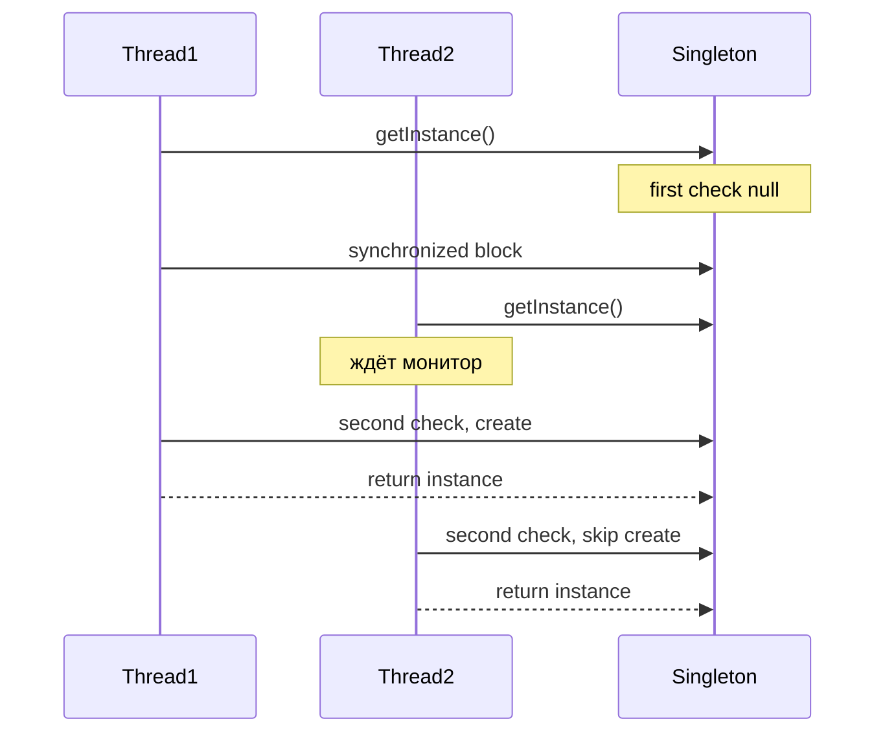

# Двойная проверка блокировки (Double-Checked Locking)

**Double-Checked Locking** — это паттерн оптимизации для **lazy initialization** в многопоточной среде, который минимизирует использование синхронизации.

## Полезные ссылки

### Официальная документация
- [Java Memory Model](https://docs.oracle.com/javase/specs/jls/se8/html/jls-17.html)
- [Java Concurrency in Practice](https://jcip.net/) — книга по многопоточности

### См. также
- [Java Concurrency](../../languages/java/java-concurrency-basics.md) — **Java Concurrency**
- [Singleton](../creational/singleton.md) — **Singleton Pattern**
- [JVM Memory / volatile](../../languages/java/java-concurrency-advanced.md) — память и **volatile**

- [Блокировка чтения-записи (Read-Write Lock)](read-write-lock.md)
- [Активный объект (Active Object)](active-object.md)
## Содержание

- [Суть и запомнить](#суть-и-запомнить)
- [Что такое Double-Checked Locking?](#что-такое-double-checked-locking)
  - [Основные характеристики](#основные-характеристики)
  - [Проблема, которую решает](#проблема-которую-решает)
- [Когда использовать Double-Checked Locking?](#когда-использовать-double-checked-locking)
  - [Подходящие сценарии](#подходящие-сценарии)
  - [Признаки необходимости](#признаки-необходимости)
- [Структура паттерна](#структура-паттерна)
  - [Компоненты](#компоненты)
- [Реализация на Java](#реализация-на-java)
  - [Классический Double-Checked Locking](#классический-double-checked-locking)
  - [С инициализацией с параметрами](#с-инициализацией-с-параметрами)
  - [DCL с обработкой исключений](#dcl-с-обработкой-исключений)
  - [DCL для коллекций и кэшей](#dcl-для-коллекций-и-кэшей)
- [Продвинутые реализации](#продвинутые-реализации)
  - [1. Holder Class (Bill Pugh Singleton)](#1-holder-class-bill-pugh-singleton)
  - [2. Enum Singleton](#2-enum-singleton)
  - [3. DCL с таймаутами](#3-dcl-с-таймаутами)
  - [4. DCL с мониторингом](#4-dcl-с-мониторингом)
- [Примеры использования](#примеры-использования)
  - [1. Database Connection Pool](#1-database-connection-pool)
  - [2. Configuration Manager](#2-configuration-manager)
  - [3. Service Registry](#3-service-registry)
- [Лучшие практики](#лучшие-практики)
  - [1. Когда использовать DCL](#1-когда-использовать-dcl)
  - [2. Распространенные ошибки](#2-распространенные-ошибки)
  - [3. Тестирование DCL](#3-тестирование-dcl)
- [Решение проблем](#решение-проблем)
- [Частые вопросы](#частые-вопросы)
- [Заключение](#заключение)

## Суть и запомнить

**Суть в одном предложении:** Ленивая инициализация в многопоточной среде: первая проверка без блокировки (быстрый путь), вторая — под synchronized; поле должно быть volatile.

**Запомнить:**
- Без volatile возможна публикация «полуготового» объекта (нарушение JMM).
- Альтернативы: holder class (ленивый и потокобезопасный), enum singleton.
- В Java 5+ volatile даёт нужные гарантии видимости.

**Когда применять:** ленивый singleton, ленивая инициализация тяжёлых ресурсов с минимумом блокировок.

## Что такое Double-Checked Locking?

**Double-Checked Locking** — это паттерн для **thread-safe lazy initialization**, который проверяет условие блокировки дважды: один раз без синхронизации и один раз с синхронизацией. Это позволяет избежать ненужной синхронизации после инициализации объекта.

### Основные характеристики

1. **Lazy Initialization**: Объект создается только при первом обращении
2. **Thread Safety**: Безопасная работа в многопоточной среде
3. **Performance**: Минимальные накладные расходы после инициализации
4. **Memory Visibility**: Гарантированная видимость изменений между потоками

### Проблема, которую решает

Сравнение полной синхронизации при каждом обращении и Double-Checked Locking (Java).

```java
// Плохо: Полная синхронизация при каждом обращении
public class LazySingleton {
    private static LazySingleton instance;

    public static synchronized LazySingleton getInstance() {
        if (instance == null) {
            instance = new LazySingleton();
        }
        return instance;
    }
}

// Хорошо: Double-Checked Locking
public class OptimizedSingleton {
    private static volatile OptimizedSingleton instance;

    public static OptimizedSingleton getInstance() {
        OptimizedSingleton result = instance;
        if (result == null) { // Первая проверка без синхронизации
            synchronized (OptimizedSingleton.class) {
                result = instance;
                if (result == null) { // Вторая проверка с синхронизацией
                    instance = result = new OptimizedSingleton();
                }
            }
        }
        return result;
    }
}
```

## Когда использовать Double-Checked Locking?

### Подходящие сценарии

- **Singleton Pattern**: Ленивая инициализация **singleton**-ов
- **Expensive Resources**: Дорогие в создании ресурсы(соединения, кэши)
- **Configuration Loading**: Загрузка конфигурации при первом обращении
- **Service Initialization**: Инициализация сервисов по требованию

### Признаки необходимости

```java
// Плохо: Eager initialization
public class DatabaseConnection {
    private static final DatabaseConnection instance = new DatabaseConnection();

    private DatabaseConnection() {
        // Дорогое создание соединения
        connectToDatabase();
    }

    public static DatabaseConnection getInstance() {
        return instance; // Всегда создается при загрузке класса
    }
}

// Хорошо: Lazy initialization с DCL
public class LazyDatabaseConnection {
    private static volatile DatabaseConnection instance;

    public static DatabaseConnection getInstance() {
        DatabaseConnection result = instance;
        if (result == null) {
            synchronized (LazyDatabaseConnection.class) {
                result = instance;
                if (result == null) {
                    instance = result = new DatabaseConnection();
                }
            }
        }
        return result;
    }
}
```

## Структура паттерна



### Компоненты

1. **Volatile Field**: Поле, помеченное как **volatile** для **memory visibility**
2. **First Check**: Быстрая проверка без синхронизации
3. **Synchronization Block**: Синхронизированный блок для безопасного создания
4. **Second Check**: Проверка внутри **synchronized** блока
5. **Initialization**: Создание объекта при необходимости

## Реализация на Java

### Классический Double-Checked Locking

```java
public class Singleton {
    private static volatile Singleton instance;

    private Singleton() {
        // Private constructor
    }

    public static Singleton getInstance() {
        Singleton result = instance;

        // Первая проверка без синхронизации
        if (result == null) {
            synchronized (Singleton.class) {
                result = instance;

                // Вторая проверка с синхронизацией
                if (result == null) {
                    instance = result = new Singleton();
                }
            }
        }

        return result;
    }

    // Метод для тестирования
    public static void reset() {
        synchronized (Singleton.class) {
            instance = null;
        }
    }
}
```

### С инициализацией с параметрами

```java
// Singleton с ленивой инициализацией и параметрами
public class ConfigurableSingleton {
    private static volatile ConfigurableSingleton instance;
    private final String config;

    private ConfigurableSingleton(String config) {
        this.config = config;
        // Дорогостоящая инициализация
        loadConfiguration(config);
    }

    public static ConfigurableSingleton getInstance(String config) {
        ConfigurableSingleton result = instance;

        if (result == null) {
            synchronized (ConfigurableSingleton.class) {
                result = instance;
                if (result == null) {
                    instance = result = new ConfigurableSingleton(config);
                }
            }
        }

        return result;
    }

    private void loadConfiguration(String config) {
        try {
            Thread.sleep(1000); // Имитация загрузки
        } catch (InterruptedException e) {
            Thread.currentThread().interrupt();
        }
        System.out.println("Configuration loaded: " + config);
    }

    public String getConfig() {
        return config;
    }
}
```

### DCL с обработкой исключений

```java
// DCL с корректной обработкой исключений
public class SafeSingleton {
    private static volatile SafeSingleton instance;
    private static volatile Throwable initializationError;

    private SafeSingleton() throws Exception {
        // Может выбросить исключение
        initialize();
    }

    public static SafeSingleton getInstance() throws Exception {
        SafeSingleton result = instance;

        if (result == null) {
            synchronized (SafeSingleton.class) {
                result = instance;
                if (result == null) {
                    try {
                        instance = result = new SafeSingleton();
                    } catch (Throwable t) {
                        initializationError = t;
                        throw t;
                    }
                }
            }
        }

        // Проверяем была ли ошибка инициализации в другом потоке
        if (initializationError != null) {
            if (initializationError instanceof Exception) {
                throw (Exception) initializationError;
            } else if (initializationError instanceof Error) {
                throw (Error) initializationError;
            } else {
                throw new RuntimeException(initializationError);
            }
        }

        return result;
    }

    private void initialize() throws Exception {
        // Имитация инициализации которая может провалиться
        if (Math.random() < 0.1) { // 10% шанс ошибки
            throw new Exception("Initialization failed");
        }

        try {
            Thread.sleep(500);
        } catch (InterruptedException e) {
            Thread.currentThread().interrupt();
            throw new Exception("Interrupted during initialization", e);
        }
    }

    // Для тестирования
    public static void reset() {
        synchronized (SafeSingleton.class) {
            instance = null;
            initializationError = null;
        }
    }
}
```

### DCL для коллекций и кэшей

```java
// Lazy initialization для Map
public class LazyCache<K, V> {
    private volatile Map<K, V> cache;

    public V get(K key) {
        Map<K, V> cacheRef = cache;

        // Первая проверка
        if (cacheRef == null) {
            synchronized (this) {
                cacheRef = cache;

                // Вторая проверка
                if (cacheRef == null) {
                    cache = cacheRef = new ConcurrentHashMap<>();
                    initializeCache(cacheRef);
                }
            }
        }

        return cacheRef.get(key);
    }

    public void put(K key, V value) {
        get(key); // Гарантирует инициализацию
        cache.put(key, value);
    }

    private void initializeCache(Map<K, V> cache) {
        // Дорогостоящая инициализация кэша
        try {
            Thread.sleep(1000);
        } catch (InterruptedException e) {
            Thread.currentThread().interrupt();
        }
        System.out.println("Cache initialized");
    }

    // Для тестирования
    public void reset() {
        synchronized (this) {
            cache = null;
        }
    }
}
```

## Продвинутые реализации

### 1. Holder Class (Bill Pugh Singleton)

```java
// Самый безопасный способ для singleton - Holder Class
public class HolderSingleton {
    private HolderSingleton() {
        // Private constructor
    }

    // Holder класс инициализируется при первом обращении
    private static class Holder {
        private static final HolderSingleton INSTANCE = new HolderSingleton();
    }

    public static HolderSingleton getInstance() {
        return Holder.INSTANCE;
    }

    // Преимущества:
    // - Thread-safe без synchronized
    // - Lazy initialization
    // - Нет проблем с memory model
    // - Исключения в конструкторе корректно обрабатываются
}

// Сравнение с DCL
public class Comparison {

    // DCL - требует volatile и сложной логики
    public static class DCLSingleton {
        private static volatile DCLSingleton instance;

        public static DCLSingleton getInstance() {
            DCLSingleton result = instance;
            if (result == null) {
                synchronized (DCLSingleton.class) {
                    result = instance;
                    if (result == null) {
                        instance = result = new DCLSingleton();
                    }
                }
            }
            return result;
        }
    }

    // Holder - проще и надежнее
    public static class HolderSingleton {
        private static class Holder {
            static final HolderSingleton INSTANCE = new HolderSingleton();
        }

        public static HolderSingleton getInstance() {
            return Holder.INSTANCE;
        }
    }
}
```

### 2. Enum Singleton

```java
// Самый простой и надежный singleton
public enum EnumSingleton {
    INSTANCE;

    private String data;

    public void setData(String data) {
        this.data = data;
    }

    public String getData() {
        return data;
    }

    // Преимущества:
    // - Thread-safe автоматически
    // - Защита от reflection attacks
    // - Гарантированная единственность
    // - Lazy initialization не нужна (инициализация при загрузке enum)

    // Недостатки:
    // - Нельзя наследоваться
    // - Инициализация при загрузке класса (не lazy)
    // - Нельзя передать параметры в конструктор
}
```

### 3. DCL с таймаутами

```java
// DCL с таймаутами для предотвращения зависаний
public class TimeoutDCL {
    private static volatile TimeoutDCL instance;
    private static final long INITIALIZATION_TIMEOUT = 5000; // 5 seconds

    private TimeoutDCL() throws InterruptedException {
        initializeWithTimeout();
    }

    public static TimeoutDCL getInstance() throws Exception {
        TimeoutDCL result = instance;

        if (result == null) {
            if (!tryInitializeWithTimeout()) {
                throw new Exception("Initialization timeout");
            }
            result = instance;
        }

        return result;
    }

    private static boolean tryInitializeWithTimeout() throws Exception {
        long startTime = System.currentTimeMillis();

        synchronized (TimeoutDCL.class) {
            // Проверяем снова внутри synchronized
            if (instance == null) {
                try {
                    instance = new TimeoutDCL();

                    // Проверяем не истек ли таймаут
                    long elapsed = System.currentTimeMillis() - startTime;
                    if (elapsed > INITIALIZATION_TIMEOUT) {
                        instance = null; // Очищаем неудачную инициализацию
                        return false;
                    }

                } catch (InterruptedException e) {
                    instance = null; // Очищаем при прерывании
                    Thread.currentThread().interrupt();
                    throw e;
                }
            }
        }

        return true;
    }

    private void initializeWithTimeout() throws InterruptedException {
        // Имитация долгой инициализации
        Thread.sleep(2000);
    }
}
```

### 4. DCL с мониторингом

```java
// DCL с метриками производительности
public class MonitoredDCL {
    private static volatile MonitoredDCL instance;
    private static final AtomicLong initializationCount = new AtomicLong(0);
    private static final AtomicLong totalInitializationTime = new AtomicLong(0);
    private static final AtomicLong lockContentionCount = new AtomicLong(0);

    private MonitoredDCL() {
        long startTime = System.nanoTime();
        try {
            initialize();
        } finally {
            long duration = System.nanoTime() - startTime;
            totalInitializationTime.addAndGet(duration);
            initializationCount.incrementAndGet();
        }
    }

    public static MonitoredDCL getInstance() {
        MonitoredDCL result = instance;

        if (result == null) {
            long lockStartTime = System.nanoTime();
            synchronized (MonitoredDCL.class) {
                long lockDuration = System.nanoTime() - lockStartTime;
                if (lockDuration > 1000000) { // > 1ms
                    lockContentionCount.incrementAndGet();
                }

                result = instance;
                if (result == null) {
                    instance = result = new MonitoredDCL();
                }
            }
        }

        return result;
    }

    private void initialize() {
        try {
            Thread.sleep(100); // Имитация работы
        } catch (InterruptedException e) {
            Thread.currentThread().interrupt();
        }
    }

    // Метрики для мониторинга
    public static class Metrics {
        public static long getInitializationCount() {
            return initializationCount.get();
        }

        public static double getAverageInitializationTimeMs() {
            long count = initializationCount.get();
            return count > 0 ? (totalInitializationTime.get() / 1_000_000.0) / count : 0;
        }

        public static long getLockContentionCount() {
            return lockContentionCount.get();
        }

        public static void resetMetrics() {
            initializationCount.set(0);
            totalInitializationTime.set(0);
            lockContentionCount.set(0);
        }
    }
}
```

## Примеры использования

### 1. Database Connection Pool

```java
@Service
public class DatabaseConnectionPool {

    private static volatile DatabaseConnectionPool instance;
    private final List<Connection> pool = new ArrayList<>();
    private final int maxConnections;

    private DatabaseConnectionPool(int maxConnections) {
        this.maxConnections = maxConnections;
        initializePool();
    }

    public static DatabaseConnectionPool getInstance() {
        DatabaseConnectionPool result = instance;

        if (result == null) {
            synchronized (DatabaseConnectionPool.class) {
                result = instance;
                if (result == null) {
                    instance = result = new DatabaseConnectionPool(10);
                }
            }
        }

        return result;
    }

    private void initializePool() {
        for (int i = 0; i < maxConnections; i++) {
            try {
                Connection conn = createConnection();
                pool.add(conn);
            } catch (SQLException e) {
                throw new RuntimeException("Failed to initialize connection pool", e);
            }
        }
    }

    public Connection getConnection() throws SQLException {
        synchronized (pool) {
            if (pool.isEmpty()) {
                return createConnection();
            }
            return pool.remove(pool.size() - 1);
        }
    }

    public void returnConnection(Connection conn) {
        synchronized (pool) {
            if (pool.size() < maxConnections) {
                pool.add(conn);
            } else {
                try {
                    conn.close();
                } catch (SQLException e) {
                    // Log error
                }
            }
        }
    }

    private Connection createConnection() throws SQLException {
        // Создание соединения с БД
        return DriverManager.getConnection("jdbc:h2:mem:test");
    }

    @PreDestroy
    public void shutdown() {
        synchronized (pool) {
            for (Connection conn : pool) {
                try {
                    conn.close();
                } catch (SQLException e) {
                    // Log error
                }
            }
            pool.clear();
        }
    }
}
```

### 2. Configuration Manager

```java
@Service
public class ConfigurationManager {

    private static volatile ConfigurationManager instance;
    private volatile Properties configuration;

    private ConfigurationManager() {
        loadConfiguration();
    }

    public static ConfigurationManager getInstance() {
        ConfigurationManager result = instance;

        if (result == null) {
            synchronized (ConfigurationManager.class) {
                result = instance;
                if (result == null) {
                    instance = result = new ConfigurationManager();
                }
            }
        }

        return result;
    }

    public String getProperty(String key) {
        Properties config = configuration;
        if (config == null) {
            synchronized (this) {
                config = configuration;
                if (config == null) {
                    loadConfiguration();
                    config = configuration;
                }
            }
        }
        return config.getProperty(key);
    }

    private void loadConfiguration() {
        Properties props = new Properties();
        try (InputStream in = getClass().getResourceAsStream("/application.properties")) {
            if (in != null) {
                props.load(in);
            }
        } catch (IOException e) {
            throw new RuntimeException("Failed to load configuration", e);
        }
        configuration = props;
    }

    // Hot reload для тестирования
    public void reloadConfiguration() {
        synchronized (this) {
            configuration = null;
        }
    }
}
```

### 3. Service Registry

```java
@Service
public class ServiceRegistry {

    private static volatile ServiceRegistry instance;
    private final Map<Class<?>, Object> services = new ConcurrentHashMap<>();

    private ServiceRegistry() {
        registerDefaultServices();
    }

    public static ServiceRegistry getInstance() {
        ServiceRegistry result = instance;

        if (result == null) {
            synchronized (ServiceRegistry.class) {
                result = instance;
                if (result == null) {
                    instance = result = new ServiceRegistry();
                }
            }
        }

        return result;
    }

    @SuppressWarnings("unchecked")
    public <T> T getService(Class<T> serviceClass) {
        return (T) services.computeIfAbsent(serviceClass, this::createService);
    }

    public <T> void registerService(Class<T> serviceClass, T service) {
        services.put(serviceClass, service);
    }

    private void registerDefaultServices() {
        registerService(Logger.class, new ConsoleLogger());
        registerService(Cache.class, new InMemoryCache());
        registerService(MetricsCollector.class, new SimpleMetricsCollector());
    }

    private <T> T createService(Class<T> serviceClass) {
        try {
            return serviceClass.getDeclaredConstructor().newInstance();
        } catch (Exception e) {
            throw new RuntimeException("Failed to create service: " + serviceClass.getName(), e);
        }
    }

    // Для тестирования
    public static void reset() {
        synchronized (ServiceRegistry.class) {
            instance = null;
        }
    }
}
```

## Лучшие практики

### 1. Когда использовать DCL

```java
public class DCLGuidelines {

    // Используйте DCL когда:
    // - Создание объекта дорогое (I/O, network, heavy computation)
    // - Объект нужен не всегда
    // - Приложение многопоточное
    // - Производительность критична

    // НЕ используйте DCL когда:
    // - Инициализация простая и быстрая
    // - Объект нужен всегда (используйте eager initialization)
    // - Приложение однопоточное
    // - Безопасность важнее производительности

    public static class Recommendations {

        // Для singleton без параметров - Holder class
        public static class SimpleSingleton {
            private static class Holder {
                static final SimpleSingleton INSTANCE = new SimpleSingleton();
            }

            public static SimpleSingleton getInstance() {
                return Holder.INSTANCE;
            }
        }

        // Для singleton с параметрами - DCL
        public static class ConfigurableSingleton {
            private static volatile ConfigurableSingleton instance;

            public static ConfigurableSingleton getInstance(String config) {
                ConfigurableSingleton result = instance;

                if (result == null) {
                    synchronized (ConfigurableSingleton.class) {
                        result = instance;
                        if (result == null) {
                            instance = result = new ConfigurableSingleton(config);
                        }
                    }
                }

                return result;
            }

            private final String config;
            private ConfigurableSingleton(String config) {
                this.config = config;
            }
        }

        // Для enum-like singleton - enum
        public enum ServiceType {
            DATABASE, CACHE, LOGGER;

            public AbstractService createService() {
                switch (this) {
                    case DATABASE: return new DatabaseService();
                    case CACHE: return new CacheService();
                    case LOGGER: return new LoggerService();
                    default: throw new IllegalArgumentException();
                }
            }
        }
    }
}
```

### 2. Распространенные ошибки

```java
public class DCLPitfalls {

    // ОШИБКА: Забыли volatile
    public static class BrokenDCL {
        private static BrokenDCL instance; // Нет volatile!

        public static BrokenDCL getInstance() {
            BrokenDCL result = instance;
            if (result == null) {
                synchronized (BrokenDCL.class) {
                    result = instance;
                    if (result == null) {
                        instance = result = new BrokenDCL();
                    }
                }
            }
            return result;
        }

        // Проблема: Другие потоки могут увидеть частично инициализированный объект
    }

    // ОШИБКА: Неправильный порядок проверок
    public static class WrongOrderDCL {
        private static volatile WrongOrderDCL instance;

        public static WrongOrderDCL getInstance() {
            synchronized (WrongOrderDCL.class) { // Синхронизация снаружи!
                if (instance == null) {
                    instance = new WrongOrderDCL();
                }
            }
            return instance;
        }

        // Проблема: Всегда синхронизируемся, теряем преимущество DCL
    }

    // ОШИБКА: Несколько volatile переменных
    public static class MultipleVolatiles {
        private static volatile MultipleVolatiles instance;
        private volatile String data; // volatile не помогает!

        public void setData(String data) {
            this.data = data;
        }

        public String getData() {
            return data;
        }

        // Проблема: volatile гарантирует видимость только ссылки на объект,
        // но не полей объекта. Для полей нужна синхронизация или другие механизмы
    }

    // ПРАВИЛЬНО: DCL с volatile
    public static class CorrectDCL {
        private static volatile CorrectDCL instance;

        public static CorrectDCL getInstance() {
            CorrectDCL result = instance;
            if (result == null) {
                synchronized (CorrectDCL.class) {
                    result = instance;
                    if (result == null) {
                        instance = result = new CorrectDCL();
                    }
                }
            }
            return result;
        }
    }
}
```

### 3. Тестирование DCL

```java
@ExtendWith(MockitoExtension.class)
public class DCLTest {

    @Test
    void shouldCreateOnlyOneInstance() throws InterruptedException {
        // Reset singleton for test
        TestSingleton.reset();

        AtomicInteger instanceCount = new AtomicInteger(0);

        Runnable task = () -> {
            TestSingleton instance = TestSingleton.getInstance();
            instanceCount.incrementAndGet();
        };

        Thread[] threads = new Thread[100];
        for (int i = 0; i < threads.length; i++) {
            threads[i] = new Thread(task);
        }

        for (Thread thread : threads) {
            thread.start();
        }

        for (Thread thread : threads) {
            thread.join();
        }

        assertEquals(100, instanceCount.get(), "All threads should get instance");
        assertEquals(1, TestSingleton.getInstanceCount(), "Only one instance should be created");
    }

    @Test
    void shouldHandleInitializationExceptions() {
        FailingSingleton.reset();

        Exception exception = assertThrows(Exception.class, () -> {
            FailingSingleton.getInstance();
        });

        assertEquals("Initialization failed", exception.getMessage());

        // Повторный вызов должен бросить то же исключение
        Exception secondException = assertThrows(Exception.class, () -> {
            FailingSingleton.getInstance();
        });

        assertEquals("Initialization failed", secondException.getMessage());
    }

    @Test
    void shouldBeThreadSafeForLazyInitialization() throws InterruptedException {
        LazyInit.reset();

        CountDownLatch startLatch = new CountDownLatch(1);
        CountDownLatch endLatch = new CountDownLatch(10);

        Runnable task = () -> {
            try {
                startLatch.await(); // Ждем старта всех потоков
                LazyInit.getInstance();
                endLatch.countDown();
            } catch (InterruptedException e) {
                Thread.currentThread().interrupt();
            }
        };

        Thread[] threads = new Thread[10];
        for (int i = 0; i < threads.length; i++) {
            threads[i] = new Thread(task);
        }

        for (Thread thread : threads) {
            thread.start();
        }

        startLatch.countDown(); // Стартуем все потоки одновременно
        endLatch.await(); // Ждем завершения всех потоков

        assertEquals(1, LazyInit.getInitializationCount());
    }

    // Test classes
    static class TestSingleton {
        private static volatile TestSingleton instance;
        private static int instanceCount = 0;

        private TestSingleton() {
            synchronized (TestSingleton.class) {
                instanceCount++;
            }
        }

        public static TestSingleton getInstance() {
            TestSingleton result = instance;
            if (result == null) {
                synchronized (TestSingleton.class) {
                    result = instance;
                    if (result == null) {
                        instance = result = new TestSingleton();
                    }
                }
            }
            return result;
        }

        public static void reset() {
            synchronized (TestSingleton.class) {
                instance = null;
                instanceCount = 0;
            }
        }

        public static int getInstanceCount() {
            return instanceCount;
        }
    }

    static class FailingSingleton {
        private static volatile FailingSingleton instance;
        private static volatile Throwable error;

        private FailingSingleton() throws Exception {
            throw new Exception("Initialization failed");
        }

        public static FailingSingleton getInstance() throws Exception {
            FailingSingleton result = instance;

            if (result == null) {
                synchronized (FailingSingleton.class) {
                    result = instance;
                    if (result == null) {
                        try {
                            instance = result = new FailingSingleton();
                        } catch (Throwable t) {
                            error = t;
                            throw t;
                        }
                    }
                }
            }

            if (error != null) {
                if (error instanceof Exception) {
                    throw (Exception) error;
                } else {
                    throw new RuntimeException(error);
                }
            }

            return result;
        }

        public static void reset() {
            synchronized (FailingSingleton.class) {
                instance = null;
                error = null;
            }
        }
    }

    static class LazyInit {
        private static volatile LazyInit instance;
        private static int initializationCount = 0;

        private LazyInit() {
            synchronized (LazyInit.class) {
                initializationCount++;
            }
        }

        public static LazyInit getInstance() {
            LazyInit result = instance;
            if (result == null) {
                synchronized (LazyInit.class) {
                    result = instance;
                    if (result == null) {
                        instance = result = new LazyInit();
                    }
                }
            }
            return result;
        }

        public static void reset() {
            synchronized (LazyInit.class) {
                instance = null;
                initializationCount = 0;
            }
        }

        public static int getInitializationCount() {
            return initializationCount;
        }
    }
}
```


## Решение проблем

| Симптом | Возможная причина | Что делать |
|--------|-------------------|------------|
| Полуготовый объект виден другим потокам | Отсутствие volatile | Добавить volatile к полю инстанса |
| Множественная инициализация | Неверный порядок проверок | Первая проверка без lock, вторая — под synchronized |
| Исключение при инициализации | Объект частично создан | Обработать в блоке; при ошибке сбросить instance |

## Частые вопросы

**Зачем volatile?** Без volatile компилятор может переупорядочить записи; второй поток может увидеть ненулевую ссылку до завершения конструктора. Volatile гарантирует visibility по JMM.

**DCL vs Holder?** Holder (Bill Pugh) — проще, ленивый, без параметров. DCL — когда нужна инициализация с параметрами или условная логика.


## Заключение

**Double-Checked Locking** — это мощный паттерн для оптимизации **lazy initialization** в многопоточных приложениях. Он позволяет добиться высокой производительности, избегая ненужной синхронизации после инициализации объекта.

**Ключевые преимущества:**
- **Производительность**: Минимальные накладные расходы после инициализации
- **Thread Safety**: Гарантированная безопасность в многопоточной среде
- **Lazy Loading**: Создание объектов только при необходимости
- **Memory Visibility**: Корректная видимость изменений между потоками

**Используйте DCL, когда:**
- Создание объекта дорогое и происходит не всегда
- Приложение многопоточное
- Производительность критична
- Нужна **lazy initialization**

**Для простых случаев рассмотрите альтернативы:**
- **Holder Class**: Для **singleton** без параметров
- **Enum**: Для простых **singleton** с гарантированной безопасностью
- **Eager Initialization**: Когда объект нужен всегда

Главное правило: всегда используйте `volatile` для поля **singleton** и следуйте паттерну двойной проверки!
