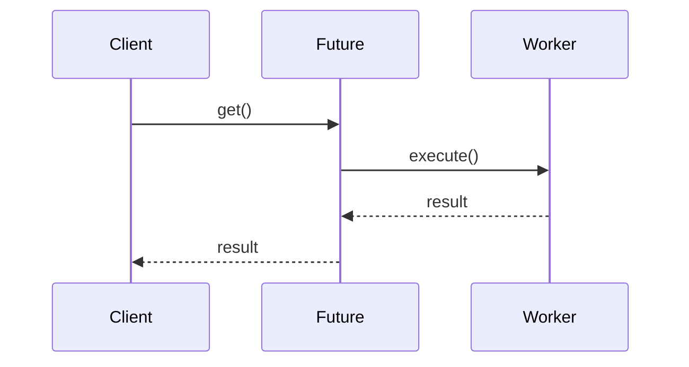

# Будущие задачи (Future/Task)

**Future**/**Task** паттерн позволяет выполнять операции асинхронно и получать результаты в будущем, обеспечивая неблокирующую работу и композицию асинхронных операций.

## Полезные ссылки

### Официальная документация
- [Java Future](https://docs.oracle.com/javase/8/docs/api/java/util/concurrent/Future.html)
- [Java CompletableFuture](https://docs.oracle.com/javase/8/docs/api/java/util/concurrent/CompletableFuture.html)
- [Java FutureTask](https://docs.oracle.com/javase/8/docs/api/java/util/concurrent/FutureTask.html)

### См. также
- [Java Concurrency](../../languages/java/java-concurrency-basics.md) — **Java Concurrency**
- [Producer-Consumer](producer-consumer.md) — **Producer-Consumer Pattern**
- [CompletableFuture / асинхронность](../../languages/java/java-concurrency-advanced.md) — асинхронное программирование

- [Двойная проверка блокировки (Double-Checked Locking)](double-checked-locking.md)
- [Блокировка чтения-записи (Read-Write Lock)](read-write-lock.md)
## Содержание

- [Суть и запомнить](#суть-и-запомнить)
- [Что такое Future/Task Pattern?](#что-такое-futuretask-pattern)
  - [Основные характеристики](#основные-характеристики)
  - [Сравнение с синхронным кодом](#сравнение-с-синхронным-кодом)
- [Когда использовать Future/Task?](#когда-использовать-futuretask)
  - [Подходящие сценарии](#подходящие-сценарии)
  - [Признаки необходимости](#признаки-необходимости)
- [Структура паттерна](#структура-паттерна)
  - [Компоненты](#компоненты)
- [Реализация на Java](#реализация-на-java)
  - [Базовый Future с ExecutorService](#базовый-future-с-executorservice)
  - [FutureTask — низкоуровневая реализация](#futuretask-низкоуровневая-реализация)
  - [CompletableFuture — высокоуровневая реализация](#completablefuture-высокоуровневая-реализация)
- [Продвинутые реализации](#продвинутые-реализации)
  - [1. Promise Pattern](#1-promise-pattern)
  - [2. Reactive Extensions с Future](#2-reactive-extensions-с-future)
  - [3. Future-based Pipeline](#3-future-based-pipeline)
- [Примеры использования](#примеры-использования)
  - [1. HTTP Client с Future](#1-http-client-с-future)
  - [2. Database Operations](#2-database-operations)
  - [3. Image Processing Service](#3-image-processing-service)
- [Лучшие практики](#лучшие-практики)
  - [1. Выбор между Future, FutureTask и CompletableFuture](#1-выбор-между-future-futuretask-и-completablefuture)
  - [2. Обработка исключений](#2-обработка-исключений)
  - [3. Таймауты и отмена](#3-таймауты-и-отмена)
  - [4. Тестирование](#4-тестирование)
- [Решение проблем](#решение-проблем)
- [Частые вопросы](#частые-вопросы)
- [Заключение](#заключение)

## Суть и запомнить

**Суть в одном предложении:** Запускаем задачу асинхронно и получаем результат «позже» через объект Future; не блокируем поток, можно комбинировать и отменять.

**Запомнить:**
- ExecutorService.submit(Callable) возвращает Future; get() блокирует до результата.
- CompletableFuture — цепочки, комбинирование, обработка ошибок без блокировки.
- В Java: Future, FutureTask, CompletableFuture.

**Когда применять:** долгие I/O, параллельные вычисления, неблокирующий UI.

## Что такое Future/Task Pattern?

**Future**/**Task** — это паттерн асинхронного программирования, где операции выполняются в фоне, а результат можно получить позже через **Future** объект. Это позволяет писать неблокирующий код и эффективно использовать ресурсы.

### Основные характеристики

1. **Асинхронность**: Задачи выполняются в фоне без блокировки основного потока
2. **Композиция**: Результаты **Future** можно комбинировать и трансформировать
3. **Неблокирующая**: Получение результатов без ожидания завершения
4. **Отмена**: Возможность отмены выполняющихся задач

### Сравнение с синхронным кодом

Сравнение синхронного подхода и асинхронного через Future (Java).

```java
// Синхронный подход - блокирует поток
public class SynchronousExample {
    public String processData(String input) {
        String step1 = validateInput(input);     // Блокирует
        String step2 = transformData(step1);     // Блокирует
        String step3 = saveToDatabase(step2);    // Блокирует
        return step3;
    }
}

// Future подход - неблокирующий
public class AsynchronousExample {
    private final ExecutorService executor = Executors.newFixedThreadPool(4);

    public Future<String> processDataAsync(String input) {
        return executor.submit(() -> {
            String step1 = validateInput(input);
            String step2 = transformData(step1);
            String step3 = saveToDatabase(step2);
            return step3;
        });
    }

    // Клиент может проверить готовность или получить результат
    public void useResult() {
        Future<String> future = processDataAsync("input");

        // Делаем другую работу...
        doOtherWork();

        // Получаем результат (блокирует если не готов)
        try {
            String result = future.get();
            System.out.println("Result: " + result);
        } catch (Exception e) {
            handleError(e);
        }
    }
}
```

## Когда использовать Future/Task?

### Подходящие сценарии

- **I/O операции**: Сетевые запросы, работа с файлами, базами данных
- **Длительные вычисления**: Математические расчеты, обработка больших данных
- **Внешние сервисы**: Вызовы **REST API**, микросервисов
- **Пакетная обработка**: Множество независимых операций
- **UI приложения**: Предотвращение блокировки пользовательского интерфейса

### Признаки необходимости

```java
// Признаки: Длительные операции, независимые задачи
public class FutureIndicators {

    // Длительная I/O операция
    public Future<byte[]> downloadFileAsync(String url) {
        return executor.submit(() -> {
            try {
                return downloadFile(url); // Может занять секунды
            } catch (IOException e) {
                throw new RuntimeException(e);
            }
        });
    }

    // Независимые вычисления
    public List<Future<Integer>> calculateBatchAsync(List<Data> batch) {
        return batch.stream()
            .map(data -> executor.submit(() -> calculate(data)))
            .collect(Collectors.toList());
    }

    // Комплексная бизнес-операция
    public Future<Order> processOrderAsync(OrderRequest request) {
        return executor.submit(() -> {
            validateOrder(request);      // Валидация
            calculateTotal(request);     // Расчет
            checkInventory(request);     // Проверка склада
            processPayment(request);     // Оплата
            createOrder(request);        // Создание заказа
            sendConfirmation(request);   // Отправка подтверждения
            return createOrder(request);
        });
    }
}
```

## Структура паттерна



### Компоненты

1. **Task**: Единица работы для асинхронного выполнения
2. **Future**: Объект, представляющий результат будущей операции
3. **Executor**: Компонент, управляющий выполнением задач
4. **Client**: Код, использующий **Future** для получения результатов

## Реализация на Java

### Базовый Future с ExecutorService

```java
import java.util.concurrent.*;
import java.util.List;
import java.util.ArrayList;

// Базовая реализация Future pattern
public class BasicFutureExample {

    private final ExecutorService executor = Executors.newFixedThreadPool(4);

    // Простая асинхронная задача
    public Future<String> processDataAsync(String input) {
        return executor.submit(() -> {
            // Имитация длительной операции
            Thread.sleep(1000);
            return "Processed: " + input.toUpperCase();
        });
    }

    // Получение результата с таймаутом
    public String getResultWithTimeout(Future<String> future, long timeout, TimeUnit unit)
            throws InterruptedException, ExecutionException, TimeoutException {
        return future.get(timeout, unit);
    }

    // Проверка готовности без блокировки
    public boolean isResultReady(Future<String> future) {
        return future.isDone();
    }

    // Отмена задачи
    public boolean cancelTask(Future<String> future) {
        return future.cancel(true); // true = может прервать выполнение
    }

    // Обработка нескольких futures
    public List<String> processBatch(List<String> inputs) throws InterruptedException, ExecutionException {
        List<Future<String>> futures = new ArrayList<>();

        // Запускаем все задачи
        for (String input : inputs) {
            futures.add(processDataAsync(input));
        }

        // Собираем результаты
        List<String> results = new ArrayList<>();
        for (Future<String> future : futures) {
            results.add(future.get()); // Блокируется для каждого
        }

        return results;
    }

    public void shutdown() {
        executor.shutdown();
        try {
            if (!executor.awaitTermination(5, TimeUnit.SECONDS)) {
                executor.shutdownNow();
            }
        } catch (InterruptedException e) {
            executor.shutdownNow();
            Thread.currentThread().interrupt();
        }
    }

    // Пример использования
    public static void main(String[] args) {
        BasicFutureExample example = new BasicFutureExample();

        try {
            // Запускаем задачу
            Future<String> future = example.processDataAsync("Hello World");

            // Делаем другую работу пока задача выполняется
            System.out.println("Doing other work...");
            Thread.sleep(500);

            // Получаем результат
            if (future.isDone()) {
                String result = future.get();
                System.out.println("Result: " + result);
            } else {
                System.out.println("Task still running...");
            }

        } catch (Exception e) {
            e.printStackTrace();
        } finally {
            example.shutdown();
        }
    }
}
```

### FutureTask — низкоуровневая реализация

```java
// FutureTask - низкоуровневая реализация
public class FutureTaskExample {

    public void futureTaskBasics() {
        // Создание FutureTask с Callable
        FutureTask<String> futureTask = new FutureTask<>(() -> {
            Thread.sleep(1000);
            return "Task completed";
        });

        // Запуск в отдельном потоке
        new Thread(futureTask).start();

        try {
            // Получение результата
            String result = futureTask.get();
            System.out.println("Result: " + result);
        } catch (InterruptedException | ExecutionException e) {
            e.printStackTrace();
        }
    }

    // FutureTask с Runnable
    public void futureTaskWithRunnable() {
        AtomicReference<String> resultHolder = new AtomicReference<>();

        FutureTask<Void> futureTask = new FutureTask<>(() -> {
            Thread.sleep(1000);
            resultHolder.set("Runnable task completed");
        }, null); // null результат для Runnable

        new Thread(futureTask).start();

        try {
            futureTask.get(); // Ждем завершения
            System.out.println("Result: " + resultHolder.get());
        } catch (Exception e) {
            e.printStackTrace();
        }
    }

    // Отмена FutureTask
    public void cancelFutureTask() {
        FutureTask<String> futureTask = new FutureTask<>(() -> {
            for (int i = 0; i < 10; i++) {
                Thread.sleep(100);
                System.out.println("Working... " + i);
            }
            return "Completed";
        });

        Thread thread = new Thread(futureTask);
        thread.start();

        try {
            Thread.sleep(300); // Даем поработать

            // Отменяем задачу
            boolean cancelled = futureTask.cancel(true);
            System.out.println("Task cancelled: " + cancelled);

            // Попытка получить результат отмененной задачи
            String result = futureTask.get();
            System.out.println("Result: " + result);

        } catch (CancellationException e) {
            System.out.println("Task was cancelled");
        } catch (Exception e) {
            e.printStackTrace();
        }
    }

    // FutureTask как Runnable
    public void futureTaskAsRunnable() {
        FutureTask<String> futureTask = new FutureTask<>(() -> {
            Thread.sleep(1000);
            return "Runnable result";
        });

        ExecutorService executor = Executors.newSingleThreadExecutor();
        executor.submit(futureTask); // FutureTask implements Runnable

        try {
            String result = futureTask.get();
            System.out.println("Result: " + result);
        } catch (Exception e) {
            e.printStackTrace();
        }

        executor.shutdown();
    }
}
```

### CompletableFuture — высокоуровневая реализация

```java
// CompletableFuture - современный подход
public class CompletableFutureExample {

    private final ExecutorService executor = Executors.newFixedThreadPool(4);

    // Базовое использование
    public void basicCompletableFuture() {
        CompletableFuture<String> future = CompletableFuture.supplyAsync(() -> {
            try {
                Thread.sleep(1000);
            } catch (InterruptedException e) {
                Thread.currentThread().interrupt();
            }
            return "Hello from CompletableFuture";
        });

        // Неблокирующее получение результата
        future.thenAccept(result -> System.out.println("Result: " + result));

        // Ожидание завершения для демонстрации
        future.join();
    }

    // Цепочка операций
    public CompletableFuture<String> processDataChain(String input) {
        return CompletableFuture.supplyAsync(() -> validateInput(input), executor)
            .thenApplyAsync(this::transformData, executor)
            .thenApplyAsync(this::enrichData, executor)
            .thenApplyAsync(this::formatResult, executor);
    }

    private String validateInput(String input) {
        if (input == null || input.isEmpty()) {
            throw new IllegalArgumentException("Input cannot be null or empty");
        }
        return input;
    }

    private String transformData(String input) {
        return input.toUpperCase();
    }

    private String enrichData(String input) {
        return input + " [enriched]";
    }

    private String formatResult(String input) {
        return "Result: " + input;
    }

    // Комбинация нескольких futures
    public CompletableFuture<List<String>> processBatchAsync(List<String> inputs) {
        List<CompletableFuture<String>> futures = inputs.stream()
            .map(this::processDataChain)
            .collect(Collectors.toList());

        return CompletableFuture.allOf(futures.toArray(new CompletableFuture[0]))
            .thenApply(v -> futures.stream()
                .map(CompletableFuture::join)
                .collect(Collectors.toList()));
    }

    // Обработка ошибок
    public CompletableFuture<String> processWithErrorHandling(String input) {
        return CompletableFuture.supplyAsync(() -> {
            if (input.contains("error")) {
                throw new RuntimeException("Simulated error");
            }
            return input.toUpperCase();
        })
        .exceptionally(throwable -> {
            System.err.println("Error occurred: " + throwable.getMessage());
            return "DEFAULT_VALUE";
        })
        .thenApply(result -> "Processed: " + result);
    }

    // Таймаут
    public CompletableFuture<String> processWithTimeout(String input) {
        return processDataChain(input)
            .orTimeout(2, TimeUnit.SECONDS)
            .exceptionally(throwable -> {
                if (throwable instanceof TimeoutException) {
                    return "TIMEOUT";
                }
                return "ERROR: " + throwable.getMessage();
            });
    }

    // Завершение
    public void shutdown() {
        executor.shutdown();
    }

    // Пример использования
    public static void main(String[] args) {
        CompletableFutureExample example = new CompletableFutureExample();

        try {
            // Цепочка операций
            CompletableFuture<String> result = example.processDataChain("hello world");
            System.out.println("Final result: " + result.get());

            // Пакетная обработка
            List<String> inputs = Arrays.asList("input1", "input2", "input3");
            CompletableFuture<List<String>> batchResult = example.processBatchAsync(inputs);
            System.out.println("Batch results: " + batchResult.get());

            // Обработка ошибок
            CompletableFuture<String> errorResult = example.processWithErrorHandling("error input");
            System.out.println("Error result: " + errorResult.get());

        } catch (Exception e) {
            e.printStackTrace();
        } finally {
            example.shutdown();
        }
    }
}
```

## Продвинутые реализации

### 1. Promise Pattern

```java
// Promise паттерн - аналог CompletableFuture
public class Promise<T> {

    private final CompletableFuture<T> future = new CompletableFuture<>();

    // Создание resolved promise
    public static <T> Promise<T> resolve(T value) {
        Promise<T> promise = new Promise<>();
        promise.future.complete(value);
        return promise;
    }

    // Создание rejected promise
    public static <T> Promise<T> reject(Throwable error) {
        Promise<T> promise = new Promise<>();
        promise.future.completeExceptionally(error);
        return promise;
    }

    // Создание promise из async операции
    public static <T> Promise<T> async(Supplier<T> supplier, Executor executor) {
        Promise<T> promise = new Promise<>();
        executor.execute(() -> {
            try {
                T result = supplier.get();
                promise.future.complete(result);
            } catch (Exception e) {
                promise.future.completeExceptionally(e);
            }
        });
        return promise;
    }

    // Трансформация результата
    public <U> Promise<U> map(Function<T, U> mapper) {
        Promise<U> promise = new Promise<>();
        future.whenComplete((result, error) -> {
            if (error != null) {
                promise.future.completeExceptionally(error);
            } else {
                try {
                    U mapped = mapper.apply(result);
                    promise.future.complete(mapped);
                } catch (Exception e) {
                    promise.future.completeExceptionally(e);
                }
            }
        });
        return promise;
    }

    // Цепочка операций
    public <U> Promise<U> flatMap(Function<T, Promise<U>> mapper) {
        Promise<U> promise = new Promise<>();
        future.whenComplete((result, error) -> {
            if (error != null) {
                promise.future.completeExceptionally(error);
            } else {
                try {
                    Promise<U> nextPromise = mapper.apply(result);
                    nextPromise.future.whenComplete((nextResult, nextError) -> {
                        if (nextError != null) {
                            promise.future.completeExceptionally(nextError);
                        } else {
                            promise.future.complete(nextResult);
                        }
                    });
                } catch (Exception e) {
                    promise.future.completeExceptionally(e);
                }
            }
        });
        return promise;
    }

    // Обработка ошибок
    public Promise<T> recover(Function<Throwable, T> recovery) {
        Promise<T> promise = new Promise<>();
        future.whenComplete((result, error) -> {
            if (error != null) {
                try {
                    T recovered = recovery.apply(error);
                    promise.future.complete(recovered);
                } catch (Exception e) {
                    promise.future.completeExceptionally(e);
                }
            } else {
                promise.future.complete(result);
            }
        });
        return promise;
    }

    // Получение результата
    public T get() throws InterruptedException, ExecutionException {
        return future.get();
    }

    public T get(long timeout, TimeUnit unit) throws InterruptedException, ExecutionException, TimeoutException {
        return future.get(timeout, unit);
    }

    // Проверка готовности
    public boolean isDone() {
        return future.isDone();
    }

    // Пример использования
    public static void main(String[] args) {
        ExecutorService executor = Executors.newFixedThreadPool(2);

        Promise<String> promise = Promise.async(() -> {
            Thread.sleep(1000);
            return "Hello Promise";
        }, executor);

        promise.map(String::toUpperCase)
              .map(s -> s + "!!!")
              .map(s -> {
                  System.out.println("Final result: " + s);
                  return s;
              });

        executor.shutdown();
    }
}
```

### 2. Reactive Extensions с Future

```java
// Интеграция Future с reactive streams
public class ReactiveFutureBridge {

    // Преобразование Future в Observable
    public static <T> Observable<T> toObservable(Future<T> future) {
        return Observable.create(emitter -> {
            try {
                T result = future.get();
                if (!emitter.isDisposed()) {
                    emitter.onNext(result);
                    emitter.onComplete();
                }
            } catch (CancellationException e) {
                if (!emitter.isDisposed()) {
                    emitter.onError(new RuntimeException("Future was cancelled"));
                }
            } catch (Exception e) {
                if (!emitter.isDisposed()) {
                    emitter.onError(e);
                }
            }
        });
    }

    // Преобразование Observable в Future
    public static <T> Future<T> toFuture(Observable<T> observable) {
        CompletableFuture<T> future = new CompletableFuture<>();

        observable.subscribe(
            result -> future.complete(result),
            error -> future.completeExceptionally(error),
            () -> {
                if (!future.isDone()) {
                    future.completeExceptionally(new NoSuchElementException("Observable completed without value"));
                }
            }
        );

        return future;
    }

    // Композиция Future с timeout
    public static <T> Future<T> withTimeout(Future<T> future, long timeout, TimeUnit unit) {
        CompletableFuture<T> timeoutFuture = new CompletableFuture<>();

        // Запускаем задачу получения результата
        CompletableFuture.runAsync(() -> {
            try {
                T result = future.get(timeout, unit);
                timeoutFuture.complete(result);
            } catch (TimeoutException e) {
                timeoutFuture.completeExceptionally(e);
            } catch (Exception e) {
                timeoutFuture.completeExceptionally(e);
            }
        });

        return timeoutFuture;
    }

    // Retry механизм для Future
    public static <T> Future<T> withRetry(Callable<Future<T>> futureSupplier, int maxRetries,
                                        long delayMs, Executor executor) {
        CompletableFuture<T> result = new CompletableFuture<>();

        retryAsync(futureSupplier, maxRetries, delayMs, 0, result, executor);

        return result;
    }

    private static <T> void retryAsync(Callable<Future<T>> futureSupplier, int maxRetries,
                                      long delayMs, int attempt, CompletableFuture<T> result,
                                      Executor executor) {
        try {
            Future<T> future = futureSupplier.call();
            future.get().whenComplete((value, error) -> {
                if (error != null && attempt < maxRetries) {
                    // Повторная попытка с задержкой
                    executor.execute(() -> {
                        try {
                            Thread.sleep(delayMs);
                            retryAsync(futureSupplier, maxRetries, delayMs, attempt + 1, result, executor);
                        } catch (InterruptedException e) {
                            result.completeExceptionally(e);
                        }
                    });
                } else if (error != null) {
                    result.completeExceptionally(error);
                } else {
                    result.complete(value);
                }
            });
        } catch (Exception e) {
            result.completeExceptionally(e);
        }
    }
}
```

### 3. Future-based Pipeline

```java
// Pipeline паттерн с Future
public class FuturePipeline<T, R> {

    private final List<Stage<T, ?>> stages;
    private final Executor executor;

    public FuturePipeline(Executor executor) {
        this.stages = new ArrayList<>();
        this.executor = executor;
    }

    public <U> FuturePipeline<T, U> addStage(Function<?, U> function) {
        stages.add(new Stage<>(function));
        return (FuturePipeline<T, U>) this;
    }

    public CompletableFuture<R> execute(T input) {
        CompletableFuture<?> current = CompletableFuture.completedFuture(input);

        for (Stage<?, ?> stage : stages) {
            current = current.thenApplyAsync(stage.function, executor);
        }

        return (CompletableFuture<R>) current;
    }

    // Параллельное выполнение стадий
    public CompletableFuture<R> executeParallel(T input) {
        if (stages.isEmpty()) {
            return CompletableFuture.completedFuture((R) input);
        }

        // Первая стадия
        CompletableFuture<?> firstResult = CompletableFuture
            .supplyAsync(() -> stages.get(0).function.apply(input), executor);

        // Остальные стадии последовательно
        CompletableFuture<?> current = firstResult;
        for (int i = 1; i < stages.size(); i++) {
            final int index = i;
            current = current.thenApplyAsync(result -> stages.get(index).function.apply(result), executor);
        }

        return (CompletableFuture<R>) current;
    }

    // Пакетная обработка
    public List<CompletableFuture<R>> executeBatch(List<T> inputs) {
        return inputs.stream()
            .map(this::execute)
            .collect(Collectors.toList());
    }

    private static class Stage<I, O> {
        private final Function<I, O> function;

        public Stage(Function<I, O> function) {
            this.function = function;
        }
    }

    // Пример использования
    public static void main(String[] args) {
        ExecutorService executor = Executors.newFixedThreadPool(4);

        FuturePipeline<String, String> pipeline = new FuturePipeline<>(executor)
            .addStage((String s) -> s.toUpperCase())
            .addStage((String s) -> s + "!!!")
            .addStage((String s) -> "Result: " + s);

        List<String> inputs = Arrays.asList("hello", "world", "future");

        List<CompletableFuture<String>> futures = pipeline.executeBatch(inputs);

        // Собираем результаты
        CompletableFuture.allOf(futures.toArray(new CompletableFuture[0]))
            .thenRun(() -> {
                futures.forEach(future -> {
                    try {
                        System.out.println(future.get());
                    } catch (Exception e) {
                        e.printStackTrace();
                    }
                });
            })
            .join();

        executor.shutdown();
    }
}
```

## Примеры использования

### 1. HTTP Client с Future

```java
@Service
public class AsyncHttpClient {

    private final ExecutorService executor = Executors.newFixedThreadPool(10);
    private final HttpClient httpClient = HttpClient.newHttpClient();

    public Future<HttpResponse<String>> getAsync(String url) {
        return executor.submit(() -> {
            HttpRequest request = HttpRequest.newBuilder()
                .uri(URI.create(url))
                .GET()
                .build();

            return httpClient.send(request, HttpResponse.BodyHandlers.ofString());
        });
    }

    public Future<HttpResponse<String>> postAsync(String url, String jsonBody) {
        return executor.submit(() -> {
            HttpRequest request = HttpRequest.newBuilder()
                .uri(URI.create(url))
                .POST(HttpRequest.BodyPublishers.ofString(jsonBody))
                .header("Content-Type", "application/json")
                .build();

            return httpClient.send(request, HttpResponse.BodyHandlers.ofString());
        });
    }

    // Параллельные запросы
    public List<Future<HttpResponse<String>>> getMultipleAsync(List<String> urls) {
        return urls.stream()
            .map(this::getAsync)
            .collect(Collectors.toList());
    }

    // Агрегация результатов
    public Future<String> aggregateResults(List<String> urls) {
        return executor.submit(() -> {
            List<Future<HttpResponse<String>>> futures = getMultipleAsync(urls);

            StringBuilder result = new StringBuilder();
            for (Future<HttpResponse<String>> future : futures) {
                try {
                    HttpResponse<String> response = future.get(5, TimeUnit.SECONDS);
                    result.append("URL: ").append(response.uri())
                          .append(", Status: ").append(response.statusCode())
                          .append(", Body: ").append(response.body().substring(0, 100))
                          .append("\n");
                } catch (Exception e) {
                    result.append("Error: ").append(e.getMessage()).append("\n");
                }
            }

            return result.toString();
        });
    }

    @PreDestroy
    public void shutdown() {
        executor.shutdown();
    }
}
```

### 2. Database Operations

```java
@Repository
public class AsyncDatabaseRepository {

    private final ExecutorService executor = Executors.newFixedThreadPool(5);
    private final JdbcTemplate jdbcTemplate;

    public AsyncDatabaseRepository(JdbcTemplate jdbcTemplate) {
        this.jdbcTemplate = jdbcTemplate;
    }

    public Future<User> findUserByIdAsync(Long id) {
        return executor.submit(() -> {
            String sql = "SELECT * FROM users WHERE id = ?";
            return jdbcTemplate.queryForObject(sql, new Object[]{id}, (rs, rowNum) -> {
                User user = new User();
                user.setId(rs.getLong("id"));
                user.setName(rs.getString("name"));
                user.setEmail(rs.getString("email"));
                return user;
            });
        });
    }

    public Future<List<Order>> findOrdersByUserIdAsync(Long userId) {
        return executor.submit(() -> {
            String sql = "SELECT * FROM orders WHERE user_id = ?";
            return jdbcTemplate.query(sql, new Object[]{userId}, (rs, rowNum) -> {
                Order order = new Order();
                order.setId(rs.getLong("id"));
                order.setUserId(rs.getLong("user_id"));
                order.setAmount(rs.getBigDecimal("amount"));
                return order;
            });
        });
    }

    // Комплексная операция с Future композицией
    public Future<UserOrders> getUserWithOrdersAsync(Long userId) {
        return executor.submit(() -> {
            CompletableFuture<User> userFuture = CompletableFuture.supplyAsync(
                () -> findUserByIdAsync(userId), executor
            ).thenCompose(future -> {
                try {
                    return CompletableFuture.completedFuture(future.get());
                } catch (Exception e) {
                    throw new RuntimeException(e);
                }
            });

            CompletableFuture<List<Order>> ordersFuture = CompletableFuture.supplyAsync(
                () -> findOrdersByUserIdAsync(userId), executor
            ).thenCompose(future -> {
                try {
                    return CompletableFuture.completedFuture(future.get());
                } catch (Exception e) {
                    throw new RuntimeException(e);
                }
            });

            // Комбинируем результаты
            return userFuture.thenCombine(ordersFuture, (user, orders) -> {
                UserOrders userOrders = new UserOrders();
                userOrders.setUser(user);
                userOrders.setOrders(orders);
                return userOrders;
            }).get();
        });
    }

    // Batch операции
    public Future<List<User>> findUsersByIdsAsync(List<Long> ids) {
        return executor.submit(() -> {
            List<Future<User>> futures = ids.stream()
                .map(this::findUserByIdAsync)
                .collect(Collectors.toList());

            List<User> users = new ArrayList<>();
            for (Future<User> future : futures) {
                try {
                    users.add(future.get(10, TimeUnit.SECONDS));
                } catch (Exception e) {
                    // Логируем ошибку, но продолжаем
                    System.err.println("Failed to get user: " + e.getMessage());
                }
            }

            return users;
        });
    }

    @PreDestroy
    public void shutdown() {
        executor.shutdown();
    }

    // DTO классы
    public static class UserOrders {
        private User user;
        private List<Order> orders;

        // getters and setters
    }
}
```

### 3. Image Processing Service

```java
@Service
public class AsyncImageProcessor {

    private final ExecutorService executor = Executors.newFixedThreadPool(
        Runtime.getRuntime().availableProcessors()
    );

    public Future<BufferedImage> loadImageAsync(Path imagePath) {
        return executor.submit(() -> ImageIO.read(imagePath.toFile()));
    }

    public Future<BufferedImage> resizeImageAsync(BufferedImage image, int width, int height) {
        return executor.submit(() -> {
            BufferedImage resized = new BufferedImage(width, height, image.getType());
            Graphics2D g = resized.createGraphics();
            g.drawImage(image, 0, 0, width, height, null);
            g.dispose();
            return resized;
        });
    }

    public Future<BufferedImage> applyFilterAsync(BufferedImage image, ImageFilter filter) {
        return executor.submit(() -> {
            FilteredImageSource source = new FilteredImageSource(image.getSource(), filter);
            return Toolkit.getDefaultToolkit().createImage(source).getBufferedImage();
        });
    }

    public Future<Path> saveImageAsync(BufferedImage image, Path outputPath, String format) {
        return executor.submit(() -> {
            ImageIO.write(image, format, outputPath.toFile());
            return outputPath;
        });
    }

    // Pipeline обработки изображения
    public Future<Path> processImageAsync(Path inputPath, Path outputPath,
                                        int width, int height, ImageFilter filter) {
        return loadImageAsync(inputPath)
            .thenCompose(image -> resizeImageAsync(image, width, height))
            .thenCompose(resized -> applyFilterAsync(resized, filter))
            .thenCompose(filtered -> saveImageAsync(filtered, outputPath, "jpg"));
    }

    // Пакетная обработка
    public List<Future<Path>> processBatchAsync(List<ImageProcessingTask> tasks) {
        return tasks.stream()
            .map(task -> processImageAsync(
                task.getInputPath(),
                task.getOutputPath(),
                task.getWidth(),
                task.getHeight(),
                task.getFilter()
            ))
            .collect(Collectors.toList());
    }

    // Комплексная операция с прогрессом
    public Future<ImageProcessingResult> processWithProgressAsync(ImageProcessingTask task) {
        return executor.submit(() -> {
            ImageProcessingResult result = new ImageProcessingResult(task);

            // Загрузка
            result.setProgress(10);
            BufferedImage image = loadImageAsync(task.getInputPath()).get();

            // Изменение размера
            result.setProgress(40);
            BufferedImage resized = resizeImageAsync(image, task.getWidth(), task.getHeight()).get();

            // Применение фильтра
            result.setProgress(70);
            BufferedImage filtered = applyFilterAsync(resized, task.getFilter()).get();

            // Сохранение
            result.setProgress(90);
            Path outputPath = saveImageAsync(filtered, task.getOutputPath(), "jpg").get();

            result.setProgress(100);
            result.setOutputPath(outputPath);
            result.setCompleted(true);

            return result;
        });
    }

    @PreDestroy
    public void shutdown() {
        executor.shutdown();
    }

    // Вспомогательные классы
    public static class ImageProcessingTask {
        private final Path inputPath;
        private final Path outputPath;
        private final int width;
        private final int height;
        private final ImageFilter filter;

        // constructor, getters
    }

    public static class ImageProcessingResult {
        private final ImageProcessingTask task;
        private Path outputPath;
        private int progress;
        private boolean completed;

        // constructor, getters, setters
    }
}
```

## Лучшие практики

### 1. Выбор между Future, FutureTask и CompletableFuture

```java
public class FutureSelectionGuide {

    // Используйте Future когда:
    // - Простая асинхронная операция
    // - Нужно получить результат в будущем
    // - Достаточно базового API
    public Future<String> basicAsyncOperation() {
        return executor.submit(() -> {
            // operation
            return "result";
        });
    }

    // Используйте FutureTask когда:
    // - Нужен низкоуровневый контроль
    // - Задача может быть отменена или запущена несколько раз
    // - Интеграция с legacy кодом
    public FutureTask<String> controllableAsyncOperation() {
        FutureTask<String> task = new FutureTask<>(() -> "result");

        // Можно запустить в любом executor
        executor.submit(task);
        // Или в отдельном потоке
        new Thread(task).start();

        return task;
    }

    // Используйте CompletableFuture когда:
    // - Комплексная композиция операций
    // - Обработка ошибок и recovery
    // - Таймауты и completion callbacks
    // - Комбинация множественных futures
    public CompletableFuture<String> complexAsyncOperation() {
        return CompletableFuture.supplyAsync(this::step1, executor)
            .thenApplyAsync(this::step2, executor)
            .exceptionally(this::handleError)
            .orTimeout(5, TimeUnit.SECONDS);
    }

    private String step1() { return "step1"; }
    private String step2(String input) { return input + " -> step2"; }
    private String handleError(Throwable t) { return "error: " + t.getMessage(); }
}
```

### 2. Обработка исключений

```java
public class ExceptionHandlingPatterns {

    // Обработка исключений в Future
    public String handleFutureExceptions(Future<String> future) {
        try {
            return future.get(5, TimeUnit.SECONDS);
        } catch (TimeoutException e) {
            return "TIMEOUT";
        } catch (CancellationException e) {
            return "CANCELLED";
        } catch (ExecutionException e) {
            Throwable cause = e.getCause();
            if (cause instanceof IllegalArgumentException) {
                return "INVALID_INPUT";
            } else {
                return "EXECUTION_ERROR: " + cause.getMessage();
            }
        } catch (InterruptedException e) {
            Thread.currentThread().interrupt();
            return "INTERRUPTED";
        }
    }

    // Обработка исключений в CompletableFuture
    public CompletableFuture<String> handleCompletableFutureExceptions() {
        return CompletableFuture.supplyAsync(() -> {
            if (Math.random() < 0.5) {
                throw new RuntimeException("Random failure");
            }
            return "success";
        })
        .exceptionally(throwable -> {
            // Recovery логика
            System.err.println("Operation failed: " + throwable.getMessage());
            return "recovered_value";
        })
        .whenComplete((result, error) -> {
            // Cleanup или logging
            if (error != null) {
                System.err.println("Final error: " + error.getMessage());
            } else {
                System.out.println("Final result: " + result);
            }
        });
    }

    // Circuit Breaker паттерн
    public static class CircuitBreakerFuture<T> {

        private volatile boolean open = false;
        private final int failureThreshold;
        private int failureCount = 0;

        public CircuitBreakerFuture(int failureThreshold) {
            this.failureThreshold = failureThreshold;
        }

        public CompletableFuture<T> execute(Supplier<CompletableFuture<T>> operation) {
            if (open) {
                return CompletableFuture.failedFuture(
                    new RuntimeException("Circuit breaker is open"));
            }

            return operation.get()
                .whenComplete((result, error) -> {
                    if (error != null) {
                        failureCount++;
                        if (failureCount >= failureThreshold) {
                            open = true;
                        }
                    } else {
                        failureCount = 0;
                        open = false;
                    }
                });
        }

        public boolean isOpen() { return open; }
    }
}
```

### 3. Таймауты и отмена

```java
public class TimeoutAndCancellationPatterns {

    // Таймаут для Future
    public <T> T getWithTimeout(Future<T> future, long timeout, TimeUnit unit) throws Exception {
        try {
            return future.get(timeout, unit);
        } catch (TimeoutException e) {
            future.cancel(true); // Отменяем задачу
            throw new RuntimeException("Operation timed out after " + timeout + " " + unit);
        }
    }

    // Таймаут для CompletableFuture
    public CompletableFuture<String> completableFutureWithTimeout(CompletableFuture<String> future) {
        return future.orTimeout(10, TimeUnit.SECONDS)
            .exceptionally(throwable -> {
                if (throwable instanceof TimeoutException) {
                    return "TIMEOUT";
                }
                return "ERROR: " + throwable.getMessage();
            });
    }

    // Отмена с cleanup
    public CompletableFuture<String> cancellableOperation() {
        CompletableFuture<String> future = new CompletableFuture<>();

        // Имитируем отменяемую операцию
        ScheduledExecutorService scheduler = Executors.newSingleThreadScheduledExecutor();
        ScheduledFuture<?> scheduledTask = scheduler.schedule(() -> {
            if (!future.isCancelled()) {
                future.complete("completed");
            }
        }, 5, TimeUnit.SECONDS);

        // Обработка отмены
        future.whenComplete((result, error) -> {
            scheduledTask.cancel(true); // Отменяем запланированную задачу
            scheduler.shutdown();
        });

        return future;
    }

    // Graceful shutdown с ожиданием
    public void shutdownExecutorWithPendingTasks(ExecutorService executor) {
        executor.shutdown(); // Останавливаем прием новых задач

        try {
            // Ждем завершения существующих задач
            if (!executor.awaitTermination(30, TimeUnit.SECONDS)) {
                // Принудительно останавливаем
                List<Runnable> pendingTasks = executor.shutdownNow();
                System.out.println("Forcefully shut down. Pending tasks: " + pendingTasks.size());

                // Ждем завершения прерванных задач
                if (!executor.awaitTermination(10, TimeUnit.SECONDS)) {
                    System.err.println("Executor did not terminate cleanly");
                }
            }
        } catch (InterruptedException e) {
            executor.shutdownNow();
            Thread.currentThread().interrupt();
        }
    }
}
```

### 4. Тестирование

```java
@ExtendWith(MockitoExtension.class)
public class FuturePatternTest {

    private ExecutorService executor;

    @BeforeEach
    void setUp() {
        executor = Executors.newSingleThreadExecutor();
    }

    @AfterEach
    void tearDown() {
        executor.shutdown();
    }

    @Test
    void shouldCompleteFutureSuccessfully() throws Exception {
        Future<String> future = executor.submit(() -> "test result");

        assertEquals("test result", future.get(1, TimeUnit.SECONDS));
        assertTrue(future.isDone());
    }

    @Test
    void shouldHandleFutureTimeout() {
        Future<String> future = executor.submit(() -> {
            Thread.sleep(2000);
            return "result";
        });

        assertThrows(TimeoutException.class, () ->
            future.get(500, TimeUnit.MILLISECONDS));
    }

    @Test
    void shouldCancelFuture() throws Exception {
        Future<String> future = executor.submit(() -> {
            Thread.sleep(2000);
            return "result";
        });

        Thread.sleep(100); // Даем запуститься

        assertTrue(future.cancel(true));
        assertTrue(future.isCancelled());

        assertThrows(CancellationException.class, () -> future.get());
    }

    @Test
    void shouldHandleCompletableFutureException() {
        CompletableFuture<String> future = CompletableFuture.supplyAsync(() -> {
            throw new RuntimeException("test error");
        });

        ExecutionException exception = assertThrows(ExecutionException.class,
            () -> future.get(1, TimeUnit.SECONDS));

        assertTrue(exception.getCause() instanceof RuntimeException);
        assertEquals("test error", exception.getCause().getMessage());
    }

    @Test
    void shouldRecoverFromCompletableFutureException() throws Exception {
        CompletableFuture<String> future = CompletableFuture.supplyAsync(() -> {
            throw new RuntimeException("test error");
        }).exceptionally(throwable -> "recovered: " + throwable.getMessage());

        assertEquals("recovered: test error", future.get(1, TimeUnit.SECONDS));
    }

    @Test
    void shouldChainCompletableFutureOperations() throws Exception {
        CompletableFuture<String> future = CompletableFuture.supplyAsync(() -> "hello")
            .thenApply(String::toUpperCase)
            .thenApply(s -> s + " world");

        assertEquals("HELLO world", future.get(1, TimeUnit.SECONDS));
    }

    @Test
    void shouldCombineMultipleFutures() throws Exception {
        CompletableFuture<String> future1 = CompletableFuture.supplyAsync(() -> "hello");
        CompletableFuture<String> future2 = CompletableFuture.supplyAsync(() -> "world");

        CompletableFuture<String> combined = future1.thenCombine(future2,
            (s1, s2) -> s1 + " " + s2);

        assertEquals("hello world", combined.get(1, TimeUnit.SECONDS));
    }

    @Test
    void shouldWaitForAllFutures() throws Exception {
        List<CompletableFuture<String>> futures = Arrays.asList(
            CompletableFuture.supplyAsync(() -> "task1"),
            CompletableFuture.supplyAsync(() -> "task2"),
            CompletableFuture.supplyAsync(() -> "task3")
        );

        CompletableFuture<Void> allFutures = CompletableFuture.allOf(
            futures.toArray(new CompletableFuture[0]));

        allFutures.get(1, TimeUnit.SECONDS);

        // Все futures должны быть завершены
        for (CompletableFuture<String> future : futures) {
            assertTrue(future.isDone());
        }
    }
}
```


## Решение проблем

| Симптом | Возможная причина | Что делать |
|--------|-------------------|------------|
| get() блокирует навсегда | Задача зависла или не запущена | Использовать get(timeout); проверять isDone() |
| ExecutionException при get() | Исключение в задаче | Проверять cause; обрабатывать в catch |
| Потеря результата | Забыли вызвать get() | Всегда получать результат или обрабатывать в whenComplete |

## Частые вопросы

**Future vs CompletableFuture?** Future — базовый API, только get/cancel. CompletableFuture — композиция, callbacks, исключения, объединение. Для нового кода предпочитайте CompletableFuture.

**Когда использовать?** Длительные I/O, параллельные запросы, UI не должен блокироваться, композиция асинхронных операций.


## Заключение

**Future**/**Task** паттерн является фундаментальным для асинхронного программирования в **Java**. Он позволяет писать неблокирующий код, эффективно использовать системные ресурсы и создавать композируемые асинхронные операции.

**Ключевые преимущества:**
- **Асинхронность**: Неблокирующее выполнение операций
- **Композиция**: Легкое комбинирование результатов
- **Отмена**: Возможность отмены выполняющихся задач
- **Обработка ошибок**: Гибкие механизмы **recovery**

**Используйте Future, когда:**
- Выполняются длительные I/O операции
- Нужно обрабатывать множественные независимые задачи
- Важна отзывчивость пользовательского интерфейса
- Требуется композиция асинхронных операций

Для простых случаев используйте базовый **Future API**. Для комплексных сценариев с композицией и обработкой ошибок выбирайте **CompletableFuture**. В высоконагруженных системах рассмотрите **reactive** подходы как **RxJava** или **Reactor**.
