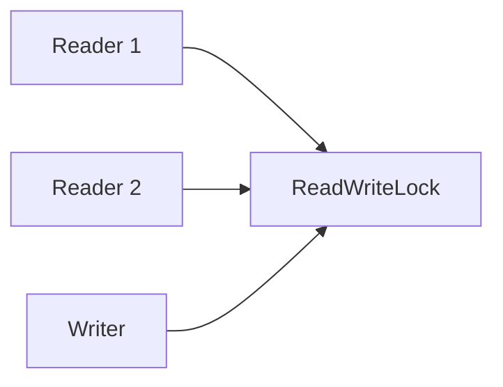

# Блокировка чтения-записи (`Read-Write Lock`)

**Read-Write Lock** позволяет множеству потоков одновременно читать ресурс, но обеспечивает эксклюзивный доступ для записи.

**Дата последнего обновления:** 2026-02-06

## Полезные ссылки

### Официальная документация
- [Java ReadWriteLock](https://docs.oracle.com/javase/8/docs/api/java/util/concurrent/locks/ReadWriteLock.html)
- [Java ReentrantReadWriteLock](https://docs.oracle.com/javase/8/docs/api/java/util/concurrent/locks/ReentrantReadWriteLock.html)

### См. также
- [Java Concurrency](../../languages/java/java-concurrency-basics.md) — **Java Concurrency**
- [CQRS / DDD](../../architecture/enterprise-patterns/README.md) — **CQRS** и **DDD**

## Содержание

- [Суть и запомнить](#суть-и-запомнить)
- [Что такое Read-Write Lock?](#что-такое-read-write-lock)
  - [Основные характеристики](#основные-характеристики)
  - [Сравнение с обычными блокировками](#сравнение-с-обычными-locks)
- [Когда использовать Read-Write Lock?](#когда-использовать-read-write-lock)
  - [Подходящие сценарии](#подходящие-сценарии)
  - [Признаки необходимости](#признаки-необходимости)
- [Структура паттерна](#структура-паттерна)
  - [Компоненты](#компоненты)
- [Реализация на Java](#реализация-на-java)
  - [Базовая реализация](#базовая-реализация)
  - [Конфигурация ReadWriteLock](#конфигурация-readwritelock)
- [Продвинутые реализации](#продвинутые-реализации)
  - [1. StampedLock (Java 8+)](#1-stampedlock-java-8)
  - [2. Upgradable Read Lock](#2-upgradable-read-lock)
  - [3. Hierarchical Read-Write Locks](#3-hierarchical-read-write-locks)
- [Примеры использования](#примеры-использования)
  - [1. In-Memory Database Cache](#1-in-memory-database-cache)
  - [2. Configuration Manager](#2-configuration-manager)
  - [3. Shared Data Structure](#3-shared-data-structure)
- [Лучшие практики](#лучшие-практики)
  - [1. Выбор между ReadWriteLock и StampedLock](#1-выбор-между-readwritelock-и-stampedlock)
  - [2. Избегание распространенных ошибок](#2-избегание-распространенных-ошибок)
  - [3. Тестирование](#3-тестирование)
- [Решение проблем](#решение-проблем)
- [Частые вопросы](#частые-вопросы)
- [Заключение](#заключение)

## Суть и запомнить

**Суть в одном предложении:** Несколько потоков могут одновременно держать «чтение»; запись — эксклюзивно; выше пропускная способность при частом чтении.

**Запомнить:**
- readLock() — совместный доступ для чтения; writeLock() — эксклюзивный для записи.
- В Java: ReadWriteLock, ReentrantReadWriteLock; для оптимизации — StampedLock.
- Подходит когда чтений много, записей мало.

**Когда применять:** кэш, конфигурация, разделяемые структуры данных с преобладанием чтения.

## Что такое **Read-Write Lock**?

**Read-Write Lock** — это механизм синхронизации, который позволяет множеству потоков одновременно читать разделяемый ресурс, но обеспечивает эксклюзивный доступ для операций записи.

### Основные характеристики

1. **Множественное чтение**: Несколько **readers** могут читать одновременно
2. **Эксклюзивная запись**: Только один **writer** может писать, и никто не может читать во время записи
3. **Приоритет**: Можно настроить приоритет **writers** над **readers**
4. **Производительность**: Лучше обычных **locks** для **read-heavy** сценариев

### Сравнение с обычными **locks**

Сравнение обычного **synchronized** и **Read-Write Lock** для **read-heavy** сценариев(Java).

```java
// Обычный synchronized - только один поток одновременно
public synchronized void readAndWrite() {
    // Только один поток может выполнять это одновременно
}

// Read-Write Lock - множественное чтение, эксклюзивная запись
ReadWriteLock lock = new ReentrantReadWriteLock();

public void readOperation() {
    lock.readLock().lock();
    try {
        // Множество readers одновременно
        readData();
    } finally {
        lock.readLock().unlock();
    }
}

public void writeOperation() {
    lock.writeLock().lock();
    try {
        // Только один writer, блокирует всех readers
        writeData();
    } finally {
        lock.writeLock().unlock();
    }
}
```

## Когда использовать **Read-Write Lock**?

### Подходящие сценарии

- **Кэши**: Частое чтение, редкая запись
- **Конфигурации**: Чтение настроек приложением
- **Базы данных**: **In-memory** кэши с обновлениями
- **Файловые системы**: Чтение файлов с периодическими обновлениями

### Признаки необходимости

```java
// Плохо: synchronized для read-heavy операций
public class SynchronizedCache {
    private final Map<String, Object> cache = new HashMap<>();

    public synchronized Object get(String key) {
        return cache.get(key); // Блокирует все другие операции
    }

    public synchronized void put(String key, Object value) {
        cache.put(key, value); // Блокирует все чтение
    }
}

// Хорошо: Read-Write Lock для read-heavy операций
public class ReadWriteCache {
    private final Map<String, Object> cache = new HashMap<>();
    private final ReadWriteLock lock = new ReentrantReadWriteLock();

    public Object get(String key) {
        lock.readLock().lock();
        try {
            return cache.get(key); // Множественное чтение одновременно
        } finally {
            lock.readLock().unlock();
        }
    }

    public void put(String key, Object value) {
        lock.writeLock().lock();
        try {
            cache.put(key, value); // Эксклюзивная запись
        } finally {
            lock.writeLock().unlock();
        }
    }
}
```

## Структура паттерна



```text
┌─────────────────────────────────────────────────────────────┐
│                    Shared Resource                          │
│                                                             │
│  ┌─────────────────────────────────────────────────────┐    │
│  │                Read-Write Lock                      │    │
│  │                                                     │    │
│  │  ┌─────────────────┐  ┌─────────────────┐          │    │
│  │  │   Read Lock     │  │  Write Lock     │          │    │
│  │  │                 │  │                 │          │    │
│  │  │ Multiple readers│  │ Single writer   │          │    │
│  │  │ allowed         │  │ blocks all      │          │    │
│  │  │ simultaneously  │  │ readers/writers │          │    │
│  │  └─────────────────┘  └─────────────────┘          │    │
│  └─────────────────────────────────────────────────────┘    │
│                                                             │
│  Readers: Thread 1, Thread 2, Thread 3 (concurrent)        │
│  Writers: Thread 4 (exclusive)                              │
└─────────────────────────────────────────────────────────────┘
```

### Компоненты

1. **Read Lock**: Позволяет множественное чтение
2. **Write Lock**: Обеспечивает эксклюзивный доступ для записи
3. **Shared Resource**: Защищаемый ресурс
4. **Lock Manager**: Управляет блокировками(встроено в ReadWriteLock)

## Реализация на Java

### Базовая реализация

```java
import java.util.concurrent.locks.ReadWriteLock;
import java.util.concurrent.locks.ReentrantReadWriteLock;
import java.util.Map;
import java.util.HashMap;
import java.util.concurrent.ConcurrentHashMap;

// Thread-safe cache с Read-Write Lock
public class ReadWriteCache<K, V> {
    private final Map<K, V> cache = new HashMap<>();
    private final ReadWriteLock lock = new ReentrantReadWriteLock();

    public V get(K key) {
        lock.readLock().lock();
        try {
            return cache.get(key);
        } finally {
            lock.readLock().unlock();
        }
    }

    public void put(K key, V value) {
        lock.writeLock().lock();
        try {
            cache.put(key, value);
        } finally {
            lock.writeLock().unlock();
        }
    }

    public boolean containsKey(K key) {
        lock.readLock().lock();
        try {
            return cache.containsKey(key);
        } finally {
            lock.readLock().unlock();
        }
    }

    public V getOrCompute(K key, java.util.function.Function<K, V> computeFunction) {
        // Сначала пробуем прочитать
        lock.readLock().lock();
        try {
            V value = cache.get(key);
            if (value != null) {
                return value;
            }
        } finally {
            lock.readLock().unlock();
        }

        // Если не нашли, вычисляем с write lock
        lock.writeLock().lock();
        try {
            // Double-check после получения write lock
            V value = cache.get(key);
            if (value == null) {
                value = computeFunction.apply(key);
                cache.put(key, value);
            }
            return value;
        } finally {
            lock.writeLock().unlock();
        }
    }

    public int size() {
        lock.readLock().lock();
        try {
            return cache.size();
        } finally {
            lock.readLock().unlock();
        }
    }

    public void clear() {
        lock.writeLock().lock();
        try {
            cache.clear();
        } finally {
            lock.writeLock().unlock();
        }
    }
}

// Пример использования
public class CacheExample {
    public static void main(String[] args) {
        ReadWriteCache<String, String> cache = new ReadWriteCache<>();

        // Множественные readers
        Runnable reader = () -> {
            for (int i = 0; i < 10; i++) {
                String value = cache.get("key" + (i % 3));
                System.out.println(Thread.currentThread().getName() + " read: " + value);
                try {
                    Thread.sleep(10);
                } catch (InterruptedException e) {
                    Thread.currentThread().interrupt();
                }
            }
        };

        // Один writer
        Runnable writer = () -> {
            for (int i = 0; i < 3; i++) {
                cache.put("key" + i, "value" + i + "-" + System.currentTimeMillis());
                System.out.println(Thread.currentThread().getName() + " wrote key" + i);
                try {
                    Thread.sleep(50);
                } catch (InterruptedException e) {
                    Thread.currentThread().interrupt();
                }
            }
        };

        // Запуск потоков
        Thread writerThread = new Thread(writer, "Writer");
        Thread[] readerThreads = new Thread[5];

        for (int i = 0; i < readerThreads.length; i++) {
            readerThreads[i] = new Thread(reader, "Reader-" + i);
        }

        writerThread.start();
        for (Thread t : readerThreads) {
            t.start();
        }

        // Ожидание завершения
        try {
            writerThread.join();
            for (Thread t : readerThreads) {
                t.join();
            }
        } catch (InterruptedException e) {
            Thread.currentThread().interrupt();
        }
    }
}
```

### Конфигурация **ReadWriteLock**

```java
public class ConfigurableReadWriteLock {

    // Fair ReadWriteLock - FIFO порядок
    public static ReadWriteLock createFairLock() {
        return new ReentrantReadWriteLock(true); // fair = true
    }

    // Non-fair ReadWriteLock - лучше производительность
    public static ReadWriteLock createNonFairLock() {
        return new ReentrantReadWriteLock(false); // fair = false (default)
    }

    // ReadWriteLock с таймаутами
    public static class TimeoutReadWriteLock {
        private final ReadWriteLock lock = new ReentrantReadWriteLock();

        public boolean tryReadLock(long timeout, TimeUnit unit) throws InterruptedException {
            return lock.readLock().tryLock(timeout, unit);
        }

        public boolean tryWriteLock(long timeout, TimeUnit unit) throws InterruptedException {
            return lock.writeLock().tryLock(timeout, unit);
        }

        public void unlockRead() {
            lock.readLock().unlock();
        }

        public void unlockWrite() {
            lock.writeLock().unlock();
        }
    }

    // Статистика использования
    public static class MonitoredReadWriteLock {
        private final ReadWriteLock lock = new ReentrantReadWriteLock();
        private final AtomicLong readCount = new AtomicLong(0);
        private final AtomicLong writeCount = new AtomicLong(0);
        private final AtomicLong readWaitCount = new AtomicLong(0);
        private final AtomicLong writeWaitCount = new AtomicLong(0);

        public void readLock() {
            readWaitCount.incrementAndGet();
            lock.readLock().lock();
            readCount.incrementAndGet();
            readWaitCount.decrementAndGet();
        }

        public void readUnlock() {
            lock.readLock().unlock();
            readCount.decrementAndGet();
        }

        public void writeLock() {
            writeWaitCount.incrementAndGet();
            lock.writeLock().lock();
            writeCount.incrementAndGet();
            writeWaitCount.decrementAndGet();
        }

        public void writeUnlock() {
            lock.writeLock().unlock();
            writeCount.decrementAndGet();
        }

        public LockStats getStats() {
            return new LockStats(
                readCount.get(),
                writeCount.get(),
                readWaitCount.get(),
                writeWaitCount.get()
            );
        }

        public static class LockStats {
            public final long activeReads;
            public final long activeWrites;
            public final long waitingReads;
            public final long waitingWrites;

            public LockStats(long activeReads, long activeWrites, long waitingReads, long waitingWrites) {
                this.activeReads = activeReads;
                this.activeWrites = activeWrites;
                this.waitingReads = waitingReads;
                this.waitingWrites = waitingWrites;
            }
        }
    }
}
```

## Продвинутые реализации

### 1. StampedLock (Java 8+)

```java
import java.util.concurrent.locks.StampedLock;

// StampedLock - оптимизированная версия ReadWriteLock
public class StampedLockCache<K, V> {
    private final Map<K, V> cache = new HashMap<>();
    private final StampedLock lock = new StampedLock();

    public V get(K key) {
        long stamp = lock.tryOptimisticRead(); // Оптимистичное чтение

        V value = cache.get(key);

        if (!lock.validate(stamp)) { // Проверка валидности
            // Оптимистичное чтение не удалось, используем read lock
            stamp = lock.readLock();
            try {
                value = cache.get(key);
            } finally {
                lock.unlockRead(stamp);
            }
        }

        return value;
    }

    public void put(K key, V value) {
        long stamp = lock.writeLock();
        try {
            cache.put(key, value);
        } finally {
            lock.unlockWrite(stamp);
        }
    }

    // Условная запись с оптимистичным чтением
    public boolean putIfAbsent(K key, V value) {
        long stamp = lock.tryOptimisticRead();
        V currentValue = cache.get(key);

        if (!lock.validate(stamp)) {
            // Повторная попытка с read lock
            stamp = lock.readLock();
            try {
                currentValue = cache.get(key);
            } finally {
                lock.unlockRead(stamp);
            }
        }

        if (currentValue == null) {
            // Запись если значение отсутствует
            long writeStamp = lock.tryConvertToWriteLock(stamp);
            if (writeStamp != 0) { // Успешная конвертация
                stamp = writeStamp;
                cache.put(key, value);
                lock.unlockWrite(stamp);
                return true;
            } else {
                // Конвертация не удалась, получаем write lock обычным способом
                lock.unlockRead(stamp);
                stamp = lock.writeLock();
                try {
                    if (!cache.containsKey(key)) {
                        cache.put(key, value);
                        return true;
                    }
                } finally {
                    lock.unlockWrite(stamp);
                }
            }
        }

        return false;
    }

    // Read-then-write с конвертацией
    public V computeIfAbsent(K key, java.util.function.Function<K, V> computeFunction) {
        long stamp = lock.tryOptimisticRead();
        V value = cache.get(key);

        if (!lock.validate(stamp)) {
            stamp = lock.readLock();
            try {
                value = cache.get(key);
            } finally {
                lock.unlockRead(stamp);
            }
        }

        if (value == null) {
            long writeStamp = lock.tryConvertToWriteLock(stamp);
            if (writeStamp != 0) {
                stamp = writeStamp;
                value = computeFunction.apply(key);
                cache.put(key, value);
                lock.unlockWrite(stamp);
            } else {
                if (StampedLock.isReadLockStamp(stamp)) {
                    lock.unlockRead(stamp);
                }
                stamp = lock.writeLock();
                try {
                    value = cache.computeIfAbsent(key, computeFunction);
                } finally {
                    lock.unlockWrite(stamp);
                }
            }
        }

        return value;
    }
}
```

### 2. **Upgradable Read Lock**

```java
// ReadWriteLock с возможностью апгрейда read -> write
public class UpgradableReadWriteLock {
    private final ReadWriteLock lock = new ReentrantReadWriteLock();
    private final Lock upgradeLock = new ReentrantLock();

    // Специальный класс для апгрейда
    public static class UpgradableReadLock implements AutoCloseable {
        private final UpgradableReadWriteLock parent;
        private boolean upgraded = false;

        private UpgradableReadLock(UpgradableReadWriteLock parent) {
            this.parent = parent;
        }

        public void upgradeToWrite() {
            if (!upgraded) {
                parent.upgradeLock.lock(); // Блокируем апгрейды
                try {
                    parent.lock.readLock().unlock(); // Снимаем read lock
                    parent.lock.writeLock().lock();  // Получаем write lock
                    upgraded = true;
                } catch (Exception e) {
                    // В случае ошибки возвращаем read lock
                    parent.lock.readLock().lock();
                    throw e;
                } finally {
                    parent.upgradeLock.unlock();
                }
            }
        }

        @Override
        public void close() {
            if (upgraded) {
                parent.lock.writeLock().unlock();
            } else {
                parent.lock.readLock().unlock();
            }
        }
    }

    public UpgradableReadLock readLock() {
        lock.readLock().lock();
        return new UpgradableReadLock(this);
    }

    public void writeLock() {
        lock.writeLock().lock();
    }

    public void writeUnlock() {
        lock.writeLock().unlock();
    }
}

// Пример использования апгрейда
public class UpgradableCache<K, V> {
    private final Map<K, V> cache = new HashMap<>();
    private final UpgradableReadWriteLock lock = new UpgradableReadWriteLock();

    public V getOrCompute(K key, java.util.function.Function<K, V> computeFunction) {
        try (UpgradableReadWriteLock.UpgradableReadLock readLock = lock.readLock()) {
            V value = cache.get(key);
            if (value != null) {
                return value;
            }

            // Апгрейд к write lock
            readLock.upgradeToWrite();

            // Double-check после апгрейда
            value = cache.get(key);
            if (value == null) {
                value = computeFunction.apply(key);
                cache.put(key, value);
            }

            return value;
        }
    }
}
```

### 3. **Hierarchical Read-Write Locks**

```java
// Иерархические блокировки для древовидных структур
public class HierarchicalReadWriteLock {

    // Узел иерархии
    public static class Node {
        private final ReadWriteLock lock = new ReentrantReadWriteLock();
        private final List<Node> children = new ArrayList<>();
        private final Node parent;

        public Node(Node parent) {
            this.parent = parent;
        }

        public void addChild(Node child) {
            children.add(child);
        }

        // Read lock для всего поддерева
        public void readLockSubtree() {
            if (parent != null) {
                parent.readLockSubtree();
            }
            lock.readLock().lock();
        }

        public void readUnlockSubtree() {
            lock.readLock().unlock();
            if (parent != null) {
                parent.readUnlockSubtree();
            }
        }

        // Write lock для всего поддерева (более строгая)
        public void writeLockSubtree() {
            if (parent != null) {
                parent.writeLockSubtree();
            }
            lock.writeLock().lock();
        }

        public void writeUnlockSubtree() {
            lock.writeLock().unlock();
            if (parent != null) {
                parent.writeUnlockSubtree();
            }
        }

        // Локальные операции
        public void readLock() {
            lock.readLock().lock();
        }

        public void readUnlock() {
            lock.readLock().unlock();
        }

        public void writeLock() {
            lock.writeLock().lock();
        }

        public void writeUnlock() {
            lock.writeLock().unlock();
        }
    }

    // Пример: файловая система
    public static class FileSystemNode extends Node {
        private final String name;
        private String content;

        public FileSystemNode(String name, Node parent) {
            super(parent);
            this.name = name;
        }

        public String getName() {
            readLock();
            try {
                return name;
            } finally {
                readUnlock();
            }
        }

        public String getContent() {
            readLock();
            try {
                return content;
            } finally {
                readUnlock();
            }
        }

        public void setContent(String content) {
            writeLock();
            try {
                this.content = content;
            } finally {
                writeUnlock();
            }
        }

        // Операция над всем поддеревом
        public void renameSubtree(String newPrefix) {
            writeLockSubtree();
            try {
                renameRecursive(this, newPrefix);
            } finally {
                writeUnlockSubtree();
            }
        }

        private void renameRecursive(FileSystemNode node, String prefix) {
            // Переименование узла
            String newName = prefix + node.name;
            node.name = newName;

            // Рекурсивное переименование детей
            for (Node child : node.children) {
                if (child instanceof FileSystemNode) {
                    renameRecursive((FileSystemNode) child, prefix);
                }
            }
        }
    }
}
```

## Примеры использования

### 1. **In-Memory Database Cache**

```java
@Service
public class DatabaseCache {

    private final Map<String, CachedData> cache = new ConcurrentHashMap<>();
    private final ReadWriteLock lock = new ReentrantReadWriteLock();
    private final ScheduledExecutorService cleaner = Executors.newScheduledThreadPool(1);

    public DatabaseCache() {
        // Очистка устаревших данных каждые 5 минут
        cleaner.scheduleAtFixedRate(this::cleanupExpired, 5, 5, TimeUnit.MINUTES);
    }

    public CachedData get(String key) {
        lock.readLock().lock();
        try {
            CachedData data = cache.get(key);
            if (data != null && !data.isExpired()) {
                return data;
            }
            return null;
        } finally {
            lock.readLock().unlock();
        }
    }

    public void put(String key, Object value, long ttlMillis) {
        lock.writeLock().lock();
        try {
            CachedData data = new CachedData(value, System.currentTimeMillis() + ttlMillis);
            cache.put(key, data);
        } finally {
            lock.writeLock().unlock();
        }
    }

    public void invalidate(String key) {
        lock.writeLock().lock();
        try {
            cache.remove(key);
        } finally {
            lock.writeLock().unlock();
        }
    }

    public void invalidateAll() {
        lock.writeLock().lock();
        try {
            cache.clear();
        } finally {
            lock.writeLock().unlock();
        }
    }

    private void cleanupExpired() {
        lock.writeLock().lock();
        try {
            cache.entrySet().removeIf(entry -> entry.getValue().isExpired());
        } finally {
            lock.writeLock().unlock();
        }
    }

    @PreDestroy
    public void shutdown() {
        cleaner.shutdown();
    }

    private static class CachedData {
        private final Object data;
        private final long expiryTime;

        public CachedData(Object data, long expiryTime) {
            this.data = data;
            this.expiryTime = expiryTime;
        }

        public Object getData() { return data; }
        public boolean isExpired() { return System.currentTimeMillis() > expiryTime; }
    }
}
```

### 2. **Configuration Manager**

```java
@Service
@Scope("singleton")
public class ConfigurationManager {

    private volatile Properties configuration = new Properties();
    private final ReadWriteLock lock = new ReentrantReadWriteLock();
    private final Path configPath;

    public ConfigurationManager(@Value("${config.file.path}") String configPath) {
        this.configPath = Paths.get(configPath);
        loadConfiguration();
    }

    public String getProperty(String key) {
        lock.readLock().lock();
        try {
            return configuration.getProperty(key);
        } finally {
            lock.readLock().unlock();
        }
    }

    public String getProperty(String key, String defaultValue) {
        String value = getProperty(key);
        return value != null ? value : defaultValue;
    }

    public void setProperty(String key, String value) {
        lock.writeLock().lock();
        try {
            configuration.setProperty(key, value);
            saveConfiguration();
        } finally {
            lock.writeLock().unlock();
        }
    }

    public void setProperties(Map<String, String> properties) {
        lock.writeLock().lock();
        try {
            properties.forEach(configuration::setProperty);
            saveConfiguration();
        } finally {
            lock.writeLock().unlock();
        }
    }

    public Set<String> getPropertyNames() {
        lock.readLock().lock();
        try {
            return new HashSet<>(configuration.stringPropertyNames());
        } finally {
            lock.readLock().unlock();
        }
    }

    public Properties getAllProperties() {
        lock.readLock().lock();
        try {
            Properties copy = new Properties();
            copy.putAll(configuration);
            return copy;
        } finally {
            lock.readLock().unlock();
        }
    }

    private void loadConfiguration() {
        lock.writeLock().lock();
        try {
            Properties props = new Properties();
            if (Files.exists(configPath)) {
                try (InputStream in = Files.newInputStream(configPath)) {
                    props.load(in);
                }
            }
            configuration = props;
        } catch (IOException e) {
            throw new RuntimeException("Failed to load configuration", e);
        } finally {
            lock.writeLock().unlock();
        }
    }

    private void saveConfiguration() {
        try (OutputStream out = Files.newOutputStream(configPath)) {
            configuration.store(out, "Auto-generated configuration");
        } catch (IOException e) {
            throw new RuntimeException("Failed to save configuration", e);
        }
    }

    // Hot reload configuration
    @Scheduled(fixedRate = 30000) // каждые 30 секунд
    public void reloadIfModified() {
        try {
            long lastModified = Files.getLastModifiedTime(configPath).toMillis();
            lock.readLock().lock();
            try {
                // Проверяем нужно ли перезагрузка
                if (lastModified > configurationLastModified) {
                    // Перезагрузка нужна, получаем write lock
                    lock.readLock().unlock();
                    lock.writeLock().lock();
                    try {
                        // Double-check
                        if (lastModified > configurationLastModified) {
                            loadConfiguration();
                            configurationLastModified = lastModified;
                        }
                    } finally {
                        lock.readLock().lock(); // Возвращаем read lock
                    }
                }
            } finally {
                lock.readLock().unlock();
            }
        } catch (IOException e) {
            // Log error but don't fail
        }
    }

    private volatile long configurationLastModified = 0;
}
```

### 3. **Shared Data Structure**

```java
// Thread-safe список с Read-Write Lock
public class ConcurrentList<T> {
    private final List<T> list = new ArrayList<>();
    private final ReadWriteLock lock = new ReentrantReadWriteLock();

    public void add(T element) {
        lock.writeLock().lock();
        try {
            list.add(element);
        } finally {
            lock.writeLock().unlock();
        }
    }

    public void add(int index, T element) {
        lock.writeLock().lock();
        try {
            list.add(index, element);
        } finally {
            lock.writeLock().unlock();
        }
    }

    public T get(int index) {
        lock.readLock().lock();
        try {
            return list.get(index);
        } finally {
            lock.readLock().unlock();
        }
    }

    public int size() {
        lock.readLock().lock();
        try {
            return list.size();
        } finally {
            lock.readLock().unlock();
        }
    }

    public boolean contains(T element) {
        lock.readLock().lock();
        try {
            return list.contains(element);
        } finally {
            lock.readLock().unlock();
        }
    }

    public boolean remove(T element) {
        lock.writeLock().lock();
        try {
            return list.remove(element);
        } finally {
            lock.writeLock().unlock();
        }
    }

    public T remove(int index) {
        lock.writeLock().lock();
        try {
            return list.remove(index);
        } finally {
            lock.writeLock().unlock();
        }
    }

    public List<T> toList() {
        lock.readLock().lock();
        try {
            return new ArrayList<>(list);
        } finally {
            lock.readLock().unlock();
        }
    }

    // Batch operations
    public boolean addAll(Collection<? extends T> collection) {
        lock.writeLock().lock();
        try {
            return list.addAll(collection);
        } finally {
            lock.writeLock().unlock();
        }
    }

    public void clear() {
        lock.writeLock().lock();
        try {
            list.clear();
        } finally {
            lock.writeLock().unlock();
        }
    }

    // Iterator с read lock
    public Iterator<T> iterator() {
        lock.readLock().lock();
        try {
            List<T> snapshot = new ArrayList<>(list);
            return new ReadLockedIterator(snapshot.iterator());
        } finally {
            lock.readLock().unlock();
        }
    }

    private class ReadLockedIterator implements Iterator<T> {
        private final Iterator<T> iterator;

        public ReadLockedIterator(Iterator<T> iterator) {
            this.iterator = iterator;
        }

        @Override
        public boolean hasNext() {
            return iterator.hasNext();
        }

        @Override
        public T next() {
            return iterator.next();
        }
    }
}
```

## Лучшие практики

### 1. Выбор между **ReadWriteLock** и **StampedLock**

```java
public class LockSelector {

    // Используйте ReadWriteLock когда:
    // - Простая логика блокировки
    // - Не требуется оптимистичное чтение
    // - Важна совместимость с другими lock API
    public static ReadWriteLock createReadWriteLock(boolean fair) {
        return new ReentrantReadWriteLock(fair);
    }

    // Используйте StampedLock когда:
    // - Высокая конкуренция на чтение
    // - Возможны optimistic reads
    // - Требуется конвертация lock типов
    // - Производительность критична
    public static StampedLock createStampedLock() {
        return new StampedLock();
    }

    // Когда использовать каждый тип
    public static class UsageGuidelines {

        // ReadWriteLock подходит для:
        // - Кэши с умеренной конкуренцией
        // - Конфигурационные данные
        // - Простые CRUD операции

        // StampedLock подходит для:
        // - Высокопроизводительные кэши
        // - Финансовые расчеты (read-heavy)
        // - Координатные системы
        // - Сложные алгоритмы с множеством reads
    }
}
```

### 2. Избегание распространенных ошибок

```java
public class ReadWriteLockPitfalls {

    // Проблема: Read lock во время записи
    public class IncorrectUsage {
        private final ReadWriteLock lock = new ReentrantReadWriteLock();
        private int counter = 0;

        // ПЛОХО: Чтение без блокировки
        public int getCounter() {
            return counter; // Race condition!
        }

        // ПЛОХО: Запись с read lock
        public void increment() {
            lock.readLock().lock(); // Неправильный тип блокировки!
            try {
                counter++;
            } finally {
                lock.readLock().unlock();
            }
        }
    }

    // Решение: Правильное использование
    public class CorrectUsage {
        private final ReadWriteLock lock = new ReentrantReadWriteLock();
        private int counter = 0;

        public int getCounter() {
            lock.readLock().lock();
            try {
                return counter;
            } finally {
                lock.readLock().unlock();
            }
        }

        public void increment() {
            lock.writeLock().lock();
            try {
                counter++;
            } finally {
                lock.writeLock().unlock();
            }
        }

        // Read-then-write паттерн
        public void incrementIfPositive() {
            lock.readLock().lock();
            try {
                if (counter > 0) {
                    // Апгрейд к write lock
                    lock.readLock().unlock();
                    lock.writeLock().lock();
                    try {
                        if (counter > 0) { // Double-check
                            counter++;
                        }
                    } finally {
                        lock.readLock().lock(); // Возврат к read lock
                    }
                }
            } finally {
                lock.readLock().unlock();
            }
        }
    }

    // Проблема: Deadlock с nested locks
    public class NestedLockProblem {
        private final ReadWriteLock lock1 = new ReentrantReadWriteLock();
        private final ReadWriteLock lock2 = new ReentrantReadWriteLock();

        // ПЛОХО: Может вызвать deadlock
        public void transfer(ReadWriteLock from, ReadWriteLock to) {
            from.writeLock().lock();
            try {
                to.writeLock().lock(); // Может ждать, но from уже захвачен
                try {
                    // Transfer logic
                } finally {
                    to.writeLock().unlock();
                }
            } finally {
                from.writeLock().unlock();
            }
        }

        // РЕШЕНИЕ: Определенный порядок захвата
        public void safeTransfer(ReadWriteLock first, ReadWriteLock second) {
            ReadWriteLock lockA = first.hashCode() < second.hashCode() ? first : second;
            ReadWriteLock lockB = first.hashCode() < second.hashCode() ? second : first;

            lockA.writeLock().lock();
            try {
                lockB.writeLock().lock();
                try {
                    // Transfer logic
                } finally {
                    lockB.writeLock().unlock();
                }
            } finally {
                lockA.writeLock().unlock();
            }
        }
    }
}
```

### 3. Тестирование

```java
@ExtendWith(MockitoExtension.class)
public class ReadWriteLockTest {

    @Test
    void shouldAllowMultipleReaders() throws InterruptedException {
        ReadWriteCache<String, String> cache = new ReadWriteCache<>();
        cache.put("key", "value");

        AtomicInteger successfulReads = new AtomicInteger(0);
        Runnable reader = () -> {
            String value = cache.get("key");
            if ("value".equals(value)) {
                successfulReads.incrementAndGet();
            }
        };

        // Запуск множественных readers
        Thread[] readers = new Thread[10];
        for (int i = 0; i < readers.length; i++) {
            readers[i] = new Thread(reader);
            readers[i].start();
        }

        for (Thread reader : readers) {
            reader.join();
        }

        assertEquals(10, successfulReads.get());
    }

    @Test
    void shouldBlockWritesDuringReads() throws InterruptedException {
        ReadWriteCache<String, String> cache = new ReadWriteCache<>();
        cache.put("key", "initial");

        CountDownLatch readStarted = new CountDownLatch(1);
        CountDownLatch readFinished = new CountDownLatch(1);

        // Reader thread
        Thread reader = new Thread(() -> {
            try {
                readStarted.countDown();
                String value = cache.get("key"); // Захватывает read lock
                Thread.sleep(1000); // Держит lock 1 секунду
                readFinished.countDown();
            } catch (InterruptedException e) {
                Thread.currentThread().interrupt();
            }
        });

        // Writer thread
        AtomicBoolean writeBlocked = new AtomicBoolean(false);
        Thread writer = new Thread(() -> {
            try {
                readStarted.await(); // Ждем начала чтения
                long startTime = System.currentTimeMillis();
                cache.put("key", "updated"); // Должен ждать read lock
                long duration = System.currentTimeMillis() - startTime;
                writeBlocked.set(duration >= 900); // Проверка что writer ждал
            } catch (InterruptedException e) {
                Thread.currentThread().interrupt();
            }
        });

        reader.start();
        writer.start();

        reader.join();
        writer.join();

        assertTrue(writeBlocked.get(), "Write should have been blocked by read");
        assertEquals("updated", cache.get("key"));
    }

    @Test
    void shouldAllowConcurrentReadsAndExclusiveWrites() throws InterruptedException {
        ReadWriteCache<String, String> cache = new ReadWriteCache<>();

        AtomicInteger readCount = new AtomicInteger(0);
        AtomicBoolean writeInProgress = new AtomicBoolean(false);

        Runnable reader = () -> {
            String value = cache.get("key");
            readCount.incrementAndGet();
        };

        Runnable writer = () -> {
            writeInProgress.set(true);
            cache.put("key", "value-" + Thread.currentThread().getId());
            writeInProgress.set(false);
        };

        // Запуск readers и writers
        Thread[] threads = new Thread[20];
        for (int i = 0; i < 10; i++) {
            threads[i] = new Thread(reader);
            threads[i + 10] = new Thread(writer);
        }

        for (Thread thread : threads) {
            thread.start();
        }

        for (Thread thread : threads) {
            thread.join();
        }

        assertTrue(readCount.get() > 0, "Reads should have occurred");
        assertFalse(writeInProgress.get(), "No write should be in progress at end");
    }
}
```


## Решение проблем

| Симптом | Возможная причина | Что делать |
|--------|-------------------|------------|
| Голодание писателей | Много читателей, readers не отпускают | Использовать fair lock; StampedLock для оптимистичного чтения |
| Deadlock | Вложенные блокировки | Всегда брать блокировки в одном порядке; не держать readLock при попытке writeLock |
| Низкая производительность при записи | Записей много | ReadWriteLock выгоден при read-heavy; при write-heavy — обычный lock |

## Частые вопросы

**ReadWriteLock vs StampedLock?** StampedLock быстрее при оптимистичном чтении; поддерживает tryConvertToWriteLock. ReadWriteLock проще. Выбирайте StampedLock для высокой contention.

**Когда использовать?** Кэш, конфигурация, разделяемые структуры с преобладанием чтения.


## Заключение

**Read-Write Lock** — мощный инструмент для оптимизации многопоточных приложений с преимущественно **read-only** операциями. Он позволяет добиться значительного улучшения производительности по сравнению с обычными **mutex**-ами.

**Ключевые преимущества:**
- **Повышенная производительность**: Множественное чтение одновременно
- **Потокобезопасность**: Гарантированная консистентность данных
- **Гибкость**: Разные стратегии **fairness** и приоритетов
- **Простота использования**: Четкий API в Java

**Используйте Read-Write Lock, когда:**
- У вас много чтения и мало записи
- Производительность критична
- Данные должны быть консистентными
- Несколько потоков читают одни и те же данные

**Не используйте когда:**
- Все операции — это запись
- Логика очень простая(лучше обычный synchronized)
- Требуется сложная логика блокировки(StampedLock)
- Важна совместимость с **legacy** кодом
