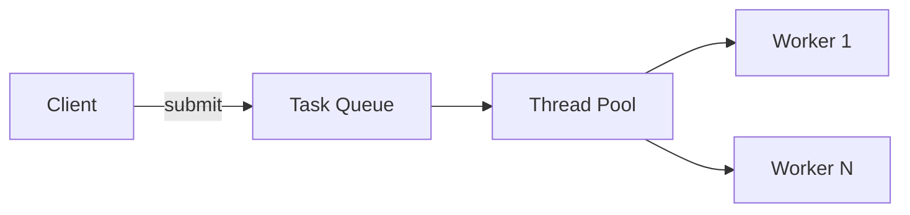

# Пул потоков (`Thread Pool`)

**Thread Pool** — это паттерн управления потоками, который поддерживает пул переиспользуемых потоков для выполнения задач, избегая накладных расходов на создание и уничтожение потоков.

**Дата последнего обновления:** 2026-02-06

## Полезные ссылки

### Официальная документация
- [Java ExecutorService](https://docs.oracle.com/javase/8/docs/api/java/util/concurrent/ExecutorService.html)
- [Java ThreadPoolExecutor](https://docs.oracle.com/javase/8/docs/api/java/util/concurrent/ThreadPoolExecutor.html)
- [Java Executors](https://docs.oracle.com/javase/8/docs/api/java/util/concurrent/Executors.html)

### См. также
- [Java Concurrency](../../languages/java/java-concurrency-basics.md) — **Java Concurrency**
- [Producer-Consumer](producer-consumer.md) — **Producer-Consumer Pattern**
- [Пул потоков и Executors](../../languages/java/java-concurrency-basics.md) — в **Java Concurrency**

## Содержание

- [Суть и запомнить](#суть-и-запомнить)
- [Что такое Thread Pool?](#что-такое-thread-pool)
  - [Основные характеристики](#основные-характеристики)
  - [Сравнение с обычными потоками](#сравнение-с-обычными-потоками)
- [Когда использовать Thread Pool?](#когда-использовать-thread-pool)
  - [Подходящие сценарии](#подходящие-сценарии)
  - [Признаки необходимости](#признаки-необходимости)
- [Структура паттерна](#структура-паттерна)
  - [Компоненты](#компоненты)
- [Реализация на Java](#реализация-на-java)
  - [Базовый Thread Pool](#базовый-thread-pool)
  - [Использование ExecutorService](#использование-executorservice)
  - [Кастомный ThreadPoolExecutor](#кастомный-threadpoolexecutor)
- [Продвинутые реализации](#продвинутые-реализации)
  - [1. Work Stealing Pool](#1-work-stealing-pool)
  - [2. Priority Thread Pool](#2-priority-thread-pool)
  - [3. Adaptive Thread Pool](#3-adaptive-thread-pool)
- [Примеры использования](#примеры-использования)
  - [1. Web Server Request Processing](#1-web-server-request-processing)
  - [2. Batch File Processor](#2-batch-file-processor)
  - [3. Image Processing Pipeline](#3-image-processing-pipeline)
- [Лучшие практики](#лучшие-практики)
  - [1. Выбор размера пула](#1-выбор-размера-пула)
  - [2. Обработка исключений](#2-обработка-исключений)
  - [3. Мониторинг и метрики](#3-мониторинг-и-метрики)
- [Решение проблем](#решение-проблем)
- [Частые вопросы](#частые-вопросы)
- [Заключение](#заключение)

## Суть и запомнить

**Суть в одном предложении:** Фиксированное или ограниченное число потоков выполняют задачи из очереди; потоки переиспользуются, создание/уничтожение минимизированы.

**Запомнить:**
- ExecutorService = пул + очередь задач; submit()/execute() добавляют задачу.
- Размер пула: CPU-bound — по числу ядер; I/O-bound — больше.
- В Java: Executors.newFixedThreadPool, ThreadPoolExecutor.

**Когда применять:** серверные запросы, пакетная обработка, параллельные вычисления.

## Что такое **Thread Pool**?

**Thread Pool** — это паттерн, который управляет пулом потоков для выполнения задач. Вместо создания нового потока для каждой задачи, поток берется из пула, выполняет задачу и возвращается обратно в пул для повторного использования.

### Основные характеристики

1. **Переиспользование потоков**: Потоки не создаются/уничтожаются для каждой задачи
2. **Ограничение ресурсов**: Контроль количества одновременно работающих потоков
3. **Управление нагрузкой**: Очередь задач при перегрузке
4. **Graceful Shutdown**: Корректное завершение работы

### Сравнение с обычными потоками

Сравнение создания потока на каждую задачу и использования пула потоков(Java).

```java
// Плохо: Создание потока для каждой задачи
public class BadApproach {
    public void processTask(Task task) {
        new Thread(() -> {
            task.execute();
        }).start();
    }
    // Проблемы: overhead на создание потоков, неограниченное количество потоков
}

// Хорошо: Использование пула потоков
public class GoodApproach {
    private final ExecutorService executor = Executors.newFixedThreadPool(10);

    public void processTask(Task task) {
        executor.submit(task::execute);
    }

    public void shutdown() {
        executor.shutdown();
    }
    // Преимущества: переиспользование потоков, контроль ресурсов
}
```

## Когда использовать **Thread Pool**?

### Подходящие сценарии

- **Web Servers**: Обработка **HTTP** запросов
- **Database Connections**: Пул соединений с БД
- **File Processing**: Пакетная обработка файлов
- **Background Tasks**: Асинхронные операции
- **Image Processing**: Конвертация изображений
- **Batch Processing**: Массовые операции

### Признаки необходимости

```java
// Признаки: Частое создание потоков, ограниченные ресурсы
public class ThreadPoolIndicators {

    // Много коротких задач
    public void processManySmallTasks(List<Task> tasks) {
        for (Task task : tasks) {
            // Каждое создание потока - overhead
            new Thread(task).start();
        }
    }

    // Ограниченное количество ресурсов
    public void processWithLimitedResources(List<Task> tasks) {
        // CPU, память, сетевые соединения ограничены
        ExecutorService pool = Executors.newFixedThreadPool(
            Runtime.getRuntime().availableProcessors()
        );

        for (Task task : tasks) {
            pool.submit(task);
        }
    }

    // Длительные операции
    public void processLongRunningTasks(List<Task> tasks) {
        // Пул предотвращает исчерпание ресурсов
        ExecutorService pool = Executors.newCachedThreadPool();

        for (Task task : tasks) {
            pool.submit(task);
        }
    }
}
```

## Структура паттерна



```text
┌─────────────────────────────────────────────────────────────┐
│                    Client Application                       │
│                                                             │
│  ┌─────────────────────────────────────────────────────┐    │
│  │              Task Submission                       │    │
│  │                                                     │    │
│  │  executor.submit(task) ─────────────────────────┐   │    │
│  │  executor.execute(runnable) ──────────────────┐ │   │    │
│  └─────────────────────────────────────────────────┼───┘    │
└─────────────────────────────────────────────────────┼───────┘
                                                      │
┌─────────────────────────────────────────────────────┼───────┐
│                    Thread Pool                       │       │
│                                                     │       │
│  ┌─────────────────────────────────────────────────┐│       │
│  │            Task Queue                          ││       │
│  │                                                 ││       │
│  │  ┌─────────┐  ┌─────────┐  ┌─────────┐         ││       │
│  │  │ Task A  │  │ Task B  │  │ Task C  │         ││       │
│  │  └─────────┘  └─────────┘  └─────────┘         ││       │
│  └─────────────────────────────────────────────────┘│       │
│                                                     │       │
│  ┌─────────────────────────────────────────────────┐│       │
│  │            Worker Threads                       ││       │
│  │                                                 ││       │
│  │  ┌─────────┐  ┌─────────┐  ┌─────────┐          ││       │
│  │  │Thread 1 │  │Thread 2 │  │Thread 3 │          ││       │
│  │  │Working  │  │Idle     │  │Working  │          ││       │
│  │  └─────────┘  └─────────┘  └─────────┘          ││       │
│  └─────────────────────────────────────────────────┘│       │
└─────────────────────────────────────────────────────┘
```

### Компоненты

1. **Task Queue**: Очередь задач для выполнения
2. **Worker Threads**: Потоки, выполняющие задачи
3. **Thread Pool**: Менеджер пула потоков
4. **Task**: Единица работы для выполнения
5. **Executor**: Интерфейс для отправки задач

## Реализация на Java

### Базовый **Thread Pool**

```java
import java.util.concurrent.*;
import java.util.List;
import java.util.ArrayList;

// Простая реализация Thread Pool
public class SimpleThreadPool {
    private final List<WorkerThread> workers;
    private final BlockingQueue<Runnable> taskQueue;
    private final int poolSize;
    private volatile boolean shutdown = false;

    public SimpleThreadPool(int poolSize) {
        this.poolSize = poolSize;
        this.taskQueue = new LinkedBlockingQueue<>();
        this.workers = new ArrayList<>();

        // Создаем и запускаем worker потоки
        for (int i = 0; i < poolSize; i++) {
            WorkerThread worker = new WorkerThread("Worker-" + i);
            workers.add(worker);
            worker.start();
        }
    }

    public void submit(Runnable task) {
        if (shutdown) {
            throw new IllegalStateException("Thread pool is shut down");
        }

        try {
            taskQueue.put(task);
        } catch (InterruptedException e) {
            Thread.currentThread().interrupt();
            throw new RuntimeException("Failed to submit task", e);
        }
    }

    public void shutdown() {
        shutdown = true;
        // Добавляем "poison pill" для каждого worker
        for (int i = 0; i < poolSize; i++) {
            try {
                taskQueue.put(() -> {}); // Empty task to wake up workers
            } catch (InterruptedException e) {
                Thread.currentThread().interrupt();
            }
        }
    }

    public void shutdownNow() {
        shutdown = true;
        // Прерываем все worker потоки
        for (WorkerThread worker : workers) {
            worker.interrupt();
        }
    }

    public boolean awaitTermination(long timeout, TimeUnit unit) throws InterruptedException {
        long endTime = System.nanoTime() + unit.toNanos(timeout);

        for (WorkerThread worker : workers) {
            long remainingTime = endTime - System.nanoTime();
            if (remainingTime <= 0) {
                return false;
            }
            worker.join(remainingTime / 1_000_000, (int) (remainingTime % 1_000_000));
        }

        return true;
    }

    private class WorkerThread extends Thread {
        public WorkerThread(String name) {
            super(name);
        }

        @Override
        public void run() {
            while (!shutdown || !taskQueue.isEmpty()) {
                try {
                    Runnable task = taskQueue.take();
                    task.run();
                } catch (InterruptedException e) {
                    // Worker interrupted, exit
                    break;
                } catch (Exception e) {
                    // Log task execution error
                    System.err.println("Task execution failed: " + e.getMessage());
                }
            }
        }
    }
}

// Пример использования
public class ThreadPoolExample {
    public static void main(String[] args) throws InterruptedException {
        SimpleThreadPool pool = new SimpleThreadPool(3);

        // Отправляем задачи в пул
        for (int i = 0; i < 10; i++) {
            final int taskId = i;
            pool.submit(() -> {
                System.out.println("Executing task " + taskId + " in " + Thread.currentThread().getName());
                try {
                    Thread.sleep(1000); // Имитация работы
                } catch (InterruptedException e) {
                    Thread.currentThread().interrupt();
                }
                System.out.println("Task " + taskId + " completed");
            });
        }

        // Ожидание завершения
        pool.shutdown();
        pool.awaitTermination(15, TimeUnit.SECONDS);

        System.out.println("All tasks completed");
    }
}
```

### Использование **ExecutorService**

```java
// Использование стандартного ExecutorService
public class ExecutorServiceExample {

    // Fixed Thread Pool - фиксированное количество потоков
    public void fixedThreadPoolExample() {
        ExecutorService executor = Executors.newFixedThreadPool(5);

        for (int i = 0; i < 10; i++) {
            final int taskId = i;
            executor.submit(() -> {
                System.out.println("Fixed pool: Task " + taskId + " executed by " + Thread.currentThread().getName());
                try {
                    Thread.sleep(500);
                } catch (InterruptedException e) {
                    Thread.currentThread().interrupt();
                }
            });
        }

        executor.shutdown();
        try {
            executor.awaitTermination(10, TimeUnit.SECONDS);
        } catch (InterruptedException e) {
            executor.shutdownNow();
        }
    }

    // Cached Thread Pool - динамическое количество потоков
    public void cachedThreadPoolExample() {
        ExecutorService executor = Executors.newCachedThreadPool();

        for (int i = 0; i < 20; i++) {
            final int taskId = i;
            executor.submit(() -> {
                System.out.println("Cached pool: Task " + taskId + " executed by " + Thread.currentThread().getName());
                try {
                    Thread.sleep(1000);
                } catch (InterruptedException e) {
                    Thread.currentThread().interrupt();
                }
            });
        }

        executor.shutdown();
    }

    // Scheduled Thread Pool - для отложенных задач
    public void scheduledThreadPoolExample() {
        ScheduledExecutorService executor = Executors.newScheduledThreadPool(3);

        // Выполнить через 2 секунды
        executor.schedule(() -> {
            System.out.println("Scheduled task executed");
        }, 2, TimeUnit.SECONDS);

        // Выполнять каждые 5 секунд с начальной задержкой 1 секунда
        executor.scheduleAtFixedRate(() -> {
            System.out.println("Periodic task: " + System.currentTimeMillis());
        }, 1, 5, TimeUnit.SECONDS);

        // Остановка через 30 секунд
        executor.schedule(() -> {
            executor.shutdown();
            System.out.println("Executor shut down");
        }, 30, TimeUnit.SECONDS);
    }

    // Single Thread Executor - последовательное выполнение
    public void singleThreadExecutorExample() {
        ExecutorService executor = Executors.newSingleThreadExecutor();

        for (int i = 0; i < 5; i++) {
            final int taskId = i;
            executor.submit(() -> {
                System.out.println("Single thread: Task " + taskId + " at " + System.currentTimeMillis());
                try {
                    Thread.sleep(1000);
                } catch (InterruptedException e) {
                    Thread.currentThread().interrupt();
                }
            });
        }

        executor.shutdown();
    }
}
```

### Кастомный **ThreadPoolExecutor**

```java
// Продвинутая реализация с кастомными настройками
public class CustomThreadPoolExecutor extends ThreadPoolExecutor {

    private final AtomicLong submittedTasks = new AtomicLong();
    private final AtomicLong completedTasks = new AtomicLong();
    private final AtomicLong failedTasks = new AtomicLong();

    public CustomThreadPoolExecutor(int corePoolSize, int maximumPoolSize, long keepAliveTime,
                                   TimeUnit unit, BlockingQueue<Runnable> workQueue) {
        super(corePoolSize, maximumPoolSize, keepAliveTime, unit, workQueue,
              new CustomThreadFactory(), new CustomRejectedExecutionHandler());
    }

    @Override
    protected void beforeExecute(Thread t, Runnable r) {
        submittedTasks.incrementAndGet();
        System.out.println("About to execute task in " + t.getName());
    }

    @Override
    protected void afterExecute(Runnable r, Throwable t) {
        completedTasks.incrementAndGet();
        if (t != null) {
            failedTasks.incrementAndGet();
            System.err.println("Task failed: " + t.getMessage());
        }
    }

    @Override
    protected void terminated() {
        System.out.println("Thread pool terminated. Stats:");
        System.out.println("Submitted: " + submittedTasks.get());
        System.out.println("Completed: " + completedTasks.get());
        System.out.println("Failed: " + failedTasks.get());
    }

    // Кастомная фабрика потоков
    private static class CustomThreadFactory implements ThreadFactory {
        private final AtomicInteger threadNumber = new AtomicInteger(1);
        private final String namePrefix = "CustomPool-";

        @Override
        public Thread newThread(Runnable r) {
            Thread t = new Thread(r, namePrefix + threadNumber.getAndIncrement());
            t.setDaemon(false);
            t.setPriority(Thread.NORM_PRIORITY);
            return t;
        }
    }

    // Кастомный обработчик отклоненных задач
    private static class CustomRejectedExecutionHandler implements RejectedExecutionHandler {
        @Override
        public void rejectedExecution(Runnable r, ThreadPoolExecutor executor) {
            System.out.println("Task rejected. Active: " + executor.getActiveCount() +
                             ", Queue size: " + executor.getQueue().size());
            // Можно сохранить задачу для повторной попытки или логировать
        }
    }

    // Метрики
    public long getSubmittedTasks() { return submittedTasks.get(); }
    public long getCompletedTasks() { return completedTasks.get(); }
    public long getFailedTasks() { return failedTasks.get(); }
    public long getPendingTasks() {
        return submittedTasks.get() - completedTasks.get();
    }
}

// Пример использования кастомного пула
public class CustomPoolExample {
    public static void main(String[] args) {
        // Пул с ограниченной очередью
        BlockingQueue<Runnable> queue = new ArrayBlockingQueue<>(10);
        CustomThreadPoolExecutor executor = new CustomThreadPoolExecutor(
            2, 5, 60, TimeUnit.SECONDS, queue
        );

        // Отправляем много задач
        for (int i = 0; i < 20; i++) {
            final int taskId = i;
            executor.submit(() -> {
                try {
                    Thread.sleep(500);
                    if (taskId % 5 == 0) {
                        throw new RuntimeException("Simulated failure");
                    }
                    System.out.println("Task " + taskId + " completed");
                } catch (InterruptedException e) {
                    Thread.currentThread().interrupt();
                }
            });
        }

        executor.shutdown();
        try {
            executor.awaitTermination(30, TimeUnit.SECONDS);
        } catch (InterruptedException e) {
            executor.shutdownNow();
        }

        System.out.println("Final stats:");
        System.out.println("Submitted: " + executor.getSubmittedTasks());
        System.out.println("Completed: " + executor.getCompletedTasks());
        System.out.println("Failed: " + executor.getFailedTasks());
        System.out.println("Pending: " + executor.getPendingTasks());
    }
}
```

## Продвинутые реализации

### 1. **Work Stealing Pool**

```java
import java.util.concurrent.*;

// Work Stealing Pool - эффективен для задач, создающих подзадачи
public class WorkStealingExample {

    public void workStealingPoolDemo() {
        // Создает ForkJoinPool с количеством потоков = количество процессоров
        ExecutorService workStealingPool = Executors.newWorkStealingPool();

        List<Future<Integer>> futures = new ArrayList<>();

        for (int i = 0; i < 10; i++) {
            final int taskId = i;
            Future<Integer> future = workStealingPool.submit(() -> {
                // Имитация работы, которая может создавать подзадачи
                int result = processTask(taskId);
                return result;
            });
            futures.add(future);
        }

        // Сбор результатов
        for (Future<Integer> future : futures) {
            try {
                Integer result = future.get();
                System.out.println("Task result: " + result);
            } catch (InterruptedException | ExecutionException e) {
                System.err.println("Task failed: " + e.getMessage());
            }
        }

        workStealingPool.shutdown();
    }

    private int processTask(int taskId) {
        try {
            Thread.sleep(ThreadLocalRandom.current().nextInt(100, 1000));
        } catch (InterruptedException e) {
            Thread.currentThread().interrupt();
        }
        return taskId * 2;
    }

    // ForkJoin для рекурсивных задач
    public void forkJoinExample() {
        ForkJoinPool pool = new ForkJoinPool();

        // Рекурсивная задача суммирования массива
        int[] array = new int[1000];
        for (int i = 0; i < array.length; i++) {
            array[i] = i + 1;
        }

        SumTask task = new SumTask(array, 0, array.length);
        long result = pool.invoke(task);

        System.out.println("Sum: " + result);
        pool.shutdown();
    }

    private static class SumTask extends RecursiveTask<Long> {
        private static final int THRESHOLD = 100;
        private final int[] array;
        private final int start;
        private final int end;

        public SumTask(int[] array, int start, int end) {
            this.array = array;
            this.start = start;
            this.end = end;
        }

        @Override
        protected Long compute() {
            if (end - start <= THRESHOLD) {
                // Прямое вычисление для маленьких задач
                long sum = 0;
                for (int i = start; i < end; i++) {
                    sum += array[i];
                }
                return sum;
            } else {
                // Разделение на подзадачи
                int mid = (start + end) / 2;
                SumTask leftTask = new SumTask(array, start, mid);
                SumTask rightTask = new SumTask(array, mid, end);

                leftTask.fork(); // Асинхронный запуск
                long rightResult = rightTask.compute(); // Синхронный запуск
                long leftResult = leftTask.join(); // Ожидание результата

                return leftResult + rightResult;
            }
        }
    }
}
```

### 2. **Priority Thread Pool**

```java
// Thread Pool с приоритетами задач
public class PriorityThreadPool {

    private final ExecutorService executor;
    private final PriorityBlockingQueue<Runnable> queue;

    public PriorityThreadPool(int poolSize) {
        this.queue = new PriorityBlockingQueue<>(11, new TaskComparator());

        ThreadPoolExecutor threadPoolExecutor = new ThreadPoolExecutor(
            poolSize, poolSize, 60, TimeUnit.SECONDS, queue
        );

        this.executor = threadPoolExecutor;
    }

    public void submit(Runnable task, Priority priority) {
        executor.submit(new PriorityTask(task, priority));
    }

    public void shutdown() {
        executor.shutdown();
    }

    public enum Priority {
        LOW(3), NORMAL(2), HIGH(1);

        private final int value;

        Priority(int value) {
            this.value = value;
        }

        public int getValue() {
            return value;
        }
    }

    private static class PriorityTask implements Runnable, Comparable<PriorityTask> {
        private final Runnable task;
        private final Priority priority;
        private final long timestamp;

        public PriorityTask(Runnable task, Priority priority) {
            this.task = task;
            this.priority = priority;
            this.timestamp = System.nanoTime(); // FIFO для равных приоритетов
        }

        @Override
        public void run() {
            task.run();
        }

        @Override
        public int compareTo(PriorityTask other) {
            int priorityCompare = Integer.compare(this.priority.getValue(), other.priority.getValue());
            if (priorityCompare != 0) {
                return priorityCompare;
            }
            // FIFO для равных приоритетов
            return Long.compare(this.timestamp, other.timestamp);
        }
    }

    private static class TaskComparator implements Comparator<Runnable> {
        @Override
        public int compare(Runnable r1, Runnable r2) {
            if (r1 instanceof PriorityTask && r2 instanceof PriorityTask) {
                return ((PriorityTask) r1).compareTo((PriorityTask) r2);
            }
            return 0;
        }
    }
}

// Пример использования
public class PriorityPoolExample {
    public static void main(String[] args) {
        PriorityThreadPool pool = new PriorityThreadPool(2);

        // Отправляем задачи с разными приоритетами
        pool.submit(() -> {
            System.out.println("Low priority task");
            sleep(1000);
        }, PriorityThreadPool.Priority.LOW);

        pool.submit(() -> {
            System.out.println("High priority task");
            sleep(500);
        }, PriorityThreadPool.Priority.HIGH);

        pool.submit(() -> {
            System.out.println("Normal priority task");
            sleep(750);
        }, PriorityThreadPool.Priority.NORMAL);

        pool.shutdown();
    }

    private static void sleep(long millis) {
        try {
            Thread.sleep(millis);
        } catch (InterruptedException e) {
            Thread.currentThread().interrupt();
        }
    }
}
```

### 3. **Adaptive Thread Pool**

```java
// Адаптивный пул потоков, который сам подстраивает размер
public class AdaptiveThreadPool {

    private final AtomicInteger poolSize = new AtomicInteger(2);
    private final int maxPoolSize;
    private final int minPoolSize;
    private final BlockingQueue<Runnable> queue;
    private final List<WorkerThread> workers;
    private final Object monitor = new Object();
    private volatile boolean shutdown = false;

    private final long taskTimeThreshold = 1000; // ms
    private final AtomicLong totalTaskTime = new AtomicLong(0);
    private final AtomicLong taskCount = new AtomicLong(0);

    public AdaptiveThreadPool(int minPoolSize, int maxPoolSize, int queueCapacity) {
        this.minPoolSize = minPoolSize;
        this.maxPoolSize = maxPoolSize;
        this.queue = new ArrayBlockingQueue<>(queueCapacity);
        this.workers = new ArrayList<>();

        initializeWorkers(minPoolSize);
    }

    private void initializeWorkers(int count) {
        for (int i = 0; i < count; i++) {
            WorkerThread worker = new WorkerThread();
            workers.add(worker);
            worker.start();
        }
    }

    public void submit(Runnable task) {
        if (shutdown) {
            throw new IllegalStateException("Pool is shut down");
        }

        // Попытка добавить в очередь
        if (!queue.offer(task)) {
            // Очередь полная, возможно нужно увеличить пул
            adjustPoolSize();
            try {
                queue.put(task); // Ждем места в очереди
            } catch (InterruptedException e) {
                Thread.currentThread().interrupt();
                throw new RuntimeException("Failed to submit task", e);
            }
        }
    }

    private void adjustPoolSize() {
        synchronized (monitor) {
            int currentSize = poolSize.get();
            long avgTaskTime = taskCount.get() > 0 ?
                totalTaskTime.get() / taskCount.get() : 0;

            // Если среднее время выполнения велико и есть место для роста
            if (avgTaskTime > taskTimeThreshold && currentSize < maxPoolSize) {
                int newSize = Math.min(currentSize + 1, maxPoolSize);
                if (poolSize.compareAndSet(currentSize, newSize)) {
                    WorkerThread worker = new WorkerThread();
                    workers.add(worker);
                    worker.start();
                    System.out.println("Increased pool size to " + newSize);
                }
            }
            // Если среднее время мало и есть место для уменьшения
            else if (avgTaskTime < taskTimeThreshold / 2 && currentSize > minPoolSize && queue.isEmpty()) {
                // Уменьшение пула - более сложная логика нужна
            }
        }
    }

    public void shutdown() {
        shutdown = true;
        // Добавляем poison pills
        for (WorkerThread worker : workers) {
            try {
                queue.put(() -> {});
            } catch (InterruptedException e) {
                Thread.currentThread().interrupt();
            }
        }
    }

    private class WorkerThread extends Thread {
        @Override
        public void run() {
            while (!shutdown) {
                try {
                    Runnable task = queue.take();
                    if (task != null) {
                        long startTime = System.nanoTime();
                        task.run();
                        long taskTime = (System.nanoTime() - startTime) / 1_000_000;
                        totalTaskTime.addAndGet(taskTime);
                        taskCount.incrementAndGet();
                    }
                } catch (InterruptedException e) {
                    break;
                } catch (Exception e) {
                    System.err.println("Task execution failed: " + e.getMessage());
                }
            }
        }
    }

    // Метрики
    public int getPoolSize() { return poolSize.get(); }
    public int getQueueSize() { return queue.size(); }
    public long getAverageTaskTime() {
        long count = taskCount.get();
        return count > 0 ? totalTaskTime.get() / count : 0;
    }
}
```

## Примеры использования

### 1. **Web Server Request Processing**

```java
@Service
public class WebRequestProcessor {

    private final ExecutorService requestPool;
    private final ExecutorService ioPool;

    public WebRequestProcessor() {
        // Основной пул для обработки запросов
        this.requestPool = Executors.newFixedThreadPool(
            Runtime.getRuntime().availableProcessors() * 2
        );

        // Отдельный пул для I/O операций
        this.ioPool = Executors.newCachedThreadPool();
    }

    public CompletableFuture<String> processRequest(HttpServletRequest request) {
        return CompletableFuture.supplyAsync(() -> {
            // Валидация и парсинг запроса
            validateRequest(request);
            RequestData data = parseRequest(request);

            // Асинхронная обработка бизнес-логики
            return processBusinessLogic(data);
        }, requestPool).thenComposeAsync(data -> {
            // Асинхронная I/O операция (например, сохранение в БД)
            return saveToDatabase(data);
        }, ioPool);
    }

    private void validateRequest(HttpServletRequest request) {
        // Валидация
        if (request.getParameter("data") == null) {
            throw new IllegalArgumentException("Missing data parameter");
        }
    }

    private RequestData parseRequest(HttpServletRequest request) {
        // Парсинг
        return new RequestData(request.getParameter("data"));
    }

    private String processBusinessLogic(RequestData data) {
        // Бизнес-логика
        try {
            Thread.sleep(100); // Имитация работы
        } catch (InterruptedException e) {
            Thread.currentThread().interrupt();
        }
        return "Processed: " + data.getData();
    }

    private CompletableFuture<String> saveToDatabase(String data) {
        return CompletableFuture.supplyAsync(() -> {
            // Имитация I/O операции
            try {
                Thread.sleep(200);
            } catch (InterruptedException e) {
                Thread.currentThread().interrupt();
            }
            return "Saved: " + data;
        }, ioPool);
    }

    @PreDestroy
    public void shutdown() {
        requestPool.shutdown();
        ioPool.shutdown();

        try {
            requestPool.awaitTermination(5, TimeUnit.SECONDS);
            ioPool.awaitTermination(5, TimeUnit.SECONDS);
        } catch (InterruptedException e) {
            requestPool.shutdownNow();
            ioPool.shutdownNow();
        }
    }
}
```

### 2. **Batch File Processor**

```java
@Service
public class BatchFileProcessor {

    private final ExecutorService fileProcessingPool;
    private final ExecutorService compressionPool;

    public BatchFileProcessor() {
        // Пул для обработки файлов
        this.fileProcessingPool = Executors.newFixedThreadPool(
            Runtime.getRuntime().availableProcessors()
        );

        // Пул для сжатия (может быть меньше)
        this.compressionPool = Executors.newFixedThreadPool(2);
    }

    public void processFiles(List<Path> files, Path outputDir) {
        List<CompletableFuture<Void>> futures = files.stream()
            .map(file -> CompletableFuture.runAsync(() ->
                processSingleFile(file, outputDir), fileProcessingPool))
            .collect(Collectors.toList());

        // Ожидание завершения всех задач
        CompletableFuture.allOf(futures.toArray(new CompletableFuture[0]))
            .thenRun(() -> createSummaryReport(files.size(), outputDir))
            .join();
    }

    private void processSingleFile(Path file, Path outputDir) {
        try {
            // Чтение файла
            List<String> lines = Files.readAllLines(file);

            // Обработка данных
            List<String> processedLines = lines.stream()
                .map(this::processLine)
                .collect(Collectors.toList());

            // Сжатие и сохранение
            Path outputFile = outputDir.resolve(file.getFileName() + ".processed.gz");
            compressAndSave(processedLines, outputFile);

        } catch (IOException e) {
            System.err.println("Failed to process file " + file + ": " + e.getMessage());
        }
    }

    private String processLine(String line) {
        // Имитация обработки строки
        return line.toUpperCase();
    }

    private void compressAndSave(List<String> lines, Path outputFile) {
        CompletableFuture.runAsync(() -> {
            try (OutputStream out = Files.newOutputStream(outputFile);
                 GZIPOutputStream gzip = new GZIPOutputStream(out);
                 BufferedWriter writer = new BufferedWriter(new OutputStreamWriter(gzip))) {

                for (String line : lines) {
                    writer.write(line);
                    writer.newLine();
                }

            } catch (IOException e) {
                System.err.println("Failed to save file " + outputFile + ": " + e.getMessage());
            }
        }, compressionPool).join();
    }

    private void createSummaryReport(int fileCount, Path outputDir) {
        System.out.println("Processed " + fileCount + " files. Output: " + outputDir);
    }

    @PreDestroy
    public void shutdown() {
        fileProcessingPool.shutdown();
        compressionPool.shutdown();
    }
}
```

### 3. **Image Processing Pipeline**

```java
@Service
public class ImageProcessingPipeline {

    private final ExecutorService resizePool;
    private final ExecutorService filterPool;
    private final ExecutorService savePool;

    public ImageProcessingPipeline() {
        // Разные пулы для разных типов операций
        this.resizePool = Executors.newFixedThreadPool(4);
        this.filterPool = Executors.newFixedThreadPool(4);
        this.savePool = Executors.newFixedThreadPool(2);
    }

    public List<CompletableFuture<Path>> processImages(List<Path> imagePaths, Path outputDir) {
        return imagePaths.stream()
            .map(imagePath -> processSingleImage(imagePath, outputDir))
            .collect(Collectors.toList());
    }

    private CompletableFuture<Path> processSingleImage(Path imagePath, Path outputDir) {
        return CompletableFuture.supplyAsync(() -> loadImage(imagePath), resizePool)
            .thenApplyAsync(this::resizeImage, resizePool)
            .thenApplyAsync(this::applyFilters, filterPool)
            .thenApplyAsync(image -> saveImage(image, outputDir, imagePath), savePool);
    }

    private BufferedImage loadImage(Path path) {
        try {
            return ImageIO.read(path.toFile());
        } catch (IOException e) {
            throw new RuntimeException("Failed to load image: " + path, e);
        }
    }

    private BufferedImage resizeImage(BufferedImage image) {
        // Имитация resize
        try {
            Thread.sleep(200);
        } catch (InterruptedException e) {
            Thread.currentThread().interrupt();
        }
        return image; // В реальности здесь был бы resize
    }

    private BufferedImage applyFilters(BufferedImage image) {
        // Имитация применения фильтров
        try {
            Thread.sleep(300);
        } catch (InterruptedException e) {
            Thread.currentThread().interrupt();
        }
        return image; // В реальности здесь были бы фильтры
    }

    private Path saveImage(BufferedImage image, Path outputDir, Path originalPath) {
        Path outputPath = outputDir.resolve("processed_" + originalPath.getFileName());
        try {
            ImageIO.write(image, "jpg", outputPath.toFile());
            return outputPath;
        } catch (IOException e) {
            throw new RuntimeException("Failed to save image: " + outputPath, e);
        }
    }

    @PreDestroy
    public void shutdown() {
        resizePool.shutdown();
        filterPool.shutdown();
        savePool.shutdown();
    }
}
```

## Лучшие практики

### 1. Выбор размера пула

```java
public class PoolSizeGuidelines {

    // CPU-bound задачи: количество ядер
    public static ExecutorService createCpuBoundPool() {
        int poolSize = Runtime.getRuntime().availableProcessors();
        return Executors.newFixedThreadPool(poolSize);
    }

    // I/O-bound задачи: больше потоков
    public static ExecutorService createIoBoundPool() {
        int poolSize = Runtime.getRuntime().availableProcessors() * 4;
        return Executors.newFixedThreadPool(poolSize);
    }

    // Mixed задачи: компромисс
    public static ExecutorService createMixedPool() {
        int poolSize = Runtime.getRuntime().availableProcessors() * 2;
        return Executors.newFixedThreadPool(poolSize);
    }

    // Cached pool для burst нагрузки
    public static ExecutorService createBurstPool() {
        return Executors.newCachedThreadPool();
    }

    // Custom ThreadPoolExecutor для точного контроля
    public static ThreadPoolExecutor createCustomPool(int coreSize, int maxSize, int queueSize) {
        return new ThreadPoolExecutor(
            coreSize, maxSize,
            60L, TimeUnit.SECONDS,
            new ArrayBlockingQueue<>(queueSize),
            new ThreadPoolExecutor.CallerRunsPolicy() // Отклонение задач
        );
    }
}
```

### 2. Обработка исключений

```java
public class ExceptionHandlingBestPractices {

    // Перехват исключений в задачах
    public void submitWithExceptionHandling(ExecutorService executor, Runnable task) {
        executor.submit(() -> {
            try {
                task.run();
            } catch (Exception e) {
                handleTaskException(e);
            }
        });
    }

    // Использование Future для обработки исключений
    public void submitWithFuture(ExecutorService executor, Runnable task) {
        Future<?> future = executor.submit(task);
        try {
            future.get(); // Блокируется до завершения
        } catch (InterruptedException e) {
            Thread.currentThread().interrupt();
        } catch (ExecutionException e) {
            handleTaskException(e.getCause());
        }
    }

    // Использование CompletableFuture
    public CompletableFuture<Void> submitWithCompletableFuture(ExecutorService executor, Runnable task) {
        return CompletableFuture.runAsync(task, executor)
            .exceptionally(throwable -> {
                handleTaskException(throwable);
                return null;
            });
    }

    private void handleTaskException(Throwable throwable) {
        // Логирование, метрики, повторные попытки и т.д.
        System.err.println("Task failed: " + throwable.getMessage());
        // Можно отправить в dead letter queue или повторить
    }

    // Circuit Breaker для пула
    public static class CircuitBreakerExecutor implements Executor {

        private final Executor delegate;
        private final CircuitBreaker circuitBreaker;

        public CircuitBreakerExecutor(Executor delegate) {
            this.delegate = delegate;
            this.circuitBreaker = new CircuitBreaker(5, 60000); // 5 failures, 1 min timeout
        }

        @Override
        public void execute(Runnable command) {
            if (circuitBreaker.allowExecution()) {
                try {
                    delegate.execute(command);
                    circuitBreaker.recordSuccess();
                } catch (Exception e) {
                    circuitBreaker.recordFailure();
                    throw e;
                }
            } else {
                throw new RejectedExecutionException("Circuit breaker is open");
            }
        }

        private static class CircuitBreaker {
            // Реализация circuit breaker
            private volatile boolean open = false;
            private final int failureThreshold;
            private final long timeoutMs;
            private int failureCount = 0;
            private long lastFailureTime = 0;

            public CircuitBreaker(int failureThreshold, long timeoutMs) {
                this.failureThreshold = failureThreshold;
                this.timeoutMs = timeoutMs;
            }

            public synchronized boolean allowExecution() {
                if (open) {
                    if (System.currentTimeMillis() - lastFailureTime > timeoutMs) {
                        open = false;
                        failureCount = 0;
                        return true;
                    }
                    return false;
                }
                return true;
            }

            public synchronized void recordSuccess() {
                failureCount = 0;
                open = false;
            }

            public synchronized void recordFailure() {
                failureCount++;
                lastFailureTime = System.currentTimeMillis();
                if (failureCount >= failureThreshold) {
                    open = true;
                }
            }
        }
    }
}
```

### 3. Мониторинг и метрики

```java
@Service
public class ThreadPoolMetrics {

    private final MeterRegistry meterRegistry;

    @Autowired
    public ThreadPoolMetrics(MeterRegistry meterRegistry) {
        this.meterRegistry = meterRegistry;
    }

    public ThreadPoolExecutor instrument(ThreadPoolExecutor executor, String poolName) {
        // Метрики размера пула
        meterRegistry.gauge(poolName + ".pool.size", executor, ThreadPoolExecutor::getPoolSize);
        meterRegistry.gauge(poolName + ".pool.active", executor, ThreadPoolExecutor::getActiveCount);
        meterRegistry.gauge(poolName + ".pool.core", executor, ThreadPoolExecutor::getCorePoolSize);
        meterRegistry.gauge(poolName + ".pool.max", executor, ThreadPoolExecutor::getMaximumPoolSize);

        // Метрики очереди
        meterRegistry.gauge(poolName + ".queue.size", executor, e -> e.getQueue().size());
        meterRegistry.gauge(poolName + ".queue.remaining", executor, e -> e.getQueue().remainingCapacity());

        // Счетчики задач
        AtomicLong submitted = new AtomicLong(0);
        AtomicLong completed = new AtomicLong(0);
        AtomicLong failed = new AtomicLong(0);

        meterRegistry.gauge(poolName + ".tasks.submitted", submitted, AtomicLong::get);
        meterRegistry.gauge(poolName + ".tasks.completed", completed, AtomicLong::get);
        meterRegistry.gauge(poolName + ".tasks.failed", failed, AtomicLong::get);

        // Инструментируем executor
        return new InstrumentedThreadPoolExecutor(executor, submitted, completed, failed);
    }

    private static class InstrumentedThreadPoolExecutor extends ThreadPoolExecutor {
        private final AtomicLong submitted;
        private final AtomicLong completed;
        private final AtomicLong failed;

        public InstrumentedThreadPoolExecutor(ThreadPoolExecutor delegate,
                                           AtomicLong submitted, AtomicLong completed, AtomicLong failed) {
            super(delegate.getCorePoolSize(), delegate.getMaximumPoolSize(),
                  delegate.getKeepAliveTime(TimeUnit.MILLISECONDS), TimeUnit.MILLISECONDS,
                  delegate.getQueue(), delegate.getThreadFactory(), delegate.getRejectedExecutionHandler());
            this.submitted = submitted;
            this.completed = completed;
            this.failed = failed;
        }

        @Override
        public void execute(Runnable command) {
            submitted.incrementAndGet();
            super.execute(command);
        }

        @Override
        protected void afterExecute(Runnable r, Throwable t) {
            completed.incrementAndGet();
            if (t != null) {
                failed.incrementAndGet();
            }
        }
    }

    // Health check
    public HealthCheck createHealthCheck(ThreadPoolExecutor executor, String poolName) {
        return () -> {
            int activeCount = executor.getActiveCount();
            int poolSize = executor.getPoolSize();
            int queueSize = executor.getQueue().size();

            boolean healthy = activeCount < poolSize && queueSize < executor.getQueue().remainingCapacity() / 2;

            return healthy ? HealthCheck.Result.healthy(poolName + " is healthy")
                          : HealthCheck.Result.unhealthy(poolName + " is unhealthy: active=" + activeCount +
                                                       ", pool=" + poolSize + ", queue=" + queueSize);
        };
    }
}
```


## Решение проблем

| Симптом | Возможная причина | Что делать |
|--------|-------------------|------------|
| Задачи накапливаются в очереди | Мало потоков или задача долгая | Увеличить pool size; для I/O — больше потоков чем CPU cores |
| RejectedExecutionException | Очередь и pool переполнены | CallerRunsPolicy; увеличить очередь; backpressure |
| Потоки не завершаются | shutdown не вызван | shutdown() + awaitTermination(); использовать try-finally |

## Частые вопросы

**Как выбрать размер пула?** CPU-bound: cores + 1. I/O-bound: больше (2*cores или по формуле). Тестировать под нагрузкой.

**Fixed vs Cached vs Custom?** Fixed — предсказуемость. Cached — много коротких задач. Custom — fine-tuning через ThreadPoolExecutor.


## Заключение

**Thread Pool** — фундаментальный паттерн для эффективного управления многопоточностью в **Java** приложениях. Он позволяет контролировать использование ресурсов, обеспечивать переиспользование потоков и управлять нагрузкой.

**Ключевые преимущества:**
- **Контроль ресурсов**: Ограничение количества одновременно работающих потоков
- **Производительность**: Переиспользование потоков вместо создания новых
- **Масштабируемость**: Легко адаптировать под разные типы нагрузки
- **Управление**: **Graceful shutdown** и мониторинг

**Используйте Thread Pool, когда:**
- Много коротких задач выполняются одновременно
- Нужно контролировать использование системных ресурсов
- Важна производительность и отзывчивость системы
- Необходим **graceful shutdown**

Для простых случаев используйте **Executors factory methods**. Для сложных сценариев с кастомной логикой создавайте собственные реализации **ThreadPoolExecutor**.
