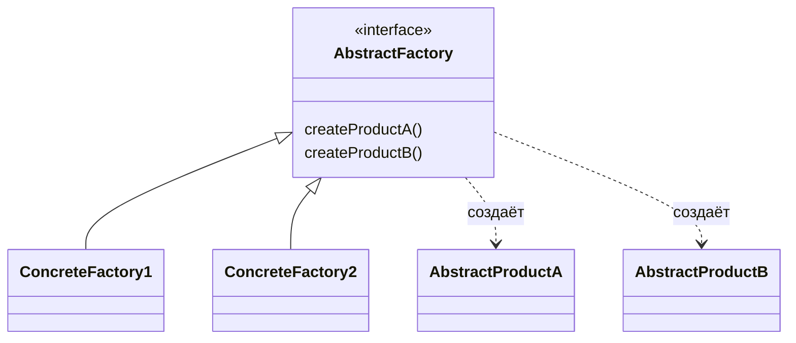

# Абстрактная фабрика (Abstract Factory)

**Abstract Factory** предоставляет интерфейс для создания семейств связанных или зависимых объектов без указания их конкретных классов.

## Полезные ссылки

### Официальная документация
- [Java ServiceLoader](https://docs.oracle.com/en/java/javase/17/docs/api/java.base/java/util/ServiceLoader.html)
- [Spring Abstract Factory](https://docs.spring.io/spring-framework/reference/core/beans/java.html)

### См. также
- [Factory Method](factory-method.md) — **Factory Method Pattern**
- [Spring Core](../../interview/frameworks/spring/spring-framework-interview.md) — **IoC** и бины
- [Java Basics](../../languages/java/java-basics.md) — **Java Basics**

- [Одиночка (Singleton)](singleton.md)
- [Строитель (Builder)](builder.md)
## Содержание

- [Суть и запомнить](#суть-и-запомнить)
- [Что такое Abstract Factory?](#что-такое-abstract-factory)
  - [Основные характеристики](#основные-характеристики)
  - [Проблемы, которые решает](#проблемы-которые-решает)
- [Когда использовать Abstract Factory?](#когда-использовать-abstract-factory)
  - [Подходящие сценарии](#подходящие-сценарии)
  - [Признаки необходимости](#признаки-необходимости)
- [Структура паттерна](#структура-паттерна)
  - [Компоненты](#компоненты)
- [Реализация на Java](#реализация-на-java)
  - [Классическая Abstract Factory](#классическая-abstract-factory)
  - [Parameterized Abstract Factory](#parameterized-abstract-factory)
  - [ServiceLoader Abstract Factory](#serviceloader-abstract-factory)
- [Продвинутые реализации](#продвинутые-реализации)
  - [1. Hierarchical Abstract Factory](#1-hierarchical-abstract-factory)
  - [2. Dynamic Abstract Factory](#2-dynamic-abstract-factory)
  - [3. Composite Abstract Factory](#3-composite-abstract-factory)
- [Примеры использования](#примеры-использования)
  - [1. Spring Application Context Factory](#1-spring-application-context-factory)
  - [2. Database Migration Factory](#2-database-migration-factory)
  - [3. Serialization Factory](#3-serialization-factory)
- [Лучшие практики](#лучшие-практики)
  - [1. Когда использовать Abstract Factory](#1-когда-использовать-abstract-factory)
  - [2. Реализация фабрики фабрик](#2-реализация-фабрики-фабрик)
  - [3. Обработка ошибок и валидация](#3-обработка-ошибок-и-валидация)
  - [4. Тестирование Abstract Factory](#4-тестирование-abstract-factory)
- [Решение проблем](#решение-проблем)
- [Частые вопросы](#частые-вопросы)
- [Заключение](#заключение)

## Суть и запомнить

**Суть в одном предложении:** Интерфейс для создания семейства связанных объектов; конкретная фабрика даёт совместимый набор.

**Запомнить:**
- AbstractFactory создаёт несколько типов продуктов (A, B); каждая ConcreteFactory — своё семейство.
- Клиент работает только с абстрактными типами.
- Отличие от Factory Method: семейство продуктов, а не один.

**Когда применять:** несколько связанных продуктов (UI-тема, набор драйверов, платформа).

## Что такое Abstract Factory?

**Abstract Factory** — это порождающий паттерн проектирования, который позволяет создавать семейства связанных объектов без привязки к конкретным классам. Вместо создания объектов напрямую, клиент работает с абстрактными интерфейсами фабрики.

### Основные характеристики

1. **Семейства объектов**: Создание групп связанных объектов
2. **Абстракция**: Клиент не знает о конкретных реализациях
3. **Консистентность**: Все объекты одного семейства совместимы
4. **Расширяемость**: Легко добавлять новые семейства

### Проблемы, которые решает

Сравнение: жёсткая привязка к платформе(Windows/Mac) vs абстрактная фабрика **GUIFactory**.

```java
// Плохо: Жесткая зависимость от конкретных классов
public class Application {

    public void createUI() {
        // Windows UI
        WindowsButton button = new WindowsButton();
        WindowsWindow window = new WindowsWindow();
        WindowsMenu menu = new WindowsMenu();

        // Или Mac UI
        MacButton macButton = new MacButton();
        MacWindow macWindow = new MacWindow();
        MacMenu macMenu = new MacMenu();

        // Код дублируется, сложно менять платформу
    }
}

// Хорошо: Использование Abstract Factory
public class Application {

    private final GUIFactory guiFactory;

    public Application(GUIFactory guiFactory) {
        this.guiFactory = guiFactory; // Внедрение фабрики
    }

    public void createUI() {
        // Создание через абстрактную фабрику
        Button button = guiFactory.createButton();
        Window window = guiFactory.createWindow();
        Menu menu = guiFactory.createMenu();

        // Все объекты совместимы и принадлежат одному семейству
    }
}
```

## Когда использовать Abstract Factory?

### Подходящие сценарии

- **Семейства продуктов**: Когда нужно создавать группы связанных объектов
- **Платформенная зависимость**: **GUI**, базы данных для разных платформ
- **Конфигурируемость**: Выбор семейства во время выполнения
- **Тестирование**: Создание **mock** семейств объектов
- **Plugin архитектура**: Загрузка разных реализаций

### Признаки необходимости

```java
// Признаки: Множество взаимосвязанных объектов
public class Indicators {

    // Семейство для разных ОС
    public interface OSFamily {
        FileSystem createFileSystem();
        NetworkManager createNetworkManager();
        ProcessManager createProcessManager();
    }

    // Семейство для разных протоколов
    public interface ProtocolFamily {
        Serializer createSerializer();
        Compressor createCompressor();
        Encryptor createEncryptor();
    }

    // Семейство для разных СУБД
    public interface DatabaseFamily {
        Connection createConnection();
        QueryBuilder createQueryBuilder();
        TransactionManager createTransactionManager();
    }

    // Клиент работает с абстракцией
    public class DataProcessor {
        private final DatabaseFamily databaseFamily;

        public DataProcessor(DatabaseFamily databaseFamily) {
            this.databaseFamily = databaseFamily;
        }

        public void processData() {
            Connection conn = databaseFamily.createConnection();
            QueryBuilder query = databaseFamily.createQueryBuilder();
            TransactionManager tx = databaseFamily.createTransactionManager();
            // Все объекты совместимы
        }
    }
}
```

## Структура паттерна



### Компоненты

1. **AbstractFactory**: Интерфейс с методами создания абстрактных продуктов
2. **ConcreteFactory**: Реализация фабрики для конкретного семейства
3. **AbstractProduct**: Абстрактный интерфейс продуктов
4. **ConcreteProduct**: Конкретные реализации продуктов
5. **Client**: Код, использующий абстрактную фабрику

## Реализация на Java

### Классическая Abstract Factory

```java
// Абстрактные продукты
interface Button {
    void render();
    void onClick();
}

interface Window {
    void open();
    void close();
    void resize(int width, int height);
}

interface Menu {
    void show();
    void hide();
    void addItem(String item);
}

// Абстрактная фабрика
interface GUIFactory {
    Button createButton();
    Window createWindow();
    Menu createMenu();
}

// Конкретные продукты для Windows
class WindowsButton implements Button {
    @Override
    public void render() {
        System.out.println("Rendering Windows button");
    }

    @Override
    public void onClick() {
        System.out.println("Windows button clicked");
    }
}

class WindowsWindow implements Window {
    @Override
    public void open() {
        System.out.println("Opening Windows window");
    }

    @Override
    public void close() {
        System.out.println("Closing Windows window");
    }

    @Override
    public void resize(int width, int height) {
        System.out.println("Resizing Windows window to " + width + "x" + height);
    }
}

class WindowsMenu implements Menu {
    @Override
    public void show() {
        System.out.println("Showing Windows menu");
    }

    @Override
    public void hide() {
        System.out.println("Hiding Windows menu");
    }

    @Override
    public void addItem(String item) {
        System.out.println("Adding item to Windows menu: " + item);
    }
}

// Конкретные продукты для Mac
class MacButton implements Button {
    @Override
    public void render() {
        System.out.println("Rendering Mac button");
    }

    @Override
    public void onClick() {
        System.out.println("Mac button clicked");
    }
}

class MacWindow implements Window {
    @Override
    public void open() {
        System.out.println("Opening Mac window");
    }

    @Override
    public void close() {
        System.out.println("Closing Mac window");
    }

    @Override
    public void resize(int width, int height) {
        System.out.println("Resizing Mac window to " + width + "x" + height);
    }
}

class MacMenu implements Menu {
    @Override
    public void show() {
        System.out.println("Showing Mac menu");
    }

    @Override
    public void hide() {
        System.out.println("Hiding Mac menu");
    }

    @Override
    public void addItem(String item) {
        System.out.println("Adding item to Mac menu: " + item);
    }
}

// Конкретные фабрики
class WindowsGUIFactory implements GUIFactory {
    @Override
    public Button createButton() {
        return new WindowsButton();
    }

    @Override
    public Window createWindow() {
        return new WindowsWindow();
    }

    @Override
    public Menu createMenu() {
        return new WindowsMenu();
    }
}

class MacGUIFactory implements GUIFactory {
    @Override
    public Button createButton() {
        return new MacButton();
    }

    @Override
    public Window createWindow() {
        return new MacWindow();
    }

    @Override
    public Menu createMenu() {
        return new MacMenu();
    }
}

// Фабрика фабрик
class GUIFactoryProvider {
    public static GUIFactory createFactory(String osType) {
        switch (osType.toLowerCase()) {
            case "windows":
                return new WindowsGUIFactory();
            case "mac":
                return new MacGUIFactory();
            default:
                throw new IllegalArgumentException("Unknown OS type: " + osType);
        }
    }

    // Автоматическое определение ОС
    public static GUIFactory createFactory() {
        String os = System.getProperty("os.name").toLowerCase();
        if (os.contains("win")) {
            return new WindowsGUIFactory();
        } else if (os.contains("mac")) {
            return new MacGUIFactory();
        } else {
            // Fallback
            return new WindowsGUIFactory();
        }
    }
}

// Клиент
public class Application {
    private final GUIFactory guiFactory;

    public Application(GUIFactory guiFactory) {
        this.guiFactory = guiFactory;
    }

    public void createAndUseGUI() {
        // Создание семейства объектов через фабрику
        Button button = guiFactory.createButton();
        Window window = guiFactory.createWindow();
        Menu menu = guiFactory.createMenu();

        // Использование объектов (все из одного семейства)
        window.open();
        button.render();
        menu.show();
        menu.addItem("File");
        menu.addItem("Edit");
        button.onClick();
        window.resize(800, 600);
        menu.hide();
        window.close();
    }

    public static void main(String[] args) {
        // Создание приложения с фабрикой для текущей ОС
        Application app = new Application(GUIFactoryProvider.createFactory());
        app.createAndUseGUI();

        // Или явное указание ОС
        Application windowsApp = new Application(GUIFactoryProvider.createFactory("windows"));
        windowsApp.createAndUseGUI();
    }
}
```

### Parameterized Abstract Factory

```java
// Параметризованная фабрика
interface DatabaseFactory {
    Connection createConnection(String url, String username, String password);
    QueryExecutor createQueryExecutor();
    TransactionManager createTransactionManager();
    ConnectionPool createConnectionPool(int maxConnections);
}

// Конкретные фабрики для разных СУБД
class PostgreSQLFactory implements DatabaseFactory {
    @Override
    public Connection createConnection(String url, String username, String password) {
        return new PostgreSQLConnection(url, username, password);
    }

    @Override
    public QueryExecutor createQueryExecutor() {
        return new PostgreSQLQueryExecutor();
    }

    @Override
    public TransactionManager createTransactionManager() {
        return new PostgreSQLTransactionManager();
    }

    @Override
    public ConnectionPool createConnectionPool(int maxConnections) {
        return new PostgreSQLConnectionPool(maxConnections);
    }
}

class MySQLFactory implements DatabaseFactory {
    @Override
    public Connection createConnection(String url, String username, String password) {
        return new MySQLConnection(url, username, password);
    }

    @Override
    public QueryExecutor createQueryExecutor() {
        return new MySQLQueryExecutor();
    }

    @Override
    public TransactionManager createTransactionManager() {
        return new MySQLTransactionManager();
    }

    @Override
    public ConnectionPool createConnectionPool(int maxConnections) {
        return new MySQLConnectionPool(maxConnections);
    }
}

// Клиент с параметризацией
public class DatabaseClient {

    private final DatabaseFactory factory;
    private final ConnectionPool connectionPool;

    public DatabaseClient(DatabaseFactory factory, int maxConnections) {
        this.factory = factory;
        this.connectionPool = factory.createConnectionPool(maxConnections);
    }

    public void executeQuery(String sql) {
        Connection connection = connectionPool.getConnection();
        try {
            QueryExecutor executor = factory.createQueryExecutor();
            TransactionManager transactionManager = factory.createTransactionManager();

            transactionManager.beginTransaction();
            try {
                executor.executeQuery(connection, sql);
                transactionManager.commit();
            } catch (Exception e) {
                transactionManager.rollback();
                throw e;
            }
        } finally {
            connectionPool.returnConnection(connection);
        }
    }

    // Factory provider с кэшированием
    public static class DatabaseFactoryProvider {
        private static final Map<String, DatabaseFactory> factoryCache = new ConcurrentHashMap<>();

        public static DatabaseFactory getFactory(String dbType) {
            return factoryCache.computeIfAbsent(dbType.toLowerCase(), type -> {
                switch (type) {
                    case "postgresql":
                        return new PostgreSQLFactory();
                    case "mysql":
                        return new MySQLFactory();
                    default:
                        throw new IllegalArgumentException("Unknown database type: " + type);
                }
            });
        }
    }

    public static void main(String[] args) {
        // Создание клиента с PostgreSQL
        DatabaseClient postgresClient = new DatabaseClient(
            DatabaseFactoryProvider.getFactory("postgresql"), 10);

        postgresClient.executeQuery("SELECT * FROM users");

        // Создание клиента с MySQL
        DatabaseClient mysqlClient = new DatabaseClient(
            DatabaseFactoryProvider.getFactory("mysql"), 5);

        mysqlClient.executeQuery("SELECT * FROM products");
    }
}
```

### ServiceLoader Abstract Factory

```java
// Фабрика на основе ServiceLoader (Java SPI)
interface SerializationFactory {
    Serializer createSerializer(String format);
    Compressor createCompressor(String algorithm);
    Encryptor createEncryptor(String cipher);
}

// SPI интерфейс для провайдеров
interface SerializationProvider {
    String getName();
    Serializer createSerializer();
    Compressor createCompressor();
    Encryptor createEncryptor();
}

// Реализация провайдера
public class JSONSerializationProvider implements SerializationProvider {
    @Override
    public String getName() {
        return "json";
    }

    @Override
    public Serializer createSerializer() {
        return new JSONSerializer();
    }

    @Override
    public Compressor createCompressor() {
        return new GZIPCompressor();
    }

    @Override
    public Encryptor createEncryptor() {
        return new AESEncryptor();
    }
}

// META-INF/services/com.example.SerializationProvider
// com.example.JSONSerializationProvider
// com.example.XMLSerializationProvider

// Фабрика с ServiceLoader
public class ServiceLoaderSerializationFactory implements SerializationFactory {

    private final Map<String, SerializationProvider> providers = new ConcurrentHashMap<>();

    public ServiceLoaderSerializationFactory() {
        loadProviders();
    }

    private void loadProviders() {
        ServiceLoader<SerializationProvider> loader = ServiceLoader.load(SerializationProvider.class);
        for (SerializationProvider provider : loader) {
            providers.put(provider.getName(), provider);
        }
    }

    @Override
    public Serializer createSerializer(String format) {
        SerializationProvider provider = providers.get(format.toLowerCase());
        if (provider == null) {
            throw new IllegalArgumentException("Unknown serialization format: " + format);
        }
        return provider.createSerializer();
    }

    @Override
    public Compressor createCompressor(String algorithm) {
        // Для простоты используем первый доступный провайдер
        SerializationProvider provider = providers.values().iterator().next();
        return provider.createCompressor();
    }

    @Override
    public Encryptor createEncryptor(String cipher) {
        // Для простоты используем первый доступный провайдер
        SerializationProvider provider = providers.values().iterator().next();
        return provider.createEncryptor();
    }

    public Set<String> getAvailableFormats() {
        return new HashSet<>(providers.keySet());
    }
}

// Клиент
public class SerializationClient {
    private final SerializationFactory factory;

    public SerializationClient() {
        this.factory = new ServiceLoaderSerializationFactory();
    }

    public void serializeObject(Object obj, String format) {
        Serializer serializer = factory.createSerializer(format);
        Compressor compressor = factory.createCompressor("gzip");
        Encryptor encryptor = factory.createEncryptor("aes");

        // Pipeline: serialize -> compress -> encrypt
        String serialized = serializer.serialize(obj);
        byte[] compressed = compressor.compress(serialized.getBytes());
        byte[] encrypted = encryptor.encrypt(compressed);

        System.out.println("Object serialized with format: " + format);
    }
}
```

## Продвинутые реализации

### 1. Hierarchical Abstract Factory

```java
// Иерархическая фабрика для сложных систем
interface ApplicationFactory {
    // Основные компоненты
    DatabaseFactory createDatabaseFactory();
    CacheFactory createCacheFactory();
    MessagingFactory createMessagingFactory();

    // Конфигурация
    Configuration createConfiguration();
}

interface DatabaseFactory {
    Connection createConnection();
    Repository<User> createUserRepository();
    Repository<Order> createOrderRepository();
}

interface CacheFactory {
    Cache<String, Object> createCache(String name);
    CacheManager createCacheManager();
}

interface MessagingFactory {
    MessageProducer createProducer(String topic);
    MessageConsumer createConsumer(String topic);
    MessageSerializer createSerializer();
}

// Конкретная реализация для Production
class ProductionApplicationFactory implements ApplicationFactory {

    @Override
    public DatabaseFactory createDatabaseFactory() {
        return new PostgreSQLDatabaseFactory();
    }

    @Override
    public CacheFactory createCacheFactory() {
        return new RedisCacheFactory();
    }

    @Override
    public MessagingFactory createMessagingFactory() {
        return new KafkaMessagingFactory();
    }

    @Override
    public Configuration createConfiguration() {
        return new ProductionConfiguration();
    }
}

// Конкретная реализация для Testing
class TestApplicationFactory implements ApplicationFactory {

    @Override
    public DatabaseFactory createDatabaseFactory() {
        return new H2DatabaseFactory();
    }

    @Override
    public CacheFactory createCacheFactory() {
        return new InMemoryCacheFactory();
    }

    @Override
    public MessagingFactory createMessagingFactory() {
        return new InMemoryMessagingFactory();
    }

    @Override
    public Configuration createConfiguration() {
        return new TestConfiguration();
    }
}

// Клиент
public class ApplicationContext {

    private final ApplicationFactory factory;

    public ApplicationContext(String environment) {
        this.factory = createFactory(environment);
    }

    private ApplicationFactory createFactory(String environment) {
        switch (environment.toLowerCase()) {
            case "production":
                return new ProductionApplicationFactory();
            case "test":
                return new TestApplicationFactory();
            default:
                return new ProductionApplicationFactory();
        }
    }

    public DatabaseFactory getDatabaseFactory() {
        return factory.createDatabaseFactory();
    }

    public CacheFactory getCacheFactory() {
        return factory.createCacheFactory();
    }

    public MessagingFactory getMessagingFactory() {
        return factory.createMessagingFactory();
    }

    public Configuration getConfiguration() {
        return factory.createConfiguration();
    }
}
```

### 2. Dynamic Abstract Factory

```java
// Динамическая фабрика с reflection
public class DynamicFactory<T> {

    private final Class<T> factoryInterface;
    private final Map<String, Class<? extends T>> implementations = new ConcurrentHashMap<>();

    public DynamicFactory(Class<T> factoryInterface) {
        this.factoryInterface = factoryInterface;
    }

    public void registerImplementation(String name, Class<? extends T> implementationClass) {
        // Валидация что класс реализует интерфейс
        if (!factoryInterface.isAssignableFrom(implementationClass)) {
            throw new IllegalArgumentException(
                implementationClass.getName() + " does not implement " + factoryInterface.getName());
        }
        implementations.put(name, implementationClass);
    }

    public T createInstance(String name) {
        Class<? extends T> implementationClass = implementations.get(name);
        if (implementationClass == null) {
            throw new IllegalArgumentException("No implementation registered for: " + name);
        }

        try {
            return implementationClass.getDeclaredConstructor().newInstance();
        } catch (Exception e) {
            throw new RuntimeException("Failed to create instance of " + implementationClass.getName(), e);
        }
    }

    public Set<String> getAvailableImplementations() {
        return new HashSet<>(implementations.keySet());
    }

    // Фабрика фабрик
    public static <T> DynamicFactory<T> create(Class<T> factoryInterface) {
        return new DynamicFactory<>(factoryInterface);
    }
}

// Пример использования
interface PaymentProcessor {
    void processPayment(BigDecimal amount, String currency);
}

class PayPalProcessor implements PaymentProcessor {
    @Override
    public void processPayment(BigDecimal amount, String currency) {
        System.out.println("Processing PayPal payment: " + amount + " " + currency);
    }
}

class StripeProcessor implements PaymentProcessor {
    @Override
    public void processPayment(BigDecimal amount, String currency) {
        System.out.println("Processing Stripe payment: " + amount + " " + currency);
    }
}

public class DynamicFactoryDemo {
    public static void main(String[] args) {
        // Создание динамической фабрики
        DynamicFactory<PaymentProcessor> factory = DynamicFactory.create(PaymentProcessor.class);

        // Регистрация реализаций
        factory.registerImplementation("paypal", PayPalProcessor.class);
        factory.registerImplementation("stripe", StripeProcessor.class);

        // Создание экземпляров
        PaymentProcessor paypal = factory.createInstance("paypal");
        PaymentProcessor stripe = factory.createInstance("stripe");

        paypal.processPayment(BigDecimal.valueOf(100.00), "USD");
        stripe.processPayment(BigDecimal.valueOf(50.00), "EUR");

        System.out.println("Available processors: " + factory.getAvailableImplementations());
    }
}
```

### 3. Composite Abstract Factory

```java
// Композитная фабрика для сложных объектов
interface ComponentFactory {
    Component createComponent(String type);
    CompositeComponent createComposite(String type);
}

interface Component {
    String getType();
    void operation();
}

interface CompositeComponent extends Component {
    void addComponent(Component component);
    void removeComponent(Component component);
    List<Component> getComponents();
}

// Реализация компонентов
class LeafComponent implements Component {
    private final String type;

    public LeafComponent(String type) {
        this.type = type;
    }

    @Override
    public String getType() {
        return type;
    }

    @Override
    public void operation() {
        System.out.println("Leaf component operation: " + type);
    }
}

class CompositeComponentImpl implements CompositeComponent {
    private final String type;
    private final List<Component> components = new ArrayList<>();

    public CompositeComponentImpl(String type) {
        this.type = type;
    }

    @Override
    public String getType() {
        return type;
    }

    @Override
    public void addComponent(Component component) {
        components.add(component);
    }

    @Override
    public void removeComponent(Component component) {
        components.remove(component);
    }

    @Override
    public List<Component> getComponents() {
        return new ArrayList<>(components);
    }

    @Override
    public void operation() {
        System.out.println("Composite component operation: " + type);
        for (Component component : components) {
            component.operation();
        }
    }
}

// Композитная фабрика
class DefaultComponentFactory implements ComponentFactory {

    private final Map<String, Supplier<Component>> componentRegistry = new HashMap<>();
    private final Map<String, Supplier<CompositeComponent>> compositeRegistry = new HashMap<>();

    public DefaultComponentFactory() {
        // Регистрация простых компонентов
        componentRegistry.put("button", () -> new LeafComponent("button"));
        componentRegistry.put("text", () -> new LeafComponent("text"));
        componentRegistry.put("image", () -> new LeafComponent("image"));

        // Регистрация композитных компонентов
        compositeRegistry.put("panel", () -> new CompositeComponentImpl("panel"));
        compositeRegistry.put("window", () -> new CompositeComponentImpl("window"));
        compositeRegistry.put("form", () -> new CompositeComponentImpl("form"));
    }

    @Override
    public Component createComponent(String type) {
        Supplier<Component> supplier = componentRegistry.get(type);
        if (supplier == null) {
            throw new IllegalArgumentException("Unknown component type: " + type);
        }
        return supplier.get();
    }

    @Override
    public CompositeComponent createComposite(String type) {
        Supplier<CompositeComponent> supplier = compositeRegistry.get(type);
        if (supplier == null) {
            throw new IllegalArgumentException("Unknown composite type: " + type);
        }
        return supplier.get();
    }

    // Метод для создания сложных композитных объектов
    public CompositeComponent createFormWithFields() {
        CompositeComponent form = createComposite("form");

        form.addComponent(createComponent("text"));
        form.addComponent(createComponent("button"));
        form.addComponent(createComponent("button"));

        return form;
    }

    public CompositeComponent createWindowWithPanel() {
        CompositeComponent window = createComposite("window");
        CompositeComponent panel = createComposite("panel");

        panel.addComponent(createComponent("button"));
        panel.addComponent(createComponent("image"));

        window.addComponent(panel);

        return window;
    }
}

// Клиент
public class CompositeFactoryDemo {
    public static void main(String[] args) {
        ComponentFactory factory = new DefaultComponentFactory();

        // Создание простых компонентов
        Component button = factory.createComponent("button");
        Component text = factory.createComponent("text");

        button.operation();
        text.operation();

        // Создание композитных компонентов
        CompositeComponent form = factory.createFormWithFields();
        CompositeComponent window = factory.createWindowWithPanel();

        System.out.println("\nForm components:");
        form.operation();

        System.out.println("\nWindow components:");
        window.operation();
    }
}
```

## Примеры использования

### 1. Spring Application Context Factory

```java
@Configuration
public class ApplicationFactoryConfig {

    @Bean
    public ApplicationFactory applicationFactory(@Value("${app.environment}") String environment) {
        switch (environment.toLowerCase()) {
            case "production":
                return new ProductionApplicationFactory();
            case "staging":
                return new StagingApplicationFactory();
            case "test":
                return new TestApplicationFactory();
            default:
                return new DevelopmentApplicationFactory();
        }
    }

    // Фабрики для разных сред
    public static class ProductionApplicationFactory implements ApplicationFactory {
        @Override
        public DataSource dataSource() {
            return createProductionDataSource();
        }

        @Override
        public CacheManager cacheManager() {
            return createRedisCacheManager();
        }

        @Override
        public MessageBroker messageBroker() {
            return createKafkaMessageBroker();
        }
    }

    public static class TestApplicationFactory implements ApplicationFactory {
        @Override
        public DataSource dataSource() {
            return createH2DataSource();
        }

        @Override
        public CacheManager cacheManager() {
            return createInMemoryCacheManager();
        }

        @Override
        public MessageBroker messageBroker() {
            return createInMemoryMessageBroker();
        }
    }
}

@Service
public class ApplicationService {

    private final DataSource dataSource;
    private final CacheManager cacheManager;
    private final MessageBroker messageBroker;

    @Autowired
    public ApplicationService(ApplicationFactory factory) {
        this.dataSource = factory.dataSource();
        this.cacheManager = factory.cacheManager();
        this.messageBroker = factory.messageBroker();
    }

    public void performOperation() {
        // Использование всех компонентов из одного семейства
        try (Connection conn = dataSource.getConnection()) {
            // Работа с БД
            Cache cache = cacheManager.getCache("main");
            // Работа с кэшем
            messageBroker.sendMessage("topic", "message");
            // Отправка сообщений
        } catch (Exception e) {
            // Обработка ошибок
        }
    }
}
```

### 2. Database Migration Factory

```java
@Service
public class DatabaseMigrationFactoryProvider {

    private final Map<String, DatabaseMigrationFactory> factories = new ConcurrentHashMap<>();

    @Autowired
    public DatabaseMigrationFactoryProvider(List<DatabaseMigrationFactory> factoryList) {
        for (DatabaseMigrationFactory factory : factoryList) {
            factories.put(factory.getDatabaseType(), factory);
        }
    }

    public DatabaseMigrationFactory getFactory(String databaseType) {
        DatabaseMigrationFactory factory = factories.get(databaseType.toLowerCase());
        if (factory == null) {
            throw new IllegalArgumentException("Unsupported database type: " + databaseType);
        }
        return factory;
    }
}

// Интерфейс фабрики миграций
public interface DatabaseMigrationFactory {
    String getDatabaseType();
    Connection getConnection();
    MigrationExecutor createExecutor();
    SchemaValidator createValidator();
    RollbackHandler createRollbackHandler();
}

// Реализация для PostgreSQL
@Component
@ConditionalOnProperty(name = "database.type", havingValue = "postgresql")
public class PostgreSQLMigrationFactory implements DatabaseMigrationFactory {

    @Autowired
    private DataSource dataSource;

    @Override
    public String getDatabaseType() {
        return "postgresql";
    }

    @Override
    public Connection getConnection() throws SQLException {
        return dataSource.getConnection();
    }

    @Override
    public MigrationExecutor createExecutor() {
        return new PostgreSQLMigrationExecutor();
    }

    @Override
    public SchemaValidator createValidator() {
        return new PostgreSQLSchemaValidator();
    }

    @Override
    public RollbackHandler createRollbackHandler() {
        return new PostgreSQLRollbackHandler();
    }
}

// Реализация для MySQL
@Component
@ConditionalOnProperty(name = "database.type", havingValue = "mysql")
public class MySQLMigrationFactory implements DatabaseMigrationFactory {

    @Autowired
    private DataSource dataSource;

    @Override
    public String getDatabaseType() {
        return "mysql";
    }

    @Override
    public Connection getConnection() throws SQLException {
        return dataSource.getConnection();
    }

    @Override
    public MigrationExecutor createExecutor() {
        return new MySQLMigrationExecutor();
    }

    @Override
    public SchemaValidator createValidator() {
        return new MySQLSchemaValidator();
    }

    @Override
    public RollbackHandler createRollbackHandler() {
        return new MySQLRollbackHandler();
    }
}

// Сервис миграций
@Service
public class DatabaseMigrationService {

    private final DatabaseMigrationFactory factory;

    @Autowired
    public DatabaseMigrationService(DatabaseMigrationFactoryProvider factoryProvider,
                                   @Value("${database.type}") String databaseType) {
        this.factory = factoryProvider.getFactory(databaseType);
    }

    public void migrate(List<MigrationScript> scripts) {
        try (Connection connection = factory.getConnection()) {
            MigrationExecutor executor = factory.createExecutor();
            SchemaValidator validator = factory.createValidator();
            RollbackHandler rollbackHandler = factory.createRollbackHandler();

            for (MigrationScript script : scripts) {
                try {
                    // Валидация
                    validator.validateScript(script);

                    // Выполнение
                    executor.executeScript(connection, script);

                    // Проверка
                    validator.validateSchema(connection);

                } catch (Exception e) {
                    // Откат при ошибке
                    rollbackHandler.rollbackScript(connection, script);
                    throw new MigrationException("Failed to execute migration: " + script.getName(), e);
                }
            }
        } catch (SQLException e) {
            throw new MigrationException("Database connection error", e);
        }
    }
}
```

### 3. Serialization Factory

```java
@Service
public class SerializationService {

    private final Map<String, SerializationFactory> factories = new ConcurrentHashMap<>();

    @Autowired
    public SerializationService(List<SerializationFactory> factoryList) {
        for (SerializationFactory factory : factoryList) {
            factories.put(factory.getFormat(), factory);
        }
    }

    public <T> String serialize(T object, String format) {
        SerializationFactory factory = getFactory(format);
        Serializer serializer = factory.createSerializer();
        Compressor compressor = factory.createCompressor();

        String serialized = serializer.serialize(object);
        if (factory.supportsCompression()) {
            byte[] compressed = compressor.compress(serialized.getBytes(StandardCharsets.UTF_8));
            return Base64.getEncoder().encodeToString(compressed);
        }

        return serialized;
    }

    public <T> T deserialize(String data, Class<T> type, String format) {
        SerializationFactory factory = getFactory(format);
        Serializer serializer = factory.createSerializer();
        Compressor compressor = factory.createCompressor();

        String toDeserialize = data;
        if (factory.supportsCompression()) {
            byte[] compressed = Base64.getDecoder().decode(data);
            byte[] decompressed = compressor.decompress(compressed);
            toDeserialize = new String(decompressed, StandardCharsets.UTF_8);
        }

        return serializer.deserialize(toDeserialize, type);
    }

    private SerializationFactory getFactory(String format) {
        SerializationFactory factory = factories.get(format.toLowerCase());
        if (factory == null) {
            throw new IllegalArgumentException("Unsupported serialization format: " + format);
        }
        return factory;
    }
}

// Интерфейс фабрики сериализации
public interface SerializationFactory {
    String getFormat();
    Serializer createSerializer();
    Compressor createCompressor();
    boolean supportsCompression();
}

// JSON фабрика
@Component
public class JsonSerializationFactory implements SerializationFactory {

    @Override
    public String getFormat() {
        return "json";
    }

    @Override
    public Serializer createSerializer() {
        return new JacksonSerializer();
    }

    @Override
    public Compressor createCompressor() {
        return new GzipCompressor();
    }

    @Override
    public boolean supportsCompression() {
        return true;
    }
}

// XML фабрика
@Component
public class XmlSerializationFactory implements SerializationFactory {

    @Override
    public String getFormat() {
        return "xml";
    }

    @Override
    public Serializer createSerializer() {
        return new JaxbSerializer();
    }

    @Override
    public Compressor createCompressor() {
        return new DeflateCompressor();
    }

    @Override
    public boolean supportsCompression() {
        return true;
    }
}

// Клиент
@RestController
public class SerializationController {

    private final SerializationService serializationService;

    @Autowired
    public SerializationController(SerializationService serializationService) {
        this.serializationService = serializationService;
    }

    @PostMapping("/serialize/{format}")
    public String serialize(@RequestBody Object data, @PathVariable String format) {
        return serializationService.serialize(data, format);
    }

    @PostMapping("/deserialize/{format}")
    public <T> T deserialize(@RequestBody String data, @PathVariable String format,
                           @RequestParam Class<T> type) {
        return serializationService.deserialize(data, type, format);
    }
}
```

## Лучшие практики

### 1. Когда использовать Abstract Factory

```java
public class AbstractFactoryGuidelines {

    // Используйте Abstract Factory когда:
    // - Нужно создавать семейства связанных объектов
    // - Система должна быть независимой от способа создания объектов
    // - Конфигурация семейства определяется во время выполнения
    // - Важна консистентность объектов внутри семейства

    // Пример: GUI для разных платформ
    public interface GUIFactory {
        Button createButton();
        Window createWindow();
        Theme createTheme(); // Все компоненты должны сочетаться
    }

    // Пример: Database access layer
    public interface DatabaseFactory {
        Connection createConnection();
        QueryBuilder createQueryBuilder();
        TransactionManager createTransactionManager();
        // Все компоненты должны работать с одной СУБД
    }

    // НЕ используйте когда:
    // - Создается только один объект (используйте Factory Method)
    // - Объекты не связаны между собой
    // - Конфигурация известна на этапе компиляции
}

// Сравнение с Factory Method
public class FactoryMethodVsAbstractFactory {

    // Factory Method - один продукт
    abstract class Creator {
        abstract Product createProduct();
    }

    // Abstract Factory - семейство продуктов
    abstract class AbstractFactory {
        abstract ProductA createProductA();
        abstract ProductB createProductB();
        abstract ProductC createProductC();
    }
}
```

### 2. Реализация фабрики фабрик

```java
public class FactoryProviderPatterns {

    // Паттерн: Factory Registry
    public class FactoryRegistry<T> {
        private final Map<String, Supplier<T>> registry = new ConcurrentHashMap<>();

        public void register(String name, Supplier<T> factory) {
            registry.put(name, factory);
        }

        public T create(String name) {
            Supplier<T> factory = registry.get(name);
            if (factory == null) {
                throw new IllegalArgumentException("Unknown factory: " + name);
            }
            return factory.get();
        }
    }

    // Паттерн: Environment-based Factory
    public class EnvironmentFactoryProvider {
        public static <T> T createFactory(Class<T> factoryType, String environment) {
            String factoryClassName = getFactoryClassName(factoryType, environment);
            try {
                Class<?> factoryClass = Class.forName(factoryClassName);
                return factoryType.cast(factoryClass.getDeclaredConstructor().newInstance());
            } catch (Exception e) {
                throw new RuntimeException("Failed to create factory", e);
            }
        }

        private static String getFactoryClassName(Class<?> factoryType, String environment) {
            return factoryType.getPackage().getName() + "." +
                   environment.substring(0, 1).toUpperCase() +
                   environment.substring(1).toLowerCase() +
                   factoryType.getSimpleName();
        }
    }

    // Паттерн: ServiceLoader Factory
    public class ServiceLoaderFactoryProvider {
        public static <T> T createFactory(Class<T> factoryType) {
            ServiceLoader<T> loader = ServiceLoader.load(factoryType);
            Iterator<T> iterator = loader.iterator();

            if (!iterator.hasNext()) {
                throw new IllegalStateException("No implementation found for " + factoryType);
            }

            T factory = iterator.next();

            if (iterator.hasNext()) {
                // Предупреждение о множественных реализациях
                System.out.println("Multiple implementations found, using first: " + factory.getClass());
            }

            return factory;
        }
    }
}
```

### 3. Обработка ошибок и валидация

```java
public class FactoryErrorHandling {

    // Фабрика с обработкой ошибок
    public abstract class SafeAbstractFactory {

        protected <T> T safeCreate(Supplier<T> supplier, String componentName) {
            try {
                return supplier.get();
            } catch (Exception e) {
                throw new FactoryException(
                    "Failed to create " + componentName + ": " + e.getMessage(), e);
            }
        }

        protected void validateConfiguration(Object config) {
            // Валидация конфигурации
            if (config == null) {
                throw new InvalidConfigurationException("Configuration is null");
            }
        }
    }

    // Кастомные исключения
    public static class FactoryException extends RuntimeException {
        public FactoryException(String message) {
            super(message);
        }

        public FactoryException(String message, Throwable cause) {
            super(message, cause);
        }
    }

    public static class InvalidConfigurationException extends FactoryException {
        public InvalidConfigurationException(String message) {
            super(message);
        }
    }

    // Фабрика с circuit breaker
    public class ResilientAbstractFactory extends SafeAbstractFactory {

        private final CircuitBreaker circuitBreaker = new CircuitBreaker(5, 60000);

        @Override
        protected <T> T safeCreate(Supplier<T> supplier, String componentName) {
            if (!circuitBreaker.allowExecution()) {
                throw new FactoryException("Circuit breaker is open for " + componentName);
            }

            try {
                T result = super.safeCreate(supplier, componentName);
                circuitBreaker.recordSuccess();
                return result;
            } catch (Exception e) {
                circuitBreaker.recordFailure();
                throw e;
            }
        }

        private static class CircuitBreaker {
            private volatile boolean open = false;
            private final int failureThreshold;
            private final long timeoutMs;
            private int failureCount = 0;
            private long lastFailureTime = 0;

            public CircuitBreaker(int failureThreshold, long timeoutMs) {
                this.failureThreshold = failureThreshold;
                this.timeoutMs = timeoutMs;
            }

            public synchronized boolean allowExecution() {
                if (open) {
                    if (System.currentTimeMillis() - lastFailureTime > timeoutMs) {
                        open = false;
                        failureCount = 0;
                        return true;
                    }
                    return false;
                }
                return true;
            }

            public synchronized void recordSuccess() {
                failureCount = 0;
                open = false;
            }

            public synchronized void recordFailure() {
                failureCount++;
                lastFailureTime = System.currentTimeMillis();
                if (failureCount >= failureThreshold) {
                    open = true;
                }
            }
        }
    }
}
```

### 4. Тестирование Abstract Factory

```java
@ExtendWith(MockitoExtension.class)
public class AbstractFactoryTest {

    @Test
    void shouldCreateCompatibleProductFamily() {
        GUIFactory factory = new WindowsGUIFactory();

        Button button = factory.createButton();
        Window window = factory.createWindow();
        Menu menu = factory.createMenu();

        // Все продукты должны быть из одного семейства
        assertTrue(button instanceof WindowsButton);
        assertTrue(window instanceof WindowsWindow);
        assertTrue(menu instanceof WindowsMenu);

        // Продукты должны быть совместимы
        assertDoesNotThrow(() -> {
            window.open();
            button.render();
            menu.show();
        });
    }

    @Test
    void shouldCreateDifferentFamiliesForDifferentConfigs() {
        GUIFactory windowsFactory = new WindowsGUIFactory();
        GUIFactory macFactory = new MacGUIFactory();

        Button windowsButton = windowsFactory.createButton();
        Button macButton = macFactory.createButton();

        // Разные семейства создают разные продукты
        assertNotEquals(windowsButton.getClass(), macButton.getClass());
    }

    @Test
    void shouldHandleFactoryCreationErrors() {
        GUIFactoryProvider provider = new GUIFactoryProvider();

        assertThrows(IllegalArgumentException.class, () ->
            provider.createFactory("unknown_os"));
    }

    @Test
    void shouldCacheFactoryInstances() {
        GUIFactoryProvider provider = new GUIFactoryProvider();

        GUIFactory factory1 = provider.createFactory("windows");
        GUIFactory factory2 = provider.createFactory("windows");

        // Для одного типа должна возвращаться одна и та же фабрика
        assertSame(factory1, factory2);
    }

    @Test
    void shouldValidateFactoryConfiguration() {
        TestFactory factory = new TestFactory();

        // Валидная конфигурация
        assertDoesNotThrow(() -> factory.createProduct("valid_config"));

        // Невалидная конфигурация
        assertThrows(IllegalArgumentException.class, () ->
            factory.createProduct("invalid_config"));
    }

    @Test
    void shouldHandleProductCreationFailures() {
        FailingFactory factory = new FailingFactory();

        assertThrows(RuntimeException.class, () ->
            factory.createProduct("any_config"));
    }

    // Test implementations
    interface TestProduct {
        String getType();
    }

    static class TestFactory {
        public TestProduct createProduct(String config) {
            if (!"valid_config".equals(config)) {
                throw new IllegalArgumentException("Invalid config");
            }
            return () -> "test";
        }
    }

    static class FailingFactory {
        public TestProduct createProduct(String config) {
            throw new RuntimeException("Creation failed");
        }
    }

    // Mock implementations for testing
    static class MockGUIFactory implements GUIFactory {
        @Override
        public Button createButton() {
            return new Button() {
                @Override
                public void render() { /* mock */ }
                @Override
                public void onClick() { /* mock */ }
            };
        }

        @Override
        public Window createWindow() {
            return new Window() {
                @Override
                public void open() { /* mock */ }
                @Override
                public void close() { /* mock */ }
                @Override
                public void resize(int width, int height) { /* mock */ }
            };
        }

        @Override
        public Menu createMenu() {
            return new Menu() {
                @Override
                public void show() { /* mock */ }
                @Override
                public void hide() { /* mock */ }
                @Override
                public void addItem(String item) { /* mock */ }
            };
        }
    }
}
```


## Решение проблем

| Симптом | Возможная причина | Что делать |
|--------|-------------------|------------|
| Добавление нового типа продукта требует менять интерфейс | Жёсткая структура фабрики | Рассмотреть параметризованную фабрику или расширение через новый интерфейс |
| Смешение продуктов разных семейств | Нет проверки совместимости | Гарантировать создание через одну фабрику; не смешивать вызовы разных фабрик |
| Сложность тестирования | Много конкретных фабрик | Внедрять AbstractFactory через DI; подменять тестовыми фабриками |

## Частые вопросы

**Чем Abstract Factory отличается от Factory Method?** Abstract Factory создаёт семейства связанных объектов (например, кнопка + окно + меню для одной темы); Factory Method создаёт один объект. Abstract Factory часто использует Factory Method внутри.

**Когда предпочесть Builder?** Builder — для пошагового создания одного сложного объекта с множеством опциональных параметров. Abstract Factory — для создания согласованных наборов объектов разных типов.


## Заключение

**Abstract Factory** — мощный паттерн для создания семейств связанных объектов. Он обеспечивает консистентность и позволяет легко заменять целые семейства реализаций.

**Ключевые преимущества:**
- **Консистентность**: Все объекты семейства совместимы друг с другом
- **Расширяемость**: Легко добавлять новые семейства продуктов
- **Абстракция**: Клиент не зависит от конкретных реализаций
- **Тестируемость**: Легко заменять семейства для тестирования

**Используйте Abstract Factory, когда:**
- Нужно создавать семейства связанных объектов
- Важна независимость от конкретных реализаций
- Конфигурация семейства определяется во время выполнения
- Требуется консистентность объектов внутри семейства

**Abstract Factory** часто используется вместе с:
- **Factory Method**: Для создания отдельных продуктов
- **Builder**: Для сложных объектов внутри семейства
- **Prototype**: Для клонирования существующих семейств
- **Singleton**: Для кэширования фабрик