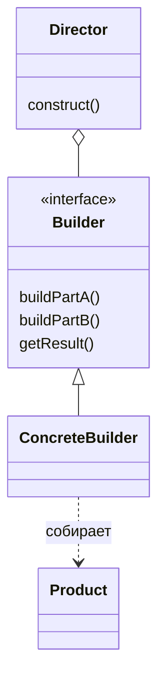

# Строитель (`Builder`)

**Builder** позволяет создавать сложные объекты пошагово, используя один и тот же процесс построения для разных представлений объекта.

## Полезные ссылки

### Официальная документация
- [Java Builder Pattern](https://docs.oracle.com/javase/tutorial/)
- [Effective Java — Item 2](https://www.oreilly.com/library/view/effective-java/9780134686097/)

### См. также
- [[factory-method|Factory Method]] — **Factory Method Pattern**
- [[spring-framework-interview|Spring Core]] — конфигурация и бины
- [[java-basics|Java Basics]] — основы **Java**

## Содержание

- [Что такое Builder?](#что-такое-builder)
  - [Основные характеристики](#основные-характеристики)
  - [Проблемы, которые решает](#проблемы-которые-решает)
- [Когда использовать Builder?](#когда-использовать-builder)
  - [Подходящие сценарии](#подходящие-сценарии)
  - [Признаки необходимости](#признаки-необходимости)
- [Структура паттерна](#структура-паттерна)
  - [Компоненты](#компоненты)
- [Реализация на Java](#реализация-на-java)
  - [Классический Builder](#классический-builder)
  - [Fluent Builder с методом chaining](#fluent-builder-с-методом-chaining)
  - [Builder с Director](#builder-с-director)
- [Продвинутые реализации](#продвинутые-реализации)
  - [1. Generic Builder](#1-generic-builder)
  - [2. Builder с валидацией и пост-обработкой](#2-builder-с-валидацией-и-пост-обработкой)
  - [3. DSL Builder (Domain Specific Language)](#3-dsl-builder-domain-specific-language)
- [Примеры использования](#примеры-использования)
  - [1. HTTP Request Builder](#1-http-request-builder)
  - [2. Database Query Builder](#2-database-query-builder)
  - [3. Configuration Builder](#3-configuration-builder)
- [Лучшие практики](#лучшие-практики)
  - [1. Когда использовать Builder](#1-когда-использовать-builder)
  - [2. Паттерны именования](#2-паттерны-именования)
  - [3. Обработка ошибок](#3-обработка-ошибок)
  - [4. Тестирование Builder](#4-тестирование-builder)
- [Решение проблем](#решение-проблем)
- [Частые вопросы](#частые-вопросы)
- [Заключение](#заключение)

## Суть и запомнить

**Суть в одном предложении:** Пошаговое создание сложного объекта через отдельный объект-строитель; клиент вызывает методы билдера и в конце — build().

**Запомнить:**
- Builder накапливает параметры; build() создаёт неизменяемый объект.
- Fluent-интерфейс (return this) для цепочек вызовов.
- Director опционален — может задавать порядок шагов.

**Когда применять:** много опциональных полей, читаемое создание, валидация до создания.

## Что такое **Builder**?

**Builder** — это порождающий паттерн проектирования, который позволяет создавать сложные объекты пошагово. Вместо большого количества конструкторов или сеттеров, используется строитель, который накапливает конфигурацию и создает объект за один шаг.

### Основные характеристики

1. **Пошаговое построение**: Конфигурация объекта накапливается постепенно
2. **Читаемость**: Строитель позволяет создавать читаемые конструкции
3. **Неизменяемость**: Финальный объект может быть неизменяемым
4. **Валидация**: Возможность валидации перед созданием объекта

### Проблемы, которые решает

Сравнение: телескопический конструктор с множеством параметров vs **Builder** для читаемого создания объекта.

```java
// Плохо: Много параметров в конструкторе (telescoping constructor)
public class User {
    private final String firstName;
    private final String lastName;
    private final String email;
    private final String phone;
    private final LocalDate birthDate;
    private final Address address;
    private final List<String> roles;

    public User(String firstName, String lastName, String email, String phone,
                LocalDate birthDate, Address address, List<String> roles) {
        // Много параметров, трудно читать
        this.firstName = firstName;
        this.lastName = lastName;
        this.email = email;
        this.phone = phone;
        this.birthDate = birthDate;
        this.address = address;
        this.roles = roles != null ? new ArrayList<>(roles) : new ArrayList<>();
    }
}

// Использование
User user = new User("John", "Doe", "john@example.com", "+1234567890",
                    LocalDate.of(1990, 1, 1), address, Arrays.asList("USER", "ADMIN"));
// Не читаемо!

// Хорошо: Использование Builder
User user = new UserBuilder()
    .firstName("John")
    .lastName("Doe")
    .email("john@example.com")
    .phone("+1234567890")
    .birthDate(LocalDate.of(1990, 1, 1))
    .address(address)
    .roles("USER", "ADMIN")
    .build();
// Читаемо и понятно!
```

## Когда использовать **Builder**?

### Подходящие сценарии

- **Сложные объекты**: Объекты с множеством полей или сложной логикой инициализации
- **Необязательные параметры**: Когда многие поля опциональны
- **Неизменяемые объекты**: Для создания **immutable** объектов
- **Читаемость**: Когда важен читаемый код создания объектов
- **Валидация**: Когда нужна валидация перед созданием объекта

### Признаки необходимости

```java
// Признаки: Сложная конструкция объектов
public class Indicators {

    // Много параметров в конструкторе
    public class ComplexObject {
        public ComplexObject(String p1, String p2, int p3, boolean p4,
                           List<String> p5, Map<String, Object> p6) {
            // 6+ параметров - кандидат на Builder
        }
    }

    // Большое количество сеттеров
    public class ConfigurableObject {
        private String prop1, prop2, prop3, prop4, prop5;

        public void setProp1(String p) { this.prop1 = p; }
        public void setProp2(String p) { this.prop2 = p; }
        public void setProp3(String p) { this.prop3 = p; }
        public void setProp4(String p) { this.prop4 = p; }
        public void setProp5(String p) { this.prop5 = p; }
    }

    // Сложная логика инициализации
    public class HeavyObject {
        public HeavyObject() {
            // Долгая инициализация, подключение к ресурсам и т.д.
            connectToDatabase();
            loadConfiguration();
            initializeCache();
            startBackgroundThreads();
        }
    }
}
```

## Структура паттерна



```text
┌─────────────────────────────────────────────────────────────┐
│                    Director (Optional)                      │
│                                                             │
│  ┌─────────────────────────────────────────────────────┐    │
│  │              construct()                          │    │
│  │                                                     │    │
│  │  builder.buildPartA()                              │    │
│  │  builder.buildPartB()                              │    │
│  │  builder.buildPartC()                              │    │
│  │  return builder.getResult()                        │    │
│  └─────────────────────────────────────────────────────┘    │
└─────────────────────────────────────────────────────────────┼─┘
                                                              │
┌─────────────────────────────────────────────────────────────┼─┐
│                    Builder (Abstract)                       │ │
│                                                             │ │
│  ┌─────────────────────────────────────────────────────┐    │ │
│  │              buildPartA()                          │    │ │
│  │              buildPartB()                          │    │ │
│  │              buildPartC()                          │    │ │
│  │              getResult()                           │    │ │
│  └─────────────────────────────────────────────────────┘    │ │
└─────────────────────────────────────────────────────────────┘
                                                              │
┌─────────────────────────────────────────────────────────────┼─┐
│                    ConcreteBuilder                          │ │
│                                                             │ │
│  ┌─────────────────────────────────────────────────────┐    │ │
│  │              buildPartA()                          │    │ │
│  │                result.partA = value                │    │ │
│  │                                                     │    │ │
│  │              buildPartB()                          │    │ │
│  │                result.partB = value                │    │ │
│  │                                                     │    │ │
│  │              getResult()                           │    │ │
│  │                return result                       │    │ │
│  └─────────────────────────────────────────────────────┘    │ │
└─────────────────────────────────────────────────────────────┘
                                                              │
┌─────────────────────────────────────────────────────────────┼─┐
│                    Product                                  │ │
│                                                             │ │
│  ┌─────────────────────────────────────────────────────┐    │ │
│  │              Complex Object                         │    │ │
│  │                                                     │    │ │
│  │  - partA                                           │    │ │
│  │  - partB                                           │    │ │
│  │  - partC                                           │    │ │
│  └─────────────────────────────────────────────────────┘    │ │
└─────────────────────────────────────────────────────────────┘
```

### Компоненты

1. **Builder**: Абстрактный интерфейс для пошагового построения
2. **ConcreteBuilder**: Конкретная реализация строителя
3. **Director**: Опциональный компонент, управляющий процессом построения
4. **Product**: Финальный объект, создаваемый строителем

## Реализация на Java

### Классический **Builder**

```java
// Продукт
public class Computer {
    private final String cpu;
    private final String ram;
    private final String storage;
    private final String gpu;
    private final String motherboard;
    private final boolean hasWiFi;
    private final boolean hasBluetooth;

    // Приватный конструктор
    private Computer(Builder builder) {
        this.cpu = builder.cpu;
        this.ram = builder.ram;
        this.storage = builder.storage;
        this.gpu = builder.gpu;
        this.motherboard = builder.motherboard;
        this.hasWiFi = builder.hasWiFi;
        this.hasBluetooth = builder.hasBluetooth;
    }

    // Геттеры
    public String getCpu() { return cpu; }
    public String getRam() { return ram; }
    public String getStorage() { return storage; }
    public String getGpu() { return gpu; }
    public String getMotherboard() { return motherboard; }
    public boolean hasWiFi() { return hasWiFi; }
    public boolean hasBluetooth() { return hasBluetooth; }

    @Override
    public String toString() {
        return "Computer{" +
                "cpu='" + cpu + '\'' +
                ", ram='" + ram + '\'' +
                ", storage='" + storage + '\'' +
                ", gpu='" + gpu + '\'' +
                ", motherboard='" + motherboard + '\'' +
                ", hasWiFi=" + hasWiFi +
                ", hasBluetooth=" + hasBluetooth +
                '}';
    }

    // Внутренний Builder класс
    public static class Builder {
        private String cpu;
        private String ram;
        private String storage;
        private String gpu;
        private String motherboard;
        private boolean hasWiFi;
        private boolean hasBluetooth;

        public Builder cpu(String cpu) {
            this.cpu = cpu;
            return this;
        }

        public Builder ram(String ram) {
            this.ram = ram;
            return this;
        }

        public Builder storage(String storage) {
            this.storage = storage;
            return this;
        }

        public Builder gpu(String gpu) {
            this.gpu = gpu;
            return this;
        }

        public Builder motherboard(String motherboard) {
            this.motherboard = motherboard;
            return this;
        }

        public Builder wiFi(boolean hasWiFi) {
            this.hasWiFi = hasWiFi;
            return this;
        }

        public Builder bluetooth(boolean hasBluetooth) {
            this.hasBluetooth = hasBluetooth;
            return this;
        }

        // Валидация и построение
        public Computer build() {
            validate();
            return new Computer(this);
        }

        private void validate() {
            if (cpu == null || cpu.isEmpty()) {
                throw new IllegalStateException("CPU is required");
            }
            if (ram == null || ram.isEmpty()) {
                throw new IllegalStateException("RAM is required");
            }
        }
    }
}

// Использование
public class BuilderDemo {
    public static void main(String[] args) {
        // Построение компьютера
        Computer gamingPC = new Computer.Builder()
            .cpu("Intel i9-12900K")
            .ram("32GB DDR5")
            .storage("2TB NVMe SSD")
            .gpu("RTX 4080")
            .motherboard("Z690 AORUS")
            .wiFi(true)
            .bluetooth(true)
            .build();

        Computer officePC = new Computer.Builder()
            .cpu("Intel i5-12400")
            .ram("16GB DDR4")
            .storage("512GB SSD")
            .wiFi(true)
            .build();

        System.out.println("Gaming PC: " + gamingPC);
        System.out.println("Office PC: " + officePC);
    }
}
```

### **Fluent Builder** с методом **chaining**

```java
// Более гибкий Builder с fluent интерфейсом
public class HttpRequest {

    private final String method;
    private final String url;
    private final Map<String, String> headers;
    private final String body;
    private final int timeout;
    private final boolean followRedirects;

    private HttpRequest(Builder builder) {
        this.method = builder.method;
        this.url = builder.url;
        this.headers = new HashMap<>(builder.headers);
        this.body = builder.body;
        this.timeout = builder.timeout;
        this.followRedirects = builder.followRedirects;
    }

    // Геттеры
    public String getMethod() { return method; }
    public String getUrl() { return url; }
    public Map<String, String> getHeaders() { return new HashMap<>(headers); }
    public String getBody() { return body; }
    public int getTimeout() { return timeout; }
    public boolean isFollowRedirects() { return followRedirects; }

    public static class Builder {
        private String method = "GET";
        private String url;
        private Map<String, String> headers = new HashMap<>();
        private String body;
        private int timeout = 30000; // 30 seconds
        private boolean followRedirects = true;

        public Builder method(String method) {
            this.method = method;
            return this;
        }

        public Builder url(String url) {
            this.url = url;
            return this;
        }

        public Builder header(String name, String value) {
            this.headers.put(name, value);
            return this;
        }

        public Builder headers(Map<String, String> headers) {
            this.headers.putAll(headers);
            return this;
        }

        public Builder body(String body) {
            this.body = body;
            return this;
        }

        public Builder timeout(int timeout) {
            this.timeout = timeout;
            return this;
        }

        public Builder followRedirects(boolean followRedirects) {
            this.followRedirects = followRedirects;
            return this;
        }

        // Специализированные методы для удобства
        public Builder get(String url) {
            return method("GET").url(url);
        }

        public Builder post(String url, String body) {
            return method("POST").url(url).body(body);
        }

        public Builder json(String body) {
            return header("Content-Type", "application/json").body(body);
        }

        public Builder bearerAuth(String token) {
            return header("Authorization", "Bearer " + token);
        }

        public HttpRequest build() {
            validate();
            return new HttpRequest(this);
        }

        private void validate() {
            if (url == null || url.isEmpty()) {
                throw new IllegalStateException("URL is required");
            }
            if (timeout <= 0) {
                throw new IllegalStateException("Timeout must be positive");
            }
        }
    }
}

// Использование
public class FluentBuilderDemo {
    public static void main(String[] args) {
        // Простой GET запрос
        HttpRequest getRequest = new HttpRequest.Builder()
            .get("https://api.example.com/users")
            .header("Accept", "application/json")
            .timeout(5000)
            .build();

        // POST запрос с аутентификацией
        HttpRequest postRequest = new HttpRequest.Builder()
            .post("https://api.example.com/users", "{\"name\":\"John\"}")
            .json()
            .bearerAuth("token123")
            .timeout(10000)
            .followRedirects(false)
            .build();

        System.out.println("GET Request: " + getRequest.getMethod() + " " + getRequest.getUrl());
        System.out.println("POST Request: " + postRequest.getMethod() + " " + postRequest.getUrl());
        System.out.println("POST Headers: " + postRequest.getHeaders());
    }
}
```

### **Builder** с **Director**

```java
// Builder с Director для сложных объектов
interface CarBuilder {
    void buildEngine();
    void buildWheels();
    void buildBody();
    void buildInterior();
    Car getResult();
}

class SportsCarBuilder implements CarBuilder {
    private Car car = new Car();

    @Override
    public void buildEngine() {
        car.setEngine("V8 Turbo");
    }

    @Override
    public void buildWheels() {
        car.setWheels("Sport 19\"");
    }

    @Override
    public void buildBody() {
        car.setBody("Carbon Fiber");
    }

    @Override
    public void buildInterior() {
        car.setInterior("Leather Racing Seats");
    }

    @Override
    public Car getResult() {
        return car;
    }
}

class FamilyCarBuilder implements CarBuilder {
    private Car car = new Car();

    @Override
    public void buildEngine() {
        car.setEngine("V4 Hybrid");
    }

    @Override
    public void buildWheels() {
        car.setWheels("Alloy 16\"");
    }

    @Override
    public void buildBody() {
        car.setBody("Steel");
    }

    @Override
    public void buildInterior() {
        car.setInterior("Fabric Seats");
    }

    @Override
    public Car getResult() {
        return car;
    }
}

class Car {
    private String engine;
    private String wheels;
    private String body;
    private String interior;

    // Геттеры и сеттеры
    public void setEngine(String engine) { this.engine = engine; }
    public void setWheels(String wheels) { this.wheels = wheels; }
    public void setBody(String body) { this.body = body; }
    public void setInterior(String interior) { this.interior = interior; }

    @Override
    public String toString() {
        return "Car{engine='" + engine + "', wheels='" + wheels +
               "', body='" + body + "', interior='" + interior + "'}";
    }
}

class CarDirector {
    public Car constructSportsCar(CarBuilder builder) {
        builder.buildEngine();
        builder.buildWheels();
        builder.buildBody();
        builder.buildInterior();
        return builder.getResult();
    }

    public Car constructBasicCar(CarBuilder builder) {
        builder.buildEngine();
        builder.buildWheels();
        return builder.getResult();
    }
}

// Использование с Director
public class DirectorBuilderDemo {
    public static void main(String[] args) {
        CarDirector director = new CarDirector();

        Car sportsCar = director.constructSportsCar(new SportsCarBuilder());
        Car familyCar = director.constructSportsCar(new FamilyCarBuilder());

        System.out.println("Sports Car: " + sportsCar);
        System.out.println("Family Car: " + familyCar);

        // Без director
        Car basicCar = new FamilyCarBuilder().getResult();
        director.constructBasicCar(basicCar); // Продолжаем построение
        System.out.println("Basic Car: " + basicCar);
    }
}
```

## Продвинутые реализации

### 1. **Generic Builder**

```java
// Обобщенный Builder для любых объектов
public abstract class GenericBuilder<T> {

    protected abstract T build();

    @SuppressWarnings("unchecked")
    protected <V extends GenericBuilder<T>> V self() {
        return (V) this;
    }

    // Метод для копирования свойств из существующего объекта
    protected void copyProperties(Object source, Object target) {
        // Используем reflection для копирования
        try {
            Class<?> sourceClass = source.getClass();
            Class<?> targetClass = target.getClass();

            for (java.lang.reflect.Field field : sourceClass.getDeclaredFields()) {
                if (java.lang.reflect.Modifier.isStatic(field.getModifiers())) {
                    continue;
                }

                field.setAccessible(true);
                Object value = field.get(source);

                try {
                    java.lang.reflect.Field targetField = targetClass.getDeclaredField(field.getName());
                    targetField.setAccessible(true);
                    targetField.set(target, value);
                } catch (NoSuchFieldException e) {
                    // Поле не существует в target классе, пропускаем
                }
            }
        } catch (Exception e) {
            throw new RuntimeException("Failed to copy properties", e);
        }
    }
}

// Пример использования обобщенного Builder
class Person {
    private String name;
    private int age;
    private String email;

    public static PersonBuilder builder() {
        return new PersonBuilder();
    }

    public static class PersonBuilder extends GenericBuilder<Person> {
        private String name;
        private int age;
        private String email;

        public PersonBuilder name(String name) {
            this.name = name;
            return this;
        }

        public PersonBuilder age(int age) {
            this.age = age;
            return this;
        }

        public PersonBuilder email(String email) {
            this.email = email;
            return this;
        }

        // Создание из существующего объекта
        public PersonBuilder from(Person person) {
            copyProperties(person, this);
            return this;
        }

        @Override
        protected Person build() {
            Person person = new Person();
            copyProperties(this, person);
            return person;
        }
    }

    // Геттеры (сеттеров нет - immutable)
    public String getName() { return name; }
    public int getAge() { return age; }
    public String getEmail() { return email; }

    @Override
    public String toString() {
        return "Person{name='" + name + "', age=" + age + ", email='" + email + "'}";
    }
}

// Использование
public class GenericBuilderDemo {
    public static void main(String[] args) {
        Person person = Person.builder()
            .name("John Doe")
            .age(30)
            .email("john@example.com")
            .build();

        // Создание копии с изменениями
        Person updatedPerson = Person.builder()
            .from(person)
            .age(31)
            .build();

        System.out.println("Original: " + person);
        System.out.println("Updated: " + updatedPerson);
    }
}
```

### 2. **Builder** с валидацией и пост-обработкой

```java
// Builder с расширенной функциональностью
public class ValidatedBuilder<T> {

    private final List<Consumer<T>> validators = new ArrayList<>();
    private final List<Function<T, T>> postProcessors = new ArrayList<>();

    protected void addValidator(Consumer<T> validator) {
        validators.add(validator);
    }

    protected void addPostProcessor(Function<T, T> postProcessor) {
        postProcessors.add(postProcessor);
    }

    protected T validateAndProcess(T object) {
        // Валидация
        for (Consumer<T> validator : validators) {
            validator.accept(object);
        }

        // Пост-обработка
        T result = object;
        for (Function<T, T> processor : postProcessors) {
            result = processor.apply(result);
        }

        return result;
    }
}

// Конкретный Builder с валидацией
class UserAccount {

    private final String username;
    private final String email;
    private final String password;
    private final boolean active;
    private final LocalDateTime createdAt;

    private UserAccount(Builder builder) {
        this.username = builder.username;
        this.email = builder.email;
        this.password = builder.password;
        this.active = builder.active;
        this.createdAt = builder.createdAt;
    }

    public static class Builder extends ValidatedBuilder<UserAccount> {
        private String username;
        private String email;
        private String password;
        private boolean active = true;
        private LocalDateTime createdAt = LocalDateTime.now();

        public Builder() {
            // Добавляем валидаторы
            addValidator(this::validateUsername);
            addValidator(this::validateEmail);
            addValidator(this::validatePassword);

            // Добавляем пост-обработку
            addPostProcessor(this::normalizeEmail);
            addPostProcessor(this::hashPassword);
        }

        public Builder username(String username) {
            this.username = username;
            return this;
        }

        public Builder email(String email) {
            this.email = email;
            return this;
        }

        public Builder password(String password) {
            this.password = password;
            return this;
        }

        public Builder active(boolean active) {
            this.active = active;
            return this;
        }

        public UserAccount build() {
            return validateAndProcess(new UserAccount(this));
        }

        // Валидаторы
        private void validateUsername(UserAccount account) {
            if (account.username == null || account.username.length() < 3) {
                throw new IllegalArgumentException("Username must be at least 3 characters");
            }
            if (!account.username.matches("^[a-zA-Z0-9_]+$")) {
                throw new IllegalArgumentException("Username contains invalid characters");
            }
        }

        private void validateEmail(UserAccount account) {
            if (account.email == null || !account.email.contains("@")) {
                throw new IllegalArgumentException("Invalid email address");
            }
        }

        private void validatePassword(UserAccount account) {
            if (account.password == null || account.password.length() < 8) {
                throw new IllegalArgumentException("Password must be at least 8 characters");
            }
        }

        // Пост-процессоры
        private UserAccount normalizeEmail(UserAccount account) {
            // Создаем новый объект с нормализованным email
            return new UserAccount(new Builder()
                .username(account.username)
                .email(account.email.toLowerCase().trim())
                .password(account.password)
                .active(account.active)
                .createdAt(account.createdAt));
        }

        private UserAccount hashPassword(UserAccount account) {
            // Имитация хэширования пароля
            String hashedPassword = "hashed_" + account.password;
            return new UserAccount(new Builder()
                .username(account.username)
                .email(account.email)
                .password(hashedPassword)
                .active(account.active)
                .createdAt(account.createdAt));
        }
    }

    // Геттеры
    public String getUsername() { return username; }
    public String getEmail() { return email; }
    public String getPassword() { return password; }
    public boolean isActive() { return active; }
    public LocalDateTime getCreatedAt() { return createdAt; }
}

// Использование
public class ValidatedBuilderDemo {
    public static void main(String[] args) {
        try {
            UserAccount user = UserAccount.Builder()
                .username("john_doe")
                .email("JOHN@EXAMPLE.COM")
                .password("mypassword123")
                .build();

            System.out.println("Created user: " + user.getUsername() +
                             ", email: " + user.getEmail());

        } catch (IllegalArgumentException e) {
            System.err.println("Validation error: " + e.getMessage());
        }
    }
}
```

### 3. DSL Builder (Domain Specific Language)

```java
// Builder в стиле DSL (Domain Specific Language)
public class QueryBuilder {

    public static SelectQuery select(String... columns) {
        return new SelectQuery(columns);
    }

    public static class SelectQuery {
        private final List<String> columns;
        private String table;
        private final List<String> whereConditions = new ArrayList<>();
        private final List<String> orderBy = new ArrayList<>();
        private Integer limit;
        private Integer offset;

        public SelectQuery(String... columns) {
            this.columns = Arrays.asList(columns);
        }

        public SelectQuery from(String table) {
            this.table = table;
            return this;
        }

        public SelectQuery where(String condition) {
            whereConditions.add(condition);
            return this;
        }

        public SelectQuery and(String condition) {
            return where(condition);
        }

        public SelectQuery or(String condition) {
            whereConditions.add("OR " + condition);
            return this;
        }

        public SelectQuery orderBy(String column) {
            orderBy.add(column);
            return this;
        }

        public SelectQuery orderByDesc(String column) {
            orderBy.add(column + " DESC");
            return this;
        }

        public SelectQuery limit(int limit) {
            this.limit = limit;
            return this;
        }

        public SelectQuery offset(int offset) {
            this.offset = offset;
            return this;
        }

        public String build() {
            StringBuilder sql = new StringBuilder("SELECT ");
            sql.append(String.join(", ", columns));
            sql.append(" FROM ").append(table);

            if (!whereConditions.isEmpty()) {
                sql.append(" WHERE ").append(String.join(" AND ", whereConditions));
            }

            if (!orderBy.isEmpty()) {
                sql.append(" ORDER BY ").append(String.join(", ", orderBy));
            }

            if (limit != null) {
                sql.append(" LIMIT ").append(limit);
            }

            if (offset != null) {
                sql.append(" OFFSET ").append(offset);
            }

            return sql.toString();
        }
    }
}

// Использование DSL Builder
public class DSLBuilderDemo {
    public static void main(String[] args) {
        // Построение SQL запроса в стиле DSL
        String sql = QueryBuilder.select("id", "name", "email")
            .from("users")
            .where("active = true")
            .and("age > 18")
            .orderBy("name")
            .limit(10)
            .offset(20)
            .build();

        System.out.println("Generated SQL: " + sql);

        // Более сложный пример
        String complexSql = QueryBuilder.select("*")
            .from("orders")
            .where("status = 'PENDING'")
            .and("created_at > '2023-01-01'")
            .orderByDesc("priority")
            .orderBy("created_at")
            .limit(50)
            .build();

        System.out.println("Complex SQL: " + complexSql);
    }
}
```

## Примеры использования

### 1. **HTTP Request Builder**

```java
@Service
public class HttpRequestBuilderService {

    private final RestTemplate restTemplate;

    public HttpRequestBuilderService(RestTemplate restTemplate) {
        this.restTemplate = restTemplate;
    }

    public <T> T executeRequest(HttpRequestConfig config, Class<T> responseType) {
        // Используем Builder для конфигурации HTTP запроса
        RequestEntity<?> requestEntity = RequestEntityBuilder.create()
            .method(config.getMethod())
            .url(config.getUrl())
            .headers(config.getHeaders())
            .body(config.getBody())
            .build();

        ResponseEntity<T> response = restTemplate.exchange(requestEntity, responseType);

        if (config.isThrowOnError() && !response.getStatusCode().is2xxSuccessful()) {
            throw new HttpClientException("Request failed: " + response.getStatusCode());
        }

        return response.getBody();
    }

    // Builder для HTTP запросов
    public static class RequestEntityBuilder {
        private HttpMethod method = HttpMethod.GET;
        private String url;
        private final HttpHeaders headers = new HttpHeaders();
        private Object body;

        public static RequestEntityBuilder create() {
            return new RequestEntityBuilder();
        }

        public RequestEntityBuilder method(HttpMethod method) {
            this.method = method;
            return this;
        }

        public RequestEntityBuilder url(String url) {
            this.url = url;
            return this;
        }

        public RequestEntityBuilder header(String name, String value) {
            headers.add(name, value);
            return this;
        }

        public RequestEntityBuilder headers(Map<String, String> headers) {
            headers.forEach(this.headers::add);
            return this;
        }

        public RequestEntityBuilder contentType(MediaType contentType) {
            headers.setContentType(contentType);
            return this;
        }

        public RequestEntityBuilder accept(MediaType... mediaTypes) {
            headers.setAccept(Arrays.asList(mediaTypes));
            return this;
        }

        public RequestEntityBuilder bearerAuth(String token) {
            headers.setBearerAuth(token);
            return this;
        }

        public RequestEntityBuilder basicAuth(String username, String password) {
            headers.setBasicAuth(username, password);
            return this;
        }

        public RequestEntityBuilder body(Object body) {
            this.body = body;
            return this;
        }

        public RequestEntity<?> build() {
            return new RequestEntity<>(body, headers, method, URI.create(url));
        }
    }

    // Конфигурационный класс
    @Data
    @Builder
    public static class HttpRequestConfig {
        private HttpMethod method;
        private String url;
        private HttpHeaders headers;
        private Object body;
        private boolean throwOnError;

        public static HttpRequestConfigBuilder builder() {
            return new HttpRequestConfigBuilder();
        }

        public static class HttpRequestConfigBuilder {
            private HttpMethod method = HttpMethod.GET;
            private HttpHeaders headers = new HttpHeaders();
            private boolean throwOnError = true;

            public HttpRequestConfigBuilder method(HttpMethod method) {
                this.method = method;
                return this;
            }

            public HttpRequestConfigBuilder url(String url) {
                this.url = url;
                return this;
            }

            public HttpRequestConfigBuilder header(String name, String value) {
                headers.add(name, value);
                return this;
            }

            public HttpRequestConfigBuilder json() {
                headers.setContentType(MediaType.APPLICATION_JSON);
                return this;
            }

            public HttpRequestConfigBuilder bearerAuth(String token) {
                headers.setBearerAuth(token);
                return this;
            }

            public HttpRequestConfigBuilder body(Object body) {
                this.body = body;
                return this;
            }

            public HttpRequestConfigBuilder throwOnError(boolean throwOnError) {
                this.throwOnError = throwOnError;
                return this;
            }

            public HttpRequestConfig build() {
                return new HttpRequestConfig(method, url, headers, body, throwOnError);
            }
        }
    }
}
```

### 2. **Database Query Builder**

```java
@Repository
public class DynamicQueryBuilder {

    private final JdbcTemplate jdbcTemplate;

    public DynamicQueryBuilder(JdbcTemplate jdbcTemplate) {
        this.jdbcTemplate = jdbcTemplate;
    }

    public List<User> findUsers(UserQuery query) {
        QueryComponents components = query.build();

        String sql = "SELECT * FROM users WHERE " + components.getWhereClause();
        if (components.getOrderBy() != null) {
            sql += " ORDER BY " + components.getOrderBy();
        }
        if (components.getLimit() != null) {
            sql += " LIMIT " + components.getLimit();
        }

        return jdbcTemplate.query(sql, components.getParameters(),
            (rs, rowNum) -> new User(
                rs.getLong("id"),
                rs.getString("name"),
                rs.getString("email"),
                rs.getBoolean("active")
            ));
    }

    // Builder для запросов
    public static class UserQuery {
        private final List<String> conditions = new ArrayList<>();
        private final Map<String, Object> parameters = new LinkedHashMap<>();
        private String orderBy;
        private Integer limit;

        public static UserQuery builder() {
            return new UserQuery();
        }

        public UserQuery active(boolean active) {
            conditions.add("active = ?");
            parameters.put("active", active);
            return this;
        }

        public UserQuery nameLike(String name) {
            conditions.add("name LIKE ?");
            parameters.put("name", "%" + name + "%");
            return this;
        }

        public UserQuery emailDomain(String domain) {
            conditions.add("email LIKE ?");
            parameters.put("email", "%@" + domain);
            return this;
        }

        public UserQuery createdAfter(LocalDate date) {
            conditions.add("created_at >= ?");
            parameters.put("createdAfter", date);
            return this;
        }

        public UserQuery createdBefore(LocalDate date) {
            conditions.add("created_at <= ?");
            parameters.put("createdBefore", date);
            return this;
        }

        public UserQuery orderByName() {
            this.orderBy = "name";
            return this;
        }

        public UserQuery orderByCreatedDate() {
            this.orderBy = "created_at DESC";
            return this;
        }

        public UserQuery limit(int limit) {
            this.limit = limit;
            return this;
        }

        public QueryComponents build() {
            String whereClause = conditions.isEmpty() ? "1=1" : String.join(" AND ", conditions);
            Object[] params = parameters.values().toArray();
            return new QueryComponents(whereClause, orderBy, limit, params);
        }
    }

    // Компоненты запроса
    public static class QueryComponents {
        private final String whereClause;
        private final String orderBy;
        private final Integer limit;
        private final Object[] parameters;

        public QueryComponents(String whereClause, String orderBy, Integer limit, Object[] parameters) {
            this.whereClause = whereClause;
            this.orderBy = orderBy;
            this.limit = limit;
            this.parameters = parameters;
        }

        public String getWhereClause() { return whereClause; }
        public String getOrderBy() { return orderBy; }
        public Integer getLimit() { return limit; }
        public Object[] getParameters() { return parameters; }
    }
}

// Модель User
public class User {
    private final Long id;
    private final String name;
    private final String email;
    private final boolean active;

    public User(Long id, String name, String email, boolean active) {
        this.id = id;
        this.name = name;
        this.email = email;
        this.active = active;
    }

    // Геттеры
}
```

### 3. **Configuration Builder**

```java
@Configuration
public class ApplicationConfig {

    @Bean
    public DataSource dataSource(DatabaseConfig config) {
        return DatabaseBuilder.create()
            .url(config.getUrl())
            .username(config.getUsername())
            .password(config.getPassword())
            .driverClassName(config.getDriverClassName())
            .maxPoolSize(config.getMaxPoolSize())
            .minIdle(config.getMinIdle())
            .connectionTimeout(config.getConnectionTimeout())
            .idleTimeout(config.getIdleTimeout())
            .build();
    }

    @Bean
    public CacheManager cacheManager(CacheConfig config) {
        return CacheBuilder.create()
            .ttl(config.getTtl())
            .maxSize(config.getMaxSize())
            .initialCapacity(config.getInitialCapacity())
            .concurrencyLevel(config.getConcurrencyLevel())
            .recordStats(config.isRecordStats())
            .build();
    }

    // Generic Builder для DataSource
    public static class DatabaseBuilder {
        private String url;
        private String username;
        private String password;
        private String driverClassName;
        private int maxPoolSize = 10;
        private int minIdle = 2;
        private long connectionTimeout = 30000;
        private long idleTimeout = 600000;

        public static DatabaseBuilder create() {
            return new DatabaseBuilder();
        }

        public DatabaseBuilder url(String url) {
            this.url = url;
            return this;
        }

        public DatabaseBuilder credentials(String username, String password) {
            this.username = username;
            this.password = password;
            return this;
        }

        public DatabaseBuilder driverClassName(String driverClassName) {
            this.driverClassName = driverClassName;
            return this;
        }

        public DatabaseBuilder maxPoolSize(int maxPoolSize) {
            this.maxPoolSize = maxPoolSize;
            return this;
        }

        public DatabaseBuilder minIdle(int minIdle) {
            this.minIdle = minIdle;
            return this;
        }

        public DatabaseBuilder connectionTimeout(long connectionTimeout) {
            this.connectionTimeout = connectionTimeout;
            return this;
        }

        public DatabaseBuilder idleTimeout(long idleTimeout) {
            this.idleTimeout = idleTimeout;
            return this;
        }

        // Специализированные методы
        public DatabaseBuilder h2() {
            return driverClassName("org.h2.Driver")
                .maxPoolSize(5)
                .minIdle(1);
        }

        public DatabaseBuilder postgresql() {
            return driverClassName("org.postgresql.Driver")
                .maxPoolSize(20)
                .minIdle(5);
        }

        public HikariDataSource build() {
            validate();

            HikariDataSource dataSource = new HikariDataSource();
            dataSource.setJdbcUrl(url);
            dataSource.setUsername(username);
            dataSource.setPassword(password);
            dataSource.setDriverClassName(driverClassName);
            dataSource.setMaximumPoolSize(maxPoolSize);
            dataSource.setMinimumIdle(minIdle);
            dataSource.setConnectionTimeout(connectionTimeout);
            dataSource.setIdleTimeout(idleTimeout);

            return dataSource;
        }

        private void validate() {
            if (url == null || url.isEmpty()) {
                throw new IllegalStateException("Database URL is required");
            }
            if (driverClassName == null || driverClassName.isEmpty()) {
                throw new IllegalStateException("Driver class name is required");
            }
        }
    }

    // Builder для Cache
    public static class CacheBuilder {
        private Duration ttl = Duration.ofHours(1);
        private long maxSize = 1000;
        private int initialCapacity = 100;
        private int concurrencyLevel = 4;
        private boolean recordStats = false;

        public static CacheBuilder create() {
            return new CacheBuilder();
        }

        public CacheBuilder ttl(Duration ttl) {
            this.ttl = ttl;
            return this;
        }

        public CacheBuilder maxSize(long maxSize) {
            this.maxSize = maxSize;
            return this;
        }

        public CacheBuilder initialCapacity(int initialCapacity) {
            this.initialCapacity = initialCapacity;
            return this;
        }

        public CacheBuilder concurrencyLevel(int concurrencyLevel) {
            this.concurrencyLevel = concurrencyLevel;
            return this;
        }

        public CacheBuilder recordStats(boolean recordStats) {
            this.recordStats = recordStats;
            return this;
        }

        public CaffeineCacheManager build() {
            Caffeine<Object, Object> caffeine = Caffeine.newBuilder()
                .expireAfterWrite(ttl)
                .maximumSize(maxSize)
                .initialCapacity(initialCapacity)
                .concurrencyLevel(concurrencyLevel);

            if (recordStats) {
                caffeine.recordStats();
            }

            CaffeineCacheManager cacheManager = new CaffeineCacheManager();
            cacheManager.setCaffeine(caffeine);
            return cacheManager;
        }
    }
}
```

## Лучшие практики

### 1. Когда использовать **Builder**

```java
public class BuilderGuidelines {

    // ✅ Используйте Builder когда:

    // 1. Много параметров (4+)
    public class MultiParamObject {
        private final String param1, param2, param3, param4, param5;

        // Builder лучше чем конструктор с 5 параметрами
        public static Builder builder() {
            return new Builder();
        }
    }

    // 2. Опциональные параметры
    public class ObjectWithOptionals {
        private final String required;
        private final String optional1, optional2; // могут быть null

        // Builder позволяет не указывать опциональные параметры
    }

    // 3. Неизменяемые объекты
    public class ImmutableObject {
        private final String field1;
        private final int field2;
        private final List<String> field3;

        // Builder собирает состояние, затем создает immutable объект
    }

    // 4. Сложная логика создания
    public class ComplexObject {
        // Требует валидации, трансформации, инициализации
        public static Builder builder() {
            return new Builder();
        }
    }

    // ❌ НЕ используйте Builder когда:

    // 1. Маленькие простые объекты
    public class SimpleObject {
        public SimpleObject(String name, int value) {
            // Обычный конструктор лучше
        }
    }

    // 2. Все параметры обязательные и простые
    public class Point {
        public Point(int x, int y) {
            // Конструктор лучше чем Builder
        }
    }
}
```

### 2. Паттерны именования

```java
public class BuilderNamingPatterns {

    // Паттерн 1: Builder как внутренний класс
    public class Product1 {
        public static class Builder {
            // методы builder
            public Product1 build() { return new Product1(this); }
        }

        public static Builder builder() {
            return new Builder();
        }
    }

    // Паттерн 2: Builder как статический метод
    public class Product2 {
        public static Product2Builder builder() {
            return new Product2Builder();
        }
    }

    public static class Product2Builder {
        // методы builder
        public Product2 build() { return new Product2(); }
    }

    // Паттерн 3: Fluent интерфейс
    public class FluentBuilder {
        public FluentBuilder field1(String value) {
            // setter logic
            return this;
        }

        public FluentBuilder field2(int value) {
            // setter logic
            return this;
        }

        public Product build() {
            return new Product();
        }
    }

    // Соглашения об именовании:
    // - builder() - фабричный метод для создания Builder
    // - build() - финальный метод создания объекта
    // - withField() / field() - методы установки полей
    // - create() - альтернатива build() для некоторых случаев
}
```

### 3. Обработка ошибок

```java
public class BuilderErrorHandling {

    // Валидация в Builder
    public class ValidatingBuilder {

        public Product build() {
            validate();
            return new Product(this);
        }

        private void validate() {
            // Валидация всех полей
            if (field1 == null) {
                throw new IllegalStateException("field1 is required");
            }
            if (field2 < 0) {
                throw new IllegalArgumentException("field2 must be positive");
            }
        }
    }

    // Graceful error handling
    public class GracefulBuilder {

        private final List<String> errors = new ArrayList<>();

        public Product build() {
            validate();

            if (!errors.isEmpty()) {
                throw new ValidationException("Validation failed: " + String.join(", ", errors));
            }

            return new Product(this);
        }

        private void validate() {
            if (field1 == null) {
                errors.add("field1 is required");
            }
            if (field2 < 0) {
                errors.add("field2 must be positive, got: " + field2);
            }
        }

        // Метод для проверки возможности построения
        public boolean canBuild() {
            validate();
            return errors.isEmpty();
        }

        // Получение ошибок валидации
        public List<String> getValidationErrors() {
            validate();
            return new ArrayList<>(errors);
        }
    }

    // Builder с warnings
    public class WarningBuilder {

        private final List<String> warnings = new ArrayList<>();

        public Product build() {
            validate();

            if (!warnings.isEmpty()) {
                warnings.forEach(warning ->
                    System.out.println("Warning: " + warning));
            }

            return new Product(this);
        }

        private void validate() {
            if (field1 == null) {
                throw new IllegalStateException("field1 is required");
            }
            if (field2 > 1000) {
                warnings.add("field2 is unusually large: " + field2);
            }
        }
    }
}
```

### 4. Тестирование **Builder**

```java
@ExtendWith(MockitoExtension.class)
public class BuilderTest {

    @Test
    void shouldBuildObjectWithRequiredFields() {
        Product product = Product.builder()
            .name("Test Product")
            .price(100.0)
            .build();

        assertNotNull(product);
        assertEquals("Test Product", product.getName());
        assertEquals(100.0, product.getPrice());
    }

    @Test
    void shouldBuildObjectWithAllFields() {
        Product product = Product.builder()
            .name("Test Product")
            .price(100.0)
            .description("Test Description")
            .category("Test Category")
            .tags(Arrays.asList("tag1", "tag2"))
            .active(true)
            .build();

        assertNotNull(product);
        assertEquals("Test Product", product.getName());
        assertEquals("Test Description", product.getDescription());
        assertTrue(product.isActive());
    }

    @Test
    void shouldFailValidationForMissingRequiredFields() {
        IllegalStateException exception = assertThrows(IllegalStateException.class, () -> {
            Product.builder()
                .price(100.0)
                .build(); // missing name
        });

        assertTrue(exception.getMessage().contains("name"));
    }

    @Test
    void shouldFailValidationForInvalidValues() {
        IllegalArgumentException exception = assertThrows(IllegalArgumentException.class, () -> {
            Product.builder()
                .name("Test Product")
                .price(-100.0) // invalid price
                .build();
        });

        assertTrue(exception.getMessage().contains("price"));
    }

    @Test
    void shouldApplyDefaultsForOptionalFields() {
        Product product = Product.builder()
            .name("Test Product")
            .price(100.0)
            .build();

        assertTrue(product.isActive()); // default value
        assertNotNull(product.getTags()); // default empty list
        assertTrue(product.getTags().isEmpty());
    }

    @Test
    void shouldCreateCopyWithModifications() {
        Product original = Product.builder()
            .name("Original")
            .price(100.0)
            .description("Original description")
            .build();

        Product copy = Product.builder()
            .from(original)
            .name("Modified")
            .price(200.0)
            .build();

        assertEquals("Modified", copy.getName());
        assertEquals(200.0, copy.getPrice());
        assertEquals("Original description", copy.getDescription()); // unchanged
    }

    @Test
    void shouldValidateBeforeBuild() {
        Product.Builder builder = Product.builder()
            .name("Test Product")
            .price(100.0);

        assertTrue(builder.canBuild());

        builder.price(-100.0); // make invalid

        assertFalse(builder.canBuild());
        assertFalse(builder.getValidationErrors().isEmpty());
    }

    // Test Product class
    static class Product {
        private final String name;
        private final double price;
        private final String description;
        private final String category;
        private final List<String> tags;
        private final boolean active;

        private Product(Builder builder) {
            this.name = builder.name;
            this.price = builder.price;
            this.description = builder.description;
            this.category = builder.category;
            this.tags = builder.tags != null ? new ArrayList<>(builder.tags) : new ArrayList<>();
            this.active = builder.active;
        }

        public static Builder builder() {
            return new Builder();
        }

        // Getters
        public String getName() { return name; }
        public double getPrice() { return price; }
        public String getDescription() { return description; }
        public String getCategory() { return category; }
        public List<String> getTags() { return new ArrayList<>(tags); }
        public boolean isActive() { return active; }

        public static class Builder {
            private String name;
            private double price;
            private String description;
            private String category;
            private List<String> tags;
            private boolean active = true;

            private final List<String> validationErrors = new ArrayList<>();

            public Builder name(String name) {
                this.name = name;
                return this;
            }

            public Builder price(double price) {
                this.price = price;
                return this;
            }

            public Builder description(String description) {
                this.description = description;
                return this;
            }

            public Builder category(String category) {
                this.category = category;
                return this;
            }

            public Builder tags(List<String> tags) {
                this.tags = tags;
                return this;
            }

            public Builder active(boolean active) {
                this.active = active;
                return this;
            }

            public Builder from(Product product) {
                this.name = product.name;
                this.price = product.price;
                this.description = product.description;
                this.category = product.category;
                this.tags = product.tags;
                this.active = product.active;
                return this;
            }

            public boolean canBuild() {
                validate();
                return validationErrors.isEmpty();
            }

            public List<String> getValidationErrors() {
                validate();
                return new ArrayList<>(validationErrors);
            }

            public Product build() {
                validate();

                if (!validationErrors.isEmpty()) {
                    throw new IllegalStateException("Validation failed: " +
                        String.join(", ", validationErrors));
                }

                return new Product(this);
            }

            private void validate() {
                validationErrors.clear();

                if (name == null || name.trim().isEmpty()) {
                    validationErrors.add("name is required");
                }

                if (price < 0) {
                    validationErrors.add("price must be non-negative");
                }

                if (price > 10000) {
                    validationErrors.add("price must be less than 10000");
                }
            }
        }
    }
}
```


## Решение проблем

| Симптом | Возможная причина | Что делать |
|--------|-------------------|------------|
| Объект создаётся в невалидном состоянии | build() без валидации | Добавить проверки в build(), бросать IllegalStateException при нарушении |
| Строитель переиспользуется после build() | Нет защиты от повторного вызова | Делать build() одноразовым: сбрасывать состояние или бросать исключение |
| Слишком много параметров в конструкторе | Раздутый конструктор | Ввести Builder с fluent-методами для опциональных параметров |

## Частые вопросы

**Builder vs Constructor с множеством параметров?** Builder улучшает читаемость при 4+ параметрах, особенно когда многие опциональны. Именованные вызовы вида `.withEmail()` понятнее позиционных аргументов.

**Нужен ли Director?** Director полезен, когда порядок шагов важен и повторяется. Для простых объектов достаточно fluent Builder без Director.


## Заключение

**Builder** паттерн — один из наиболее полезных паттернов для создания сложных объектов. Он обеспечивает читаемость кода, гибкость конфигурации и возможность валидации.

**Ключевые преимущества:**
- **Читаемость**: Строитель позволяет создавать понятные конструкции объектов
- **Гибкость**: Поддержка опциональных параметров и сложной логики
- **Неизменяемость**: Финальный объект может быть **immutable**
- **Валидация**: Возможность проверки корректности перед созданием

**Используйте Builder, когда:**
- Объект имеет много параметров(4+)
- Многие параметры опциональны
- Нужна валидация при создании объекта
- Важна читаемость кода создания объектов
- Объект должен быть неизменяемым

**Builder** часто комбинируется с другими паттернами:
- **Factory Method**: Для создания строителей
- **Abstract Factory**: Для создания семейств связанных объектов
- **Prototype**: Для копирования существующих объектов с модификациями