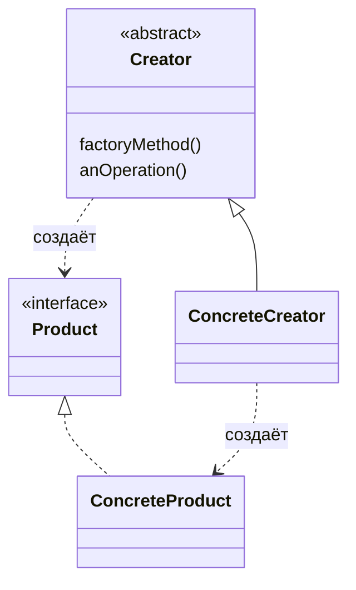

# Фабричный метод (Factory Method)

**Factory Method** определяет интерфейс для создания объектов, но позволяет подклассам решать, какой класс инстанцировать.

## Полезные ссылки

### Официальная документация
- [Java Factory Pattern](https://docs.oracle.com/javase/tutorial/)
- [Spring FactoryBean](https://docs.spring.io/spring-framework/reference/core/beans/java/factory-bean.html)

### См. также
- [Abstract Factory](abstract-factory.md) — Abstract Factory
- [Spring Core](../../interview/frameworks/spring/spring-framework-interview.md) — IoC и бины
- [Java Basics](../../languages/java/java-basics.md) — Java Basics

- [Одиночка (Singleton)](singleton.md)
- [Строитель (Builder)](builder.md)
## Содержание

- [Суть и запомнить](#суть-и-запомнить)
- [Что такое Factory Method?](#что-такое-factory-method)
  - [Основные характеристики](#основные-характеристики)
  - [Проблемы, которые решает](#проблемы-которые-решает)
- [Когда использовать Factory Method?](#когда-использовать-factory-method)
  - [Подходящие сценарии](#подходящие-сценарии)
  - [Признаки необходимости](#признаки-необходимости)
- [Структура паттерна](#структура-паттерна)
  - [Компоненты](#компоненты)
- [Реализация на Java](#реализация-на-java)
  - [Базовая реализация](#базовая-реализация)
  - [Параметризованный Factory Method](#параметризованный-factory-method)
  - [Factory Method с шаблонным методом](#factory-method-с-шаблонным-методом)
- [Продвинутые реализации](#продвинутые-реализации)
  - [1. Generic Factory Method](#1-generic-factory-method)
  - [2. ServiceLoader Factory](#2-serviceloader-factory)
  - [3. Builder + Factory Method](#3-builder-factory-method)
- [Примеры использования](#примеры-использования)
  - [1. Spring Bean Factory](#1-spring-bean-factory)
  - [2. HTTP Client Factory](#2-http-client-factory)
  - [3. Message Factory](#3-message-factory)
- [Лучшие практики](#лучшие-практики)
  - [1. Выбор между Factory Method и Abstract Factory](#1-выбор-между-factory-method-и-abstract-factory)
  - [2. Обработка ошибок в фабриках](#2-обработка-ошибок-в-фабриках)
  - [3. Тестирование фабрик](#3-тестирование-фабрик)
- [Решение проблем](#решение-проблем)
- [Частые вопросы](#частые-вопросы)
- [Заключение](#заключение)

## Суть и запомнить

**Суть в одном предложении:** Интерфейс создания объекта в базовом классе; конкретный класс продукта выбирает подкласс.

**Запомнить:**
- Creator вызывает factoryMethod(); подкласс возвращает нужный Product.
- Избавляет от new и switch по типу в клиенте.
- Отличие от Abstract Factory: один продукт на иерархию, а не семейство.

**Когда применять:** тип создаваемого объекта зависит от подкласса или конфигурации.

## Что такое Factory Method?

**Factory Method** — это порождающий паттерн проектирования, который определяет интерфейс для создания объектов, но позволяет подклассам решать, какой класс инстанцировать. Фабричный метод делегирует создание объектов подклассам.

### Основные характеристики

1. **Абстракция создания**: Интерфейс для создания объектов
2. **Наследование**: Подклассы определяют конкретные типы
3. **Расширяемость**: Легко добавлять новые типы продуктов
4. **Инкапсуляция**: Скрытие логики создания объектов

### Проблемы, которые решает

Сравнение: жёсткая зависимость от классов vs абстракция через **Factory Method**.

```java
// Плохо: Жесткая зависимость от конкретных классов
public class DocumentProcessor {

    public void processDocument(String type) {
        Document doc;

        if ("PDF".equals(type)) {
            doc = new PDFDocument(); // Жесткая зависимость
        } else if ("WORD".equals(type)) {
            doc = new WordDocument(); // Жесткая зависимость
        } else {
            throw new IllegalArgumentException("Unknown document type");
        }

        doc.open();
        doc.process();
        doc.close();
    }
}

// Хорошо: Использование Factory Method
public class DocumentProcessor {

    public void processDocument(String type) {
        Document doc = DocumentFactory.createDocument(type); // Абстракция
        doc.open();
        doc.process();
        doc.close();
    }
}
```

## Когда использовать Factory Method?

### Подходящие сценарии

- **Разные типы объектов**: Когда нужно создавать разные объекты на основе условий
- **Библиотеки и фреймворки**: Когда пользователи должны создавать объекты определенного типа
- **Конфигурируемые системы**: Когда тип создаваемого объекта зависит от конфигурации
- **Тестирование**: Для создания **mock** объектов или тестовых данных
- **Plugin архитектура**: Для загрузки и создания плагинов

### Признаки необходимости

```java
// Признаки: Множество условных конструкторов
public class Indicators {

    // Много if-else при создании объектов
    public Product createProduct(String type, String config) {
        if ("STANDARD".equals(type)) {
            return new StandardProduct(config);
        } else if ("PREMIUM".equals(type)) {
            return new PremiumProduct(config);
        } else if ("ENTERPRISE".equals(type)) {
            return new EnterpriseProduct(config);
        }
        // ...
    }

    // Разные конструкторы для разных сценариев
    public Logger createLogger(String environment) {
        switch (environment) {
            case "DEV": return new ConsoleLogger();
            case "PROD": return new FileLogger();
            case "TEST": return new MockLogger();
            default: return new ConsoleLogger();
        }
    }

    // Создание объектов с сложной логикой
    public DatabaseConnection createConnection(String dbType) {
        DatabaseConnection conn;
        // Много настроек, валидаций и инициализаций...
        return conn;
    }
}
```
## Структура паттерна



### Компоненты

1. **Product**: Абстрактный продукт, определяющий интерфейс
2. **ConcreteProduct**: Конкретная реализация продукта
3. **Creator**: Абстрактный создатель с фабричным методом
4. **ConcreteCreator**: Конкретный создатель, реализующий фабричный метод

## Реализация на Java

### Базовая реализация

```java
// Абстрактный продукт
interface Document {
    void open();
    void save();
    void close();
}

// Конкретные продукты
class PDFDocument implements Document {
    @Override
    public void open() {
        System.out.println("Opening PDF document");
    }

    @Override
    public void save() {
        System.out.println("Saving PDF document");
    }

    @Override
    public void close() {
        System.out.println("Closing PDF document");
    }
}

class WordDocument implements Document {
    @Override
    public void open() {
        System.out.println("Opening Word document");
    }

    @Override
    public void save() {
        System.out.println("Saving Word document");
    }

    @Override
    public void close() {
        System.out.println("Closing Word document");
    }
}

// Абстрактный создатель
abstract class DocumentCreator {

    // Фабричный метод
    protected abstract Document createDocument();

    // Метод, использующий фабричный метод
    public void processDocument() {
        Document doc = createDocument(); // Вызов фабричного метода
        doc.open();
        doc.save();
        doc.close();
    }

    // Дополнительная логика
    public void printDocumentInfo() {
        Document doc = createDocument();
        System.out.println("Document type: " + doc.getClass().getSimpleName());
    }
}

// Конкретные создатели
class PDFDocumentCreator extends DocumentCreator {
    @Override
    protected Document createDocument() {
        return new PDFDocument();
    }
}

class WordDocumentCreator extends DocumentCreator {
    @Override
    protected Document createDocument() {
        return new WordDocument();
    }
}

// Пример использования
public class FactoryMethodDemo {
    public static void main(String[] args) {
        // Создаем создателей
        DocumentCreator pdfCreator = new PDFDocumentCreator();
        DocumentCreator wordCreator = new WordDocumentCreator();

        // Используем фабричный метод через абстрактный интерфейс
        System.out.println("Processing PDF:");
        pdfCreator.processDocument();

        System.out.println("\nProcessing Word:");
        wordCreator.processDocument();

        System.out.println("\nDocument info:");
        pdfCreator.printDocumentInfo();
        wordCreator.printDocumentInfo();
    }
}
```

### Параметризованный Factory Method

```java
// Параметризованный фабричный метод
interface Logger {
    void log(String message);
    void setLevel(String level);
}

class FileLogger implements Logger {
    private String level = "INFO";

    @Override
    public void log(String message) {
        System.out.println("[FILE] " + level + ": " + message);
    }

    @Override
    public void setLevel(String level) {
        this.level = level;
    }
}

class ConsoleLogger implements Logger {
    private String level = "INFO";

    @Override
    public void log(String message) {
        System.out.println("[CONSOLE] " + level + ": " + message);
    }

    @Override
    public void setLevel(String level) {
        this.level = level;
    }
}

// Создатель с параметрами
abstract class LoggerFactory {

    // Параметризованный фабричный метод
    protected abstract Logger createLogger(String type);

    // Метод конфигурации логгера
    public Logger createConfiguredLogger(String type, String level) {
        Logger logger = createLogger(type);
        logger.setLevel(level);
        return logger;
    }

    // Фабричный метод с дополнительной логикой
    public Logger createLoggerWithValidation(String type, String level) {
        validateParameters(type, level);
        Logger logger = createLogger(type);
        configureLogger(logger, level);
        return logger;
    }

    private void validateParameters(String type, String level) {
        if (type == null || type.isEmpty()) {
            throw new IllegalArgumentException("Logger type cannot be null or empty");
        }
        if (level == null || level.isEmpty()) {
            throw new IllegalArgumentException("Logger level cannot be null or empty");
        }
    }

    private void configureLogger(Logger logger, String level) {
        logger.setLevel(level);
        // Дополнительная конфигурация
    }
}

// Конкретная фабрика
class DefaultLoggerFactory extends LoggerFactory {

    @Override
    protected Logger createLogger(String type) {
        switch (type.toUpperCase()) {
            case "FILE":
                return new FileLogger();
            case "CONSOLE":
                return new ConsoleLogger();
            default:
                throw new IllegalArgumentException("Unknown logger type: " + type);
        }
    }
}

// Использование
public class ParameterizedFactoryDemo {
    public static void main(String[] args) {
        LoggerFactory factory = new DefaultLoggerFactory();

        // Создание логгеров разных типов
        Logger fileLogger = factory.createConfiguredLogger("FILE", "DEBUG");
        Logger consoleLogger = factory.createConfiguredLogger("CONSOLE", "INFO");

        fileLogger.log("This is a debug message");
        consoleLogger.log("This is an info message");

        // С валидацией
        try {
            Logger validatedLogger = factory.createLoggerWithValidation("FILE", "WARN");
            validatedLogger.log("Validated logger message");
        } catch (IllegalArgumentException e) {
            System.err.println("Validation error: " + e.getMessage());
        }
    }
}
```

### Factory Method с шаблонным методом

```java
// Комбинация с Template Method паттерном
abstract class DataProcessor {

    // Шаблонный метод
    public final void process(String data) {
        validateData(data);
        DataObject parsedData = parseData(data);
        processParsedData(parsedData);
        saveResult(parsedData);
        cleanup();
    }

    // Фабричный метод для создания парсера
    protected abstract DataParser createParser();

    // Шаги шаблонного метода
    private void validateData(String data) {
        if (data == null || data.isEmpty()) {
            throw new IllegalArgumentException("Data cannot be null or empty");
        }
    }

    private DataObject parseData(String data) {
        DataParser parser = createParser(); // Фабричный метод
        return parser.parse(data);
    }

    protected abstract void processParsedData(DataObject data);

    private void saveResult(DataObject data) {
        System.out.println("Saving result: " + data);
    }

    private void cleanup() {
        System.out.println("Cleanup completed");
    }
}

// Продукты фабричного метода
interface DataParser {
    DataObject parse(String data);
}

class JSONDataParser implements DataParser {
    @Override
    public DataObject parse(String data) {
        System.out.println("Parsing JSON data: " + data);
        return new DataObject("JSON", data.length());
    }
}

class XMLDataParser implements DataParser {
    @Override
    public DataObject parse(String data) {
        System.out.println("Parsing XML data: " + data);
        return new DataObject("XML", data.length());
    }
}

class DataObject {
    private final String type;
    private final int size;

    public DataObject(String type, int size) {
        this.type = type;
        this.size = size;
    }

    @Override
    public String toString() {
        return "DataObject{type='" + type + "', size=" + size + "}";
    }
}

// Конкретные процессоры
class JSONDataProcessor extends DataProcessor {

    @Override
    protected DataParser createParser() {
        return new JSONDataParser();
    }

    @Override
    protected void processParsedData(DataObject data) {
        System.out.println("Processing JSON data: " + data);
        // Специфичная для JSON обработка
    }
}

class XMLDataProcessor extends DataProcessor {

    @Override
    protected DataParser createParser() {
        return new XMLDataParser();
    }

    @Override
    protected void processParsedData(DataObject data) {
        System.out.println("Processing XML data: " + data);
        // Специфичная для XML обработка
    }
}

// Использование
public class TemplateMethodFactoryDemo {
    public static void main(String[] args) {
        DataProcessor jsonProcessor = new JSONDataProcessor();
        DataProcessor xmlProcessor = new XMLDataProcessor();

        String jsonData = "{\"name\":\"John\", \"age\":30}";
        String xmlData = "<person><name>John</name><age>30</age></person>";

        System.out.println("Processing JSON:");
        jsonProcessor.process(jsonData);

        System.out.println("\nProcessing XML:");
        xmlProcessor.process(xmlData);
    }
}
```

## Продвинутые реализации

### 1. Generic Factory Method

```java
// Обобщенный фабричный метод
interface Factory<T> {
    T create();
}

class GenericFactory<T> implements Factory<T> {
    private final Supplier<T> constructor;

    public GenericFactory(Supplier<T> constructor) {
        this.constructor = constructor;
    }

    @Override
    public T create() {
        return constructor.get();
    }
}

// Фабрика с кэшированием
class CachedFactory<T> implements Factory<T> {
    private final Factory<T> delegate;
    private volatile T cachedInstance;

    public CachedFactory(Factory<T> delegate) {
        this.delegate = delegate;
    }

    @Override
    public T create() {
        T result = cachedInstance;
        if (result == null) {
            synchronized (this) {
                result = cachedInstance;
                if (result == null) {
                    cachedInstance = result = delegate.create();
                }
            }
        }
        return result;
    }
}

// Фабрика с пулом объектов
class PooledFactory<T> implements Factory<T> {
    private final Factory<T> delegate;
    private final Queue<T> pool;
    private final int maxPoolSize;

    public PooledFactory(Factory<T> delegate, int maxPoolSize) {
        this.delegate = delegate;
        this.maxPoolSize = maxPoolSize;
        this.pool = new ConcurrentLinkedQueue<>();
    }

    @Override
    public T create() {
        T instance = pool.poll();
        if (instance == null) {
            instance = delegate.create();
        }
        return instance;
    }

    public void release(T instance) {
        if (pool.size() < maxPoolSize) {
            pool.offer(instance);
        }
        // Иначе объект будет garbage collected
    }
}

// Пример использования обобщенных фабрик
public class GenericFactoryDemo {
    public static void main(String[] args) {
        // Простая фабрика
        Factory<StringBuilder> simpleFactory = new GenericFactory<>(StringBuilder::new);
        StringBuilder sb1 = simpleFactory.create();

        // Кэшированная фабрика (singleton-like)
        Factory<DateFormat> cachedFactory = new CachedFactory<>(
            () -> new SimpleDateFormat("yyyy-MM-dd HH:mm:ss"));
        DateFormat df1 = cachedFactory.create();
        DateFormat df2 = cachedFactory.create();
        System.out.println("Same instance: " + (df1 == df2)); // true

        // Пуled фабрика
        PooledFactory<StringBuffer> pooledFactory = new PooledFactory<>(
            StringBuffer::new, 3);

        // Использование пула
        List<StringBuffer> buffers = new ArrayList<>();
        for (int i = 0; i < 5; i++) {
            StringBuffer buffer = pooledFactory.create();
            buffer.append("Data ").append(i);
            buffers.add(buffer);
        }

        // Возврат в пул
        for (StringBuffer buffer : buffers) {
            pooledFactory.release(buffer);
        }
    }
}
```

### 2. ServiceLoader Factory

```java
// Фабрика на основе ServiceLoader (Java SPI)
interface PaymentService {
    String getName();
    boolean processPayment(BigDecimal amount, String currency);
}

class CreditCardPaymentService implements PaymentService {
    @Override
    public String getName() {
        return "Credit Card";
    }

    @Override
    public boolean processPayment(BigDecimal amount, String currency) {
        System.out.println("Processing credit card payment: " + amount + " " + currency);
        return true;
    }
}

class PayPalPaymentService implements PaymentService {
    @Override
    public String getName() {
        return "PayPal";
    }

    @Override
    public boolean processPayment(BigDecimal amount, String currency) {
        System.out.println("Processing PayPal payment: " + amount + " " + currency);
        return true;
    }
}

// Фабрика с ServiceLoader
class PaymentServiceFactory {

    private static final Map<String, PaymentService> services = new ConcurrentHashMap<>();
    private static volatile boolean initialized = false;

    public static PaymentService getPaymentService(String type) {
        initializeServices();

        PaymentService service = services.get(type.toLowerCase());
        if (service == null) {
            throw new IllegalArgumentException("Unknown payment service type: " + type);
        }

        return service;
    }

    public static Collection<PaymentService> getAvailableServices() {
        initializeServices();
        return new ArrayList<>(services.values());
    }

    private static void initializeServices() {
        if (!initialized) {
            synchronized (PaymentServiceFactory.class) {
                if (!initialized) {
                    // Загрузка сервисов через ServiceLoader
                    ServiceLoader<PaymentService> loader = ServiceLoader.load(PaymentService.class);
                    for (PaymentService service : loader) {
                        services.put(service.getName().toLowerCase(), service);
                    }

                    // Ручная регистрация (для случаев без SPI)
                    if (services.isEmpty()) {
                        registerService(new CreditCardPaymentService());
                        registerService(new PayPalPaymentService());
                    }

                    initialized = true;
                }
            }
        }
    }

    // Метод для ручной регистрации
    public static void registerService(PaymentService service) {
        services.put(service.getName().toLowerCase(), service);
    }

    // Метод для замены сервиса (полезно для тестирования)
    public static void replaceService(String type, PaymentService service) {
        services.put(type.toLowerCase(), service);
    }
}

// META-INF/services/com.example.PaymentService
// com.example.CreditCardPaymentService
// com.example.PayPalPaymentService

// Использование
public class ServiceLoaderFactoryDemo {
    public static void main(String[] args) {
        // Получение сервисов по имени
        PaymentService creditCard = PaymentServiceFactory.getPaymentService("credit card");
        PaymentService paypal = PaymentServiceFactory.getPaymentService("paypal");

        // Использование сервисов
        creditCard.processPayment(BigDecimal.valueOf(100.00), "USD");
        paypal.processPayment(BigDecimal.valueOf(50.00), "EUR");

        // Получение всех доступных сервисов
        Collection<PaymentService> services = PaymentServiceFactory.getAvailableServices();
        System.out.println("Available services: " + services.size());
    }
}
```

### 3. Builder + Factory Method

```java
// Комбинация Builder и Factory Method паттернов
interface DatabaseConnection {
    void connect();
    void disconnect();
    boolean isConnected();
}

class PostgreSQLConnection implements DatabaseConnection {
    private final String host;
    private final int port;
    private final String database;
    private final String username;
    private final String password;

    private Connection connection;

    public PostgreSQLConnection(String host, int port, String database,
                              String username, String password) {
        this.host = host;
        this.port = port;
        this.database = database;
        this.username = username;
        this.password = password;
    }

    @Override
    public void connect() {
        try {
            String url = String.format("jdbc:postgresql://%s:%d/%s", host, port, database);
            connection = DriverManager.getConnection(url, username, password);
            System.out.println("Connected to PostgreSQL");
        } catch (SQLException e) {
            throw new RuntimeException("Failed to connect to PostgreSQL", e);
        }
    }

    @Override
    public void disconnect() {
        try {
            if (connection != null) {
                connection.close();
                System.out.println("Disconnected from PostgreSQL");
            }
        } catch (SQLException e) {
            // Log error
        }
    }

    @Override
    public boolean isConnected() {
        try {
            return connection != null && !connection.isClosed();
        } catch (SQLException e) {
            return false;
        }
    }
}

// Builder для конфигурации подключения
class DatabaseConnectionBuilder {
    private String host = "localhost";
    private int port = 5432;
    private String database = "postgres";
    private String username = "postgres";
    private String password = "";
    private String type = "postgresql";

    public DatabaseConnectionBuilder host(String host) {
        this.host = host;
        return this;
    }

    public DatabaseConnectionBuilder port(int port) {
        this.port = port;
        return this;
    }

    public DatabaseConnectionBuilder database(String database) {
        this.database = database;
        return this;
    }

    public DatabaseConnectionBuilder credentials(String username, String password) {
        this.username = username;
        this.password = password;
        return this;
    }

    public DatabaseConnectionBuilder type(String type) {
        this.type = type;
        return this;
    }

    public DatabaseConnection build() {
        return DatabaseConnectionFactory.createConnection(this);
    }

    // Getters для фабрики
    public String getHost() { return host; }
    public int getPort() { return port; }
    public String getDatabase() { return database; }
    public String getUsername() { return username; }
    public String getPassword() { return password; }
    public String getType() { return type; }
}

// Фабрика с builder
class DatabaseConnectionFactory {

    public static DatabaseConnection createConnection(DatabaseConnectionBuilder builder) {
        switch (builder.getType().toLowerCase()) {
            case "postgresql":
                return new PostgreSQLConnection(
                    builder.getHost(),
                    builder.getPort(),
                    builder.getDatabase(),
                    builder.getUsername(),
                    builder.getPassword()
                );
            case "mysql":
                // return new MySQLConnection(...);
                throw new UnsupportedOperationException("MySQL not implemented yet");
            case "oracle":
                // return new OracleConnection(...);
                throw new UnsupportedOperationException("Oracle not implemented yet");
            default:
                throw new IllegalArgumentException("Unknown database type: " + builder.getType());
        }
    }

    // Упрощенные фабричные методы
    public static DatabaseConnection createPostgreSQL(String host, int port,
                                                    String database, String username, String password) {
        return new DatabaseConnectionBuilder()
            .host(host)
            .port(port)
            .database(database)
            .credentials(username, password)
            .type("postgresql")
            .build();
    }

    public static DatabaseConnection createLocalPostgreSQL(String database) {
        return new DatabaseConnectionBuilder()
            .database(database)
            .build();
    }
}

// Пример использования
public class BuilderFactoryDemo {
    public static void main(String[] args) {
        // Использование builder
        DatabaseConnection conn1 = new DatabaseConnectionBuilder()
            .host("prod-db.company.com")
            .port(5432)
            .database("production")
            .credentials("admin", "secret")
            .build();

        // Использование упрощенного метода
        DatabaseConnection conn2 = DatabaseConnectionFactory.createLocalPostgreSQL("test");

        // Использование
        conn1.connect();
        System.out.println("Connection 1 connected: " + conn1.isConnected());

        conn2.connect();
        System.out.println("Connection 2 connected: " + conn2.isConnected());

        conn1.disconnect();
        conn2.disconnect();
    }
}
```

## Примеры использования

### 1. Spring Bean Factory

```java
@Configuration
public class SpringFactoryConfig {

    // FactoryBean для создания сложных объектов
    @Bean
    public FactoryBean<DataSource> dataSourceFactory() {
        return new DataSourceFactoryBean();
    }

    // Реализация FactoryBean
    public static class DataSourceFactoryBean implements FactoryBean<DataSource> {

        @Override
        public DataSource getObject() throws Exception {
            HikariDataSource dataSource = new HikariDataSource();
            dataSource.setJdbcUrl("jdbc:postgresql://localhost:5432/mydb");
            dataSource.setUsername("user");
            dataSource.setPassword("password");
            dataSource.setMaximumPoolSize(10);
            return dataSource;
        }

        @Override
        public Class<?> getObjectType() {
            return DataSource.class;
        }

        @Override
        public boolean isSingleton() {
            return true;
        }
    }

    // Фабричный метод для создания сервисов
    @Bean
    public UserService userService(UserRepository userRepository,
                                 PasswordEncoder passwordEncoder) {
        return new UserServiceImpl(userRepository, passwordEncoder);
    }

    // Фабричный метод с условиями
    @Bean
    @ConditionalOnProperty(name = "cache.enabled", havingValue = "true")
    public CacheService cacheService() {
        return new RedisCacheService();
    }

    @Bean
    @ConditionalOnProperty(name = "cache.enabled", havingValue = "false", matchIfMissing = true)
    public CacheService inMemoryCacheService() {
        return new InMemoryCacheService();
    }
}
```

### 2. HTTP Client Factory

```java
@Service
public class HttpClientFactory {

    private final Map<String, HttpClient> clientCache = new ConcurrentHashMap<>();

    // Фабричный метод для создания HTTP клиентов
    public HttpClient createClient(HttpClientConfig config) {
        String cacheKey = generateCacheKey(config);

        return clientCache.computeIfAbsent(cacheKey, key -> {
            HttpClient.Builder builder = HttpClient.newBuilder()
                .connectTimeout(config.getConnectTimeout())
                .followRedirects(config.getRedirectPolicy());

            // Настройка SSL если нужно
            if (config.isUseSSL()) {
                try {
                    builder.sslContext(createSSLContext(config));
                } catch (Exception e) {
                    throw new RuntimeException("Failed to create SSL context", e);
                }
            }

            // Настройка прокси
            if (config.getProxy() != null) {
                builder.proxy(config.getProxy());
            }

            // Настройка аутентификации
            if (config.getAuthenticator() != null) {
                builder.authenticator(config.getAuthenticator());
            }

            return builder.build();
        });
    }

    // Специализированные фабричные методы
    public HttpClient createFastClient() {
        return createClient(HttpClientConfig.builder()
            .connectTimeout(Duration.ofMillis(500))
            .redirectPolicy(HttpClient.Redirect.NORMAL)
            .build());
    }

    public HttpClient createSecureClient(String keystorePath, String password) {
        return createClient(HttpClientConfig.builder()
            .useSSL(true)
            .keystorePath(keystorePath)
            .keystorePassword(password)
            .connectTimeout(Duration.ofSeconds(10))
            .build());
    }

    public HttpClient createProxyClient(String proxyHost, int proxyPort) {
        return createClient(HttpClientConfig.builder()
            .proxy(ProxySelector.of(new InetSocketAddress(proxyHost, proxyPort)))
            .connectTimeout(Duration.ofSeconds(30))
            .build());
    }

    private String generateCacheKey(HttpClientConfig config) {
        return String.format("%s_%s_%s_%s",
            config.getConnectTimeout(),
            config.getRedirectPolicy(),
            config.isUseSSL(),
            config.getProxy() != null ? config.getProxy().toString() : "no-proxy"
        );
    }

    private SSLContext createSSLContext(HttpClientConfig config) throws Exception {
        KeyStore keyStore = KeyStore.getInstance("PKCS12");
        try (FileInputStream fis = new FileInputStream(config.getKeystorePath())) {
            keyStore.load(fis, config.getKeystorePassword().toCharArray());
        }

        KeyManagerFactory keyManagerFactory = KeyManagerFactory.getInstance("SunX509");
        keyManagerFactory.init(keyStore, config.getKeystorePassword().toCharArray());

        SSLContext sslContext = SSLContext.getInstance("TLS");
        sslContext.init(keyManagerFactory.getKeyManagers(), null, null);

        return sslContext;
    }
}

// Конфигурационный класс
@Data
@Builder
public class HttpClientConfig {
    private Duration connectTimeout;
    private HttpClient.Redirect redirectPolicy;
    private boolean useSSL;
    private String keystorePath;
    private String keystorePassword;
    private ProxySelector proxy;
    private Authenticator authenticator;

    // Значения по умолчанию
    public static class HttpClientConfigBuilder {
        private Duration connectTimeout = Duration.ofSeconds(10);
        private HttpClient.Redirect redirectPolicy = HttpClient.Redirect.NORMAL;
        private boolean useSSL = false;
    }
}
```

### 3. Message Factory

```java
@Service
public class MessageFactory {

    private final ObjectMapper objectMapper;
    private final Validator validator;

    public MessageFactory(ObjectMapper objectMapper, Validator validator) {
        this.objectMapper = objectMapper;
        this.validator = validator;
    }

    // Фабричный метод для создания сообщений
    public <T extends Message> T createMessage(Class<T> messageType, Map<String, Object> data) {
        try {
            T message = objectMapper.convertValue(data, messageType);

            // Валидация
            Set<ConstraintViolation<T>> violations = validator.validate(message);
            if (!violations.isEmpty()) {
                throw new ValidationException("Message validation failed", violations);
            }

            // Инициализация общих полей
            initializeMessage(message);

            return message;
        } catch (Exception e) {
            throw new MessageCreationException("Failed to create message of type " + messageType.getSimpleName(), e);
        }
    }

    // Фабричные методы для конкретных типов сообщений
    public UserCreatedMessage createUserCreatedMessage(String userId, String email) {
        Map<String, Object> data = Map.of(
            "userId", userId,
            "email", email,
            "timestamp", Instant.now()
        );
        return createMessage(UserCreatedMessage.class, data);
    }

    public OrderPlacedMessage createOrderPlacedMessage(String orderId, BigDecimal amount) {
        Map<String, Object> data = Map.of(
            "orderId", orderId,
            "amount", amount,
            "currency", "USD",
            "timestamp", Instant.now()
        );
        return createMessage(OrderPlacedMessage.class, data);
    }

    public PaymentProcessedMessage createPaymentProcessedMessage(String paymentId, String orderId, boolean success) {
        Map<String, Object> data = Map.of(
            "paymentId", paymentId,
            "orderId", orderId,
            "success", success,
            "processedAt", Instant.now()
        );
        return createMessage(PaymentProcessedMessage.class, data);
    }

    // Batch создание сообщений
    public List<Message> createBatch(List<MessageRequest> requests) {
        return requests.stream()
            .map(this::createMessageFromRequest)
            .collect(Collectors.toList());
    }

    private Message createMessageFromRequest(MessageRequest request) {
        return createMessage(request.getMessageType(), request.getData());
    }

    private void initializeMessage(Message message) {
        if (message.getId() == null) {
            message.setId(UUID.randomUUID().toString());
        }
        if (message.getTimestamp() == null) {
            message.setTimestamp(Instant.now());
        }
        message.setVersion("1.0");
    }

    // Вспомогательные классы
    public static abstract class Message {
        protected String id;
        protected Instant timestamp;
        protected String version;

        // getters and setters
    }

    @Data
    public static class UserCreatedMessage extends Message {
        private String userId;
        private String email;
    }

    @Data
    public static class OrderPlacedMessage extends Message {
        private String orderId;
        private BigDecimal amount;
        private String currency;
    }

    @Data
    public static class PaymentProcessedMessage extends Message {
        private String paymentId;
        private String orderId;
        private boolean success;
        private Instant processedAt;
    }

    @Data
    public static class MessageRequest {
        private Class<? extends Message> messageType;
        private Map<String, Object> data;
    }
}
```

## Лучшие практики

### 1. Выбор между Factory Method и Abstract Factory

```java
public class FactoryPatternComparison {

    // Используйте Factory Method когда:
    // - Класс не знает точно, объекты каких подклассов ему нужно создавать
    // - Создание объектов делегируется подклассам
    // - Нужно создать один продукт

    // Factory Method
    abstract class Application {
        protected abstract Document createDocument();

        public void newDocument() {
            Document doc = createDocument(); // Один продукт
            doc.open();
        }
    }

    // Используйте Abstract Factory когда:
    // - Нужно создавать семейства связанных продуктов
    // - Система должна быть независимой от способа создания продуктов
    // - Нужно создать несколько связанных продуктов

    // Abstract Factory
    interface GUIFactory {
        Button createButton();
        Window createWindow();
        Menu createMenu();
    }

    // Реализации для разных платформ
    class WindowsGUIFactory implements GUIFactory {
        @Override
        public Button createButton() { return new WindowsButton(); }
        @Override
        public Window createWindow() { return new WindowsWindow(); }
        @Override
        public Menu createMenu() { return new WindowsMenu(); }
    }
}
```

### 2. Обработка ошибок в фабриках

```java
public class FactoryErrorHandling {

    // Правильная обработка ошибок
    public class SafeFactory {

        public Product createProduct(String type) throws FactoryException {
            try {
                validateType(type);
                Product product = createProductInternal(type);
                initializeProduct(product);
                return product;
            } catch (ValidationException e) {
                throw new FactoryException("Invalid product type: " + type, e);
            } catch (CreationException e) {
                throw new FactoryException("Failed to create product: " + type, e);
            } catch (InitializationException e) {
                throw new FactoryException("Failed to initialize product: " + type, e);
            }
        }

        private void validateType(String type) throws ValidationException {
            if (type == null || type.isEmpty()) {
                throw new ValidationException("Type cannot be null or empty");
            }
            if (!isSupportedType(type)) {
                throw new ValidationException("Unsupported type: " + type);
            }
        }

        private Product createProductInternal(String type) throws CreationException {
            // Логика создания
            return null;
        }

        private void initializeProduct(Product product) throws InitializationException {
            // Логика инициализации
        }

        private boolean isSupportedType(String type) {
            return Arrays.asList("TYPE_A", "TYPE_B", "TYPE_C").contains(type);
        }
    }

    // Кастомные исключения
    public static class FactoryException extends Exception {
        public FactoryException(String message) {
            super(message);
        }
        public FactoryException(String message, Throwable cause) {
            super(message, cause);
        }
    }

    public static class ValidationException extends FactoryException {
        public ValidationException(String message) {
            super(message);
        }
    }

    public static class CreationException extends FactoryException {
        public CreationException(String message) {
            super(message);
        }
    }

    public static class InitializationException extends FactoryException {
        public InitializationException(String message) {
            super(message);
        }
    }
}
```

### 3. Тестирование фабрик

```java
@ExtendWith(MockitoExtension.class)
public class FactoryMethodTest {

    @Test
    void shouldCreateCorrectProductType() {
        Creator creator = new ConcreteCreator();

        Product product = creator.factoryMethod();

        assertNotNull(product);
        assertTrue(product instanceof ConcreteProduct);
    }

    @Test
    void shouldUseFactoryMethodInBusinessLogic() {
        Creator creator = new ConcreteCreator();

        // Тестируем, что фабричный метод вызывается в бизнес-логике
        creator.anOperation(); // Должен создать продукт и выполнить операцию
    }

    @Test
    void shouldHandleFactoryMethodExceptions() {
        Creator creator = new FailingCreator();

        assertThrows(RuntimeException.class, () -> creator.factoryMethod());
    }

    @Test
    void shouldCreateDifferentProductsFromDifferentCreators() {
        Creator creatorA = new ConcreteCreatorA();
        Creator creatorB = new ConcreteCreatorB();

        Product productA = creatorA.factoryMethod();
        Product productB = creatorB.factoryMethod();

        assertNotNull(productA);
        assertNotNull(productB);
        assertNotEquals(productA.getClass(), productB.getClass());
    }

    @Test
    void shouldValidateFactoryParameters() {
        ParameterizedFactory factory = new ParameterizedFactory();

        // Валидные параметры
        assertDoesNotThrow(() -> factory.createProduct("VALID_TYPE"));

        // Невалидные параметры
        assertThrows(IllegalArgumentException.class, () -> factory.createProduct(null));
        assertThrows(IllegalArgumentException.class, () -> factory.createProduct(""));
        assertThrows(IllegalArgumentException.class, () -> factory.createProduct("INVALID_TYPE"));
    }

    @Test
    void shouldCacheFactoryResults() {
        CachedFactory factory = new CachedFactory();

        Product product1 = factory.createProduct("TYPE_A");
        Product product2 = factory.createProduct("TYPE_A");

        // Для кэшированной фабрики должен вернуться один и тот же объект
        assertSame(product1, product2);
    }

    @Test
    void shouldMaintainPoolInPooledFactory() {
        PooledFactory factory = new PooledFactory(2);

        // Создаем объекты
        Product p1 = factory.createProduct("TYPE_A");
        Product p2 = factory.createProduct("TYPE_A");
        Product p3 = factory.createProduct("TYPE_A");

        // Возвращаем в пул
        factory.release(p1);
        factory.release(p2);

        // Следующий объект должен быть из пула
        Product p4 = factory.createProduct("TYPE_A");
        assertSame(p1, p4); // Должен быть возвращен объект из пула
    }

    // Test classes
    interface Product {
        String getType();
    }

    static class ConcreteProduct implements Product {
        @Override
        public String getType() { return "CONCRETE"; }
    }

    abstract static class Creator {
        protected abstract Product factoryMethod();

        public void anOperation() {
            Product product = factoryMethod();
            // Выполняем операцию с продуктом
            assertNotNull(product);
        }
    }

    static class ConcreteCreator extends Creator {
        @Override
        protected Product factoryMethod() {
            return new ConcreteProduct();
        }
    }

    static class FailingCreator extends Creator {
        @Override
        protected Product factoryMethod() {
            throw new RuntimeException("Factory failure");
        }
    }

    static class ConcreteCreatorA extends Creator {
        @Override
        protected Product factoryMethod() {
            return new ProductA();
        }
    }

    static class ConcreteCreatorB extends Creator {
        @Override
        protected Product factoryMethod() {
            return new ProductB();
        }
    }

    static class ProductA implements Product {
        @Override
        public String getType() { return "A"; }
    }

    static class ProductB implements Product {
        @Override
        public String getType() { return "B"; }
    }

    static class ParameterizedFactory {
        public Product createProduct(String type) {
            if (type == null || type.isEmpty()) {
                throw new IllegalArgumentException("Invalid type");
            }
            if (!"VALID_TYPE".equals(type)) {
                throw new IllegalArgumentException("Unsupported type: " + type);
            }
            return new ConcreteProduct();
        }
    }

    static class CachedFactory {
        private final Map<String, Product> cache = new HashMap<>();

        public Product createProduct(String type) {
            return cache.computeIfAbsent(type, t -> new ConcreteProduct());
        }
    }

    static class PooledFactory {
        private final Queue<Product> pool = new LinkedList<>();
        private final int maxSize;

        public PooledFactory(int maxSize) {
            this.maxSize = maxSize;
        }

        public Product createProduct(String type) {
            Product product = pool.poll();
            return product != null ? product : new ConcreteProduct();
        }

        public void release(Product product) {
            if (pool.size() < maxSize) {
                pool.offer(product);
            }
        }
    }
}
```


## Решение проблем

| Симптом | Возможная причина | Что делать |
|--------|-------------------|------------|
| Создание объекта разбросано по коду | Прямое использование new | Вынести создание в фабричный метод, клиент вызывает фабрику |
| Добавление нового типа продукта требует менять много мест | Жёсткая привязка к классам | Использовать полиморфный factoryMethod(); новый тип = новый подкласс |
| Трудно тестировать из-за создания зависимостей | Создание внутри тестируемого класса | Внедрять фабрику через DI; подменять тестовой реализацией |

## Частые вопросы

**Factory Method vs Abstract Factory?** Factory Method создаёт один продукт; подкласс выбирает конкретный класс. Abstract Factory создаёт семейства связанных продуктов; каждая фабрика — свой набор.

**Когда использовать статический factoryMethod?** Когда не нужна иерархия создателей — один класс с статическим методом (например, `Integer.valueOf()`).


## Заключение

**Factory Method** — фундаментальный паттерн для создания объектов, который обеспечивает гибкость и расширяемость. Он позволяет делегировать создание объектов подклассам, сохраняя при этом единый интерфейс.

**Ключевые преимущества:**
- **Расширяемость**: Легко добавлять новые типы продуктов
- **Инкапсуляция**: Скрытие логики создания объектов
- **Тестируемость**: Легко заменять реализации для тестирования
- **Поддерживаемость**: Изменения в создании объектов локализованы

**Используйте Factory Method, когда:**
- Класс не знает точно, объекты каких подклассов создавать
- Нужно создавать объекты в зависимости от условий
- Важна расширяемость системы
- Требуется инкапсуляция логики создания

**Factory Method** часто используется вместе с другими паттернами:
- **Abstract Factory**: Для создания семейств объектов
- **Builder**: Для сложных объектов с множеством параметров
- **Prototype**: Для клонирования существующих объектов
- **Singleton**: Для кэширования созданных объектов
