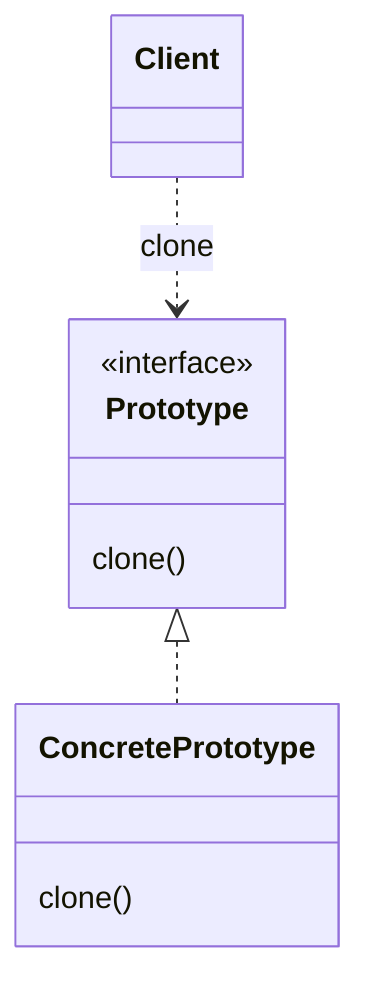

# Прототип (`Prototype`)

**Prototype** позволяет создавать новые объекты путем копирования существующих экземпляров, избегая затрат на инициализацию и конфигурацию.

## Полезные ссылки

### Официальная документация
- [Java Cloneable](https://docs.oracle.com/en/java/javase/17/docs/api/java.base/java/lang/Cloneable.html)
- [Java Object.clone()](https://docs.oracle.com/en/java/javase/17/docs/api/java.base/java/lang/Object.html#clone())

### См. также
- [[java-basics|Java Basics]] — **Java Basics**
- [[java-concurrency-basics|Java Concurrency]] — многопоточность и память
- [[factory-method|Factory Method]] — **Factory Method Pattern**

## Содержание

- [Что такое Prototype?](#что-такое-prototype)
  - [Основные характеристики](#основные-характеристики)
  - [Проблемы, которые решает](#проблемы-которые-решает)
- [Когда использовать Prototype?](#когда-использовать-prototype)
  - [Подходящие сценарии](#подходящие-сценарии)
  - [Признаки необходимости](#признаки-необходимости)
- [Структура паттерна](#структура-паттерна)
  - [Компоненты](#компоненты)
- [Реализация на Java](#реализация-на-java)
  - [Базовая реализация с Cloneable](#базовая-реализация-с-cloneable)
  - [Глубокое клонирование](#глубокое-клонирование)
  - [Prototype с сериализацией](#prototype-с-сериализацией)
- [Продвинутые реализации](#продвинутые-реализации)
  - [1. Prototype Manager с кэшированием](#1-prototype-manager-с-кэшированием)
  - [2. Prototype Factory](#2-prototype-factory)
  - [3. Prototype с Command паттерном](#3-prototype-с-command-паттерном)
- [Примеры использования](#примеры-использования)
  - [1. Database Connection Pool](#1-database-connection-pool)
  - [2. Configuration Manager](#2-configuration-manager)
  - [3. Game Object Factory](#3-game-object-factory)
- [Лучшие практики](#лучшие-практики)
  - [1. Выбор между Prototype и другими паттернами](#1-выбор-между-prototype-и-другими-паттернами)
  - [2. Реализация clone() метода](#2-реализация-clone-метода)
  - [3. Обработка исключений и валидация](#3-обработка-исключений-и-валидация)
  - [4. Тестирование Prototype](#4-тестирование-prototype)
- [Решение проблем](#решение-проблем)
- [Частые вопросы](#частые-вопросы)
- [Заключение](#заключение)

## Суть и запомнить

**Суть в одном предложении:** Новый объект получают копированием существующего (прототипа), а не созданием с нуля.

**Запомнить:**
- Prototype реализует clone() (или copy); клиент клонирует и при необходимости настраивает.
- Экономит дорогую инициализацию; составные объекты — глубокое копирование.
- Часто используется с реестром прототипов.

**Когда применять:** дорогое создание/инициализация, много похожих объектов с небольшими отличиями.

## Что такое **Prototype**?

**Prototype** — это порождающий паттерн проектирования, который позволяет создавать новые объекты путем копирования существующих экземпляров-прототипов. Вместо создания объектов с нуля, прототип клонируется и модифицируется по необходимости.

### Основные характеристики

1. **Клонирование**: Создание копий существующих объектов
2. **Избежание инициализации**: Экономия ресурсов на повторной инициализации
3. **Гибкая настройка**: Возможность модификации клонов
4. **Runtime создание**: Создание объектов во время выполнения

### Проблемы, которые решает

Сравнение: дорогая инициализация при каждом создании vs клонирование прототипа.

```java
// Плохо: Дорогая инициализация при каждом создании
public class ComplexObject {
    private HeavyResource resource;
    private List<String> data;

    public ComplexObject() {
        // Дорогая инициализация
        this.resource = new HeavyResource(); // Загрузка файлов, сетевые вызовы
        this.data = loadDataFromDatabase();  // Запросы к БД
        this.config = loadConfiguration();   // Чтение конфигурации
    }
}

// Создание множества объектов - дорого!
List<ComplexObject> objects = new ArrayList<>();
for (int i = 0; i < 1000; i++) {
    objects.add(new ComplexObject()); // 1000 инициализаций!
}

// Хорошо: Использование Prototype
public class ComplexObject implements Cloneable {
    // Инициализация происходит только один раз
    private static ComplexObject prototype = new ComplexObject();

    public static ComplexObject createInstance() {
        return prototype.clone(); // Быстрое клонирование
    }
}

// Быстрое создание 1000 объектов!
List<ComplexObject> objects = new ArrayList<>();
for (int i = 0; i < 1000; i++) {
    objects.add(ComplexObject.createInstance()); // Только клонирование!
}
```

## Когда использовать **Prototype**?

### Подходящие сценарии

- **Дорогие объекты**: Объекты с тяжелой инициализацией
- **Конфигурируемые объекты**: Когда нужно много похожих объектов с небольшими отличиями
- **Runtime типы**: Когда тип объекта определяется во время выполнения
- **Кэширование**: Для создания объектов из кэша прототипов
- **Тестирование**: Создание тестовых данных на основе прототипов

### Признаки необходимости

```java
// Признаки: Дорогие операции при создании объектов
public class Indicators {

    // Объекты с тяжелой инициализацией
    public class HeavyInitializationObject {
        public HeavyInitializationObject() {
            loadConfiguration();    // Чтение файлов
            connectToDatabase();    // Сетевые вызовы
            initializeCache();      // Создание структур данных
            setupMonitoring();      // Регистрация метрик
        }
    }

    // Много похожих объектов
    public class ConfigurableObject {
        private String name;
        private int value;
        private Map<String, Object> properties;

        // Создание множества объектов с похожей конфигурацией
        public static List<ConfigurableObject> createBatch() {
            List<ConfigurableObject> objects = new ArrayList<>();
            for (int i = 0; i < 100; i++) {
                ConfigurableObject obj = new ConfigurableObject();
                // Настройка каждого объекта...
                objects.add(obj);
            }
            return objects;
        }
    }

    // Объекты с переменной структурой
    public class DynamicStructureObject {
        private Map<String, Object> attributes = new HashMap<>();

        // Структура определяется во время выполнения
        public void addAttribute(String key, Object value) {
            attributes.put(key, value);
        }
    }
}
```

## Структура паттерна



```text
┌─────────────────────────────────────────────────────────────┐
│                    Client                                  │
│                                                             │
│  Prototype prototype = registry.getPrototype(type) ──────┐ │
│  Prototype clone = prototype.clone()                     │ │
│  clone.customize()                                        │ │
│  return clone                                             │ │
└─────────────────────────────────────────────────────────────┼─┘
                                                              │
┌─────────────────────────────────────────────────────────────┼─┐
│                    Prototype Registry                      │ │
│                                                             │ │
│  ┌─────────────────────────────────────────────────────┐    │ │
│  │              getPrototype(type)                     │    │ │
│  │                return prototypes.get(type)          │    │ │
│  │                                                     │    │ │
│  │              addPrototype(type, prototype)          │    │ │
│  │                prototypes.put(type, prototype)      │    │ │
│  └─────────────────────────────────────────────────────┘    │ │
└─────────────────────────────────────────────────────────────┘
                                                              │
┌─────────────────────────────────────────────────────────────┼─┐
│                    Concrete Prototype                      │ │
│                                                             │ │
│  ┌─────────────────────────────────────────────────────┐    │ │
│  │              clone()                               │    │ │
│  │                return (ConcretePrototype)           │    │ │
│  │                super.clone()                        │    │ │
│  │                                                     │    │ │
│  │              customize()                            │    │ │
│  │                // Настройка клона                   │    │ │
│  └─────────────────────────────────────────────────────┘    │ │
└─────────────────────────────────────────────────────────────┘
                                                              │
┌─────────────────────────────────────────────────────────────┼─┐
│                    Prototype Interface                     │ │
│                                                             │ │
│  ┌─────────────────────────────────────────────────────┐    │ │
│  │              clone()                               │    │ │
│  │                                                     │    │ │
│  │              // Абстрактный метод клонирования      │    │ │
│  └─────────────────────────────────────────────────────┘    │ │
└─────────────────────────────────────────────────────────────┘
```

### Компоненты

1. **Prototype**: Интерфейс или абстрактный класс с методом **clone**()
2. **ConcretePrototype**: Конкретная реализация прототипа
3. **Client**: Код, использующий прототипы для создания объектов
4. **Prototype Registry**: Реестр доступных прототипов(опционально)

## Реализация на Java

### Базовая реализация с **Cloneable**

```java
// Абстрактный прототип
public abstract class Shape implements Cloneable {
    private String id;
    protected String type;

    public abstract void draw();

    public String getId() {
        return id;
    }

    public void setId(String id) {
        this.id = id;
    }

    public String getType() {
        return type;
    }

    // Метод клонирования
    @Override
    public Object clone() {
        Object clone = null;
        try {
            clone = super.clone();
        } catch (CloneNotSupportedException e) {
            e.printStackTrace();
        }
        return clone;
    }
}

// Конкретные прототипы
public class Rectangle extends Shape {
    public Rectangle() {
        type = "Rectangle";
    }

    @Override
    public void draw() {
        System.out.println("Inside Rectangle::draw() method.");
    }
}

public class Square extends Shape {
    public Square() {
        type = "Square";
    }

    @Override
    public void draw() {
        System.out.println("Inside Square::draw() method.");
    }
}

public class Circle extends Shape {
    public Circle() {
        type = "Circle";
    }

    @Override
    public void draw() {
        System.out.println("Inside Circle::draw() method.");
    }
}

// Реестр прототипов
public class ShapeCache {
    private static Map<String, Shape> shapeMap = new HashMap<>();

    // Инициализация прототипов
    static {
        Rectangle rectangle = new Rectangle();
        rectangle.setId("1");
        shapeMap.put(rectangle.getId(), rectangle);

        Square square = new Square();
        square.setId("2");
        shapeMap.put(square.getId(), square);

        Circle circle = new Circle();
        circle.setId("3");
        shapeMap.put(circle.getId(), circle);
    }

    // Получение клонированного объекта
    public static Shape getShape(String shapeId) {
        Shape cachedShape = shapeMap.get(shapeId);
        return (Shape) cachedShape.clone();
    }

    // Добавление нового прототипа
    public static void addShape(String id, Shape shape) {
        shapeMap.put(id, shape);
    }
}

// Клиент
public class PrototypeDemo {
    public static void main(String[] args) {
        // Получение клонированных объектов
        Shape clonedShape1 = ShapeCache.getShape("1");
        System.out.println("Shape : " + clonedShape1.getType());

        Shape clonedShape2 = ShapeCache.getShape("2");
        System.out.println("Shape : " + clonedShape2.getType());

        Shape clonedShape3 = ShapeCache.getShape("3");
        System.out.println("Shape : " + clonedShape3.getType());

        // Проверка что это разные объекты
        Shape clonedShape1Again = ShapeCache.getShape("1");
        System.out.println("Same object? " + (clonedShape1 == clonedShape1Again)); // false
        System.out.println("Same type? " + clonedShape1.getType().equals(clonedShape1Again.getType())); // true
    }
}
```

### Глубокое клонирование

```java
// Класс с глубоким клонированием
public class DeepCloneObject implements Cloneable {
    private String name;
    private List<String> tags;
    private Map<String, Object> properties;
    private NestedObject nested;

    public DeepCloneObject(String name) {
        this.name = name;
        this.tags = new ArrayList<>();
        this.properties = new HashMap<>();
        this.nested = new NestedObject();
    }

    // Глубокое клонирование
    @Override
    public Object clone() {
        try {
            DeepCloneObject cloned = (DeepCloneObject) super.clone();

            // Глубокое копирование коллекций
            cloned.tags = new ArrayList<>(this.tags);
            cloned.properties = new HashMap<>(this.properties);

            // Глубокое копирование вложенных объектов
            cloned.nested = (NestedObject) this.nested.clone();

            return cloned;
        } catch (CloneNotSupportedException e) {
            throw new RuntimeException("Clone not supported", e);
        }
    }

    // Методы для модификации
    public void addTag(String tag) {
        tags.add(tag);
    }

    public void setProperty(String key, Object value) {
        properties.put(key, value);
    }

    public void setNestedValue(String value) {
        nested.setValue(value);
    }

    @Override
    public String toString() {
        return "DeepCloneObject{" +
                "name='" + name + '\'' +
                ", tags=" + tags +
                ", properties=" + properties +
                ", nested=" + nested +
                '}';
    }

    // Вложенный объект
    public static class NestedObject implements Cloneable {
        private String value;

        public void setValue(String value) {
            this.value = value;
        }

        @Override
        public Object clone() throws CloneNotSupportedException {
            return super.clone();
        }

        @Override
        public String toString() {
            return "NestedObject{value='" + value + "'}";
        }
    }
}

// Демонстрация глубокого клонирования
public class DeepCloneDemo {
    public static void main(String[] args) {
        // Создание оригинального объекта
        DeepCloneObject original = new DeepCloneObject("Original");
        original.addTag("tag1");
        original.addTag("tag2");
        original.setProperty("key1", "value1");
        original.setNestedValue("nested_value");

        System.out.println("Original: " + original);

        // Клонирование
        DeepCloneObject cloned = (DeepCloneObject) original.clone();

        System.out.println("Cloned: " + cloned);

        // Модификация клона
        cloned.addTag("tag3");
        cloned.setProperty("key2", "value2");
        cloned.setNestedValue("modified_nested");

        System.out.println("After modification:");
        System.out.println("Original: " + original);
        System.out.println("Cloned: " + cloned);

        // Проверка независимости
        System.out.println("Tags are independent: " +
            (original.tags != cloned.tags)); // true
        System.out.println("Nested objects are independent: " +
            (original.nested != cloned.nested)); // true
    }
}
```

### **Prototype** с сериализацией

```java
// Прототип с использованием сериализации для глубокого клонирования
public class SerializablePrototype implements Serializable {

    private static final long serialVersionUID = 1L;

    private String name;
    private List<String> items;
    private Map<String, Object> config;

    public SerializablePrototype(String name) {
        this.name = name;
        this.items = new ArrayList<>();
        this.config = new HashMap<>();
    }

    // Клонирование через сериализацию
    @SuppressWarnings("unchecked")
    public SerializablePrototype clone() {
        try {
            // Сериализация
            ByteArrayOutputStream baos = new ByteArrayOutputStream();
            ObjectOutputStream oos = new ObjectOutputStream(baos);
            oos.writeObject(this);
            oos.close();

            // Десериализация
            ByteArrayInputStream bais = new ByteArrayInputStream(baos.toByteArray());
            ObjectInputStream ois = new ObjectInputStream(bais);
            SerializablePrototype cloned = (SerializablePrototype) ois.readObject();
            ois.close();

            return cloned;
        } catch (Exception e) {
            throw new RuntimeException("Clone failed", e);
        }
    }

    // Геттеры и сеттеры
    public void setName(String name) { this.name = name; }
    public void addItem(String item) { items.add(item); }
    public void setConfig(String key, Object value) { config.put(key, value); }

    @Override
    public String toString() {
        return "SerializablePrototype{" +
                "name='" + name + '\'' +
                ", items=" + items +
                ", config=" + config +
                '}';
    }
}

// Реестр прототипов с сериализацией
public class PrototypeRegistry {
    private final Map<String, SerializablePrototype> prototypes = new ConcurrentHashMap<>();

    // Регистрация прототипа
    public void registerPrototype(String key, SerializablePrototype prototype) {
        prototypes.put(key, prototype);
    }

    // Создание экземпляра на основе прототипа
    public SerializablePrototype createInstance(String key) {
        SerializablePrototype prototype = prototypes.get(key);
        if (prototype == null) {
            throw new IllegalArgumentException("Prototype not found: " + key);
        }
        return prototype.clone();
    }

    // Создание настроенного экземпляра
    public SerializablePrototype createConfiguredInstance(String key, Consumer<SerializablePrototype> configurer) {
        SerializablePrototype instance = createInstance(key);
        configurer.accept(instance);
        return instance;
    }

    // Получение списка доступных прототипов
    public Set<String> getAvailablePrototypes() {
        return new HashSet<>(prototypes.keySet());
    }
}

// Использование
public class SerializationCloneDemo {
    public static void main(String[] args) {
        PrototypeRegistry registry = new PrototypeRegistry();

        // Создание и регистрация прототипов
        SerializablePrototype userPrototype = new SerializablePrototype("UserTemplate");
        userPrototype.addItem("default_item");
        userPrototype.setConfig("active", true);

        SerializablePrototype adminPrototype = new SerializablePrototype("AdminTemplate");
        adminPrototype.addItem("admin_item");
        adminPrototype.setConfig("role", "admin");
        adminPrototype.setConfig("permissions", Arrays.asList("read", "write", "delete"));

        registry.registerPrototype("user", userPrototype);
        registry.registerPrototype("admin", adminPrototype);

        // Создание экземпляров
        SerializablePrototype user1 = registry.createInstance("user");
        user1.setName("john_doe");

        SerializablePrototype user2 = registry.createConfiguredInstance("user",
            user -> {
                user.setName("jane_doe");
                user.addItem("custom_item");
            });

        SerializablePrototype admin = registry.createInstance("admin");
        admin.setName("admin_user");

        System.out.println("User1: " + user1);
        System.out.println("User2: " + user2);
        System.out.println("Admin: " + admin);

        // Проверка независимости
        user1.addItem("user1_specific");
        System.out.println("After modification - User1: " + user1);
        System.out.println("User2 unchanged: " + user2);
    }
}
```

## Продвинутые реализации

### 1. **Prototype Manager** с кэшированием

```java
// Расширенный менеджер прототипов с кэшированием и метриками
public class AdvancedPrototypeManager<T extends Cloneable> {

    private final Map<String, T> prototypes = new ConcurrentHashMap<>();
    private final Map<String, AtomicLong> usageStats = new ConcurrentHashMap<>();
    private final Cache<String, T> instanceCache;

    public AdvancedPrototypeManager(long cacheSize, Duration cacheExpiry) {
        this.instanceCache = Caffeine.newBuilder()
            .maximumSize(cacheSize)
            .expireAfterWrite(cacheExpiry)
            .build();
    }

    // Регистрация прототипа
    public void registerPrototype(String key, T prototype) {
        prototypes.put(key, prototype);
        usageStats.put(key, new AtomicLong(0));
    }

    // Создание экземпляра с кэшированием
    @SuppressWarnings("unchecked")
    public T createInstance(String key) {
        // Проверка кэша
        T cachedInstance = instanceCache.getIfPresent(key);
        if (cachedInstance != null) {
            usageStats.get(key).incrementAndGet();
            return cachedInstance;
        }

        // Создание нового экземпляра
        T prototype = prototypes.get(key);
        if (prototype == null) {
            throw new IllegalArgumentException("Prototype not found: " + key);
        }

        try {
            T instance = (T) prototype.getClass().getMethod("clone").invoke(prototype);
            instanceCache.put(key, instance);
            usageStats.get(key).incrementAndGet();
            return instance;
        } catch (Exception e) {
            throw new RuntimeException("Failed to clone prototype: " + key, e);
        }
    }

    // Создание экземпляра с настройкой
    public T createConfiguredInstance(String key, Consumer<T> configurer) {
        T instance = createInstance(key);
        configurer.accept(instance);
        return instance;
    }

    // Пакетное создание
    public List<T> createBatch(String key, int count, Consumer<T> configurer) {
        List<T> instances = new ArrayList<>();
        for (int i = 0; i < count; i++) {
            T instance = createInstance(key);
            configurer.accept(instance);
            instances.add(instance);
        }
        return instances;
    }

    // Метрики использования
    public Map<String, Long> getUsageStats() {
        Map<String, Long> stats = new HashMap<>();
        usageStats.forEach((key, count) -> stats.put(key, count.get()));
        return stats;
    }

    // Очистка кэша
    public void clearCache() {
        instanceCache.invalidateAll();
    }

    // Очистка кэша для конкретного ключа
    public void clearCache(String key) {
        instanceCache.invalidate(key);
    }
}

// Пример использования расширенного менеджера
public class AdvancedPrototypeDemo {
    public static void main(String[] args) {
        AdvancedPrototypeManager<ConfigurableObject> manager =
            new AdvancedPrototypeManager<>(100, Duration.ofMinutes(5));

        // Создание прототипов
        ConfigurableObject userProto = new ConfigurableObject();
        userProto.setType("user");
        userProto.setActive(true);
        userProto.addProperty("role", "user");

        ConfigurableObject adminProto = new ConfigurableObject();
        adminProto.setType("admin");
        adminProto.setActive(true);
        adminProto.addProperty("role", "admin");
        adminProto.addProperty("permissions", Arrays.asList("read", "write", "delete"));

        manager.registerPrototype("user", userProto);
        manager.registerPrototype("admin", adminProto);

        // Создание экземпляров
        List<ConfigurableObject> users = manager.createBatch("user", 5,
            user -> user.setName("User" + Math.random()));

        ConfigurableObject admin = manager.createConfiguredInstance("admin",
            obj -> obj.setName("SuperAdmin"));

        System.out.println("Created " + users.size() + " users");
        System.out.println("Created admin: " + admin.getName());
        System.out.println("Usage stats: " + manager.getUsageStats());
    }
}

// Поддерживающий класс
static class ConfigurableObject implements Cloneable {
    private String name;
    private String type;
    private boolean active;
    private Map<String, Object> properties = new HashMap<>();

    @Override
    public Object clone() {
        try {
            ConfigurableObject cloned = (ConfigurableObject) super.clone();
            cloned.properties = new HashMap<>(this.properties);
            return cloned;
        } catch (CloneNotSupportedException e) {
            throw new RuntimeException(e);
        }
    }

    // Геттеры и сеттеры
    public void setName(String name) { this.name = name; }
    public void setType(String type) { this.type = type; }
    public void setActive(boolean active) { this.active = active; }
    public void addProperty(String key, Object value) { properties.put(key, value); }

    public String getName() { return name; }
    public String getType() { return type; }
    public boolean isActive() { return active; }
    public Map<String, Object> getProperties() { return new HashMap<>(properties); }
}
```

### 2. **Prototype Factory**

```java
// Фабрика прототипов для создания семейств объектов
public class PrototypeFactory {

    private final Map<Class<?>, Object> prototypes = new ConcurrentHashMap<>();

    // Регистрация прототипа для класса
    public <T> void registerPrototype(Class<T> type, T prototype) {
        prototypes.put(type, prototype);
    }

    // Создание экземпляра на основе прототипа
    @SuppressWarnings("unchecked")
    public <T> T createInstance(Class<T> type) {
        Object prototype = prototypes.get(type);
        if (prototype == null) {
            throw new IllegalArgumentException("No prototype registered for type: " + type);
        }

        if (!(prototype instanceof Cloneable)) {
            throw new IllegalArgumentException("Prototype must implement Cloneable: " + type);
        }

        try {
            return (T) prototype.getClass().getMethod("clone").invoke(prototype);
        } catch (Exception e) {
            throw new RuntimeException("Failed to clone prototype for type: " + type, e);
        }
    }

    // Создание с настройкой
    public <T> T createConfiguredInstance(Class<T> type, Consumer<T> configurer) {
        T instance = createInstance(type);
        configurer.accept(instance);
        return instance;
    }

    // Создание нескольких экземпляров
    public <T> List<T> createInstances(Class<T> type, int count, Consumer<T> configurer) {
        List<T> instances = new ArrayList<>();
        for (int i = 0; i < count; i++) {
            T instance = createInstance(type);
            configurer.accept(instance);
            instances.add(instance);
        }
        return instances;
    }

    // Проверка регистрации
    public boolean isPrototypeRegistered(Class<?> type) {
        return prototypes.containsKey(type);
    }

    // Получение всех зарегистрированных типов
    public Set<Class<?>> getRegisteredTypes() {
        return new HashSet<>(prototypes.keySet());
    }
}

// Пример использования фабрики прототипов
public class PrototypeFactoryDemo {

    // Модельные классы
    static class User implements Cloneable {
        private String name;
        private String email;
        private boolean active = true;

        public User() {}

        @Override
        public Object clone() {
            try {
                return super.clone();
            } catch (CloneNotSupportedException e) {
                throw new RuntimeException(e);
            }
        }

        // Геттеры и сеттеры
        public void setName(String name) { this.name = name; }
        public void setEmail(String email) { this.email = email; }
        public void setActive(boolean active) { this.active = active; }
        public String getName() { return name; }
        public String getEmail() { return email; }
        public boolean isActive() { return active; }

        @Override
        public String toString() {
            return "User{name='" + name + "', email='" + email + "', active=" + active + "}";
        }
    }

    static class Product implements Cloneable {
        private String name;
        private BigDecimal price;
        private String category;

        public Product() {}

        @Override
        public Object clone() {
            try {
                return super.clone();
            } catch (CloneNotSupportedException e) {
                throw new RuntimeException(e);
            }
        }

        // Геттеры и сеттеры
        public void setName(String name) { this.name = name; }
        public void setPrice(BigDecimal price) { this.price = price; }
        public void setCategory(String category) { this.category = category; }
        public String getName() { return name; }
        public BigDecimal getPrice() { return price; }
        public String getCategory() { return category; }

        @Override
        public String toString() {
            return "Product{name='" + name + "', price=" + price + ", category='" + category + "'}";
        }
    }

    public static void main(String[] args) {
        PrototypeFactory factory = new PrototypeFactory();

        // Создание прототипов
        User userPrototype = new User();
        userPrototype.setActive(true);

        Product productPrototype = new Product();
        productPrototype.setCategory("Electronics");

        // Регистрация прототипов
        factory.registerPrototype(User.class, userPrototype);
        factory.registerPrototype(Product.class, productPrototype);

        // Создание экземпляров
        User user1 = factory.createConfiguredInstance(User.class,
            user -> {
                user.setName("John Doe");
                user.setEmail("john@example.com");
            });

        User user2 = factory.createConfiguredInstance(User.class,
            user -> {
                user.setName("Jane Doe");
                user.setEmail("jane@example.com");
            });

        List<Product> products = factory.createInstances(Product.class, 3,
            (product, index) -> {
                product.setName("Product " + (index + 1));
                product.setPrice(BigDecimal.valueOf(10 * (index + 1)));
            });

        System.out.println("User1: " + user1);
        System.out.println("User2: " + user2);
        System.out.println("Products: " + products);
        System.out.println("Registered types: " + factory.getRegisteredTypes());
    }
}
```

### 3. **Prototype** с **Command** паттерном

```java
// Комбинация Prototype и Command для undo/redo операций
public class PrototypeCommandManager {

    private final Deque<Command> undoStack = new LinkedList<>();
    private final Deque<Command> redoStack = new LinkedList<>();
    private final Map<String, Document> documentPrototypes = new ConcurrentHashMap<>();

    // Регистрация прототипа документа
    public void registerDocumentPrototype(String type, Document prototype) {
        documentPrototypes.put(type, prototype);
    }

    // Создание документа с командой
    public Document createDocument(String type, String name) {
        Document prototype = documentPrototypes.get(type);
        if (prototype == null) {
            throw new IllegalArgumentException("Unknown document type: " + type);
        }

        Document newDoc = prototype.clone();
        newDoc.setName(name);

        // Создание команды создания
        CreateDocumentCommand command = new CreateDocumentCommand(newDoc);
        command.execute();
        undoStack.push(command);

        return newDoc;
    }

    // Undo операция
    public void undo() {
        if (!undoStack.isEmpty()) {
            Command command = undoStack.pop();
            command.undo();
            redoStack.push(command);
        }
    }

    // Redo операция
    public void redo() {
        if (!redoStack.isEmpty()) {
            Command command = redoStack.pop();
            command.execute();
            undoStack.push(command);
        }
    }

    // Очистка стеков
    public void clearHistory() {
        undoStack.clear();
        redoStack.clear();
    }

    // Интерфейс команды
    interface Command {
        void execute();
        void undo();
    }

    // Команда создания документа
    class CreateDocumentCommand implements Command {
        private final Document document;
        private boolean executed = false;

        public CreateDocumentCommand(Document document) {
            this.document = document;
        }

        @Override
        public void execute() {
            if (!executed) {
                document.save(); // Имитация сохранения
                executed = true;
                System.out.println("Document created: " + document.getName());
            }
        }

        @Override
        public void undo() {
            if (executed) {
                document.delete(); // Имитация удаления
                executed = false;
                System.out.println("Document creation undone: " + document.getName());
            }
        }
    }

    // Документ
    static class Document implements Cloneable {
        private String name;
        private String content = "";
        private final LocalDateTime createdAt = LocalDateTime.now();

        public Document(String name) {
            this.name = name;
        }

        @Override
        public Document clone() {
            try {
                Document cloned = (Document) super.clone();
                cloned.content = this.content; // Глубокое копирование строк
                return cloned;
            } catch (CloneNotSupportedException e) {
                throw new RuntimeException(e);
            }
        }

        public void setName(String name) { this.name = name; }
        public void setContent(String content) { this.content = content; }
        public String getName() { return name; }
        public String getContent() { return content; }
        public LocalDateTime getCreatedAt() { return createdAt; }

        public void save() { /* Имитация сохранения */ }
        public void delete() { /* Имитация удаления */ }

        @Override
        public String toString() {
            return "Document{name='" + name + "', created=" + createdAt + "}";
        }
    }
}

// Демонстрация
public class CommandPrototypeDemo {
    public static void main(String[] args) {
        PrototypeCommandManager manager = new PrototypeCommandManager();

        // Регистрация прототипов
        manager.registerDocumentPrototype("text", new PrototypeCommandManager.Document("template"));
        manager.registerDocumentPrototype("spreadsheet", new PrototypeCommandManager.Document("sheet_template"));

        // Создание документов
        PrototypeCommandManager.Document doc1 = manager.createDocument("text", "MyDocument.txt");
        PrototypeCommandManager.Document doc2 = manager.createDocument("spreadsheet", "Data.xlsx");

        System.out.println("Created: " + doc1);
        System.out.println("Created: " + doc2);

        // Undo
        System.out.println("Undoing last operation...");
        manager.undo();

        // Redo
        System.out.println("Redoing last operation...");
        manager.redo();
    }
}
```

## Примеры использования

### 1. **Database Connection Pool**

```java
@Service
public class ConnectionPoolPrototype {

    private final List<Connection> availableConnections = new ArrayList<>();
    private final List<Connection> usedConnections = new ArrayList<>();
    private final Connection prototypeConnection;
    private final int maxPoolSize;

    public ConnectionPoolPrototype(String url, String username, String password, int maxPoolSize) {
        this.maxPoolSize = maxPoolSize;

        try {
            // Создание прототипа подключения
            this.prototypeConnection = DriverManager.getConnection(url, username, password);
            // Инициализация пула
            initializePool();
        } catch (SQLException e) {
            throw new RuntimeException("Failed to create connection prototype", e);
        }
    }

    private void initializePool() {
        for (int i = 0; i < Math.min(10, maxPoolSize); i++) {
            try {
                Connection connection = createConnectionFromPrototype();
                availableConnections.add(connection);
            } catch (SQLException e) {
                // Log error
            }
        }
    }

    // Создание соединения на основе прототипа
    private Connection createConnectionFromPrototype() throws SQLException {
        // В реальности здесь может быть клонирование или создание нового соединения
        // Для демонстрации используем новый объект
        return DriverManager.getConnection(
            prototypeConnection.getMetaData().getURL(),
            null // credentials would be stored separately
        );
    }

    public synchronized Connection getConnection() throws SQLException {
        if (availableConnections.isEmpty()) {
            if (usedConnections.size() < maxPoolSize) {
                Connection connection = createConnectionFromPrototype();
                usedConnections.add(connection);
                return connection;
            } else {
                throw new SQLException("Connection pool exhausted");
            }
        } else {
            Connection connection = availableConnections.remove(availableConnections.size() - 1);
            usedConnections.add(connection);
            return connection;
        }
    }

    public synchronized void releaseConnection(Connection connection) {
        usedConnections.remove(connection);
        if (availableConnections.size() < 10) { // Keep max 10 idle connections
            availableConnections.add(connection);
        } else {
            try {
                connection.close();
            } catch (SQLException e) {
                // Log error
            }
        }
    }

    public synchronized int getAvailableConnections() {
        return availableConnections.size();
    }

    public synchronized int getUsedConnections() {
        return usedConnections.size();
    }

    @PreDestroy
    public void close() {
        for (Connection conn : availableConnections) {
            try {
                conn.close();
            } catch (SQLException e) {
                // Log error
            }
        }
        for (Connection conn : usedConnections) {
            try {
                conn.close();
            } catch (SQLException e) {
                // Log error
            }
        }
        try {
            prototypeConnection.close();
        } catch (SQLException e) {
            // Log error
        }
    }
}
```

### 2. **Configuration Manager**

```java
@Service
public class ConfigurationPrototypeManager {

    private final Map<String, ApplicationConfig> configPrototypes = new ConcurrentHashMap<>();

    @PostConstruct
    public void initializePrototypes() {
        // Прототип для development
        ApplicationConfig devConfig = new ApplicationConfig();
        devConfig.setEnvironment("development");
        devConfig.setDebugEnabled(true);
        devConfig.setDatabaseUrl("jdbc:h2:mem:dev");
        devConfig.setCacheEnabled(false);
        devConfig.setLogLevel("DEBUG");

        // Прототип для production
        ApplicationConfig prodConfig = new ApplicationConfig();
        prodConfig.setEnvironment("production");
        prodConfig.setDebugEnabled(false);
        prodConfig.setDatabaseUrl("jdbc:postgresql://prod-db:5432/app");
        prodConfig.setCacheEnabled(true);
        prodConfig.setLogLevel("INFO");

        configPrototypes.put("development", devConfig);
        configPrototypes.put("production", prodConfig);
    }

    public ApplicationConfig createConfig(String environment) {
        ApplicationConfig prototype = configPrototypes.get(environment);
        if (prototype == null) {
            throw new IllegalArgumentException("Unknown environment: " + environment);
        }

        return prototype.clone();
    }

    public ApplicationConfig createConfig(String environment, Consumer<ApplicationConfig> customizer) {
        ApplicationConfig config = createConfig(environment);
        customizer.accept(config);
        return config;
    }

    // Конфигурационный класс
    public static class ApplicationConfig implements Cloneable {
        private String environment;
        private boolean debugEnabled;
        private String databaseUrl;
        private boolean cacheEnabled;
        private String logLevel;
        private Map<String, Object> customProperties = new HashMap<>();

        @Override
        public ApplicationConfig clone() {
            try {
                ApplicationConfig cloned = (ApplicationConfig) super.clone();
                cloned.customProperties = new HashMap<>(this.customProperties);
                return cloned;
            } catch (CloneNotSupportedException e) {
                throw new RuntimeException(e);
            }
        }

        // Геттеры и сеттеры
        public void setEnvironment(String environment) { this.environment = environment; }
        public void setDebugEnabled(boolean debugEnabled) { this.debugEnabled = debugEnabled; }
        public void setDatabaseUrl(String databaseUrl) { this.databaseUrl = databaseUrl; }
        public void setCacheEnabled(boolean cacheEnabled) { this.cacheEnabled = cacheEnabled; }
        public void setLogLevel(String logLevel) { this.logLevel = logLevel; }
        public void setCustomProperty(String key, Object value) { customProperties.put(key, value); }

        public String getEnvironment() { return environment; }
        public boolean isDebugEnabled() { return debugEnabled; }
        public String getDatabaseUrl() { return databaseUrl; }
        public boolean isCacheEnabled() { return cacheEnabled; }
        public String getLogLevel() { return logLevel; }
        public Object getCustomProperty(String key) { return customProperties.get(key); }

        @Override
        public String toString() {
            return "ApplicationConfig{" +
                    "environment='" + environment + '\'' +
                    ", debugEnabled=" + debugEnabled +
                    ", databaseUrl='" + databaseUrl + '\'' +
                    ", cacheEnabled=" + cacheEnabled +
                    ", logLevel='" + logLevel + '\'' +
                    ", customProperties=" + customProperties +
                    '}';
        }
    }
}

// Использование
@Component
public class ApplicationInitializer {

    private final ConfigurationPrototypeManager configManager;

    @Autowired
    public ApplicationInitializer(ConfigurationPrototypeManager configManager) {
        this.configManager = configManager;
    }

    @Value("${app.environment:development}")
    private String environment;

    @PostConstruct
    public void initialize() {
        // Создание конфигурации на основе прототипа
        ConfigurationPrototypeManager.ApplicationConfig config =
            configManager.createConfig(environment,
                cfg -> {
                    // Кастомизация для конкретного приложения
                    cfg.setCustomProperty("app.name", "MyApp");
                    cfg.setCustomProperty("app.version", "1.0.0");
                });

        // Использование конфигурации для инициализации компонентов
        initializeDatabase(config);
        initializeCache(config);
        initializeLogging(config);

        System.out.println("Application initialized with config: " + config);
    }

    private void initializeDatabase(ConfigurationPrototypeManager.ApplicationConfig config) {
        System.out.println("Initializing database with URL: " + config.getDatabaseUrl());
    }

    private void initializeCache(ConfigurationPrototypeManager.ApplicationConfig config) {
        if (config.isCacheEnabled()) {
            System.out.println("Initializing cache");
        } else {
            System.out.println("Cache disabled");
        }
    }

    private void initializeLogging(ConfigurationPrototypeManager.ApplicationConfig config) {
        System.out.println("Initializing logging with level: " + config.getLogLevel());
    }
}
```

### 3. **Game Object Factory**

```java
@Service
public class GameObjectFactory {

    private final Map<String, GameObject> objectPrototypes = new ConcurrentHashMap<>();

    @PostConstruct
    public void initializePrototypes() {
        // Создание прототипов игровых объектов
        GameObject playerProto = new GameObject("player");
        playerProto.addComponent(new TransformComponent(0, 0));
        playerProto.addComponent(new HealthComponent(100));
        playerProto.addComponent(new InputComponent());

        GameObject enemyProto = new GameObject("enemy");
        enemyProto.addComponent(new TransformComponent(0, 0));
        enemyProto.addComponent(new HealthComponent(50));
        enemyProto.addComponent(new AIComponent());

        GameObject itemProto = new GameObject("item");
        itemProto.addComponent(new TransformComponent(0, 0));
        itemProto.addComponent(new CollectibleComponent());

        objectPrototypes.put("player", playerProto);
        objectPrototypes.put("enemy", enemyProto);
        objectPrototypes.put("item", itemProto);
    }

    public GameObject createObject(String type, double x, double y) {
        GameObject prototype = objectPrototypes.get(type);
        if (prototype == null) {
            throw new IllegalArgumentException("Unknown object type: " + type);
        }

        GameObject instance = prototype.clone();

        // Настройка позиции
        TransformComponent transform = instance.getComponent(TransformComponent.class);
        if (transform != null) {
            transform.setPosition(x, y);
        }

        return instance;
    }

    public List<GameObject> createObjects(String type, List<Point> positions) {
        return positions.stream()
            .map(pos -> createObject(type, pos.x, pos.y))
            .collect(Collectors.toList());
    }

    // Игровой объект
    public static class GameObject implements Cloneable {
        private final String type;
        private final List<GameComponent> components = new ArrayList<>();

        public GameObject(String type) {
            this.type = type;
        }

        @Override
        public GameObject clone() {
            try {
                GameObject cloned = (GameObject) super.clone();
                // Глубокое клонирование компонентов
                cloned.components.clear();
                for (GameComponent component : this.components) {
                    cloned.components.add(component.clone());
                }
                return cloned;
            } catch (CloneNotSupportedException e) {
                throw new RuntimeException(e);
            }
        }

        public void addComponent(GameComponent component) {
            components.add(component);
        }

        @SuppressWarnings("unchecked")
        public <T extends GameComponent> T getComponent(Class<T> componentType) {
            return (T) components.stream()
                .filter(componentType::isInstance)
                .findFirst()
                .orElse(null);
        }

        public String getType() { return type; }
        public List<GameComponent> getComponents() { return new ArrayList<>(components); }
    }

    // Базовый компонент
    public static abstract class GameComponent implements Cloneable {
        @Override
        public abstract GameComponent clone();
    }

    // Компоненты
    public static class TransformComponent extends GameComponent {
        private double x, y;

        public TransformComponent(double x, double y) {
            this.x = x;
            this.y = y;
        }

        public void setPosition(double x, double y) {
            this.x = x;
            this.y = y;
        }

        @Override
        public TransformComponent clone() {
            try {
                return (TransformComponent) super.clone();
            } catch (CloneNotSupportedException e) {
                throw new RuntimeException(e);
            }
        }
    }

    public static class HealthComponent extends GameComponent {
        private int health;

        public HealthComponent(int health) {
            this.health = health;
        }

        @Override
        public HealthComponent clone() {
            try {
                return (HealthComponent) super.clone();
            } catch (CloneNotSupportedException e) {
                throw new RuntimeException(e);
            }
        }
    }

    // Другие компоненты...
    public static class InputComponent extends GameComponent {
        @Override
        public InputComponent clone() {
            try {
                return (InputComponent) super.clone();
            } catch (CloneNotSupportedException e) {
                throw new RuntimeException(e);
            }
        }
    }

    public static class AIComponent extends GameComponent {
        @Override
        public AIComponent clone() {
            try {
                return (AIComponent) super.clone();
            } catch (CloneNotSupportedException e) {
                throw new RuntimeException(e);
            }
        }
    }

    public static class CollectibleComponent extends GameComponent {
        @Override
        public CollectibleComponent clone() {
            try {
                return (CollectibleComponent) super.clone();
            } catch (CloneNotSupportedException e) {
                throw new RuntimeException(e);
            }
        }
    }

    public static class Point {
        public final double x, y;
        public Point(double x, double y) { this.x = x; this.y = y; }
    }
}

// Демонстрация
public class GameFactoryDemo {
    public static void main(String[] args) {
        GameObjectFactory factory = new GameObjectFactory();
        factory.initializePrototypes();

        // Создание игровых объектов
        GameObject player = factory.createObject("player", 10, 20);
        List<GameObject> enemies = factory.createObjects("enemy",
            Arrays.asList(new GameObjectFactory.Point(5, 5), new GameObjectFactory.Point(15, 15)));
        GameObject item = factory.createObject("item", 7, 8);

        System.out.println("Created player at position: " +
            player.getComponent(GameObjectFactory.TransformComponent.class).x + ", " +
            player.getComponent(GameObjectFactory.TransformComponent.class).y);

        System.out.println("Created " + enemies.size() + " enemies");
        System.out.println("Created item: " + item.getType());
    }
}
```

## Лучшие практики

### 1. Выбор между **Prototype** и другими паттернами

```java
public class PrototypeVsOthers {

    // Используйте Prototype когда:
    // - Создание объекта очень дорогое (I/O, network, complex calculations)
    // - Нужно много похожих объектов с небольшими отличиями
    // - Тип объекта определяется во время выполнения
    // - Важна производительность создания объектов

    // Пример: Дорогое создание объекта
    public class ExpensiveObject {
        public ExpensiveObject() {
            loadConfiguration();    // Чтение файлов
            initializeCache();      // Создание структур данных
            connectToServices();    // Сетевые вызовы
        }
    }

    // Используйте Factory Method когда:
    // - Логика создания простая
    // - Создается один объект за раз
    // - Важна гибкость в выборе реализации

    // Используйте Abstract Factory когда:
    // - Нужно создавать семейства связанных объектов
    // - Конфигурация семейства определяется во время выполнения
    // - Важна консистентность объектов

    // Используйте Builder когда:
    // - Объект имеет много опциональных параметров
    // - Параметры устанавливаются поэтапно
    // - Важна читаемость кода создания объекта
}

// Правильный выбор паттерна
public class PatternSelection {

    // Prototype для дорогих объектов
    public class DatabaseConnectionPool {
        private static Connection prototypeConnection;

        static {
            prototypeConnection = createExpensiveConnection();
        }

        public Connection getConnection() {
            return prototypeConnection.clone(); // Быстрое клонирование
        }
    }

    // Factory для выбора реализации
    public class LoggerFactory {
        public static Logger createLogger(String type) {
            switch (type) {
                case "file": return new FileLogger();
                case "console": return new ConsoleLogger();
                default: throw new IllegalArgumentException();
            }
        }
    }

    // Builder для сложной конфигурации
    public class HttpRequestBuilder {
        public HttpRequest build() {
            validate();
            return new HttpRequest(this);
        }
    }
}
```

### 2. Реализация **clone**() метода

```java
public class CloneImplementationPatterns {

    // Поверхностное клонирование (shallow clone)
    public class ShallowClone implements Cloneable {
        private int primitiveField;
        private Object referenceField;

        @Override
        public Object clone() throws CloneNotSupportedException {
            return super.clone(); // Копирует только ссылки
        }
    }

    // Глубокое клонирование (deep clone)
    public class DeepClone implements Cloneable {
        private int primitiveField;
        private List<String> listField;
        private Map<String, Object> mapField;

        @Override
        public Object clone() {
            try {
                DeepClone cloned = (DeepClone) super.clone();
                // Глубокое копирование коллекций
                cloned.listField = new ArrayList<>(this.listField);
                cloned.mapField = new HashMap<>(this.mapField);
                return cloned;
            } catch (CloneNotSupportedException e) {
                throw new RuntimeException(e);
            }
        }
    }

    // Клонирование через сериализацию
    public class SerializationClone implements Serializable {
        private int field1;
        private List<String> field2;

        @SuppressWarnings("unchecked")
        public SerializationClone clone() {
            try {
                ByteArrayOutputStream baos = new ByteArrayOutputStream();
                ObjectOutputStream oos = new ObjectOutputStream(baos);
                oos.writeObject(this);

                ByteArrayInputStream bais = new ByteArrayInputStream(baos.toByteArray());
                ObjectInputStream ois = new ObjectInputStream(bais);
                return (SerializationClone) ois.readObject();
            } catch (Exception e) {
                throw new RuntimeException("Clone failed", e);
            }
        }
    }

    // Клонирование с конструктором
    public class ConstructorClone {
        private final int field1;
        private final String field2;

        public ConstructorClone(int field1, String field2) {
            this.field1 = field1;
            this.field2 = field2;
        }

        public ConstructorClone clone() {
            return new ConstructorClone(this.field1, this.field2);
        }
    }

    // Рекомендации:
    // - Используйте Cloneable только если shallow clone достаточен
    // - Для deep clone переопределяйте clone() с ручным копированием
    // - Рассмотрите сериализацию для сложных объектных графов
    // - Конструкторное клонирование для immutable объектов
}
```

### 3. Обработка исключений и валидация

```java
public class PrototypeErrorHandling {

    // Безопасное клонирование
    public abstract class SafeCloneable implements Cloneable {

        @Override
        protected final Object clone() throws CloneNotSupportedException {
            try {
                Object cloned = super.clone();
                validateClone(cloned);
                return cloned;
            } catch (CloneNotSupportedException e) {
                throw new RuntimeException("Clone not supported for " + getClass().getName(), e);
            }
        }

        protected void validateClone(Object cloned) {
            // Валидация клонированного объекта
        }

        // Безопасный метод клонирования
        @SuppressWarnings("unchecked")
        public final <T> T safeClone() {
            try {
                return (T) clone();
            } catch (Exception e) {
                throw new RuntimeException("Failed to clone object", e);
            }
        }
    }

    // Прототип с валидацией
    public class ValidatedPrototype extends SafeCloneable {
        private String name;
        private int value;

        @Override
        protected void validateClone(Object cloned) {
            ValidatedPrototype proto = (ValidatedPrototype) cloned;
            if (proto.name == null || proto.name.isEmpty()) {
                throw new IllegalStateException("Name cannot be null or empty");
            }
            if (proto.value < 0) {
                throw new IllegalStateException("Value must be non-negative");
            }
        }

        // Геттеры и сеттеры
        public void setName(String name) { this.name = name; }
        public void setValue(int value) { this.value = value; }
    }

    // Prototype registry с error handling
    public class SafePrototypeRegistry {
        private final Map<String, SafeCloneable> prototypes = new ConcurrentHashMap<>();

        public void registerPrototype(String key, SafeCloneable prototype) {
            Objects.requireNonNull(key, "Key cannot be null");
            Objects.requireNonNull(prototype, "Prototype cannot be null");
            prototypes.put(key, prototype);
        }

        public <T extends SafeCloneable> T createInstance(String key) {
            SafeCloneable prototype = prototypes.get(key);
            if (prototype == null) {
                throw new IllegalArgumentException("Prototype not found: " + key);
            }

            try {
                return prototype.safeClone();
            } catch (Exception e) {
                throw new RuntimeException("Failed to create instance from prototype: " + key, e);
            }
        }

        public boolean hasPrototype(String key) {
            return prototypes.containsKey(key);
        }

        public Set<String> getAvailablePrototypes() {
            return new HashSet<>(prototypes.keySet());
        }
    }
}
```

### 4. Тестирование **Prototype**

```java
@ExtendWith(MockitoExtension.class)
public class PrototypeTest {

    @Test
    void shouldCreateIndependentClones() {
        OriginalObject original = new OriginalObject();
        original.setName("Original");
        original.addItem("item1");

        OriginalObject clone = original.safeClone();

        // Модификация клона не должна влиять на оригинал
        clone.setName("Clone");
        clone.addItem("item2");

        assertEquals("Original", original.getName());
        assertEquals("Clone", clone.getName());
        assertTrue(original.getItems().contains("item1"));
        assertFalse(original.getItems().contains("item2"));
        assertTrue(clone.getItems().contains("item1"));
        assertTrue(clone.getItems().contains("item2"));
    }

    @Test
    void shouldHandleCloneNotSupportedException() {
        NonCloneableObject obj = new NonCloneableObject();

        assertThrows(RuntimeException.class, obj::safeClone);
    }

    @Test
    void shouldValidateClonedObjects() {
        ValidatedObject valid = new ValidatedObject();
        valid.setName("Valid Name");
        valid.setValue(10);

        ValidatedObject clone = valid.safeClone();

        assertEquals("Valid Name", clone.getName());
        assertEquals(10, clone.getValue());

        // Невалидный объект не должен клонироваться
        ValidatedObject invalid = new ValidatedObject();
        invalid.setName(""); // invalid

        assertThrows(IllegalStateException.class, invalid::safeClone);
    }

    @Test
    void shouldManagePrototypesInRegistry() {
        SafePrototypeRegistry registry = new SafePrototypeRegistry();

        OriginalObject prototype = new OriginalObject();
        prototype.setName("Prototype");

        registry.registerPrototype("test", prototype);

        OriginalObject instance1 = registry.createInstance("test");
        OriginalObject instance2 = registry.createInstance("test");

        instance1.setName("Instance1");
        instance2.setName("Instance2");

        assertEquals("Instance1", instance1.getName());
        assertEquals("Instance2", instance2.getName());
        assertEquals("Prototype", prototype.getName()); // Оригинал не изменился
    }

    @Test
    void shouldHandleRegistryErrors() {
        SafePrototypeRegistry registry = new SafePrototypeRegistry();

        assertThrows(IllegalArgumentException.class, () ->
            registry.createInstance("nonexistent"));

        assertThrows(NullPointerException.class, () ->
            registry.registerPrototype(null, new OriginalObject()));

        assertThrows(NullPointerException.class, () ->
            registry.registerPrototype("key", null));
    }

    @Test
    void shouldPerformDeepCloning() {
        DeepCloneObject original = new DeepCloneObject();
        original.setName("Original");
        original.addTag("tag1");

        DeepCloneObject clone = original.safeClone();

        // Изменение клона не должно влиять на оригинал
        clone.setName("Clone");
        clone.addTag("tag2");

        assertEquals("Original", original.getName());
        assertEquals("Clone", clone.getName());
        assertTrue(original.getTags().contains("tag1"));
        assertFalse(original.getTags().contains("tag2"));
        assertTrue(clone.getTags().contains("tag1"));
        assertTrue(clone.getTags().contains("tag2"));
    }

    // Test classes
    static class OriginalObject extends SafeCloneable {
        private String name;
        private List<String> items = new ArrayList<>();

        public void setName(String name) { this.name = name; }
        public String getName() { return name; }
        public void addItem(String item) { items.add(item); }
        public List<String> getItems() { return new ArrayList<>(items); }
    }

    static class NonCloneableObject {
        public NonCloneableObject safeClone() {
            try {
                return (NonCloneableObject) super.clone();
            } catch (CloneNotSupportedException e) {
                throw new RuntimeException(e);
            }
        }
    }

    static class ValidatedObject extends SafeCloneable {
        private String name;
        private int value;

        @Override
        protected void validateClone(Object cloned) {
            ValidatedObject obj = (ValidatedObject) cloned;
            if (obj.name == null || obj.name.trim().isEmpty()) {
                throw new IllegalStateException("Name cannot be null or empty");
            }
            if (obj.value < 0) {
                throw new IllegalStateException("Value must be non-negative");
            }
        }

        public void setName(String name) { this.name = name; }
        public void setValue(int value) { this.value = value; }
        public String getName() { return name; }
        public int getValue() { return value; }
    }

    static class DeepCloneObject extends SafeCloneable {
        private String name;
        private List<String> tags = new ArrayList<>();

        @Override
        public Object clone() throws CloneNotSupportedException {
            DeepCloneObject cloned = (DeepCloneObject) super.clone();
            cloned.tags = new ArrayList<>(this.tags); // Deep copy
            return cloned;
        }

        public void setName(String name) { this.name = name; }
        public String getName() { return name; }
        public void addTag(String tag) { tags.add(tag); }
        public List<String> getTags() { return new ArrayList<>(tags); }
    }

    static abstract class SafeCloneable implements Cloneable {
        @Override
        protected final Object clone() throws CloneNotSupportedException {
            return super.clone();
        }

        @SuppressWarnings("unchecked")
        public final <T> T safeClone() {
            try {
                return (T) clone();
            } catch (CloneNotSupportedException e) {
                throw new RuntimeException("Clone not supported", e);
            }
        }
    }

    static class SafePrototypeRegistry {
        private final Map<String, SafeCloneable> prototypes = new HashMap<>();

        public void registerPrototype(String key, SafeCloneable prototype) {
            Objects.requireNonNull(key, "Key cannot be null");
            Objects.requireNonNull(prototype, "Prototype cannot be null");
            prototypes.put(key, prototype);
        }

        @SuppressWarnings("unchecked")
        public <T extends SafeCloneable> T createInstance(String key) {
            SafeCloneable prototype = prototypes.get(key);
            if (prototype == null) {
                throw new IllegalArgumentException("Prototype not found: " + key);
            }
            return prototype.safeClone();
        }
    }
}
```


## Решение проблем

| Симптом | Возможная причина | Что делать |
|--------|-------------------|------------|
| Изменения в клоне влияют на оригинал | Поверхностное копирование (shallow) | Реализовать глубокое копирование: рекурсивно клонировать вложенные объекты |
| CloneNotSupportedException | Забыли implements Cloneable | Добавить Cloneable или использовать альтернативу: copy-constructor, сериализация |
| Сложные графы объектов | Глубокое копирование рекурсивно | Использовать сериализацию/десериализацию или специализированные библиотеки копирования |

## Частые вопросы

**Prototype vs Factory Method?** Prototype копирует существующий объект, избегая дорогой инициализации. Factory Method создаёт новый объект «с нуля». Prototype выгоден, когда создание дорогое.

**Shallow vs Deep clone?** Shallow копирует только первый уровень; вложенные объекты — те же ссылки. Deep рекурсивно клонирует всё. Для объектов с mutable-полями нужен deep clone.


## Заключение

**Prototype** паттерн — инструмент для оптимизации создания объектов. Он позволяет избежать дорогостоящей инициализации путем клонирования существующих экземпляров.

**Ключевые преимущества:**
- **Производительность**: Быстрое создание объектов без повторной инициализации
- **Гибкость**: Возможность модификации клонов для специфических нужд
- **Память**: Экономия ресурсов при работе с похожими объектами
- **Runtime конфигурация**: Создание объектов во время выполнения

**Используйте Prototype, когда:**
- Создание объекта очень дорогое(I/O, network, complex calculations)
- Нужно много похожих объектов с небольшими отличиями
- Тип объекта определяется во время выполнения
- Важна производительность создания объектов

**Реализуйте **clone**() правильно:**
- **Shallow clone**: Для простых объектов с **immutable** полями
- **Deep clone**: Для объектов со **mutable** коллекциями
- **Serialization**: Для сложных объектных графов
- **Constructor**: Для **immutable** объектов

**Prototype** часто используется вместе с:
- **Registry**: Для управления прототипами
- **Factory**: Для создания прототипов
- **Command**: Для **undo**/**redo** операций
- **Memento**: Для сохранения состояния объектов
