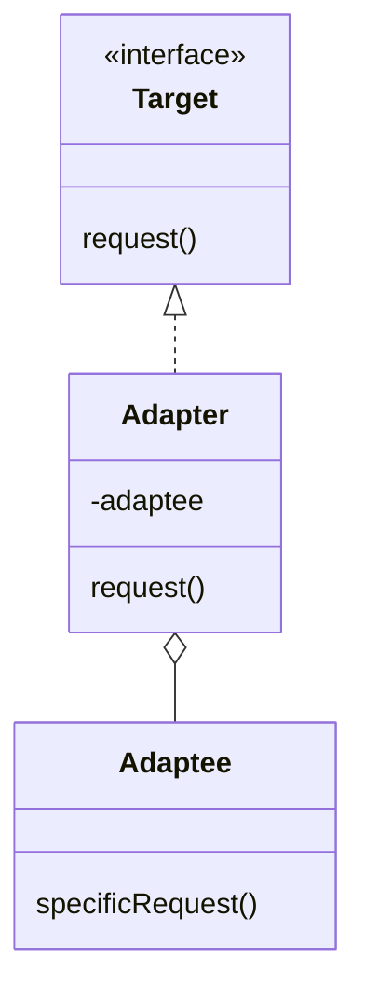

# Адаптер (Adapter)

**Adapter** позволяет объектам с несовместимыми интерфейсами работать вместе, преобразуя интерфейс одного объекта в интерфейс, ожидаемый клиентом.

## Полезные ссылки

### Официальная документация
- [Java Adapter Pattern](https://docs.oracle.com/javase/tutorial/)
- [Java Streams Adapters](https://docs.oracle.com/en/java/javase/17/docs/api/java.base/java/util/stream/Stream.html)

### См. также
- [[spring-aop|Spring AOP]] — **Spring AOP**
- [[java-collections-list|Java Collections]] — **Java Collections**
- [[decorator|Decorator]] — **Decorator Pattern**

## Содержание

- [Что такое Adapter?](#что-такое-adapter)
  - [Основные характеристики](#основные-характеристики)
  - [Проблемы, которые решает](#проблемы-которые-решает)
- [Когда использовать Adapter?](#когда-использовать-adapter)
  - [Подходящие сценарии](#подходящие-сценарии)
  - [Признаки необходимости](#признаки-необходимости)
- [Структура паттерна](#структура-паттерна)
  - [Компоненты](#компоненты)
- [Реализация на Java](#реализация-на-java)
  - [Object Adapter (композиция)](#object-adapter-композиция)
  - [Class Adapter (наследование)](#class-adapter-наследование)
  - [Two-Way Adapter](#two-way-adapter)
- [Продвинутые реализации](#продвинутые-реализации)
  - [1. Generic Adapter](#1-generic-adapter)
  - [2. Adapter с кэшированием](#2-adapter-с-кэшированием)
  - [3. Adapter для legacy систем](#3-adapter-для-legacy-систем)
- [Примеры использования](#примеры-использования)
  - [1. Spring Integration Adapter](#1-spring-integration-adapter)
  - [2. Collections Adapter](#2-collections-adapter)
  - [3. Legacy System Integration](#3-legacy-system-integration)
- [Лучшие практики](#лучшие-практики)
  - [1. Выбор типа адаптера](#1-выбор-типа-адаптера)
  - [2. Производительность и оптимизации](#2-производительность-и-оптимизации)
  - [3. Тестирование адаптеров](#3-тестирование-адаптеров)
- [Решение проблем](#решение-проблем)
- [Частые вопросы](#частые-вопросы)
- [Заключение](#заключение)

## Суть и запомнить

**Суть в одном предложении:** Прослойка, превращающая один интерфейс в другой, чтобы клиент мог работать с чужим объектом как с «своим».

**Запомнить:**
- Target — то, что ждёт клиент; Adaptee — то, что есть; Adapter реализует Target и держит Adaptee.
- Object adapter (композиция) или class adapter (наследование).
- Не меняет поведение объекта, только интерфейс.

**Когда применять:** интеграция legacy, сторонние API, несовместимые интерфейсы.

## Что такое Adapter?

**Adapter** — это структурный паттерн проектирования, который позволяет объектам с несовместимыми интерфейсами работать вместе. Он выступает прослойкой между двумя объектами, преобразующей вызовы методов одного в вызовы методов другого.

### Основные характеристики

1. **Адаптация интерфейсов**: Преобразование интерфейса в ожидаемый формат
2. **Совместимость**: Обеспечение работы несовместимых компонентов
3. **Наследование/Композиция**: Реализация через наследование или делегирование
4. **Прозрачность**: Клиент работает с адаптером как с обычным объектом

### Проблемы, которые решает

Сравнение: жёсткая зависимость от форматов vs единый интерфейс через **Adapter**.

```java
// Плохо: Жесткая зависимость от конкретной реализации
public class MediaPlayer {

    public void play(String audioType, String fileName) {
        if (audioType.equalsIgnoreCase("mp3")) {
            // Встроенная поддержка MP3
            System.out.println("Playing mp3 file: " + fileName);
        } else if (audioType.equalsIgnoreCase("mp4")) {
            // Встроенная поддержка MP4
            System.out.println("Playing mp4 file: " + fileName);
        } else if (audioType.equalsIgnoreCase("vlc")) {
            // Встроенная поддержка VLC
            System.out.println("Playing vlc file: " + fileName);
        } else {
            System.out.println("Invalid media type: " + audioType);
        }
    }
}

// Клиент вынужден знать о всех поддерживаемых форматах

// Хорошо: Использование Adapter паттерна
public class MediaPlayer {

    public void play(String audioType, String fileName) {
        MediaAdapter adapter = new MediaAdapter(audioType);
        adapter.play(audioType, fileName);
    }
}

// Клиент работает через единый интерфейс
```

## Когда использовать Adapter?

### Подходящие сценарии

- **Интеграция legacy кода**: Работа со старыми системами
- **Сторонние библиотеки**: Адаптация внешних **API**
- **Несовместимые интерфейсы**: Когда интерфейсы не подходят друг к другу
- **Множественные источники**: Работа с разными провайдерами данных
- **Plugin архитектура**: Загрузка и адаптация плагинов

### Признаки необходимости

```java
// Признаки: Несовместимые интерфейсы, множественное условие
public class Indicators {

    // Множество if-else для разных типов
    public class MultiFormatProcessor {
        public void process(Data data) {
            if (data instanceof XmlData) {
                processXml((XmlData) data);
            } else if (data instanceof JsonData) {
                processJson((JsonData) data);
            } else if (data instanceof CsvData) {
                processCsv((CsvData) data);
            }
            // Добавление нового формата требует изменения этого кода
        }
    }

    // Разные интерфейсы для похожей функциональности
    public interface OldSystem {
        void oldMethod(String param);
    }

    public interface NewSystem {
        void newMethod(String param, int options);
    }

    // Клиент ожидает NewSystem, но имеет OldSystem
    public class Client {
        public void doWork(NewSystem system) {
            system.newMethod("data", 42);
        }
    }
}
```

## Структура паттерна



### Компоненты

1. **Target**: Интерфейс, ожидаемый клиентом
2. **Adaptee**: Существующий класс с несовместимым интерфейсом
3. **Adapter**: Класс, адаптирующий **Adaptee** к **Target** интерфейсу
4. **Client**: Код, использующий **Target** интерфейс

## Реализация на Java

### Object Adapter (композиция)

```java
// Target интерфейс
interface MediaPlayer {
    void play(String audioType, String fileName);
}

// Adaptee классы (несовместимые)
class VlcPlayer {
    public void playVlc(String fileName) {
        System.out.println("Playing vlc file: " + fileName);
    }
}

class Mp4Player {
    public void playMp4(String fileName) {
        System.out.println("Playing mp4 file: " + fileName);
    }
}

// Adapter (композиция)
class MediaAdapter implements MediaPlayer {

    private VlcPlayer vlcPlayer;
    private Mp4Player mp4Player;

    public MediaAdapter(String audioType) {
        if (audioType.equalsIgnoreCase("vlc")) {
            vlcPlayer = new VlcPlayer();
        } else if (audioType.equalsIgnoreCase("mp4")) {
            mp4Player = new Mp4Player();
        }
    }

    @Override
    public void play(String audioType, String fileName) {
        if (audioType.equalsIgnoreCase("vlc")) {
            vlcPlayer.playVlc(fileName);
        } else if (audioType.equalsIgnoreCase("mp4")) {
            mp4Player.playMp4(fileName);
        }
    }
}

// Улучшенный MediaPlayer
class AudioPlayer implements MediaPlayer {

    private MediaAdapter mediaAdapter;

    @Override
    public void play(String audioType, String fileName) {
        // Встроенная поддержка mp3
        if (audioType.equalsIgnoreCase("mp3")) {
            System.out.println("Playing mp3 file: " + fileName);
        }
        // Адаптер для других форматов
        else if (audioType.equalsIgnoreCase("vlc") || audioType.equalsIgnoreCase("mp4")) {
            mediaAdapter = new MediaAdapter(audioType);
            mediaAdapter.play(audioType, fileName);
        } else {
            System.out.println("Invalid media type: " + audioType + " format not supported");
        }
    }
}

// Клиент
public class AdapterDemo {
    public static void main(String[] args) {
        AudioPlayer audioPlayer = new AudioPlayer();

        audioPlayer.play("mp3", "beyond_the_horizon.mp3");
        audioPlayer.play("mp4", "alone.mp4");
        audioPlayer.play("vlc", "far_far_away.vlc");
        audioPlayer.play("avi", "mind_me.avi"); // Не поддерживается
    }
}
```

### Class Adapter (наследование)

```java
// Target интерфейс
interface Shape {
    void draw();
    void resize();
    String description();
}

// Adaptee класс
class LegacyRectangle {
    public void drawRectangle(int x, int y, int width, int height) {
        System.out.println("Drawing rectangle at (" + x + "," + y +
                          ") with size " + width + "x" + height);
    }

    public void resizeRectangle(int newWidth, int newHeight) {
        System.out.println("Resizing rectangle to " + newWidth + "x" + newHeight);
    }
}

// Class Adapter (наследование)
class RectangleAdapter extends LegacyRectangle implements Shape {

    private int x, y, width, height;

    public RectangleAdapter(int x, int y, int width, int height) {
        this.x = x;
        this.y = y;
        this.width = width;
        this.height = height;
    }

    @Override
    public void draw() {
        drawRectangle(x, y, width, height);
    }

    @Override
    public void resize() {
        // Увеличиваем размер на 50%
        int newWidth = (int) (width * 1.5);
        int newHeight = (int) (height * 1.5);
        resizeRectangle(newWidth, newHeight);

        this.width = newWidth;
        this.height = newHeight;
    }

    @Override
    public String description() {
        return "Rectangle at (" + x + "," + y + ") size " + width + "x" + height;
    }
}

// Другой пример: адаптация Enumeration к Iterator
class EnumerationIterator<T> implements Iterator<T> {

    private Enumeration<T> enumeration;

    public EnumerationIterator(Enumeration<T> enumeration) {
        this.enumeration = enumeration;
    }

    @Override
    public boolean hasNext() {
        return enumeration.hasMoreElements();
    }

    @Override
    public T next() {
        return enumeration.nextElement();
    }
}

// Использование
public class ClassAdapterDemo {
    public static void main(String[] args) {
        // Адаптация LegacyRectangle к Shape
        Shape rectangle = new RectangleAdapter(10, 10, 100, 50);
        rectangle.draw();
        System.out.println(rectangle.description());

        rectangle.resize();
        System.out.println("After resize: " + rectangle.description());

        // Адаптация Enumeration к Iterator
        Vector<String> vector = new Vector<>();
        vector.add("One");
        vector.add("Two");
        vector.add("Three");

        Iterator<String> iterator = new EnumerationIterator<>(vector.elements());
        while (iterator.hasNext()) {
            System.out.println(iterator.next());
        }
    }
}
```

### Two-Way Adapter

```java
// Двунаправленный адаптер
interface EuropeanSocket {
    void provideElectricity();
}

interface AmericanPlug {
    void connectToAmericanSocket();
}

// Американская розетка (Adaptee 1)
class AmericanSocket {
    public void connect(AmericanPlug plug) {
        System.out.println("American socket connected to plug");
        plug.connectToAmericanSocket();
    }
}

// Европейская вилка (Adaptee 2)
class EuropeanPlug {
    public void connect(EuropeanSocket socket) {
        System.out.println("European plug connected to socket");
        socket.provideElectricity();
    }
}

// Двунаправленный адаптер
class TravelAdapter implements EuropeanSocket, AmericanPlug {

    private AmericanSocket americanSocket;
    private EuropeanPlug europeanPlug;

    public TravelAdapter() {
        this.americanSocket = new AmericanSocket();
        this.europeanPlug = new EuropeanPlug();
    }

    // Реализация EuropeanSocket
    @Override
    public void provideElectricity() {
        System.out.println("Adapter converting electricity...");
        // Имитация преобразования напряжения
        System.out.println("Electricity converted from 110V to 220V");
    }

    // Реализация AmericanPlug
    @Override
    public void connectToAmericanSocket() {
        System.out.println("Adapter connecting as American plug...");
        americanSocket.connect(this);
    }

    // Дополнительные методы для двунаправленного использования
    public void connectAsEuropeanPlug() {
        System.out.println("Adapter connecting as European plug...");
        europeanPlug.connect(this);
    }

    public void connectAsAmericanPlug() {
        connectToAmericanSocket();
    }
}

// Клиент
public class TwoWayAdapterDemo {
    public static void main(String[] args) {
        TravelAdapter adapter = new TravelAdapter();

        System.out.println("Using as American plug:");
        adapter.connectAsAmericanPlug();

        System.out.println("\nUsing as European plug:");
        adapter.connectAsEuropeanPlug();

        System.out.println("\nDirect interface usage:");
        AmericanPlug americanPlug = adapter;
        americanPlug.connectToAmericanSocket();

        EuropeanSocket europeanSocket = adapter;
        europeanSocket.provideElectricity();
    }
}
```

## Продвинутые реализации

### 1. Generic Adapter

```java
// Обобщенный адаптер для коллекций
public class CollectionAdapter<T> {

    // Адаптация Iterator к Enumeration
    public static <T> Enumeration<T> asEnumeration(Iterator<T> iterator) {
        return new IteratorEnumeration<>(iterator);
    }

    // Адаптация Enumeration к Iterator
    public static <T> Iterator<T> asIterator(Enumeration<T> enumeration) {
        return new EnumerationIterator<>(enumeration);
    }

    // Адаптация Collection к List
    public static <T> List<T> asList(Collection<T> collection) {
        return collection instanceof List ? (List<T>) collection : new ArrayList<>(collection);
    }

    // Адаптация массива к List
    @SafeVarargs
    public static <T> List<T> asList(T... elements) {
        return Arrays.asList(elements);
    }

    // Внутренние классы адаптеров
    private static class IteratorEnumeration<T> implements Enumeration<T> {
        private final Iterator<T> iterator;

        public IteratorEnumeration(Iterator<T> iterator) {
            this.iterator = iterator;
        }

        @Override
        public boolean hasMoreElements() {
            return iterator.hasNext();
        }

        @Override
        public T nextElement() {
            return iterator.next();
        }
    }

    private static class EnumerationIterator<T> implements Iterator<T> {
        private final Enumeration<T> enumeration;

        public EnumerationIterator(Enumeration<T> enumeration) {
            this.enumeration = enumeration;
        }

        @Override
        public boolean hasNext() {
            return enumeration.hasMoreElements();
        }

        @Override
        public T next() {
            return enumeration.nextElement();
        }
    }
}

// Адаптер для примитивных типов
public class PrimitiveAdapter {

    // Адаптация int[] к List<Integer>
    public static List<Integer> asIntegerList(int[] array) {
        List<Integer> list = new ArrayList<>(array.length);
        for (int value : array) {
            list.add(value);
        }
        return list;
    }

    // Адаптация List<Integer> к int[]
    public static int[] asIntArray(List<Integer> list) {
        int[] array = new int[list.size()];
        for (int i = 0; i < list.size(); i++) {
            array[i] = list.get(i);
        }
        return array;
    }

    // Адаптация double[] к List<Double>
    public static List<Double> asDoubleList(double[] array) {
        return Arrays.stream(array).boxed().collect(Collectors.toList());
    }

    // Адаптация Stream к Collection
    public static <T> Collection<T> asCollection(Stream<T> stream) {
        return stream.collect(Collectors.toList());
    }
}

// Адаптер для функциональных интерфейсов
public class FunctionalAdapter {

    // Адаптация Runnable к Callable<Void>
    public static Callable<Void> asCallable(Runnable runnable) {
        return () -> {
            runnable.run();
            return null;
        };
    }

    // Адаптация Callable<T> к Supplier<T>
    public static <T> Supplier<T> asSupplier(Callable<T> callable) {
        return () -> {
            try {
                return callable.call();
            } catch (Exception e) {
                throw new RuntimeException(e);
            }
        };
    }

    // Адаптация Consumer<T> к Function<T, Void>
    public static <T> Function<T, Void> asFunction(Consumer<T> consumer) {
        return t -> {
            consumer.accept(t);
            return null;
        };
    }
}

// Использование обобщенных адаптеров
public class GenericAdapterDemo {
    public static void main(String[] args) {
        // Адаптация коллекций
        List<String> list = Arrays.asList("a", "b", "c");
        Enumeration<String> enumeration = CollectionAdapter.asEnumeration(list.iterator());
        Iterator<String> iterator = CollectionAdapter.asIterator(enumeration);

        // Адаптация примитивов
        int[] intArray = {1, 2, 3, 4, 5};
        List<Integer> intList = PrimitiveAdapter.asIntegerList(intArray);
        int[] backToArray = PrimitiveAdapter.asIntArray(intList);

        // Адаптация функциональных интерфейсов
        Runnable runnable = () -> System.out.println("Running");
        Callable<Void> callable = FunctionalAdapter.asCallable(runnable);

        try {
            callable.call();
        } catch (Exception e) {
            e.printStackTrace();
        }

        System.out.println("Adapters working correctly");
    }
}
```

### 2. Adapter с кэшированием

```java
// Адаптер с кэшированием результатов
public class CachingAdapter<T, R> implements Function<T, R> {

    private final Function<T, R> adaptee;
    private final Map<T, R> cache;
    private final long maxCacheSize;

    public CachingAdapter(Function<T, R> adaptee, long maxCacheSize) {
        this.adaptee = adaptee;
        this.maxCacheSize = maxCacheSize;
        this.cache = new LinkedHashMap<T, R>(16, 0.75f, true) {
            @Override
            protected boolean removeEldestEntry(Map.Entry<T, R> eldest) {
                return size() > maxCacheSize;
            }
        };
    }

    @Override
    public R apply(T input) {
        return cache.computeIfAbsent(input, adaptee);
    }

    public void clearCache() {
        cache.clear();
    }

    public int getCacheSize() {
        return cache.size();
    }

    public boolean isCached(T input) {
        return cache.containsKey(input);
    }
}

// Адаптер с логированием
public class LoggingAdapter<T, R> implements Function<T, R> {

    private final Function<T, R> adaptee;
    private final String adapterName;

    public LoggingAdapter(Function<T, R> adaptee, String adapterName) {
        this.adaptee = adaptee;
        this.adapterName = adapterName;
    }

    @Override
    public R apply(T input) {
        System.out.println("[" + adapterName + "] Input: " + input);
        long startTime = System.nanoTime();

        try {
            R result = adaptee.apply(input);
            long duration = (System.nanoTime() - startTime) / 1_000_000;
            System.out.println("[" + adapterName + "] Output: " + result + " (took " + duration + "ms)");
            return result;
        } catch (Exception e) {
            System.err.println("[" + adapterName + "] Error: " + e.getMessage());
            throw e;
        }
    }
}

// Адаптер с retry логикой
public class RetryAdapter<T, R> implements Function<T, R> {

    private final Function<T, R> adaptee;
    private final int maxRetries;
    private final long delayMs;

    public RetryAdapter(Function<T, R> adaptee, int maxRetries, long delayMs) {
        this.adaptee = adaptee;
        this.maxRetries = maxRetries;
        this.delayMs = delayMs;
    }

    @Override
    public R apply(T input) {
        int attempts = 0;
        Exception lastException = null;

        while (attempts <= maxRetries) {
            try {
                return adaptee.apply(input);
            } catch (Exception e) {
                attempts++;
                lastException = e;

                if (attempts <= maxRetries) {
                    System.out.println("Attempt " + attempts + " failed, retrying in " + delayMs + "ms");
                    try {
                        Thread.sleep(delayMs);
                    } catch (InterruptedException ie) {
                        Thread.currentThread().interrupt();
                        throw new RuntimeException(ie);
                    }
                }
            }
        }

        throw new RuntimeException("Failed after " + (maxRetries + 1) + " attempts", lastException);
    }
}

// Композитный адаптер
public class CompositeAdapter<T, R> implements Function<T, R> {

    private final List<Function<T, R>> adapters;

    @SafeVarargs
    public CompositeAdapter(Function<T, R>... adapters) {
        this.adapters = Arrays.asList(adapters);
    }

    @Override
    public R apply(T input) {
        R result = null;
        for (Function<T, R> adapter : adapters) {
            result = adapter.apply(result != null ? (T) result : input);
        }
        return result;
    }

    public CompositeAdapter<T, R> addAdapter(Function<T, R> adapter) {
        adapters.add(adapter);
        return this;
    }
}

// Использование продвинутых адаптеров
public class AdvancedAdapterDemo {
    public static void main(String[] args) {
        // Создание цепочки адаптеров
        Function<String, String> processingChain = new CompositeAdapter<>(
            new LoggingAdapter<>(String::toUpperCase, "UpperCase"),
            new CachingAdapter<>(s -> s + "!!!", 10),
            new LoggingAdapter<>(s -> "Processed: " + s, "Final")
        );

        // Тестирование
        System.out.println("First call:");
        String result1 = processingChain.apply("hello");

        System.out.println("\nSecond call (cached):");
        String result2 = processingChain.apply("hello");

        System.out.println("\nResult1: " + result1);
        System.out.println("Result2: " + result2);
        System.out.println("Same result: " + result1.equals(result2));
    }
}
```

### 3. Adapter для legacy систем

```java
// Адаптер для работы с legacy базами данных
interface ModernDatabase {
    void connect(String connectionString);
    List<Map<String, Object>> executeQuery(String sql);
    int executeUpdate(String sql);
    void close();
}

class LegacyDatabaseAdapter implements ModernDatabase {

    private final LegacyDatabaseSystem legacySystem;
    private boolean connected = false;

    public LegacyDatabaseAdapter(LegacyDatabaseSystem legacySystem) {
        this.legacySystem = legacySystem;
    }

    @Override
    public void connect(String connectionString) {
        // Парсинг connection string для legacy системы
        String[] parts = connectionString.split(";");
        String host = null, port = null, database = null;

        for (String part : parts) {
            String[] kv = part.split("=");
            if (kv.length == 2) {
                switch (kv[0].toLowerCase()) {
                    case "host": host = kv[1]; break;
                    case "port": port = kv[1]; break;
                    case "database": database = kv[1]; break;
                }
            }
        }

        // Подключение к legacy системе
        legacySystem.connect(host, Integer.parseInt(port), database);
        connected = true;
    }

    @Override
    public List<Map<String, Object>> executeQuery(String sql) {
        if (!connected) {
            throw new IllegalStateException("Not connected");
        }

        // Конвертация SQL если нужно
        String legacySql = convertSqlToLegacy(sql);

        // Выполнение запроса
        LegacyResultSet legacyResult = legacySystem.executeQuery(legacySql);

        // Конвертация результата
        return convertLegacyResultToModern(legacyResult);
    }

    @Override
    public int executeUpdate(String sql) {
        if (!connected) {
            throw new IllegalStateException("Not connected");
        }

        String legacySql = convertSqlToLegacy(sql);
        return legacySystem.executeUpdate(legacySql);
    }

    @Override
    public void close() {
        if (connected) {
            legacySystem.disconnect();
            connected = false;
        }
    }

    private String convertSqlToLegacy(String modernSql) {
        // Имитация конвертации SQL
        return modernSql.replace("SELECT", "FIND")
                       .replace("INSERT", "ADD")
                       .replace("UPDATE", "MODIFY")
                       .replace("DELETE", "REMOVE");
    }

    private List<Map<String, Object>> convertLegacyResultToModern(LegacyResultSet legacyResult) {
        List<Map<String, Object>> results = new ArrayList<>();

        while (legacyResult.next()) {
            Map<String, Object> row = new HashMap<>();
            for (String column : legacyResult.getColumnNames()) {
                row.put(column, legacyResult.getValue(column));
            }
            results.add(row);
        }

        return results;
    }
}

// Legacy система (имитация)
interface LegacyDatabaseSystem {
    void connect(String host, int port, String database);
    LegacyResultSet executeQuery(String sql);
    int executeUpdate(String sql);
    void disconnect();
}

interface LegacyResultSet {
    boolean next();
    List<String> getColumnNames();
    Object getValue(String column);
}

// Современный клиент
public class DatabaseClient {

    private final ModernDatabase database;

    public DatabaseClient(ModernDatabase database) {
        this.database = database;
    }

    public void performOperations() {
        try {
            // Подключение
            database.connect("host=localhost;port=3306;database=test");

            // Выполнение запросов
            List<Map<String, Object>> users = database.executeQuery(
                "SELECT id, name, email FROM users WHERE active = 1");

            System.out.println("Found " + users.size() + " users");

            int updated = database.executeUpdate(
                "UPDATE users SET last_login = NOW() WHERE id = 1");

            System.out.println("Updated " + updated + " rows");

        } finally {
            database.close();
        }
    }

    public static void main(String[] args) {
        // Использование с legacy системой
        LegacyDatabaseSystem legacySystem = new ConcreteLegacyDatabaseSystem();
        ModernDatabase modernDatabase = new LegacyDatabaseAdapter(legacySystem);

        DatabaseClient client = new DatabaseClient(modernDatabase);
        client.performOperations();
    }
}

// Заглушка для legacy системы
class ConcreteLegacyDatabaseSystem implements LegacyDatabaseSystem {

    @Override
    public void connect(String host, int port, String database) {
        System.out.println("Legacy system connected to " + host + ":" + port + "/" + database);
    }

    @Override
    public LegacyResultSet executeQuery(String sql) {
        System.out.println("Legacy system executing query: " + sql);
        return new SimpleLegacyResultSet();
    }

    @Override
    public int executeUpdate(String sql) {
        System.out.println("Legacy system executing update: " + sql);
        return 1;
    }

    @Override
    public void disconnect() {
        System.out.println("Legacy system disconnected");
    }

    static class SimpleLegacyResultSet implements LegacyResultSet {
        private int currentRow = -1;
        private final List<Map<String, Object>> data;

        public SimpleLegacyResultSet() {
            data = Arrays.asList(
                Map.of("id", 1, "name", "John", "email", "john@example.com"),
                Map.of("id", 2, "name", "Jane", "email", "jane@example.com")
            );
        }

        @Override
        public boolean next() {
            currentRow++;
            return currentRow < data.size();
        }

        @Override
        public List<String> getColumnNames() {
            return Arrays.asList("id", "name", "email");
        }

        @Override
        public Object getValue(String column) {
            return data.get(currentRow).get(column);
        }
    }
}
```

## Примеры использования

### 1. Spring Integration Adapter

```java
@Configuration
public class IntegrationAdaptersConfig {

    // Адаптер для внешнего REST API
    @Bean
    public RestTemplateAdapter restTemplateAdapter(RestTemplate restTemplate) {
        return new RestTemplateAdapter(restTemplate);
    }

    // Адаптер для messaging системы
    @Bean
    public MessagingAdapter messagingAdapter(JmsTemplate jmsTemplate) {
        return new MessagingAdapter(jmsTemplate);
    }

    // Адаптер для legacy database
    @Bean
    public DatabaseAdapter databaseAdapter(@Qualifier("legacyDataSource") DataSource dataSource) {
        return new DatabaseAdapter(dataSource);
    }
}

@Component
public class RestTemplateAdapter {

    private final RestTemplate restTemplate;
    private final ObjectMapper objectMapper;

    public RestTemplateAdapter(RestTemplate restTemplate) {
        this.restTemplate = restTemplate;
        this.objectMapper = new ObjectMapper();
    }

    // Адаптация разных API к единому интерфейсу
    public <T> ApiResponse<T> executeGet(String url, Class<T> responseType) {
        try {
            ResponseEntity<String> response = restTemplate.getForEntity(url, String.class);
            T data = objectMapper.readValue(response.getBody(), responseType);
            return ApiResponse.success(data, response.getStatusCodeValue());
        } catch (RestClientException e) {
            return ApiResponse.error("REST call failed: " + e.getMessage());
        } catch (JsonProcessingException e) {
            return ApiResponse.error("JSON parsing failed: " + e.getMessage());
        }
    }

    public <T, R> ApiResponse<R> executePost(String url, T requestBody, Class<R> responseType) {
        try {
            HttpHeaders headers = new HttpHeaders();
            headers.setContentType(MediaType.APPLICATION_JSON);

            HttpEntity<T> entity = new HttpEntity<>(requestBody, headers);
            ResponseEntity<String> response = restTemplate.postForEntity(url, entity, String.class);

            R data = objectMapper.readValue(response.getBody(), responseType);
            return ApiResponse.success(data, response.getStatusCodeValue());
        } catch (RestClientException e) {
            return ApiResponse.error("REST call failed: " + e.getMessage());
        } catch (JsonProcessingException e) {
            return ApiResponse.error("JSON parsing failed: " + e.getMessage());
        }
    }

    // Универсальный метод для разных HTTP методов
    public <T, R> ApiResponse<R> execute(String url, HttpMethod method,
                                       T requestBody, Class<R> responseType) {
        switch (method) {
            case GET: return executeGet(url, responseType);
            case POST: return executePost(url, requestBody, responseType);
            default: return ApiResponse.error("Unsupported HTTP method: " + method);
        }
    }
}

// Messaging адаптер
@Component
public class MessagingAdapter {

    private final JmsTemplate jmsTemplate;

    public MessagingAdapter(JmsTemplate jmsTemplate) {
        this.jmsTemplate = jmsTemplate;
    }

    // Адаптация JMS к простому интерфейсу
    public void sendMessage(String destination, Object message) {
        try {
            jmsTemplate.convertAndSend(destination, message);
        } catch (JmsException e) {
            throw new MessagingException("Failed to send message", e);
        }
    }

    public <T> T receiveMessage(String destination, Class<T> messageType) {
        try {
            return jmsTemplate.receiveAndConvert(destination, messageType);
        } catch (JmsException e) {
            throw new MessagingException("Failed to receive message", e);
        }
    }

    // Адаптация к reactive интерфейсу
    public Mono<Void> sendMessageReactive(String destination, Object message) {
        return Mono.fromRunnable(() -> sendMessage(destination, message));
    }

    public <T> Mono<T> receiveMessageReactive(String destination, Class<T> messageType) {
        return Mono.fromCallable(() -> receiveMessage(destination, messageType));
    }
}

// Database адаптер
@Component
public class DatabaseAdapter {

    private final JdbcTemplate jdbcTemplate;

    public DatabaseAdapter(@Qualifier("legacyDataSource") DataSource dataSource) {
        this.jdbcTemplate = new JdbcTemplate(dataSource);
    }

    // Адаптация legacy SQL к современным методам
    public List<Map<String, Object>> findUsersLegacy() {
        String legacySql = "SELECT * FROM user_table WHERE status = 'ACTIVE'";
        return jdbcTemplate.queryForList(legacySql);
    }

    public List<User> findUsersModern() {
        return findUsersLegacy().stream()
            .map(this::adaptLegacyUserToModern)
            .collect(Collectors.toList());
    }

    private User adaptLegacyUserToModern(Map<String, Object> legacyRow) {
        return User.builder()
            .id(((Number) legacyRow.get("user_id")).longValue())
            .name((String) legacyRow.get("user_name"))
            .email((String) legacyRow.get("user_email"))
            .active("ACTIVE".equals(legacyRow.get("status")))
            .build();
    }

    // Адаптация разных типов запросов
    public <T> List<T> executeQuery(String sql, RowMapper<T> rowMapper) {
        // Адаптация SQL если нужно
        String adaptedSql = adaptSql(sql);
        return jdbcTemplate.query(adaptedSql, rowMapper);
    }

    private String adaptSql(String sql) {
        // Имитация адаптации SQL для legacy системы
        return sql.replace("users", "user_table")
                 .replace("active", "status = 'ACTIVE'");
    }
}

// Общие классы
class ApiResponse<T> {
    private final boolean success;
    private final T data;
    private final String error;
    private final int statusCode;

    private ApiResponse(boolean success, T data, String error, int statusCode) {
        this.success = success;
        this.data = data;
        this.error = error;
        this.statusCode = statusCode;
    }

    public static <T> ApiResponse<T> success(T data, int statusCode) {
        return new ApiResponse<>(true, data, null, statusCode);
    }

    public static <T> ApiResponse<T> error(String error) {
        return new ApiResponse<>(false, null, error, 0);
    }

    // getters
    public boolean isSuccess() { return success; }
    public T getData() { return data; }
    public String getError() { return error; }
    public int getStatusCode() { return statusCode; }
}

class MessagingException extends RuntimeException {
    public MessagingException(String message) { super(message); }
    public MessagingException(String message, Throwable cause) { super(message, cause); }
}
```

### 2. Collections Adapter

```java
public class CollectionsAdapter {

    // Адаптация Enumeration к Iterator (из JDK)
    public static <T> Iterator<T> enumerationAsIterator(Enumeration<T> enumeration) {
        return new EnumerationIterator<>(enumeration);
    }

    // Адаптация Iterator к Enumeration
    public static <T> Enumeration<T> iteratorAsEnumeration(Iterator<T> iterator) {
        return new IteratorEnumeration<>(iterator);
    }

    // Адаптация массива к List
    @SafeVarargs
    public static <T> List<T> arrayAsList(T... elements) {
        return Arrays.asList(elements);
    }

    // Адаптация Stream к Collection
    public static <T> Collection<T> streamAsCollection(Stream<T> stream) {
        return stream.collect(Collectors.toList());
    }

    // Адаптация Collection к Stream
    public static <T> Stream<T> collectionAsStream(Collection<T> collection) {
        return collection.stream();
    }

    // Адаптация Properties к Map
    public static Map<String, String> propertiesAsMap(Properties properties) {
        Map<String, String> map = new HashMap<>();
        properties.forEach((key, value) -> map.put(key.toString(), value.toString()));
        return map;
    }

    // Адаптация Map к Properties
    public static Properties mapAsProperties(Map<String, String> map) {
        Properties properties = new Properties();
        properties.putAll(map);
        return properties;
    }

    // Внутренние классы
    private static class EnumerationIterator<T> implements Iterator<T> {
        private final Enumeration<T> enumeration;

        public EnumerationIterator(Enumeration<T> enumeration) {
            this.enumeration = enumeration;
        }

        @Override
        public boolean hasNext() {
            return enumeration.hasMoreElements();
        }

        @Override
        public T next() {
            return enumeration.nextElement();
        }
    }

    private static class IteratorEnumeration<T> implements Enumeration<T> {
        private final Iterator<T> iterator;

        public IteratorEnumeration(Iterator<T> iterator) {
            this.iterator = iterator;
        }

        @Override
        public boolean hasMoreElements() {
            return iterator.hasNext();
        }

        @Override
        public T nextElement() {
            return iterator.next();
        }
    }
}

// Пример использования
public class CollectionsAdapterDemo {
    public static void main(String[] args) {
        // Адаптация Enumeration к Iterator
        Vector<String> vector = new Vector<>();
        vector.add("one");
        vector.add("two");
        vector.add("three");

        Iterator<String> iterator = CollectionsAdapter.enumerationAsIterator(vector.elements());
        while (iterator.hasNext()) {
            System.out.println(iterator.next());
        }

        // Адаптация массива к List
        String[] array = {"apple", "banana", "cherry"};
        List<String> list = CollectionsAdapter.arrayAsList(array);
        list.forEach(System.out::println);

        // Адаптация Properties к Map
        Properties props = new Properties();
        props.setProperty("host", "localhost");
        props.setProperty("port", "8080");

        Map<String, String> configMap = CollectionsAdapter.propertiesAsMap(props);
        configMap.forEach((key, value) -> System.out.println(key + "=" + value));
    }
}
```

### 3. Legacy System Integration

```java
@Service
public class LegacySystemAdapter {

    private final LegacySystem legacySystem;
    private final ModernSystemMapper mapper;

    public LegacySystemAdapter(LegacySystem legacySystem, ModernSystemMapper mapper) {
        this.legacySystem = legacySystem;
        this.mapper = mapper;
    }

    // Адаптация методов legacy системы
    public ModernUser getUserById(String userId) {
        try {
            // Вызов legacy метода
            LegacyUser legacyUser = legacySystem.findUser(userId);

            // Адаптация данных
            return mapper.mapToModern(legacyUser);

        } catch (LegacySystemException e) {
            // Адаптация исключений
            throw new ModernSystemException("Failed to get user: " + e.getMessage(), e);
        }
    }

    public List<ModernOrder> getUserOrders(String userId) {
        try {
            // Legacy система возвращает массив
            LegacyOrder[] legacyOrders = legacySystem.getOrders(userId);

            // Адаптация к List
            return Arrays.stream(legacyOrders)
                .map(mapper::mapToModern)
                .collect(Collectors.toList());

        } catch (LegacySystemException e) {
            throw new ModernSystemException("Failed to get orders: " + e.getMessage(), e);
        }
    }

    public void createOrder(ModernOrder order) {
        try {
            // Адаптация данных для legacy системы
            LegacyOrder legacyOrder = mapper.mapToLegacy(order);

            // Вызов legacy метода
            legacySystem.createOrder(legacyOrder);

        } catch (LegacySystemException e) {
            throw new ModernSystemException("Failed to create order: " + e.getMessage(), e);
        }
    }

    // Адаптация асинхронных операций
    public CompletableFuture<ModernUser> getUserByIdAsync(String userId) {
        return CompletableFuture.supplyAsync(() -> getUserById(userId));
    }

    public CompletableFuture<List<ModernOrder>> getUserOrdersAsync(String userId) {
        return CompletableFuture.supplyAsync(() -> getUserOrders(userId));
    }
}

// Маппер для преобразования данных
@Component
public class ModernSystemMapper {

    public ModernUser mapToModern(LegacyUser legacyUser) {
        return ModernUser.builder()
            .id(legacyUser.getUserId())
            .name(legacyUser.getFullName())
            .email(legacyUser.getEmailAddress())
            .active(legacyUser.getStatus().equals("ACTIVE"))
            .createdAt(legacyUser.getRegistrationDate().toInstant())
            .build();
    }

    public ModernOrder mapToModern(LegacyOrder legacyOrder) {
        return ModernOrder.builder()
            .id(legacyOrder.getOrderId())
            .userId(legacyOrder.getCustomerId())
            .amount(BigDecimal.valueOf(legacyOrder.getTotalAmount()))
            .status(mapOrderStatus(legacyOrder.getOrderStatus()))
            .createdAt(legacyOrder.getOrderDate().toInstant())
            .build();
    }

    public LegacyOrder mapToLegacy(ModernOrder modernOrder) {
        LegacyOrder legacyOrder = new LegacyOrder();
        legacyOrder.setOrderId(modernOrder.getId());
        legacyOrder.setCustomerId(modernOrder.getUserId());
        legacyOrder.setTotalAmount(modernOrder.getAmount().doubleValue());
        legacyOrder.setOrderStatus(mapOrderStatusReverse(modernOrder.getStatus()));
        legacyOrder.setOrderDate(Date.from(modernOrder.getCreatedAt()));
        return legacyOrder;
    }

    private OrderStatus mapOrderStatus(String legacyStatus) {
        switch (legacyStatus) {
            case "PENDING": return OrderStatus.PENDING;
            case "CONFIRMED": return OrderStatus.CONFIRMED;
            case "SHIPPED": return OrderStatus.SHIPPED;
            case "DELIVERED": return OrderStatus.DELIVERED;
            default: return OrderStatus.UNKNOWN;
        }
    }

    private String mapOrderStatusReverse(OrderStatus modernStatus) {
        switch (modernStatus) {
            case PENDING: return "PENDING";
            case CONFIRMED: return "CONFIRMED";
            case SHIPPED: return "SHIPPED";
            case DELIVERED: return "DELIVERED";
            default: return "UNKNOWN";
        }
    }
}

// Заглушки для legacy системы
interface LegacySystem {
    LegacyUser findUser(String userId) throws LegacySystemException;
    LegacyOrder[] getOrders(String userId) throws LegacySystemException;
    void createOrder(LegacyOrder order) throws LegacySystemException;
}

class LegacyUser {
    // Поля legacy системы
}

class LegacyOrder {
    // Поля legacy системы
}

class LegacySystemException extends Exception {
    public LegacySystemException(String message) {
        super(message);
    }
}

// Современные классы
class ModernUser {
    // Современная структура
}

class ModernOrder {
    // Современная структура
}

enum OrderStatus {
    PENDING, CONFIRMED, SHIPPED, DELIVERED, UNKNOWN
}

class ModernSystemException extends RuntimeException {
    public ModernSystemException(String message) {
        super(message);
    }

    public ModernSystemException(String message, Throwable cause) {
        super(message, cause);
    }
}
```

## Лучшие практики

### 1. Выбор типа адаптера

```java
public class AdapterSelectionGuide {

    // Используйте Object Adapter (композиция) когда:
    // - Нужно адаптировать несколько классов
    // - Адаптер должен работать с подклассами adaptee
    // - Композиция предпочтительнее наследования
    public class ObjectAdapterExample {
        private final Adaptee adaptee;

        public ObjectAdapterExample(Adaptee adaptee) {
            this.adaptee = adaptee;
        }

        // Адаптация методов
    }

    // Используйте Class Adapter (наследование) когда:
    // - Adaptee имеет простой интерфейс
    // - Можно наследоваться от adaptee
    // - Нужен доступ к protected методам adaptee
    public class ClassAdapterExample extends Adaptee implements Target {
        // Наследование + реализация интерфейса
    }

    // Используйте Two-Way Adapter когда:
    // - Нужна двунаправленная адаптация
    // - Оба интерфейса должны быть адаптированы
    public class TwoWayAdapterExample implements Target, AdapteeInterface {
        // Реализует оба интерфейса
    }

    // Используйте Generic Adapter когда:
    // - Нужно адаптировать семейства классов
    // - Адаптация основана на типах
    public class GenericAdapter<T, R> implements Function<T, R> {
        // Обобщенная адаптация
    }
}
```

### 2. Производительность и оптимизации

```java
public class AdapterPerformanceTips {

    // Кэширующий адаптер
    public class CachingAdapter<T, R> implements Function<T, R> {

        private final Function<T, R> adaptee;
        private final Map<T, R> cache = new ConcurrentHashMap<>();

        public CachingAdapter(Function<T, R> adaptee) {
            this.adaptee = adaptee;
        }

        @Override
        public R apply(T input) {
            return cache.computeIfAbsent(input, adaptee);
        }

        public void clearCache() {
            cache.clear();
        }
    }

    // Lazy адаптер
    public class LazyAdapter<T> implements Supplier<T> {

        private final Supplier<T> adaptee;
        private volatile T cachedInstance;

        public LazyAdapter(Supplier<T> adaptee) {
            this.adaptee = adaptee;
        }

        @Override
        public T get() {
            T result = cachedInstance;
            if (result == null) {
                synchronized (this) {
                    result = cachedInstance;
                    if (result == null) {
                        cachedInstance = adaptee.get();
                        result = cachedInstance;
                    }
                }
            }
            return result;
        }
    }

    // Batch адаптер для оптимизации
    public class BatchAdapter<T, R> implements Function<List<T>, List<R>> {

        private final Function<T, R> adaptee;

        public BatchAdapter(Function<T, R> adaptee) {
            this.adaptee = adaptee;
        }

        @Override
        public List<R> apply(List<T> inputs) {
            return inputs.stream()
                .map(adaptee)
                .collect(Collectors.toList());
        }

        // Параллельная обработка
        public List<R> applyParallel(List<T> inputs) {
            return inputs.parallelStream()
                .map(adaptee)
                .collect(Collectors.toList());
        }
    }

    // Адаптер с Circuit Breaker
    public class ResilientAdapter<T, R> implements Function<T, R> {

        private final Function<T, R> adaptee;
        private final CircuitBreaker circuitBreaker;

        public ResilientAdapter(Function<T, R> adaptee) {
            this.adaptee = adaptee;
            this.circuitBreaker = new CircuitBreaker(5, 60000);
        }

        @Override
        public R apply(T input) {
            if (!circuitBreaker.allowExecution()) {
                throw new RuntimeException("Circuit breaker is open");
            }

            try {
                R result = adaptee.apply(input);
                circuitBreaker.recordSuccess();
                return result;
            } catch (Exception e) {
                circuitBreaker.recordFailure();
                throw e;
            }
        }

        private static class CircuitBreaker {
            // Реализация circuit breaker (как в предыдущих примерах)
            private volatile boolean open = false;
            private final int failureThreshold;
            private final long timeoutMs;
            private int failureCount = 0;
            private long lastFailureTime = 0;

            public CircuitBreaker(int failureThreshold, long timeoutMs) {
                this.failureThreshold = failureThreshold;
                this.timeoutMs = timeoutMs;
            }

            public synchronized boolean allowExecution() {
                if (open) {
                    if (System.currentTimeMillis() - lastFailureTime > timeoutMs) {
                        open = false;
                        failureCount = 0;
                        return true;
                    }
                    return false;
                }
                return true;
            }

            public synchronized void recordSuccess() {
                failureCount = 0;
                open = false;
            }

            public synchronized void recordFailure() {
                failureCount++;
                lastFailureTime = System.currentTimeMillis();
                if (failureCount >= failureThreshold) {
                    open = true;
                }
            }
        }
    }
}
```

### 3. Тестирование адаптеров

```java
@ExtendWith(MockitoExtension.class)
public class AdapterTest {

    @Mock
    private Adaptee adaptee;

    @Test
    void shouldAdaptMethodCallsCorrectly() {
        // Arrange
        when(adaptee.specificMethod()).thenReturn("adapted result");
        Adapter adapter = new Adapter(adaptee);

        // Act
        String result = adapter.targetMethod();

        // Assert
        assertEquals("adapted result", result);
        verify(adaptee).specificMethod();
    }

    @Test
    void shouldHandleAdapteeExceptions() {
        // Arrange
        when(adaptee.specificMethod()).thenThrow(new RuntimeException("Adaptee failed"));
        Adapter adapter = new Adapter(adaptee);

        // Act & Assert
        RuntimeException exception = assertThrows(RuntimeException.class, adapter::targetMethod);
        assertEquals("Adaptee failed", exception.getMessage());
    }

    @Test
    void shouldCacheResultsInCachingAdapter() {
        Function<String, String> adaptee = s -> "processed: " + s.toUpperCase();
        CachingAdapter<String, String> adapter = new CachingAdapter<>(adaptee);

        // First call
        String result1 = adapter.apply("test");

        // Second call should use cache
        String result2 = adapter.apply("test");

        assertEquals("processed: TEST", result1);
        assertEquals("processed: TEST", result2);
        assertSame(result1, result2); // Same reference from cache
    }

    @Test
    void shouldAdaptCollectionsCorrectly() {
        // Test collection adapters
        List<String> list = Arrays.asList("a", "b", "c");

        // Enumeration to Iterator
        Enumeration<String> enumeration = CollectionsAdapter.iteratorAsEnumeration(list.iterator());
        Iterator<String> iterator = CollectionsAdapter.enumerationAsIterator(enumeration);

        List<String> result = new ArrayList<>();
        while (iterator.hasNext()) {
            result.add(iterator.next());
        }

        assertEquals(list, result);
    }

    @Test
    void shouldHandlePrimitiveTypeAdapters() {
        int[] intArray = {1, 2, 3, 4, 5};
        List<Integer> intList = PrimitiveAdapter.asIntegerList(intArray);
        int[] backToArray = PrimitiveAdapter.asIntArray(intList);

        assertArrayEquals(intArray, backToArray);
    }

    @Test
    void shouldAdaptFunctionalInterfaces() {
        Runnable runnable = () -> System.out.println("test");
        Callable<Void> callable = FunctionalAdapter.asCallable(runnable);

        assertDoesNotThrow(() -> callable.call());
    }

    @Test
    void shouldWorkWithCircuitBreaker() {
        Function<String, String> failingAdaptee = s -> {
            throw new RuntimeException("Always fails");
        };

        ResilientAdapter<String, String> adapter = new ResilientAdapter<>(failingAdaptee);

        // First few calls should fail but not open circuit
        for (int i = 0; i < 4; i++) {
            assertThrows(RuntimeException.class, () -> adapter.apply("test"));
        }

        // Circuit should open after threshold
        try {
            Thread.sleep(100); // Wait for circuit breaker timeout
        } catch (InterruptedException e) {
            Thread.currentThread().interrupt();
        }

        // Should still throw exception (circuit closed after timeout)
        assertThrows(RuntimeException.class, () -> adapter.apply("test"));
    }

    // Mock classes for testing
    interface Adaptee {
        String specificMethod();
    }

    static class Adapter {
        private final Adaptee adaptee;

        public Adapter(Adaptee adaptee) {
            this.adaptee = adaptee;
        }

        public String targetMethod() {
            return adaptee.specificMethod();
        }
    }

    static class CachingAdapter<T, R> implements Function<T, R> {
        private final Function<T, R> adaptee;
        private final Map<T, R> cache = new HashMap<>();

        public CachingAdapter(Function<T, R> adaptee) {
            this.adaptee = adaptee;
        }

        @Override
        public R apply(T input) {
            return cache.computeIfAbsent(input, adaptee);
        }
    }

    static class ResilientAdapter<T, R> implements Function<T, R> {
        private final Function<T, R> adaptee;
        private int failureCount = 0;
        private final int threshold = 5;

        public ResilientAdapter(Function<T, R> adaptee) {
            this.adaptee = adaptee;
        }

        @Override
        public R apply(T input) {
            if (failureCount >= threshold) {
                throw new RuntimeException("Circuit breaker is open");
            }
            try {
                return adaptee.apply(input);
            } catch (Exception e) {
                failureCount++;
                throw e;
            }
        }
    }
}
```


## Решение проблем

| Симптом | Возможная причина | Что делать |
|--------|-------------------|------------|
| Несовместимые интерфейсы при интеграции | Прямое использование чужого API | Ввести Adapter, реализующий ожидаемый клиентом интерфейс |
| Адаптер дублирует логику Adaptee | Избыточная обёртка | Object adapter через композицию; избегать дублирования |
| Слишком много адаптеров для одного Adaptee | Разные интерфейсы для разных клиентов | Рассмотреть один универсальный адаптер или фабрику адаптеров |

## Частые вопросы

**Adapter vs Decorator?** Adapter меняет интерфейс; Decorator сохраняет интерфейс и добавляет поведение. Оба используют композицию.

**Object vs Class adapter?** Object adapter (композиция) — гибче, работает с любым Adaptee. Class adapter (наследование) — только в языках с множественным наследованием, один адаптер на один Adaptee.


## Заключение

**Adapter** паттерн — один из наиболее полезных паттернов для интеграции систем. Он позволяет объектам с несовместимыми интерфейсами работать вместе, обеспечивая гибкость и расширяемость.

**Ключевые преимущества:**
- **Интеграция**: Обеспечивает совместную работу несовместимых компонентов
- **Гибкость**: Легко добавлять новые адаптеры для новых интерфейсов
- **Изоляция**: Клиентский код не зависит от деталей реализации
- **Тестируемость**: Легко заменять адаптеры для тестирования

**Используйте Adapter, когда:**
- Есть несовместимые интерфейсы, которые нужно интегрировать
- Нужно работать с **legacy** кодом или сторонними библиотеками
- Требуется унификация интерфейсов разных систем
- Важна независимость клиентского кода от реализаций

**Adapter** часто используется вместе с:
- **Factory**: Для создания адаптеров
- **Composite**: Для сложных структур адаптеров
- **Decorator**: Для расширения функциональности адаптеров
- **Strategy**: Для выбора разных адаптеров

**Выбирайте тип адаптера в зависимости от ситуации:**
- **Object Adapter**: Для композиции и гибкости
- **Class Adapter**: Для простых случаев с наследованием
- **Two-Way Adapter**: Для двунаправленной адаптации
- **Generic Adapter**: Для семейств похожих адаптаций