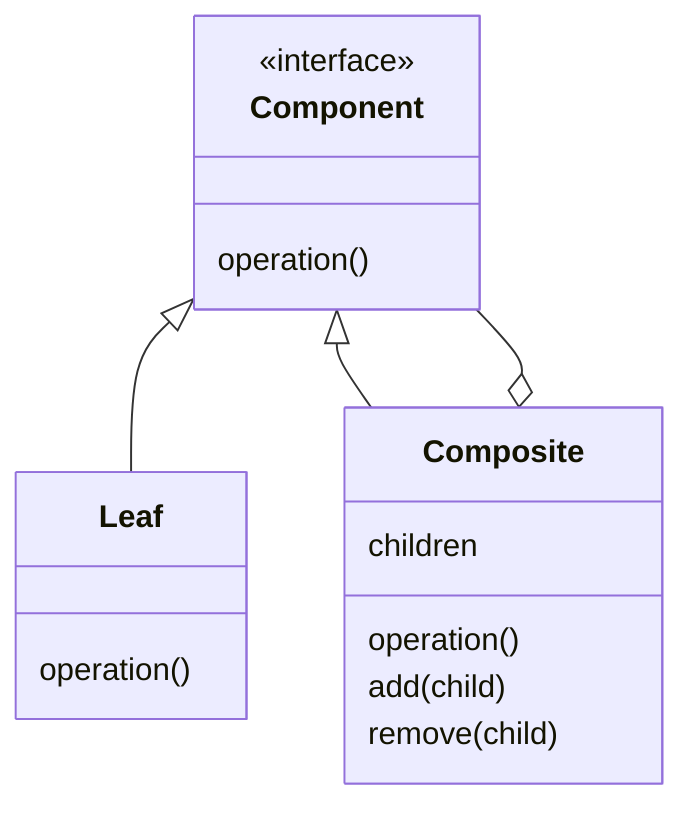

# Компоновщик (`Composite`)

Шаблон Композиция предназначен для того, чтобы можно было одинаково обрабатывать отдельные объекты и композиции объектов или «композиты».


## Полезные ссылки

### Официальная документация
- [Design Patterns: GoF (Elements of Reusable Object-Oriented Software)](https://refactoring.guru/design-patterns/book)

### Ресурсы
- [Composite Pattern in Java](https://www.baeldung.com/java-composite-pattern)
- [Composite Pattern in Kotlin](https://www.baeldung.com/kotlin-composite-pattern)

### См. также
- [Facade Pattern](facade.md)
- [Flyweight Pattern](flyweight.md)

## Содержание

- [Описание](#описание)
- [Компоненты](#компоненты)
- [Структура паттерна](#структура-паттерна)
- [Реализация на Java](#реализация-на-java)
- [Реализация на Kotlin](#реализация-на-kotlin)
- [Лучшие практики](#лучшие-практики)

## Суть и запомнить

**Суть в одном предложении:** Дерево объектов: листья и контейнеры реализуют один интерфейс, клиент работает с узлом, не различая тип.

**Запомнить:**
- Component — общий интерфейс; Leaf — конечный узел, Composite — контейнер с детьми.
- Операция у Composite делегируется всем дочерним компонентам.
- Клиент вызывает один метод по всему дереву.

**Когда применять:** иерархия «часть — целое» (меню, файловая система, отделы).

## Описание

Шаблон Композиция предназначен для того, чтобы можно было одинаково обрабатывать отдельные объекты и композиции объектов или «композиты». Его можно рассматривать как древовидную структуру, состоящую из типов, наследующих базовый тип, и он может представлять собой одну часть или целую иерархию объектов.
## Компоненты

- **Component (компонент):** это базовый интерфейс для всех объектов в композиции. Это должен быть либо интерфейс, либо абстрактный класс с общими методами для управления дочерними композитами.

- **Leaf (лист):** реализует поведение базового компонента по умолчанию. Он не содержит ссылки на другие объекты.

- **Composite (компонент-контейнер):** имеет листовые элементы. Он реализует методы базового компонента и определяет дочерние операции.

- **Client (клиент):** имеет доступ к элементам композиции, используя объект базового компонента.

## Структура паттерна

Компонент задаёт общий интерфейс; лист — конечный узел, композит — контейнер с дочерними компонентами.



## Реализация на Java

Базовый интерфейс компонента — `Department`; листовые классы — `FinancialDepartment`, `SalesDepartment`.

```java
// Базовый интерфейс компонента композиции — Leaf и Composite реализуют его
public interface Department {
    void printDepartmentName();
}
```

Классы листовых компонентов — финансовый отдел и отдел продаж:

```java
// Лист композиции: конечный узел без дочерних отделов.
public class FinancialDepartment implements Department {
    private Integer id;
    private String name;

    public FinancialDepartment(Integer id, String name) {
        this.id = id;
        this.name = name;
    }

    @Override
    public void printDepartmentName() {
        System.out.println(getClass().getSimpleName());
    }
}
```

**Второй конечный класс, `SalesDepartment`, аналогичен:**

```java
// Лист композиции: отдел продаж, без дочерних отделов.
public class SalesDepartment implements Department {
    private Integer id;
    private String name;

    public SalesDepartment(Integer id, String name) {
        this.id = id;
        this.name = name;
    }

    @Override
    public void printDepartmentName() {
        System.out.println(getClass().getSimpleName());
    }
}
```

Оба класса реализуют метод `printDepartmentName()` из базового компонента, где они печатают имена классов для каждого из них.

Кроме того, поскольку они являются конечными классами, они не содержат других объектов отдела.

Далее, давайте также рассмотрим составной класс.

**В качестве составного класса создадим класс `HeadDepartment`:**

```java
// Композит: контейнер с дочерними компонентами; делегирует вызовы детям.
public class HeadDepartment implements Department {
    private Integer id;
    private String name;
    private List<Department> childDepartments;

    public HeadDepartment(Integer id, String name) {
        this.id = id;
        this.name = name;
        this.childDepartments = new ArrayList<>();
    }

    @Override
    public void printDepartmentName() {
        childDepartments.forEach(Department::printDepartmentName);
    }

    public void addDepartment(Department department) {
        childDepartments.add(department);
    }

    public void removeDepartment(Department department) {
        childDepartments.remove(department);
    }
}
```

Это составной класс, так как он содержит коллекцию компонентов отдела, а также методы добавления и удаления элементов из списка.

Составной метод `printDepartmentName()` реализуется перебором списка конечных элементов и вызова соответствующего метода для каждого из них.

**В целях тестирования давайте взглянем на класс `CompositeDemo`:**

```java
// Клиент: собирает дерево компонентов и вызывает операцию через общий интерфейс.
public class CompositeDemo {
    public static void main(String args[]) {
        Department salesDepartment = new SalesDepartment(1, "Sales department");
        Department financialDepartment = new FinancialDepartment(2, "Financial department");

        HeadDepartment headDepartment = new HeadDepartment(3, "Head department");

        headDepartment.addDepartment(salesDepartment);
        headDepartment.addDepartment(financialDepartment);

        headDepartment.printDepartmentName();
    }
}
```

Во-первых, мы создаем два экземпляра для финансового отдела и отдела продаж. После этого мы создаем головной отдел и добавляем к нему ранее созданные экземпляры.

При вызове `printDepartmentName()` у корня выводится имя каждого листового компонента:

```text
SalesDepartment
FinancialDepartment
```

## Реализация на Kotlin

```kotlin
// Базовый интерфейс компонента композиции.
interface Department {
    fun printDepartmentName()
}

// Лист: конечный узел.
class FinancialDepartment(private val id: Int, private val name: String) : Department {
    override fun printDepartmentName() {
        println(this::class.simpleName)
    }
}

class SalesDepartment(private val id: Int, private val name: String) : Department {
    override fun printDepartmentName() {
        println(this::class.simpleName)
    }
}

// Композит: контейнер с дочерними отделами.
class HeadDepartment(private val id: Int, private val name: String) : Department {
    private val childDepartments = mutableListOf<Department>()

    override fun printDepartmentName() {
        childDepartments.forEach { it.printDepartmentName() }
    }

    fun addDepartment(department: Department) {
        childDepartments.add(department)
    }

    fun removeDepartment(department: Department) {
        childDepartments.remove(department)
    }
}
```

Пример использования:

```kotlin
fun main() {
    val salesDepartment = SalesDepartment(1, "Sales department")
    val financialDepartment = FinancialDepartment(2, "Financial department")

    val headDepartment = HeadDepartment(3, "Head department")
    headDepartment.addDepartment(salesDepartment)
    headDepartment.addDepartment(financialDepartment)

    headDepartment.printDepartmentName()
}
```

## Лучшие практики

- **Единый интерфейс для Leaf и Composite:** клиент работает с компонентом через один интерфейс; не проверяйте тип (лист или контейнер) в клиентском коде без необходимости.
- **Порядок обхода:** при необходимости задайте явный порядок обхода (прямой, обратный, в ширину); учитывайте циклы, если структура может быть не деревом.
- **Управление потомками:** операции add/remove должны быть только у Composite; в интерфейсе компонента их может не быть — тогда клиент работает только с корнем.
- **Память и производительность:** при глубоких деревьях учитывайте рекурсию и количество узлов; кэширование результата обхода возможно, но требует инвалидации при изменении структуры.
- **Не злоупотребляйте:** используйте композицию там, где есть явная иерархия «часть–целое»; для простых коллекций достаточно списка или итератора.

