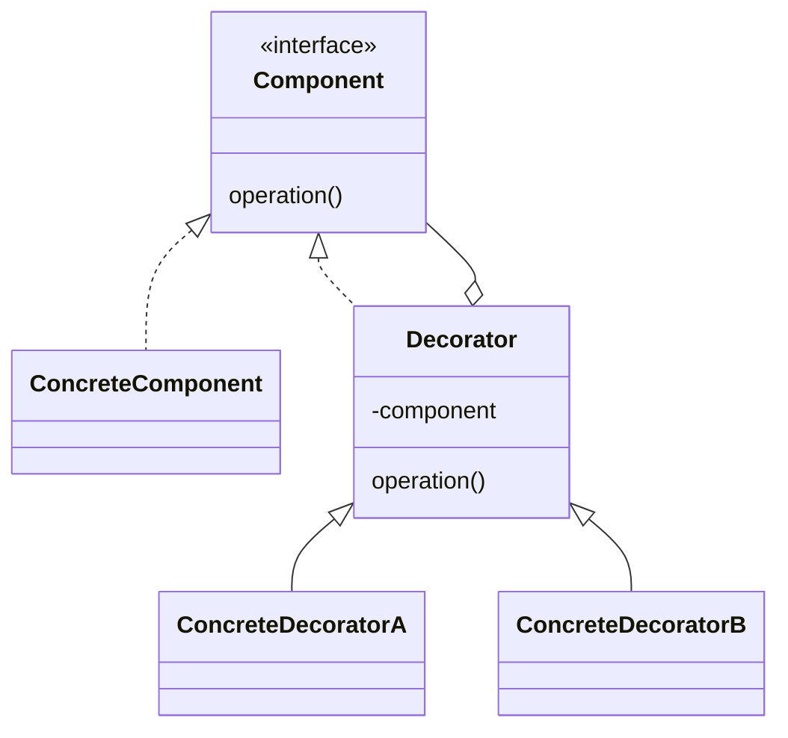

# Декоратор (`Decorator`)

**Decorator** динамически добавляет новые обязанности объектам, предоставляя гибкую альтернативу наследованию для расширения функциональности.

**Дата последнего обновления:** 2026-02-06

## Полезные ссылки

### Официальная документация
- [Java Streams](https://docs.oracle.com/en/java/javase/17/docs/api/java.base/java/util/stream/Stream.html)
- [Java Collections Unmodifiable](https://docs.oracle.com/en/java/javase/17/docs/api/java.base/java/util/Collections.html#unmodifiableCollection(java.util.Collection))

### См. также
- [Adapter](adapter.md) — **Adapter Pattern**
- [Spring AOP](../../frameworks/java-frameworks/spring/spring-aop.md) — **Spring AOP**
- [Java I/O NIO](../../languages/java/java-io-nio.md) — Java I/O
- [Kotlin Delegation](https://kotlinlang.org/docs/delegation.html) — делегирование и декораторы

## Содержание

- [Что такое Decorator?](#что-такое-decorator)
  - [Основные характеристики](#основные-характеристики)
  - [Проблемы, которые решает](#проблемы-которые-решает)
- [Когда использовать Decorator?](#когда-использовать-decorator)
  - [Подходящие сценарии](#подходящие-сценарии)
  - [Признаки необходимости](#признаки-необходимости)
- [Структура паттерна](#структура-паттерна)
  - [Компоненты](#компоненты)
- [Реализация на Java](#реализация-на-java)
  - [Классический Decorator](#классический-decorator)
  - [Java I/O Streams (встроенный пример)](#java-io-streams-встроенный-пример)
  - [Collections.unmodifiable (встроенный пример)](#collectionsunmodifiable-встроенный-пример)
- [Реализация на Kotlin](#реализация-на-kotlin)
  - [Подход через композицию](#подход-через-композицию)
  - [Подход через делегирование (by)](#подход-через-делегирование-by)
- [Продвинутые реализации](#продвинутые-реализации)
  - [1. Generic Decorator](#1-generic-decorator)
  - [2. Conditional Decorator](#2-conditional-decorator)
  - [3. Dynamic Decorator](#3-dynamic-decorator)
- [Примеры использования](#примеры-использования)
  - [1. Spring AOP-like Decorator](#1-spring-aop-like-decorator)
  - [2. Database Connection Decorator](#2-database-connection-decorator)
  - [3. HTTP Client Decorator](#3-http-client-decorator)
- [Лучшие практики](#лучшие-практики)
  - [1. Когда использовать Decorator](#1-когда-использовать-decorator)
  - [2. Избегание распространенных ошибок](#2-избегание-распространенных-ошибок)
  - [3. Производительность и оптимизации](#3-производительность-и-оптимизации)
  - [4. Тестирование декораторов](#4-тестирование-декораторов)
- [Решение проблем](#решение-проблем)
- [Частые вопросы](#частые-вопросы)
- [Заключение](#заключение)

## Что такое **Decorator**?

**Decorator** — это структурный паттерн проектирования, который позволяет динамически добавлять новые обязанности объектам. Он выступает прозрачной оболочкой для объекта, добавляя поведение без изменения его интерфейса.

### Основные характеристики

1. **Динамическое расширение**: Добавление функциональности во время выполнения
2. **Прозрачность**: Клиент работает с декоратором как с обычным объектом
3. **Композиция**: Декораторы могут комбинироваться друг с другом
4. **Единый интерфейс**: Все декораторы реализуют общий интерфейс

### Проблемы, которые решает

Сравнение: наследование для каждой комбинации vs динамическая композиция через **Decorator**.

```java
// Плохо: Наследование для каждой комбинации функций
public class TextView {
    // базовый функционал
}

public class ScrollableTextView extends TextView {
    // + прокрутка
}

public class BorderedTextView extends TextView {
    // + рамка
}

public class ScrollableBorderedTextView extends TextView {
    // + прокрутка + рамка
}

// Новые комбинации требуют новых классов!

// Хорошо: Decorator позволяет комбинировать функции динамически
TextView textView = new TextView();
ScrollableTextView scrollable = new ScrollableDecorator(textView);
BorderedTextView bordered = new BorderedDecorator(scrollable);
// Или: new BorderedDecorator(new ScrollableDecorator(new TextView()))
```

## Когда использовать **Decorator**?

### Подходящие сценарии

- **Динамическое расширение**: Добавление функций во время выполнения
- **Избегание наследования**: Когда наследование создает слишком много классов
- **Композиция поведения**: Когда нужно комбинировать разные поведения
- **Открытость к расширению**: Добавление функций без изменения существующего кода
- **Logging и monitoring**: Обертывание объектов для логирования

### Признаки необходимости

```java
// Признаки: Множество подклассов для разных комбинаций
public class Indicators {

    // Много похожих классов с небольшими отличиями
    public class Coffee {
        public double cost() { return 2.0; }
        public String description() { return "Coffee"; }
    }

    public class MilkCoffee extends Coffee {
        @Override
        public double cost() { return super.cost() + 0.5; }
        @Override
        public String description() { return super.description() + " with milk"; }
    }

    public class SugarCoffee extends Coffee {
        @Override
        public double cost() { return super.cost() + 0.2; }
        @Override
        public String description() { return super.description() + " with sugar"; }
    }

    public class MilkSugarCoffee extends Coffee {
        @Override
        public double cost() { return super.cost() + 0.7; }
        @Override
        public String description() { return super.description() + " with milk and sugar"; }
    }

    // Decorator решает это изящно
    public class CoffeeDecorator implements Coffee {
        protected Coffee decoratedCoffee;

        public CoffeeDecorator(Coffee coffee) {
            this.decoratedCoffee = coffee;
        }

        @Override
        public double cost() { return decoratedCoffee.cost(); }
        @Override
        public String description() { return decoratedCoffee.description(); }
    }
}
```

## Структура паттерна



```text
┌─────────────────────────────────────────────────────────────┐
│                    Component (Interface)                    │
│                                                             │
│  operation()                                                │
│                                                             │
└─────────────────────────────────────────────────────────────┼─┘
                                                              │
┌─────────────────────────────────────────────────────────────┼─┐
│                    ConcreteComponent                        │ │
│                                                             │ │
│  operation()                                                │ │
│    // Реализация базовой операции                          │ │
└─────────────────────────────────────────────────────────────┼─┘
                                                              │
┌─────────────────────────────────────────────────────────────┼─┐
│                    Decorator (Abstract)                     │ │
│                                                             │ │
│  ┌─────────────────────────────────────────────────────┐    │ │
│  │                Component component                 │    │ │
│  │                                                     │    │ │
│  │ operation() {                                       │    │ │
│  │   component.operation();                            │    │ │
│  │   // Дополнительная логика                          │    │ │
│  │ }                                                   │    │ │
│  └─────────────────────────────────────────────────────┘    │ │
└─────────────────────────────────────────────────────────────┘
                                                              │
┌─────────────────────────────────────────────────────────────┼─┐
│                    ConcreteDecoratorA                       │ │
│                                                             │ │
│  operation()                                                │ │
│    super.operation();                                       │ │
│    // Конкретная дополнительная логика A                   │ │
└─────────────────────────────────────────────────────────────┼─┘
                                                              │
┌─────────────────────────────────────────────────────────────┼─┐
│                    ConcreteDecoratorB                       │ │
│                                                             │ │
│  operation()                                                │ │
│    super.operation();                                       │ │
│    // Конкретная дополнительная логика B                   │ │
└─────────────────────────────────────────────────────────────┼─┘
```

### Компоненты

1. **Component**: Общий интерфейс для компонентов и декораторов
2. **ConcreteComponent**: Базовая реализация компонента
3. **Decorator**: Абстрактный декоратор, содержит ссылку на компонент
4. **ConcreteDecorator**: Конкретные реализации декораторов

## Реализация на Java

### Классический **Decorator**

```java
// Component
interface Coffee {
    double cost();
    String description();
}

// ConcreteComponent
class SimpleCoffee implements Coffee {
    @Override
    public double cost() {
        return 2.0;
    }

    @Override
    public String description() {
        return "Simple coffee";
    }
}

// Decorator
abstract class CoffeeDecorator implements Coffee {
    protected Coffee decoratedCoffee;

    public CoffeeDecorator(Coffee coffee) {
        this.decoratedCoffee = coffee;
    }

    @Override
    public double cost() {
        return decoratedCoffee.cost();
    }

    @Override
    public String description() {
        return decoratedCoffee.description();
    }
}

// ConcreteDecorators
class MilkDecorator extends CoffeeDecorator {
    public MilkDecorator(Coffee coffee) {
        super(coffee);
    }

    @Override
    public double cost() {
        return super.cost() + 0.5;
    }

    @Override
    public String description() {
        return super.description() + " with milk";
    }
}

class SugarDecorator extends CoffeeDecorator {
    public SugarDecorator(Coffee coffee) {
        super(coffee);
    }

    @Override
    public double cost() {
        return super.cost() + 0.2;
    }

    @Override
    public String description() {
        return super.description() + " with sugar";
    }
}

class WhippedCreamDecorator extends CoffeeDecorator {
    public WhippedCreamDecorator(Coffee coffee) {
        super(coffee);
    }

    @Override
    public double cost() {
        return super.cost() + 0.7;
    }

    @Override
    public String description() {
        return super.description() + " with whipped cream";
    }
}

// Клиент
public class CoffeeDecoratorDemo {
    public static void main(String[] args) {
        // Простой кофе
        Coffee coffee = new SimpleCoffee();
        System.out.println(coffee.description() + " costs $" + coffee.cost());

        // Кофе с молоком
        coffee = new MilkDecorator(coffee);
        System.out.println(coffee.description() + " costs $" + coffee.cost());

        // Кофе с молоком и сахаром
        coffee = new SugarDecorator(coffee);
        System.out.println(coffee.description() + " costs $" + coffee.cost());

        // Кофе со всем
        coffee = new WhippedCreamDecorator(coffee);
        System.out.println(coffee.description() + " costs $" + coffee.cost());

        // Другой кофе с другими добавками
        Coffee anotherCoffee = new WhippedCreamDecorator(
            new SugarDecorator(
                new SimpleCoffee()
            )
        );
        System.out.println(anotherCoffee.description() + " costs $" + anotherCoffee.cost());
    }
}
```

### Java I/O Streams (встроенный пример)

```java
public class JavaIODecoratorDemo {
    public static void main(String[] args) {
        try {
            // Декорирование потоков
            FileInputStream fis = new FileInputStream("input.txt");

            // BufferedInputStream декорирует FileInputStream
            BufferedInputStream bis = new BufferedInputStream(fis);

            // DataInputStream декорирует BufferedInputStream
            DataInputStream dis = new DataInputStream(bis);

            // Чтение данных
            int intValue = dis.readInt();
            double doubleValue = dis.readDouble();
            String stringValue = dis.readUTF();

            System.out.println("Read values: " + intValue + ", " + doubleValue + ", " + stringValue);

            // Закрытие (декораторы автоматически закрывают вложенные потоки)
            dis.close();

        } catch (IOException e) {
            e.printStackTrace();
        }

        try {
            // Аналогично для записи
            FileOutputStream fos = new FileOutputStream("output.txt");
            BufferedOutputStream bos = new BufferedOutputStream(fos);
            DataOutputStream dos = new DataOutputStream(bos);

            dos.writeInt(42);
            dos.writeDouble(3.14);
            dos.writeUTF("Hello, Decorator!");

            dos.close();

        } catch (IOException e) {
            e.printStackTrace();
        }
    }
}
```

### Collections.unmodifiable (встроенный пример)

```java
public class CollectionsDecoratorDemo {
    public static void main(String[] args) {
        // Создание модифицируемого списка
        List<String> originalList = new ArrayList<>();
        originalList.add("one");
        originalList.add("two");
        originalList.add("three");

        // Декорирование в неизменяемый список
        List<String> unmodifiableList = Collections.unmodifiableList(originalList);

        System.out.println("Original list: " + originalList);
        System.out.println("Unmodifiable list: " + unmodifiableList);

        // Попытка модификации декорированного списка
        try {
            unmodifiableList.add("four"); // Выбросит UnsupportedOperationException
        } catch (UnsupportedOperationException e) {
            System.out.println("Cannot modify unmodifiable list: " + e.getMessage());
        }

        // Модификация оригинального списка влияет на декорированный
        originalList.add("four");
        System.out.println("After modifying original:");
        System.out.println("Original list: " + originalList);
        System.out.println("Unmodifiable list: " + unmodifiableList);
    }
}
```

## Реализация на Kotlin

В Kotlin декоратор можно реализовать через композицию (как в Java) или через встроенное делегирование (`by`), что сокращает шаблонный код.

### Подход через композицию

Базовый интерфейс и реализация:

```kotlin
interface ChristmasTree {
    fun decorate(): String
}

class PineChristmasTree : ChristmasTree {
    override fun decorate() = "Christmas tree"
}
```

Абстрактный декоратор и конкретный декоратор:

```kotlin
abstract class TreeDecorator(private val tree: ChristmasTree) : ChristmasTree {
    override fun decorate(): String = tree.decorate()
}

class BubbleLights(tree: ChristmasTree) : TreeDecorator(tree) {
    override fun decorate(): String {
        return super.decorate() + " with Bubble Lights"
    }
}
```

Использование:

```kotlin
val tree = BubbleLights(PineChristmasTree())
println(tree.decorate())  // "Christmas tree with Bubble Lights"
```

### Подход через делегирование (by)

Kotlin позволяет делегировать вызовы обёрнутому объекту через `by` и переопределять только нужные методы:

```kotlin
class Garlands(private val tree: ChristmasTree) : ChristmasTree by tree {
    override fun decorate(): String {
        return tree.decorate() + " with Garlands"
    }
}
```

Использование:

```kotlin
val tree = Garlands(BubbleLights(PineChristmasTree()))
println(tree.decorate())  // "Christmas tree with Bubble Lights with Garlands"
```

Для декораторов в Kotlin предпочтительно использовать делегирование `by`: переопределяйте только те методы, в которые добавляете поведение.

## Продвинутые реализации

### 1. **Generic Decorator**

```java
// Обобщенный декоратор
public class GenericDecorator<T> implements Supplier<T> {

    private final Supplier<T> decorated;
    private final Consumer<T> beforeAction;
    private final Consumer<T> afterAction;
    private final Function<T, T> transformer;

    private GenericDecorator(Builder<T> builder) {
        this.decorated = builder.decorated;
        this.beforeAction = builder.beforeAction;
        this.afterAction = builder.afterAction;
        this.transformer = builder.transformer;
    }

    @Override
    public T get() {
        if (beforeAction != null) {
            // Имитация действия перед вызовом
            beforeAction.accept(null);
        }

        T result = decorated.get();

        if (transformer != null) {
            result = transformer.apply(result);
        }

        if (afterAction != null) {
            afterAction.accept(result);
        }

        return result;
    }

    public static <T> Builder<T> builder(Supplier<T> decorated) {
        return new Builder<>(decorated);
    }

    public static class Builder<T> {
        private final Supplier<T> decorated;
        private Consumer<T> beforeAction;
        private Consumer<T> afterAction;
        private Function<T, T> transformer;

        public Builder(Supplier<T> decorated) {
            this.decorated = decorated;
        }

        public Builder<T> before(Consumer<T> action) {
            this.beforeAction = action;
            return this;
        }

        public Builder<T> after(Consumer<T> action) {
            this.afterAction = action;
            return this;
        }

        public Builder<T> transform(Function<T, T> transformer) {
            this.transformer = transformer;
            return this;
        }

        public GenericDecorator<T> build() {
            return new GenericDecorator<>(this);
        }
    }
}

// Использование
public class GenericDecoratorDemo {
    public static void main(String[] args) {
        Supplier<String> original = () -> "Hello World";

        // Декоратор с логированием
        Supplier<String> loggingDecorator = GenericDecorator.builder(original)
            .before(result -> System.out.println("About to get value"))
            .after(result -> System.out.println("Got value: " + result))
            .build();

        // Декоратор с трансформацией
        Supplier<String> transformDecorator = GenericDecorator.builder(original)
            .transform(String::toUpperCase)
            .after(result -> System.out.println("Transformed: " + result))
            .build();

        // Комбинирование декораторов
        Supplier<String> combinedDecorator = GenericDecorator.builder(transformDecorator)
            .before(result -> System.out.println("Starting combined operation"))
            .after(result -> System.out.println("Completed combined operation"))
            .build();

        System.out.println("=== Logging Decorator ===");
        String result1 = loggingDecorator.get();

        System.out.println("\n=== Transform Decorator ===");
        String result2 = transformDecorator.get();

        System.out.println("\n=== Combined Decorator ===");
        String result3 = combinedDecorator.get();

        System.out.println("\nResults: " + result1 + ", " + result2 + ", " + result3);
    }
}
```

### 2. **Conditional Decorator**

```java
// Декоратор с условиями применения
public class ConditionalDecorator<T> implements Supplier<T> {

    private final Supplier<T> decorated;
    private final Predicate<T> condition;
    private final Function<T, T> decoratorFunction;

    public ConditionalDecorator(Supplier<T> decorated, Predicate<T> condition,
                              Function<T, T> decoratorFunction) {
        this.decorated = decorated;
        this.condition = condition;
        this.decoratorFunction = decoratorFunction;
    }

    @Override
    public T get() {
        T result = decorated.get();

        if (condition.test(result)) {
            return decoratorFunction.apply(result);
        }

        return result;
    }

    public static <T> ConditionalDecorator<T> create(Supplier<T> decorated,
                                                   Predicate<T> condition,
                                                   Function<T, T> decoratorFunction) {
        return new ConditionalDecorator<>(decorated, condition, decoratorFunction);
    }
}

// Цепочка условных декораторов
public class ConditionalDecoratorChain<T> implements Supplier<T> {

    private final List<ConditionalDecorator<T>> decorators;
    private final Supplier<T> original;

    private ConditionalDecoratorChain(Builder<T> builder) {
        this.original = builder.original;
        this.decorators = new ArrayList<>(builder.decorators);
    }

    @Override
    public T get() {
        T result = original.get();

        for (ConditionalDecorator<T> decorator : decorators) {
            result = decorator.get(); // Каждый декоратор применяет свою логику
        }

        return result;
    }

    public static <T> Builder<T> builder(Supplier<T> original) {
        return new Builder<>(original);
    }

    public static class Builder<T> {
        private final Supplier<T> original;
        private final List<ConditionalDecorator<T>> decorators = new ArrayList<>();

        public Builder(Supplier<T> original) {
            this.original = original;
        }

        public Builder<T> addDecorator(Predicate<T> condition, Function<T, T> decoratorFunction) {
            decorators.add(new ConditionalDecorator<>(original, condition, decoratorFunction));
            return this;
        }

        public ConditionalDecoratorChain<T> build() {
            return new ConditionalDecoratorChain<>(this);
        }
    }
}

// Использование
public class ConditionalDecoratorDemo {
    public static void main(String[] args) {
        Supplier<Integer> numberSupplier = () -> ThreadLocalRandom.current().nextInt(100);

        // Условный декоратор: удваивает числа > 50
        ConditionalDecorator<Integer> doubler = ConditionalDecorator.create(
            numberSupplier,
            num -> num > 50,
            num -> num * 2
        );

        // Цепочка декораторов
        ConditionalDecoratorChain<Integer> chain = ConditionalDecoratorChain.builder(numberSupplier)
            .addDecorator(num -> num > 50, num -> num * 2)      // Удваивает > 50
            .addDecorator(num -> num % 2 == 0, num -> num + 1)  // Делает нечетным четные числа
            .addDecorator(num -> num > 75, num -> 75)           // Ограничивает максимум 75
            .build();

        System.out.println("=== Single Conditional Decorator ===");
        for (int i = 0; i < 5; i++) {
            int original = numberSupplier.get();
            int decorated = doubler.get();
            System.out.println("Original: " + original + ", Decorated: " + decorated);
        }

        System.out.println("\n=== Decorator Chain ===");
        for (int i = 0; i < 5; i++) {
            int result = chain.get();
            System.out.println("Chain result: " + result);
        }
    }
}
```

### 3. **Dynamic Decorator**

```java
// Динамический декоратор с reflection
public class DynamicDecorator<T> implements InvocationHandler {

    private final T decoratedObject;
    private final Map<String, Consumer<Object[]>> beforeActions = new HashMap<>();
    private final Map<String, Consumer<Object>> afterActions = new HashMap<>();
    private final Map<String, Function<Object, Object>> resultTransformers = new HashMap<>();

    private DynamicDecorator(T decoratedObject) {
        this.decoratedObject = decoratedObject;
    }

    @SuppressWarnings("unchecked")
    public static <T> T create(T object, Class<T> interfaceClass) {
        return (T) Proxy.newProxyInstance(
            interfaceClass.getClassLoader(),
            new Class<?>[]{interfaceClass},
            new DynamicDecorator<>(object)
        );
    }

    @Override
    public Object invoke(Object proxy, Method method, Object[] args) throws Throwable {
        String methodName = method.getName();

        // Before action
        Consumer<Object[]> beforeAction = beforeActions.get(methodName);
        if (beforeAction != null) {
            beforeAction.accept(args);
        }

        // Вызов оригинального метода
        Object result = method.invoke(decoratedObject, args);

        // After action
        Consumer<Object> afterAction = afterActions.get(methodName);
        if (afterAction != null) {
            afterAction.accept(result);
        }

        // Result transformation
        Function<Object, Object> transformer = resultTransformers.get(methodName);
        if (transformer != null) {
            result = transformer.apply(result);
        }

        return result;
    }

    // Fluent API для настройки
    public DynamicDecorator<T> before(String methodName, Consumer<Object[]> action) {
        beforeActions.put(methodName, action);
        return this;
    }

    public DynamicDecorator<T> after(String methodName, Consumer<Object> action) {
        afterActions.put(methodName, action);
        return this;
    }

    public DynamicDecorator<T> transform(String methodName, Function<Object, Object> transformer) {
        resultTransformers.put(methodName, transformer);
        return this;
    }
}

// Пример использования
interface Calculator {
    int add(int a, int b);
    int multiply(int a, int b);
    double divide(int a, int b);
}

class SimpleCalculator implements Calculator {
    @Override
    public int add(int a, int b) {
        return a + b;
    }

    @Override
    public int multiply(int a, int b) {
        return a * b;
    }

    @Override
    public double divide(int a, int b) {
        return (double) a / b;
    }
}

public class DynamicDecoratorDemo {
    public static void main(String[] args) {
        SimpleCalculator calculator = new SimpleCalculator();

        // Создание динамического декоратора
        Calculator decoratedCalculator = DynamicDecorator.create(calculator, Calculator.class);

        // Настройка декоратора
        ((DynamicDecorator<Calculator>) Proxy.getInvocationHandler(decoratedCalculator))
            .before("add", args -> System.out.println("About to add: " + args[0] + " + " + args[1]))
            .after("add", result -> System.out.println("Add result: " + result))
            .before("multiply", args -> System.out.println("About to multiply: " + args[0] + " * " + args[1]))
            .transform("divide", result -> Math.round((Double) result * 100.0) / 100.0);

        // Использование
        System.out.println("=== Calculator with Dynamic Decorator ===");
        int sum = decoratedCalculator.add(5, 3);
        int product = decoratedCalculator.multiply(4, 7);
        double quotient = decoratedCalculator.divide(10, 3);

        System.out.println("Final results: sum=" + sum + ", product=" + product + ", quotient=" + quotient);
    }
}
```

## Примеры использования

### 1. **Spring AOP-like Decorator**

```java
@Service
public class LoggingDecoratorExample {

    // Декоратор для логирования
    public static class LoggingDecorator<T> implements Supplier<T> {

        private final Supplier<T> delegate;
        private final String operationName;

        public LoggingDecorator(Supplier<T> delegate, String operationName) {
            this.delegate = delegate;
            this.operationName = operationName;
        }

        @Override
        public T get() {
            System.out.println("Starting operation: " + operationName);
            long startTime = System.nanoTime();

            try {
                T result = delegate.get();
                long duration = (System.nanoTime() - startTime) / 1_000_000;
                System.out.println("Completed operation: " + operationName + " in " + duration + "ms");
                return result;
            } catch (Exception e) {
                long duration = (System.nanoTime() - startTime) / 1_000_000;
                System.err.println("Failed operation: " + operationName + " after " + duration + "ms");
                throw e;
            }
        }
    }

    // Декоратор для кэширования
    public static class CachingDecorator<T> implements Supplier<T> {

        private final Supplier<T> delegate;
        private final String cacheKey;
        private final Cache<String, T> cache;

        public CachingDecorator(Supplier<T> delegate, String cacheKey, Cache<String, T> cache) {
            this.delegate = delegate;
            this.cacheKey = cacheKey;
            this.cache = cache;
        }

        @Override
        public T get() {
            return cache.get(cacheKey, k -> {
                System.out.println("Cache miss for: " + k + ", computing...");
                return delegate.get();
            });
        }
    }

    // Сервис с декораторами
    @Service
    public class UserService {

        private final UserRepository userRepository;
        private final Cache<String, User> userCache;

        @Autowired
        public UserService(UserRepository userRepository, Cache<String, User> userCache) {
            this.userRepository = userRepository;
            this.userCache = userCache;
        }

        public User getUserById(String userId) {
            Supplier<User> baseOperation = () -> userRepository.findById(userId)
                .orElseThrow(() -> new UserNotFoundException("User not found: " + userId));

            Supplier<User> cachedOperation = new CachingDecorator<>(
                baseOperation, "user:" + userId, userCache);

            Supplier<User> loggedOperation = new LoggingDecorator<>(
                cachedOperation, "getUserById(" + userId + ")");

            return loggedOperation.get();
        }

        public List<User> getAllUsers() {
            Supplier<List<User>> baseOperation = userRepository::findAll;

            Supplier<List<User>> loggedOperation = new LoggingDecorator<>(
                baseOperation, "getAllUsers()");

            return loggedOperation.get();
        }
    }
}
```

### 2. **Database Connection Decorator**

```java
@Configuration
public class DatabaseDecoratorConfig {

    @Bean
    public DataSource loggingDataSource(DataSource originalDataSource) {
        return new LoggingDataSourceDecorator(originalDataSource);
    }

    @Bean
    public DataSource monitoringDataSource(DataSource loggingDataSource) {
        return new MonitoringDataSourceDecorator(loggingDataSource);
    }

    // Декоратор для логирования
    public static class LoggingDataSourceDecorator implements DataSource {

        private final DataSource delegate;

        public LoggingDataSourceDecorator(DataSource delegate) {
            this.delegate = delegate;
        }

        @Override
        public Connection getConnection() throws SQLException {
            System.out.println("Getting database connection...");
            long startTime = System.nanoTime();

            try {
                Connection connection = delegate.getConnection();
                long duration = (System.nanoTime() - startTime) / 1_000_000;
                System.out.println("Connection obtained in " + duration + "ms");
                return new LoggingConnectionDecorator(connection);
            } catch (SQLException e) {
                long duration = (System.nanoTime() - startTime) / 1_000_000;
                System.err.println("Failed to get connection in " + duration + "ms: " + e.getMessage());
                throw e;
            }
        }

        @Override
        public Connection getConnection(String username, String password) throws SQLException {
            return delegate.getConnection(username, password);
        }

        @Override
        public PrintWriter getLogWriter() throws SQLException {
            return delegate.getLogWriter();
        }

        @Override
        public void setLogWriter(PrintWriter out) throws SQLException {
            delegate.setLogWriter(out);
        }

        @Override
        public void setLoginTimeout(int seconds) throws SQLException {
            delegate.setLoginTimeout(seconds);
        }

        @Override
        public int getLoginTimeout() throws SQLException {
            return delegate.getLoginTimeout();
        }

        @Override
        public Logger getParentLogger() throws SQLFeatureNotSupportedException {
            return delegate.getParentLogger();
        }

        @Override
        public <T> T unwrap(Class<T> iface) throws SQLException {
            return delegate.unwrap(iface);
        }

        @Override
        public boolean isWrapperFor(Class<?> iface) throws SQLException {
            return delegate.isWrapperFor(iface);
        }
    }

    // Декоратор для мониторинга
    public static class MonitoringDataSourceDecorator implements DataSource {

        private final DataSource delegate;
        private final AtomicLong connectionCount = new AtomicLong(0);
        private final AtomicLong errorCount = new AtomicLong(0);

        public MonitoringDataSourceDecorator(DataSource delegate) {
            this.delegate = delegate;
        }

        @Override
        public Connection getConnection() throws SQLException {
            try {
                Connection connection = delegate.getConnection();
                connectionCount.incrementAndGet();
                return connection;
            } catch (SQLException e) {
                errorCount.incrementAndGet();
                throw e;
            }
        }

        @Override
        public Connection getConnection(String username, String password) throws SQLException {
            return delegate.getConnection(username, password);
        }

        // Метрики
        public long getConnectionCount() {
            return connectionCount.get();
        }

        public long getErrorCount() {
            return errorCount.get();
        }

        // Остальные методы делегируют к delegate
        @Override
        public PrintWriter getLogWriter() throws SQLException {
            return delegate.getLogWriter();
        }

        @Override
        public void setLogWriter(PrintWriter out) throws SQLException {
            delegate.setLogWriter(out);
        }

        @Override
        public void setLoginTimeout(int seconds) throws SQLException {
            delegate.setLoginTimeout(seconds);
        }

        @Override
        public int getLoginTimeout() throws SQLException {
            return delegate.getLoginTimeout();
        }

        @Override
        public Logger getParentLogger() throws SQLFeatureNotSupportedException {
            return delegate.getParentLogger();
        }

        @Override
        public <T> T unwrap(Class<T> iface) throws SQLException {
            return delegate.unwrap(iface);
        }

        @Override
        public boolean isWrapperFor(Class<?> iface) throws SQLException {
            return delegate.isWrapperFor(iface);
        }
    }

    // Декоратор для соединений
    public static class LoggingConnectionDecorator implements Connection {

        private final Connection delegate;

        public LoggingConnectionDecorator(Connection delegate) {
            this.delegate = delegate;
        }

        @Override
        public Statement createStatement() throws SQLException {
            System.out.println("Creating statement");
            return delegate.createStatement();
        }

        @Override
        public PreparedStatement prepareStatement(String sql) throws SQLException {
            System.out.println("Preparing statement: " + sql);
            return delegate.prepareStatement(sql);
        }

        // Остальные методы делегируют к delegate
        // (в реальном коде нужно реализовать все методы интерфейса)

        @Override
        public CallableStatement prepareCall(String sql) throws SQLException {
            return delegate.prepareCall(sql);
        }

        @Override
        public String nativeSQL(String sql) throws SQLException {
            return delegate.nativeSQL(sql);
        }

        @Override
        public void setAutoCommit(boolean autoCommit) throws SQLException {
            delegate.setAutoCommit(autoCommit);
        }

        @Override
        public boolean getAutoCommit() throws SQLException {
            return delegate.getAutoCommit();
        }

        @Override
        public void commit() throws SQLException {
            System.out.println("Committing transaction");
            delegate.commit();
        }

        @Override
        public void rollback() throws SQLException {
            System.out.println("Rolling back transaction");
            delegate.rollback();
        }

        @Override
        public void close() throws SQLException {
            System.out.println("Closing connection");
            delegate.close();
        }

        @Override
        public boolean isClosed() throws SQLException {
            return delegate.isClosed();
        }

        // Остальные методы опущены для краткости
        @Override
        public DatabaseMetaData getMetaData() throws SQLException {
            return delegate.getMetaData();
        }

        @Override
        public void setReadOnly(boolean readOnly) throws SQLException {
            delegate.setReadOnly(readOnly);
        }

        @Override
        public boolean isReadOnly() throws SQLException {
            return delegate.isReadOnly();
        }

        @Override
        public void setCatalog(String catalog) throws SQLException {
            delegate.setCatalog(catalog);
        }

        @Override
        public String getCatalog() throws SQLException {
            return delegate.getCatalog();
        }

        @Override
        public void setTransactionIsolation(int level) throws SQLException {
            delegate.setTransactionIsolation(level);
        }

        @Override
        public int getTransactionIsolation() throws SQLException {
            return delegate.getTransactionIsolation();
        }

        @Override
        public SQLWarning getWarnings() throws SQLException {
            return delegate.getWarnings();
        }

        @Override
        public void clearWarnings() throws SQLException {
            delegate.clearWarnings();
        }

        @Override
        public Statement createStatement(int resultSetType, int resultSetConcurrency) throws SQLException {
            return delegate.createStatement(resultSetType, resultSetConcurrency);
        }

        @Override
        public PreparedStatement prepareStatement(String sql, int resultSetType, int resultSetConcurrency) throws SQLException {
            return delegate.prepareStatement(sql, resultSetType, resultSetConcurrency);
        }

        @Override
        public CallableStatement prepareCall(String sql, int resultSetType, int resultSetConcurrency) throws SQLException {
            return delegate.prepareCall(sql, resultSetType, resultSetConcurrency);
        }

        @Override
        public Map<String, Class<?>> getTypeMap() throws SQLException {
            return delegate.getTypeMap();
        }

        @Override
        public void setTypeMap(Map<String, Class<?>> map) throws SQLException {
            delegate.setTypeMap(map);
        }

        @Override
        public void setHoldability(int holdability) throws SQLException {
            delegate.setHoldability(holdability);
        }

        @Override
        public int getHoldability() throws SQLException {
            return delegate.getHoldability();
        }

        @Override
        public Savepoint setSavepoint() throws SQLException {
            return delegate.setSavepoint();
        }

        @Override
        public Savepoint setSavepoint(String name) throws SQLException {
            return delegate.setSavepoint(name);
        }

        @Override
        public void rollback(Savepoint savepoint) throws SQLException {
            delegate.rollback(savepoint);
        }

        @Override
        public void releaseSavepoint(Savepoint savepoint) throws SQLException {
            delegate.releaseSavepoint(savepoint);
        }

        @Override
        public Statement createStatement(int resultSetType, int resultSetConcurrency, int resultSetHoldability) throws SQLException {
            return delegate.createStatement(resultSetType, resultSetConcurrency, resultSetHoldability);
        }

        @Override
        public PreparedStatement prepareStatement(String sql, int resultSetType, int resultSetConcurrency, int resultSetHoldability) throws SQLException {
            return delegate.prepareStatement(sql, resultSetType, resultSetConcurrency, resultSetHoldability);
        }

        @Override
        public CallableStatement prepareCall(String sql, int resultSetType, int resultSetConcurrency, int resultSetHoldability) throws SQLException {
            return delegate.prepareCall(sql, resultSetType, resultSetConcurrency, resultSetHoldability);
        }

        @Override
        public PreparedStatement prepareStatement(String sql, int autoGeneratedKeys) throws SQLException {
            return delegate.prepareStatement(sql, autoGeneratedKeys);
        }

        @Override
        public PreparedStatement prepareStatement(String sql, int[] columnIndexes) throws SQLException {
            return delegate.prepareStatement(sql, columnIndexes);
        }

        @Override
        public PreparedStatement prepareStatement(String sql, String[] columnNames) throws SQLException {
            return delegate.prepareStatement(sql, columnNames);
        }

        @Override
        public Clob createClob() throws SQLException {
            return delegate.createClob();
        }

        @Override
        public Blob createBlob() throws SQLException {
            return delegate.createBlob();
        }

        @Override
        public NClob createNClob() throws SQLException {
            return delegate.createNClob();
        }

        @Override
        public SQLXML createSQLXML() throws SQLException {
            return delegate.createSQLXML();
        }

        @Override
        public boolean isValid(int timeout) throws SQLException {
            return delegate.isValid(timeout);
        }

        @Override
        public void setClientInfo(String name, String value) throws SQLClientInfoException {
            delegate.setClientInfo(name, value);
        }

        @Override
        public void setClientInfo(Properties properties) throws SQLClientInfoException {
            delegate.setClientInfo(properties);
        }

        @Override
        public String getClientInfo(String name) throws SQLException {
            return delegate.getClientInfo(name);
        }

        @Override
        public Properties getClientInfo() throws SQLException {
            return delegate.getClientInfo();
        }

        @Override
        public Array createArrayOf(String typeName, Object[] elements) throws SQLException {
            return delegate.createArrayOf(typeName, elements);
        }

        @Override
        public Struct createStruct(String typeName, Object[] attributes) throws SQLException {
            return delegate.createStruct(typeName, attributes);
        }

        @Override
        public void setSchema(String schema) throws SQLException {
            delegate.setSchema(schema);
        }

        @Override
        public String getSchema() throws SQLException {
            return delegate.getSchema();
        }

        @Override
        public void abort(Executor executor) throws SQLException {
            delegate.abort(executor);
        }

        @Override
        public void setNetworkTimeout(Executor executor, int milliseconds) throws SQLException {
            delegate.setNetworkTimeout(executor, milliseconds);
        }

        @Override
        public int getNetworkTimeout() throws SQLException {
            return delegate.getNetworkTimeout();
        }

        @Override
        public <T> T unwrap(Class<T> iface) throws SQLException {
            return delegate.unwrap(iface);
        }

        @Override
        public boolean isWrapperFor(Class<?> iface) throws SQLException {
            return delegate.isWrapperFor(iface);
        }
    }
}
```

### 3. **HTTP Client Decorator**

```java
@Service
public class HttpClientDecoratorExample {

    // Декоратор для логирования HTTP запросов
    public static class LoggingHttpClientDecorator implements HttpClient {

        private final HttpClient delegate;

        public LoggingHttpClientDecorator(HttpClient delegate) {
            this.delegate = delegate;
        }

        @Override
        public HttpResponse send(HttpRequest request, HttpResponse.BodyHandler bodyHandler)
                throws IOException, InterruptedException {

            System.out.println("HTTP Request: " + request.method() + " " + request.uri());
            request.headers().map().forEach((name, values) ->
                System.out.println("  " + name + ": " + String.join(", ", values)));

            long startTime = System.nanoTime();
            try {
                HttpResponse response = delegate.send(request, bodyHandler);
                long duration = (System.nanoTime() - startTime) / 1_000_000;

                System.out.println("HTTP Response: " + response.statusCode() + " (took " + duration + "ms)");
                response.headers().map().forEach((name, values) ->
                    System.out.println("  " + name + ": " + String.join(", ", values)));

                return response;
            } catch (Exception e) {
                long duration = (System.nanoTime() - startTime) / 1_000_000;
                System.err.println("HTTP Request failed after " + duration + "ms: " + e.getMessage());
                throw e;
            }
        }
    }

    // Декоратор для кэширования HTTP ответов
    public static class CachingHttpClientDecorator implements HttpClient {

        private final HttpClient delegate;
        private final Cache<String, HttpResponse> responseCache;
        private final long cacheExpirationMs;

        public CachingHttpClientDecorator(HttpClient delegate, long cacheExpirationMs) {
            this.delegate = delegate;
            this.cacheExpirationMs = cacheExpirationMs;
            this.responseCache = Caffeine.newBuilder()
                .expireAfterWrite(cacheExpirationMs, TimeUnit.MILLISECONDS)
                .maximumSize(100)
                .build();
        }

        @Override
        public HttpResponse send(HttpRequest request, HttpResponse.BodyHandler bodyHandler)
                throws IOException, InterruptedException {

            // Создаем ключ кэша на основе метода и URI
            String cacheKey = request.method() + ":" + request.uri();

            // Проверяем кэш только для GET запросов
            if ("GET".equals(request.method())) {
                HttpResponse cached = responseCache.getIfPresent(cacheKey);
                if (cached != null) {
                    System.out.println("Cache hit for: " + cacheKey);
                    return cached;
                }
            }

            // Выполняем запрос
            HttpResponse response = delegate.send(request, bodyHandler);

            // Кэшируем только успешные GET ответы
            if ("GET".equals(request.method()) && response.statusCode() >= 200 && response.statusCode() < 300) {
                responseCache.put(cacheKey, response);
                System.out.println("Cached response for: " + cacheKey);
            }

            return response;
        }
    }

    // Декоратор для retry логики
    public static class RetryHttpClientDecorator implements HttpClient {

        private final HttpClient delegate;
        private final int maxRetries;
        private final long delayMs;

        public RetryHttpClientDecorator(HttpClient delegate, int maxRetries, long delayMs) {
            this.delegate = delegate;
            this.maxRetries = maxRetries;
            this.delayMs = delayMs;
        }

        @Override
        public HttpResponse send(HttpRequest request, HttpResponse.BodyHandler bodyHandler)
                throws IOException, InterruptedException {

            int attempts = 0;
            Exception lastException = null;

            while (attempts <= maxRetries) {
                try {
                    return delegate.send(request, bodyHandler);
                } catch (IOException e) {
                    attempts++;
                    lastException = e;

                    if (attempts <= maxRetries) {
                        System.out.println("Request failed, attempt " + attempts + " of " + (maxRetries + 1));
                        Thread.sleep(delayMs);
                    }
                }
            }

            throw new IOException("Request failed after " + (maxRetries + 1) + " attempts", lastException);
        }
    }

    // Фабрика декорированных HTTP клиентов
    @Bean
    public HttpClient decoratedHttpClient(HttpClient originalClient) {
        return new LoggingHttpClientDecorator(
            new CachingHttpClientDecorator(
                new RetryHttpClientDecorator(originalClient, 3, 1000), 300000)); // 5 min cache
    }

    // Сервис использующий декорированный клиент
    @Service
    public class ApiClient {

        private final HttpClient httpClient;
        private final ObjectMapper objectMapper;

        @Autowired
        public ApiClient(HttpClient httpClient, ObjectMapper objectMapper) {
            this.httpClient = httpClient;
            this.objectMapper = objectMapper;
        }

        public <T> T get(String url, Class<T> responseType) throws Exception {
            HttpRequest request = HttpRequest.newBuilder()
                .uri(URI.create(url))
                .GET()
                .build();

            HttpResponse<String> response = httpClient.send(request,
                HttpResponse.BodyHandlers.ofString());

            return objectMapper.readValue(response.body(), responseType);
        }

        public <T, R> R post(String url, T requestBody, Class<R> responseType) throws Exception {
            String jsonBody = objectMapper.writeValueAsString(requestBody);

            HttpRequest request = HttpRequest.newBuilder()
                .uri(URI.create(url))
                .POST(HttpRequest.BodyPublishers.ofString(jsonBody))
                .header("Content-Type", "application/json")
                .build();

            HttpResponse<String> response = httpClient.send(request,
                HttpResponse.BodyHandlers.ofString());

            return objectMapper.readValue(response.body(), responseType);
        }
    }
}
```

## Лучшие практики

### 1. Когда использовать **Decorator**

```java
public class DecoratorGuidelines {

    // Используйте Decorator когда:
    // - Нужно добавлять обязанности объектам динамически
    // - Наследование создает слишком много классов
    // - Расширения должны быть прозрачными для клиентов
    // - Нужно комбинировать разные поведения

    // Пример: UI компоненты
    public interface VisualComponent {
        void draw();
        Dimension getSize();
    }

    // Декораторы для разных аспектов
    public class ScrollDecorator implements VisualComponent {
        private final VisualComponent component;

        @Override
        public void draw() {
            component.draw();
            drawScrollBars();
        }
    }

    public class BorderDecorator implements VisualComponent {
        private final VisualComponent component;

        @Override
        public void draw() {
            drawBorder();
            component.draw();
        }
    }

    // Комбинирование: new BorderDecorator(new ScrollDecorator(component))

    // НЕ используйте когда:
    // - Интерфейс компонента слишком большой (более 10 методов)
    // - Декораторы должны иметь состояние
    // - Конструкторы декораторов сложные
    // - Важна производительность (декораторы добавляют накладные расходы)
}
```

### 2. Избегание распространенных ошибок

```java
public class DecoratorPitfalls {

    // ОШИБКА: Нарушение Liskov Substitution Principle
    public class BrokenDecorator implements Component {
        private final Component component;

        @Override
        public void operation() {
            // Делает что-то другое, а не расширяет
            doSomethingCompletelyDifferent();
        }
    }

    // ПРАВИЛЬНО: Расширение, а не замена поведения
    public class CorrectDecorator implements Component {
        private final Component component;

        @Override
        public void operation() {
            // Дополнительная логика
            beforeOperation();
            component.operation();
            afterOperation();
        }
    }

    // ОШИБКА: Декоратор не реализует весь интерфейс
    public class IncompleteDecorator implements Component {
        private final Component component;

        @Override
        public void operation() {
            component.operation();
        }

        // Забыли реализовать другие методы интерфейса!
    }

    // ОШИБКА: Декоратор изменяет возвращаемые значения
    public class ValueChangingDecorator implements Component {
        private final Component component;

        @Override
        public String operation() {
            String result = component.operation();
            return result.toUpperCase(); // Изменяет контракт!
        }
    }

    // ПРАВИЛЬНО: Неизменность возвращаемых значений
    public class SafeDecorator implements Component {
        private final Component component;

        @Override
        public String operation() {
            logOperation();
            String result = component.operation();
            logResult(result);
            return result; // Возвращает без изменений
        }
    }
}
```

### 3. Производительность и оптимизации

```java
public class DecoratorPerformanceTips {

    // Ленивая инициализация декораторов
    public class LazyDecorator implements Component {
        private final Supplier<Component> componentSupplier;
        private volatile Component component;

        public LazyDecorator(Supplier<Component> componentSupplier) {
            this.componentSupplier = componentSupplier;
        }

        private Component getComponent() {
            Component result = component;
            if (result == null) {
                synchronized (this) {
                    result = component;
                    if (result == null) {
                        component = result = componentSupplier.get();
                    }
                }
            }
            return result;
        }

        @Override
        public void operation() {
            getComponent().operation();
        }
    }

    // Композитный декоратор для оптимизации
    public class CompositeDecorator implements Component {
        private final Component component;
        private final List<Consumer<Component>> decorators;

        @SafeVarargs
        public CompositeDecorator(Component component, Consumer<Component>... decorators) {
            this.component = component;
            this.decorators = Arrays.asList(decorators);
        }

        @Override
        public void operation() {
            // Применяем все декораторы за один проход
            decorators.forEach(decorator -> decorator.accept(component));
            component.operation();
        }
    }

    // Conditional декоратор
    public class ConditionalDecorator implements Component {
        private final Component component;
        private final Component decoratedComponent;
        private final Predicate<ExecutionContext> condition;

        public ConditionalDecorator(Component component, Component decoratedComponent,
                                  Predicate<ExecutionContext> condition) {
            this.component = component;
            this.decoratedComponent = decoratedComponent;
            this.condition = condition;
        }

        @Override
        public void operation() {
            if (condition.test(getCurrentContext())) {
                decoratedComponent.operation();
            } else {
                component.operation();
            }
        }
    }
}
```

### 4. Тестирование декораторов

```java
@ExtendWith(MockitoExtension.class)
public class DecoratorTest {

    @Mock
    private Component mockComponent;

    @Test
    void shouldDelegateToDecoratedComponent() {
        Decorator decorator = new TestDecorator(mockComponent);

        decorator.operation();

        verify(mockComponent).operation();
    }

    @Test
    void shouldAddBehaviorBeforeDelegation() {
        Decorator decorator = new TestDecorator(mockComponent);

        decorator.operation();

        // Проверяем что дополнительная логика выполнена
        assertTrue(decorator.beforeCalled);
    }

    @Test
    void shouldAddBehaviorAfterDelegation() {
        Decorator decorator = new TestDecorator(mockComponent);

        decorator.operation();

        // Проверяем что дополнительная логика выполнена
        assertTrue(decorator.afterCalled);
    }

    @Test
    void shouldComposeMultipleDecorators() {
        Component component = new ConcreteComponent();
        Decorator decorator1 = new TestDecorator(component);
        Decorator decorator2 = new TestDecorator(decorator1);

        decorator2.operation();

        // Проверяем что оба декоратора выполнили свою логику
        assertTrue(decorator1.beforeCalled && decorator1.afterCalled);
        assertTrue(decorator2.beforeCalled && decorator2.afterCalled);
    }

    @Test
    void shouldMaintainInterfaceCompatibility() {
        Component component = new ConcreteComponent();
        Decorator decorator = new TestDecorator(component);

        // Декоратор должен вести себя как обычный компонент
        assertDoesNotThrow(decorator::operation);

        // Проверяем что возвращаемые значения не изменены
        if (decorator instanceof ValueReturningComponent) {
            ValueReturningComponent valueComponent = (ValueReturningComponent) decorator;
            assertNotNull(valueComponent.getValue());
        }
    }

    @Test
    void shouldHandleDecoratorExceptions() {
        Component failingComponent = () -> { throw new RuntimeException("Component failed"); };
        Decorator decorator = new TestDecorator(failingComponent);

        assertThrows(RuntimeException.class, decorator::operation);

        // Проверяем что cleanup логика выполнена даже при исключении
        assertTrue(decorator.cleanupCalled);
    }

    // Test implementations
    interface Component {
        void operation();
    }

    interface ValueReturningComponent extends Component {
        String getValue();
    }

    static class ConcreteComponent implements ValueReturningComponent {
        @Override
        public void operation() {
            System.out.println("Concrete component operation");
        }

        @Override
        public String getValue() {
            return "concrete_value";
        }
    }

    static abstract class Decorator implements Component {
        protected final Component component;

        public Decorator(Component component) {
            this.component = component;
        }

        @Override
        public abstract void operation();
    }

    static class TestDecorator extends Decorator {
        boolean beforeCalled = false;
        boolean afterCalled = false;
        boolean cleanupCalled = false;

        public TestDecorator(Component component) {
            super(component);
        }

        @Override
        public void operation() {
            try {
                beforeOperation();
                component.operation();
                afterOperation();
            } finally {
                cleanup();
            }
        }

        private void beforeOperation() {
            beforeCalled = true;
            System.out.println("Before operation");
        }

        private void afterOperation() {
            afterCalled = true;
            System.out.println("After operation");
        }

        private void cleanup() {
            cleanupCalled = true;
            System.out.println("Cleanup");
        }
    }
}
```


## Решение проблем

| Симптом | Возможная причина | Что делать |
|--------|-------------------|------------|
| Поведение подменяется вместо расширения | Декоратор заменяет вызовы компонента | Декоратор должен вызывать super/wrapped; расширять, а не заменять |
| Глубокие цепочки обёрток | Слишком много слоёв | Ограничить глубину; рассмотреть альтернативы (композиция, стратегия) |
| Порядок декораторов влияет на результат | Некоммутативность | Документировать порядок; при необходимости — фабрика декораторов |

## Частые вопросы

**Decorator vs Proxy?** Decorator расширяет поведение объекта; Proxy управляет доступом (ленивая загрузка, кэш, защита). Один Proxy на объект; декораторов может быть несколько слоёв.

**Decorator vs наследование?** Decorator добавляет обязанности в runtime, комбинирует несколько; наследование — статично, один подкласс на вариант.


## Заключение

**Decorator** паттерн — мощный инструмент для динамического расширения функциональности объектов. Он позволяет добавлять новые обязанности без изменения существующего кода и обеспечивает гибкую композицию поведения.

**Ключевые преимущества:**
- **Динамическое расширение**: Добавление функциональности во время выполнения
- **Композиция**: Возможность комбинирования декораторов
- **Прозрачность**: Клиент работает с декоратором как с обычным объектом
- **Открытость к расширению**: Новые декораторы не ломают существующий код

**Используйте Decorator, когда:**
- Нужно динамически добавлять обязанности объектам
- Наследование создает слишком много подклассов
- Важна прозрачность расширений для клиентов
- Требуется композиция разных поведений

**Decorator** часто используется вместе с:
- **Component**: Для определения общего интерфейса
- **Strategy**: Для выбора разных декораторов
- **Factory**: Для создания декораторов
- **Composite**: Для сложных структур декораторов

Главное правило: декораторы должны расширять, а не заменять поведение компонентов!