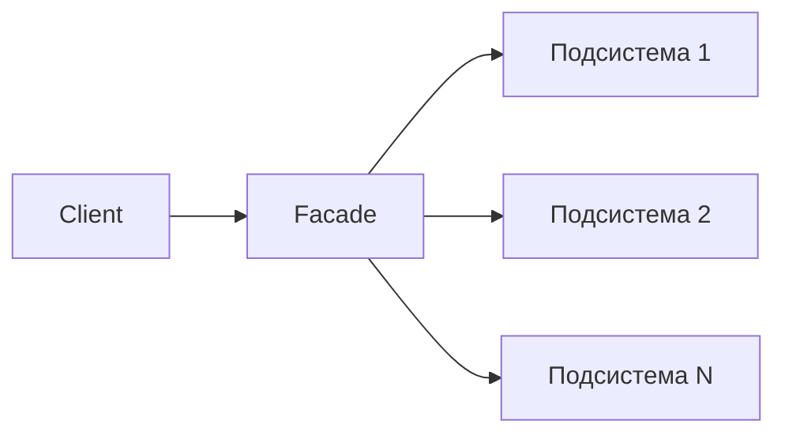

# Фасад (Facade)

Проще говоря, **Facade** инкапсулирует сложную подсистему за простым интерфейсом. Он скрывает большую часть сложности и упрощает использование подсистемы.

## Полезные ссылки

### Официальная документация
- [Design Patterns: GoF (Elements of Reusable Object-Oriented Software)](https://refactoring.guru/design-patterns/book)

### Ресурсы
- [Facade Pattern in Java](https://www.baeldung.com/java-facade-pattern)
- [Facade Pattern in Kotlin](https://www.baeldung.com/kotlin-facade-pattern)

### См. также
- [Composite Pattern](composite.md)
- [Flyweight Pattern](flyweight.md)

- [Декоратор (Decorator)](decorator.md)
- [Адаптер (Adapter)](adapter.md)
- [Заместитель (Proxy)](proxy.md)
## Содержание

- [Суть и запомнить](#суть-и-запомнить)
- [Описание](#описание)
- [Структура паттерна](#структура-паттерна)
- [Пример: двигатель автомобиля](#пример-двигатель-автомобиля)
- [Реализация на Java](#реализация-на-java)
- [Реализация на Kotlin](#реализация-на-kotlin)
- [Лучшие практики](#лучшие-практики)

## Суть и запомнить

**Суть в одном предложении:** Один простой интерфейс к сложной подсистеме — клиент вызывает фасад, а не десятки классов.

**Запомнить:**
- Клиент знает только фасад; подсистема скрыта.
- Фасад задаёт порядок вызовов и скрывает детали.
- Снижает связанность: изменения подсистемы не трогают клиента.
- Прямой доступ к подсистеме при необходимости возможен.

**Когда применять:** сложная подсистема, много шагов для одного сценария, хочется простой API (запуск/остановка, отправка/статус).

## Описание

- Фасад даёт один простой интерфейс к группе классов подсистемы; клиент вызывает фасад вместо множества компонентов.
- Прямой доступ к подсистеме по-прежнему возможен, когда нужен тонкий контроль.
- Клиент и подсистема слабо связаны: изменения внутри подсистемы не требуют менять клиентский код.
## Структура паттерна

Клиент обращается только к фасаду; фасад координирует вызовы подсистемы.



## Пример: двигатель автомобиля

Давайте посмотрим на фасад в действии.

**Допустим, мы хотим завести машину. Следующая диаграмма представляет устаревшую систему, которая позволяет нам это сделать:**

**Как видите, это может быть довольно сложно и требует некоторых усилий для правильного запуска двигателя:**

```java
// Последовательность вызовов подсистемы без фасада — сложно для клиента
airFlowController.takeAir();
fuelInjector.on();
fuelInjector.inject();
starter.start();
coolingController.setTemperatureUpperLimit(DEFAULT_COOLING_TEMP);
coolingController.run();
catalyticConverter.on();
```

Остановка двигателя — тоже несколько шагов:

```java
fuelInjector.off();
catalyticConverter.off();
coolingController.cool(MAX_ALLOWED_TEMP);
coolingController.stop();
airFlowController.off();
```

Фасад — это то, что нам здесь нужно. Всю сложность прячем в двух методах: `startEngine()` и `stopEngine()`.

## Реализация на Java

```java
// Фасад: единая точка доступа к подсистеме двигателя.
public class CarEngineFacade {
    private static int DEFAULT_COOLING_TEMP = 90;
    private static int MAX_ALLOWED_TEMP = 50;

    // Компоненты подсистемы двигателя
    private FuelInjector fuelInjector = new FuelInjector();
    private AirFlowController airFlowController = new AirFlowController();
    private Starter starter = new Starter();
    private CoolingController coolingController = new CoolingController();
    private CatalyticConverter catalyticConverter = new CatalyticConverter();

    // Запуск двигателя в правильном порядке вызовов подсистемы.
    public void startEngine() {
        fuelInjector.on();
        airFlowController.takeAir();
        fuelInjector.inject();
        starter.start();
        coolingController.setTemperatureUpperLimit(DEFAULT_COOLING_TEMP);
        coolingController.run();
        catalyticConverter.on();
    }

    // Остановка двигателя: отключение компонентов в обратном порядке.
    public void stopEngine() {
        fuelInjector.off();
        catalyticConverter.off();
        coolingController.cool(MAX_ALLOWED_TEMP);
        coolingController.stop();
        airFlowController.off();
    }
}
```

Чтобы завести и остановить двигатель, клиенту достаточно двух вызовов:

```java
// Клиент использует только фасад, не зная о деталях подсистемы.
CarEngineFacade facade = new CarEngineFacade();
facade.startEngine();
facade.stopEngine();
```

## Реализация на Kotlin

```kotlin
// Фасад: единая точка доступа к подсистеме двигателя.
class CarEngineFacade {
    private val DEFAULT_COOLING_TEMP = 90
    private val MAX_ALLOWED_TEMP = 50

    // Компоненты подсистемы двигателя
    private val fuelInjector = FuelInjector()
    private val airFlowController = AirFlowController()
    private val starter = Starter()
    private val coolingController = CoolingController()
    private val catalyticConverter = CatalyticConverter()

    // Запуск двигателя в правильном порядке вызовов подсистемы.
    fun startEngine() {
        fuelInjector.on()
        airFlowController.takeAir()
        fuelInjector.inject()
        starter.start()
        coolingController.setTemperatureUpperLimit(DEFAULT_COOLING_TEMP)
        coolingController.run()
        catalyticConverter.on()
    }

    // Остановка двигателя: отключение компонентов в обратном порядке.
    fun stopEngine() {
        fuelInjector.off()
        catalyticConverter.off()
        coolingController.cool(MAX_ALLOWED_TEMP)
        coolingController.stop()
        airFlowController.off()
    }
}
```

Пример использования:

```kotlin
fun main() {
    val facade = CarEngineFacade()
    facade.startEngine()
    facade.stopEngine()
}
```

**Когда не использовать:** не вводите фасад, если подсистема простая и используется в одном-двух местах — лишний слой усложнит код. Не используйте фасад как «божественный объект» для всей системы.

## Лучшие практики

- **Один фасад — одна подсистема:** фасад инкапсулирует одну логическую подсистему (двигатель, платёж, отчёт); не смешивайте несколько несвязанных подсистем в одном фасаде.
- **Простой интерфейс:** предоставляйте клиенту минимум методов (start/stop, submit/status); скрывайте порядок вызовов и детали подсистемы.
- **Прямой доступ при необходимости:** не запрещайте доступ к классам подсистемы для продвинутых сценариев; фасад — упрощение, а не жёсткая изоляция.
- **Тестируемость:** тестируйте фасад с моками подсистемы; тестируйте подсистему отдельно для юнит-тестов.
- **Не раздувайте фасад:** если методов фасада становится много — рассмотрите разбиение на несколько фасадов или слой сервисов.
