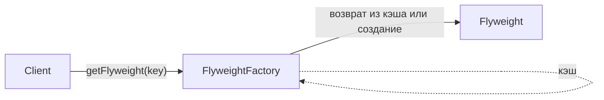

# Приспособленец (Flyweight)

В этой статье мы рассмотрим шаблон проектирования легковеса. Этот шаблон используется для уменьшения объема памяти. Это также может повысить производительность в приложениях, где создание объектов требует больших затрат.

## Полезные ссылки

### Официальная документация
- [Design Patterns: GoF (Elements of Reusable Object-Oriented Software)](https://refactoring.guru/design-patterns/book)

### Ресурсы
- [Flyweight Pattern in Java](https://www.baeldung.com/java-flyweight)
- [Flyweight Pattern in Kotlin](https://www.baeldung.com/kotlin-flyweight-pattern)

### См. также
- [Facade Pattern](facade.md)
- [Composite Pattern](composite.md)

- [Декоратор (Decorator)](decorator.md)
- [Адаптер (Adapter)](adapter.md)
- [Заместитель (Proxy)](proxy.md)
## Содержание

- [Суть и запомнить](#суть-и-запомнить)
- [Описание](#описание)
- [Компоненты](#компоненты)
- [Структура паттерна](#структура-паттерна)
- [Реализация на Java](#реализация-на-java)
- [Реализация на Kotlin](#реализация-на-kotlin)
- [Примеры использования](#примеры-использования)
- [Лучшие практики](#лучшие-практики)

## Суть и запомнить

**Суть в одном предложении:** Разделение общего (внутреннего) и уникального (внешнего) состояния и переиспользование объектов через фабрику-кэш.

**Запомнить:**
- Один объект на «вид» (символ, иконка, цвет) — остальное передаётся параметром.
- Фабрика отдаёт объект из кэша или создаёт и кэширует.
- Легковесы неизменяемы; создание и кэш — в фабрике.

**Когда применять:** много однотипных объектов, нехватка памяти или дорогое создание.

## Описание

В этой статье мы рассмотрим шаблон проектирования легковеса. Этот шаблон используется для уменьшения объема памяти. Это также может повысить производительность в приложениях, где создание объектов требует больших затрат.

Проще говоря, шаблон легковеса основан на фабрике, которая перерабатывает созданные объекты, сохраняя их после создания. Каждый раз, когда запрашивается объект, фабрика ищет объект, чтобы проверить, не был ли он уже создан. Если да, то возвращается существующий объект, в противном случае создается, сохраняется и затем возвращается новый.

Состояние легковесного объекта состоит из инвариантного компонента, который используется совместно с другими подобными объектами(внутреннее, общее) и вариантного (внешнее, передаётся при вызове).

Очень важно, чтобы легковесные объекты были неизменяемыми: любая операция над состоянием должна выполняться фабрикой.
## Компоненты

Основные элементы паттерна:

1. Интерфейс, определяющий операции, которые клиентский код может выполнять над легковесным объектом
2. Одна или несколько конкретных реализаций нашего интерфейса
3. Фабрика для обработки экземпляров и кэширования объектов

## Структура паттерна

Клиент запрашивает объект у фабрики; фабрика возвращает переиспользуемый легковес из кэша или создаёт новый.



## Реализация на Java

Давайте посмотрим, как реализовать каждый компонент.

Интерфейс `Vehicle` — тип, возвращаемый фабрикой; в нём объявлены все операции над легковесом:

```java
// Интерфейс легковеса — разделение внутреннего (shared) и внешнего (extrinsic) состояния
public interface Vehicle {
    void start();
    void stop();
    Color getColor();
}
```

```java
// Конкретный легковес: внутреннее состояние (engine, color) разделяется между экземплярами.
public class Car implements Vehicle {
    private Engine engine;
    private Color color;

    public Car(Engine engine, Color color) {
        this.engine = engine;
        this.color = color;
    }

    @Override
    public void start() {
        // Запуск двигателя (реализация)
    }

    @Override
    public void stop() {
        // Остановка (реализация)
    }

    @Override
    public Color getColor() {
        return color;
    }
}
```

И последнее, но не менее важное: мы создадим `VehicleFactory`. Создание нового автомобиля — очень дорогая операция, поэтому фабрика будет создавать только один автомобиль каждого цвета.

```java
// Фабрика-кэш: возвращает существующий легковес по ключу (цвет) или создаёт новый.
public class VehicleFactory {
    private static Map<Color, Vehicle> vehiclesCache = new HashMap<>();

    // Возвращает легковес для цвета; при первом запросе создаёт и кэширует.
    public static Vehicle createVehicle(Color color) {
        Vehicle newVehicle = vehiclesCache.computeIfAbsent(color, newColor -> {
            Engine newEngine = new Engine();
            return new Car(newEngine, newColor);
        });
        return newVehicle;
    }
}
```

Обратите внимание, что клиентский код может влиять только на внешнее состояние (например, цвет), передавая его в качестве аргумента методу `createVehicle`.

## Реализация на Kotlin

Вариант на Kotlin:

```kotlin
// Интерфейс легковеса.
interface Vehicle {
    fun start()
    fun stop()
    fun getColor(): Color
}

// Конкретный легковес с разделяемым внутренним состоянием.
class Car(private val engine: Engine, private val color: Color) : Vehicle {
    override fun start() {
        // Запуск (реализация)
    }

    override fun stop() {
        // Остановка (реализация)
    }

    override fun getColor(): Color = color
}

// Фабрика с кэшем по ключу (цвет).
object VehicleFactory {
    private val vehiclesCache = mutableMapOf<Color, Vehicle>()

    // Возвращает легковес из кэша или создаёт новый.
    fun createVehicle(color: Color): Vehicle {
        return vehiclesCache.getOrPut(color) {
            val newEngine = Engine()
            Car(newEngine, color)
        }
    }
}
```

Пример использования:

```kotlin
fun main() {
    val redCar = VehicleFactory.createVehicle(Color.RED)
    val anotherRedCar = VehicleFactory.createVehicle(Color.RED)
    // redCar и anotherRedCar - это один и тот же объект
    println(redCar === anotherRedCar) // true
}
```

## Примеры использования

Целью шаблона легковеса является сокращение использования памяти за счет совместного использования как можно большего количества данных, поэтому он является хорошей основой для алгоритмов сжатия без потерь. В этом случае каждый легковесный объект действует как указатель, а его внешнее состояние является контекстно-зависимой информацией.

Классический пример такого использования — текстовый процессор. Здесь каждый персонаж является легковесным объектом, который совместно использует данные, необходимые для рендеринга. В результате дополнительную память занимает только позиция символа внутри документа.

Многие современные приложения используют кеши для улучшения времени отклика. Шаблон легковеса похож на основную концепцию кэша и может хорошо подходить для этой цели.

Конечно, есть несколько ключевых различий в сложности и реализации между этим шаблоном и обычным кешем общего назначения.

**Когда не использовать:** при малом числе объектов накладные расходы фабрики и пула не окупятся. Не применяйте легковес, если объекты сильно различаются или внешнее состояние велико — выигрыша по памяти не будет.

## Лучшие практики

- **Разделение состояния:** внутреннее состояние — общее и неизменяемое; внешнее передаётся при вызове; не храните в легковесе то, что уникально для контекста.
- **Неизменяемость:** легковесные объекты должны быть неизменяемыми; создание и кэш — в фабрике; клиент не меняет общее состояние.
- **Фабрика и кэш:** фабрика управляет пулом по ключу (внутреннее состояние); учитывайте потокобезопасность и размер пула.
- **Когда применять:** много однотипных объектов с повторяющимся состоянием (символы, иконки, темы); при нехватке памяти или дорогом создании объектов.
- **Не злоупотребляйте:** для простых объектов накладные расходы фабрики могут не окупиться; измеряйте память и производительность.
