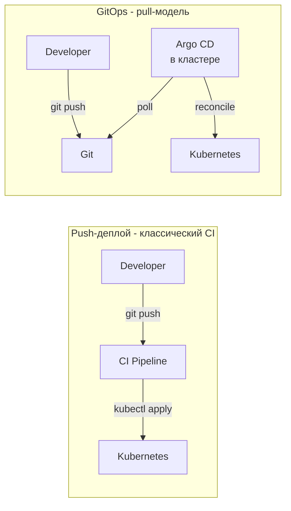
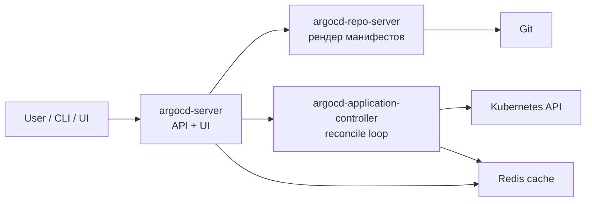
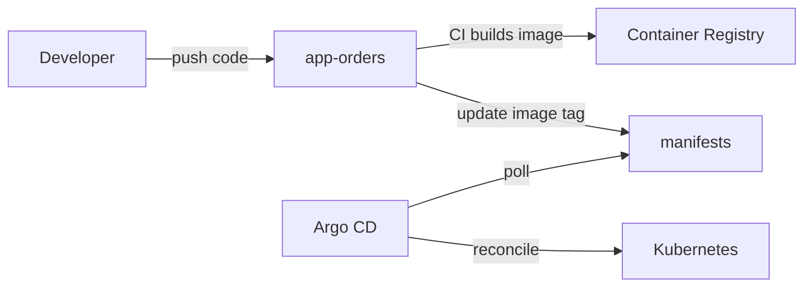

# ArgoCD: GitOps для Kubernetes

ArgoCD — GitOps-контроллер: следит за Git-репозиторием с манифестами и
непрерывно приводит состояние Kubernetes-кластера к описанному в репозитории.
Если кто-то правит ресурс через `kubectl`, ArgoCD откатит изменения. Git —
единственный источник правды.

Документ покрывает: что такое GitOps и чем он отличается от push-деплоя,
как устроен ArgoCD внутри, как описывается Application и ApplicationSet,
как работают sync waves и hooks, как раскатывать на несколько кластеров,
как настроить RBAC, типовые проблемы.

## Полезные ссылки

### Официальная документация

- [Argo CD Documentation](https://argo-cd.readthedocs.io/) — официальная документация
- [Argo CD Operator Manual](https://argo-cd.readthedocs.io/en/stable/operator-manual/) — гайд по эксплуатации
- [ApplicationSet Controller](https://argocd-applicationset.readthedocs.io/) — генерация Application
- [GitOps Working Group](https://opengitops.dev/) — формальное определение GitOps

### Обучающие материалы

- [Codefresh: Argo CD Best Practices](https://codefresh.io/learn/argo-cd/argo-cd-best-practices/) — практика
- [GitOps Patterns and Pitfalls](https://www.youtube.com/watch?v=oGZ7Q5C3lcw) — Kelsey Hightower

### См. также

- [Helm](../containers/kubernetes/helm.md) — типичный источник манифестов для Argo
- [Kubernetes: основы](../containers/kubernetes/kubernetes-basics.md) — Pod, Deployment, Namespace
- [Kubernetes Security](../containers/kubernetes/kubernetes-security.md) — RBAC, секреты
- [GitHub Actions](github-actions.md) — сборка образов, push в registry, обновление манифестов
- [GitLab CI](gitlab-ci.md) — альтернатива для GitOps-конвейера
- [IaC: обзор](../iac/iac-overview.md) — Terraform для провижининга кластеров
- [Containerization Overview](../containers/containerization-overview.md) — контекст про контейнеры

## Содержание

- [Что такое GitOps](#что-такое-gitops)
- [GitOps vs push-деплой](#gitops-vs-push-деплой)
- [Архитектура ArgoCD](#архитектура-argocd)
- [Application: основной объект](#application-основной-объект)
- [Источники манифестов](#источники-манифестов)
- [Sync policies](#sync-policies)
- [Sync waves и phases](#sync-waves-и-phases)
- [Resource hooks](#resource-hooks)
- [App-of-apps и ApplicationSet](#app-of-apps-и-applicationset)
- [Multi-cluster](#multi-cluster)
- [Структура репозиториев](#структура-репозиториев)
- [Секреты в GitOps](#секреты-в-gitops)
- [RBAC в ArgoCD](#rbac-в-argocd)
- [Стратегии релизов](#стратегии-релизов)
- [Интеграция с CI](#интеграция-с-ci)
- [Решение проблем](#решение-проблем)
- [Лучшие практики](#лучшие-практики)

## Что такое GitOps

Принципы GitOps по определению OpenGitOps:

| Принцип | Что значит |
|---------|------------|
| Declarative | Желаемое состояние описано декларативно (YAML, не скрипты) |
| Versioned and immutable | Состояние хранится в Git: ревизии, history, code review |
| Pulled automatically | Контроллер сам читает Git и применяет |
| Continuously reconciled | Контроллер постоянно сверяет actual vs desired и устраняет дрейф |

Преимущества:

- Audit-trail из коробки: вся история деплоев — в Git log.
- Откат — `git revert`, не «нажми кнопку в Jenkins».
- Disaster recovery: упал кластер — раскатываешь Argo, он сам тянет всё из Git.
- Нет расходящегося `kubectl apply` от разных людей: конфигурация в одном месте.
- Безопасность: CI-системе не нужны kubeconfig и кластерные права. Только
  push в Git. Доступ к кластеру у контроллера, который живёт внутри.

## GitOps vs push-деплой



| Свойство | Push (классика) | Pull (GitOps) |
|----------|-----------------|---------------|
| Кто инициирует деплой | CI после успешной сборки | Контроллер в кластере |
| Доступ к кластеру | У CI (kubeconfig в секретах CI) | У контроллера, изнутри |
| Источник состояния | CI-pipeline + image | Git-репозиторий |
| Дрейф (manual `kubectl apply`) | Не отслеживается | Откатывается автоматически |
| Аудит | Логи CI | Git history |
| Disaster recovery | Перезапуск pipeline | Argo пересоздаст всё из Git |

**Когда выбрать GitOps:** несколько кластеров, regulatable отрасль с требованиями
аудита, команда хочет очевидной обратимости через `git revert`,
не хотят хранить kubeconfig в CI.

**Когда push достаточен:** один кластер, маленькая команда, простой деплой.
Гибрид тоже работает: CI собирает образ и обновляет манифест, Argo синкает.

## Архитектура ArgoCD



| Компонент | Что делает |
|-----------|-----------|
| `argocd-server` | API, UI, gRPC. Через него работают пользователи и `argocd` CLI |
| `argocd-application-controller` | Читает Application, рендерит манифесты, сравнивает с кластером, применяет |
| `argocd-repo-server` | Клонирует Git, рендерит Helm/Kustomize, кеширует |
| `argocd-redis` | Кеш для repo-server и controller |
| `argocd-dex-server` | OIDC SSO (опционально) |
| `argocd-notifications-controller` | Уведомления в Slack/email/webhooks |
| `argocd-applicationset-controller` | Генерирует Application'ы из шаблонов |

Установка:

```bash
kubectl create namespace argocd
kubectl apply -n argocd -f https://raw.githubusercontent.com/argoproj/argo-cd/stable/manifests/install.yaml
# или Helm:
helm install argocd argo/argo-cd -n argocd --create-namespace
```

```bash
argocd login argocd.example.com
argocd app list
argocd app sync orders
argocd app set orders --revision v1.2.3
```

## Application: основной объект

```yaml
apiVersion: argoproj.io/v1alpha1
kind: Application
metadata:
  name: orders
  namespace: argocd
  finalizers:
    - resources-finalizer.argocd.argoproj.io
spec:
  project: default
  source:
    repoURL: https://github.com/myorg/manifests
    targetRevision: main
    path: apps/orders/overlays/prod
  destination:
    server: https://kubernetes.default.svc
    namespace: orders
  syncPolicy:
    automated:
      prune: true
      selfHeal: true
      allowEmpty: false
    syncOptions:
      - CreateNamespace=true
      - ApplyOutOfSyncOnly=true
      - ServerSideApply=true
    retry:
      limit: 5
      backoff:
        duration: 5s
        factor: 2
        maxDuration: 3m
  revisionHistoryLimit: 10
```

| Поле | Назначение |
|------|-----------|
| `source.repoURL` | URL Git, OCI или Helm-репо |
| `source.targetRevision` | Ветка, тэг, коммит |
| `source.path` | Путь в репозитории |
| `destination.server` | URL целевого K8s API (или `name`) |
| `destination.namespace` | Namespace для манифестов |
| `syncPolicy.automated.prune` | Удалять ресурсы, удалённые из Git |
| `syncPolicy.automated.selfHeal` | Откатывать ручные изменения в кластере |
| `revisionHistoryLimit` | Сколько ревизий хранить для rollback |

Несколько источников (sources) — одно приложение тянет манифесты из нескольких мест:

```yaml
spec:
  sources:
    - repoURL: https://charts.bitnami.com/bitnami
      chart: postgresql
      targetRevision: 15.5.0
      helm:
        valueFiles:
          - $values/apps/orders/postgresql-values.yaml
    - repoURL: https://github.com/myorg/manifests
      targetRevision: main
      ref: values
```

## Источники манифестов

ArgoCD умеет рендерить:

| Тип | Чем рендерится | Когда |
|-----|----------------|-------|
| Plain YAML | Прямой apply | Простые случаи |
| Helm | Встроенный helm | Готовые публичные пакеты, своя шаблонизация |
| Kustomize | Встроенный kustomize | Свои манифесты с overlays |
| Jsonnet | Встроенный | Когда нужна логика, а Helm/Kustomize не подходят |
| Plugin | Custom config management plugin | Cdk8s, Tanka, что угодно своё |

Helm-приложение:

```yaml
spec:
  source:
    repoURL: https://charts.bitnami.com/bitnami
    chart: postgresql
    targetRevision: 15.5.0
    helm:
      releaseName: orders-db
      values: |
        auth:
          database: orders
        primary:
          persistence:
            size: 50Gi
      valueFiles:
        - values-prod.yaml
      parameters:
        - name: image.tag
          value: "16.1.0"
```

Kustomize-приложение:

```yaml
spec:
  source:
    repoURL: https://github.com/myorg/manifests
    targetRevision: main
    path: apps/orders/overlays/prod
    kustomize:
      images:
        - registry.example.com/orders=registry.example.com/orders@sha256:abc...
      namePrefix: prod-
```

## Sync policies

Авто-синхронизация в `syncPolicy.automated`:

| Поле | Что делает |
|------|-----------|
| `prune: true` | Удалять ресурсы, исчезнувшие из Git |
| `selfHeal: true` | Откатывать ручные изменения в кластере |
| `allowEmpty: false` | Запретить sync с пустым списком ресурсов (защита от случайного удаления) |
| `prunePropagationPolicy` | foreground / background / orphan — как удалять |
| `pruneLast: true` | Удалять в последнюю очередь, после обновления |

**Self-heal** — главный аргумент в пользу GitOps. Кто-то правит Deployment
через `kubectl edit`? Argo откатит обратно. Если такая правка нужна —
делай через Git.

`syncOptions` для тонких настроек:

| Опция | Что значит |
|-------|-----------|
| `CreateNamespace=true` | Создавать namespace, если нет |
| `ServerSideApply=true` | Использовать SSA вместо kubectl apply |
| `Validate=false` | Пропустить validation (для ресурсов с CRD, которых ещё нет) |
| `Replace=true` | `kubectl replace` вместо apply (потеря annotations) |
| `ApplyOutOfSyncOnly=true` | Только то, что разошлось |
| `PrunePropagationPolicy=foreground` | Каскадное удаление |
| `RespectIgnoreDifferences=true` | Уважать `ignoreDifferences` при синке |

`ignoreDifferences` — игнорировать определённые поля (полезно для HPA,
которые меняют `replicas`):

```yaml
spec:
  ignoreDifferences:
    - group: apps
      kind: Deployment
      jsonPointers:
        - /spec/replicas
```

## Sync waves и phases

ArgoCD применяет ресурсы порядком:

1. **Phase**: `PreSync` → `Sync` → `PostSync` → `SyncFail` (только при ошибке).
2. **Wave** внутри фазы: число от `-N` до `N`, меньше — раньше.
3. **Resource type order**: Namespace → CRD → ConfigMap/Secret → ... → Deployment → ...

```yaml
metadata:
  annotations:
    argocd.argoproj.io/sync-wave: "-1"
```

Типовой случай: миграция БД до Deployment приложения.

```yaml
# 1) database-migration job — wave -1
apiVersion: batch/v1
kind: Job
metadata:
  name: db-migrate
  annotations:
    argocd.argoproj.io/sync-wave: "-1"
    argocd.argoproj.io/hook: PreSync
    argocd.argoproj.io/hook-delete-policy: BeforeHookCreation
spec:
  template:
    spec:
      restartPolicy: Never
      containers:
        - name: migrate
          image: orders:1.2.3
          command: ["./migrate.sh"]
---
# 2) deployment — wave 0 (по умолчанию)
apiVersion: apps/v1
kind: Deployment
metadata:
  name: orders
spec:
  ...
```

## Resource hooks

Hooks — ресурсы, выполняемые по событию sync. Помечаются аннотацией.

| Hook | Когда |
|------|-------|
| `PreSync` | Перед применением Sync |
| `Sync` | Вместе с основным apply (можно использовать для последовательной логики) |
| `PostSync` | После успешного Sync, когда все ресурсы Healthy |
| `SyncFail` | Если sync упал |
| `PostDelete` | После удаления Application |

`hook-delete-policy`:

| Политика | Что делает |
|----------|-----------|
| `HookSucceeded` | Удалить hook после успешного выполнения |
| `HookFailed` | Удалить после падения |
| `BeforeHookCreation` | Удалить старый hook перед созданием нового (по умолчанию) |

Если запускаешь Job как hook, не забывай `restartPolicy: Never` и
`backoffLimit` — иначе зависший Job будет блокировать sync.

## App-of-apps и ApplicationSet

Один кластер = десятки сервисов = десятки Application. Управлять руками
неудобно. Два паттерна.

**App-of-apps:** одно «корневое» Application содержит дочерние Application'ы
как обычные манифесты.

```text
apps/
├── root/
│   └── application.yaml         # Application, ссылающийся на ./
└── children/
    ├── orders.yaml              # kind: Application
    ├── inventory.yaml           # kind: Application
    └── ...
```

```yaml
# root/application.yaml
apiVersion: argoproj.io/v1alpha1
kind: Application
metadata:
  name: root
spec:
  source:
    repoURL: https://github.com/myorg/manifests
    targetRevision: main
    path: apps/children
  destination:
    server: https://kubernetes.default.svc
    namespace: argocd
  syncPolicy:
    automated: { prune: true, selfHeal: true }
```

**ApplicationSet:** контроллер, генерирующий Application'ы из шаблона по
generators (List, Cluster, Git, Matrix, SCM Provider).

```yaml
apiVersion: argoproj.io/v1alpha1
kind: ApplicationSet
metadata:
  name: services
spec:
  generators:
    - git:
        repoURL: https://github.com/myorg/manifests
        revision: main
        directories:
          - path: apps/*
  template:
    metadata:
      name: '{{path.basename}}'
    spec:
      project: default
      source:
        repoURL: https://github.com/myorg/manifests
        targetRevision: main
        path: '{{path}}'
      destination:
        server: https://kubernetes.default.svc
        namespace: '{{path.basename}}'
      syncPolicy:
        automated: { prune: true, selfHeal: true }
        syncOptions: ["CreateNamespace=true"]
```

Появилась новая папка `apps/payments/` — ApplicationSet автоматически создал
Application для неё. Удалили — удалит.

ApplicationSet — предпочтительный путь в больших окружениях.

## Multi-cluster

ArgoCD управляет несколькими кластерами из одного:

```bash
argocd cluster add prod-eu-west
argocd cluster list
```

ApplicationSet с Cluster generator — раскатить тот же манифест на все кластеры:

```yaml
spec:
  generators:
    - clusters: {}      # все зарегистрированные кластеры
  template:
    metadata:
      name: 'monitoring-{{name}}'
    spec:
      destination:
        server: '{{server}}'
        namespace: monitoring
      source:
        repoURL: https://github.com/myorg/manifests
        path: monitoring/base
```

Matrix generator — комбинации (cluster × env, env × service):

```yaml
spec:
  generators:
    - matrix:
        generators:
          - clusters: {}
          - list:
              elements:
                - service: orders
                - service: inventory
```

## Структура репозиториев

Два устоявшихся подхода.

**Single repo (config repo + app repo):**

```text
manifests/                 # Git-репо, который наблюдает Argo
├── apps/
│   ├── orders/
│   │   ├── base/          # общие манифесты
│   │   └── overlays/
│   │       ├── dev/       # kustomize overlay
│   │       ├── stage/
│   │       └── prod/
│   └── inventory/
├── infra/                 # cluster-level: ingress, monitoring, cert-manager
└── argocd/                # Application/ApplicationSet
```

Код приложения — в отдельных репозиториях. CI собирает образ, обновляет
тэг в `manifests/apps/orders/overlays/prod/kustomization.yaml`.

**Mono-repo:** код, манифесты, CI — в одном репозитории. Удобно для маленьких
команд, не масштабируется на сотни сервисов.



## Секреты в GitOps

Секреты в Git plain — недопустимо. Стандартные подходы:

| Подход | Как работает | Особенности |
|--------|--------------|-------------|
| Sealed Secrets (Bitnami) | Шифровать секрет публичным ключом контроллера | Просто, но key-rotation сложен |
| External Secrets Operator | Хранить секреты в Vault/AWS SM, ESO синхронизирует в K8s Secret | Гибко, требует внешнее хранилище |
| SOPS (с helm-secrets или Argo plugin) | Шифровать YAML через age/PGP/KMS | Файл шифрован, расшифровка на момент рендера |
| Vault Agent Injector | Sidecar инжектит секреты в Pod | Не GitOps-нативный, привязан к Vault |

External Secrets Operator — текущий мейнстрим:

```yaml
apiVersion: external-secrets.io/v1beta1
kind: ExternalSecret
metadata:
  name: orders-db
spec:
  refreshInterval: 1h
  secretStoreRef:
    name: vault-backend
    kind: ClusterSecretStore
  target:
    name: orders-db-credentials
  data:
    - secretKey: password
      remoteRef:
        key: secret/data/orders/db
        property: password
```

В Git коммитится `ExternalSecret`, секреты — в Vault.

## RBAC в ArgoCD

ArgoCD имеет собственный RBAC поверх kubernetes RBAC.

`argocd-rbac-cm` (ConfigMap):

```yaml
data:
  policy.default: role:readonly
  policy.csv: |
    p, role:dev, applications, get, dev/*, allow
    p, role:dev, applications, sync, dev/*, allow
    p, role:dev, applications, action/*, dev/*, allow
    p, role:dev, applications, *, prod/*, deny

    p, role:sre, applications, *, */*, allow
    p, role:sre, clusters, *, *, allow
    p, role:sre, repositories, *, *, allow

    g, alice@example.com, role:dev
    g, bob@example.com, role:sre
    g, my-team, role:dev
```

Format CSV: `p, subject, resource, action, object, effect`.

| Resource | Actions |
|----------|---------|
| `applications` | `get`, `create`, `update`, `delete`, `sync`, `override` |
| `clusters` | `get`, `create`, `update`, `delete` |
| `repositories` | `get`, `create`, `update`, `delete` |
| `projects` | `get`, `create`, `update`, `delete` |

AppProjects ограничивают, какие репозитории, кластеры и неймспейсы доступны:

```yaml
apiVersion: argoproj.io/v1alpha1
kind: AppProject
metadata:
  name: dev
spec:
  sourceRepos:
    - https://github.com/myorg/manifests
  destinations:
    - namespace: 'dev-*'
      server: https://kubernetes.default.svc
  clusterResourceWhitelist:
    - group: ''
      kind: Namespace
  namespaceResourceBlacklist:
    - group: ''
      kind: ResourceQuota
```

## Стратегии релизов

ArgoCD сам по себе делает rolling update Deployment. Для blue-green и canary
нужен Argo Rollouts.

```yaml
apiVersion: argoproj.io/v1alpha1
kind: Rollout
metadata:
  name: orders
spec:
  replicas: 5
  strategy:
    canary:
      steps:
        - setWeight: 20
        - pause: { duration: 5m }
        - setWeight: 50
        - pause: { duration: 10m }
        - setWeight: 100
      analysis:
        templates:
          - templateName: success-rate
        startingStep: 1
        args:
          - name: service-name
            value: orders
```

Argo Rollouts тестирует canary метриками: при падении success rate
автоматически откатывается.

## Интеграция с CI

GitOps не отменяет CI. Pipeline собирает образ, тестирует и обновляет манифест.

```yaml
# .github/workflows/build.yml (фрагмент)
- name: Build and push image
  run: |
    docker build -t registry.example.com/orders:${{ github.sha }} .
    docker push registry.example.com/orders:${{ github.sha }}

- name: Update manifests
  run: |
    cd manifests
    yq -i ".images[0].newTag = \"${{ github.sha }}\"" \
      apps/orders/overlays/prod/kustomization.yaml
    git config user.email "ci@example.com"
    git config user.name "CI"
    git commit -am "orders: ${{ github.sha }}"
    git push
```

ArgoCD заметит коммит и развернёт. Pipeline ждёт по `argocd app wait orders`,
если нужен синхронный деплой.

## Решение проблем

| Симптом | Причина | Решение |
|---------|---------|---------|
| `OutOfSync` без видимых изменений | mutating admission webhook добавляет аннотации | Добавь `ignoreDifferences` или используй ServerSideApply |
| `Sync failed`: `permission denied` | У controller нет прав в целевом namespace | Расширь ClusterRoleBinding или Project destinations |
| `Sync` зависает на `Progressing` | Не выполняется readinessProbe или PVC не bound | `argocd app diff`, `kubectl describe pod` |
| ApplicationSet не создаёт Application | Generator не возвращает результаты | Проверь права на Git, namespace, шаблон |
| `Comparison error: app source is not allowed` | Repo не whitelisted в Project | Добавь `sourceRepos` в AppProject |
| После rollback ресурсы остались | `prune: false` или ресурс «сирота» | Включи prune, проверь labels `app.kubernetes.io/instance` |
| Argo «теряет» ручные изменения | `selfHeal: true` (так и должно быть) | Если правка нужна — через Git, не через `kubectl edit` |
| Helm chart с CRD валится при первом sync | CRD ещё нет, валидация падает | `Validate=false` в `syncOptions` или вынести CRD в отдельный wave |
| Большой Helm chart рендерится долго | repo-server медленный | Поднять реплики `argocd-repo-server`, кешировать chart локально |
| `Job` hook не удаляется | Не задана `hook-delete-policy` | `argocd.argoproj.io/hook-delete-policy: HookSucceeded` |

Полезные команды:

```bash
argocd app diff orders                  # что изменится при sync
argocd app history orders               # ревизии
argocd app rollback orders 5            # откатить
argocd app sync orders --prune          # принудительный sync с prune
argocd app sync orders --resource Deployment:orders   # один ресурс
argocd app wait orders --health         # дождаться Healthy
argocd app manifests orders             # отрендеренные манифесты
argocd app set orders --revision v1.2.3 # переключить targetRevision
```

## Лучшие практики

- Манифесты — отдельный репозиторий от кода. CI код-репо обновляет манифест-репо.
- Включай `prune: true, selfHeal: true` — иначе теряются преимущества GitOps.
- `revisionHistoryLimit: 10` или больше — для быстрого rollback.
- Не правь Application через `kubectl edit` или ArgoCD UI без коммита в Git.
  Это ломает GitOps-инвариант.
- Используй ApplicationSet, не сотни Application вручную.
- Sync waves — для миграций БД и других PreSync-зависимостей.
- AppProject — для каждой команды/окружения. Ограничь доступ.
- Секреты — через ESO/Sealed Secrets/SOPS, не в plain Git.
- Подписывай коммиты в манифест-репо, требуй signed commits в branch protection.
- Notifications: уведомление в Slack при Sync failed, OutOfSync дольше N минут.
- Git-репо защищён branch protection: PR + reviews + CI checks обязательны.
- Pinned image digests, не теги: `image: orders@sha256:abc...`. Иначе sync
  пройдёт без видимых изменений в манифесте, но образ поменялся.
- В проде — Argo Rollouts для canary/blue-green с автоматическим откатом по метрикам.
- `argocd-cm` и `argocd-rbac-cm` тоже в Git, GitOps для самого Argo.

**Итог:** GitOps превращает Git в единственный источник истины. ArgoCD —
контроллер pull-модели: следит за репо и приводит кластер к описанному
состоянию. Ключевые сущности — Application и ApplicationSet, ключевые
механизмы — sync waves, hooks, ignoreDifferences. Секреты — через ESO/Sealed,
а не в Git plain. CI собирает образ и обновляет манифест, остальное делает Argo.
