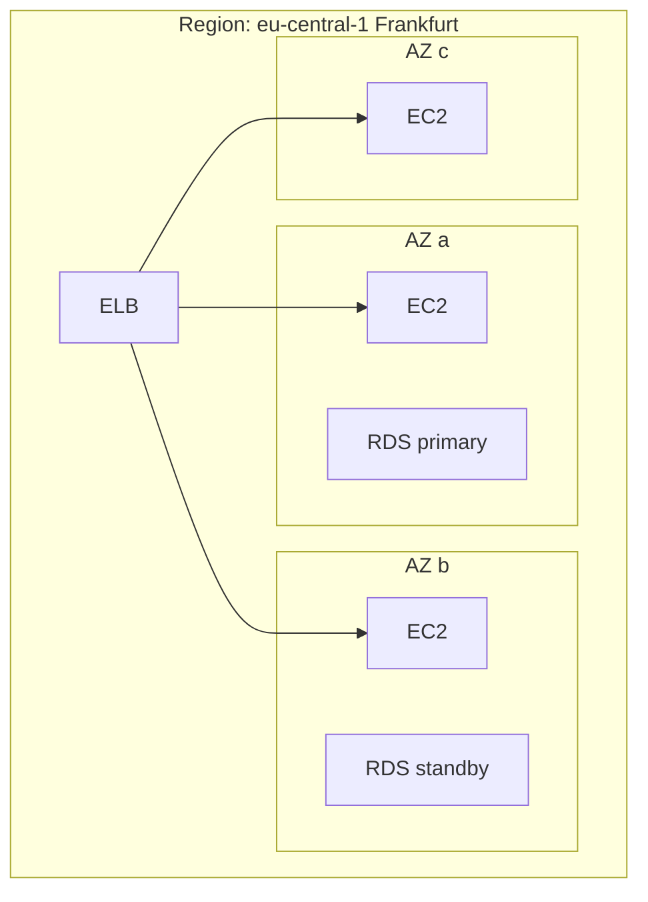
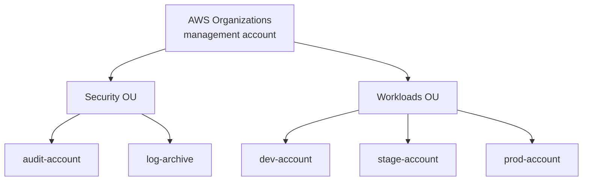
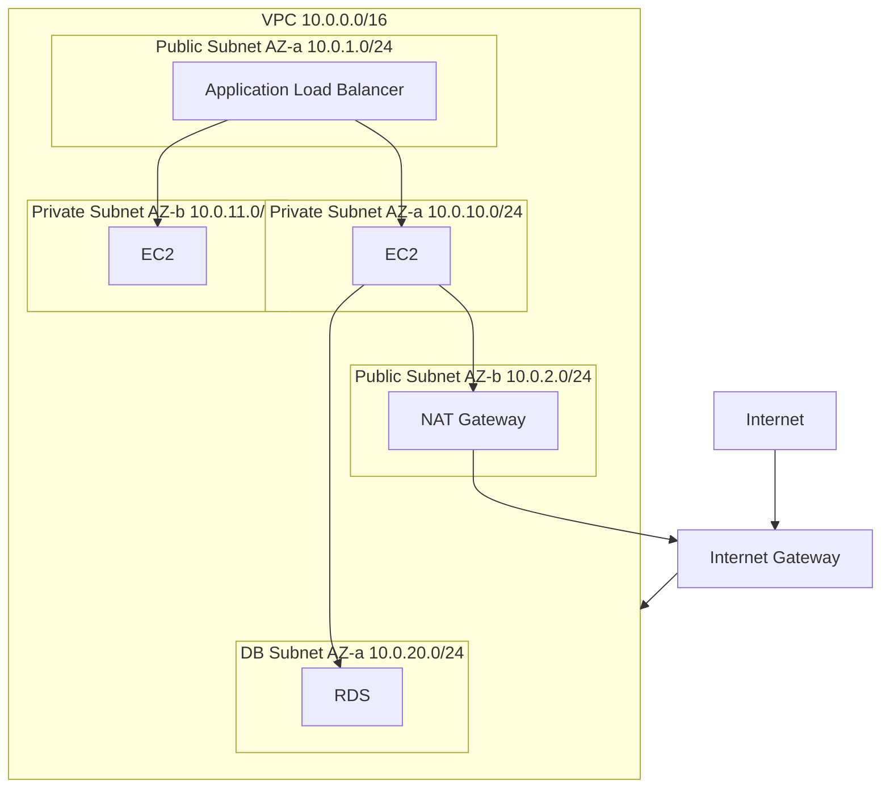
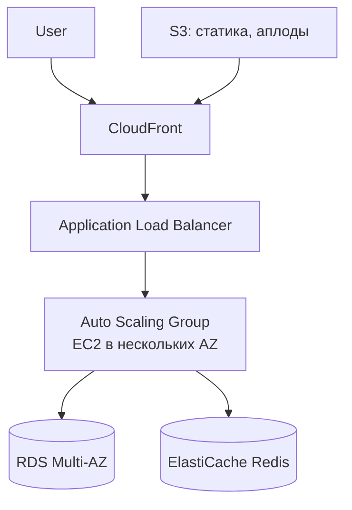
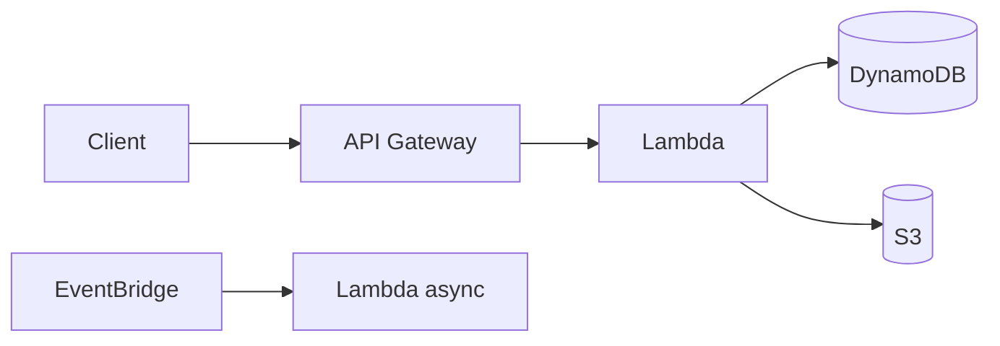
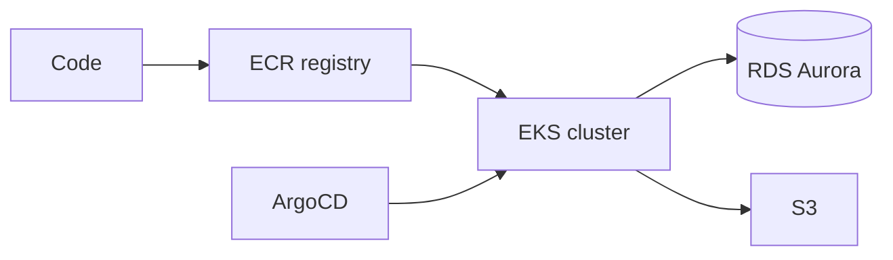

# AWS: основы

Amazon Web Services — крупнейший public cloud провайдер. Около 200 сервисов
разделены по категориям: compute, storage, database, networking, security,
analytics, ML и другие. Документ — точка входа: глобальная инфраструктура,
модель аккаунтов, базовые сервисы, IAM, CLI/SDK, биллинг, типовые архитектуры.

Глубже — в [AWS Services](aws-services.md) (всё про конкретные продукты),
[AWS Networking](aws-networking.md) (VPC, subnets, security groups),
[AWS IAM](aws-iam.md) (доступы, роли, политики).

## Полезные ссылки

### Официальная документация

- [AWS Documentation](https://docs.aws.amazon.com/) — главная точка входа
- [AWS Architecture Center](https://aws.amazon.com/architecture/) — reference-архитектуры
- [AWS Well-Architected Framework](https://aws.amazon.com/architecture/well-architected/) — пять столпов
- [AWS CLI Reference](https://docs.aws.amazon.com/cli/latest/reference/) — все команды CLI
- [AWS Service Health Dashboard](https://health.aws.amazon.com/health/status) — статус сервисов

### Обучающие материалы

- [AWS Skill Builder](https://explore.skillbuilder.aws/) — официальное обучение
- [AWS Solutions Library](https://aws.amazon.com/solutions/) — готовые решения
- [The Open Guide to AWS](https://github.com/open-guides/og-aws) — community-гид

### См. также

- [AWS Services](aws-services.md) — детальный обзор сервисов
- [AWS Networking](aws-networking.md) — VPC, подсети, gateway, security groups
- [AWS IAM](aws-iam.md) — пользователи, роли, политики
- [Kubernetes в облаке](kubernetes-cloud.md) — EKS, GKE, AKS
- [Containerization Overview](../containers/containerization-overview.md) — контейнеры в облаке
- [IaC: обзор](../iac/iac-overview.md) — Terraform для AWS
- [Observability: руководство](../../monitoring/observability-guide.md) — CloudWatch и OTel

## Содержание

- [Глобальная инфраструктура](#глобальная-инфраструктура)
- [Модель аккаунтов и Organizations](#модель-аккаунтов-и-organizations)
- [Базовые сервисы по категориям](#базовые-сервисы-по-категориям)
- [Compute: EC2, Lambda, Fargate](#compute-ec2-lambda-fargate)
- [Storage: S3, EBS, EFS](#storage-s3-ebs-efs)
- [Database: RDS, DynamoDB, Aurora](#database-rds-dynamodb-aurora)
- [Networking: VPC и связанные](#networking-vpc-и-связанные)
- [Messaging: SQS, SNS, EventBridge, Kinesis](#messaging-sqs-sns-eventbridge-kinesis)
- [Security и IAM](#security-и-iam)
- [AWS CLI и SDK](#aws-cli-и-sdk)
- [Биллинг и cost optimization](#биллинг-и-cost-optimization)
- [Well-Architected Framework](#well-architected-framework)
- [Типовые reference-архитектуры](#типовые-reference-архитектуры)
- [Решение проблем](#решение-проблем)
- [Лучшие практики](#лучшие-практики)

## Глобальная инфраструктура

AWS разделён на регионы и зоны доступности.

| Понятие | Описание |
|---------|----------|
| Region | Географическая область (Frankfurt, Virginia, Tokyo). 30+ регионов |
| Availability Zone (AZ) | Изолированный датацентр внутри региона. 3+ AZ в регионе |
| Edge Location | Точка CDN (CloudFront). 600+ |
| Local Zones | Расширения региона ближе к пользователям |
| Wavelength | На границе телеком-сетей (5G) |
| Outposts | AWS-стек в собственном датацентре клиента |

Регионы изолированы: ресурсы (EC2, RDS, VPC) живут в одном регионе. Cross-region
взаимодействие — отдельная конфигурация.



**Правило:** прод-нагрузка всегда в нескольких AZ. Один AZ — single point
of failure. Multi-region — для DR и регуляторных требований.

| Что | Где живёт |
|-----|-----------|
| Регион-специфичные ресурсы | EC2, RDS, EBS, VPC |
| Глобальные сервисы | IAM, Route53, CloudFront, S3 (бакет имеет регион, но имя — глобальное) |
| AZ-специфичные | Subnet, EBS volume |

## Модель аккаунтов и Organizations

Аккаунт — изолированная контейнер с биллингом и IAM. Любой проект делится
на несколько аккаунтов: dev, stage, prod, sandbox, audit.



**Зачем разделять:**

- IAM-blast-radius: компрометация dev не влияет на prod.
- Биллинг по проектам/командам.
- Регуляторные требования (audit-аккаунт читает логи всех остальных).
- Service quotas per account — независимы.

**AWS Organizations** даёт:

- Consolidated billing для всех аккаунтов.
- Service Control Policies (SCP) — глобальные ограничения, выше IAM.
- Cross-account roles для централизованного управления.
- Account Factory (через Control Tower) для стандартизованного создания.

> Для production startup'ов сразу разворачивай AWS Organizations с
> минимум 4–5 аккаунтами. Перевести существующие ресурсы между аккаунтами
> сложно — сразу делай правильно.

## Базовые сервисы по категориям

| Категория | Ключевые сервисы |
|-----------|------------------|
| Compute | EC2, Lambda, Fargate, ECS, EKS, Batch, App Runner |
| Storage | S3, EBS, EFS, FSx, Glacier, Storage Gateway |
| Database | RDS, Aurora, DynamoDB, ElastiCache, Redshift, DocumentDB, Neptune |
| Networking | VPC, Route53, CloudFront, ELB, API Gateway, Direct Connect, Transit Gateway |
| Security | IAM, KMS, Secrets Manager, GuardDuty, WAF, Shield, Macie, CloudTrail |
| Messaging | SQS, SNS, EventBridge, Kinesis, MSK (Kafka), MQ |
| Analytics | Athena, Glue, EMR, Redshift, QuickSight, Kinesis Analytics |
| ML/AI | SageMaker, Bedrock, Comprehend, Rekognition, Polly |
| Developer Tools | CodeCommit, CodeBuild, CodeDeploy, CodePipeline, X-Ray |
| Management | CloudWatch, CloudFormation, Systems Manager, Config, Trusted Advisor |
| Containers | ECR, ECS, EKS, Fargate, App Mesh |
| Serverless | Lambda, API Gateway, Step Functions, EventBridge |

## Compute: EC2, Lambda, Fargate

Три уровня compute, от наибольшего контроля до наименьшего:

| Сервис | Что управляешь | Что AWS | Когда |
|--------|----------------|---------|-------|
| EC2 | Виртуальная машина: ОС, runtime, патчи | Гипервизор, физика | Полный контроль, длительные нагрузки |
| ECS/EKS на EC2 | Контейнеры на твоих VM | Гипервизор | Контейнеры с контролем VM |
| Fargate | Контейнеры | VM, оркестратор | Контейнеры без управления нодами |
| Lambda | Функция | Всё остальное | Event-driven, короткие задачи |
| App Runner | HTTP-сервис | Деплой, scaling | Простые web-сервисы |

**EC2 instance types:**

```text
m5.xlarge
^  ^^
|  ||
|  |+-- размер: nano, micro, small, medium, large, xlarge, 2xlarge ... 24xlarge
|  +--- поколение: 5, 6, 7
+------ семейство: t (burstable), m (general), c (compute), r (memory),
        i/d (storage), p/g (GPU), x (huge memory)
```

| Семейство | Когда |
|-----------|-------|
| t (Burstable) | Dev, низкая стабильная нагрузка с пиками |
| m (General) | Web-сервисы, средняя нагрузка |
| c (Compute-optimized) | CPU-тяжёлые задачи: обработка, шифрование |
| r/x (Memory-optimized) | БД, кеши, большие in-memory наборы |
| i/d (Storage-optimized) | Большие IO, NoSQL |
| p/g (GPU) | ML, видео, графика |

**Lambda:**

```python
def handler(event, context):
    return { "statusCode": 200, "body": "Hello" }
```

| Параметр | Лимит |
|----------|-------|
| Время выполнения | 15 минут |
| Размер пакета | 50 MB зипом, 250 MB разжатым; контейнер до 10 GB |
| Память | 128 MB — 10 GB |
| Concurrent executions | 1000 на регион (можно увеличить) |
| Cold start | 100ms — несколько секунд (зависит от runtime, размера) |

Lambda — для event-driven и spiky-нагрузок. Не для постоянной нагрузки —
EC2/ECS дешевле.

**Fargate:** запуск контейнеров без EC2. Платишь только за vCPU/RAM на
время работы task'а.

## Storage: S3, EBS, EFS

| Сервис | Тип | Доступ | Когда |
|--------|-----|--------|-------|
| S3 | Объектное хранилище | HTTP API | Файлы, бэкапы, статика, big data |
| EBS | Блочное (диск) | Подключается к одному EC2 | Boot volumes, БД на EC2 |
| EFS | Файловая система NFS | Несколько EC2 одновременно | Shared storage между нодами |
| FSx | Managed Windows / Lustre / NetApp | NFS/SMB | Legacy Windows, HPC |
| Glacier | Архив | API, восстановление часами | Долгоживущие бэкапы |

**S3 storage classes:**

| Class | Когда |
|-------|-------|
| Standard | Часто читаемые данные |
| Standard-IA (Infrequent Access) | Реже раза в месяц |
| One Zone-IA | Менее критичные данные с lower availability |
| Intelligent-Tiering | AWS сам перемещает между классами |
| Glacier Instant Retrieval | Архив с быстрым доступом |
| Glacier Flexible Retrieval | Архив с восстановлением минуты-часы |
| Glacier Deep Archive | Самый дешёвый, восстановление 12 часов |

S3 на одном bucket'е поддерживает миллиарды объектов. Имя bucket'а —
глобально уникальное (между всеми клиентами AWS).

**EBS volume types:**

| Тип | IOPS | Когда |
|-----|------|-------|
| gp3 (general purpose, default) | 3000 baseline, до 16000 | По умолчанию, баланс цены/скорости |
| io2 / io2 Block Express | До 256 000 | Высокий IO (БД, real-time) |
| st1 (throughput-optimized HDD) | Низкие IOPS, высокий throughput | Big data, log-heavy |
| sc1 (cold HDD) | Очень низкие | Редкий доступ |

## Database: RDS, DynamoDB, Aurora

Managed-БД — AWS делает бэкапы, патчи, replication.

| Сервис | Тип | Когда |
|--------|-----|-------|
| RDS | Managed MySQL, Postgres, MariaDB, Oracle, SQL Server | Стандартные RDBMS |
| Aurora | Postgres/MySQL-совместимая, AWS-проприетарная | Высокая производительность, scaling |
| DynamoDB | NoSQL key-value/document | Сериализация, гибкая схема, planet-scale |
| ElastiCache | Managed Redis / Memcached | Кеши, sessions |
| Redshift | DWH, columnar | Аналитика на TB-PB данных |
| DocumentDB | MongoDB-compatible | Существующие приложения на Mongo |
| Neptune | Graph DB | Графы (соц. сети, knowledge graphs) |
| Timestream | Time-series | Метрики, IoT |

**RDS vs Aurora:**

- RDS = managed обычная Postgres/MySQL.
- Aurora = переписанный engine с разделённым storage (6 копий по 3 AZ),
  serverless опция, в 3–5 раз быстрее на типовых нагрузках.

**DynamoDB:**

- Single-digit ms latency на любых масштабах.
- Pay-per-request или provisioned capacity.
- Global tables для multi-region.
- Global secondary indexes (GSI), local secondary indexes (LSI).
- DAX — встроенный кеш.

```python
import boto3
table = boto3.resource('dynamodb').Table('Users')
table.put_item(Item={'userId': '123', 'name': 'Alice'})
user = table.get_item(Key={'userId': '123'})['Item']
```

## Networking: VPC и связанные

VPC (Virtual Private Cloud) — изолированная виртуальная сеть в AWS.



| Компонент | Назначение |
|-----------|-----------|
| VPC | Виртуальная сеть с CIDR-блоком |
| Subnet | Подсеть в одной AZ |
| Internet Gateway | Связь VPC с Internet |
| NAT Gateway | Outbound из private subnet наружу |
| Route Table | Куда идёт трафик |
| Security Group | Stateful firewall на уровне инстанса |
| Network ACL | Stateless firewall на уровне subnet |
| VPC Peering | Связь между VPC |
| Transit Gateway | Hub для multi-VPC и on-prem |
| VPC Endpoint | Доступ к S3/DynamoDB/etc без выхода в Internet |

**Public vs Private subnet:** различие — есть ли route на Internet Gateway.
В public subnet ресурсы получают публичный IP, в private — нет.

**Security Group vs NACL:**

| Свойство | Security Group | NACL |
|----------|----------------|------|
| Уровень | Instance | Subnet |
| Stateful | Да | Нет (нужно явно разрешать ответы) |
| Allow/Deny | Только Allow | Allow и Deny |
| Применение | По умолчанию запрещено всё | По умолчанию разрешено всё |

## Messaging: SQS, SNS, EventBridge, Kinesis

| Сервис | Тип | Когда |
|--------|-----|-------|
| SQS | Очередь, point-to-point | Decoupling, retry, batch processing |
| SNS | Pub/sub topic | Fan-out нескольким подписчикам |
| EventBridge | Event bus с фильтрацией и schema | Event-driven архитектура, integration с SaaS |
| Kinesis Data Streams | Streaming, ordering, replay | Real-time analytics, ordered processing |
| Kinesis Firehose | Streaming → storage | Загрузка потоков в S3/Redshift |
| MSK | Managed Apache Kafka | Если нужен именно Kafka |
| MQ | Managed RabbitMQ/ActiveMQ | Legacy AMQP/JMS |

**SQS Standard vs FIFO:**

- Standard — at-least-once, no ordering, unlimited throughput.
- FIFO — exactly-once, strict ordering, до 3000 msg/s per group.

**SNS** — событие публикуется один раз, доставляется N подписчикам:
SQS, Lambda, HTTP, email, SMS.

## Security и IAM

IAM — ключевой сервис безопасности. Управляет:

- **Users** — долгоживущие identities (для людей).
- **Groups** — группы пользователей с общими правами.
- **Roles** — временные identities (для приложений и cross-account).
- **Policies** — JSON-документы с разрешениями.
- **Identity providers** — Federation с корпоративным SSO (SAML, OIDC).

```json
{
  "Version": "2012-10-17",
  "Statement": [{
    "Sid": "AllowS3ReadOnly",
    "Effect": "Allow",
    "Action": ["s3:GetObject", "s3:ListBucket"],
    "Resource": [
      "arn:aws:s3:::my-bucket",
      "arn:aws:s3:::my-bucket/*"
    ],
    "Condition": {
      "StringEquals": { "aws:RequestedRegion": "eu-central-1" }
    }
  }]
}
```

**Принципы IAM:**

- Не используй root-аккаунт. Создай первого IAM-пользователя с админ-правами,
  включи MFA на root и забудь о нём.
- Минимальные привилегии (least privilege). Начинай с deny и явно разрешай.
- Роли вместо ключей. EC2 instance profile, Lambda execution role —
  никаких access key в коде.
- MFA на привилегированных пользователей.
- IAM Access Analyzer — обнаружение over-permissive политик.
- AWS CloudTrail — аудит всех API-вызовов.
- AWS Config — отслеживание конфигурации ресурсов.

См. [AWS IAM](aws-iam.md) для детального гайда.

## AWS CLI и SDK

```bash
aws configure                              # интерактивный setup
aws configure --profile prod
aws s3 ls
aws s3 cp file.txt s3://bucket/
aws ec2 describe-instances
aws ec2 run-instances --image-id ami-xxx --instance-type t3.micro
aws --profile prod sts get-caller-identity
```

`~/.aws/config`:

```ini
[default]
region = eu-central-1
output = json

[profile prod]
region = eu-central-1
sso_start_url = https://my-org.awsapps.com/start
sso_region = eu-central-1
sso_account_id = 123456789012
sso_role_name = AdministratorAccess
```

**SSO** — стандартный путь для аутентификации в multi-account setup. Не
используй долгоживущие access keys для людей.

**SDK** — boto3 (Python), AWS SDK for Java, AWS SDK for Go и для других языков.
Вызовы те же, что в CLI, но программно.

## Биллинг и cost optimization

Биллинг по pay-as-you-go: платишь за используемые ресурсы. Главные источники
неожиданных счетов:

- Forgotten instances — забытый t3.large в test-аккаунте за месяц.
- NAT Gateway — fixed cost + per-GB processing.
- Cross-AZ data transfer — между AZ внутри VPC платно.
- CloudWatch logs retention — без TTL логи копятся годами.
- S3 PUT/GET requests — дороже, чем хранение, при миллионах запросов.
- Unused EBS volumes — при удалении EC2 диск не удаляется по умолчанию.

**Инструменты:**

| Инструмент | Что |
|-----------|-----|
| AWS Cost Explorer | Графики, группировка по тегам/сервисам |
| AWS Budgets | Алерты на превышение |
| Trusted Advisor | Рекомендации (idle resources, savings) |
| Cost Anomaly Detection | ML-обнаружение аномалий |
| Compute Optimizer | Right-sizing рекомендации |
| Savings Plans / Reserved Instances | Скидки 30-70% за обязательство |

**Стратегии экономии:**

- Tag-стратегия: каждый ресурс помечен `team`, `project`, `env`.
  Без тегов биллинг — чёрный ящик.
- Right-sizing: t3.medium вместо m5.xlarge, если CPU 5%.
- Reserved Instances / Savings Plans для предсказуемых нагрузок (1-3 года).
- Spot Instances для batch и stateless (90% скидка, могут быть прерваны).
- Auto-stop dev-инстансов ночью и в выходные.
- S3 Lifecycle policies: переместить старые данные в Glacier.
- Удаление unused EBS, неиспользуемых snapshot'ов.
- VPC Endpoints для S3/DynamoDB вместо NAT (бесплатно vs $0.045/GB).

## Well-Architected Framework

Пять столпов AWS-архитектуры:

| Pillar | Что |
|--------|-----|
| Operational Excellence | Автоматизация, мониторинг, runbooks |
| Security | IAM, шифрование, аудит, defense in depth |
| Reliability | Multi-AZ, бэкапы, failover, тестирование DR |
| Performance Efficiency | Right-sizing, кеши, CDN, мониторинг latency |
| Cost Optimization | Pay-for-value, теги, Reserved/Spot, lifecycle |
| Sustainability | Энергоэффективность, выбор регионов |

AWS Well-Architected Tool — бесплатный аудит против фреймворка.
Используется в крупных internal review.

## Типовые reference-архитектуры

### Three-tier web app



**Compose:** CloudFront → ALB → EC2 в Auto Scaling Group → RDS Multi-AZ.
Static — в S3, CloudFront.

### Serverless API



**Compose:** API Gateway → Lambda → DynamoDB. Асинхронные события через
EventBridge → Lambda.

### Container workloads



**Compose:** GitHub Actions → ECR → EKS, IaC через Terraform или CDK,
GitOps через ArgoCD.

### Data lake / analytics

**Compose:** S3 (raw + curated) → Glue (ETL) → Athena (ad-hoc SQL) или
Redshift (DWH) → QuickSight (BI).

## Решение проблем

| Симптом | Причина | Что сделать |
|---------|---------|-------------|
| Не могу подключиться к EC2 по SSH | Security Group не разрешает порт 22 / нет IGW / в private subnet | Проверь SG, route table, public IP |
| RDS медленный | Misconfigured instance type, нет replicas, плохие индексы | Performance Insights, увеличить класс, добавить read replicas |
| Lambda cold start ужасный | Большой пакет, много dependencies, низкая память | Уменьшить deps, увеличить память, Provisioned Concurrency |
| S3 access denied | Bucket policy / IAM / Block Public Access | `aws s3api get-bucket-policy`, проверь все три |
| Огромный счёт за data transfer | Cross-AZ, cross-region, NAT | Cost Explorer per service; VPC Endpoints для AWS-сервисов |
| ELB возвращает 503 | Все targets unhealthy | `aws elbv2 describe-target-health`, проверь health-check path |
| Auto Scaling не запускает новые EC2 | Нет capacity, лимит, EBS quota | Service Quotas, CloudWatch alarms |
| Lambda timeout | Превышен timeout, медленные внешние вызовы | Увеличить timeout, async processing, Step Functions |
| DynamoDB throttling | Hot partition, недостаточно WCU/RCU | Better partition key, on-demand mode |

## Лучшие практики

- Используй AWS Organizations с момента старта проекта. Минимум: dev, prod, audit.
- Никогда не работай через root user после создания первого admin IAM.
- MFA на всех привилегированных пользователей. Hardware-key для root.
- IaC через Terraform или CDK. Не «нажимай в консоли». Консоль — для
  обучения и расследования инцидентов.
- Multi-AZ для prod RDS, ELB, EKS. Single AZ — это accepting downtime.
- Backup strategy: бэкапы автоматические + регулярная проверка восстановления.
- Шифрование at-rest везде (KMS keys), в transit (TLS).
- VPC по best-practices: private subnets для compute, public — только
  для load balancers, NAT Gateway для outbound.
- Tag-полиси через SCP. Без тегов биллинг невыносим.
- CloudTrail включён во всех аккаунтах. Логи — в отдельный аккаунт audit.
- AWS Config + AWS Security Hub для compliance.
- Tags + Budgets + Cost Anomaly Detection — обязательный минимум для
  понимания, куда уходят деньги.
- Reserved/Savings Plans для baseline нагрузки.
- Регулярный аудит: AWS Trusted Advisor, Compute Optimizer, IAM Access Analyzer.
- Не клади секреты в окружение Lambda/EC2 plain — Secrets Manager
  или Parameter Store с KMS.

**Итог:** AWS — большая платформа с десятками сервисов. Базовые блоки —
EC2/Lambda для compute, S3 для storage, RDS/DynamoDB для БД, VPC для сети,
IAM для доступа. Multi-account + multi-AZ + IaC + CloudTrail — обязательная
основа для production. Главные источники проблем — IAM (over-permissive
политики) и биллинг (забытые ресурсы, cross-AZ traffic).
