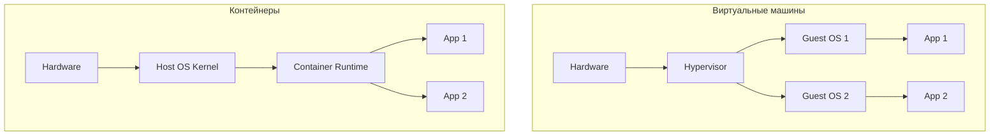
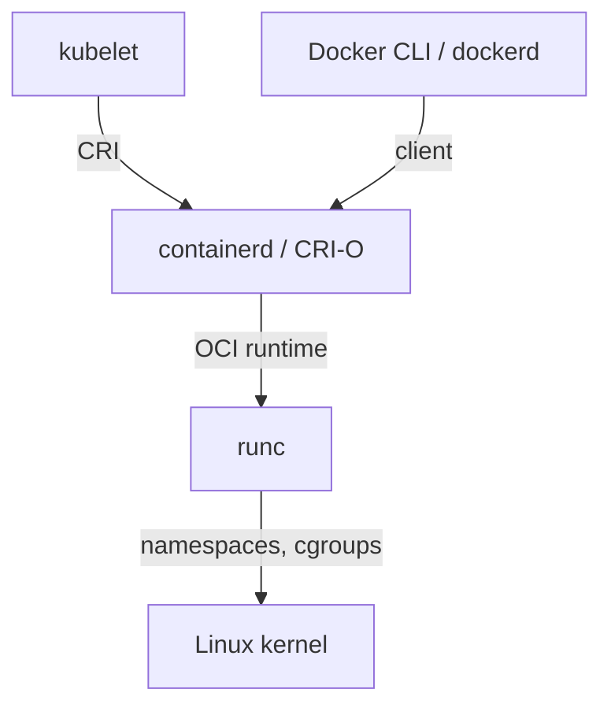

# Контейнеризация: обзор

Контейнер — это Linux-процесс, изолированный от остального хоста через
namespaces, cgroups и собственный корень файловой системы. Образ — упакованная
файловая система плюс метаданные о том, как запускать процесс. Контейнеры
не виртуализируют железо: ядро у них общее с хостом.

Документ — карта темы: чем контейнер отличается от VM, какие компоненты
участвуют в запуске, как связаны Docker, OCI, containerd и runc, чем
занимается Kubernetes. Глубокие гайды — по ссылкам в конце разделов.

## Полезные ссылки

### Официальная документация

- [Docker Documentation](https://docs.docker.com/) — официальная докуменация Docker
- [Kubernetes Documentation](https://kubernetes.io/docs/) — официальная документация K8s
- [OCI Specifications](https://opencontainers.org/specs/) — стандарты Image Spec и Runtime Spec
- [containerd](https://containerd.io/docs/) — CNCF runtime

### Обучающие материалы

- [Container Internals (Liz Rice)](https://www.youtube.com/watch?v=8fi7uSYlOdc) — разбор namespaces и cgroups
- [Kubernetes the Hard Way](https://github.com/kelseyhightower/kubernetes-the-hard-way) — как K8s устроен изнутри

### См. также

- [Docker: основы](docker/docker-basics.md) — Dockerfile, команды, registry
- [Docker Compose](docker/docker-compose.md) — multi-контейнерные приложения локально
- [Docker Advanced](docker/docker-advanced.md) — multi-stage, BuildKit, оптимизация образов
- [Kubernetes: основы](kubernetes/kubernetes-basics.md) — Pods, Deployments, Services
- [Kubernetes Networking](kubernetes/kubernetes-networking.md) — Services, Ingress, NetworkPolicies
- [Kubernetes Security](kubernetes/kubernetes-security.md) — RBAC, Pod Security, Secrets
- [IaC: обзор](../iac/iac-overview.md) — Terraform, Helm и провижининг кластеров

## Содержание

- [Контейнер vs виртуальная машина](#контейнер-vs-виртуальная-машина)
- [Что внутри контейнера на Linux](#что-внутри-контейнера-на-linux)
- [Образ: слои и манифест](#образ-слои-и-манифест)
- [Стек runtime: Docker, containerd, runc, CRI](#стек-runtime-docker-containerd-runc-cri)
- [OCI: стандарты](#oci-стандарты)
- [Registry: где живут образы](#registry-где-живут-образы)
- [Локальная сборка и запуск](#локальная-сборка-и-запуск)
- [Оркестрация: зачем Kubernetes](#оркестрация-зачем-kubernetes)
- [Безопасность контейнеров](#безопасность-контейнеров)
- [Стоимость и эксплуатация](#стоимость-и-эксплуатация)
- [Решение проблем](#решение-проблем)
- [Лучшие практики](#лучшие-практики)
- [Глоссарий](#глоссарий)

## Контейнер vs виртуальная машина

| Свойство | Контейнер | VM |
|----------|-----------|-----|
| Уровень изоляции | Процесс через namespaces | Гипервизор + отдельная ОС |
| Размер | Десятки–сотни MB | Гигабайты (полная ОС) |
| Старт | Миллисекунды | Десятки секунд |
| Ядро | Общее с хостом | Своё |
| Накладные расходы | Минимальные | Заметные (CPU, RAM) |
| Слабая изоляция | Сосед может атаковать ядро | Гипервизор разделяет жёстко |
| Где использовать | Микросервисы, batch, dev-окружение | Изоляция арендатора, разные ОС, legacy |

**Когда выбирать VM:** требуется уровень изоляции для multi-tenant SaaS,
нужна другая ОС или ядро, регуляторные требования. В остальных случаях
для приложений — контейнеры.



## Что внутри контейнера на Linux

Контейнер — это процесс с тремя ключевыми механизмами изоляции:

| Механизм | Что изолирует |
|----------|--------------|
| Namespaces | Видимость ресурсов: PID, mount, net, user, IPC, UTS, cgroup |
| Cgroups | Лимиты на CPU, память, IO, PID, сеть |
| Capabilities | Подмножество root-прав (drop unused) |

Дополнительно: seccomp (фильтр syscall), AppArmor/SELinux (MAC-политики),
read-only rootfs.

```bash
# То, что видит контейнер изолированно
unshare --pid --mount --net --uts --ipc --user --fork bash

# Cgroup-лимит на память (упрощённо)
echo 268435456 > /sys/fs/cgroup/memory.max
```

В системе нет «контейнера» как сущности ядра. Это композиция стандартных
Linux-примитивов, которыми управляет container runtime.

## Образ: слои и манифест

Образ — это набор слоёв (tar-архивов) плюс манифест с метаданными. Каждая
инструкция в Dockerfile создаёт отдельный слой. Слои переиспользуются между
образами через хеш содержимого.

```text
Image manifest (JSON)
├── Layer 1: base OS (например, debian:slim)
├── Layer 2: системные пакеты (apt-get install ...)
├── Layer 3: рантайм (java/python/node)
├── Layer 4: библиотеки приложения
└── Layer 5: код приложения
```

При запуске поверх слоёв создаётся read-write слой контейнера (через overlayfs).

**Польза слоистой структуры:**

- Кеш сборки: меняется только верхний слой — нижние не пересобираются.
- Эффективное хранение: одинаковый базовый слой shared между образами.
- Быстрый pull: registry докачивает только новые слои.

**Антипаттерн:** один большой слой со всем содержимым (`COPY . /app` в первой
строке) — убивает кеш и портит pull.

## Стек runtime: Docker, containerd, runc, CRI



| Слой | Что делает | Примеры |
|------|-----------|---------|
| Высокоуровневый CLI | UI для пользователя, сборка образов, registry | `docker`, `podman`, `nerdctl` |
| Container runtime | Управляет жизненным циклом, сетью, томами | `containerd`, `CRI-O` |
| Low-level runtime | Создаёт namespaces, cgroups через syscalls | `runc`, `crun`, `kata-containers` |

Docker CLI говорит с `dockerd`, тот делегирует в containerd, containerd
запускает runc, runc вызывает Linux-kernel.

В Kubernetes 1.24+ `dockershim` удалён: kubelet общается напрямую с containerd
или CRI-O через CRI (Container Runtime Interface). Docker как runtime в K8s
больше не нужен — для сборки образов используется BuildKit или kaniko.

## OCI: стандарты

Open Container Initiative — спецификации, разделившие Docker на открытые
компоненты:

| Спецификация | Что описывает |
|--------------|--------------|
| Image Spec | Структура образа: манифест, слои, конфигурация |
| Runtime Spec | Интерфейс запуска: bundle, hooks |
| Distribution Spec | Протокол registry (push, pull, manifest) |

Любой инструмент, заявляющий совместимость с OCI, работает с любым OCI-образом.
Docker Hub, GHCR, ECR, Artifactory — все следуют Distribution Spec.

## Registry: где живут образы

| Registry | Особенности |
|----------|-------------|
| Docker Hub | Публичный, лимиты на pull для anonymous |
| GitHub Container Registry (GHCR) | Привязан к GitHub-репозиторию |
| AWS ECR / GCP Artifact Registry / Azure ACR | Облачные, IAM-интеграция |
| Harbor | Self-hosted, vulnerability scanning |
| Nexus / Artifactory | Корпоративные, кеширование public registries |

Тэги — мутабельные ссылки на конкретный digest:

```bash
docker pull nginx:1.27.0          # тэг (может перезаписаться)
docker pull nginx@sha256:abc123   # неизменяемая ссылка по digest
```

В production деплой по digest, не по тэгу — иначе нельзя гарантировать,
что вчера и сегодня выехало одно и то же.

## Локальная сборка и запуск

Минимальный Dockerfile для Java-сервиса:

```dockerfile
FROM eclipse-temurin:21-jre-alpine
WORKDIR /app
COPY build/libs/app.jar app.jar
EXPOSE 8080
ENTRYPOINT ["java", "-jar", "app.jar"]
```

Команды:

```bash
docker build -t my-app:1.0 .
docker run --rm -p 8080:8080 my-app:1.0
docker images
docker ps
docker logs <container_id>
docker exec -it <container_id> sh
```

Multi-stage сборка для уменьшения финального образа:

```dockerfile
FROM gradle:8.10-jdk21 AS build
WORKDIR /src
COPY . .
RUN ./gradlew bootJar --no-daemon

FROM eclipse-temurin:21-jre-alpine
COPY --from=build /src/build/libs/*.jar app.jar
ENTRYPOINT ["java", "-jar", "/app.jar"]
```

Подробнее — в [Docker: основы](docker/docker-basics.md) и
[Docker Advanced](docker/docker-advanced.md).

## Оркестрация: зачем Kubernetes

Один Docker-host достаточен для разработки и небольших проектов. Но в проде:

- Нужно несколько реплик для отказоустойчивости.
- При падении пода кто-то должен поднять новый.
- При деплое новой версии нужен rolling update без даунтайма.
- Между сервисами должно быть стабильное DNS-имя.
- Нужны лимиты ресурсов и квоты.
- Нужно автомасштабирование.

Kubernetes решает эти задачи декларативно: ты описываешь желаемое состояние,
control plane приводит кластер к нему.

```yaml
apiVersion: apps/v1
kind: Deployment
metadata:
  name: orders
spec:
  replicas: 3
  selector:
    matchLabels: { app: orders }
  template:
    metadata:
      labels: { app: orders }
    spec:
      containers:
        - name: app
          image: registry.example.com/orders@sha256:abc...
          ports: [{ containerPort: 8080 }]
          resources:
            requests: { cpu: "200m", memory: "256Mi" }
            limits:   { cpu: "1000m", memory: "512Mi" }
          readinessProbe:
            httpGet: { path: /actuator/health/readiness, port: 8080 }
          livenessProbe:
            httpGet: { path: /actuator/health/liveness, port: 8080 }
```

| Объект K8s | Назначение |
|-----------|-----------|
| Pod | Минимальная единица: один или несколько контейнеров |
| Deployment | Управляет репликами Pod, делает rolling update |
| Service | Стабильный DNS и виртуальный IP внутри кластера |
| Ingress | HTTP-роутинг снаружи в кластер |
| ConfigMap / Secret | Конфигурация и секреты |
| Namespace | Логическое разделение ресурсов |
| StatefulSet | Pod'ы с устойчивой identity и томом (БД, очереди) |
| DaemonSet | По одному Pod на каждом узле (агенты) |

Подробнее — в [Kubernetes: основы](kubernetes/kubernetes-basics.md).

## Безопасность контейнеров

Контейнеры разделяют ядро с хостом — слабая изоляция по сравнению с VM.
Безопасность строится на нескольких уровнях:

| Уровень | Меры |
|---------|------|
| Образ | Минимальная база (distroless, alpine), сканирование на CVE (Trivy, Grype), запрет root в `USER` |
| Build | Подпись образов (Cosign, Notation), SBOM, воспроизводимая сборка |
| Registry | Pull-by-digest, immutable tags, ограничение доступа |
| Runtime | seccomp, AppArmor, read-only rootfs, drop capabilities, no privileged |
| Сеть | NetworkPolicies в K8s, mTLS через service mesh |
| Секреты | Vault / SOPS / external-secrets, не Kubernetes Secret в plain |

```yaml
# Pod с минимальными правами
spec:
  securityContext:
    runAsNonRoot: true
    runAsUser: 1000
    fsGroup: 2000
    seccompProfile: { type: RuntimeDefault }
  containers:
    - name: app
      image: my-app@sha256:...
      securityContext:
        allowPrivilegeEscalation: false
        readOnlyRootFilesystem: true
        capabilities: { drop: ["ALL"] }
```

> Никогда не запускай контейнер как `--privileged` в проде. Это даёт доступ
> к ядру хоста и обнуляет всю изоляцию.

Подробнее — в [Kubernetes Security](kubernetes/kubernetes-security.md).

## Стоимость и эксплуатация

| Аспект | На что обращать внимание |
|--------|--------------------------|
| Размер образа | Большой образ — медленный pull, дольше старт |
| Старт-тайм | Java и .NET с JIT долго прогреваются — нужны readiness probes и warm-up |
| Логирование | stdout/stderr собирается агентом узла; нет смысла писать в файл внутри контейнера |
| Метрики | `/metrics` на отдельном порту; ServiceMonitor в Prometheus Operator |
| Storage | Pod эфемерен; постоянные данные — через PersistentVolume или внешние сервисы |
| Сеть | DNS-имя сервиса — `<svc>.<ns>.svc.cluster.local`, latency между нодами заметна |

Контейнер — stateless по умолчанию. Состояние выноси в БД, очереди, S3.
StatefulSet решает часть проблем (стабильные имена, тома per replica), но
не отменяет факт, что управление кластером БД — отдельная задача.

## Решение проблем

| Симптом | Причина | Что сделать |
|---------|---------|-------------|
| `CrashLoopBackOff` | Контейнер падает сразу после старта | `kubectl logs <pod> --previous`, проверь конфиг и переменные среды |
| `OOMKilled` | Pod превысил memory limit | Увеличь limit или найди утечку в приложении |
| `ImagePullBackOff` | Не доступен registry / нет credentials | Проверь Secret типа `kubernetes.io/dockerconfigjson` и `imagePullSecrets` |
| Контейнер `Running`, но не отвечает | Не настроен readiness probe или приложение зависло | Добавь readiness, посмотри thread dump |
| `kubectl exec` не работает | Distroless образ без shell | Используй `kubectl debug` с ephemeral container |
| Большой `latest` образ долго пуллится | Нет multi-stage / лишние пакеты | Перепиши Dockerfile с multi-stage, base distroless |
| Сборка раздувается с новой строкой кода | `COPY . .` ломает кеш | Сначала `COPY pom.xml/build.gradle.kts` и резолв зависимостей, потом `COPY src` |
| Permission denied при записи | `readOnlyRootFilesystem` | Подключи `emptyDir` для путей, куда пишет приложение |

## Лучшие практики

- Один процесс на контейнер. Sidecar-контейнеры — для логов, прокси, миграций.
- Multi-stage Dockerfile: build-stage с тулчейном, runtime-stage с минимальной базой.
- Не запускай как root (`USER` или `runAsNonRoot`).
- Не используй тег `latest` в проде — деплой по digest или явному тегу.
- Liveness и readiness probes — обязательны. Без них K8s не понимает,
  жив ли контейнер и готов ли принимать трафик.
- Лимиты ресурсов (CPU, memory) — обязательны. Иначе один шумный сосед
  займёт всё.
- Секреты — через external secrets, не в plain Secret и тем более не в образе.
- Сканируй образы на CVE в CI (Trivy, Grype, Snyk).
- Логи — в stdout/stderr, не в файлы внутри контейнера.
- Метрики — Prometheus-формат на отдельном пути, ServiceMonitor / annotations.
- Трейсы — через OpenTelemetry sidecar или агент (см. [Observability: руководство](../../monitoring/observability-guide.md)).

**Итог:** контейнер — это процесс, изолированный namespaces+cgroups, с
портативной упаковкой через слои образа и стандартом OCI. Docker удобен для
сборки и локального запуска, Kubernetes — для управления флотом контейнеров
в проде. Безопасность строится на слоях: минимальная база, не root,
seccomp, NetworkPolicies, сканирование CVE.

## Глоссарий

| Термин | Описание |
|--------|----------|
| Image | Read-only шаблон: слои файловой системы плюс метаданные |
| Container | Запущенный процесс, изолированный namespaces и cgroups |
| Layer | Один tar-архив изменений файловой системы; адресуется по digest |
| Manifest | JSON-описание образа: список слоёв, конфиг, платформа |
| Digest | Хеш содержимого, неизменяемая ссылка (`sha256:...`) |
| Tag | Мутабельная ссылка на digest (`nginx:1.27`) |
| Registry | Хранилище образов с протоколом по OCI Distribution Spec |
| Runtime | Низкоуровневый компонент, создающий контейнер (runc, crun) |
| OCI | Open Container Initiative — стандарты Image, Runtime, Distribution |
| CRI | Container Runtime Interface — API между kubelet и runtime |
| Pod | Минимальная единица K8s; один или несколько контейнеров с общим network namespace |
| Namespace (Linux) | Изоляция ресурсов ядра между процессами |
| Namespace (K8s) | Логическое разделение объектов в кластере |
| cgroup | Control group — лимиты CPU, RAM, IO для процессов |
| Capability | Подмножество root-прав на конкретное действие |
