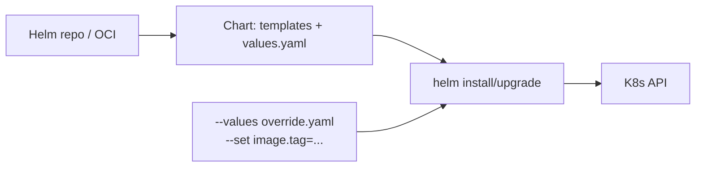

# Helm: пакетный менеджер Kubernetes

Helm — стандартный пакетный менеджер для Kubernetes. Упаковывает набор YAML-манифестов
в chart с шаблонами, значениями и зависимостями. Один и тот же chart разворачивается
в dev, staging и prod с разными `values.yaml` без копирования манифестов.

Документ покрывает то, что нужно для работы со сторонними чартами и для написания
своих: структура chart, шаблонизация, релизы, hooks, зависимости, репозитории
(включая OCI), типовые проблемы.

## Полезные ссылки

### Официальная документация

- [Helm Documentation](https://helm.sh/docs/) — полная официальная документация
- [Chart Template Guide](https://helm.sh/docs/chart_template_guide/) — гайд по шаблонам
- [Best Practices](https://helm.sh/docs/chart_best_practices/) — официальные рекомендации
- [Artifact Hub](https://artifacthub.io/) — каталог публичных чартов

### Обучающие материалы

- [Learn Helm 3](https://github.com/PacktPublishing/Learn-Helm) — книга и примеры
- [Helm Patterns](https://www.cncf.io/blog/2023/01/13/helm-3-best-practices/) — паттерны от CNCF

### См. также

- [Kubernetes: основы](kubernetes-basics.md) — понятия Pod, Deployment, Service
- [Kubernetes Advanced](kubernetes-advanced.md) — CRD, operators, HPA
- [Kubernetes Networking](kubernetes-networking.md) — Service, Ingress
- [Kubernetes Security](kubernetes-security.md) — RBAC, секреты
- [IaC: обзор](../../iac/iac-overview.md) — Terraform и Helm в одном пайплайне
- [GitHub Actions](../../ci-cd/github-actions.md) — деплой через Helm в CI

## Содержание

- [Что такое Helm и зачем он нужен](#что-такое-helm-и-зачем-он-нужен)
- [Установка и первый chart](#установка-и-первый-chart)
- [Структура chart](#структура-chart)
- [Templates: шаблонизация](#templates-шаблонизация)
  - [Действия в шаблонах](#действия-в-шаблонах)
  - [Встроенные объекты](#встроенные-объекты)
  - [Функции и pipelines](#функции-и-pipelines)
  - [Named templates и helpers](#named-templates-и-helpers)
- [Values: иерархия и переопределение](#values-иерархия-и-переопределение)
- [Релизы и lifecycle](#релизы-и-lifecycle)
- [Hooks](#hooks)
- [Зависимости (subcharts)](#зависимости-subcharts)
- [Репозитории и OCI](#репозитории-и-oci)
- [Тестирование chart](#тестирование-chart)
- [Helmfile и helm-secrets](#helmfile-и-helm-secrets)
- [Helm vs Kustomize](#helm-vs-kustomize)
- [Безопасность](#безопасность)
- [Решение проблем](#решение-проблем)
- [Лучшие практики](#лучшие-практики)

## Что такое Helm и зачем он нужен

Без Helm под каждый сервис ты пишешь Deployment, Service, ConfigMap, Ingress,
HPA. Чтобы развернуть сервис в trio (dev/stage/prod), либо копируешь манифесты,
либо генерируешь их скриптами. И то и другое — источник дрейфа.

Helm даёт три вещи:

- Шаблоны манифестов (Go templates) — одна структура, разные значения.
- Релизы как сущность Kubernetes — упрощают upgrade и rollback.
- Каталог публичных чартов (`ingress-nginx`, `cert-manager`, `prometheus`,
  `grafana`, `argo-cd`) — установка в одну команду.



## Установка и первый chart

```bash
brew install helm                         # macOS
curl -fsSL https://get.helm.sh/...        # Linux

helm version
helm create my-app                        # сгенерирует пример chart
helm install my-release ./my-app
helm list
helm upgrade my-release ./my-app --set replicaCount=3
helm rollback my-release 1
helm uninstall my-release
```

Установка стороннего chart:

```bash
helm repo add ingress-nginx https://kubernetes.github.io/ingress-nginx
helm repo update
helm install ingress-nginx ingress-nginx/ingress-nginx \
  --namespace ingress-nginx --create-namespace
```

## Структура chart

```text
my-app/
├── Chart.yaml          # метаданные chart
├── values.yaml         # значения по умолчанию
├── values.schema.json  # JSON Schema для valuesвалидации (опционально)
├── README.md
├── LICENSE
├── charts/             # subcharts (зависимости)
├── crds/               # CustomResourceDefinitions (ставятся до основного релиза)
├── templates/
│   ├── _helpers.tpl    # named templates
│   ├── deployment.yaml
│   ├── service.yaml
│   ├── ingress.yaml
│   ├── configmap.yaml
│   ├── serviceaccount.yaml
│   ├── hpa.yaml
│   ├── NOTES.txt       # инструкция после install
│   └── tests/          # helm test
└── .helmignore
```

`Chart.yaml`:

```yaml
apiVersion: v2
name: my-app
description: My application
type: application
version: 1.2.0          # версия chart (SemVer)
appVersion: "1.0.0"     # версия приложения внутри chart
home: https://example.com
maintainers:
  - name: Sergey
dependencies:
  - name: postgresql
    version: 15.x.x
    repository: https://charts.bitnami.com/bitnami
    condition: postgresql.enabled
```

Различай `version` (chart) и `appVersion` (приложение): можно выпустить
chart 1.5.0, упаковывающий приложение 1.0.0.

## Templates: шаблонизация

Helm использует Go templates с расширениями Sprig. Файлы из `templates/`
рендерятся в YAML и применяются в кластер.

```yaml
# templates/deployment.yaml
apiVersion: apps/v1
kind: Deployment
metadata:
  name: {{ include "my-app.fullname" . }}
  labels:
    {{- include "my-app.labels" . | nindent 4 }}
spec:
  replicas: {{ .Values.replicaCount }}
  selector:
    matchLabels:
      {{- include "my-app.selectorLabels" . | nindent 6 }}
  template:
    metadata:
      labels:
        {{- include "my-app.selectorLabels" . | nindent 8 }}
    spec:
      containers:
        - name: {{ .Chart.Name }}
          image: "{{ .Values.image.repository }}:{{ .Values.image.tag | default .Chart.AppVersion }}"
          imagePullPolicy: {{ .Values.image.pullPolicy }}
          ports:
            - containerPort: {{ .Values.service.targetPort }}
          resources:
            {{- toYaml .Values.resources | nindent 12 }}
```

### Действия в шаблонах

| Конструкция | Что делает |
|-------------|-----------|
| `{{ .Values.x }}` | Подставить значение |
| `{{- ... -}}` | Удалить пробелы и переводы строки слева/справа |
| `{{ if .Values.enabled }}...{{ end }}` | Условная вставка |
| `{{ range .Values.envs }}...{{ end }}` | Итерация |
| `{{ with .Values.image }}...{{ end }}` | Сменить контекст |
| `{{ default "x" .Values.y }}` | Значение по умолчанию |
| `{{ required "msg" .Values.y }}` | Падать, если значение не задано |
| `{{ include "my-app.fullname" . }}` | Подключить named template |
| `{{ tpl .Values.x . }}` | Рендерить строку как шаблон |

### Встроенные объекты

| Объект | Содержит |
|--------|----------|
| `.Values` | Содержимое `values.yaml` плюс overrides |
| `.Chart` | Поля из `Chart.yaml` |
| `.Release` | `Name`, `Namespace`, `Service`, `IsInstall`, `IsUpgrade`, `Revision` |
| `.Files` | Доступ к нешаблонным файлам chart |
| `.Capabilities` | Версия K8s, доступные API |
| `.Template` | Имя текущего файла, BasePath |

### Функции и pipelines

```yaml
metadata:
  name: {{ .Values.name | upper | trunc 63 | trimSuffix "-" | quote }}
  annotations:
    checksum/config: {{ include (print $.Template.BasePath "/configmap.yaml") . | sha256sum }}
```

Часто используемые функции (Sprig):

- `default`, `coalesce`, `ternary`, `empty`
- `quote`, `squote`, `trim`, `lower`, `upper`, `replace`
- `printf`, `nindent`, `indent`
- `toYaml`, `fromYaml`, `toJson`, `fromJson`
- `b64enc`, `b64dec`, `sha256sum`
- `dict`, `list`, `merge`, `mergeOverwrite`
- `lookup` — найти ресурс в кластере во время рендера

`checksum/config` в аннотациях — стандартный приём, чтобы Pod пересоздался
при изменении ConfigMap (Deployment видит, что аннотация изменилась).

### Named templates и helpers

`templates/_helpers.tpl` — место для переиспользуемых блоков. Файлы,
начинающиеся с `_`, не рендерятся в манифесты сами по себе.

```yaml
{{/*
Имя release с обрезкой по 63 символам (лимит K8s).
*/}}
{{- define "my-app.fullname" -}}
{{- printf "%s-%s" .Release.Name .Chart.Name | trunc 63 | trimSuffix "-" -}}
{{- end -}}

{{- define "my-app.labels" -}}
app.kubernetes.io/name: {{ include "my-app.name" . }}
app.kubernetes.io/instance: {{ .Release.Name }}
app.kubernetes.io/version: {{ .Chart.AppVersion | quote }}
app.kubernetes.io/managed-by: {{ .Release.Service }}
helm.sh/chart: {{ .Chart.Name }}-{{ .Chart.Version }}
{{- end -}}
```

## Values: иерархия и переопределение

Порядок (нижний переопределяет верхний):

1. `values.yaml` в chart.
2. `values.yaml` в подключённом subchart.
3. `--values dev-values.yaml` (можно несколько раз).
4. `--set foo.bar=baz`, `--set-string`, `--set-file`.

```bash
helm install app ./chart \
  -f values.yaml \
  -f environments/prod.yaml \
  --set image.tag=1.2.3 \
  --set-file config.json=./config.json
```

`values.yaml` (фрагмент типичного приложения):

```yaml
replicaCount: 1

image:
  repository: registry.example.com/my-app
  pullPolicy: IfNotPresent
  tag: ""

service:
  type: ClusterIP
  port: 80
  targetPort: 8080

ingress:
  enabled: false
  className: nginx
  hosts:
    - host: example.com
      paths:
        - path: /
          pathType: Prefix

resources:
  limits:
    cpu: 500m
    memory: 512Mi
  requests:
    cpu: 100m
    memory: 256Mi

autoscaling:
  enabled: false
  minReplicas: 1
  maxReplicas: 10
  targetCPUUtilizationPercentage: 80

postgresql:
  enabled: false
```

`values.schema.json` валидирует `values.yaml` при `install`/`upgrade`:

```json
{
  "$schema": "http://json-schema.org/draft-07/schema#",
  "type": "object",
  "required": ["image", "replicaCount"],
  "properties": {
    "replicaCount": { "type": "integer", "minimum": 1 },
    "image": {
      "type": "object",
      "required": ["repository"],
      "properties": {
        "repository": { "type": "string" }
      }
    }
  }
}
```

## Релизы и lifecycle

Release — экземпляр chart, развёрнутый в namespace под уникальным именем.
Helm хранит историю в Secret в том же namespace (`sh.helm.release.v1.<name>.v<rev>`).

```bash
helm install my-release ./chart           # создать
helm upgrade my-release ./chart --atomic  # обновить (атомарно: rollback при ошибке)
helm upgrade --install my-release ./chart # idempotent: создать или обновить
helm rollback my-release 3                # откатить к ревизии 3
helm history my-release                   # история ревизий
helm get values my-release                # текущие values
helm get manifest my-release              # отрендеренные манифесты
helm uninstall my-release                 # удалить (с keep-history можно сохранить)
```

| Флаг | Смысл |
|------|-------|
| `--atomic` | При ошибке откатить релиз |
| `--wait` | Ждать готовности всех ресурсов |
| `--timeout 5m` | Лимит времени ожидания |
| `--dry-run` | Не применять, только показать |
| `--debug` | Подробный вывод |
| `--create-namespace` | Создать namespace, если нет |
| `--reset-values` | Сбросить overrides к chart-default |
| `--reuse-values` | Сохранить предыдущие overrides |

> При `--atomic` Helm восстанавливает все ресурсы релиза до состояния перед
> upgrade. Это надёжнее, чем ловить частичный rollout вручную.

## Hooks

Hooks — это ресурсы со специальной аннотацией, которые Helm выполняет на
определённых этапах lifecycle. Типичный кейс — миграция БД до апгрейда основного
Deployment.

| Hook | Когда |
|------|-------|
| `pre-install` | Перед install |
| `post-install` | После install (когда ресурсы создались) |
| `pre-upgrade` | Перед upgrade |
| `post-upgrade` | После upgrade |
| `pre-delete` / `post-delete` | До/после delete |
| `pre-rollback` / `post-rollback` | До/после rollback |
| `test` | Запускается `helm test` |

```yaml
apiVersion: batch/v1
kind: Job
metadata:
  name: db-migrate
  annotations:
    "helm.sh/hook": pre-upgrade,pre-install
    "helm.sh/hook-weight": "0"
    "helm.sh/hook-delete-policy": before-hook-creation,hook-succeeded
spec:
  template:
    spec:
      restartPolicy: Never
      containers:
        - name: migrate
          image: my-app:{{ .Values.image.tag }}
          command: ["./migrate.sh"]
```

`hook-delete-policy`:

- `before-hook-creation` — удалить старый ресурс перед созданием нового (по умолчанию).
- `hook-succeeded` — удалить после успешного выполнения.
- `hook-failed` — удалить после падения (часто хочется наоборот: оставить для дебага).

## Зависимости (subcharts)

Chart может зависеть от других чартов: БД, очередь, мониторинг.

```yaml
# Chart.yaml
dependencies:
  - name: postgresql
    version: 15.5.0
    repository: https://charts.bitnami.com/bitnami
    condition: postgresql.enabled
    alias: db
  - name: redis
    version: 19.0.0
    repository: oci://registry-1.docker.io/bitnamicharts
    condition: redis.enabled
```

```bash
helm dependency update    # скачать в charts/ и обновить Chart.lock
helm dependency build     # из Chart.lock без проверки обновлений
```

Передача values в subchart:

```yaml
# values.yaml
postgresql:
  enabled: true
  auth:
    database: orders
    username: app
```

`condition` отключает subchart, если флаг `false`. Удобно для optional
зависимостей: dev стейдж берёт встроенный Postgres, prod — внешнюю managed БД.

## Репозитории и OCI

Классический Helm-репозиторий — это HTTP-сервер с `index.yaml` и архивами `.tgz`.

```bash
helm repo add bitnami https://charts.bitnami.com/bitnami
helm repo update
helm search repo bitnami/postgresql
helm pull bitnami/postgresql --version 15.5.0 --untar
```

Современный путь — OCI-registry (тот же, где живут Docker-образы):

```bash
helm package ./my-app
helm push my-app-1.2.0.tgz oci://ghcr.io/myorg/charts
helm install app oci://ghcr.io/myorg/charts/my-app --version 1.2.0
```

OCI-registry дают единое место для образов и чартов, IAM-интеграцию и подпись
через Cosign.

## Тестирование chart

Несколько уровней:

```bash
helm lint ./chart                                   # синтаксис
helm template my-release ./chart                    # рендер без apply
helm install my-release ./chart --dry-run --debug   # рендер + валидация в API
helm test my-release                                # запустить hook test
```

`helm template` плюс `kubeconform` или `kubeval` валидируют против схем K8s.
В CI это обязательный шаг перед deploy.

```bash
helm template app ./chart -f values.yaml | kubeconform -strict -summary
```

Тест внутри chart:

```yaml
# templates/tests/connection.yaml
apiVersion: v1
kind: Pod
metadata:
  name: "{{ .Release.Name }}-test-connection"
  annotations:
    "helm.sh/hook": test
spec:
  containers:
    - name: wget
      image: busybox
      command: ['wget']
      args: ['{{ include "my-app.fullname" . }}:{{ .Values.service.port }}']
  restartPolicy: Never
```

## Helmfile и helm-secrets

Helmfile — декларативный wrapper над Helm: один YAML описывает все релизы кластера.

```yaml
# helmfile.yaml
releases:
  - name: ingress-nginx
    namespace: ingress-nginx
    chart: ingress-nginx/ingress-nginx
    version: 4.10.0
    values:
      - environments/{{ .Environment.Name }}/ingress.yaml

  - name: my-app
    namespace: production
    chart: ./charts/my-app
    values:
      - values/common.yaml
      - environments/{{ .Environment.Name }}/my-app.yaml
```

```bash
helmfile -e prod apply
```

helm-secrets — плагин для расшифровки секретов в values через SOPS+age/PGP/KMS.
Зашифрованный `secrets.yaml` коммитится в Git, расшифровывается на момент
рендера.

## Helm vs Kustomize

| Свойство | Helm | Kustomize |
|----------|------|-----------|
| Подход | Шаблонизация (Go templates) | Patch и overlay |
| Установлен где | Отдельный CLI | Встроен в `kubectl -k` |
| Версионирование | Chart.yaml плюс репо | Через Git-теги |
| Сложность | Выше (шаблоны) | Ниже (но patch разрастается) |
| Где силён | Готовые сторонние пакеты, переменные | Собственные манифесты с overlay по env |
| Где слаб | Сложные шаблоны = «YAML с дырочками» | Нет «переменных» как в Helm |

Можно использовать вместе: Helm генерирует базу, Kustomize накладывает overlay.
ArgoCD умеет оба, можно комбинировать в одном Application.

**Когда выбрать Helm:** ставишь сторонний пакет, нужна параметризация для
многих сред, нужны hooks для миграций.

**Когда выбрать Kustomize:** свои манифесты без сложных условий, нужно
наследование (base + overlays), не хочется учить ещё один шаблонизатор.

## Безопасность

- Не клади секреты в `values.yaml` в plain. Используй helm-secrets, External
  Secrets Operator, Vault.
- Подписывай chart'ы (`helm package --sign`) или используй Cosign для OCI.
- Включи `values.schema.json` — невалидные values не доедут до кластера.
- Ограничь доступ к OCI/Helm-репозиторию через IAM.
- Запрещай `--no-hooks` в production: миграции должны выполняться.
- В CI прогоняй `helm template ... | kubeconform` плюс политики (Kyverno, OPA Gatekeeper).
- Не используй `lookup` в шаблонах для security-решений — он не работает в `helm template`.

## Решение проблем

| Симптом | Причина | Решение |
|---------|---------|---------|
| `Error: rendered manifests contain a resource that already exists` | Ресурс создан вручную или другим релизом | Удали ресурс или импортируй: `kubectl annotate ... helm.sh/hook=...` |
| `UPGRADE FAILED: pod has unbound immediate PersistentVolumeClaims` | StorageClass не подходит, провижионер не запущен | Проверь `kubectl get pvc`, `kubectl describe pvc` |
| Pod не пересоздаётся при изменении ConfigMap | Helm не видит ConfigMap как часть Deployment | Добавь annotation `checksum/config: {{ include ... \| sha256sum }}` |
| `Error: another operation in progress` | Прерванный install/upgrade | `helm rollback <release>` или удалить Secret `sh.helm.release.v1.<name>.v<rev>` |
| `helm upgrade` тихо стирает annotations | `kubectl edit` менял ресурс мимо Helm | Включи 3-way merge в Helm или обнови через chart |
| `helm install` зависает | `--wait` не дожидается ресурсов без readiness | Указать `--timeout 10m` или починить readinessProbe |
| Пустой релиз после `uninstall` | `--keep-history` оставляет историю | `helm uninstall <r> --keep-history=false` |
| Зависимости не подтянулись | Не запущен `helm dependency update` | `helm dependency update` или `--dependency-update` при install |
| Шаблон рендерится, но `kubectl apply` валится | Невалидный YAML после трима | `helm template ./chart \| kubeconform`, проверить `nindent` |

Для отладки шаблонов:

```bash
helm install --dry-run --debug my-release ./chart -f values.yaml
helm template ./chart -f values.yaml --show-only templates/deployment.yaml
helm get manifest <release>
```

## Лучшие практики

- Не пиши свой chart, если есть качественный публичный. Параметризуй через values.
- Версионируй chart по SemVer. Ломающие изменения — major bump.
- Держи `values.yaml` минимальным и понятным. Не клади туда полный набор —
  пусть значения по умолчанию работают для базового сценария.
- Используй `values.schema.json` — это документирует chart и ловит опечатки.
- Стандартные labels (`app.kubernetes.io/...`) — обязательны. Это даёт
  совместимость с инструментами (lens, k9s, ArgoCD UI).
- Не клади Secret в values plain. SOPS, External Secrets, Vault.
- В CI прогоняй `lint`, `template`, `kubeconform`, политики (Kyverno).
- Используй `--atomic --timeout` в проде. Это страховка от частичного rollout.
- Привязывай Pod к ConfigMap через `checksum/config` annotation.
- Для сторонних charts фиксируй версию (`--version`) и pull-by-digest где можно.
- Для multi-cluster и multi-env — Helmfile или ArgoCD ApplicationSet.
- Удаляй неиспользуемые subcharts из `charts/` — сборка тяжелеет.

**Итог:** Helm даёт шаблоны манифестов, релизы, hooks и каталог пакетов.
Для своих приложений — простые values и стандартные labels. Для чужих —
не пиши свой chart, бери готовый и переопределяй values. В проде —
`--atomic`, `values.schema.json`, миграции через hooks, секреты через SOPS
или External Secrets.
