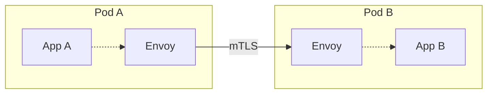
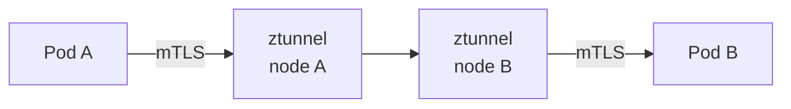
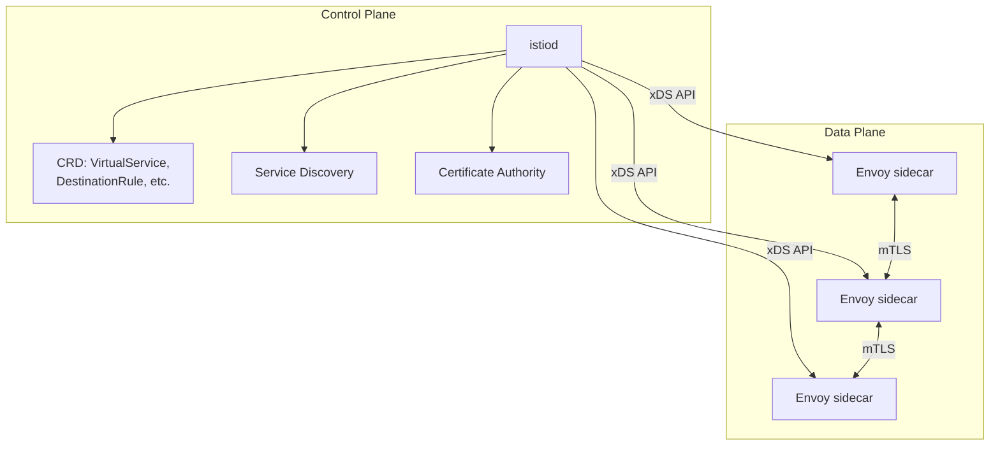
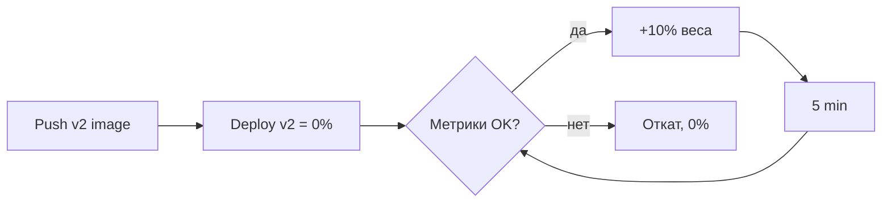

# Istio: service mesh для Kubernetes

Istio — service mesh для Kubernetes. Перехватывает трафик между подами через
sidecar-прокси (Envoy) или ambient ноды и даёт декларативно: mTLS между
сервисами, маршрутизацию, retry/timeout/circuit breaker, observability,
authorization policies. Всё без изменений в коде приложений.

Документ покрывает: что такое mesh и зачем, разницу sidecar vs ambient,
архитектуру control plane и data plane, ключевые объекты Gateway/VirtualService/
DestinationRule, mTLS, traffic shifting для canary, наблюдаемость, RBAC,
типовые проблемы.

## Полезные ссылки

### Официальная документация

- [Istio Documentation](https://istio.io/latest/docs/) — официальная документация
- [Istio Concepts](https://istio.io/latest/docs/concepts/) — архитектура и термины
- [Istio Reference](https://istio.io/latest/docs/reference/) — справочник по CRD
- [Envoy Documentation](https://www.envoyproxy.io/docs) — sidecar proxy

### Обучающие материалы

- [Istio in Action (Christian Posta, Rinor Maloku)](https://www.manning.com/books/istio-in-action) — книга
- [Service Mesh Patterns](https://servicemeshpatterns.org/) — паттерны
- [Tetrate Academy](https://academy.tetrate.io/) — бесплатные курсы

### См. также

- [Kubernetes: основы](kubernetes-basics.md) — Pod, Deployment, Namespace
- [Kubernetes Networking](kubernetes-networking.md) — Service, Ingress, NetworkPolicy
- [Kubernetes Security](kubernetes-security.md) — RBAC, Pod Security
- [Observability: руководство](../../../monitoring/observability-guide.md) — три столпа
- [OpenTelemetry](../../../monitoring/tracing/opentelemetry.md) — стандарт телеметрии
- [ArgoCD](../../ci-cd/argocd.md) — деплой Istio-конфигов через GitOps

## Содержание

- [Зачем service mesh](#зачем-service-mesh)
- [Sidecar vs ambient mode](#sidecar-vs-ambient-mode)
- [Control plane и data plane](#control-plane-и-data-plane)
- [Установка](#установка)
- [Sidecar injection](#sidecar-injection)
- [Gateway: вход в mesh](#gateway-вход-в-mesh)
- [VirtualService: маршрутизация](#virtualservice-маршрутизация)
- [DestinationRule: пулы и subsets](#destinationrule-пулы-и-subsets)
- [Traffic shifting и canary](#traffic-shifting-и-canary)
- [Retries, timeouts, circuit breakers](#retries-timeouts-circuit-breakers)
- [mTLS между сервисами](#mtls-между-сервисами)
- [Authorization policies](#authorization-policies)
- [Observability из коробки](#observability-из-коробки)
- [Multi-cluster](#multi-cluster)
- [Стоимость и ограничения](#стоимость-и-ограничения)
- [Решение проблем](#решение-проблем)
- [Лучшие практики](#лучшие-практики)
- [Когда не нужен Istio](#когда-не-нужен-istio)

## Зачем service mesh

В микросервисной архитектуре повторяются одни и те же задачи:

- TLS между сервисами (mTLS).
- Retries при перегрузке зависимости.
- Timeouts, чтобы зависший вызов не валил весь сервис.
- Circuit breaker, чтобы не долбить упавшую зависимость.
- Routing для canary и blue/green релизов.
- Метрики, трейсы, логи на уровне HTTP/gRPC.
- Authorization: какой сервис может звать какой.

Без mesh каждое приложение реализует это в коде через библиотеку (Resilience4j,
Hystrix, gRPC-interceptors). Минусы: дублирование, разные подходы между
сервисами, сложно обновлять, привязка к языку.

Service mesh выносит это на инфраструктурный уровень. Прокси перехватывает
трафик, конфигурация — в Kubernetes CRD, единые правила для всех сервисов.

## Sidecar vs ambient mode

**Sidecar mode** — классика. К каждому Pod добавляется sidecar-контейнер с
Envoy. Весь трафик Pod проходит через Envoy.



**Ambient mode** (с Istio 1.22 stable) — sidecar-less. Прокси на уровне ноды
(ztunnel) и опционально waypoint-прокси для L7-функций.



| Свойство | Sidecar | Ambient |
|----------|---------|---------|
| Накладные расходы памяти | Высокие (Envoy в каждом Pod, ~100Mi) | Низкие (один ztunnel на ноду) |
| Старт Pod | Дольше (ждём Envoy) | Быстрее |
| L4-функции (mTLS, identity) | Через Envoy | Через ztunnel (без Envoy) |
| L7-функции (retry, header-based routing) | Через Envoy | Через waypoint proxy |
| Изоляция отказов | Sidecar в Pod, отказ только этого Pod | Ztunnel — общий, отказ затрагивает ноду |
| Зрелость | Стабильна, мейнстрим | Stable с 1.22 (2024–2025), молодой |

Sidecar — классический и проверенный путь. Ambient — для тех, у кого
накладные расходы sidecar становятся проблемой (большой кластер, тысячи Pod'ов).

## Control plane и data plane



**Control plane** — `istiod` (один pod до 1.5 был набором — `pilot`, `citadel`,
`galley`, теперь объединено).

| Функция | Описание |
|---------|----------|
| Service discovery | Узнаёт о Pod/Service из K8s API |
| Configuration | Читает Istio CRD, генерирует Envoy-конфиг |
| Certificate Authority | Выдаёт SVID-сертификаты для mTLS |
| xDS API | Стримит конфигурацию в data plane |

**Data plane** — Envoy-прокси (sidecar или ambient ztunnel/waypoint). Делает
всю реальную работу с трафиком.

## Установка

```bash
# Скачать istioctl
curl -L https://istio.io/downloadIstio | sh -
export PATH=$PWD/istio-1.24.0/bin:$PATH

# Минимальный профиль
istioctl install --set profile=demo -y

# Production профиль
istioctl install --set profile=default -y

# Проверка
kubectl get pods -n istio-system
istioctl verify-install
```

Профили:

| Профиль | Что включает |
|---------|--------------|
| `default` | istiod + ingressgateway. Production-минимум |
| `demo` | + egressgateway + Kiali/Jaeger/Prometheus. Для обучения |
| `minimal` | Только istiod |
| `ambient` | Ambient mode установка |
| `empty` | Без компонентов, для кастомизации |

Helm-альтернатива:

```bash
helm install istio-base istio/base -n istio-system --create-namespace
helm install istiod istio/istiod -n istio-system --wait
helm install istio-ingress istio/gateway -n istio-ingress --create-namespace
```

## Sidecar injection

Чтобы Envoy инжектился в Pod, namespace должен быть помечен:

```bash
kubectl label namespace orders istio-injection=enabled
```

После этого все новые Pod в `orders` получат sidecar. Существующие Pod нужно
перезапустить (`kubectl rollout restart deployment ...`).

Для отдельных Pod без injection:

```yaml
metadata:
  annotations:
    sidecar.istio.io/inject: "false"
```

Для ambient — другой label:

```bash
kubectl label namespace orders istio.io/dataplane-mode=ambient
```

## Gateway: вход в mesh

Gateway — точка входа извне в mesh. Это тонкая обёртка над `istio-ingressgateway`
Pod (Envoy без приложения).

```yaml
apiVersion: networking.istio.io/v1
kind: Gateway
metadata:
  name: orders-gateway
  namespace: orders
spec:
  selector:
    istio: ingressgateway
  servers:
    - port:
        number: 443
        name: https
        protocol: HTTPS
      hosts:
        - api.example.com
      tls:
        mode: SIMPLE
        credentialName: api-tls-cert     # Secret в namespace
    - port:
        number: 80
        name: http
        protocol: HTTP
      hosts:
        - api.example.com
      tls:
        httpsRedirect: true
```

Gateway сам по себе ничего не делает — нужен VirtualService, который связан
с этим Gateway.

С появлением Gateway API в Kubernetes 1.30+ Istio переходит на стандартные
ресурсы: `Gateway` и `HTTPRoute` из `gateway.networking.k8s.io`. Для новых
проектов рекомендуется именно Gateway API, не legacy `networking.istio.io`.

## VirtualService: маршрутизация

VirtualService — правила маршрутизации к одному или нескольким Service.

```yaml
apiVersion: networking.istio.io/v1
kind: VirtualService
metadata:
  name: orders-vs
  namespace: orders
spec:
  hosts:
    - api.example.com                # внешний host (через Gateway)
    - orders                          # внутренний short name
  gateways:
    - orders-gateway
    - mesh                            # для трафика внутри mesh
  http:
    - match:
        - uri:
            prefix: /api/v1/orders
        - headers:
            x-canary:
              exact: "true"
      route:
        - destination:
            host: orders
            subset: v2
          weight: 100

    - match:
        - uri:
            prefix: /api/v1/orders
      route:
        - destination:
            host: orders
            subset: v1
          weight: 90
        - destination:
            host: orders
            subset: v2
          weight: 10                 # 10% трафика на v2
      timeout: 5s
      retries:
        attempts: 3
        perTryTimeout: 2s
        retryOn: 5xx,connect-failure,gateway-error
      fault:
        delay:
          percentage: { value: 0.1 }
          fixedDelay: 5s             # инжектируем задержку для тестов
```

Возможности:

| Что | Параметр |
|-----|----------|
| Routing по URI/header/method | `match.uri`, `match.headers`, `match.method` |
| Weight-based routing (canary) | `weight` |
| Header rewrite | `headers.request.set/add/remove` |
| Redirect | `redirect.uri` |
| Mirror traffic (shadowing) | `mirror.host`, `mirrorPercentage` |
| Timeout | `timeout` |
| Retry | `retries` |
| Fault injection | `fault.delay`, `fault.abort` |

## DestinationRule: пулы и subsets

DestinationRule конфигурирует политики для трафика К сервису: connection pool,
load balancing, outlier detection, subsets для версий.

```yaml
apiVersion: networking.istio.io/v1
kind: DestinationRule
metadata:
  name: orders-dr
  namespace: orders
spec:
  host: orders
  trafficPolicy:
    connectionPool:
      tcp:
        maxConnections: 100
      http:
        http1MaxPendingRequests: 50
        http2MaxRequests: 1000
        maxRequestsPerConnection: 10
        idleTimeout: 30s
    loadBalancer:
      simple: LEAST_REQUEST          # LEAST_REQUEST, ROUND_ROBIN, RANDOM, PASSTHROUGH
    outlierDetection:
      consecutive5xxErrors: 5
      interval: 30s
      baseEjectionTime: 60s
      maxEjectionPercent: 50

  subsets:
    - name: v1
      labels:
        version: v1
    - name: v2
      labels:
        version: v2
      trafficPolicy:                  # переопределение для конкретного subset
        connectionPool:
          tcp:
            maxConnections: 50
```

| Параметр | Назначение |
|----------|-----------|
| `connectionPool.tcp.maxConnections` | Лимит TCP-коннектов к одному upstream |
| `connectionPool.http.http2MaxRequests` | Лимит in-flight HTTP/2 запросов |
| `loadBalancer.simple` | Алгоритм балансировки |
| `outlierDetection` | Circuit breaker: после N ошибок исключаем endpoint |
| `subsets` | Логические группы Pod'ов по labels |

## Traffic shifting и canary

Базовый canary через VirtualService + DestinationRule:

```yaml
# DestinationRule определяет subsets v1 и v2
# VirtualService шлёт 90% на v1, 10% на v2

# Постепенный rollout — меняем weight через GitOps
- destination: { host: orders, subset: v1 }
  weight: 75
- destination: { host: orders, subset: v2 }
  weight: 25
```

Для автоматического rollout с проверкой метрик — Argo Rollouts или Flagger.
Они меняют weight в VirtualService, проверяют success rate / latency
по Prometheus, откатываются при деградации.



Header-based canary — отдельная категория пользователей видит v2:

```yaml
http:
  - match:
      - headers:
          x-beta-tester: { exact: "true" }
    route:
      - destination: { host: orders, subset: v2 }
  - route:
      - destination: { host: orders, subset: v1 }
```

## Retries, timeouts, circuit breakers

```yaml
# VirtualService — retry и timeout
http:
  - route:
      - destination: { host: orders }
    timeout: 10s
    retries:
      attempts: 3
      perTryTimeout: 3s
      retryOn: 5xx,reset,connect-failure,refused-stream
      retryRemoteLocalities: false

# DestinationRule — circuit breaker
trafficPolicy:
  outlierDetection:
    consecutive5xxErrors: 5         # после 5 подряд 5xx
    interval: 10s                   # окно для подсчёта
    baseEjectionTime: 30s           # на сколько изгоняем
    maxEjectionPercent: 50          # не больше половины endpoints
```

> Retry в mesh + retry в коде = retry storm. Решай однозначно: либо в коде,
> либо в mesh, либо retry с jitter и шумоподавлением. Дублирование в проде
> усугубляет аварии.

## mTLS между сервисами

mTLS включается через PeerAuthentication. Контролирует входящий трафик.

```yaml
# Все Pod в mesh принимают только mTLS
apiVersion: security.istio.io/v1
kind: PeerAuthentication
metadata:
  name: default
  namespace: istio-system
spec:
  mtls:
    mode: STRICT
```

Режимы:

| Режим | Что значит |
|-------|-----------|
| `PERMISSIVE` | Принимает и mTLS, и plain TCP. Для миграции |
| `STRICT` | Только mTLS. Для production |
| `DISABLE` | mTLS выключен. Не использовать |

Для обращения К конкретному сервису конфигурируется DestinationRule:

```yaml
apiVersion: networking.istio.io/v1
kind: DestinationRule
metadata:
  name: external-db
spec:
  host: external-db.example.com
  trafficPolicy:
    tls:
      mode: SIMPLE        # один-сторонний TLS наружу из mesh
```

Сертификаты выдаются автоматически istiod (CA), ротируются каждые 24 часа.
Истечение — на стороне istiod, prequest sidecar обновляет тихо.

## Authorization policies

AuthorizationPolicy — кто и что может вызывать. Применяется поверх mTLS-identity.

```yaml
apiVersion: security.istio.io/v1
kind: AuthorizationPolicy
metadata:
  name: orders-policy
  namespace: orders
spec:
  selector:
    matchLabels:
      app: orders
  action: ALLOW
  rules:
    # Frontend service может вызывать GET /api/orders
    - from:
        - source:
            principals: ["cluster.local/ns/frontend/sa/frontend"]
      to:
        - operation:
            methods: ["GET"]
            paths: ["/api/orders/*"]

    # Payment service может POSTить
    - from:
        - source:
            principals: ["cluster.local/ns/payments/sa/payments"]
      to:
        - operation:
            methods: ["POST"]
            paths: ["/api/orders/charge"]
```

Действия:

| Action | Что |
|--------|-----|
| `ALLOW` | Разрешить, если совпали правила |
| `DENY` | Запретить, если совпали |
| `AUDIT` | Залогировать без блокировки |
| `CUSTOM` | Делегировать внешнему authz-серверу (OPA, Keycloak) |

`principals` — SPIFFE ID, основанный на ServiceAccount. По умолчанию каждый
Pod получает identity из своего SA.

## Observability из коробки

Sidecar Envoy экспортирует метрики, трейсы и логи без изменений в коде.

| Сигнал | Что собирается | Куда |
|--------|----------------|------|
| Metrics | RED (request rate, errors, duration) per workload | Prometheus (`istio_requests_total`, `istio_request_duration_milliseconds`) |
| Distributed tracing | trace_id, spans для каждого HTTP-вызова | Jaeger / Tempo / OTLP backend |
| Access logs | Структурированные логи каждого запроса | stdout sidecar → Loki / Elastic |
| Mesh dashboards | Готовые дашборды Grafana | grafana.com/dashboards (Istio) |

Включение:

```yaml
# в IstioOperator или через mesh config
meshConfig:
  defaultProviders:
    metrics: [prometheus]
    tracing: [opentelemetry]
    accessLogging: [envoy]
  extensionProviders:
    - name: opentelemetry
      opentelemetry:
        service: otel-collector.observability.svc.cluster.local
        port: 4317
```

Sampling — через `Telemetry` API:

```yaml
apiVersion: telemetry.istio.io/v1
kind: Telemetry
metadata:
  name: default
  namespace: istio-system
spec:
  tracing:
    - randomSamplingPercentage: 10.0
```

Стандартные дашборды (Kiali, Grafana) видят:

- Граф сервисов с RPS и error rate.
- Per-workload latency (p50/p95/p99).
- Версии (subsets) и распределение трафика.
- mTLS-статус каждого ребра.

> Istio собирает метрики со стандартными именами, не зависящими от языка
> приложения. Это базовая ценность service mesh — единая observability
> поверх любых сервисов.

## Multi-cluster

Multi-cluster разворачивается двумя моделями:

| Модель | Описание |
|--------|----------|
| Multi-primary | По одному control plane в каждом кластере, share корневого CA |
| Primary-remote | Один control plane, удалённые data plane |
| Multi-network | Кластеры в разных сетях, через east-west gateway |

Базовая команда для multi-primary:

```bash
istioctl install -f cluster1.yaml --context cluster1
istioctl install -f cluster2.yaml --context cluster2
istioctl create-remote-secret --context cluster1 --name cluster1 | kubectl apply -f - --context cluster2
```

Для большинства случаев один кластер достаточен. Multi-cluster — это
DR-сценарии, гео-распределение, изоляция blast radius.

## Стоимость и ограничения

| Фактор | Цена |
|--------|------|
| Память на Pod | +60–150Mi на sidecar Envoy |
| CPU на Pod | +0.05–0.2 vCPU при стандартной нагрузке |
| Latency | +0.5–2 ms на хоп через sidecar |
| Старт Pod | +1–3 секунды (Envoy инициализация) |
| Сложность эксплуатации | Высокая: дополнительные CRD, конфиги, отладка |

Для маленького кластера (< 50 Pod) sidecar — заметные накладные расходы.
Ambient помогает, но добавляет сложность ztunnel и waypoint.

## Решение проблем

| Симптом | Причина | Решение |
|---------|---------|---------|
| `503 NR` (no route) | Нет VirtualService для host или неверный host | `istioctl proxy-config routes <pod>` |
| `503 UH` (no healthy upstream) | Outlier detection исключил все endpoints | `istioctl proxy-config endpoints <pod>` |
| `503 UC` (upstream connection terminated) | Приложение закрыло коннект, ошибка приложения | Логи приложения, не Envoy |
| 504 после 30s | Timeout VirtualService по умолчанию | Установи `timeout` явно |
| `RBAC: access denied` | AuthorizationPolicy блокирует | `istioctl analyze`, проверить principals |
| Pod не получает sidecar | Namespace не помечен `istio-injection=enabled` | Поставить label, перезапустить Pod |
| Sidecar падает на старте | Приложение пытается обращаться к сети до старта Envoy | `holdApplicationUntilProxyStarts: true` |
| Health check не проходит | `kubelet` не может пробить mTLS | Конфиг probe rewrite или exclude `15021` |
| Высокий CPU на ingressgateway | Сжатие, TLS, плохой LB | Увеличить replicas, проверить connection pool |
| mTLS не работает между namespace | PeerAuthentication PERMISSIVE | Установить STRICT, мигрировать постепенно |

Полезные команды:

```bash
istioctl analyze                                  # анализ конфигурации
istioctl proxy-status                             # статус всех sidecar
istioctl proxy-config cluster <pod>.<ns>          # cluster в Envoy
istioctl proxy-config endpoints <pod>.<ns>        # endpoints
istioctl proxy-config routes <pod>.<ns>           # routes
istioctl proxy-config listeners <pod>.<ns>        # listeners
istioctl experimental describe pod <pod>.<ns>     # сводка по Pod

kubectl logs <pod> -c istio-proxy                 # логи sidecar
kubectl exec <pod> -c istio-proxy -- pilot-agent request GET stats
```

## Лучшие практики

- Начинай с `PERMISSIVE` mTLS, мигрируй до `STRICT` постепенно.
- В Production — сертификаты из внешнего CA (Vault, cert-manager), не из истиод по умолчанию.
- Не переусердствуй с retry в mesh — комбинируй разумно с retry в коде.
- VirtualService и DestinationRule — в Git, через GitOps (ArgoCD).
- Для canary используй Argo Rollouts или Flagger, не двигай weight вручную.
- AuthorizationPolicy — обязателен в проде. По умолчанию `DENY all`,
  явно разрешай только нужное (zero trust).
- Sampling трейсов 1–10%, не 100% — иначе backend утонет.
- Мониторь сам Istio: `istiod`, `ingressgateway` имеют свои метрики
  и алерты (latency, RAM, CPU).
- Обновляй Istio регулярно — каждые 3 месяца минор-релиз. Используй revision-based upgrades.
- Не запускай Istio на legacy K8s (< 1.27) — растут проблемы совместимости.
- Документируй mesh config: какой VS принадлежит какой команде, кто owner.

**Итог:** Istio выносит cross-cutting функциональность (mTLS, retry, observability,
authz) на уровень инфраструктуры. Sidecar Envoy перехватывает трафик, control
plane (istiod) централизованно конфигурирует через CRD. Главные объекты —
Gateway, VirtualService, DestinationRule, PeerAuthentication, AuthorizationPolicy.
Цена — память, CPU, сложность эксплуатации.

## Когда не нужен Istio

Istio — мощный инструмент, но не для всех сценариев.

**Не нужен, когда:**

- Меньше 10–15 сервисов: накладные расходы не оправданы.
- Один кластер, простой ingress (Nginx Ingress + cert-manager хватает).
- mTLS между сервисами не требуется по compliance.
- Команда не готова к operational сложности.

**Альтернативы:**

| Задача | Без Istio |
|--------|-----------|
| Внешний HTTPS-вход | Nginx Ingress, Traefik, Gateway API |
| TLS между сервисами | Spiffe/Spire без mesh, или TLS в коде |
| Retry/timeout | Resilience4j, библиотечные solutions |
| Canary | Argo Rollouts на уровне Service |
| mTLS, observability, retry в одном | Linkerd — проще Istio, меньше функций |

Linkerd — частая замена для команд, которым нужен mesh, но без сложности
Envoy и обилия Istio CRD.
