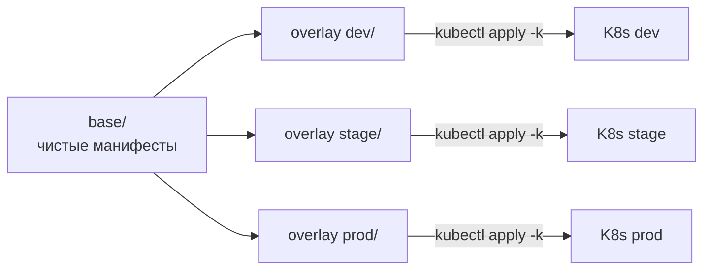

# Kustomize: overlays для Kubernetes

Kustomize — инструмент трансформации Kubernetes-манифестов через слоистые
overlay-файлы. Никаких шаблонов, никакой логики: берёшь чистый YAML (`base`),
накладываешь патчи для конкретного окружения (`overlay`), получаешь итоговый
манифест.

Встроен в `kubectl` (`kubectl apply -k`) и в ArgoCD. Один из двух стандартных
способов параметризации манифестов наряду с Helm. Хорошо подходит для своих
сервисов с разными конфигурациями dev/stage/prod, плохо — для пакетирования
сторонних чартов.

## Полезные ссылки

### Официальная документация

- [Kustomize Documentation](https://kubectl.docs.kubernetes.io/references/kustomize/) — официальная справка
- [Kustomize GitHub](https://github.com/kubernetes-sigs/kustomize) — репозиторий и issues
- [Kustomize tutorials](https://kubectl.docs.kubernetes.io/guides/) — гайды

### Обучающие материалы

- [Declarative Management with Kustomize](https://kubernetes.io/docs/tasks/manage-kubernetes-objects/kustomization/) — раздел в документации Kubernetes
- [Awesome Kustomize](https://github.com/jbussdieker/awesome-kustomize) — подборка

### См. также

- [Kubernetes: основы](kubernetes-basics.md) — Pod, Deployment, Service
- [Helm](helm.md) — альтернативный путь параметризации манифестов
- [Kubernetes Networking](kubernetes-networking.md) — Service, Ingress
- [ArgoCD](../../ci-cd/argocd.md) — деплой kustomize через GitOps
- [GitHub Actions](../../ci-cd/github-actions.md) — CI с обновлением image tag в kustomization

## Содержание

- [Что делает Kustomize](#что-делает-kustomize)
- [Установка и команды](#установка-и-команды)
- [Базовый пример: bases и overlays](#базовый-пример-bases-и-overlays)
- [kustomization.yaml: разделы](#kustomizationyaml-разделы)
- [Patches: способы изменения ресурсов](#patches-способы-изменения-ресурсов)
  - [Strategic Merge Patch](#strategic-merge-patch)
  - [JSON 6902 Patch](#json-6902-patch)
  - [Inline patches](#inline-patches)
- [Generators: ConfigMap и Secret из файлов](#generators-configmap-и-secret-из-файлов)
- [Transformers: namespace, prefix, labels](#transformers-namespace-prefix-labels)
- [ImageTagTransformer](#imagetagtransformer)
- [Components](#components)
- [Replacements](#replacements)
- [Helm-чарт через Kustomize](#helm-чарт-через-kustomize)
- [Kustomize vs Helm](#kustomize-vs-helm)
- [Решение проблем](#решение-проблем)
- [Лучшие практики](#лучшие-практики)

## Что делает Kustomize



Kustomize не шаблонизирует, а трансформирует. Никаких `{{ .Values.x }}` — только
чистый YAML и patch'и. Это плюс (всегда видно итог) и минус (нет переменных
для произвольных подстановок).

Что Kustomize умеет:

- Накладывать patch'и на существующие ресурсы.
- Добавлять префикс/суффикс к именам ресурсов.
- Добавлять общие labels и annotations.
- Менять namespace всех ресурсов.
- Подменять image tag.
- Генерировать ConfigMap и Secret из файлов.
- Подключать Helm-чарт (с оговорками).

## Установка и команды

```bash
# kubectl уже умеет:
kubectl apply -k overlays/prod
kubectl diff -k overlays/prod
kubectl kustomize overlays/prod    # рендер без apply

# Standalone (актуальнее, чем встроенный в kubectl):
brew install kustomize             # macOS
kustomize version

kustomize build overlays/prod      # рендер
kustomize build overlays/prod | kubectl apply -f -
kustomize build overlays/prod | kubeconform -strict
kustomize edit set image my-app=registry/my-app:1.2.3
```

Версия в `kubectl` обычно отстаёт. В CI используй standalone-binary с
зафиксированной версией.

## Базовый пример: bases и overlays

```text
manifests/
├── base/
│   ├── kustomization.yaml
│   ├── deployment.yaml
│   ├── service.yaml
│   └── configmap.yaml
└── overlays/
    ├── dev/
    │   ├── kustomization.yaml
    │   └── replicas-patch.yaml
    ├── stage/
    │   ├── kustomization.yaml
    │   └── ingress.yaml
    └── prod/
        ├── kustomization.yaml
        ├── replicas-patch.yaml
        └── resources-patch.yaml
```

`base/kustomization.yaml`:

```yaml
apiVersion: kustomize.config.k8s.io/v1beta1
kind: Kustomization

resources:
  - deployment.yaml
  - service.yaml
  - configmap.yaml

commonLabels:
  app.kubernetes.io/name: orders
```

`base/deployment.yaml` (без environment-specific):

```yaml
apiVersion: apps/v1
kind: Deployment
metadata:
  name: orders
spec:
  replicas: 1
  selector:
    matchLabels: { app.kubernetes.io/name: orders }
  template:
    metadata:
      labels: { app.kubernetes.io/name: orders }
    spec:
      containers:
        - name: app
          image: registry.example.com/orders
          ports: [{ containerPort: 8080 }]
          resources:
            requests: { cpu: 100m, memory: 256Mi }
            limits:   { cpu: 500m, memory: 512Mi }
```

`overlays/prod/kustomization.yaml`:

```yaml
apiVersion: kustomize.config.k8s.io/v1beta1
kind: Kustomization

namespace: orders-prod

resources:
  - ../../base

commonLabels:
  environment: prod

images:
  - name: registry.example.com/orders
    newTag: "1.2.3"

patches:
  - path: replicas-patch.yaml
  - path: resources-patch.yaml
```

`overlays/prod/replicas-patch.yaml`:

```yaml
apiVersion: apps/v1
kind: Deployment
metadata:
  name: orders
spec:
  replicas: 5
```

`overlays/prod/resources-patch.yaml`:

```yaml
apiVersion: apps/v1
kind: Deployment
metadata:
  name: orders
spec:
  template:
    spec:
      containers:
        - name: app
          resources:
            requests: { cpu: 500m, memory: 512Mi }
            limits:   { cpu: 2000m, memory: 1Gi }
```

```bash
kubectl apply -k overlays/prod
```

## kustomization.yaml: разделы

| Поле | Что делает |
|------|-----------|
| `resources` | Список файлов или директорий для включения |
| `patches` | Patches для модификации ресурсов |
| `images` | Замена image (tag, digest, имя) |
| `configMapGenerator` | Сгенерировать ConfigMap из файлов или literals |
| `secretGenerator` | Сгенерировать Secret |
| `commonLabels` | Добавить labels ко всем ресурсам и selectors |
| `labels` | То же, но с тонким контролем (без selectors) |
| `commonAnnotations` | Добавить annotations ко всем ресурсам |
| `namespace` | Поставить namespace всем ресурсам |
| `namePrefix` / `nameSuffix` | Префикс/суффикс в `metadata.name` |
| `replicas` | Изменить число реплик у Deployment/StatefulSet |
| `components` | Подключить shared transformations |
| `replacements` | Скопировать значение из одного ресурса в другой |
| `generators` / `transformers` | Кастомные плагины |
| `helmCharts` | Включить Helm-чарт |

## Patches: способы изменения ресурсов

### Strategic Merge Patch

Патч в формате того же ресурса. Kubernetes сам мержит по полям и спискам
(умеет понимать ключи списков типа `name` для контейнеров).

```yaml
# patch указывает только то, что меняем
apiVersion: apps/v1
kind: Deployment
metadata:
  name: orders
spec:
  replicas: 5
  template:
    spec:
      containers:
        - name: app             # match by name — мержит, не заменяет список
          env:
            - name: LOG_LEVEL
              value: INFO
```

```yaml
# kustomization.yaml
patches:
  - path: deployment-patch.yaml
    target:
      kind: Deployment
      name: orders
```

Strategic Merge Patch добавляет к существующему `containers[name=app]`
переменную `LOG_LEVEL`, не затирая остальные. Это основной режим работы.

### JSON 6902 Patch

JSON Patch (RFC 6902) — точечные операции `add`, `replace`, `remove`,
`copy`, `move`, `test`. Используется, когда нужно править поле, которое
strategic merge не понимает (например, элемент массива по индексу).

```yaml
patches:
  - target:
      kind: Deployment
      name: orders
    patch: |-
      - op: replace
        path: /spec/template/spec/containers/0/image
        value: registry.example.com/orders:1.2.3
      - op: add
        path: /spec/template/metadata/annotations/sidecar.istio.io~1inject
        value: "true"
      - op: remove
        path: /spec/template/spec/containers/0/livenessProbe
```

Обратите внимание на escape `~1` для `/` в путях JSON Pointer.

### Inline patches

Patch можно встроить в `kustomization.yaml`, не вынося в отдельный файл:

```yaml
patches:
  - target:
      kind: Deployment
      name: orders
    patch: |-
      apiVersion: apps/v1
      kind: Deployment
      metadata:
        name: orders
      spec:
        replicas: 5
```

`target` поддерживает `kind`, `name`, `namespace`, `labelSelector`,
`annotationSelector`. Один patch — на несколько ресурсов сразу:

```yaml
patches:
  - target:
      kind: Deployment
      labelSelector: "tier=frontend"
    patch: |-
      apiVersion: apps/v1
      kind: Deployment
      metadata:
        name: not-used  # игнорируется при labelSelector
      spec:
        template:
          spec:
            nodeSelector:
              disktype: ssd
```

## Generators: ConfigMap и Secret из файлов

```yaml
configMapGenerator:
  - name: orders-config
    files:
      - application.yaml
      - logback.xml
    literals:
      - ENV=prod
      - LOG_LEVEL=INFO

secretGenerator:
  - name: orders-secrets
    envs:
      - secrets.env       # KEY=VALUE
    type: Opaque

generatorOptions:
  disableNameSuffixHash: false
  labels:
    managed-by: kustomize
```

Имя ConfigMap по умолчанию получает hash-суффикс (`orders-config-mc4t9k7gc7`).
Это важно: при изменении содержимого имя меняется, и Kustomize обновляет
ссылки в Deployment. В результате Pod пересоздаётся при изменении конфига.

```yaml
# Deployment ссылается без хеша:
envFrom:
  - configMapRef:
      name: orders-config

# Kustomize при рендере подменит на orders-config-mc4t9k7gc7
```

Если хеш мешает (например, нужно ссылаться на ConfigMap извне):
`disableNameSuffixHash: true`. Но тогда теряется механизм пересоздания Pod при изменении ConfigMap.

## Transformers: namespace, prefix, labels

```yaml
namespace: orders-prod         # все ресурсы в orders-prod

namePrefix: prod-              # prod-orders, prod-orders-config
nameSuffix: -v2                # prod-orders-v2

commonLabels:
  app.kubernetes.io/instance: orders-prod
  environment: prod

commonAnnotations:
  managed-by: kustomize
  team: orders-team
```

> `commonLabels` добавляются и в `selector.matchLabels` Deployment'a, и в
> `template.metadata.labels`. Это и плюс (Service найдёт Pod), и подвох:
> поменять `commonLabels` уже задеплоенного Deployment нельзя — selector
> immutable. Используй `labels` (без `includeSelectors: true`), если не хочешь
> такого поведения.

## ImageTagTransformer

Подмена image — самая частая операция при деплое:

```yaml
images:
  - name: registry.example.com/orders
    newTag: "1.2.3"

  - name: registry.example.com/inventory
    newName: registry.example.com/inventory-eu
    newTag: "2.0.0"

  - name: postgres
    digest: sha256:abc123...      # вместо тега
```

В CI обновляешь tag через CLI:

```bash
cd overlays/prod
kustomize edit set image registry.example.com/orders=*:${GIT_SHA}
git commit -am "orders: ${GIT_SHA}"
git push
```

ArgoCD заметит коммит и сделает sync.

## Components

Component — переиспользуемый набор патчей и ресурсов, который подключается
в нескольких overlay. Удобно для cross-cutting функций: monitoring sidecar,
istio injection, security policies.

```text
components/
└── istio-injection/
    ├── kustomization.yaml
    └── patch.yaml

overlays/
├── stage/
│   ├── kustomization.yaml
│   └── components: [../../components/istio-injection]
└── prod/
    ├── kustomization.yaml
    └── components: [../../components/istio-injection]
```

`components/istio-injection/kustomization.yaml`:

```yaml
apiVersion: kustomize.config.k8s.io/v1alpha1
kind: Component

patches:
  - target:
      kind: Namespace
    patch: |-
      apiVersion: v1
      kind: Namespace
      metadata:
        name: not-used
        labels:
          istio-injection: enabled
```

В overlay:

```yaml
components:
  - ../../components/istio-injection
```

Components отличаются от обычных bases: они применяются последовательно
после bases, могут переопределять commonLabels, transformers и patches.

## Replacements

Replacements — копирование значения из одного ресурса в другой. Полезно,
когда два ресурса должны иметь синхронное значение (например, ConfigMap
и Deployment должны видеть одинаковую версию).

```yaml
replacements:
  - source:
      kind: ConfigMap
      name: orders-config
      fieldPath: data.APP_VERSION
    targets:
      - select:
          kind: Deployment
          name: orders
        fieldPaths:
          - spec.template.metadata.annotations.[app-version]
```

Менее популярная, но полезная фича. До 4.x была `vars` — устарела.

## Helm-чарт через Kustomize

Kustomize умеет рендерить Helm-чарт и накладывать на него patches:

```yaml
helmCharts:
  - name: postgresql
    repo: https://charts.bitnami.com/bitnami
    version: 15.5.0
    releaseName: orders-db
    namespace: orders
    valuesFile: postgresql-values.yaml

resources:
  - ./service-extras.yaml

patches:
  - path: postgresql-extras-patch.yaml
```

```bash
kustomize build --enable-helm overlays/prod
```

Это путь миграции: сторонние пакеты остаются Helm-чартами, а свои манифесты
и patches — в Kustomize.

## Kustomize vs Helm

| Свойство | Kustomize | Helm |
|----------|-----------|------|
| Подход | Patch и overlay | Шаблонизация (Go templates) |
| Установка | Встроен в kubectl | Отдельный CLI |
| Логика в манифестах | Нет | Есть (if, range, includes) |
| Версионирование | Через Git tags | Chart.yaml + repo |
| Hooks (миграции) | Нет нативно | Есть (pre/post-install/upgrade) |
| Rollback | Через `git revert` | `helm rollback` |
| Каталог пакетов | Нет | Artifact Hub |
| Где силён | Свои сервисы с разными env | Сторонние пакеты, параметризация |
| Где слаб | Условная логика, переменные | Сложные шаблоны теряют читаемость |

**Когда выбрать Kustomize:**

- Свои манифесты под несколько окружений.
- Команда не хочет учить Go templates.
- Нужна простота: всегда видно итоговый YAML.
- Используешь ArgoCD, где Kustomize встроен.

**Когда выбрать Helm:**

- Ставишь сторонние пакеты (ingress-nginx, cert-manager, prometheus).
- Нужны хуки для миграций БД.
- Нужна сложная параметризация с условиями.
- Команда уже знает Helm.

**Можно совмещать:** Helm для сторонних пакетов, Kustomize для своих
сервисов. ArgoCD понимает оба, можно комбинировать в одном репозитории.

## Решение проблем

| Симптом | Причина | Решение |
|---------|---------|---------|
| `field is immutable` при apply после смены `commonLabels` | `selector.matchLabels` Deployment нельзя менять | Удали Deployment вручную или используй `labels` без `includeSelectors` |
| Generated ConfigMap имеет хеш, который ломает GitOps diff | Хеш всегда меняется при правке | Это feature, а не bug. Хеш — триггер пересоздания Pod |
| Patch не применяется | `target.kind/name` не совпадает | Проверь точное имя ресурса в base; `kustomize build` без patches покажет |
| `kubectl apply -k` устарел и не понимает helm | Старая версия kubectl | Используй standalone `kustomize build --enable-helm \| kubectl apply -f -` |
| Изменения в `images` не подхватываются ArgoCD | ArgoCD кеширует repo-server | Пересинк через UI или подождать `--repo-server-timeout` |
| Patch с `op: remove` падает: «path doesn't exist» | Поле уже удалено или path неверен | `kustomize build` без patch — проверь актуальный YAML |
| `commonLabels` ломает HPA/Service | Меняется selector в селекторе HPA или Service | Перейди на `labels` без selectors или используй фиксированный selector в base |
| Helm chart не рендерится | `--enable-helm` не передан | `kustomize build --enable-helm` или включи в ArgoCD `kustomize.buildOptions: --enable-helm` |
| Длинные имена с префиксами обрезаются (63 символа) | K8s лимит на label/name | Сокращай namePrefix или используй nameSuffix-hash вместо длинных префиксов |

## Лучшие практики

- Базы — чистые и минимальные. Никаких environment-specific значений.
- Overlay — тонкий: только то, что отличается между средами.
- `commonLabels` ставь в base. Окружение помечай через `commonAnnotations`
  или `labels` (без selector).
- ConfigMap/Secret — через `*Generator`. Хеш-суффикс гарантирует пересоздание Pod.
- Image tag — через `images`, не через patch. Это стандартный путь, понятный CI.
- Не используй `vars` — устарели, перешли на `replacements`.
- Не клади Secret в plain — SOPS, Sealed Secrets, External Secrets Operator.
- Components — для cross-cutting concerns (monitoring sidecar, security policies).
- В CI прогоняй `kustomize build | kubeconform -strict` для каждого overlay.
- Версия Kustomize в CI — фиксированная, не «system». Поведение между версиями менялось.
- Для GitOps — структура `apps/<service>/{base,overlays/{dev,stage,prod}}` стандартна.
- Не пиши patch на каждый чих — если patches > 5, может быть проще поменять base.

**Итог:** Kustomize — простой и предсказуемый способ разнести dev/stage/prod
без шаблонов. Базы — чистый YAML, overlays — patches и transformers.
Хороший выбор для своих манифестов в GitOps. Для сторонних пакетов с
шаблонами и хуками — Helm. Можно совмещать оба.
