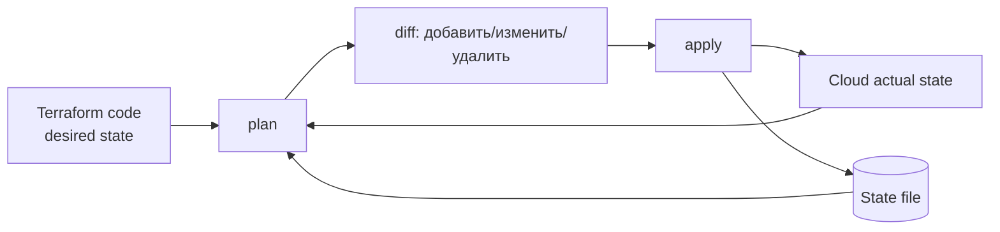
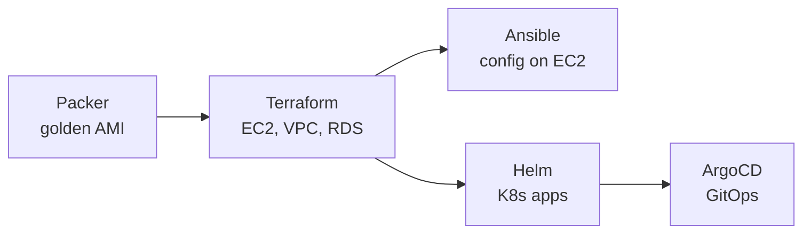
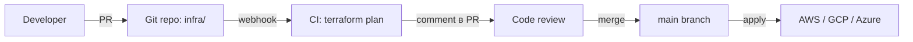

# Infrastructure as Code: обзор

Infrastructure as Code (IaC) — описание серверов, сетей, кластеров, БД и
прочих ресурсов кодом, который коммитится в Git. Тот же ресурс
описан один раз — и развёртывается одинаково в dev, stage, prod, а изменения
проходят через PR с code review.

Документ — точка входа: чем IaC отличается от ручной настройки, какие модели
существуют (declarative vs imperative, immutable vs mutable), что такое state
и drift, какие инструменты выбирать. Конкретика по продуктам — в Terraform,
Ansible, Pulumi, Packer.

## Полезные ссылки

### Официальная документация

- [Terraform Documentation](https://www.terraform.io/docs) — декларативный IaC
- [OpenTofu](https://opentofu.org/) — open-source форк Terraform
- [Ansible Documentation](https://docs.ansible.com/) — конфигурация серверов
- [Pulumi Documentation](https://www.pulumi.com/docs/) — IaC на языках программирования
- [Packer Documentation](https://www.packer.io/docs) — сборка образов
- [AWS CloudFormation](https://docs.aws.amazon.com/cloudformation/) — IaC от AWS
- [AWS CDK](https://docs.aws.amazon.com/cdk/) — CloudFormation на TS/Python

### Обучающие материалы

- [Infrastructure as Code (Kief Morris)](https://www.oreilly.com/library/view/infrastructure-as-code/9781098114664/) — каноничная книга
- [Terraform Up & Running (Yevgeniy Brikman)](https://www.terraformupandrunning.com/) — Terraform от азов до production
- [The Twelve-Factor App](https://12factor.net/) — общие принципы для cloud-native приложений

### См. также

- [Terraform](terraform/terraform.md) — основной инструмент IaC
- [Ansible](ansible/ansible.md) — конфигурация хостов
- [Pulumi](pulumi/pulumi.md) — IaC на TypeScript/Python/Go
- [Packer](packer/packer.md) — сборка образов
- [Containerization Overview](../containers/containerization-overview.md) — контейнеры
- [AWS Basics](../cloud-providers/aws-basics.md) — целевая платформа для IaC
- [ArgoCD](../ci-cd/argocd.md) — GitOps для Kubernetes
- [Helm](../containers/kubernetes/helm.md) — пакеты для K8s
- [GitHub Actions](../ci-cd/github-actions.md) — CI для IaC

## Содержание

- [Зачем нужен IaC](#зачем-нужен-iac)
- [Declarative vs Imperative](#declarative-vs-imperative)
- [Immutable vs Mutable инфраструктура](#immutable-vs-mutable-инфраструктура)
- [State: главная сложность](#state-главная-сложность)
- [Drift: дрейф между кодом и реальностью](#drift-дрейф-между-кодом-и-реальностью)
- [Идемпотентность](#идемпотентность)
- [Сравнение инструментов](#сравнение-инструментов)
- [Типичная связка инструментов](#типичная-связка-инструментов)
- [Структура проекта IaC](#структура-проекта-iac)
- [Модули и переиспользование](#модули-и-переиспользование)
- [GitOps для инфраструктуры](#gitops-для-инфраструктуры)
- [Секреты в IaC](#секреты-в-iac)
- [Тестирование IaC](#тестирование-iac)
- [CI/CD для IaC](#cicd-для-iac)
- [Антипаттерны](#антипаттерны)
- [Лучшие практики](#лучшие-практики)

## Зачем нужен IaC

| Без IaC | С IaC |
|---------|-------|
| «Прод собрали в консоли AWS Иван и Маша» | Конфигурация в Git, история изменений |
| Recreate environment займёт 2 недели | `terraform apply` развернёт идентичную копию |
| Drift между prod и stage расследуется руками | Один и тот же код для всех окружений |
| Откат — «помните, какой size был у RDS?» | `git revert` плюс apply |
| Code review над инфраструктурой невозможен | PR с diff конфигурации |
| Compliance audit вручную | Автоматическая проверка соответствия |

IaC даёт пять ключевых свойств:

- **Воспроизводимость.** Тот же код = тот же результат.
- **Версионирование.** История каждого изменения, blame, revert.
- **Code review.** Изменения инфраструктуры проходят через PR.
- **Автоматизация.** Развёртывание без ручных шагов.
- **Документация-как-код.** Описание инфраструктуры всегда актуально.

> Без IaC любая средняя или крупная инфраструктура неизбежно дрейфит.
> Через год никто не сможет точно сказать, что и почему развёрнуто.

## Declarative vs Imperative

Два фундаментально разных подхода к описанию инфраструктуры.

| Подход | Что описываешь | Пример |
|--------|----------------|--------|
| Declarative | Желаемое состояние | Terraform, CloudFormation, K8s manifests |
| Imperative | Шаги для достижения состояния | Bash, Ansible (большая часть), shell scripts |

**Declarative:**

```hcl
resource "aws_instance" "web" {
  count         = 3
  instance_type = "t3.medium"
  ami           = "ami-0c55b..."
}
```

«Я хочу 3 EC2». Terraform сам решит: создать новые, удалить лишние,
обновить разные.

**Imperative:**

```bash
for i in 1 2 3; do
  aws ec2 run-instances --instance-type t3.medium --image-id ami-0c55b...
done
```

Каждый запуск создаёт новые 3 EC2. На второй раз получим 6.

**Когда что:**

- Declarative — для облачных ресурсов, K8s, контейнеров. Стандарт.
- Imperative — для одноразовых задач, миграции данных, провижининга
  внутри уже созданной VM (Ansible playbook).

Pulumi и AWS CDK — гибрид: язык программирования (императивно описывают
объекты), но финальный движок declarative (Terraform или CloudFormation
под капотом).

## Immutable vs Mutable инфраструктура

| Подход | Поведение |
|--------|-----------|
| Mutable | Меняем существующие серверы (apt-get update, конфиг-файлы) |
| Immutable | Никогда не меняем существующие, пересобираем образы и заменяем |

**Mutable пример:** Ansible играет роль на 100 живых VM, обновляет nginx,
правит конфиги. После обновления VM остаются те же.

**Immutable пример:** Packer собирает новый AMI с обновлённым nginx,
Terraform поднимает новые EC2 из этого AMI, Auto Scaling постепенно
заменяет старые на новые.

Immutable — современный стандарт для cloud-native:

| Преимущество | Объяснение |
|--------------|-----------|
| Воспроизводимость | Образ один и тот же везде |
| Откат | Берёшь старый AMI, перезапускаешь — никаких «что я сейчас откатил?» |
| Нет config drift | Долгоживущие серверы накапливают ручные правки |
| Бэкап-восстановление через recreate | Не нужен сложный backup-pipeline |
| Безопасность | Скомпрометированный сервер просто заменяется |

Контейнеры — естественно immutable. K8s в принципе пересоздаёт Pod на
каждое изменение. Mutable-подход в облаке — скорее legacy.

> «Pet vs cattle» — pets имена и заботятся (mutable), cattle нумеруются
> и заменяются (immutable). Cloud-native стремится к cattle.

## State: главная сложность

Декларативный движок должен знать: что я уже создал, что нужно создать,
что нужно удалить. Это требует state — снимка реального состояния
ресурсов.



**Terraform state** хранит:

- Маппинг между ресурсами в коде и реальными объектами в облаке.
- Атрибуты ресурсов на момент последнего apply.
- Зависимости.
- Секреты, попавшие в output (поэтому state — sensitive).

**Backend для state:**

- **Local** — `terraform.tfstate` рядом с кодом. Только для прототипа.
- **Remote (S3 + DynamoDB)** — стандарт для AWS. S3 хранит, DynamoDB lock'и.
- **Terraform Cloud / HCP Terraform** — managed state, run в облаке.
- **GCS, Azure Blob** — для GCP/Azure.

```hcl
terraform {
  backend "s3" {
    bucket         = "my-tfstate"
    key            = "prod/terraform.tfstate"
    region         = "eu-central-1"
    dynamodb_table = "tf-locks"
    encrypt        = true
  }
}
```

> State — sensitive. Никогда не коммитить в Git, всегда зашифрован
> в backend, доступ ограничен IAM.

Pulumi: state в Pulumi Cloud по умолчанию или своём backend.
CloudFormation/CDK: state управляется AWS.
Ansible: state-less. Каждый run проверяет реальное состояние и приводит к нужному.

## Drift: дрейф между кодом и реальностью

Drift — когда реальное состояние ресурсов отличается от описанного в коде.
Источники:

- Ручные изменения через консоль провайдера.
- Auto-scaling (HPA, ASG) меняет replicas без участия IaC.
- Изменения, сделанные другими инструментами (cert-manager, oprator).

Обнаружение:

```bash
terraform plan          # показывает, что изменилось vs state
terraform refresh       # обновляет state по реальности (deprecated)
terraform plan -refresh-only  # современная версия refresh
```

**Pulumi:** `pulumi refresh`.

**Ansible:** не имеет state, поэтому drift как понятие отсутствует — каждый
run сверяет с реальностью.

Стратегии:

| Стратегия | Когда |
|-----------|-------|
| Ignore | Поле меняется автоматически (HPA replicas) — `lifecycle.ignore_changes` |
| Adopt | Внести ручное изменение в код, чтобы plan совпал |
| Revert | Apply вернёт всё к коду |
| Detect-only | CI задача `terraform plan -detailed-exitcode` алертит, не правит |

> Drift — главная причина проблем production IaC. Регулярная автоматическая
> проверка drift — обязательная практика для зрелых команд.

## Идемпотентность

Многократный запуск даёт тот же результат, что один. Это базовое свойство
IaC: `terraform apply` или `ansible-playbook` можно запускать без боязни.

Без идемпотентности:

```bash
# первый раз: создал EC2
# второй раз: создал ещё один EC2
# n-й раз: n EC2 в проде
```

С идемпотентностью:

```bash
# первый раз: создал EC2
# второй раз: ничего не делает (уже совпадает с описанием)
```

Декларативные инструменты дают это «бесплатно» (Terraform, Pulumi).
Императивные требуют сознательных усилий: Ansible-модули написаны
идемпотентно (проверяют состояние перед изменением), но если пишешь
shell-задачу — идемпотентность твоя ответственность.

```yaml
# Идемпотентно — проверит и не повторит
- name: install nginx
  apt:
    name: nginx
    state: present

# НЕ идемпотентно — выполнится каждый раз
- name: download
  shell: curl -O https://example.com/file.tar.gz
```

## Сравнение инструментов

| Инструмент | Подход | Язык | State | Управляет | Когда |
|-----------|--------|------|-------|-----------|-------|
| Terraform | Declarative | HCL | Yes | Cloud, K8s, SaaS | Стандарт для облачной инфры |
| OpenTofu | Declarative | HCL (Terraform-compatible) | Yes | То же, что Terraform | Open-source альтернатива после смены лицензии Terraform |
| Pulumi | Declarative | TS/Python/Go/C#/Java | Yes | То же | Когда нужны язык, IDE, тесты |
| AWS CloudFormation | Declarative | YAML/JSON | Managed | AWS | AWS-only, без Terraform |
| AWS CDK | Declarative | TS/Python/Java | Managed | AWS (через CFN) | AWS на TypeScript |
| Ansible | Imperative (mostly) | YAML | Stateless | Хосты, сервисы, sometimes cloud | Конфигурация ОС, deploys |
| Chef / Puppet | Imperative+Declarative | DSL | Stateful | Хосты | Legacy enterprise |
| Salt | Imperative+Declarative | YAML | Stateful | Хосты | Альтернатива Ansible |
| Packer | Declarative | HCL/JSON | None | Образы (AMI, Docker) | Сборка golden images |
| Crossplane | Declarative | K8s manifests | K8s etcd | Cloud через K8s API | GitOps cloud |
| Terragrunt | Wrapper | HCL | Через Terraform | Terraform DRY | Большие multi-account/region setups |

**Ключевые отличия:**

- **Terraform vs Pulumi:** оба декларативны, но Pulumi описан кодом
  (TS/Python/Go), а Terraform — HCL. Pulumi даёт переменные, циклы,
  unit-тесты на стандартном языке. Terraform — стабильный экосистема.

- **Terraform vs Ansible:** Terraform — для создания инфраструктуры
  (EC2, VPC, RDS), Ansible — для настройки уже созданных хостов
  (установка пакетов, конфиги).

- **Terraform vs CloudFormation:** Terraform мульти-облачный,
  CloudFormation только AWS, но управляется самим AWS (state, drift —
  без забот). В AWS-only кейсах CDK + CloudFormation хороший выбор.

- **OpenTofu:** в 2024 HashiCorp поменяла лицензию Terraform на BSL.
  Linux Foundation запустила OpenTofu как drop-in замену. Текущий статус:
  Terraform остаётся для коммерческих продуктов, OpenTofu растёт в
  open-source стеке.

## Типичная связка инструментов

Один инструмент редко покрывает всё. Стандартные комбинации:



| Слой | Инструмент |
|------|-----------|
| Базовые образы | Packer |
| Облачные ресурсы | Terraform / Pulumi |
| Конфиг ОС | Ansible (если mutable) |
| K8s ресурсы | Helm / Kustomize |
| Деплой K8s | ArgoCD |
| Секреты | Vault, External Secrets, SOPS |

Альтернатива «всё через K8s»: Crossplane + Argo + Helm. Cloud-ресурсы
управляются как Kubernetes-объекты.

## Структура проекта IaC

Базовая структура для Terraform multi-environment:

```text
infra/
├── modules/
│   ├── network/
│   │   ├── main.tf
│   │   ├── variables.tf
│   │   └── outputs.tf
│   ├── eks/
│   └── rds/
├── environments/
│   ├── dev/
│   │   ├── main.tf            # подключает модули
│   │   ├── terraform.tfvars
│   │   └── backend.tf
│   ├── stage/
│   └── prod/
└── README.md
```

Принципы:

- Модули в `modules/` — переиспользуемые блоки.
- Окружения в `environments/` — конкретные «инстансы».
- Один state per окружение.
- `terraform.tfvars` для конкретных значений (без секретов).
- `backend.tf` отдельным файлом, обычно generated в CI.

Для очень больших проектов — Terragrunt, который убирает дублирование
backend-конфигов и общих модулей.

## Модули и переиспользование

Модуль = переиспользуемый блок Terraform с собственными inputs/outputs.

```hcl
# modules/rds/main.tf
variable "name" { type = string }
variable "size" { type = string }

resource "aws_db_instance" "this" {
  identifier        = var.name
  instance_class    = var.size
  engine            = "postgres"
  allocated_storage = 100
}

output "endpoint" {
  value = aws_db_instance.this.endpoint
}
```

```hcl
# environments/prod/main.tf
module "orders_db" {
  source = "../../modules/rds"
  name   = "orders"
  size   = "db.r6g.large"
}

output "orders_db_endpoint" {
  value = module.orders_db.endpoint
}
```

Источники модулей:

- Local path (`../../modules/rds`).
- Terraform Registry (`hashicorp/aws`, public modules).
- Git (`git::https://...`).
- S3, GCS, OCI registries.

> Не делай модуль «обёртку над одним ресурсом». Модуль оправдан, когда
> упаковывает паттерн (RDS + параметры + read replica + IAM-роль), а не
> отдельный ресурс. Иначе только лишний слой.

## GitOps для инфраструктуры

GitOps-принципы (Git как источник истины) применимы к IaC:



Pipeline:

1. Изменение в PR → `terraform plan` в CI → diff в комментарии PR.
2. Approval + merge.
3. На main: `terraform apply`, либо вручную через одобрение, либо auto.

Atlantis, Spacelift, Terraform Cloud — managed GitOps для Terraform:
автоматический plan на PR, apply после merge.

Для Kubernetes — ArgoCD (см. [ArgoCD](../ci-cd/argocd.md)) с Crossplane
управляет облачными ресурсами через Kubernetes API.

## Секреты в IaC

Секреты в IaC — отдельная проблема. Правила:

| Правило | Объяснение |
|---------|-----------|
| Никогда в plain в Git | Секрет утёкший в commit — компрометация навсегда |
| Никогда в state без шифрования | State может содержать пароли, токены |
| Не передавай через `-var=password=...` | Попадает в shell history |

Решения:

- **AWS Secrets Manager / Parameter Store** — secret хранится там, IaC
  только читает ARN.
- **HashiCorp Vault** — провайдер `vault` в Terraform, секреты на лету.
- **SOPS** — шифрованные YAML/JSON в Git, расшифровка на момент apply.
- **Sealed Secrets** (для K8s) — шифрованные секреты в Git.
- **External Secrets Operator** — секреты в Vault/AWS SM, ESO синхронизирует
  в K8s Secret.

```hcl
# Чтение из AWS Secrets Manager
data "aws_secretsmanager_secret_version" "db_password" {
  secret_id = "prod/orders/db-password"
}

resource "aws_db_instance" "orders" {
  password = data.aws_secretsmanager_secret_version.db_password.secret_string
}
```

State после apply будет содержать секрет. Поэтому шифруй state-backend.

## Тестирование IaC

| Уровень | Как |
|---------|-----|
| Static | `terraform validate`, `terraform fmt`, `tflint`, `tfsec`, `checkov` |
| Unit | Terratest, `terraform-compliance` для пред-apply ревью policy |
| Integration | Terratest подымает реальные ресурсы, проверяет, удаляет |
| Plan diff | `terraform plan -detailed-exitcode` в CI |
| Compliance | Open Policy Agent, Sentinel (HashiCorp Enterprise) |

Tools:

- **tflint** — линтер для типовых ошибок и breaking changes.
- **tfsec / Checkov** — security scanning (открытые порты, public S3).
- **Terratest** — unit/integration тесты на Go.
- **Terraform Cloud Sentinel** — policy as code (только в platinum).
- **Open Policy Agent (OPA)** — open-source policy framework, работает
  с любыми инструментами.

```bash
# В CI pipeline
terraform fmt -check
terraform init -backend=false
terraform validate
tflint
tfsec .
checkov -d . --framework terraform
terraform plan -out=plan.out
terraform show -json plan.out | conftest test - --policy ./policy
```

## CI/CD для IaC

```yaml
# .github/workflows/terraform.yml
name: Terraform
on:
  pull_request:
    paths: [infra/**]
  push:
    branches: [main]
    paths: [infra/**]

jobs:
  plan:
    runs-on: ubuntu-latest
    steps:
      - uses: actions/checkout@v4
      - uses: aws-actions/configure-aws-credentials@v4
        with:
          role-to-assume: ${{ secrets.TF_PLAN_ROLE }}
          aws-region: eu-central-1
      - uses: hashicorp/setup-terraform@v3
      - run: terraform init
        working-directory: infra/environments/${{ github.event.inputs.env || 'prod' }}
      - run: terraform validate
      - run: terraform plan -out=plan.out
      - uses: actions/upload-artifact@v4
        with:
          name: tfplan
          path: infra/**/plan.out

  apply:
    if: github.ref == 'refs/heads/main'
    needs: plan
    runs-on: ubuntu-latest
    environment: production    # требует manual approval
    steps:
      - uses: actions/checkout@v4
      - uses: aws-actions/configure-aws-credentials@v4
        with:
          role-to-assume: ${{ secrets.TF_APPLY_ROLE }}
      - uses: hashicorp/setup-terraform@v3
      - uses: actions/download-artifact@v4
        with: { name: tfplan, path: infra/ }
      - run: terraform apply plan.out
```

Принципы:

- Apply только из main, после approval.
- IAM-роль для plan — read-only. Apply — write.
- OIDC между GitHub Actions и AWS, без долгоживущих access key.
- Lock state во время apply (S3 + DynamoDB).
- Terraform plan output как artifact + комментарий в PR.

## Антипаттерны

| Антипаттерн | Почему плохо |
|-------------|--------------|
| Local state в Git | Конфликты, потеря, нет lock |
| Один state на всё | Один apply = блокировка всего |
| `terraform destroy` без подтверждения | Один шаг до удаления prod |
| Hardcoded credentials в .tf | Утечка через Git |
| Один ог`mod`уль для всего | Не переиспользуется |
| Apply из локальной машины в prod | Без аудита, без approval |
| Манипулирование state руками | Легко сломать |
| Игнорирование `plan` перед `apply` | «Я знаю, что делаю» — нет |
| Terraform всё, включая ОС-конфиги | Terraform не для этого; Ansible |
| Одна большая модель «monolith.tf» на 5000 строк | Долгий plan, рисковый apply |
| Не использование modules | Дублирование, разнобой |
| Apply вне CI | Дрейф между кодом и реальностью |
| Несинхронные изменения и apply | Кто-то редактирует в консоли |
| Нет drift detection | Через год state и реальность не совпадают |

## Лучшие практики

- IaC с первого дня. Любой ресурс, поднятый руками, — техдолг.
- Version control: один репозиторий или mono-repo для всего IaC.
- Remote state с lock и шифрованием.
- State per environment (dev/stage/prod) и per-domain (network, app, data).
- Modules для переиспользования. Не копируй между окружениями.
- Apply только через CI с approval. Не локально.
- Plan на PR, apply на merge. Plan-output обязателен в PR.
- IAM least privilege: plan-роль read-only, apply-роль write.
- Секреты — через Secrets Manager / Vault / SOPS, не в коде или state.
- Tags на каждый ресурс (`team`, `project`, `env`). Без них cost explorer
  бесполезен, IAM-policies сложнее.
- Drift detection — раз в день, алерт при расхождении.
- Линтеры (tflint) и security scan (tfsec/Checkov) — в pre-commit и CI.
- Регулярный refactor: модули растут — пересматривай.
- Документация: README в каждом модуле, описание variables и outputs.
- Sentinel/OPA-политики для compliance: «нет открытых наружу 22 портов»,
  «все S3 buckets зашифрованы».
- Версионируй модули через Git tags. Окружения подключают конкретные версии.
- Не смешивай IaC и app-deployment. Terraform — инфраструктура,
  Helm/ArgoCD — приложения.

**Итог:** IaC превращает инфраструктуру в код в Git. Декларативные
инструменты (Terraform, Pulumi) для облачных ресурсов, императивные
(Ansible) для конфига хостов. State — главная сложность, требует
remote backend с lock. Drift — главный враг production. Стандартная
связка: Packer (образы) + Terraform (ресурсы) + Helm/ArgoCD (K8s apps).
