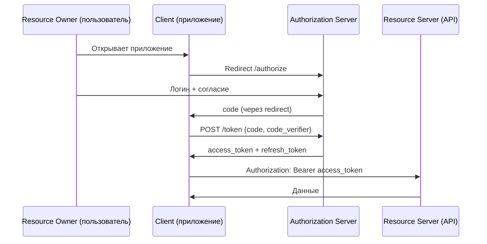
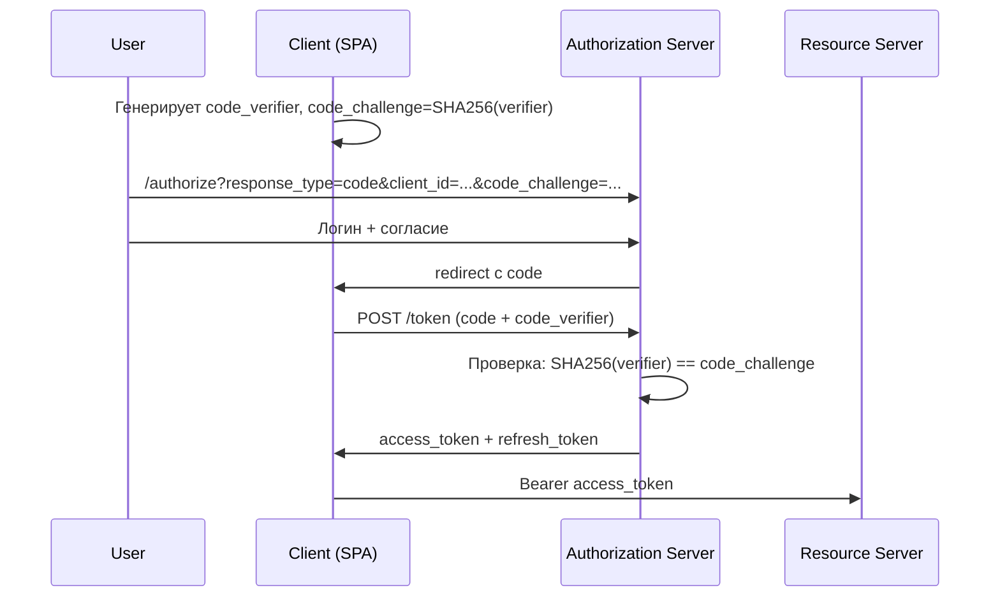
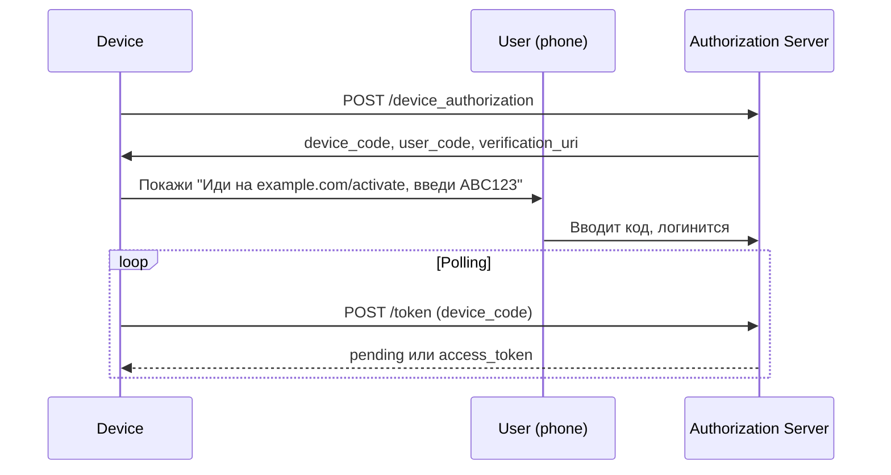

# JWT и OAuth2 / OIDC

`JWT` — формат токена. `OAuth2` — протокол выдачи токенов. `OIDC` — надстройка для аутентификации. Три уровня, которые часто путают.

Этот документ объясняет, как устроен каждый из них, какие flows существуют, какие атаки возможны и как всё собрать на `Spring Security`.

## Полезные ссылки

### Спецификации
- [RFC 6749 — OAuth 2.0](https://datatracker.ietf.org/doc/html/rfc6749)
- [RFC 7519 — JSON Web Token](https://datatracker.ietf.org/doc/html/rfc7519)
- [RFC 7515 — JSON Web Signature](https://datatracker.ietf.org/doc/html/rfc7515)
- [RFC 7636 — PKCE](https://datatracker.ietf.org/doc/html/rfc7636)
- [RFC 8628 — Device Authorization](https://datatracker.ietf.org/doc/html/rfc8628)
- [RFC 9068 — JWT Profile for OAuth2 Access Tokens](https://datatracker.ietf.org/doc/html/rfc9068)
- [OpenID Connect Core 1.0](https://openid.net/specs/openid-connect-core-1_0.html)

### Практика
- [Spring Security: OAuth2 Resource Server](https://docs.spring.io/spring-security/reference/servlet/oauth2/resource-server/index.html)
- [Spring Authorization Server](https://docs.spring.io/spring-authorization-server/reference/)
- [Baeldung: Spring Security JWT](https://www.baeldung.com/spring-security-oauth-jwt)
- [Baeldung: Spring OAuth2](https://www.baeldung.com/spring-security-5-oauth2-login)
- [OAuth 2.0 Security Best Current Practice](https://datatracker.ietf.org/doc/html/draft-ietf-oauth-security-topics)

## Содержание

- [Словарь терминов](#словарь-терминов)
- [JWT: что это](#jwt-что-это)
- [Структура JWT](#структура-jwt)
- [Алгоритмы подписи](#алгоритмы-подписи)
- [Access token vs Refresh token](#access-token-vs-refresh-token)
- [Хранение JWT на клиенте](#хранение-jwt-на-клиенте)
- [Атаки на JWT](#атаки-на-jwt)
- [JWT best practices](#jwt-best-practices)
- [OAuth2: роли](#oauth2-роли)
- [Grant types](#grant-types)
- [Authorization Code + PKCE](#authorization-code--pkce)
- [Client Credentials](#client-credentials)
- [Device Authorization](#device-authorization)
- [Refresh Token Flow](#refresh-token-flow)
- [Устаревшие flows](#устаревшие-flows)
- [OIDC как надстройка](#oidc-как-надстройка)
- [Spring Security Resource Server](#spring-security-resource-server)
- [Spring Authorization Server](#spring-authorization-server)
- [Решение проблем](#решение-проблем)
- [См. также](#см-также)

## Словарь терминов

| Термин | Значение |
|--------|----------|
| `JWT` | JSON Web Token — компактный формат токена с подписью |
| `JWS` | JSON Web Signature — подписанный JWT |
| `JWE` | JSON Web Encryption — зашифрованный JWT |
| `JWK` | JSON Web Key — формат публичного ключа |
| `JWKS` | JWK Set — набор ключей, обычно по URL `/.well-known/jwks.json` |
| `OAuth2` | Протокол делегированной авторизации |
| `OIDC` | OpenID Connect — аутентификация поверх OAuth2 |
| `Authorization Server` | Сервер, который выдаёт токены (часто `IdP`) |
| `Resource Server` | API, который принимает токены и отдаёт данные |
| `Client` | Приложение, которому нужен доступ к данным |
| `Resource Owner` | Пользователь, владелец данных |
| `PKCE` | Proof Key for Code Exchange — защита Authorization Code для публичных клиентов |
| `Scope` | Запрошенные права (`read:profile`, `write:orders`) |
| `Claim` | Поле внутри JWT (`sub`, `exp`, `aud`, ...) |

## JWT: что это

`JWT` (JSON Web Token) — токен в виде трёх `Base64URL`-кодированных частей, разделённых точками.

Пример:

```text
eyJhbGciOiJSUzI1NiIsInR5cCI6IkpXVCIsImtpZCI6ImtleS0xIn0
.eyJzdWIiOiJ1c2VyLTQyIiwiaXNzIjoiaHR0cHM6Ly9hdXRoLmV4YW1wbGUuY29tIiwiYXVkIjoiYXBpIiwiZXhwIjoxNzEyNjgwMDAwfQ
.SFLAGcKW2oJZaNqYZxvLwRhBuQcZOBl-hBqd3Fb6cZQ
```

Главные свойства:

- Самодостаточен — всё нужное внутри токена, сервер не обязан ходить в БД.
- Подпись гарантирует целостность. Если алгоритм асимметричный (`RS256`), приватный ключ знает только Authorization Server.
- Содержимое **читаемо** (не зашифровано, если это не `JWE`). Секреты в `claims` класть нельзя.

## Структура JWT

```text
header.payload.signature
```

### Header

```json
{
  "alg": "RS256",
  "typ": "JWT",
  "kid": "key-1"
}
```

- `alg` — алгоритм подписи.
- `typ` — тип токена (обычно `JWT`, для access — `at+jwt`).
- `kid` — идентификатор ключа, по нему Resource Server выбирает ключ из `JWKS`.

### Payload (claims)

Стандартные `claims` из RFC 7519:

| Claim | Значение |
|-------|----------|
| `iss` | Issuer — кто выдал |
| `sub` | Subject — идентификатор пользователя |
| `aud` | Audience — для кого предназначен |
| `exp` | Expiration time (`epoch seconds`) |
| `nbf` | Not before |
| `iat` | Issued at |
| `jti` | JWT ID (уникальный идентификатор токена) |

Пример payload:

```json
{
  "iss": "https://auth.example.com",
  "sub": "user-42",
  "aud": "api",
  "exp": 1712680000,
  "iat": 1712676400,
  "scope": "read:profile write:orders",
  "roles": ["USER", "MANAGER"]
}
```

### Signature

```text
HMAC/RSA/ECDSA( base64url(header) + "." + base64url(payload), key )
```

Подпись проверяется Resource Server-ом. Если данные изменены — подпись не сходится, токен отбрасывается.

## Алгоритмы подписи

| Алгоритм | Тип | Ключ | Когда использовать |
|----------|-----|------|---------------------|
| `HS256` | HMAC-SHA256 | симметричный секрет | Один сервис — выдаёт и проверяет сам |
| `RS256` | RSA-SHA256 | пара ключей RSA | Отдельный IdP + несколько Resource Server |
| `ES256` | ECDSA-P256 | пара ключей EC | Как `RS256`, короче токены |
| `EdDSA` | Ed25519 | пара EC | Современная замена `ES256` |
| `none` | без подписи | — | **Запрещено** на Resource Server |

Правила:

- Для распределённой системы — асимметричные (`RS256`/`ES256`). Публичный ключ публикуется через `JWKS`.
- Симметричный `HS256` — только если выдаёт и проверяет одна система.
- **Никогда** не принимать токены с `alg: none`.

## Access token vs Refresh token

| Свойство | `access token` | `refresh token` |
|----------|----------------|-----------------|
| TTL | 5–60 минут | часы — недели |
| Что делает | Даёт доступ к API | Обменивается на новый `access token` |
| Куда летит | В заголовке `Authorization: Bearer` на Resource Server | Только на Authorization Server (`/token`) |
| Формат | Обычно JWT | JWT или opaque |
| Отзыв | Сложно (ждём `exp`) | Просто (список отозванных на AS) |
| Хранение на клиенте | Память, короткое время | `HttpOnly` cookie или защищённое хранилище |

Зачем разделять:

- Короткий `access token` уменьшает окно компрометации.
- `refresh token` хранится в безопасном месте и используется редко.
- При краже `access token` — потерпим 15 минут и истечёт. При компрометации `refresh` — отзываем централизованно.

## Хранение JWT на клиенте

| Место | Плюсы | Минусы |
|-------|-------|--------|
| `HttpOnly`, `Secure`, `SameSite=Lax` cookie | Защищено от XSS; браузер сам шлёт | Нужна CSRF-защита для cookie |
| `localStorage` / `sessionStorage` | Просто в коде; нет CSRF | Уязвимо к XSS — скрипт украдёт |
| Память JS | Не достать через XSS после обновления страницы | Теряется при reload |
| Android Keystore / iOS Keychain | Системная защита | Только для мобильных |

Общие правила:

- `refresh token` — **только** в `HttpOnly` cookie или секретном хранилище мобильного.
- `access token` в `localStorage` допустим, если нет критичных операций и нет XSS-рисков.
- Для `SPA` с банковскими операциями — cookie + CSRF-токен предпочтительнее.

## Атаки на JWT

### `alg: none`

Атакующий меняет заголовок на `{"alg":"none"}`, обнуляет подпись — и старые библиотеки принимают токен.

Защита: явно указать допустимые алгоритмы в конфиге, не полагаться на значение из заголовка.

```java
JWTVerifier verifier = JWT.require(Algorithm.RSA256(publicKey, null))
    .withIssuer("https://auth.example.com")
    .build(); // не принимает токены с другими alg
```

### Key confusion (RSA HMAC)

Токен был с `RS256`. Атакующий делает `HS256`, где ключом берёт публичный RSA-ключ сервера. Если библиотека не различает — проходит.

Защита: жёстко фиксировать алгоритм проверки. Не принимать `HS*` там, где ожидается `RS*`/`ES*`.

### Утечка секретного ключа

`HS256` с простым секретом brute-force за часы.

Защита:

- Длинный случайный секрет (минимум 256 бит для `HS256`).
- Хранить ключи в `Vault`/`KMS`, не в `application.yml`.
- Для распределённой системы — асимметричная подпись.

### JWT в URL

Access token попадает в `Referer`, логи прокси, браузерную историю.

Защита: токены — только в заголовках или теле, **не в query параметрах**.

### Слишком долгий TTL

`access token` на неделю украли и год эксплуатируют.

Защита: короткий `access` (минуты) + отзываемый `refresh`.

### Отсутствие проверки `aud` и `iss`

Токен, выпущенный для одного сервиса, может приниматься другим.

Защита: проверять `aud` и `iss` на каждом Resource Server.

## JWT best practices

- Подпись — `RS256` или `ES256` для распределённых систем, `HS256` только для монолита.
- Проверяем всегда: `alg` (из allowlist), `iss`, `aud`, `exp`, `nbf`.
- `access token` — 5–15 минут. `refresh token` — отзываемый.
- Минимум claims. Никаких паролей, карт, `PII`.
- Ключи — в `KMS`/`Vault`, ротация через `kid`.
- `JWKS` endpoint кэшируется Resource Server-ом (5–10 минут).
- Токены передаются по `HTTPS`, не в URL.
- Для logout — чёрный список `jti` или инвалидация `refresh token`.

## OAuth2: роли



| Роль | Кто это | Пример |
|------|---------|--------|
| Resource Owner | Конечный пользователь | Человек, у которого есть аккаунт |
| Client | Приложение, запрашивающее доступ | SPA, mobile, backend |
| Authorization Server | Выдаёт токены | Keycloak, Auth0, Okta |
| Resource Server | API с защищёнными данными | REST-бэкенд |

## Grant types

Актуальные (RFC 6749 + дополнения):

| Grant | Когда использовать |
|-------|---------------------|
| `Authorization Code` + PKCE | SPA, mobile, web-app с backend |
| `Client Credentials` | Сервис-сервис (без пользователя) |
| `Device Authorization` | TV, CLI, IoT (ограниченный ввод) |
| `Refresh Token` | Обновление access token |

Устаревшие:

| Grant | Почему не использовать |
|-------|------------------------|
| `Implicit` | Токен в URL, утечка через `Referer`. Заменён на `Authorization Code + PKCE` |
| `Resource Owner Password` | Клиент видит пароль. Заменён на `Authorization Code` |

## Authorization Code + PKCE

Основной flow для любых публичных клиентов (SPA, mobile).



Шаги:

1. Клиент генерирует `code_verifier` (случайная строка 43–128 символов).
2. Считает `code_challenge = BASE64URL(SHA256(code_verifier))`.
3. Перенаправляет пользователя на `/authorize` с `code_challenge`.
4. AS выдаёт короткоживущий `code` через redirect.
5. Клиент обменивает `code` + `code_verifier` на токены.
6. AS проверяет, что `SHA256(verifier)` сходится с сохранённым `code_challenge`.

Зачем PKCE: перехват `code` в мобильной ОС или через неправильный redirect не даёт атакующему получить токен — у него нет `code_verifier`.

## Client Credentials

Сервис обращается к другому сервису от своего имени.

```bash
curl -X POST https://auth.example.com/oauth2/token \
  -u "service-a:secret" \
  -d "grant_type=client_credentials&scope=orders.read"
```

Использование:

- Backend-сервис читает другой API.
- Cron-задача.
- Интеграция между двумя системами.

Правила:

- `client_secret` хранится в `Vault`/`KMS`, не в репозитории.
- Отдельный `client_id` на каждого потребителя.
- Минимальные `scope` для каждого клиента.

## Device Authorization

Для устройств с ограниченным вводом (TV, консоль).



## Refresh Token Flow

```bash
curl -X POST https://auth.example.com/oauth2/token \
  -u "client-id:client-secret" \
  -d "grant_type=refresh_token&refresh_token=$REFRESH"
```

Правила безопасности:

- Rotation: каждый обмен выдаёт **новый** refresh, старый инвалидируется.
- Reuse detection: если старый refresh применяется второй раз — отзываем всю цепочку (вероятно, кража).
- Хранение только на стороне клиента, никогда не в URL.

## Устаревшие flows

### Implicit (не использовать)

Access token возвращался напрямую в fragment URL: `#access_token=...`. Проблемы: утечка через `Referer`, браузерные плагины, нет refresh.

Замена — Authorization Code + PKCE.

### Resource Owner Password (не использовать)

Клиент получает логин/пароль пользователя и шлёт их на `/token`. Разрушает весь смысл OAuth2 (зачем IdP, если клиент видит пароль). Замена — Authorization Code.

## OIDC как надстройка

`OAuth2` — про авторизацию (доступ). `OIDC` — про аутентификацию (кто пользователь).

OIDC добавляет к OAuth2:

- `id_token` — JWT с информацией о пользователе.
- Scope `openid` — обязателен для OIDC.
- Scopes `profile`, `email` — стандартизированные.
- `UserInfo endpoint` — дополнительные данные.
- `/.well-known/openid-configuration` — discovery.

Пример `id_token` payload:

```json
{
  "iss": "https://auth.example.com",
  "sub": "user-42",
  "aud": "client-spa",
  "exp": 1712680000,
  "iat": 1712676400,
  "email": "alice@example.com",
  "email_verified": true,
  "name": "Alice",
  "nonce": "random-123"
}
```

Разница:

| Токен | Зачем | Для кого |
|-------|-------|----------|
| `access_token` | Доступ к API | Resource Server |
| `id_token` | Идентификация пользователя | Клиент |
| `refresh_token` | Продление `access_token` | Authorization Server |

## Spring Security Resource Server

Минимальная конфигурация для проверки JWT от внешнего IdP.

### `application.yml`

```yaml
spring:
  security:
    oauth2:
      resourceserver:
        jwt:
          issuer-uri: https://auth.example.com
          # Spring сам подтянет /.well-known/openid-configuration и JWKS
```

### Security config

```java
@Configuration
@EnableWebSecurity
@EnableMethodSecurity
public class SecurityConfig {

    @Bean
    public SecurityFilterChain filterChain(HttpSecurity http) throws Exception {
        http
            .authorizeHttpRequests(auth -> auth
                .requestMatchers("/actuator/health").permitAll()
                .requestMatchers("/admin/**").hasRole("ADMIN")
                .anyRequest().authenticated()
            )
            .oauth2ResourceServer(oauth2 -> oauth2
                .jwt(jwt -> jwt.jwtAuthenticationConverter(jwtAuthConverter()))
            )
            .csrf(CsrfConfigurer::disable) // API без cookie
            .sessionManagement(s -> s.sessionCreationPolicy(STATELESS));
        return http.build();
    }

    @Bean
    public JwtAuthenticationConverter jwtAuthConverter() {
        JwtGrantedAuthoritiesConverter grants = new JwtGrantedAuthoritiesConverter();
        grants.setAuthoritiesClaimName("roles");
        grants.setAuthorityPrefix("ROLE_");

        JwtAuthenticationConverter conv = new JwtAuthenticationConverter();
        conv.setJwtGrantedAuthoritiesConverter(grants);
        conv.setPrincipalClaimName("sub");
        return conv;
    }
}
```

### Контроллер

```java
@RestController
@RequestMapping("/api")
public class ProfileController {

    @GetMapping("/me")
    public Map<String, Object> me(@AuthenticationPrincipal Jwt jwt) {
        return Map.of(
            "userId", jwt.getSubject(),
            "email", jwt.getClaimAsString("email"),
            "roles", jwt.getClaimAsStringList("roles")
        );
    }

    @PreAuthorize("hasRole('MANAGER')")
    @GetMapping("/reports")
    public List<Report> reports() {
        return reportService.all();
    }
}
```

### Кастомный валидатор

Нужно проверять не только `exp`/`iss`, но и `aud`:

```java
@Bean
public JwtDecoder jwtDecoder(OAuth2ResourceServerProperties props) {
    NimbusJwtDecoder decoder = NimbusJwtDecoder
        .withJwkSetUri(props.getJwt().getJwkSetUri())
        .build();
    OAuth2TokenValidator<Jwt> validator = new DelegatingOAuth2TokenValidator<>(
        JwtValidators.createDefaultWithIssuer(props.getJwt().getIssuerUri()),
        new JwtAudienceValidator("api.example.com")
    );
    decoder.setJwtValidator(validator);
    return decoder;
}
```

## Spring Authorization Server

Если нужен свой IdP — `spring-authorization-server`.

### Минимальный клиент в памяти

```java
@Bean
public RegisteredClientRepository clients() {
    RegisteredClient client = RegisteredClient.withId(UUID.randomUUID().toString())
        .clientId("web-app")
        .clientSecret("{bcrypt}$2a$10$...")
        .clientAuthenticationMethod(CLIENT_SECRET_BASIC)
        .authorizationGrantType(AUTHORIZATION_CODE)
        .authorizationGrantType(REFRESH_TOKEN)
        .redirectUri("https://app.example.com/callback")
        .scope(OidcScopes.OPENID)
        .scope("orders.read")
        .clientSettings(ClientSettings.builder()
            .requireProofKey(true) // PKCE обязателен
            .requireAuthorizationConsent(true)
            .build())
        .tokenSettings(TokenSettings.builder()
            .accessTokenTimeToLive(Duration.ofMinutes(15))
            .refreshTokenTimeToLive(Duration.ofDays(30))
            .reuseRefreshTokens(false) // rotation
            .build())
        .build();
    return new InMemoryRegisteredClientRepository(client);
}
```

### Ключи для подписи

```java
@Bean
public JWKSource<SecurityContext> jwkSource() {
    KeyPair keyPair = generateRsaKey();
    RSAKey rsa = new RSAKey.Builder((RSAPublicKey) keyPair.getPublic())
        .privateKey((RSAPrivateKey) keyPair.getPrivate())
        .keyID(UUID.randomUUID().toString())
        .build();
    return new ImmutableJWKSet<>(new JWKSet(rsa));
}
```

В проде: ключи из `Vault`/`KMS`, не генерируются при старте.

### Конфиг security chain

```java
@Bean
@Order(1)
public SecurityFilterChain authServerChain(HttpSecurity http) throws Exception {
    OAuth2AuthorizationServerConfiguration.applyDefaultSecurity(http);
    http.getConfigurer(OAuth2AuthorizationServerConfigurer.class)
        .oidc(Customizer.withDefaults());
    http.exceptionHandling(e -> e
        .defaultAuthenticationEntryPointFor(
            new LoginUrlAuthenticationEntryPoint("/login"),
            new MediaTypeRequestMatcher(MediaType.TEXT_HTML)));
    return http.build();
}
```

## Решение проблем

| Симптом | Причина | Решение |
|---------|---------|---------|
| `401 invalid_token` на Resource Server | Не совпадает `issuer` или `audience` | Проверить `issuer-uri` и `aud`-валидатор |
| `JWKS` недоступен | Firewall блокирует AS | Кэшировать JWKS локально + разрешить egress |
| Токен принимается без подписи | Уязвимая библиотека принимает `alg: none` | Обновить библиотеку, жёстко фиксировать `alg` |
| Refresh второй раз не работает | Rotation + reuse detection | Нормальная работа — старый отозван |
| `invalid_grant` при обмене кода | `code` использован, срок истёк, неверный `redirect_uri` | Проверить соответствие redirect, время жизни кода |
| `CORS` ошибка на `/token` | Не добавлен origin SPA | Настроить CORS на Authorization Server |
| Клиент видит чужие данные | Resource Server не проверяет `sub` из токена | Добавить проверку владельца в сервисе |
| PKCE требуется, но нет у клиента | Client настроен с `requireProofKey=true` | Включить PKCE на клиенте или отключить на AS |

## См. также

- [[application-security|Application Security]] — основы аутентификации и авторизации
- [[api-security|API Security]] — защита API с токенами
- [[owasp-top-10|OWASP Top 10]] — контекст уязвимостей (A02, A07)
- [[web-security|Web Security]] — CSRF и cookie для сессий
- [[secrets-management|Secrets Management]] — хранение ключей подписи
- [[spring-security|Spring Security]] — настройка фреймворка
- [[spring-security-interview|Spring Security для собеседований]]
- [[jwt-interview|JWT на собеседовании]]
- [[oauth2-interview|OAuth2 на собеседовании]]
- [[tls-ssl|TLS/SSL]] — транспортная защита
