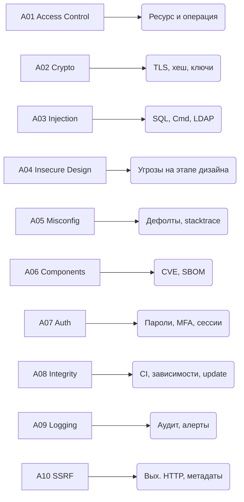

# OWASP Top 10 (2021) — разбор категорий

`OWASP Top 10` — главный ориентир для ревью веб-приложений. Каждая позиция — класс уязвимостей, а не одна конкретная атака. Этот документ даёт короткое определение, пример уязвимого и безопасного кода на Java/Spring и чек-лист по защите.

Актуальная редакция — **2021**. В ней уплотнены старые категории, добавлены новые: `Insecure Design`, `Software and Data Integrity Failures`, `SSRF`.

## Полезные ссылки

### Официальные источники
- [OWASP Top 10 (2021)](https://owasp.org/Top10/) — актуальная версия
- [OWASP Cheat Sheet Series](https://cheatsheetseries.owasp.org/) — практические рекомендации
- [OWASP ASVS](https://owasp.org/www-project-application-security-verification-standard/) — стандарт верификации
- [CWE / SANS Top 25](https://cwe.mitre.org/top25/) — смежный список критичных CWE

### Спецификации и ресурсы
- [Spring Security Reference](https://docs.spring.io/spring-security/reference/)
- [Baeldung: OWASP Top 10](https://www.baeldung.com/spring-security-owasp)
- [OWASP API Security Top 10](https://owasp.org/API-Security/)

## Содержание

- [Как читать список](#как-читать-список)
- [A01 Broken Access Control](#a01-broken-access-control)
  - [Уязвимый код](#уязвимый-код)
  - [Безопасный код](#безопасный-код)
  - [Как защищаться](#как-защищаться)
  - [Чек-лист A01](#чек-лист-a01)
- [A02 Cryptographic Failures](#a02-cryptographic-failures)
  - [Уязвимый код](#уязвимый-код-1)
  - [Безопасный код](#безопасный-код-1)
  - [Как защищаться](#как-защищаться-1)
  - [Чек-лист A02](#чек-лист-a02)
- [A03 Injection](#a03-injection)
  - [Уязвимый код](#уязвимый-код-2)
  - [Безопасный код](#безопасный-код-2)
  - [Как защищаться](#как-защищаться-2)
  - [Чек-лист A03](#чек-лист-a03)
- [A04 Insecure Design](#a04-insecure-design)
  - [Уязвимый дизайн](#уязвимый-дизайн)
  - [Безопасный дизайн](#безопасный-дизайн)
  - [Как защищаться](#как-защищаться-3)
  - [Чек-лист A04](#чек-лист-a04)
- [A05 Security Misconfiguration](#a05-security-misconfiguration)
  - [Уязвимая конфигурация](#уязвимая-конфигурация)
  - [Безопасная конфигурация](#безопасная-конфигурация)
  - [Как защищаться](#как-защищаться-4)
  - [Чек-лист A05](#чек-лист-a05)
- [A06 Vulnerable and Outdated Components](#a06-vulnerable-and-outdated-components)
  - [Уязвимость в действии](#уязвимость-в-действии)
  - [Защита через автоматическое сканирование](#защита-через-автоматическое-сканирование)
  - [Как защищаться](#как-защищаться-5)
  - [Чек-лист A06](#чек-лист-a06)
- [A07 Identification and Authentication Failures](#a07-identification-and-authentication-failures)
  - [Уязвимый код](#уязвимый-код-3)
  - [Безопасный код](#безопасный-код-3)
  - [Как защищаться](#как-защищаться-6)
  - [Чек-лист A07](#чек-лист-a07)
- [A08 Software and Data Integrity Failures](#a08-software-and-data-integrity-failures)
  - [Опасно](#опасно)
  - [Безопасно](#безопасно)
  - [Как защищаться](#как-защищаться-7)
  - [Чек-лист A08](#чек-лист-a08)
- [A09 Security Logging and Monitoring Failures](#a09-security-logging-and-monitoring-failures)
  - [Минимум событий для лога](#минимум-событий-для-лога)
  - [Пример](#пример)
  - [Как защищаться](#как-защищаться-8)
  - [Чек-лист A09](#чек-лист-a09)
- [A10 Server-Side Request Forgery (SSRF)](#a10-server-side-request-forgery-ssrf)
  - [Уязвимый код](#уязвимый-код-4)
  - [Безопасный код](#безопасный-код-4)
  - [Как защищаться](#как-защищаться-9)
  - [Чек-лист A10](#чек-лист-a10)
- [Сводный чек-лист OWASP Top 10](#сводный-чек-лист-owasp-top-10)
- [См. также](#см-также)

## Как читать список

- Категория = класс ошибок, а не единичный баг.
- Позиция в списке отражает частоту и серьёзность по данным OWASP.
- Одну уязвимость часто можно отнести к нескольким категориям — берите любую подходящую.
- Для прод-ревью достаточно: пройтись по 10 пунктам и для каждого указать контроль либо осознанный отказ.

Карта категорий:



## A01 Broken Access Control

**Суть.** Сервер не проверяет, имеет ли пользователь право на конкретный ресурс или действие. Атакующий меняет `id` в URL, вызывает запрещённый метод, повышает привилегии.

Типовые проявления:

- `IDOR` — чтение/запись чужого объекта по `id`.
- Обход ролей — админский эндпоинт доступен обычному пользователю.
- Force browsing — доступ к скрытой странице по прямому URL.
- Манипуляция с `userId`/`role` в теле запроса или токене.

### Уязвимый код

```java
@RestController
public class OrderController {
    @GetMapping("/orders/{orderId}")
    public OrderDto get(@PathVariable long orderId) {
        // Нет проверки владельца — любой залогиненный увидит чужой заказ
        return orderRepository.findById(orderId).orElseThrow();
    }
}
```

### Безопасный код

```java
@RestController
public class OrderController {
    @GetMapping("/orders/{orderId}")
    @PreAuthorize("@orderAccess.isOwner(#orderId, authentication)")
    public OrderDto get(@PathVariable long orderId) {
        return orderRepository.findById(orderId).orElseThrow();
    }
}

@Component
public class OrderAccess {
    public boolean isOwner(long orderId, Authentication auth) {
        String userId = auth.getName();
        return orderRepository.existsByIdAndOwnerId(orderId, userId);
    }
}
```

### Как защищаться

- **Deny by default** — любой маршрут требует явного правила доступа.
- Проверять владение ресурсом (`ownerId == principal`) на сервере, не в UI.
- Использовать `@PreAuthorize` / `@PostAuthorize` в Spring Security.
- Для мультитенантных систем фильтровать по `tenantId` из токена, не из запроса.
- Централизовать правила доступа (один `PolicyService`), не размазывать по контроллерам.

### Чек-лист A01

- [ ] Все защищённые эндпоинты имеют явные правила авторизации.
- [ ] Проверяется владелец каждого объекта с `id` в пути.
- [ ] `tenantId`/`userId` берутся из токена, не из тела запроса.
- [ ] Негативные тесты: запрос к чужому `id` `403`/`404`.
- [ ] Админ-эндпоинты защищены отдельной ролью и `IP`-фильтром.

## A02 Cryptographic Failures

**Суть.** Чувствительные данные не защищены: передаются в открытом виде, шифруются слабыми алгоритмами, хранятся без соли, ключи утекают в репозиторий.

Типичные ошибки:

- `HTTP` вместо `HTTPS` на критичных путях.
- `MD5`/`SHA1` для паролей или хеширования данных.
- Свой велосипед вместо `bcrypt`/`Argon2`.
- Ключи шифрования в коде или в `application.yml`, закоммиченном в `Git`.
- `ECB` режим блочного шифра — утечка структуры данных.

### Уязвимый код

```java
public String hashPassword(String raw) {
    MessageDigest md = MessageDigest.getInstance("MD5");
    return Base64.getEncoder().encodeToString(md.digest(raw.getBytes()));
}
```

### Безопасный код

```java
@Bean
public PasswordEncoder passwordEncoder() {
    // BCryptPasswordEncoder включает соль и настраиваемую стоимость
    return new BCryptPasswordEncoder(12);
}

public String hashPassword(String raw, PasswordEncoder encoder) {
    return encoder.encode(raw);
}
```

Шифрование данных с `AES-GCM`:

```java
public byte[] encrypt(byte[] plaintext, SecretKey key) throws Exception {
    byte[] iv = new byte[12];
    SecureRandom.getInstanceStrong().nextBytes(iv);

    Cipher cipher = Cipher.getInstance("AES/GCM/NoPadding");
    cipher.init(Cipher.ENCRYPT_MODE, key, new GCMParameterSpec(128, iv));
    byte[] ciphertext = cipher.doFinal(plaintext);

    ByteBuffer buf = ByteBuffer.allocate(iv.length + ciphertext.length);
    buf.put(iv).put(ciphertext);
    return buf.array();
}
```

### Как защищаться

- Пароли — только `bcrypt`, `scrypt` или `Argon2` с разумной стоимостью.
- Симметричное шифрование — `AES-GCM` или `ChaCha20-Poly1305`, не `ECB`.
- `TLS` на всех соединениях. Старые протоколы (`SSLv3`, `TLS 1.0/1.1`) выключить.
- Ключи — в `KMS`/`Vault`, не в коде. Ротация ключей.
- Критичные данные (`PII`, карты) — зашифровать на уровне поля (`envelope encryption`).

### Чек-лист A02

- [ ] Пароли хешируются `bcrypt`/`Argon2`, стоимость под нагрузку настроена.
- [ ] `TLS 1.2+`, современные cipher suites, `HSTS`.
- [ ] Никаких ключей и секретов в `Git`. Проверено `gitleaks`/`trufflehog`.
- [ ] Поля `PII` зашифрованы на уровне БД или приложения.
- [ ] Реализован план ротации ключей.

## A03 Injection

**Суть.** Непроверенный ввод попадает в интерпретатор: `SQL`, `OS shell`, `LDAP`, `XPath`, `NoSQL`, шаблонизаторы. Классика — `SQL Injection`. Сюда же включён `XSS` (инъекция `HTML`/`JS` в вывод).

### Уязвимый код

```java
// SQL Injection через конкатенацию строк
public List<User> findByName(String name) {
    String sql = "SELECT * FROM users WHERE name = '" + name + "'";
    return jdbcTemplate.query(sql, userRowMapper);
}

// Command Injection через Runtime.exec
public void convert(String filename) throws IOException {
    Runtime.getRuntime().exec("convert " + filename + " out.pdf");
}
```

### Безопасный код

```java
// Параметризованный запрос
public List<User> findByName(String name) {
    return jdbcTemplate.query(
        "SELECT * FROM users WHERE name = ?",
        userRowMapper,
        name
    );
}

// Процесс с аргументами массивом, без shell
public void convert(Path filename, Path out) throws IOException {
    new ProcessBuilder("convert", filename.toString(), out.toString())
        .redirectErrorStream(true)
        .start();
}
```

`JPA`-вариант:

```java
@Query("SELECT u FROM User u WHERE u.name = :name")
List<User> findByName(@Param("name") String name);
```

### Как защищаться

- Только параметризованные запросы. Конкатенация строк в `SQL` запрещена.
- Для динамических полей (сортировка, фильтры) — белый список.
- `ORM`: `:named`-параметры; не подставлять имена таблиц/полей из ввода.
- `HTML`-вывод — экранировать (`Thymeleaf th:text`, `React {}`).
- `OS`-команды — через `ProcessBuilder` с массивом аргументов, без shell.
- `LDAP` — `javax.naming` с экранированием или фреймворк (`Spring LDAP`).

### Чек-лист A03

- [ ] Все `SQL`/`HQL`/`JPQL` — параметризованные.
- [ ] Сортировка и фильтрация — по белому списку полей.
- [ ] Шаблонизатор выводит данные с автоэкранированием.
- [ ] `OS`-команды — через `ProcessBuilder`, не через `sh -c`.
- [ ] SAST-сканер в CI проверяет инъекции.

## A04 Insecure Design

**Суть.** Не баг в коде, а пробел в самом проектировании: не заложены ограничения, нет моделирования угроз, отсутствуют бизнес-лимиты. Исправить патчем нельзя — нужна переделка архитектуры.

Типовые проявления:

- Нет `rate limiting` на логин — подбор возможен при любом коде.
- Бизнес-лимит (сумма перевода) проверяется только на UI.
- Восстановление пароля — по одному полю (email или номер телефона) без второго фактора.
- Нет `threat model` для критичных флоу.

### Уязвимый дизайн

Контроллер перевода денег без лимитов и идемпотентности:

```java
@PostMapping("/transfer")
public TransferResult transfer(@RequestBody TransferRequest req) {
    accountService.debit(req.from(), req.amount());
    accountService.credit(req.to(), req.amount());
    return new TransferResult("OK");
}
```

### Безопасный дизайн

```java
@PostMapping("/transfer")
public TransferResult transfer(
    @RequestHeader("Idempotency-Key") String idempotencyKey,
    @RequestBody @Valid TransferRequest req,
    Authentication auth
) {
    transferLimitPolicy.check(auth.getName(), req.amount()); // дневной лимит
    return transferService.executeIdempotent(idempotencyKey, req, auth.getName());
}
```

### Как защищаться

- Проводить **threat modeling** (`STRIDE`, `PASTA`) для новых критичных флоу.
- Закладывать **бизнес-лимиты** и **rate limiting** на этапе проектирования.
- Для денежных операций — `Idempotency-Key`, двойное подтверждение.
- Разделение ответственности: оплата и подтверждение — разные сервисы/роли.
- Использовать проверенные паттерны (`OAuth2`, `OIDC`, `SAML`), а не велосипеды.

### Чек-лист A04

- [ ] Для фичи есть threat model / Misuse cases.
- [ ] Бизнес-лимиты на количество/сумму операций.
- [ ] `rate limiting` на логин, `OTP`, `password reset`.
- [ ] Идемпотентность для опасных действий.
- [ ] Разделены роли «совершить» и «подтвердить» для критичных операций.

## A05 Security Misconfiguration

**Суть.** Дефолтные пароли, включённый `debug`, открытые административные панели, стектрейсы в ответах, разрешающие `CORS`-настройки. Часто — забытая настройка на `dev`, уехавшая в `prod`.

### Уязвимая конфигурация

```yaml
# application.yml
management:
  endpoints:
    web:
      exposure:
        include: "*"   # Открывает все actuator-эндпоинты, включая /env, /heapdump
server:
  error:
    include-stacktrace: always  # Stacktrace уходит клиенту
spring:
  security:
    user:
      password: admin  # Дефолтный пароль
```

### Безопасная конфигурация

```yaml
management:
  endpoints:
    web:
      exposure:
        include: health,info,prometheus
  endpoint:
    health:
      show-details: when-authorized
server:
  error:
    include-stacktrace: never
    include-message: never
```

Ограничение CORS:

```java
@Bean
CorsConfigurationSource corsConfigurationSource() {
    CorsConfiguration config = new CorsConfiguration();
    config.setAllowedOrigins(List.of("https://app.example.com"));
    config.setAllowedMethods(List.of("GET", "POST"));
    config.setAllowCredentials(true);
    UrlBasedCorsConfigurationSource src = new UrlBasedCorsConfigurationSource();
    src.registerCorsConfiguration("/**", config);
    return src;
}
```

### Как защищаться

- Отдельные профили `dev`/`stage`/`prod`. В `prod` — минимум включённых фич.
- Actuator — только `health`, `info`, `prometheus`. Остальное — за авторизацией.
- Стектрейсы не уходят клиенту. Error-page без деталей.
- `CORS` — только доверенные `origin`. `*` с `credentials` — запрещено.
- Security headers: `X-Frame-Options`, `X-Content-Type-Options`, `Referrer-Policy`, `CSP`.
- Periodic config review: `CIS Benchmark`, `SSL Labs`, `Mozilla Observatory`.

### Чек-лист A05

- [ ] Нет дефолтных паролей и учёток.
- [ ] `debug`/`auto-config`/`developer-mode` выключены в `prod`.
- [ ] Actuator и admin-эндпоинты защищены.
- [ ] `CORS` ограничен нужными доменами.
- [ ] Security headers настроены на reverse-proxy или приложении.

## A06 Vulnerable and Outdated Components

**Суть.** Используются библиотеки с известными `CVE`. `Log4Shell` — классический пример: одна строка в популярной библиотеке дала `RCE` в сотнях тысяч систем.

### Уязвимость в действии

```groovy
// build.gradle — старая версия с CVE
dependencies {
    implementation 'org.apache.logging.log4j:log4j-core:2.14.0' // Log4Shell CVE-2021-44228
}
```

### Защита через автоматическое сканирование

```groovy
plugins {
    id 'org.owasp.dependencycheck' version '9.0.9'
}

dependencyCheck {
    failBuildOnCVSS = 7.0
    suppressionFile = 'dependency-check-suppressions.xml'
}
```

### Как защищаться

- `SCA`-сканер в CI: `Dependency-Check`, `Snyk`, `Trivy`, `Grype`.
- Ежедневный прогон против актуальных `NVD`/`OSV` баз.
- Автоматическое обновление зависимостей: `Dependabot`, `Renovate`.
- Белый список зависимостей: нет лишних транзитивных.
- `SBOM` (`CycloneDX`/`SPDX`) для продакшн-артефактов.
- Патч-процесс: SLA на критичные `CVE` (например, 7 дней).

### Чек-лист A06

- [ ] SCA-сканер работает в CI и падает на `CVSS >= 7`.
- [ ] Публикуется `SBOM` для каждого релиза.
- [ ] Dependabot/Renovate открывают PR на обновления.
- [ ] Есть процесс быстрого патчинга критичных CVE.
- [ ] JVM, JDK, контейнерный базовый образ обновляются регулярно.

## A07 Identification and Authentication Failures

**Суть.** Слабая аутентификация: подбор паролей, угон сессии, предсказуемые `id` сессий, отсутствие `MFA`, небезопасный `password reset`.

### Уязвимый код

```java
@PostMapping("/login")
public TokenDto login(@RequestBody LoginRequest req) {
    User user = userRepo.findByEmail(req.email()).orElseThrow();
    if (!user.getPassword().equals(req.password())) { // plain comparison
        throw new BadCredentials();
    }
    return tokenService.issue(user); // без rate limiting, без MFA
}
```

### Безопасный код

```java
@PostMapping("/login")
public TokenDto login(@RequestBody @Valid LoginRequest req, HttpServletRequest http) {
    loginRateLimiter.check(req.email(), http.getRemoteAddr());
    User user = userRepo.findByEmail(req.email())
        .orElseThrow(() -> new BadCredentials()); // единое сообщение
    if (!passwordEncoder.matches(req.password(), user.getPasswordHash())) {
        loginAttemptRecorder.recordFailure(user.getId());
        throw new BadCredentials();
    }
    if (user.isMfaEnabled()) {
        return tokenService.issueMfaChallenge(user);
    }
    return tokenService.issue(user);
}
```

### Как защищаться

- Пароли — `bcrypt`/`Argon2`, проверка через `PasswordEncoder.matches`.
- `Rate limiting` + временная блокировка аккаунта.
- `MFA` для админов и чувствительных действий.
- Сообщения об ошибках — одинаковые, чтобы не утекало «такой логин есть».
- `Session fixation`: регенерация session id после логина.
- Безопасный `password reset`: одноразовый токен с коротким `TTL`, одноразовое использование.
- Хранить хеш ранее использованных паролей — блокировать повтор.

### Чек-лист A07

- [ ] Пароли хешируются, `plain compare` исключён.
- [ ] `Rate limiting` на `/login`, `/otp`, `/password-reset`.
- [ ] `MFA` доступен и обязателен для админов.
- [ ] `access token` короткоживущий, `refresh token` отзываемый.
- [ ] Session fixation защищён (регенерация id).

## A08 Software and Data Integrity Failures

**Суть.** Код, данные или обновления принимаются без проверки целостности: библиотеки из неподписанных репозиториев, небезопасная десериализация, отсутствие подписи артефактов, `auto-update` без верификации.

Вектор атаки: злоумышленник подменяет артефакт в CI или внешнем репозитории (типа `npm`), и код выполняется в проде.

### Опасно

```java
// Небезопасная Java-десериализация: RCE через gadget chain
try (ObjectInputStream ois = new ObjectInputStream(request.getInputStream())) {
    Object obj = ois.readObject();
}
```

### Безопасно

```java
// JSON с Jackson + строгая схема
ObjectMapper mapper = new ObjectMapper()
    .disable(FAIL_ON_UNKNOWN_PROPERTIES)
    .activateDefaultTyping(
        BasicPolymorphicTypeValidator.builder()
            .allowIfSubType(PaymentEvent.class)
            .build(),
        DefaultTyping.NON_FINAL
    );
PaymentEvent event = mapper.readValue(request.getInputStream(), PaymentEvent.class);
```

### Как защищаться

- `Java`-сериализация — не использовать. Только `JSON`/`Protobuf` с явной схемой.
- Подпись артефактов: `cosign`/`Sigstore` для контейнеров, `GPG` для jar.
- Проверка `hash`/`checksum` загружаемых файлов.
- `CI/CD` — только доверенные runner-ы, секреты через защищённые переменные.
- Зависимости — из корпоративного прокси (`Nexus`, `Artifactory`), не напрямую.
- Валидация входного `JSON` по `JSON Schema`/`OpenAPI`.

### Чек-лист A08

- [ ] Нет `ObjectInputStream.readObject` на недоверенных данных.
- [ ] Артефакты подписываются и проверяются в pipeline.
- [ ] Зависимости идут через проксирующий репозиторий с аудитом.
- [ ] `JSON` валидируется по схеме.
- [ ] Секреты CI защищены, доступ к ним ограничен.

## A09 Security Logging and Monitoring Failures

**Суть.** Инцидент не обнаруживается. Логов нет или они недостаточны, нет алертов, нет корреляции по `traceId`. Среднее время обнаружения взлома — месяцы.

### Минимум событий для лога

- Успешные и неуспешные логины (с `userId`, `ip`, `user-agent`).
- Изменения прав доступа, выдача ролей.
- Критичные бизнес-события (перевод, смена почты/пароля).
- Ошибки авторизации (`403`), исключения безопасности.
- Срабатывания `rate limiting`.

### Пример

```java
@Slf4j
@Component
public class SecurityAuditLogger {
    public void loginSuccess(String userId, String ip) {
        log.info("audit.login.success userId={} ip={}", userId, ip);
    }
    public void loginFailed(String email, String ip, String reason) {
        log.warn("audit.login.failed emailHash={} ip={} reason={}",
            hash(email), ip, reason); // не логируем email в открытом виде
    }
    public void accessDenied(String userId, String resource) {
        log.warn("audit.access.denied userId={} resource={}", userId, resource);
    }
}
```

### Как защищаться

- Единый формат логов (`JSON`), обязательные поля: `ts`, `level`, `service`, `traceId`, `userId`.
- Централизованный сбор: `ELK`/`Loki`/`Splunk`, retention от 90 дней.
- Алерты: рост `401`/`403`, много неуспешных логинов, изменения ролей.
- Не логировать: пароли, токены, `CVV`, `PII` без маскирования.
- Инцидент-плейбуки: кто что делает при detection.

### Чек-лист A09

- [ ] Логируются успех/ошибки аутентификации и авторизации.
- [ ] Логи централизованы, retention настроен.
- [ ] Алерты на подозрительные паттерны.
- [ ] Чувствительные данные маскируются.
- [ ] Есть runbook реакции на инциденты.

## A10 Server-Side Request Forgery (SSRF)

**Суть.** Сервер делает исходящий `HTTP` по URL от пользователя. Атакующий заставляет сервер обратиться к внутренним ресурсам: `169.254.169.254` (облачные метаданные), `localhost`, внутренняя сеть. Получает токены, данные, доступ.

### Уязвимый код

```java
@PostMapping("/import")
public String importFromUrl(@RequestParam String url) throws IOException {
    HttpURLConnection conn = (HttpURLConnection) new URL(url).openConnection();
    try (InputStream in = conn.getInputStream()) {
        return new String(in.readAllBytes(), StandardCharsets.UTF_8);
    }
}
```

Что можно подсунуть:

- `http://169.254.169.254/latest/meta-data/iam/security-credentials/` — AWS метаданные.
- `http://localhost:8500/v1/kv/...` — локальный Consul.
- `http://internal-admin.corp/` — внутренний сервис.
- `file:///etc/passwd` — локальный файл (если схемы не фильтруются).

### Безопасный код

```java
private static final Set<String> ALLOWED_HOSTS = Set.of(
    "api.partner-a.com", "files.partner-b.com"
);

@PostMapping("/import")
public String importFromUrl(@RequestParam String url) throws IOException {
    URI uri = URI.create(url);
    if (!"https".equals(uri.getScheme())) {
        throw new BadRequestException("only https");
    }
    if (!ALLOWED_HOSTS.contains(uri.getHost())) {
        throw new BadRequestException("host not allowed");
    }
    // Проверка IP: отклоняем private/loopback/link-local
    InetAddress addr = InetAddress.getByName(uri.getHost());
    if (addr.isLoopbackAddress() || addr.isSiteLocalAddress()
            || addr.isLinkLocalAddress() || addr.isAnyLocalAddress()) {
        throw new BadRequestException("internal host blocked");
    }
    // ... делаем запрос
}
```

### Как защищаться

- Белый список `hostname`/`domain` для исходящих запросов.
- Разрешённые схемы: только `https`. `file`, `gopher`, `dict` — запрещены.
- Проверка резолвнутого `IP`: отклонять `private`, `loopback`, `link-local`, `169.254.169.254`.
- Таймауты и лимиты на размер ответа.
- Сетевые правила: egress через отдельную подсеть, метаданные облака блокированы на уровне `VPC`/`IMDSv2`.
- Отключить следование редиректам или проверять каждый `hop`.

### Чек-лист A10

- [ ] Белый список разрешённых хостов/доменов.
- [ ] Запрещены схемы кроме `https`.
- [ ] Блокировка приватных и метаданных IP.
- [ ] Таймауты на исходящие запросы.
- [ ] `IMDSv2` включён на облачных VM.

## Сводный чек-лист OWASP Top 10

| Категория | Ключевой контроль |
|-----------|-------------------|
| A01 Access Control | `@PreAuthorize`, проверка владельца, deny by default |
| A02 Crypto | `bcrypt`, `AES-GCM`, `TLS 1.2+`, секреты в `Vault` |
| A03 Injection | Параметризованные запросы, белые списки, экранирование |
| A04 Insecure Design | Threat modeling, бизнес-лимиты, rate limiting |
| A05 Misconfig | Прод-профили, actuator за auth, security headers |
| A06 Components | `SCA` в CI, `SBOM`, автообновления |
| A07 Auth | `bcrypt`, `MFA`, rate limiting, session fixation |
| A08 Integrity | Нет Java-сериализации, подписи артефактов, `JSON Schema` |
| A09 Logging | Аудит событий, централизованные логи, алерты |
| A10 SSRF | Whitelist хостов, блок внутренних IP, `https` only |

## См. также

- [[application-security|Application Security]] — аутентификация и авторизация
- [[web-security|Web Security]] — XSS, CSRF, CSP в деталях
- [[api-security|API Security]] — защита REST/GraphQL
- [[jwt-oauth2|JWT и OAuth2]] — токены и делегированная авторизация
- [[secrets-management|Secrets Management]] — Vault, KMS, ротация ключей
- [[data-security|Data Security]] — шифрование и хеширование
- [[security-testing|Security Testing]] — SAST, DAST, пентест
- [[spring-security|Spring Security]] — фреймворк в Java
- [[spring-security-interview|Spring Security для собеседований]]
