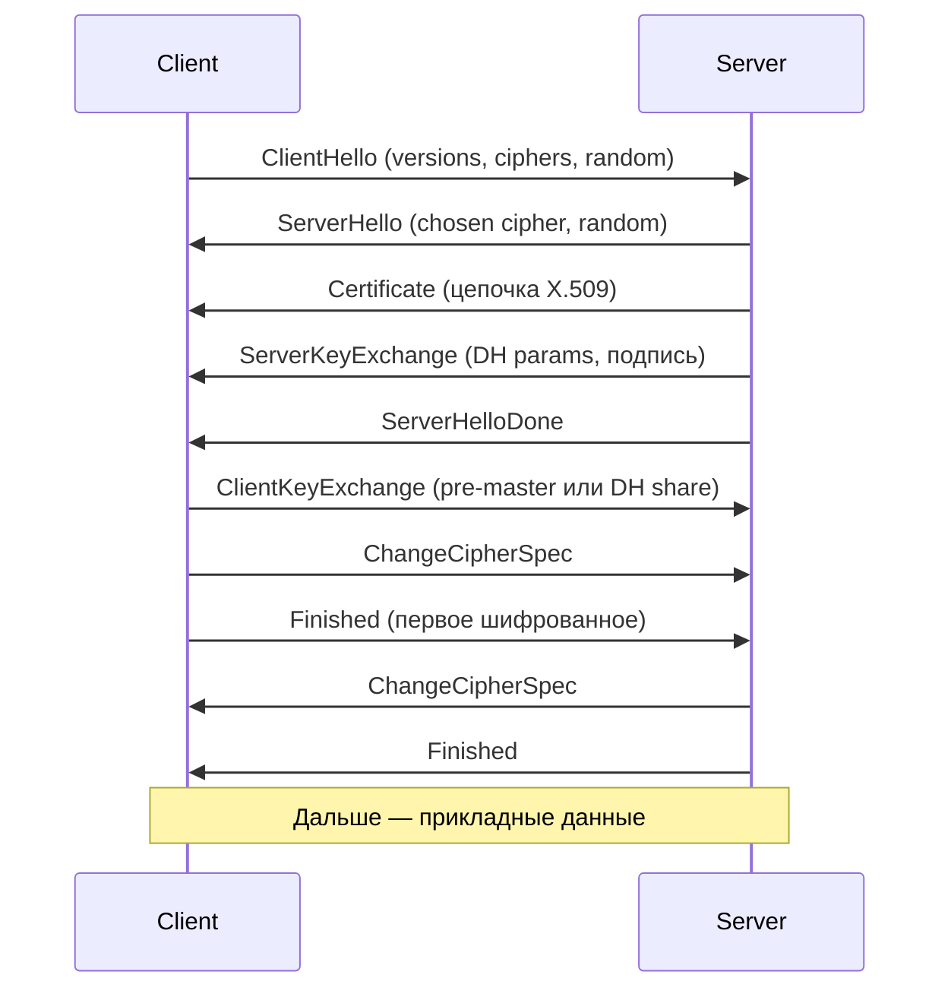
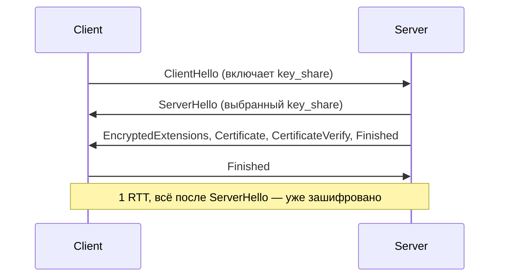
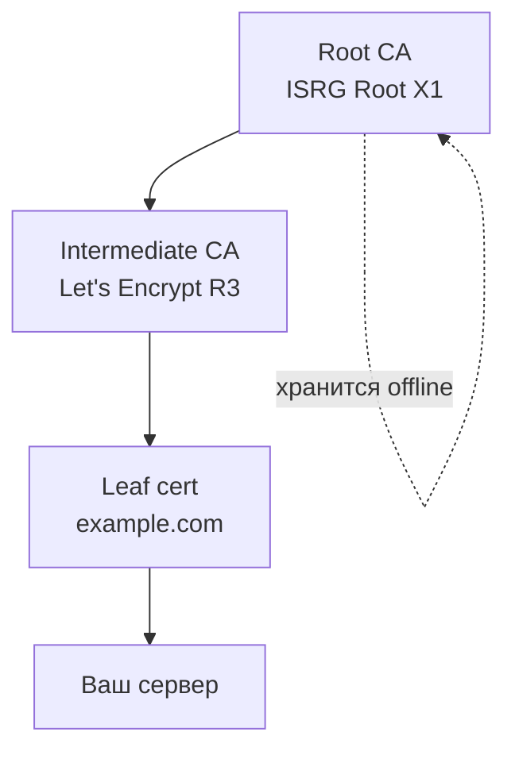
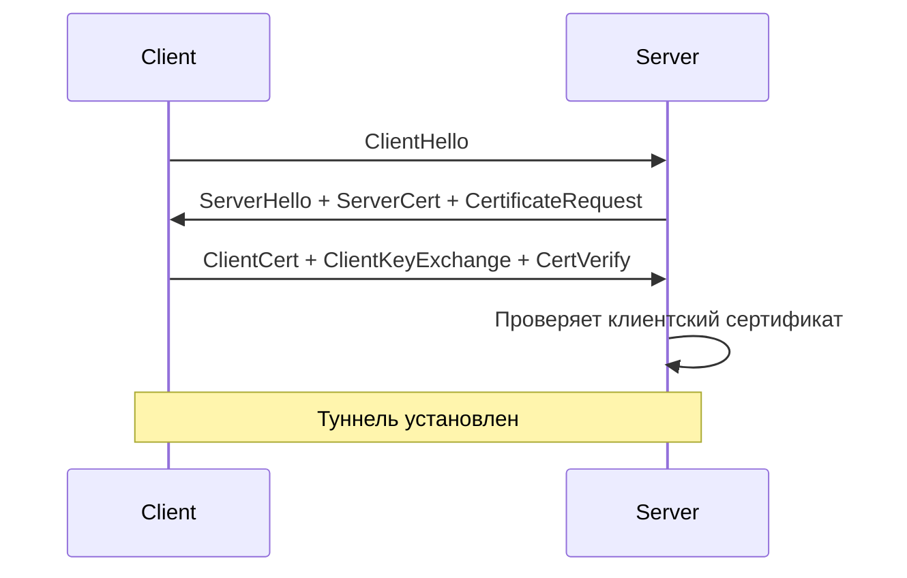

# TLS / SSL: handshake, сертификаты, конфигурация

`TLS` (Transport Layer Security) — протокол шифрованной и аутентифицированной передачи данных поверх `TCP`. `SSL` — его предшественник (все версии `SSL 3.0` и ниже скомпрометированы и не используются).

Этот документ покрывает: как работает handshake, какие бывают сертификаты, как настроить на `Nginx`/`Spring Boot`/`JVM`, что ломается чаще всего.

## Полезные ссылки

### Спецификации
- [RFC 8446 — TLS 1.3](https://datatracker.ietf.org/doc/html/rfc8446)
- [RFC 5246 — TLS 1.2](https://datatracker.ietf.org/doc/html/rfc5246)
- [RFC 5280 — X.509 PKI](https://datatracker.ietf.org/doc/html/rfc5280)
- [RFC 8555 — ACME (Let's Encrypt)](https://datatracker.ietf.org/doc/html/rfc8555)

### Ресурсы
- [SSL.com — TLS explained](https://www.ssl.com/faqs/faq-what-is-ssl/)
- [Mozilla SSL Configuration Generator](https://ssl-config.mozilla.org/)
- [SSL Labs Server Test](https://www.ssllabs.com/ssltest/)
- [Baeldung: Spring Boot SSL/TLS](https://www.baeldung.com/spring-boot-https-self-signed-certificate)
- [Baeldung: JVM keystore vs truststore](https://www.baeldung.com/java-keystore-truststore-difference)
- [Let's Encrypt Docs](https://letsencrypt.org/docs/)

## Содержание

- [Зачем TLS](#зачем-tls)
- [Версии протокола](#версии-протокола)
- [Handshake TLS 1.2](#handshake-tls-12)
- [Handshake TLS 1.3](#handshake-tls-13)
- [Cipher suites](#cipher-suites)
  - [TLS 1.2 формат](#tls-12-формат)
  - [TLS 1.3 формат](#tls-13-формат)
  - [Рекомендованные наборы (Mozilla Intermediate)](#рекомендованные-наборы-mozilla-intermediate)
  - [Что запрещено](#что-запрещено)
- [Сертификаты X.509](#сертификаты-x509)
  - [Основные поля](#основные-поля)
  - [Форматы файлов](#форматы-файлов)
  - [Чтение сертификата](#чтение-сертификата)
  - [CN vs SAN](#cn-vs-san)
- [CA-иерархия и цепочки](#ca-иерархия-и-цепочки)
- [mTLS](#mtls)
- [Конфигурация Nginx](#конфигурация-nginx)
- [Конфигурация Spring Boot](#конфигурация-spring-boot)
- [JVM keystore и truststore](#jvm-keystore-и-truststore)
  - [Добавить корневой сертификат в JDK](#добавить-корневой-сертификат-в-jdk)
  - [Список содержимого](#список-содержимого)
  - [Импорт своего сертификата](#импорт-своего-сертификата)
  - [Указать другой truststore приложению](#указать-другой-truststore-приложению)
- [Let's Encrypt и ACME](#lets-encrypt-и-acme)
  - [Проверка владения доменом](#проверка-владения-доменом)
  - [Certbot (классический сценарий)](#certbot-классический-сценарий)
  - [В Kubernetes — cert-manager](#в-kubernetes-cert-manager)
- [Типичные ошибки](#типичные-ошибки)
- [Диагностика](#диагностика)
- [Чек-лист прод-готовности](#чек-лист-прод-готовности)
- [См. также](#см-также)

## Зачем TLS

TLS решает три задачи:

- **Конфиденциальность** — трафик зашифрован, прослушивание (`sniffing`) не даёт смысла.
- **Целостность** — MAC/AEAD гарантирует, что пакет не изменён в пути.
- **Аутентификация** — сертификат доказывает, что сервер действительно тот, чьё имя в URL.

Без TLS невозможно безопасно передавать пароли, токены, данные карт. `HTTP` в 2020-х — только для redirect на `HTTPS`.

## Версии протокола

| Версия | Статус | Комментарий |
|--------|--------|-------------|
| SSL 2.0 | Запрещён | Сломан |
| SSL 3.0 | Запрещён | POODLE (2014) |
| TLS 1.0 | Deprecated (RFC 8996, 2021) | Отключить |
| TLS 1.1 | Deprecated | Отключить |
| TLS 1.2 | Живой | Разрешён |
| TLS 1.3 | Рекомендуется | Быстрее и безопаснее |

Для прода — **только `TLS 1.2` и `TLS 1.3`**. Устаревшие версии отключаются на уровне сервера.

## Handshake TLS 1.2



Особенности:

- Два раунда (2 RTT) до первого байта данных.
- Ключевой обмен: `RSA` (устаревший, нет forward secrecy) или `ECDHE`/`DHE` (рекомендуется).
- Cipher suite — длинная строка, описывает все алгоритмы сразу.

## Handshake TLS 1.3



Что изменилось:

- **1 RTT** вместо 2. Быстрее на 50%.
- **0-RTT** возможен для повторных соединений (с оговорками по replay).
- Убраны слабые алгоритмы: `RSA key exchange`, `CBC`, `SHA-1`, `MD5`, `RC4`, `DSA`.
- Обязательный `ECDHE` — forward secrecy по умолчанию.
- Только `AEAD`-шифры (`AES-GCM`, `ChaCha20-Poly1305`).
- Подпись сервера шифруется — атакующий не видит `Certificate`.

## Cipher suites

Cipher suite описывает набор алгоритмов для соединения.

### TLS 1.2 формат

```text
TLS_ECDHE_RSA_WITH_AES_128_GCM_SHA256
    |     |    |        |       |
    |     |    |        |       +- PRF hash
    |     |    |        +- Symmetric cipher (AEAD)
    |     |    +- "with"
    |     +- Authentication (signature)
    +- Key exchange
```

### TLS 1.3 формат

В TLS 1.3 cipher suite описывает только симметричную часть:

```text
TLS_AES_128_GCM_SHA256
TLS_AES_256_GCM_SHA384
TLS_CHACHA20_POLY1305_SHA256
```

Key exchange и signature выбираются отдельно через extensions.

### Рекомендованные наборы (Mozilla Intermediate)

```text
# TLS 1.3
TLS_AES_128_GCM_SHA256
TLS_AES_256_GCM_SHA384
TLS_CHACHA20_POLY1305_SHA256

# TLS 1.2
ECDHE-ECDSA-AES128-GCM-SHA256
ECDHE-RSA-AES128-GCM-SHA256
ECDHE-ECDSA-AES256-GCM-SHA384
ECDHE-RSA-AES256-GCM-SHA384
ECDHE-ECDSA-CHACHA20-POLY1305
ECDHE-RSA-CHACHA20-POLY1305
```

### Что запрещено

- `RC4`, `3DES`, `DES` — слабые шифры.
- `MD5`, `SHA1` в MAC — коллизии.
- `NULL`, `EXPORT`, `anon` — без шифрования или без аутентификации.
- `CBC`-режимы на старых TLS — BEAST/Lucky13.

## Сертификаты X.509

Сертификат — структура по стандарту `X.509`: открытый ключ + метаданные, подписанные центром сертификации (`CA`).

### Основные поля

| Поле | Что значит |
|------|-----------|
| `Subject` | Кому выдан (`CN`, `O`, `OU`, `C`) |
| `Issuer` | Кто выдал (`CA`) |
| `Serial Number` | Уникальный номер у `CA` |
| `Not Before` / `Not After` | Период действия |
| `Subject Alternative Name` (SAN) | DNS-имена и IP — **фактическое** имя хоста |
| `Public Key` | Открытый ключ |
| `Signature` | Подпись `CA` |
| `Key Usage` / `Extended Key Usage` | Для чего пригоден (server auth, client auth, ...) |

### Форматы файлов

| Формат | Расширение | Что внутри |
|--------|-----------|------------|
| PEM | `.pem`, `.crt`, `.cer`, `.key` | Base64 + `-----BEGIN ...-----` |
| DER | `.der`, `.cer` | Бинарный |
| PKCS#12 | `.p12`, `.pfx` | Контейнер (сертификат + приватный ключ) |
| JKS | `.jks` | Java KeyStore (устаревает, замена — PKCS#12) |

### Чтение сертификата

```bash
# Из PEM
openssl x509 -in cert.pem -noout -text

# Только основные поля
openssl x509 -in cert.pem -noout -subject -issuer -dates -ext subjectAltName

# С удалённого сервера
openssl s_client -connect example.com:443 -servername example.com </dev/null \
  | openssl x509 -noout -subject -issuer -dates
```

### `CN` vs `SAN`

Исторически имя хоста писали в `CN` (Common Name). С 2017 года браузеры **игнорируют `CN`** и требуют `Subject Alternative Name`. Без SAN сертификат считается невалидным даже если `CN` совпадает.

## CA-иерархия и цепочки



- **Root CA** — самоподписанный, лежит в системном trust store браузера/ОС/JDK.
- **Intermediate CA** — подписан root, подписывает leaf. Нужен для раздельных функций и ротации.
- **Leaf certificate** — то, что стоит на вашем сервере.

Сервер должен отдавать **всю цепочку** (leaf + intermediate). Root клиент имеет сам. Если intermediate отсутствует — клиент не смог построить цепочку, появится ошибка.

Проверка цепочки:

```bash
openssl s_client -connect example.com:443 -showcerts </dev/null
```

## mTLS

`mTLS` (mutual TLS) — TLS с **двусторонней** аутентификацией: не только сервер доказывает свою идентичность, но и клиент.



Где используется:

- Сервис-сервис коммуникация в service mesh (`Istio`, `Linkerd`).
- Партнёрские API с высокими требованиями безопасности.
- IoT-устройства.
- Доступ к админ-эндпоинтам.

Настройка на `Nginx`:

```nginx
ssl_client_certificate /etc/nginx/ca.crt;
ssl_verify_client on;
ssl_verify_depth 2;
```

На стороне клиента нужен свой сертификат с `Extended Key Usage: clientAuth`.

## Конфигурация Nginx

Современный прод-конфиг для HTTPS:

```nginx
server {
    listen 443 ssl http2;
    server_name example.com;

    # Сертификат + цепочка в одном файле (leaf + intermediate)
    ssl_certificate /etc/ssl/example.com/fullchain.pem;
    ssl_certificate_key /etc/ssl/example.com/privkey.pem;

    # Протоколы
    ssl_protocols TLSv1.2 TLSv1.3;
    ssl_prefer_server_ciphers off;

    # Cipher suites (Mozilla Intermediate)
    ssl_ciphers 'ECDHE-ECDSA-AES128-GCM-SHA256:ECDHE-RSA-AES128-GCM-SHA256:ECDHE-ECDSA-AES256-GCM-SHA384:ECDHE-RSA-AES256-GCM-SHA384:ECDHE-ECDSA-CHACHA20-POLY1305:ECDHE-RSA-CHACHA20-POLY1305';

    # Session cache
    ssl_session_cache shared:SSL:10m;
    ssl_session_timeout 1d;
    ssl_session_tickets off;

    # OCSP Stapling
    ssl_stapling on;
    ssl_stapling_verify on;
    resolver 1.1.1.1 8.8.8.8 valid=60s;

    # HSTS — браузер будет ходить только по HTTPS
    add_header Strict-Transport-Security "max-age=63072000; includeSubDomains; preload" always;

    location / {
        proxy_pass http://backend:8080;
    }
}

# Redirect HTTP → HTTPS
server {
    listen 80;
    server_name example.com;
    return 301 https://$host$request_uri;
}
```

Проверить синтаксис:

```bash
nginx -t
nginx -s reload
```

## Конфигурация Spring Boot

Минимальная настройка встроенного Tomcat:

```yaml
server:
  port: 8443
  ssl:
    enabled: true
    key-store: classpath:keystore.p12
    key-store-password: ${KEYSTORE_PASSWORD}
    key-store-type: PKCS12
    key-alias: tomcat
    protocol: TLS
    enabled-protocols: TLSv1.2,TLSv1.3
    ciphers:
      - TLS_AES_128_GCM_SHA256
      - TLS_AES_256_GCM_SHA384
      - TLS_CHACHA20_POLY1305_SHA256
```

Генерация self-signed для dev:

```bash
keytool -genkeypair -alias tomcat \
  -keyalg RSA -keysize 2048 \
  -storetype PKCS12 \
  -keystore keystore.p12 \
  -validity 365 \
  -storepass changeit \
  -dname "CN=localhost, OU=dev, O=Example, L=Moscow, C=RU" \
  -ext SAN=dns:localhost,ip:127.0.0.1
```

В проде сертификат получается из `Vault`/`cert-manager`/`Let's Encrypt`, не генерируется вручную.

HTTP HTTPS redirect:

```java
@Bean
public ServletWebServerFactory servletContainer() {
    TomcatServletWebServerFactory tomcat = new TomcatServletWebServerFactory() {
        @Override
        protected void postProcessContext(Context context) {
            SecurityConstraint sc = new SecurityConstraint();
            sc.setUserConstraint("CONFIDENTIAL");
            SecurityCollection col = new SecurityCollection();
            col.addPattern("/*");
            sc.addCollection(col);
            context.addConstraint(sc);
        }
    };
    tomcat.addAdditionalTomcatConnectors(httpConnector());
    return tomcat;
}
```

Для mTLS на сервере:

```yaml
server:
  ssl:
    client-auth: need   # или want — want не отклоняет без сертификата
    trust-store: classpath:truststore.p12
    trust-store-password: ${TRUSTSTORE_PASSWORD}
```

## JVM keystore и truststore

Два разных хранилища:

| Хранилище | Что хранит | Для чего |
|-----------|-----------|----------|
| `keystore` | Приватные ключи + свои сертификаты | Доказать себя (сервер или клиент mTLS) |
| `truststore` | Публичные сертификаты `CA` и пиров | Кого мы доверяем |

Системный truststore JDK — `$JAVA_HOME/lib/security/cacerts`.

### Добавить корневой сертификат в JDK

```bash
keytool -import -trustcacerts \
  -alias corporate-ca \
  -file corporate-root.pem \
  -keystore $JAVA_HOME/lib/security/cacerts \
  -storepass changeit \
  -noprompt
```

### Список содержимого

```bash
keytool -list -v -keystore keystore.p12 -storepass changeit
keytool -list -keystore $JAVA_HOME/lib/security/cacerts -storepass changeit | grep -i "Corporate"
```

### Импорт своего сертификата

```bash
# Импорт leaf + цепочки из PEM в PKCS#12
openssl pkcs12 -export \
  -in fullchain.pem \
  -inkey privkey.pem \
  -out keystore.p12 \
  -name tomcat \
  -passout pass:changeit
```

### Указать другой truststore приложению

```bash
java -Djavax.net.ssl.trustStore=/opt/app/truststore.p12 \
     -Djavax.net.ssl.trustStorePassword=changeit \
     -Djavax.net.ssl.trustStoreType=PKCS12 \
     -jar app.jar
```

Лучше в Spring Boot задавать через `application.yml`, не через `-D`.

## Let's Encrypt и ACME

`ACME` (Automatic Certificate Management Environment) — протокол автоматического выпуска сертификатов. `Let's Encrypt` — самый известный CA, бесплатный, 90 дней срок жизни.

### Проверка владения доменом

- `HTTP-01` — сервер кладёт файл по `/.well-known/acme-challenge/...`, CA проверяет.
- `DNS-01` — добавляется `TXT`-запись `_acme-challenge.example.com`. Позволяет получать wildcard.
- `TLS-ALPN-01` — для специфичных установок без HTTP-доступа.

### Certbot (классический сценарий)

```bash
# Standalone (открытый 80 порт)
certbot certonly --standalone -d example.com -d www.example.com

# Через nginx плагин
certbot --nginx -d example.com

# Автообновление через cron / systemd timer
certbot renew --quiet
```

### В Kubernetes — cert-manager

```yaml
apiVersion: cert-manager.io/v1
kind: Certificate
metadata:
  name: example-com-tls
  namespace: production
spec:
  secretName: example-com-tls
  issuerRef:
    name: letsencrypt-prod
    kind: ClusterIssuer
  dnsNames:
    - example.com
    - www.example.com
```

Автоматически обновляется за 30 дней до истечения.

## Типичные ошибки

| Ошибка | Симптом | Причина и решение |
|--------|---------|-------------------|
| Устаревшие протоколы | SSL Labs: F/B | Отключить TLS 1.0/1.1, оставить 1.2+1.3 |
| Слабые cipher suites | SSL Labs warning | Применить Mozilla Intermediate |
| `CN` без `SAN` | Браузеры говорят `NET::ERR_CERT_COMMON_NAME_INVALID` | Перевыпустить с `SAN`-расширением |
| Expired certificate | `NET::ERR_CERT_DATE_INVALID` | Настроить автообновление (ACME / cert-manager) |
| Self-signed в проде | `unable to verify the first certificate` | Получить сертификат от публичного CA |
| Нет intermediate в цепочке | Одни клиенты работают, другие нет | Отдавать `fullchain.pem` (leaf + intermediate) |
| Неверный порядок в цепочке | `unable to get local issuer certificate` | Leaf первым, intermediate — следом |
| `SNI`-несовместимость | Сервер отдаёт не тот сертификат | Включить SNI, задать `server_name` на `nginx` |
| Mixed content | Браузер блокирует часть ресурсов | Все ссылки на HTTPS, включая CDN |
| Clock skew | `certificate is not yet valid` | Синхронизировать время (`ntpd`, `chrony`) |
| JVM не доверяет corporate CA | `PKIX path building failed` | Импортировать CA в `cacerts` через `keytool` |

## Диагностика

Быстрая проверка:

```bash
# Версии протокола и cipher
nmap --script ssl-enum-ciphers -p 443 example.com

# Что отдаёт сервер
openssl s_client -connect example.com:443 -servername example.com -showcerts

# Тест TLS 1.3
openssl s_client -connect example.com:443 -tls1_3

# Тест конкретного cipher
openssl s_client -connect example.com:443 -cipher 'ECDHE-RSA-AES128-GCM-SHA256'

# Проверка expiry
echo | openssl s_client -connect example.com:443 2>/dev/null \
  | openssl x509 -noout -dates
```

Онлайн:

- [SSL Labs](https://www.ssllabs.com/ssltest/) — полный аудит.
- [testssl.sh](https://testssl.sh/) — CLI-альтернатива, работает на закрытых хостах.
- [crt.sh](https://crt.sh/) — поиск по Certificate Transparency (какие сертификаты выпущены на домен).

JVM-сторона:

```bash
# Дебаг SSL handshake
java -Djavax.net.debug=ssl:handshake:verbose -jar app.jar

# Только ошибки
java -Djavax.net.debug=ssl -jar app.jar 2>&1 | grep -i error
```

## Чек-лист прод-готовности

- [ ] Включены только `TLS 1.2` и `TLS 1.3`.
- [ ] Cipher suites — Mozilla Intermediate или строже.
- [ ] Forward Secrecy (`ECDHE`) для всех активных cipher.
- [ ] Сертификат от публичного CA, не self-signed.
- [ ] `SAN` содержит все актуальные hostname.
- [ ] Полная цепочка (leaf + intermediate) в `fullchain.pem`.
- [ ] `HSTS` включён с `max-age >= 1 year` и `includeSubDomains`.
- [ ] `OCSP stapling` включён.
- [ ] Есть процесс автообновления (`ACME` / `cert-manager`).
- [ ] Мониторинг `expiry` — алерт за 30 дней до истечения.
- [ ] `mTLS` для внутренних сервисов там, где это оправдано.
- [ ] Corporate CA добавлен в JVM `cacerts` там, где нужно.
- [ ] SSL Labs score — `A` или `A+`.

## См. также

- [[infrastructure-security|Infrastructure Security]] — сетевой периметр и hardening
- [[secrets-management|Secrets Management]] — хранение приватных ключей
- [[data-security|Data Security]] — шифрование на уровне данных
- [[application-security|Application Security]] — TLS как фундамент всей схемы
- [[api-security|API Security]] — TLS для API
- [[jwt-oauth2|JWT и OAuth2]] — токены поверх TLS
- [[nginx-advanced|Nginx advanced]] — тонкая настройка reverse-proxy
- [[tls-ssl-interview|TLS/SSL на собеседовании]]
