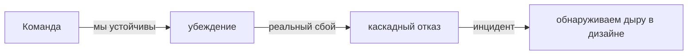
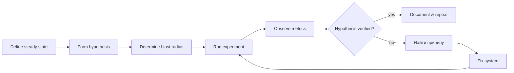

# Chaos Engineering: эксперименты с устойчивостью

Chaos engineering — дисциплина проведения экспериментов в распределённой
системе с целью обнаружить слабые места до того, как они проявятся в реальном
инциденте. Идея от Netflix: вместо ожидания «это не сломается» — намеренно
ломать в контролируемых условиях.

Без chaos engineering команда живёт в ложном чувстве безопасности: тесты
зелёные, метрики ОК, но реальная устойчивость не проверена. Случайное падение
одной ноды в проде показывает, что resilience patterns не работают как
задумано. Chaos engineering превращает это в управляемую практику.

Документ покрывает: принципы из Principles of Chaos, методологию (steady
state, hypothesis, blast radius), типичные эксперименты, инструменты, и
организационные аспекты (gameday, post-mortem).

## Полезные ссылки

### Официальная документация

- [Principles of Chaos Engineering](https://principlesofchaos.org/) — манифест
- [Chaos Monkey GitHub (Netflix)](https://github.com/Netflix/chaosmonkey) — оригинальный инструмент
- [Litmus Chaos](https://litmuschaos.io/) — CNCF chaos для Kubernetes
- [Chaos Mesh](https://chaos-mesh.org/) — CNCF альтернатива Litmus
- [Gremlin](https://www.gremlin.com/) — коммерческое решение

### Обучающие материалы

- [Chaos Engineering (Casey Rosenthal & Nora Jones)](https://www.oreilly.com/library/view/chaos-engineering/9781492043850/) — каноничная книга
- [Learning Chaos Engineering (Russ Miles)](https://www.oreilly.com/library/view/learning-chaos-engineering/9781492050995/) — practical guide
- [Awesome Chaos Engineering](https://github.com/dastergon/awesome-chaos-engineering) — подборка ресурсов

### См. также

- [Resilience Patterns](../architecture/resilience-patterns.md) — что мы тестируем
- [Distributed Systems Fundamentals](../architecture/distributed-systems-fundamentals.md) — теория сбоев
- [Observability: руководство](../monitoring/observability-guide.md) — без неё chaos бесполезен
- [Monitoring Best Practices](../monitoring/monitoring-best-practices.md) — алерты при экспериментах
- [Saga Pattern](../architecture/saga-pattern.md) — устойчивость распределённых транзакций
- [Kubernetes Security](../platform/containers/kubernetes/kubernetes-security.md) — RBAC для chaos-tools

## Содержание

- [Зачем нужен chaos engineering](#зачем-нужен-chaos-engineering)
- [Принципы (Principles of Chaos)](#принципы-principles-of-chaos)
- [Pre-conditions: что должно быть готово](#pre-conditions-что-должно-быть-готово)
- [Методология эксперимента](#методология-эксперимента)
- [Blast radius](#blast-radius)
- [Категории экспериментов](#категории-экспериментов)
- [Сетевые эксперименты](#сетевые-эксперименты)
- [Resource exhaustion](#resource-exhaustion)
- [Failure injection в коде](#failure-injection-в-коде)
- [Game day](#game-day)
- [Сравнение инструментов](#сравнение-инструментов)
- [Метрики и оценка](#метрики-и-оценка)
- [Организационная зрелость](#организационная-зрелость)
- [Антипаттерны](#антипаттерны)
- [Лучшие практики](#лучшие-практики)

## Зачем нужен chaos engineering



Без chaos:

- Resilience patterns (circuit breaker, retry) не проверены в боях.
- Команда не знает, как отвечает система при падении части нод.
- Runbooks написаны теоретически, не проверены.
- Алерты могут не срабатывать на реальные сбои.

С chaos:

- Слабые места обнаруживаются в контролируемом окне.
- Команда учится отвечать на инциденты.
- Runbooks и алерты тестируются регулярно.
- Confidence в надёжности — на основе данных, не intuition.

> Главный смысл chaos engineering — заменить «надеемся, что не сломается»
> на «знаем, что выживет».

## Принципы (Principles of Chaos)

Каноничные принципы из manifesto:

| Принцип | Что значит |
|---------|-----------|
| Build a hypothesis around steady state | Сформулируй гипотезу о нормальном поведении |
| Vary real-world events | Внеси реальные сбои (паления нод, latency, network drop) |
| Run experiments in production | Production behavior отличается от staging |
| Automate experiments to run continuously | Регулярные эксперименты, не разовые |
| Minimize blast radius | Локализуй ущерб, не валим прод целиком |

«Run experiments in production» — главный страшный пункт. Сначала команды
делают chaos в staging, постепенно переходят к prod с маленьким blast radius.

## Pre-conditions: что должно быть готово

Chaos engineering без подготовки — просто хаос. До экспериментов нужно:

| Pre-condition | Зачем |
|---------------|-------|
| Метрики golden signals | Чтобы видеть steady state и его нарушение |
| Distributed tracing | Чтобы понимать, какой компонент сломался |
| Алерты | Чтобы вовремя остановить эксперимент |
| Runbooks | Чтобы команда знала, что делать |
| Resilience patterns | Чтобы было что тестировать (circuit breaker, retry) |
| Rollback план | Чтобы быстро откатить эксперимент |
| Stakeholder buy-in | Менеджмент знает и одобряет |

Без observability chaos бессмыслен: ты ломаешь и не видишь эффект.

> Chaos engineering — финальный экзамен на observability и resilience.
> Если эти основы не работают, начинать с chaos рано.

## Методология эксперимента



### 1. Steady state

Определи нормальное поведение в метриках:

- Request rate: 1000 RPS plus-minus 10%.
- Error rate: < 0.5%.
- Latency p99: < 500ms.
- Очередь Kafka: lag < 100ms.
- Все pods Ready.

Steady state — это base line. Эксперимент проверяет, нарушается ли он.

### 2. Hypothesis

Форма: «при <experiment> система <expected behavior> и steady state не нарушается».

Примеры:

- «При падении одного pod orders-service, latency p99 не превышает 700ms,
  error rate остаётся < 1%».
- «При 200ms latency на DB-connection, request rate падает не более чем
  на 5%».
- «При недоступности Redis, fallback в БД даёт response в пределах 2s».

Гипотеза должна быть фальсифицируема: понятно, что значит «гипотеза не
подтвердилась».

### 3. Blast radius

Минимальный возможный масштаб эксперимента, дающий результат.

```text
Уровень 1: dev cluster, 1 pod
Уровень 2: staging cluster, 1 service
Уровень 3: prod, 5% трафика
Уровень 4: prod, 50% трафика
Уровень 5: prod, 100%
```

Начинай с уровня 1. Поднимай уровень только если эксперимент успешен,
команда готова, риски управляемы.

### 4. Run experiment

Запуск через инструмент (Chaos Monkey, Litmus, Chaos Mesh):

- Документируй точное время начала.
- Уведоми команду в Slack.
- Запусти эксперимент.

### 5. Observe

Смотри на метрики в реальном времени:

- Steady state поддерживается?
- Алерты сработали?
- Время до обнаружения (MTTD)?
- Время до восстановления (MTTR)?

### 6. Verify hypothesis

Если steady state нарушен сильнее ожидаемого — гипотеза не подтверждена.
Не «эксперимент провалился» — это **успех**: нашли слабое место.

### 7. Document and learn

После каждого эксперимента — короткий отчёт:

- Что делали.
- Что ожидали.
- Что произошло.
- Какие выводы.
- Какие изменения внести в систему.

## Blast radius

Контроль blast radius — главное искусство chaos engineering. Принципы:

| Стратегия | Описание |
|-----------|----------|
| Start with non-prod | Сначала dev, staging, потом prod |
| Single-target first | Один pod / одна нода / один регион |
| Time-boxed | Эксперимент длится N минут с автоматическим откатом |
| Synthetic traffic | На искусственном трафике перед реальным |
| Tenant-scoped | Только один тенант / одна группа пользователей |
| Off-peak | Ночью, в выходные |
| Kill-switch | Готовый способ всё остановить |

Не запускай chaos в production без:

- Кнопки экстренной остановки.
- Чёткого отката.
- Команды на ready (on-call в курсе).
- Runbook на случай выхода из-под контроля.

## Категории экспериментов

| Категория | Примеры |
|-----------|---------|
| Compute | Убить pod, перезагрузить ноду, выключить AZ |
| Network | Latency, packet loss, network partition, DNS failure |
| Disk | I/O latency, disk full, read-only mode |
| Process | OOM kill, CPU stress, fork bomb |
| Application | Exception injection, slow response, return wrong data |
| Dependency | Mock падение upstream API, timeout |
| State | Corrupt cache, stale read replicas |
| Security | Истёкший сертификат, неверный токен |
| Time | Clock skew между нодами |

Самые ценные — те, которые повторяют наблюдаемые в проде сбои. Не нужно
делать exotic-эксперименты, если базовое «pod падает» ещё не проверено.

## Сетевые эксперименты

| Эксперимент | Что проверяем |
|-------------|---------------|
| Latency injection | Retry, timeout, backpressure |
| Packet loss | TCP retransmits, app behavior at network instability |
| Network partition | Split-brain, raft re-election |
| DNS failure | Кеширование DNS, fallback IPs |
| Bandwidth throttling | Backpressure при slow downstream |
| Asymmetric latency | Только в одну сторону |

Chaos Mesh пример — добавить 200ms latency между orders-service и postgres:

```yaml
apiVersion: chaos-mesh.org/v1alpha1
kind: NetworkChaos
metadata:
  name: orders-db-latency
  namespace: chaos
spec:
  action: delay
  mode: one
  selector:
    namespaces:
      - orders
    labelSelectors:
      "app.kubernetes.io/name": "orders"
  delay:
    latency: "200ms"
    correlation: "100"
    jitter: "0ms"
  direction: to
  target:
    selector:
      namespaces:
        - data
      labelSelectors:
        "app.kubernetes.io/name": "postgres"
    mode: one
  duration: "5m"
```

## Resource exhaustion

| Эксперимент | Что проверяем |
|-------------|---------------|
| CPU stress | Behaviour при перегруженной ноде |
| Memory stress | OOM, JVM heap behavior |
| Disk fill | Что происходит при `disk full` (логи, БД, /tmp) |
| File descriptors limit | Превышение `ulimit -n` |
| Connection exhaustion | Pool exhaustion в БД |

```yaml
# Chaos Mesh — стресс CPU и памяти на podе
kind: StressChaos
metadata:
  name: orders-cpu-stress
spec:
  mode: one
  selector:
    namespaces: ["orders"]
  stressors:
    cpu:
      workers: 4
      load: 80
    memory:
      workers: 1
      size: "256MB"
  duration: "10m"
```

## Failure injection в коде

Иногда нужно симулировать сбой не на инфра-уровне, а на уровне логики.

| Подход | Пример |
|--------|--------|
| Feature flag-based | Если flag `inject-failure-payment` ON — кидаем `RuntimeException` |
| Toxiproxy | Прокси для injection latency и errors |
| Custom middleware | Spring AOP / Go middleware с конфигом «1% запросов вернуть 500» |
| Mock на уровне HTTP-клиента | WireMock + специальные правила |

```java
@Aspect
@Component
public class ChaosAspect {
    @Autowired ChaosConfig chaos;

    @Around("execution(* com.example..*Service.*(..))")
    public Object inject(ProceedingJoinPoint pjp) throws Throwable {
        String key = pjp.getSignature().toShortString();
        if (chaos.shouldFail(key)) {
            throw new RuntimeException("chaos-injected failure at " + key);
        }
        if (chaos.shouldDelay(key) > 0) {
            Thread.sleep(chaos.shouldDelay(key));
        }
        return pjp.proceed();
    }
}
```

> Code-level injection требует осторожности: оставленный включённым в проде
> chaos-агент сам по себе инцидент. Жёсткие правила по конфигурации.

## Game day

Game day — запланированный day с серией chaos-экспериментов. Команда
собирается, выполняет сценарии, тренирует incident response.

Структура:

| Этап | Длительность | Что делаем |
|------|--------------|------------|
| Brief | 30 мин | План экспериментов, гипотезы, blast radius |
| Run | 2-4 часа | Эксперименты, observability, response |
| Debrief | 1 час | Что узнали, action items |
| Follow-up | После | Закрыть найденные проблемы |

Цель game day — не «найти много проблем», а «команда поработала с
incident response и системой».

Регулярность — раз в квартал минимум.

## Сравнение инструментов

| Инструмент | Тип | Платформа | Особенности |
|-----------|-----|-----------|-------------|
| Chaos Monkey | OSS | EC2, K8s | Оригинал Netflix, простой kill instances |
| Chaos Mesh | OSS, CNCF | Kubernetes | Богатый набор: сеть, IO, time, kernel |
| Litmus | OSS, CNCF | Kubernetes | Hub of experiments, GitOps-friendly |
| Gremlin | SaaS | Multi-platform | Коммерческий, simple UI, enterprise |
| Toxiproxy | OSS | Любая | Прокси для network conditions |
| Pumba | OSS | Docker | Chaos for Docker containers |
| AWS Fault Injection Simulator | SaaS | AWS | Native AWS, IAM-aware |
| Steadybit | Hybrid | Multi-platform | Reliability platform |
| Chaos Toolkit | OSS | Multi-platform | Driver-based, Python |

**Рекомендации:**

- **Kubernetes only:** Chaos Mesh или Litmus. Оба зрелые, GitOps-friendly.
- **AWS:** AWS Fault Injection Simulator плюс Chaos Mesh для K8s.
- **Network only:** Toxiproxy.
- **Команда без инфра-эксперта:** Gremlin (UI-driven, проще порог).

## Метрики и оценка

После эксперимента смотри:

| Метрика | Что значит |
|---------|-----------|
| MTTD | Mean time to detect — сколько потребовалось алерту сработать |
| MTTR | Mean time to recovery — сколько до восстановления |
| Steady state deviation | Насколько отошли от base line |
| Blast radius scope | Реальный vs ожидаемый |
| Customer impact | Сколько пользователей затронуто |
| Cost | Затраты на эксперимент |

Цель — снижать MTTD и MTTR со временем. Каждый эксперимент даёт data point.

## Организационная зрелость

Stages по моделям зрелости:

| Уровень | Описание |
|---------|----------|
| 0. Resistant | «Зачем ломать то, что работает?» |
| 1. Reactive | Делаем post-mortem после инцидентов |
| 2. Proactive | Game days в staging |
| 3. Tactical | Регулярный chaos в staging, изредка в prod |
| 4. Strategic | Chaos интегрирован в CI, регулярно в prod |
| 5. Native | Chaos engineering — норма, automation, dashboards |

Большинство компаний — на уровне 1–2. Уровень 3+ требует поддержки SRE-команды
и зрелой observability.

> Не пытайся прыгнуть с 0 на 5. Сначала observability и resilience patterns,
> потом game days в staging, потом small experiments в prod.

## Антипаттерны

| Антипаттерн | Почему плохо |
|-------------|--------------|
| Chaos в prod без observability | Ломаем и не видим эффект |
| Без kill switch | Эксперимент становится инцидентом |
| Эксперимент в high-traffic | Реальный customer impact |
| Без hypothesis | «Сломаем и посмотрим» — нет научного подхода |
| Без отчёта | Эксперимент проведён, никто не в курсе |
| Запуск без согласования | On-call не знает, что это эксперимент |
| Слишком большой blast radius сразу | Инцидент вместо обучения |
| «Mock'ы вместо реальности» | Тестируем не реальные сбои |
| Failure injection в production коде | Risk утечки в prod |
| Игнорирование результата | Слабое место найдено, но не исправлено |
| Game day раз в год | Слишком редко для обучения |

## Лучшие практики

- Начинай с observability. Без метрик/трейсов/логов chaos бесполезен.
- Сначала dev, потом staging, потом prod с малым radius.
- Hypothesis перед каждым экспериментом. Steady state определён.
- Time-boxed эксперименты с auto-revert.
- Kill switch всегда готов и протестирован.
- On-call знает заранее. Уведомление в Slack.
- Документируй каждый эксперимент: гипотеза, результат, выводы.
- Game day раз в квартал минимум.
- Фокус на actionable findings: каждое слабое место → задача в backlog.
- CI-интеграция: маленькие chaos-эксперименты на каждом deploy.
- Не делай chaos ради chaos. Каждый эксперимент учит чему-то конкретному.
- Привлекай dev-команды, не только SRE. Они знают, что может сломаться.
- Признавай: chaos engineering = инвестиция, не быстрый ROI.
- Делись внутри компании. Внутренний tech talk про найденные баги.
- Используй existing инструменты (Chaos Mesh, Litmus). Не пиши свой.

**Итог:** chaos engineering — дисциплина проактивного поиска слабых мест
в распределённой системе через контролируемые эксперименты. Принципы:
hypothesis-driven, blast radius minimization, run in production carefully.
Pre-conditions: observability и resilience patterns. Главные эксперименты —
сетевые задержки, падение pods, resource exhaustion. Зрелость растёт от
post-mortem reactive к continuous chaos in production.
