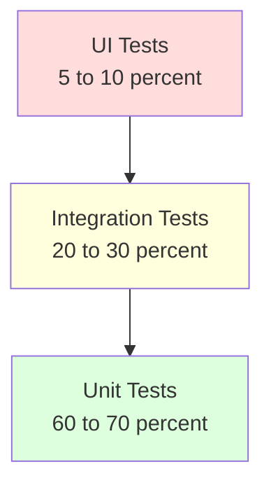

# UI Testing: обзор

UI-тесты автоматизируют сценарии конечного пользователя в браузере: открыть
страницу, ввести данные, нажать кнопку, проверить результат. Они дольше и
хрупче unit/integration-тестов, поэтому покрывают только критичные пути:
авторизация, оформление заказа, ключевые формы.

Документ — обзорная карта: какие инструменты есть, чем отличаются, как
организовать локаторы и ожидания, как бороться с flaky-тестами, как запускать
в CI. Для глубокого погружения по одному инструменту смотри
[Selenium](selenium/selenium.md).

## Полезные ссылки

### Официальная документация

- [Selenium Documentation](https://www.selenium.dev/documentation/) — стандарт WebDriver
- [Playwright](https://playwright.dev/) — современный фреймворк от Microsoft
- [Cypress](https://docs.cypress.io/) — JavaScript-ориентированный E2E
- [WebDriver BiDi](https://w3c.github.io/webdriver-bidi/) — двунаправленный протокол

### Обучающие материалы

- [Test Automation University](https://testautomationu.applitools.com/) — бесплатные курсы
- [Awesome Playwright](https://github.com/mxschmitt/awesome-playwright) — подборка ресурсов

### См. также

- [Selenium для Java](selenium/selenium.md) — детальный гайд по WebDriver
- [Cucumber](../cucumber.md) — BDD поверх UI-тестов
- [Integration Testing](../integration-testing/README.md) — когда выбирать integration вместо UI
- [Unit Testing](../unit-testing/README.md) — нижний уровень тестовой пирамиды
- [REST Assured](../integration-testing/rest-assured.md) — API-тесты как замена части UI-тестов
- [GitHub Actions](../../platform/ci-cd/github-actions.md) — запуск UI-тестов в CI

## Содержание

- [Зачем и когда нужны UI-тесты](#зачем-и-когда-нужны-ui-тесты)
- [Где UI-тесты на пирамиде тестирования](#где-ui-тесты-на-пирамиде-тестирования)
- [Сравнение инструментов](#сравнение-инструментов)
  - [Selenium WebDriver](#selenium-webdriver)
  - [Playwright](#playwright)
  - [Cypress](#cypress)
  - [Что выбрать](#что-выбрать)
- [Локаторы: какие выбирать](#локаторы-какие-выбирать)
- [Ожидания: главный источник flaky-тестов](#ожидания-главный-источник-flaky-тестов)
- [Page Object: организация кода тестов](#page-object-организация-кода-тестов)
- [Борьба с flaky-тестами](#борьба-с-flaky-тестами)
- [Изоляция данных и состояния](#изоляция-данных-и-состояния)
- [Запуск в CI](#запуск-в-ci)
- [Параллелизация и шардинг](#параллелизация-и-шардинг)
- [Решение проблем](#решение-проблем)
- [Лучшие практики](#лучшие-практики)

## Зачем и когда нужны UI-тесты

UI-тест проверяет сценарий целиком: фронтенд + бэкенд + БД + сторонние сервисы.
Это даёт максимальную уверенность, но дорого: запускается медленно, ломается
от любых изменений в вёрстке, требует поддержки тестового окружения.

**Когда нужны:**

- Критичные бизнес-сценарии (логин, оплата, регистрация).
- Smoke-тесты после деплоя — быстрая проверка, что приложение живо.
- Регрессионные сценарии для мест, где регулярно ломается фронтенд.

**Когда не нужны:**

- Логика, которую проще проверить unit-тестом или integration-тестом.
- Валидация форм без бизнес-логики — это unit-тесты.
- Покрытие всех веток UI — это становится неподдерживаемым.

## Где UI-тесты на пирамиде тестирования



Тестовая пирамида: чем выше — тем медленнее, дороже и хрупче. UI-тесты — вершина:
их должно быть мало, и каждый должен покрывать что-то, что нельзя проверить ниже.

## Сравнение инструментов

| Критерий | Selenium WebDriver | Playwright | Cypress |
|----------|--------------------|-----------|---------|
| Год появления | 2004 | 2020 | 2017 |
| Языки | Java, Python, JS, C#, Ruby, Kotlin | JS/TS, Python, Java, .NET | Только JavaScript/TypeScript |
| Браузеры | Chrome, Firefox, Edge, Safari | Chromium, Firefox, WebKit | Chrome, Edge, Firefox |
| Архитектура | WebDriver-протокол через драйвер | DevTools Protocol напрямую | Внутри браузера, в том же event loop |
| Скорость | Средняя | Высокая | Высокая |
| Авто-ожидания | Нет (нужны вручную) | Да | Да |
| Параллельный запуск | Через Grid или фреймворк | Из коробки | Через Cypress Cloud (платно) или CI |
| Мобильное тестирование | Через Appium | Эмуляция через DevTools | Только эмуляция в Chrome |
| Сложность освоения | Высокая | Средняя | Низкая |
| Зрелость экосистемы | Самая большая | Растёт быстро | Развитая, но JS-only |

### Selenium WebDriver

Стандарт W3C, поддерживается всеми крупными браузерами. Подходит, когда команда —
Java/Kotlin/Python и нужно тестировать на разных браузерах включая Safari.

```java
WebDriver driver = new ChromeDriver();
driver.get("https://example.com/login");
driver.findElement(By.id("username")).sendKeys("user");
driver.findElement(By.id("password")).sendKeys("pass");
driver.findElement(By.cssSelector("button[type='submit']")).click();

WebDriverWait wait = new WebDriverWait(driver, Duration.ofSeconds(10));
wait.until(ExpectedConditions.urlContains("/dashboard"));

driver.quit();
```

Подробнее — в [Selenium для Java](selenium/selenium.md).

### Playwright

Современный кросс-браузерный фреймворк. Работает по DevTools Protocol — быстрее
WebDriver и стабильнее за счёт авто-ожиданий: метод `click()` сам ждёт, пока
элемент появится, станет видимым и кликабельным.

```typescript
import { test, expect } from '@playwright/test';

test('login flow', async ({ page }) => {
    await page.goto('https://example.com/login');
    await page.getByLabel('Username').fill('user');
    await page.getByLabel('Password').fill('pass');
    await page.getByRole('button', { name: 'Sign in' }).click();

    await expect(page).toHaveURL(/.*\/dashboard/);
});
```

Сильные стороны: trace viewer (запись всех действий с DOM-снимками),
`page.locator()` с авто-ожиданиями, поддержка трёх движков (Chromium, Firefox, WebKit).

### Cypress

Запускается внутри браузера в одном event loop с приложением. Это даёт удобный
debug (видно весь снимок состояния на каждом шаге), но накладывает ограничения:
нельзя работать с несколькими табами, ограничен origin same-domain.

```javascript
describe('Login', () => {
  it('logs in successfully', () => {
    cy.visit('/login');
    cy.get('[data-cy=username]').type('user');
    cy.get('[data-cy=password]').type('pass');
    cy.get('[data-cy=submit]').click();
    cy.url().should('include', '/dashboard');
  });
});
```

Сильная сторона: лучшая разработческая среда из всех трёх. Cypress Studio,
time-travel debugging, network stubbing встроены.

### Что выбрать

| Сценарий | Выбор |
|----------|-------|
| Команда на Java/Kotlin, нужно тестировать на Safari | Selenium WebDriver |
| Новый проект, JS/TS, нужны кросс-браузерные тесты | Playwright |
| Чисто фронтенд-команда, важен быстрый онбординг | Cypress |
| Нужны мобильные приложения | Appium (на базе WebDriver) |
| Микс: Web + API + DB-проверки | Playwright или Selenium с тестовым фреймворком |

**Итог:** для новых проектов — Playwright. Для существующих кодовых баз
на Selenium — оставайся на Selenium, миграция редко окупается. Cypress —
когда команда чисто JS и не нужно несколько браузеров.

## Локаторы: какие выбирать

Локатор — способ найти элемент на странице. От качества локаторов напрямую
зависит, сколько времени уйдёт на поддержку тестов.

| Тип | Стабильность | Когда использовать |
|-----|--------------|--------------------|
| `data-testid="login-submit"` | Очень высокая | Стандарт для тестов; добавляется фронтендом специально |
| `id="login"` | Высокая | Если id уникальный и стабильный |
| Роль + имя (Playwright `getByRole`) | Высокая | Кнопки, ссылки, инпуты по доступному имени |
| `aria-label` | Высокая | Иконки без текста |
| Текст (`getByText`) | Средняя | Если текст не часть переводов |
| CSS-селектор по классам | Средняя | Если классы не генерируются автоматически |
| XPath по DOM-структуре | Низкая | Только когда других вариантов нет |
| XPath по позиции (`div[3]/span[2]`) | Очень низкая | Никогда |

**Правило:** проси фронтенд добавить `data-testid` в важные элементы. Это
невидимо для пользователя и не зависит от стилей и текста.

```html
<!-- Хорошо: тест не сломается от смены текста или класса -->
<button data-testid="login-submit" class="btn btn-primary">Войти</button>
```

```typescript
// Playwright
await page.getByTestId('login-submit').click();

// Selenium
driver.findElement(By.cssSelector("[data-testid='login-submit']")).click();
```

## Ожидания: главный источник flaky-тестов

Фиксированные паузы (`Thread.sleep`, `cy.wait(2000)`) — антипаттерн. На медленном
CI они недостаточны, на быстром — замедляют сборку.

| Тип ожидания | Где | Пример |
|--------------|-----|--------|
| Implicit wait | Selenium | `driver.manage().timeouts().implicitlyWait(...)` — глобально для всех `findElement` |
| Explicit wait | Selenium | `WebDriverWait` + `ExpectedConditions` |
| Auto-wait | Playwright, Cypress | Встроено: каждый action ждёт элемент |
| Wait for response | Playwright | `page.waitForResponse('**/api/users')` |
| Wait for selector | Playwright | `page.waitForSelector('[data-testid=loaded]')` |

```java
// Selenium: explicit wait — правильный способ
WebDriverWait wait = new WebDriverWait(driver, Duration.ofSeconds(10));
WebElement btn = wait.until(
    ExpectedConditions.elementToBeClickable(By.id("submit"))
);
btn.click();
```

```typescript
// Playwright: ждать конкретный сетевой запрос
const responsePromise = page.waitForResponse(r => r.url().includes('/api/orders'));
await page.getByTestId('checkout').click();
await responsePromise;
```

> Не смешивай implicit и explicit wait в Selenium — это даёт непредсказуемые
> таймауты. Выбирай один подход и используй последовательно.

## Page Object: организация кода тестов

Page Object — паттерн: один класс на страницу или крупный компонент.
Локаторы и действия — в классе страницы, тесты — в отдельных файлах.

```java
// LoginPage.java
public class LoginPage {
    private final WebDriver driver;

    private final By username = By.cssSelector("[data-testid=username]");
    private final By password = By.cssSelector("[data-testid=password]");
    private final By submit = By.cssSelector("[data-testid=submit]");

    public LoginPage(WebDriver driver) {
        this.driver = driver;
    }

    public LoginPage open() {
        driver.get("/login");
        return this;
    }

    public DashboardPage loginAs(String user, String pass) {
        driver.findElement(username).sendKeys(user);
        driver.findElement(password).sendKeys(pass);
        driver.findElement(submit).click();
        return new DashboardPage(driver);
    }
}
```

```java
// LoginTest.java
@Test
void shouldLoginAndShowDashboard() {
    DashboardPage dashboard = new LoginPage(driver)
        .open()
        .loginAs("user", "pass");

    assertThat(dashboard.welcomeText()).contains("Hello");
}
```

**Польза:** при изменении вёрстки правишь один Page Object, а не десятки тестов.

## Борьба с flaky-тестами

Flaky-тест — тот, который иногда проходит, иногда падает на одном и том же коде.
Это худший тип теста: подрывает доверие ко всему пакету.

| Причина | Решение |
|---------|---------|
| Фиксированные `sleep` | Заменить на explicit wait по DOM-условию или сетевому ответу |
| Гонка между тестами за общий ресурс (БД, файл) | Изолировать данные: уникальные имена, тестовые контейнеры |
| Анимации мешают клику | Отключить анимации в тестовой среде (`prefers-reduced-motion`, CSS-override) |
| Зависимость от тайминга сторонних сервисов | Mock на уровне HTTP (Playwright `page.route`, MockServer) |
| Случайный порядок тестов | Не делать тесты зависимыми друг от друга |
| Нестабильные локаторы | `data-testid`, не XPath по позиции |
| Очистка не доделана | `afterEach` сбрасывает состояние БД |

**Стратегия retries:** в CI разрешать 1–2 повтора падающих тестов. Это маскирует
флакающие, но позволяет не блокировать пайплайн. Параллельно — собирать
статистику по retry'ям и регулярно чистить топ-flaky.

> Если тест прошёл со второй попытки — он всё ещё считается flaky. Не игнорируй,
> заводи задачу на разбор.

## Изоляция данных и состояния

Каждый тест должен быть независим. Способы изоляции:

- Уникальные данные: `email = "user-" + UUID.randomUUID() + "@test.com"`.
- Сброс БД через transactional rollback или `@DirtiesContext` (Spring).
- Запуск против чистого Testcontainer (PostgreSQL, MockServer) перед каждым прогоном.
- API-шорткаты: вместо UI-регистрации создать пользователя через REST до теста.
- Headless-режим CI с отдельной схемой БД per worker.

API-шорткаты для подготовки состояния — обязательная практика:

```typescript
// Playwright: создаём пользователя через API, чтобы тест UI начинался с логина
test.beforeEach(async ({ request }) => {
    await request.post('/api/users', {
        data: { email: 'test@example.com', password: 'pass' }
    });
});
```

## Запуск в CI

UI-тесты в CI запускаются в headless-режиме (без открытия окна браузера).
Это быстрее и работает без X-сервера.

```yaml
# .github/workflows/ui-tests.yml
name: UI Tests
on: [pull_request]

jobs:
  e2e:
    runs-on: ubuntu-latest
    steps:
      - uses: actions/checkout@v4
      - uses: actions/setup-node@v4
        with:
          node-version: 20
      - run: npm ci
      - run: npx playwright install --with-deps
      - run: npx playwright test
      - uses: actions/upload-artifact@v4
        if: always()
        with:
          name: playwright-report
          path: playwright-report/
          retention-days: 7
```

Артефакты при падении: traces (Playwright), скриншоты, видео. Они радикально
сокращают время дебага красного билда.

## Параллелизация и шардинг

| Подход | Где | Как |
|--------|-----|-----|
| Параллельные воркеры в одном процессе | Playwright (по умолчанию), JUnit `@Execution(CONCURRENT)` | Изоляция через уникальные данные |
| Sharding на нескольких машинах | Playwright `--shard=1/4`, Cypress Cloud | Каждый CI-job берёт свою долю |
| Selenium Grid | Selenium | Параллельный запуск на разных нодах с разными браузерами |

```bash
# Playwright: 4 шарда, GitHub Actions matrix
npx playwright test --shard=1/4
npx playwright test --shard=2/4
```

Параллелизация требует, чтобы тесты не зависели друг от друга и не делили
общий ресурс. Иначе появляется новый источник flaky-тестов — гонки.

## Решение проблем

| Симптом | Причина | Решение |
|---------|---------|---------|
| `NoSuchElementException` после загрузки страницы | Элемент в `iframe` или подгружается асинхронно | `driver.switchTo().frame(...)`, explicit wait |
| Тест проходит локально, валится в CI | Headless-режим ведёт себя иначе, медленнее CPU | Запусти локально с `--headless`, увеличь таймауты |
| Клик не срабатывает | Элемент перекрыт оверлеем (модалкой, баннером cookies) | Закрой оверлей перед кликом, используй `force: true` (только если уверен) |
| `StaleElementReferenceException` | Элемент пересоздан после `findElement` | Найти заново внутри блока retry или ожидания |
| Cypress: `cy.visit` падает на CORS | Запрос на другой origin | Cypress ограничивает same-origin; для cross-origin нужен `cy.origin()` |
| Playwright: тест видит устаревшее состояние | Контекст не сбросился между тестами | `test.use({ storageState: ... })` или `context.clearCookies()` |
| Скриншоты разные на разных машинах | Разные шрифты, рендеринг ОС | Запускай в Docker-контейнере с фиксированной средой |
| Тесты падают из-за всплывающих диалогов | Браузерный prompt/confirm | `page.on('dialog', d => d.accept())` в Playwright |

## Лучшие практики

- Покрывай UI-тестами 5–10% сценариев — критичные пути. Остальное — на нижних уровнях.
- Используй `data-testid`, не XPath по позиции и не CSS по классам.
- Никогда не используй фиксированные `sleep`. Только explicit wait.
- Готовь состояние через API, а не через UI: быстрее и стабильнее.
- Делай тесты независимыми друг от друга — иначе параллелизация даст ложные падения.
- В CI собирай traces/скриншоты/видео при падении и публикуй артефактом.
- Веди статистику flaky-тестов: топ-10 регулярно чистится, иначе доверие падает.
- Изолируй данные: каждый тест работает со своими сущностями (UUID, изолированная схема).
- Headless в CI, headed локально — для отладки.
- Не дублируй проверки фронт-логики, которая уже покрыта unit-тестами компонентов.

**Итог:** UI-тесты — это страховка для критичных пользовательских сценариев,
а не способ покрыть всё. Главные источники проблем — слабые локаторы и
ожидания. Решаются через `data-testid`, авто-ожидания фреймворков (Playwright,
Cypress) и API-шорткаты для подготовки данных.
