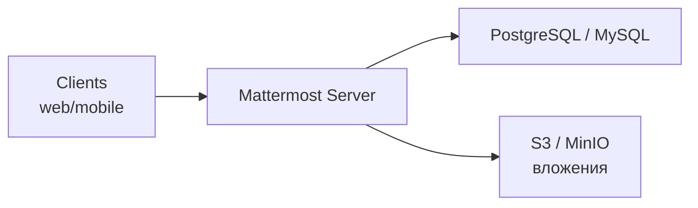

# Mattermost

Mattermost — open-source корпоративный мессенджер, self-hosted альтернатива [[README|Slack]]. Выбирают организации с требованиями по data residency, compliance, воздушным зазором или стремящиеся к контролю над инфрой. Функционально — почти паритет со Slack: каналы, треды, реакции, вложения, интеграции, боты.

Deploy-вариант: standalone binary, Docker-compose, Kubernetes-оператор, корпоративный Enterprise Edition с HA, кластером PostgreSQL, SSO и guest accounts.

## Полезные ссылки

### Основной документ
- [[mattermost-basics|Основы Mattermost]] — deploy, API, плагины, миграция со Slack

### Соседние разделы
- [[README|Slack]]
- [[README|Alerting]]
- [[README|Kubernetes]]

### Внешние ресурсы
- [Mattermost docs](https://docs.mattermost.com/)
- [REST API](https://api.mattermost.com/)
- [Plugin Framework](https://developers.mattermost.com/integrate/plugins/)
- [Mattermost Operator for K8s](https://github.com/mattermost/mattermost-operator)

## Содержание

- [Когда выбирать Mattermost, а не Slack](#когда-выбирать-mattermost-а-не-slack)
- [Архитектура и деплой](#архитектура-и-деплой)
- [Incoming/Outgoing Webhooks](#incomingoutgoing-webhooks)
- [Slash-команды и боты](#slash-команды-и-боты)
- [Миграция со Slack](#миграция-со-slack)
- [Маршруты чтения](#маршруты-чтения)
- [Куда идти дальше](#куда-идти-дальше)

## Когда выбирать Mattermost, а не Slack

| Аргумент | Slack | Mattermost |
|----------|-------|-----------|
| Скорость старта | минут | требует разворачивания |
| Data residency | по регионам SaaS | вы сами решаете |
| Air-gapped deploy | ❌ | ✅ |
| Цена per-user | ≈7$/мес | free SE, $10/мес EE |
| Ecosystem | 2000+ apps | ≈70 + custom |
| Совместимость slash/webhook | родное | по Slack-совместимому API |
| Community vs Enterprise | only SaaS | both |

**Итог:** Slack проще, Mattermost — когда вы не можете отправлять чат-трафик за пределы компании/страны.

## Архитектура и деплой



**HA:** несколько нод Mattermost за LB, общая БД (Postgres с репликой), общий объектный стораж.

**Минимум для prod:**
- Postgres 13+
- Reverse proxy (nginx) с WebSocket-терминацией
- TLS
- Бэкапы БД + объектного хранилища

## Incoming/Outgoing Webhooks

**Incoming** (сервис → канал):

```bash
curl -X POST -H 'Content-Type: application/json' \
  --data '{"text": "Build done ✅", "channel": "dev-notify"}' \
  https://mattermost.company.com/hooks/xxxx
```

Совместим со Slack-форматом — в большинстве случаев можно переиспользовать Slack-интеграции.

**Outgoing** (канал → сервис):

- Триггер: trigger words в канале
- Callback: ваш HTTPS endpoint принимает POST с `token`, `text`, `user_id`
- Ответ: `{"text": "Reply back"}`

## Slash-команды и боты

**Slash:** админ создаёт `/deploy` в настройках, указывает callback URL. Пользователь пишет `/deploy v1.2.3` — MM шлёт POST на callback.

**Боты:**
- **Interactive messages** с кнопками и меню (аналог Block Kit).
- **Plugin framework** на Go — плагины работают внутри сервера, имеют доступ к полному API.
- **Bot accounts** — отдельные учётки только для ботов.

## Миграция со Slack

Официальный инструмент: `mmctl import slack`. Импортирует users, channels, messages, files. Ограничения:
- threads — не всегда 1:1
- emoji custom — нужно перенести отдельно
- private DM экспорт только для Slack Enterprise

**Советы:**
- Freeze окно активности — избегайте многодневного параллельного использования.
- Предварительно прогнать на staging-инстансе.
- Обновить webhooks: URL меняется, придётся пройтись по всем сервисам.

## Маршруты чтения

- **Инженер:** [[mattermost-basics]] → webhooks → slash.
- **DevOps:** deploy в K8s (Operator), HA, backup/restore.
- **Админ:** SSO, compliance, retention policies, GDPR-экспорт.

## Куда идти дальше

- [[README|Slack]] для сравнения
- [[README|Kubernetes]] для деплоя
- [[README|Alerting]]
